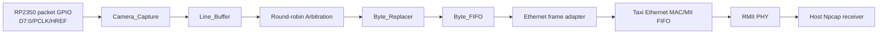
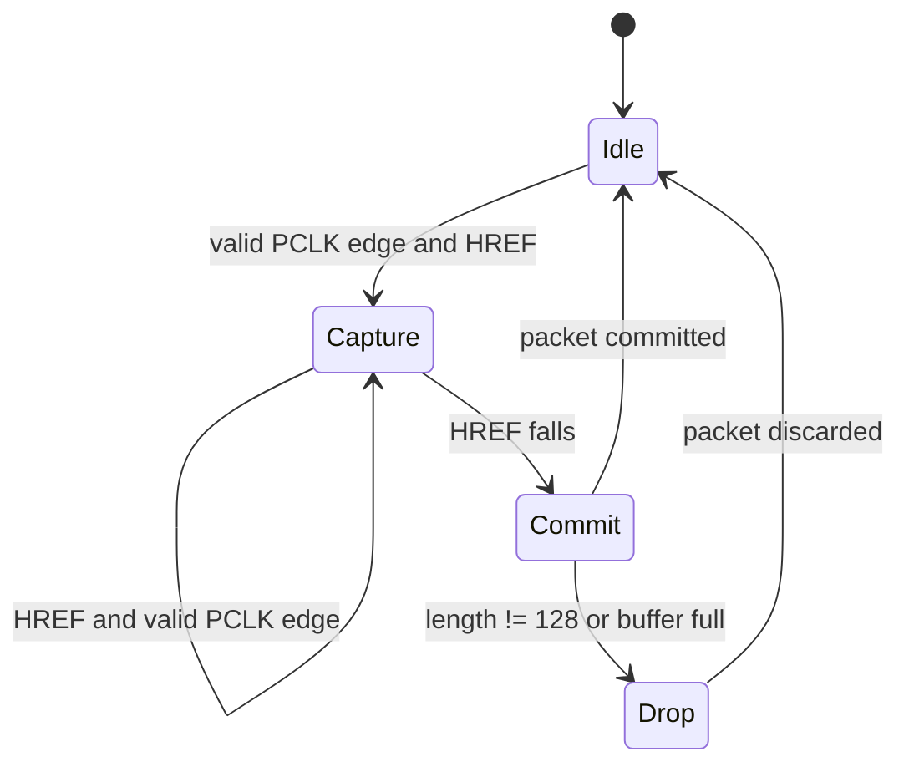
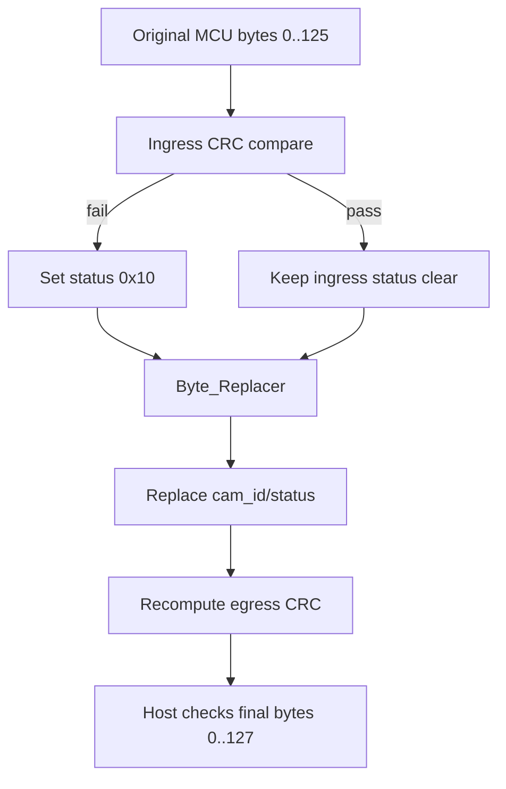
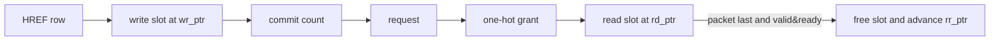
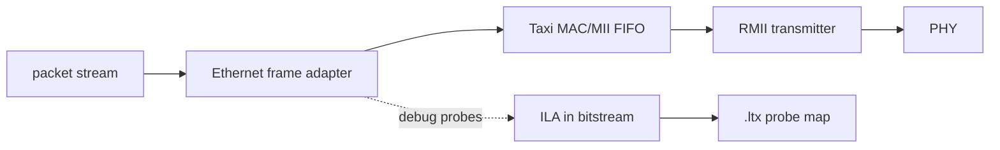

# FPGA-Based Camera Buffer

[中文说明](README.zh-CN.md)

A reproducible Vivado project for a four-camera, fixed 128-byte packet pipeline. The active design uses on-chip SRAM/FIFO buffering, packet-granular arbitration, FPGA-owned diagnostics, egress CRC regeneration, Ethernet/RMII output, and optional ILA instrumentation.

## Cold-start reading order

1. [MCU architecture and code](docs/01_mcu_architecture_and_code_guide.md)
2. [MCU build, run and debug](docs/02_mcu_build_run_and_debug_guide.md)
3. [FPGA architecture and third-party closure](docs/03_fpga_architecture_third_party_and_dataflow.md)
4. [Vivado, Tcl, reports and ILA](docs/04_fpga_vivado_tcl_ila_build_and_debug.md)
5. [Host receiver and publisher isolation](docs/05_host_receiver_architecture_and_reconstruction.md)
6. [Host diagnostics and calibration](docs/06_host_execution_diagnostics_and_calibration.md)
7. [Git and public release workflow](docs/07_git_clone_branch_commit_pr_and_release.md)

Read each architecture chapter before its execution chapter. The Chinese set is
under [`docs/ZH`](docs/ZH/).

## 1. Project overview and scope

This repository contains FPGA RTL, simulation sources, constraints, Vivado Tcl, debug helpers, and architecture documentation. The host receiver is maintained separately in [Host_Camera_Packet_Receiver](https://github.com/YuweiZhang-002/Host_Camera_Packet_Receiver).



The active tree is `prg_cam.srcs/`. `project_camera.srcs/` is retained as legacy/reference AXI4/DDR history. `prg_cam.srcs/sources_1/new/deprecated/` contains retired RTL and is not an active synthesis source set.

## 2. Why AXI4-DDR2 was removed

The current row packet is only 128 bytes and the required buffering is bounded to a few complete rows per camera. External AXI4-DDR2 added latency, generated IP state, arbitration complexity, and a larger reset/clocking surface without improving this bounded packet path. The FIFO/BRAM design keeps packet ownership local and makes backpressure observable.

## 3. SRAM/FIFO motivation and architecture

Each camera writes complete rows into a four-slot Line Buffer. Arbitration owns one complete packet at a time. Byte_Replacer changes only FPGA-owned metadata and recomputes the final CRC. Byte_FIFO decouples the packet pipeline from the Ethernet sink.

## 4. Clocking and camera capture

`DATA[7:0]`, `PCLK`, and `HREF/packet_valid` arrive from the RP2350 packet transmitter, not directly from the OV5640 sensor. `sys_clk` and this byte-clock domain are different clock domains. The current capture implementation synchronizes pclk activity into `sys_clk`; while HREF is high, only valid PCLK rising-edge samples are accepted. There is no VSYNC input. Row and frame boundaries come from packet metadata, with row 0 beginning a frame and row 479 ending the 480-row image.



The state above is a documentation view of implicit register state; the RTL uses counters, HREF history, byte-valid pulses, and commit/drop flags rather than a single explicit `state` register.

## 5. Active module list

- [Camera_Ethernet_Top.sv](prg_cam.srcs/sources_1/new/Camera_Ethernet_Top.sv): board-level Ethernet/clock/debug integration.
- [Camera_Pipeline.v](prg_cam.srcs/sources_1/new/Camera_Pipeline.v): four capture/buffer lanes and shared packet path.
- [Camera_Capture.v](prg_cam.srcs/sources_1/new/Camera_Capture.v): PCLK/HREF/data sampling and row metadata.
- [Line_Buffer.v](prg_cam.srcs/sources_1/new/Line_Buffer.v): four complete-packet slots and read/write accounting.
- [Arbitration.v](prg_cam.srcs/sources_1/new/Arbitration.v): packet-locked round-robin grant.
- [Byte_Replacer.v](prg_cam.srcs/sources_1/new/Byte_Replacer.v): cam/status replacement and CRC regeneration.
- [Byte_FIFO.v](prg_cam.srcs/sources_1/new/Byte_FIFO.v): 9-bit packet-data/last FIFO.
- [Ethernet_Frame_Adapter.sv](prg_cam.srcs/sources_1/new/Ethernet_Frame_Adapter.sv): Ethernet frame handshake adapter.
- [Taxi_Ethernet_Subsystem.sv](prg_cam.srcs/sources_1/new/Taxi_Ethernet_Subsystem.sv): Taxi MAC/MII FIFO integration.
- [Ethernet_Mii_Rmii_Bridge.sv](prg_cam.srcs/sources_1/new/Ethernet_Mii_Rmii_Bridge.sv): RMII-side transmit bridge.

## 6. Deprecated modules

Legacy modules remain under [deprecated](prg_cam.srcs/sources_1/new/deprecated/): AXI4 compiler/DDR path, Packet Formatter, Line/Pixel Generator, old Byte Replacer, and glue/control modules. They are reference material only and are not part of the active dataflow.

## 7. 128-byte packet protocol and flags

The active packet is 128 bytes: `0..3=A5 A0 5A 50`, `4=cam_id`, `5..6=frame_id` big-endian, `7..8=row_idx` big-endian, `9=sender row_flags`, `10=payload_len=80`, `11..12=row_seq`, `13=FPGA diagnostic status`, `14..23=reserved`, `24..103=80-byte image payload`, `104..113=padding`, `114..125=trailer`, and `126..127=CRC-16/CCITT-FALSE` over `0..125`.

Offset 9 belongs to the sender. Offset 13 is FPGA-owned: `0x01=Line Buffer overflow`, `0x08=ingress length error`, `0x10=MCU-to-FPGA ingress CRC error`. Byte_Replacer changes FPGA-owned fields and recomputes the egress CRC over the final bytes.

## 8. Ingress CRC and egress CRC

Ingress CRC is checked before FPGA packet mutation against original bytes `0..125`; a mismatch is carried as status `0x10`. Egress CRC is generated after cam/status replacement and is checked by the Host. Therefore a valid egress CRC with status `0x10` proves the ingress was bad but the FPGA-to-Host packet survived; an invalid egress CRC indicates corruption after or during FPGA output.



## 9. Arbitration, Line Buffer, and backpressure

Line Buffer write-side logic accepts a row into `wr_ptr`; commit increments `committed_count`. Read-side logic exposes the committed packet at `rd_ptr`. The buffer is full when all four slots are occupied; a new row is dropped as a whole and overflow is sticky for a later successful packet.



Arbitration is four-way round-robin. The grant stays fixed for all 128 bytes and is released only on `valid && ready && packet_last`. Backpressure propagates from Ethernet to Byte_FIFO, Byte_Replacer, the selected Line Buffer, and ultimately capture admission. FIFO full/almost-full conditions must not silently overwrite committed packets.

## 10. Byte_FIFO TX/RX/CNT relationship

Byte_FIFO uses a 9-bit word: bits `7:0` are data and bit `8` is packet-last. TX writes only on an accepted upstream transfer, RX reads only on an accepted downstream transfer, and CNT tracks occupancy. These responsibilities are separated into the FIFO's TX/RX/CNT sequential logic so simultaneous read/write preserves count and packet boundaries.

## 11. Ethernet/RMII and ILA

The Ethernet frame adapter converts the packet stream to the MAC-side ready/valid/last interface. Taxi Ethernet MAC/MII FIFO logic crosses into the PHY interface, and the RMII bridge emits the two-bit RMII transmit stream. ILA is embedded in the bitstream; Vivado does not create a standalone `.ila` file. The `.ltx` file stores probe mapping.



## 12. Simulation and hardware test

Core testbenches are under [simulation sources](prg_cam.srcs/sim_1/new/), including Camera_Capture HREF/PCLK boundary, narrow PCLK runt/glitch, 127/128/129-byte cases, ingress CRC, Byte_Replacer status separation, next-packet isolation, four-way arbitration, Line Buffer full/empty, Byte_FIFO backpressure, Ethernet frame handshake, and Taxi MII/RMII elaboration. Hardware tests require the target board, camera wiring, PHY, Vivado, and a privileged Host Npcap session.

```powershell
$vivado = '<VIVADO_BIN>' # replace with vivado.bat
$env:XILINX_LOCAL_USER_DATA = 'no'
& $vivado -mode batch -nolog -nojournal -source .\scripts\recreate_project.tcl
if ($LASTEXITCODE -ne 0) { throw 'project recreation failed' }
& $vivado -mode batch -nolog -nojournal -source .\scripts\validate_recreated_project.tcl
if ($LASTEXITCODE -ne 0) { throw 'isolated synthesis failed' }
Set-ExecutionPolicy -Scope Process -ExecutionPolicy Bypass
.\scripts_ps\run_ethernet_ila.ps1 -Action Build -VivadoBin $vivado
```

The cold-start authority is the isolated project created under `build/project_recreate_validation`; the historical root XPR is not an input to that flow. `run_ethernet_ila.ps1` dispatches build/program/observe/capture actions and records immutable run artifacts. Outputs include paired `Camera_Ethernet_Top_ila.bit`/`.ltx`, routed DCP, timing summary, DRC report, utilization report, log, and manifest. Local Vivado paths must be replaced by the user.

For the exact build -> program -> bounded trigger observation -> CSV capture
sequence, design-state requirements, report interpretation, bit/LTX pairing and
the preflight-capable PowerShell driver, see
[Vivado build, Tcl, ILA and debug](docs/04_fpga_vivado_tcl_ila_build_and_debug.md).

### External Ethernet dependencies

Third-party TAXI and RMII source trees are deliberately not vendored. Before running Ethernet synthesis, fetch them into the exact paths documented in [THIRD_PARTY_DEPENDENCIES.md](THIRD_PARTY_DEPENDENCIES.md). The `.gitignore` protects those local trees from an accidental `git add -A`. The detailed six-layer receiver, CSV/PGM output, intrinsic calibration, stereo pairing, and extrinsic validation implementation belongs to [Host_Camera_Packet_Receiver](https://github.com/YuweiZhang-002/Host_Camera_Packet_Receiver); it is not duplicated here.

## 13. Repository structure

```text
prg_cam.srcs/                 active RTL, simulation, constraints
project_camera.srcs/          legacy AXI4/DDR reference sources
docs/                         seven English cold-start guides
docs/ZH/                      seven matching Chinese guides
scripts/                      Vivado Tcl build and debug entry points
scripts_ps/                   preflight-capable PowerShell runtime drivers
```

Generated Vivado output, logs, caches, runs, bitstreams, PCAP/PCAPNG, image datasets, Python caches, and locally fetched third-party source trees are excluded by `.gitignore` and are not release inputs.

## 14. Development timeline

This timeline uses real commits from the source branch and does not infer milestones from file timestamps.

| Date | Commit | Milestone | Architectural impact |
|---|---|---|---|
| 2026-07-21 | `bf5efc7` | Taxi MII/RMII pre-hardware implementation | Established the Ethernet output path. |
| 2026-07-27 | `de56798` | Single-camera Ethernet transmission | Connected camera packet flow to Ethernet. |
| 2026-08-01 | `53f5ddf` | Two-camera pipeline update | Opened the multi-camera path and packet-head handling. |
| 2026-08-02 | `05543e2` | PCLK low-phase detection | Hardened asynchronous camera capture. |
| 2026-08-05 | `dc1bdf9` | Host congestion fix | Reduced receiver-side pressure in the integrated workflow. |
| 2026-08-21 | `6b69778` | Extrinsic pipeline and CRC verification | Added the current calibration workflow and CRC audit evidence. |

## 15. Known limitations

No board-level implementation or four-camera long-run result is claimed by repository presence alone. Pin constraints, PCLK margin, PHY configuration, and hardware packet loss must be validated on the target board. The current capture uses synchronized PCLK pulses; an asynchronous camera-clock FIFO may be required if the measured PCLK margin is insufficient.

## License

No top-level license file has been declared in this repository yet; until the owner adds one, the authored FPGA material remains under default copyright. TAXI and RMII dependencies are obtained separately and remain under their upstream licenses. This repository does not relicense or contain them. The Host receiver and calibration implementation is released separately under that repository's license.
