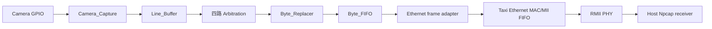
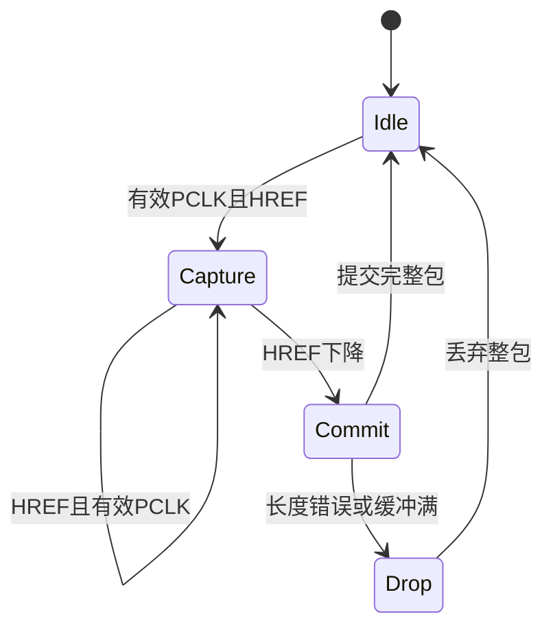
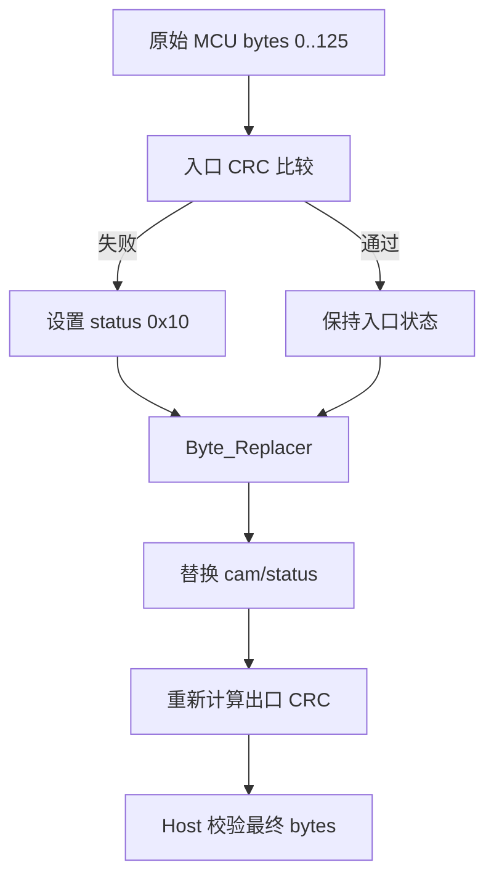
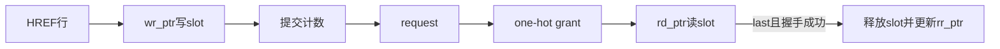
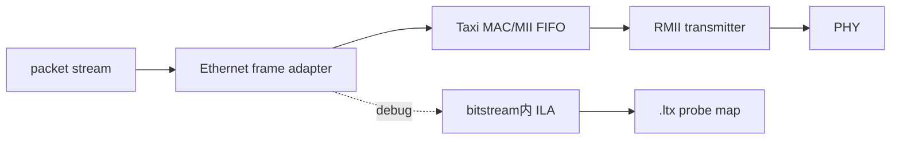

# FPGA-Based Camera Buffer

[English](README.md)

这是一个可复刻的 Vivado 四相机固定 128-byte 数据链路工程。当前架构使用片内 SRAM/FIFO、按完整包仲裁、FPGA 诊断状态、出口 CRC 重算、Ethernet/RMII 输出和可选 ILA 调试。Host 接收机位于独立仓库 [Host_Camera_Packet_Receiver](https://github.com/YuweiZhang-002/Host_Camera_Packet_Receiver)。

## 1. 项目范围与数据流

仓库包含 FPGA RTL、仿真、约束、Vivado Tcl、调试辅助脚本和架构文档。`prg_cam.srcs/` 是 active tree；`project_camera.srcs/` 保留为旧 AXI4/DDR 工程；`prg_cam.srcs/sources_1/new/deprecated/` 是废弃 RTL，不属于 active synthesis source set。



## 2. 移除 AXI4-DDR2 的原因

当前行包固定为 128 bytes，只需为每路保存有限数量的完整行。AXI4-DDR2 增加了延迟、生成 IP 状态、仲裁和复位时钟复杂度，却没有改善这个有界包路径。FIFO/BRAM 设计让包所有权和背压更直接可见。

## 3. Camera_Capture 与时钟

`DATA[7:0]`、`PCLK`、`HREF/packet_valid` 来自相机；`sys_clk` 与 `pclk` 不是同一时钟域。当前实现把 PCLK 活动同步到 `sys_clk`，HREF 为高时只在有效 PCLK 上升沿采样；没有 VSYNC。row0 开始帧，row479 结束 480 行图像。



这是由寄存器组合形成的隐式状态说明；RTL 使用计数器、HREF 历史、byte-valid pulse 和 commit/drop flags，没有单独的显式 state 寄存器。

## 4. Active 模块

- [Camera_Ethernet_Top.sv](prg_cam.srcs/sources_1/new/Camera_Ethernet_Top.sv)：板级 Ethernet、时钟和调试集成。
- [Camera_Pipeline.v](prg_cam.srcs/sources_1/new/Camera_Pipeline.v)：四路采集/缓冲和共享包路径。
- [Camera_Capture.v](prg_cam.srcs/sources_1/new/Camera_Capture.v)：PCLK/HREF/data 采样和行元数据。
- [Line_Buffer.v](prg_cam.srcs/sources_1/new/Line_Buffer.v)：四个完整包 slot 及读写计数。
- [Arbitration.v](prg_cam.srcs/sources_1/new/Arbitration.v)：按包锁定的 round-robin 授权。
- [Byte_Replacer.v](prg_cam.srcs/sources_1/new/Byte_Replacer.v)：cam/status 替换和 CRC 重算。
- [Byte_FIFO.v](prg_cam.srcs/sources_1/new/Byte_FIFO.v)：9-bit data/last FIFO。
- [Ethernet_Frame_Adapter.sv](prg_cam.srcs/sources_1/new/Ethernet_Frame_Adapter.sv)：Ethernet frame handshake。
- [Taxi_Ethernet_Subsystem.sv](prg_cam.srcs/sources_1/new/Taxi_Ethernet_Subsystem.sv)：Taxi MAC/MII FIFO 集成。
- [Ethernet_Mii_Rmii_Bridge.sv](prg_cam.srcs/sources_1/new/Ethernet_Mii_Rmii_Bridge.sv)：RMII 发送桥。

废弃模块位于 [deprecated](prg_cam.srcs/sources_1/new/deprecated/)，包括 AXI4/DDR、Packet Formatter、旧 Line/Pixel Generator、旧 Byte Replacer 和 glue/control 模块，仅供参考。

## 5. 128-byte 协议与 CRC

`0..3=A5 A0 5A 50`，`4=cam_id`，`5..6=frame_id` 大端，`7..8=row_idx` 大端，`9=sender row_flags`，`10=payload_len=80`，`11..12=row_seq`，`13=FPGA diagnostic status`，`14..23=reserved`，`24..103=80-byte payload`，`104..113=padding`，`114..125=trailer`，`126..127=对 0..125 的 CRC-16/CCITT-FALSE`。

Offset 9 属于发送端；offset 13 属于 FPGA：`0x01=Line Buffer overflow`、`0x08=入口长度错误`、`0x10=MCU 到 FPGA 入口 CRC 错误`。入口 CRC 在 FPGA 修改包前校验原始 bytes 0..125；Byte_Replacer 修改 cam/status 后重新计算出口 CRC。出口 CRC 正确但状态 `0x10` 表示入口错误但 FPGA 到 Host 正常；出口 CRC 错误表示 FPGA 输出之后发生损坏。



## 6. Line_Buffer、Arbitration 与背压

Line_Buffer 写端在 `wr_ptr` 写入一行，提交后增加 `committed_count`；读端从 `rd_ptr` 输出完整包。四个 slot 全满时整包丢弃，overflow sticky 到之后成功包。四路 Arbitration 使用 round-robin；grant 在 128 bytes 内保持不变，只在 `valid && ready && packet_last` 时释放。



背压从 Ethernet 依次传播到 Byte_FIFO、Byte_Replacer、被授权的 Line_Buffer 和采集入口；FIFO 满/almost_full 不能覆盖已提交包。

## 7. Byte_FIFO、Ethernet/RMII 与 ILA

Byte_FIFO 使用 9-bit word：`7:0` 是 data，`8` 是 packet-last。TX 只在上游握手成功时写，RX 只在下游握手成功时读，CNT 记录 occupancy；TX/RX/CNT 分工保证同时读写时计数和包边界正确。Ethernet frame adapter 连接 ready/valid/last 到 Taxi MAC/MII FIFO，RMII bridge 输出 PHY 的两位 RMII 流。ILA 在 bitstream 内，不存在独立 `.ila` 文件；`.ltx` 保存 probe 映射。



## 8. 仿真、Vivado 构建和硬件测试

[仿真目录](prg_cam.srcs/sim_1/new/) 包含 Camera_Capture HREF/PCLK 边界、窄 PCLK 毛刺/短脉冲、127/128/129-byte、入口 CRC、Byte_Replacer 状态隔离、错误包后下一包、四路仲裁、Line_Buffer 满/空、Byte_FIFO 背压、Ethernet handshake 和 Taxi MII/RMII elaboration 测试。真实硬件测试需要目标板、相机、PHY、Vivado 和 Host Npcap。

```powershell
$vivado = '<VIVADO_BIN>'
& $vivado -mode batch -source .\scripts\check_project.tcl
& $vivado -mode batch -source .\scripts\synth_fifo_pipeline.tcl
& $vivado -mode batch -source .\scripts\build_ethernet_ila.tcl
& $vivado -mode batch -source .\scripts\program_ethernet_ila.tcl
& $vivado -mode batch -source .\scripts\capture_ethernet_ila.tcl
```

主要脚本为 `check_project.tcl`、`synth_fifo_pipeline.tcl`、`build_ethernet_ila.tcl`、`program_ethernet_ila.tcl`、`rebuild_gui_ethernet.tcl` 和 `capture_ethernet_ila.tcl`。输出包括 `Camera_Ethernet_Top.bit`、`Camera_Ethernet_Top_ila.bit`、`Camera_Ethernet_Top_ila.ltx`、routed DCP、timing summary、DRC report 和 utilization report。Vivado 绝对路径必须由用户替换。

### 外部 Ethernet 依赖

本仓库有意不内嵌 TAXI 与 RMII 第三方源码。运行 Ethernet 综合前，应按 [THIRD_PARTY_DEPENDENCIES.md](THIRD_PARTY_DEPENDENCIES.md) 将上游项目放入脚本要求的精确路径；`.gitignore` 会阻止这些本地依赖被 `git add -A` 误上传。六层 Python 接收机、CSV/PGM 输出、内参、双目配对与外参验证的详细实现归属于 [Host_Camera_Packet_Receiver](https://github.com/YuweiZhang-002/Host_Camera_Packet_Receiver)，不在 FPGA 仓库重复维护。

## 9. 仓库结构与排除项

```text
prg_cam.srcs/                 active RTL、仿真、约束
project_camera.srcs/          legacy AXI4/DDR 工程
 docs/                        架构、报告和复刻说明
scripts/                      Vivado Tcl 与调试 PowerShell
scripts_ps/                   FPGA 运行辅助脚本
```

Vivado 生成目录、日志、cache、runs、bitstream、PCAP/PCAPNG、图像数据集、Python cache 和本地下载的第三方源码均由 `.gitignore` 排除。

## 10. 基于真实 Git 历史的开发时间线

以下使用源分支真实提交，不按文件修改时间推断：

| 日期 | Commit | 里程碑 | 架构影响 |
|---|---|---|---|
| 2026-07-21 | `bf5efc7` | Taxi MII/RMII pre-hardware | 建立 Ethernet 输出路径。 |
| 2026-07-27 | `de56798` | 单相机 Ethernet 发送 | 将相机包路径连接到 Ethernet。 |
| 2026-08-01 | `53f5ddf` | 双相机 pipeline 更新 | 打开多相机路径并修正包头处理。 |
| 2026-08-02 | `05543e2` | PCLK 低相位检测 | 加固异步相机采集。 |
| 2026-08-05 | `dc1bdf9` | Host congestion 修复 | 降低集成流程的接收端压力。 |
| 2026-08-21 | `6b69778` | Extrinsic pipeline 与 CRC verification | 加入当前标定流程和 CRC 审计证据。 |

## 11. 已知限制

仓库中存在 RTL 或脚本不等于已经完成板级实现。引脚约束、PCLK 余量、PHY 配置和长时间四相机丢包必须在目标硬件上验证。当前实现使用同步后的 PCLK pulse；若实测余量不足，需要改为 pclk 写、sys_clk 读的异步 FIFO。

## License

当前 FPGA 仓库尚未声明顶层 `LICENSE` 文件；在仓库所有者补充许可证之前，自研 FPGA 内容按默认版权保护处理。TAXI 与 RMII 依赖由使用者另行获取并遵循各自上游许可证，本仓库不包含也不重新授权这些源码。Host 接收与标定实现遵循其独立仓库的许可证。
