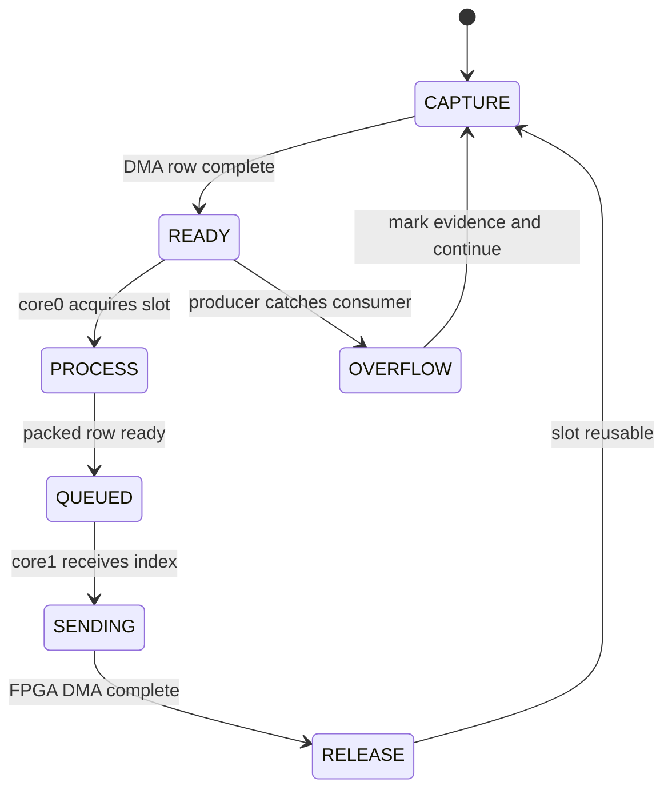

# 01 · MCU Architecture and Code Guide

## OBJECTIVE

Explain how the RP2350/RP2354-side OV5640 firmware turns an 8-bit camera bus
into fixed 128-byte rows for the FPGA.  This guide describes the public source
at `-RP2354A-OV5640-Camera-Module`; it does not promote an MCU observation into
an FPGA or Host PASS.

## INPUTS / DEPENDENCIES

Clone layout used throughout this series:

```text
D:\prg\blank_project\
├── RP2354A-OV5640-Camera-Module\
├── FPGA-Based-Camera-Buffer\
└── Host_Camera_Packet_Receiver\
```

The active MCU executable is declared by `CMakeLists.txt:55-66`.  The reusable
`func` target lists `ov5640.c`, `timer.c`, `cam_pio.c`, `fpga_pio.c` and
`image_process.c` at `func/CMakeLists.txt:4-13`.  `func/hstx.c` and `func/imu.c`
exist but are not linked by that list; they are not part of the active packet
path.

## RUN IDENTITY

Record at least the MCU Git hash, dirty state, generated UF2 SHA-256, camera
module identity and FPGA/Host hashes in the experiment `run_manifest.json`.
The firmware currently puts no build hash into the 128-byte packet, so a later
CSV cannot recover MCU identity on its own.

## ACTIVE DATA FLOW

```mermaid
flowchart LR
  subgraph A[Column 1 · sensor ingress]
    S[OV5640 D0..D7] --> P[PIO0 SM0]
    V[VSYNC] --> G[PIO0 SM1 gate]
    P --> D[DMA row capture]
  end
  subgraph B[Column 2 · processing]
    D --> T[three row buffers]
    T --> E[Sobel plus threshold]
    E --> B[80 byte packed row]
  end
  subgraph C[Column 3 · egress]
    B --> K[128 byte packet]
    K --> Q[core FIFO]
    Q --> X[PIO1 plus DMA]
    X --> F[FPGA pins]
  end
  G -.qualified frame boundary.-> D
```

`main()` initializes GPIO, PIO and DMA at `main.c:42-75`.  Core 0 obtains
completed rows and sends absolute row indices through the multicore FIFO at
`main.c:93-115`.  Core 1 blocks on that FIFO, builds the row packet, waits for
the previous FPGA DMA transfer, and launches the next transfer at
`main.c:144-171`.  Capture and transmission therefore do not execute in one
camera interrupt.

PIO0 SM0 waits for HREF and samples one byte across PCLK high/low at
`cam_pio.pio:84-90`.  SM1 qualifies VSYNC width and raises a PIO interrupt at
`cam_pio.pio:38-50`; short disturbances are not automatically promoted to a
frame boundary.  The DMA is configured for byte transfers, fixed PIO RX
address and incrementing memory destination at `func/cam_pio.c:196-216`.

## BUFFER OWNERSHIP ASM



The three capture buffers and producer/send/consumer sequences live at
`func/cam_pio.c:63-84`.  `cam_acquire_line()` and `cam_release_line()` are the
public ownership boundary at `func/cam_pio.c:301-333`.  A buffer must not be
reused merely because image processing started; it becomes reusable only after
the documented release path.

## IMAGE PROCESSING

The algorithm uses a three-row Sobel window.  `fused_row_sq()` computes the
gradient magnitude terms at `func/image_process.c:96-182`; the packed binary
row is produced by `filter_pack_row_bits()` at
`func/image_process.c:184-232`.  The project stores one output bit per pixel,
so 640 pixels become 80 payload bytes.

For horizontal and vertical gradients \(G_x,G_y\), the threshold decision is

\[
b(x,y)=\begin{cases}1,&G_x^2+G_y^2\ge T^2\\0,&\text{otherwise.}\end{cases}
\]

`T_sq` starts at `14400` at `func/image_process.c:16`; it is a code value, not
a universal calibration threshold.  A dark target, broken circles or a changed
exposure can therefore reduce OpenCV grid detection without any packet loss.

## 128-BYTE WIRE CONTRACT

`packet_generator()` is the source of truth at
`func/image_process.c:234-273`.

| Offset | Meaning | Current MCU action | Downstream invariant |
|---:|---|---|---|
| 0–3 | sync | writes `A5 A0 5A 50` | Host selects current big-endian layout |
| 4 | cam_id | MCU writes placeholder/current ID | FPGA may replace with physical lane ID |
| 5–6 | frame_id | big-endian | Host parses as one 16-bit value |
| 7–8 | row_idx | big-endian | row 0 defines frame start |
| 9 | sender flags | overflow, final row, first processed row | FPGA must preserve byte exactly |
| 10 | payload_len | 80 | parser range and fixed-payload checks |
| 11–12 | row_seq | big-endian monotonic counter | monitor detects gaps/duplicates |
| 13 | reserved | MCU writes zero | FPGA owns diagnostic status here |
| 24–103 | image payload | 80 packed bytes | bit order is independent of word byte order |
| 126–127 | CRC16 | high byte then low byte | CRC-16/CCITT-FALSE over offsets 0–125 |

`wire_u16()` is declared at `func/image_process.c:33-39`; sync, frame, row and
sequence use it at `func/image_process.c:239-254`.  The calculated CRC is also
written through `wire_u16()` at `func/image_process.c:272`.  Consequently the
current `A5 A0 5A 50` CRC tail is big-endian.  The Host keeps little-endian only
for the archived `A5 A5 5A 5A` regression vector.

Offset 9 bit 2 is easily misread.  `main.c:152` sets it when
`frame_row_idx == 2`, because row 2 is the first output with three source rows.
It is not frame start.  Consumers derive frame start from `row_idx == 0`.

## OBSERVED VS EXPECTED

| Probe | Expected | Current observed in source | Interpretation |
|---|---|---|---|
| Active capture engine | PIO0 + DMA | `cam_pio.c` linked | PASS · source closure |
| Active output engine | PIO1 + DMA | `fpga_pio.c` linked | PASS · source closure |
| First-processed flag | row 2 | `main.c:152` | PASS |
| CRC wire order | high then low | `wire_u16(packet_crc)` | PASS |
| Physical packet capture | 128 stable bytes | no public cold-start trace in repository | NOT RUN |

## FAILURE HANDLING

### Camera produces no rows

Use the first-zero rule: VSYNC activity → qualified SM1 interrupt → PIO0 RX
words → DMA completion → producer sequence → core FIFO → PIO1 DMA.  If VSYNC
exists but the SM1 interrupt is zero, inspect polarity/pulse width and
`cam_pio.pio:38-50`.  If DMA completion is zero, inspect PCLK/HREF and the PIO
wait states.  Do not change Host routing while the first zero remains on MCU.

### A bit changes from 0 to 1

Freeze one row and compare the same bit at four points: OV5640 GPIO sample,
DMA buffer, packed payload before `packet_generator()`, and FPGA input pins.
If the DMA buffer is already wrong, investigate electrical level, pull-up and
PIO phase.  If only the packed payload differs, investigate Sobel/threshold
logic and bit packing.  If MCU memory is correct but FPGA input is wrong,
investigate the physical bus and FPGA capture phase.

### CRC status `0x10`

The MCU calculates CRC over bytes 0–125.  FPGA ingress status `0x10` means its
received tail did not match its calculation; it does not mean the Host's
egress CRC failed.  Calibration does not enable or disable this mechanism.

## PASS / FAIL

PASS requires source build success, visible PIO/DMA progress, a golden packet
matching the table, and no unexplained row-sequence gaps.  A successful MCU
build alone is only a build PASS.

## NEXT ACTION

Continue with [02 · MCU Build, Run and Debug](02_mcu_build_run_and_debug_guide.md),
then cross the FPGA pin boundary using
[03 · FPGA Architecture and Data Flow](03_fpga_architecture_third_party_and_dataflow.md).
