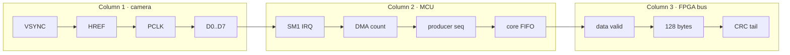

# 02 · MCU Build, Run and Debug Guide

## OBJECTIVE

Clone, configure, build and diagnose the MCU firmware without depending on the
author's original `pico-sdk-master` folder.  Commands are PowerShell commands;
run them in a normal PowerShell terminal or the VS Code integrated PowerShell
terminal.

## INPUTS / DEPENDENCIES

- Git.
- CMake and Ninja or another supported CMake generator.
- Raspberry Pi Pico SDK compatible with the repository (`sdkVersion` is 2.2.0
  in `CMakeLists.txt:8`).
- Arm embedded toolchain supported by that SDK.
- RP2350/RP2354 board programming/debug hardware.

The repository uses the tracked standard `pico_sdk_import.cmake`; the SDK is a
local-only dependency resolved through `PICO_SDK_PATH`.

## RUN IDENTITY AND DIRECTORY VARIABLES

```powershell
$blankRoot = 'D:\prg\blank_project'
$mcuRoot = Join-Path $blankRoot 'RP2354A-OV5640-Camera-Module'
$mcuBuild = Join-Path $mcuRoot 'build\release'
$picoSdk = '<absolute path containing pico_sdk_init.cmake>' # replace
$runId = '{0:yyyyMMdd_HHmmss}_mcu_build' -f (Get-Date)
$evidenceRoot = Join-Path $mcuRoot ("build\evidence\$runId")
```

The value for `$picoSdk` comes from the installed Pico SDK, not from this Git
repository.  Verify it before configuration:

```powershell
$precheck = @(
  [pscustomobject]@{Name='MCU root';Pass=Test-Path $mcuRoot -PathType Container}
  [pscustomobject]@{Name='SDK';Pass=Test-Path (Join-Path $picoSdk 'pico_sdk_init.cmake') -PathType Leaf}
  [pscustomobject]@{Name='CMake';Pass=$null -ne (Get-Command cmake -ErrorAction SilentlyContinue)}
  [pscustomobject]@{Name='Git';Pass=$null -ne (Get-Command git -ErrorAction SilentlyContinue)}
)
$precheck | Format-Table -AutoSize
if (@($precheck | Where-Object { -not $_.Pass }).Count -ne 0) {
  throw 'MCU precheck failed'
}
```

## DRY-RUN / CONFIGURE

Clone only if the directory does not already exist:

```powershell
if (!(Test-Path $mcuRoot)) {
  git clone https://github.com/YuweiZhang-002/-RP2354A-OV5640-Camera-Module $mcuRoot
}
git -C $mcuRoot status --short --branch
git -C $mcuRoot rev-parse HEAD
```

Configure a separate build directory.  This command does not program hardware:

```powershell
$env:PICO_SDK_PATH = $picoSdk
cmake -S $mcuRoot -B $mcuBuild -G Ninja `
  -DPICO_PLATFORM=rp2350 `
  -DPICO_BOARD=pico2 `
  -DCMAKE_BUILD_TYPE=Release
if ($LASTEXITCODE -ne 0) { throw 'MCU CMake configure failed' }
```

Expected evidence includes SDK discovery, `func` target configuration and PIO
header generation rules from `func/CMakeLists.txt:20-27`.  A configure PASS is
not a compiler PASS.

## MAIN BUILD

```powershell
cmake --build $mcuBuild --config Release --parallel
$mcuBuildExit = $LASTEXITCODE
if ($mcuBuildExit -ne 0) {
  throw "MCU build failed with exit code $mcuBuildExit"
}
```

Locate artifacts without assuming the generator's subdirectory layout:

```powershell
$artifacts = @(
  Get-ChildItem -LiteralPath $mcuBuild -Recurse -File -ErrorAction SilentlyContinue |
    Where-Object Extension -in '.uf2','.elf','.bin','.hex'
)
$artifacts | Select-Object FullName,Length,LastWriteTime | Format-Table -AutoSize
if (@($artifacts | Where-Object Extension -eq '.uf2').Count -eq 0) {
  throw 'Build returned success but generated no UF2'
}
```

## VALIDATE AND EXPORT

```powershell
New-Item -ItemType Directory -Force -Path $evidenceRoot | Out-Null
$artifactRows = @(
  foreach ($artifact in $artifacts) {
    [pscustomobject]@{
      path = $artifact.FullName
      bytes = $artifact.Length
      sha256 = (Get-FileHash -LiteralPath $artifact.FullName -Algorithm SHA256).Hash
    }
  }
)
$artifactRows | ConvertTo-Json -Depth 4 |
  Set-Content -LiteralPath (Join-Path $evidenceRoot 'mcu_artifacts.json') -Encoding UTF8
```

Before programming, compare the selected UF2 SHA to the manifest.  The exact
programming command depends on the available probe or BOOTSEL workflow and is
therefore **UNVERIFIED on a cold machine**; do not invent an OpenOCD interface
name.  If a mass-storage BOOTSEL drive is used, confirm the exact destination
drive interactively before copying.

## HARDWARE OBSERVATION PLAN



Use the logic analyser in that order.  Record clock scale, voltage threshold,
probe ground and signal names.  A trace without those facts is not reusable
evidence.

## CRC GOLDEN PACKET CHECK

The current firmware contract is CRC-16/CCITT-FALSE: polynomial `0x1021`, init
`0xFFFF`, no reflection, xor-out `0`, bytes 0–125, high byte at offset 126.
After capturing one 128-byte payload, use the Host parser:

```powershell
$hostRoot = Join-Path $blankRoot 'Host_Camera_Packet_Receiver'
$python = Join-Path $hostRoot '.venv\Scripts\python.exe'
Set-Location $hostRoot
& $python -m pytest tests/test_packet_format.py -q
if ($LASTEXITCODE -ne 0) { throw 'Host/MCU packet contract regression failed' }
```

For a real packet, save the 128 payload bytes first; do not hand-copy hex from
a formatted terminal because a missing byte invalidates every later field.

## CAM0 OR CAM1 REJECTED: FIRST-FAILURE TABLE

| First failed observable | Likely layer | Next exact inspection |
|---|---|---|
| no VSYNC | sensor/configuration | OV5640 SCCB setup in `ov5640.c` and XCLK |
| VSYNC but no qualified IRQ | PIO gate | polarity and pulse width at `cam_pio.pio:38-50` |
| IRQ but no DMA completion | HREF/PCLK/PIO | waits at `cam_pio.pio:84-90`, DREQ at `cam_pio.c:204-209` |
| DMA advances but core FIFO does not | ownership/processing | acquire/release and `main.c:93-115` |
| FIFO advances but FPGA pins do not | PIO1/DMA output | `fpga_pio.c`, pin mux and DMA busy |
| one camera only fails after FPGA | not MCU-proven | continue at FPGA per-lane capture counters |

## OBSERVED VS EXPECTED

| Check | Expected | Repository evidence | Status |
|---|---|---|---|
| SDK vendored | no | standard import helper | PASS · boundary |
| Active target | `new_camera_project_app` | `CMakeLists.txt:55-66` | PASS |
| Current local build | UF2/ELF and hashes | must be rerun on clone | NOT RUN |
| Physical dual-camera output | both buses progress | needs hardware | NOT RUN |

## FAILURE HANDLING

- CMake says SDK not found: correct `$picoSdk`/`PICO_SDK_PATH`; do not copy a
  random SDK into the repository.
- PIO header missing: confirm `pico_generate_pio_header` ran and the `func`
  target is part of the configure graph.
- Link errors from `hstx`/`imu`: those files are not active; check whether a
  local edit added them accidentally.
- Build succeeds but no data: switch from build evidence to the first-failure
  hardware table; recompiling unchanged source is not diagnosis.

## PASS / FAIL

Build PASS: configure exit 0, build exit 0, expected artifacts and hashes.
Hardware PASS: build PASS plus a captured, correctly sized and CRC-consistent
packet stream.  Cross-repository PASS requires the later FPGA and Host gates.

## NEXT ACTION

Read [03 · FPGA Architecture, Third-Party Dependencies and Data Flow](03_fpga_architecture_third_party_and_dataflow.md)
before wiring the MCU output bus into the FPGA.
