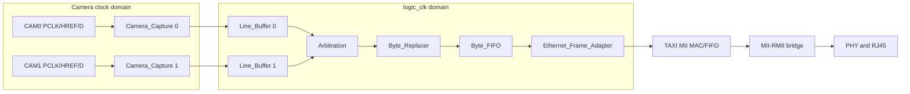

# FPGA architecture, third-party Ethernet closure, and data flow

## OBJECTIVE

This chapter reproduces the active FPGA data path from the two camera byte buses to RMII. It identifies which RTL is first-party, which RTL must be obtained separately, and which handshakes preserve packet boundaries. It does not treat the deprecated AXI/DMA files under `prg_cam.srcs/sources_1/new/deprecated/` as active design sources.

The active top is `Camera_Ethernet_Top` (`prg_cam.srcs/sources_1/new/Camera_Ethernet_Top.sv:15`). The camera path is selected by `USE_CAMERA_PIPELINE=1`; CAM1 is selected by `ENABLE_CAM1=1` (`Camera_Ethernet_Top.sv:16-23`). The authoritative source closure is encoded by `scripts/recreate_project.tcl`, not by whatever files happen to remain in an old local Vivado project.

## INPUTS / DEPENDENCIES

First-party modules:

| Stage | Source anchor | Contract |
|---|---|---|
| Top-level selection and observability | `Camera_Ethernet_Top.sv:15-23` | Select camera/fixed packet path and CRC policy |
| Camera byte qualification | `Camera_Capture.v:16-31` | Qualify PCLK/HREF and produce one 128-byte row packet |
| Per-camera packet storage | `Line_Buffer.v:29-52` | Four complete packet slots; stable ready/valid output |
| Packet arbitration | `Arbitration.v:13-18` | Hold one-hot grant until the complete packet is released |
| Header replacement and CRC output | `Byte_Replacer.v:16-22` | Replace offsets 4/13 and emit offsets 126/127 |
| Final byte FIFO | `Byte_FIFO.v:14-30` | Absorb downstream backpressure; keep byte and `last` together |
| Ethernet frame envelope | `Ethernet_Frame_Adapter.sv:7` | Add Ethernet addresses/EtherType around the 128-byte payload |
| MII MAC integration | `Taxi_Ethernet_Subsystem.sv:7,73-84` | AXI-stream handshake into TAXI; permanently drain unused outputs |
| MII/RMII conversion | `Ethernet_Mii_Rmii_Bridge.sv:7` | Connect the TAXI MII port to the board RMII PHY interface |

Third-party dependencies are deliberately not vendored. Clone them beneath the documented local-only boundary:

```powershell
$fpga = 'D:\prg\blank_project\FPGA-Based-Camera-Buffer'
New-Item -ItemType Directory -Force -Path (Join-Path $fpga 'third_party') |
  Out-Null

git clone https://github.com/fpganinja/taxi.git `
  (Join-Path $fpga 'third_party\taxi')
git -C (Join-Path $fpga 'third_party\taxi') `
  checkout bc4a6d3f2aa30156267ad279682e66d99558a633

git clone https://github.com/WangXuan95/FPGA-RMII-SMII.git `
  (Join-Path $fpga 'third_party\FPGA-RMII-SMII')
git -C (Join-Path $fpga 'third_party\FPGA-RMII-SMII') `
  checkout 5fef5b5641029777655c5fc34228c3a8b13e4ac9
```

The pinned layout and upstream license identities are recorded in `third_party/README.md`. TAXI is CERN-OHL-S-2.0 and the RMII repository is GPL-3.0; cloning these dependencies is a dependency-closure operation, not a transfer of their source into this repository.

## RUN IDENTITY

Before simulation, synthesis, or hardware capture, record the first-party and third-party identities. An empty PowerShell pipeline is avoided by materializing arrays:

```powershell
$fpga = 'D:\prg\blank_project\FPGA-Based-Camera-Buffer'
$identity = [ordered]@{
  run_id       = Get-Date -Format 'yyyyMMdd_HHmmss_fff'
  fpga_head    = (& git -C $fpga rev-parse HEAD).Trim()
  fpga_dirty   = @(& git -C $fpga status --porcelain).Count -gt 0
  taxi_head    = (& git -C (Join-Path $fpga 'third_party\taxi') rev-parse HEAD).Trim()
  rmii_head    = (& git -C (Join-Path $fpga 'third_party\FPGA-RMII-SMII') rev-parse HEAD).Trim()
  top          = 'Camera_Ethernet_Top'
  packet_bytes = 128
  ether_type   = '0x88B5'
}
$identity | ConvertTo-Json -Depth 4
```

Do not promote a prior bitstream, LTX, report, or ILA CSV into a new run merely because its filename matches. Hash the actual artifacts used by the run.

## PRECHECK

```powershell
$required = @(
  'prg_cam.srcs\sources_1\new\Camera_Ethernet_Top.sv',
  'prg_cam.srcs\sources_1\new\Camera_Pipeline.v',
  'prg_cam.srcs\sources_1\new\Camera_Capture.v',
  'prg_cam.srcs\sources_1\new\Line_Buffer.v',
  'prg_cam.srcs\sources_1\new\Arbitration.v',
  'prg_cam.srcs\sources_1\new\Byte_Replacer.v',
  'prg_cam.srcs\sources_1\new\Byte_FIFO.v',
  'third_party\taxi\src\eth\rtl\taxi_eth_mac_mii_fifo.f',
  'third_party\FPGA-RMII-SMII\RTL\rmii_phy_if.v'
)
$missing = @(
  foreach ($relative in $required) {
    $path = Join-Path $fpga $relative
    if (!(Test-Path -LiteralPath $path -PathType Leaf)) { $path }
  }
)
if ($missing.Count -ne 0) {
  throw "Dependency closure incomplete:`n$($missing -join "`n")"
}
```

`scripts/add_taxi_sources.tcl` resolves the TAXI `.f` manifests. `scripts/add_ethernet_bringup_sources.tcl` adds the first-party top and RMII source. Do not guess module names or add the entire third-party repositories recursively: duplicate packages and unrelated testbench modules can change compile order or cause name collisions.

## DRY-RUN

Use the isolated project creator to avoid modifying a historical GUI project:

```powershell
$vivado = 'D:\Xilinx_Vivado\2025.2.1\Vivado\bin\vivado.bat' # <- local install
Set-Location $fpga
& $vivado -mode batch -nolog -nojournal `
  -source .\scripts\recreate_project.tcl
if ($LASTEXITCODE -ne 0) { throw 'Isolated Vivado project creation failed' }
```

This creates `build/project_recreate_validation/prg_cam.xpr`. It does not overwrite root `prg_cam.xpr`. The root project currently contains stale references and is therefore historical evidence, not the validated cold-start entry point.

## MAIN: packet flow and ownership



### Camera capture

`Camera_Capture` qualifies asynchronous-looking camera pins in the logic clock domain, recognizes HREF row boundaries, samples one byte per qualified PCLK event, and checks that the row has exactly `PACKET_BYTES=128` bytes. Its frame count rolls after `LINES_PER_FRAME=480`, because this active path does not use VSYNC as a frame delimiter (`Camera_Capture.v:16-31`). A line-length fault is recorded as metadata; the module does not invent a shorter valid packet.

The ingress CRC checker is separate from output CRC generation. With `INGRESS_CRC_ENABLE=1`, it computes CRC-16/CCITT-FALSE over offsets 0..125 and compares the MCU's big-endian bytes at 126/127 (`Camera_Capture.v:148-158,290-293`). A mismatch contributes FPGA status bit `0x10` at output offset 13. With ingress checking disabled, this comparison is not performed; that does not disable the downstream output CRC generator.

### Complete-packet buffering and arbitration

`Line_Buffer` owns four 128-byte slots (`Line_Buffer.v:29-31,79`). A slot becomes requestable only after the row has committed. The transmitter prefetches offset 0 and holds `tx_data`, `tx_valid`, and packet metadata stable until `tx_ready` accepts the byte (`Line_Buffer.v:161-165,257-281`).

`Arbitration` encodes ownership directly in `grant_onehot`. It selects a requester only while no owner exists and does not change the grant until `released` arrives (`Arbitration.v:7-8,69-85`). Therefore bytes from two cameras cannot interleave inside one 128-byte packet. A grant change before `packet_last && ready` is a design failure.

### Replacement and final buffering

`Byte_Replacer` is a two-buffer packet transform. It accepts the next packet while the other buffer drains, patches offset 4 with FPGA camera ID, preserves sender flags at offset 9 byte-for-byte, writes FPGA diagnostics at offset 13, and writes either computed CRC high/low or `FF/FF` at offsets 126/127 (`Byte_Replacer.v:6-22,129-136`). `in_ready` is asserted only when the capture buffer is active or a free buffer exists (`Byte_Replacer.v:99`). Backpressure can pause capture from `Line_Buffer`; it must never shift the packet tail.

`Byte_FIFO` stores `{last,data}` as one 9-bit word. `push = in_valid && in_ready`; output advances only under its registered valid/ready rule (`Byte_FIFO.v:61-69`). `almost_full` reserves one packet of headroom but is diagnostic; `in_ready` is the actual lossless flow-control signal.

### Ethernet transport

`Ethernet_Frame_Adapter` turns the fixed payload into the Ethernet stream. `Taxi_Ethernet_Subsystem` maps `frame_valid`, `frame_last`, and `frame_ready` to AXI-stream `tvalid`, `tlast`, and `tready` (`Taxi_Ethernet_Subsystem.sv:73-78`). Unused RX/completion/stat streams are held ready to prevent internal backpressure (`Taxi_Ethernet_Subsystem.sv:82-84`). The MII/RMII bridge then serializes the MAC's 4-bit MII transfer onto the board PHY's 2-bit RMII interface.

## VALIDATE

The minimum source and synthesis validation is:

```powershell
& $vivado -mode batch -nolog -nojournal `
  -source .\scripts\validate_recreated_project.tcl
$validateExit = $LASTEXITCODE
if ($validateExit -ne 0) { throw "Synthesis validation failed: $validateExit" }
```

The validated isolated run resolved 11 first-party RTL files, 26 TAXI RTL files, the RMII dependency, and 15 simulation sources. It synthesized `Camera_Ethernet_Top` without unresolved black boxes. This is a source-closure PASS, not yet an implementation/timing or physical-camera PASS.

Protocol invariants should also be checked in simulation or ILA:

| Probe | Expected | Current interpretation |
|---|---|---|
| `camera_arb_grant` | zero or one-hot; stable for 128 transfers | packet ownership |
| `selected_valid && replacer_in_ready` | exactly one accepted source byte | replacement ingress |
| `replaced_valid && replaced_ready` | exactly one accepted output byte | replacement egress |
| `camera_packet_last` | asserted only on offset 127 | FIFO packet boundary |
| payload offset 4 | configured camera ID | host lane routing |
| payload offset 9 | unchanged MCU sender flags | MCU semantic ownership |
| payload offset 13 | independent FPGA status | FPGA diagnostic ownership |
| payload offsets 126/127 | big-endian CRC or `FF FF` per build | CRC policy |

## OBSERVED vs EXPECTED

| Boundary | Expected | Observed in isolated validation | Result |
|---|---|---|---|
| Source closure | no unresolved modules | no final black boxes | PASS |
| Active top | `Camera_Ethernet_Top` | top set by recreate script | PASS |
| Camera mode | pipeline and CAM1 enabled | generics set to 1 | PASS |
| CRC policy | ingress audit and egress regeneration explicit | both generics set to 1 | PASS for configuration; hardware CRC evidence still run-specific |
| Synthesis | zero errors | completed; peak Vivado memory about 1.944 GB in the validation log | PASS |
| Debug attributes | legal implementation | synthesis emitted MARK_DEBUG/IOB critical warnings on camera inputs | NEEDS implementation review |
| Root `prg_cam.xpr` | portable source closure | contains stale local references | FAIL as cold-start entry; use isolated recreate flow |

## EXPORT

Preserve the recreated XPR, synthesis DCP, utilization, timing, CDC report, Tcl log, and source manifest under a unique run directory. `scripts_ps/new_run_manifest.ps1` now freezes the MCU/FPGA/Host HEAD and dirty state together with supplied UF2, bit/LTX and calibration hashes. The Vivado wrapper retains its more detailed tool/action manifest. Historical runs are immutable evidence; do not reuse a non-empty output root. The end-to-end acceptance order is defined by chapter 08.

## FAILURE HANDLING

| Signature | First boundary to inspect | Action |
|---|---|---|
| CAM1 host count is zero while CAM1 pins toggle | offset 4 and `camera_arb_grant[1]` | prove capture, request, grant, replacement cam ID, then host `CameraIds` routing |
| All rows carry FPGA CRC error | offsets 126/127 at ingress and `INGRESS_CRC_ENABLE` | verify MCU is sending a real big-endian CRC; do not confuse it with output regeneration |
| A7/A3 or systematic bit flips | synchronized data/PCLK/HREF before packet logic | inspect pin constraints, IO standard, sampling edge, PCLK qualification, then compare raw ILA byte sequence |
| Packet tail moves under backpressure | replacer and FIFO ready/valid/last | hold `ready` low around offsets 124..127 in simulation; require stable bytes and one `last` |
| TAXI compile order errors | `.f` manifests and third-party hashes | repeat dependency precheck; do not add the whole repository recursively |
| MARK_DEBUG/IOB critical warning | camera input debug nets | decide whether debug visibility or IOB placement has priority; validate routed timing before release |

## PASS / FAIL

FPGA source closure passes only when the isolated project creates and synthesizes with the intended top, generics, XDC, third-party commits, and no black boxes. Packet correctness additionally requires the offset and handshake invariants. Hardware transport requires routed timing, DRC, bitstream, PHY activity, packet capture, and host parsing evidence from the same run. No evidence promotion is allowed across these layers.

## NEXT ACTION

Proceed to `04_fpga_vivado_tcl_ila_build_and_debug.md`. It converts this architecture into Project and Non-Project Vivado flows, explains the current stale-XPR boundary, and supplies ILA trigger/capture procedures for camera rejection, bit corruption, backpressure, CRC, and RMII faults.
