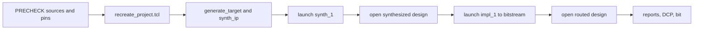
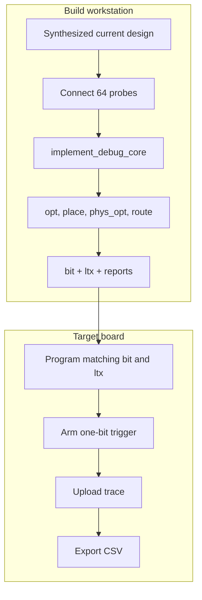
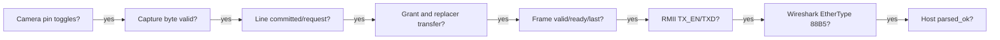

# Vivado build, Tcl automation, reports, ILA, and hardware debug

## OBJECTIVE

This chapter turns the FPGA source closure into repeatable simulation, synthesis, implementation, bitstream, report, programming, and ILA-capture operations. It distinguishes Vivado design states so that commands are not called against the wrong state, and it gives a first-failure procedure for camera dropout, CRC errors, bit substitution, backpressure, and Ethernet silence.

The cold-start authority is `scripts/recreate_project.tcl`. It creates `build/project_recreate_validation/prg_cam.xpr` from authored RTL, a copied XDC under `build/project_recreate_validation/constraints/`, and pinned third-party paths. The copy is deliberate: `save_constraints` may rewrite the active XDC while inserting an ILA, so the authored `prg_cam.srcs/constrs_1/new/nexys_a7_ethernet.xdc` must remain immutable. The checked-in root `prg_cam.xpr` currently contains historical local references and must not be treated as the cold-start source manifest. ILA and PlainBit scripts use the isolated project and recreate it when absent.

## INPUTS / DEPENDENCIES

Required tools and sources:

- Xilinx Vivado compatible with part `xc7a50ticsg324-1L`; the validated workstation used Vivado 2025.2.1.
- First-party RTL and XDC in the FPGA repository.
- TAXI and FPGA-RMII-SMII at the pinned commits documented in `third_party/README.md`.
- A JTAG-connected target for programming/ILA actions.
- A bitstream and its exact matching LTX file for ILA programming.

Automation entry points:

| User goal | Entry point | Design state created/required |
|---|---|---|
| Recreate source project | `scripts/recreate_project.tcl` | project open, source sets complete, then closed |
| Synthesis closure | `scripts/validate_recreated_project.tcl` | opens recreated project; synthesized design |
| Synthesis reports | `scripts/synth_ethernet_bringup.tcl` | synthesized design |
| Route and implementation reports | `scripts/implement_ethernet_bringup.tcl` | routed design |
| Plain bitstream | `scripts/rebuild_gui_ethernet.tcl` | project runs `synth_1` and `impl_1` complete |
| ILA bit/LTX | `scripts/build_ethernet_ila.tcl` | synthesized, debug core inserted, routed |
| Program ILA image | `scripts/program_ethernet_ila.tcl` | hardware target open; bit/LTX exist |
| Capture and export CSV | `scripts/capture_ethernet_ila.tcl` | programmed device with one ILA |
| PowerShell front end | `scripts_ps/run_ethernet_ila.ps1` | validates inputs, run directory, log, manifest and completion marker |

## RUN IDENTITY

The PowerShell wrapper creates `build/ila_runs/<timestamp>_<action>/run_manifest.json`. A valid hardware run must associate:

- FPGA Git HEAD and dirty state;
- Vivado executable and Tcl entry;
- action and trigger settings;
- bit and LTX SHA-256 hashes when those artifacts are inputs;
- execution log and exported ILA CSV;
- final machine-readable status.

For a complete experiment manifest, also record MCU firmware SHA, Host receiver SHA, Npcap interface GUID, camera IDs, capture root, intrinsic hashes when calibration follows, and the final result. `scripts_ps/new_run_manifest.ps1` is the cross-repository identity entry: run it before physical capture, then preserve validation summaries beside the frozen identity and hash them in the independent report. It complements rather than replaces this Vivado action manifest. Chapter 08 gives the exact cold-start order and prevents an FPGA PASS from being promoted to a Host or system PASS.

## PRECHECK

In a new PowerShell terminal:

```powershell
Set-ExecutionPolicy -Scope Process -ExecutionPolicy Bypass
# This affects only the current PowerShell process. It does not change the
# machine/user policy and is needed only when local scripts are otherwise blocked.

$fpga = 'D:\prg\blank_project\FPGA-Based-Camera-Buffer'
$vivado = 'D:\Xilinx_Vivado\2025.2.1\Vivado\bin\vivado.bat' # <- installation
$runner = Join-Path $fpga 'scripts_ps\run_ethernet_ila.ps1'

if (!(Test-Path -LiteralPath $vivado -PathType Leaf)) {
  throw "Vivado executable not found: $vivado"
}
if (!(Test-Path -LiteralPath $runner -PathType Leaf)) {
  throw "ILA wrapper not found: $runner"
}
& $runner -Action Build -VivadoBin $vivado -PreflightOnly
if ($LASTEXITCODE -ne 0) { throw 'ILA preflight failed' }
```

If organizational policy forbids even a process-scoped change, run the signed
or explicitly approved script according to that policy; do not weaken machine
policy silently.

The wrapper's current exit meanings are: 0 validated success, 1 environment/precheck failure, 2 invalid/non-empty output root, 4 output/marker validation failure, and 5 Vivado/internal script failure. A nonzero Vivado exit is retained separately as `tool_exit_code` in the manifest while the wrapper returns 5. These are project wrapper semantics; do not assume every historical script already shares the same mapping.

For the Vivado child process the wrapper sets `XILINX_LOCAL_USER_DATA=no` and restores the caller's value in `finally`. This isolates batch builds from a stale per-user Tcl-app manifest; without it the observed startup failure was `[Common 17-356] Failed to install all user apps` before the project Tcl could run.

## DRY-RUN

`-PreflightOnly` and `-WhatIf` are non-programming paths:

```powershell
& $runner -Action Capture -VivadoBin $vivado `
  -TriggerName camera1_crc_error_pulse_dbg `
  -TriggerPosition 3072 `
  -PreflightOnly
```

Expected output includes the resolved repository, Tcl file, run root, trigger, and `PRECHECK_RESULT=PASS`/`DRY_RUN_RESULT=PASS`. It must not launch Vivado, create a bitstream, program a device, or arm an ILA.

## MAIN A: Project Flow

Project Flow persists source sets, generics, IP and run states in an XPR. The required order is:



Commands:

```powershell
Set-Location $fpga
& $vivado -mode batch -nolog -nojournal `
  -source .\scripts\recreate_project.tcl
if ($LASTEXITCODE -ne 0) { throw 'Project recreation failed' }

& $runner -Action PlainBit -VivadoBin $vivado
if ($LASTEXITCODE -ne 0) { throw 'Plain bitstream flow failed' }
```

`rebuild_gui_ethernet.tcl:13-22` resets and launches `synth_1`, then launches `impl_1 -to_step write_bitstream`. It opens `impl_1` before requesting routed reports. A source or XDC change makes earlier runs stale; the script deliberately reruns both phases.

## MAIN B: Non-Project Flow

Non-Project Flow keeps state in memory and writes explicit checkpoints/reports. Its design-state contract is:

| Command family | Required state | Outputs |
|---|---|---|
| `read_verilog/read_xdc/synth_design` | source closure and part known | synthesized in-memory netlist |
| `opt_design` | synthesized design open | optimized design |
| `place_design` | optimized design | placed design |
| `phys_opt_design` | placed or routed design | timing/routing optimization |
| `route_design` | placed design | routed design |
| `write_checkpoint` | any open post-synth state | DCP for that exact state |
| `write_bitstream` | routed design and DRC acceptable | `.bit` |
| `report_timing_summary` | synthesized/implemented design | stage-specific timing evidence |

`scripts/implement_ethernet_bringup.tcl` follows the explicit `opt → place → phys_opt → route` sequence and emits post-route CDC, DRC, utilization and timing reports (`implement_ethernet_bringup.tcl:40-44`). Use this flow when the exact commands and checkpoints must be audited independently of GUI run state.

## MAIN C: ILA build, program, and capture



Build and program:

```powershell
& $runner -Action Build -VivadoBin $vivado
if ($LASTEXITCODE -ne 0) { throw 'ILA build failed' }

& $runner -Action Program -VivadoBin $vivado
if ($LASTEXITCODE -ne 0) { throw 'ILA programming failed' }
```

The ILA sampling clock is `logic_clk` (`scripts/build_ethernet_ila.tcl:80` after synthesis). Do not sample a raw camera PCLK-domain state machine with an unrelated clock unless the observed net has already been synchronized into `logic_clk`. `program_ethernet_ila.tcl` assigns both `PROGRAM.FILE` and `PROBES.FILE`, programs `xc7a50t_0`, and refreshes hardware probes. A bit/LTX mismatch invalidates probe names and capture interpretation even if programming appears to complete.

Capture a packet-path event:

```powershell
$captureRun = Join-Path $fpga `
  ('build\ila_runs\{0}_cam_packet' -f (Get-Date -Format 'yyyyMMdd_HHmmss_fff'))
& $runner -Action Capture -VivadoBin $vivado `
  -TriggerName camera_packet_valid `
  -TriggerPosition 512 `
  -RunRoot $captureRun
if ($LASTEXITCODE -ne 0) { throw 'ILA capture failed' }
```

Capture a rare CAM1 ingress CRC event with more pre-trigger history:

```powershell
$crcRun = Join-Path $fpga `
  ('build\ila_runs\{0}_cam1_crc' -f (Get-Date -Format 'yyyyMMdd_HHmmss_fff'))
& $runner -Action Capture -VivadoBin $vivado `
  -TriggerName camera1_crc_error_pulse_dbg `
  -TriggerPosition 3072 `
  -RunRoot $crcRun
if ($LASTEXITCODE -ne 0) { throw 'CRC-trigger capture failed' }
```

`capture_ethernet_ila.tcl` requires a one-bit trigger, uses depth 4096, arms `eq1'b1`, uploads the waveform, and writes CSV. Trigger position 3072 is useful when the evidence preceding a row-end error matters; it is not a universal quality threshold.

### Standard handshake observation

For every ready/valid boundary, inspect four facts:

1. `valid=1 && ready=0`: data and `last` must remain stable.
2. `valid=1 && ready=1`: exactly one transfer occurs.
3. `last=1`: it must accompany the final accepted byte, never advance alone.
4. upstream pressure: FIFO level may rise, but ownership and byte index must not reset or change source.

For arbitration, require one-hot `camera_arb_grant`, stable ownership for the packet, and release only after the tail transfer. For starvation, compare how long each asserted request waits before grant. For deadlock, look for a closed dependency chain where upstream `valid` remains asserted, downstream `ready` never returns, FIFO level does not drain, and no error/recovery state advances.

## VALIDATE: reports and design-state interpretation

Reports do not answer the same question:

| Report | Key fields | Diagnosis |
|---|---|---|
| Timing summary | WNS, TNS, failing endpoints, unconstrained paths | negative setup WNS/TNS means frequency not proven; inspect path groups |
| Utilization | LUT, FF, BRAM, BUFG, I/O | resource pressure and unexpected replication |
| DRC | severity and rule ID | illegal electrical, clocking, routing or bitstream conditions |
| Clock interaction | clock-pair relationship | timed, asynchronous, or missing clock relationship |
| CDC | crossing topology and severity | missing synchronizer, unsafe multi-bit/pulse crossing |
| Methodology | design practice rules | likely structural/constraint weaknesses |

Classify a failure using the endpoints and evidence:

- RTL problem: excessive combinational depth, unstable handshake data, inferred latch, unexpected replication, or an unregistered control path.
- Constraint problem: unconstrained endpoints, incorrect clock period, false path covering functional logic, missing generated clock, or incorrect asynchronous grouping.
- Routing problem: the logic delay is reasonable but net delay/congestion dominates after placement/route; compare post-synth estimate with post-route path.

The isolated synthesis completed without black boxes and reported peak Vivado memory of about 1.944 GB. The subsequent ILA implementation completed routing and generated a paired bit/LTX with 64 probes; peak memory reached about 2.446 GB. The route timing summary reported WNS `+1.115 ns`, TNS `0`, WHS `+0.025 ns` and THS `0`. However, the unconstrained-path table is not empty and DRC reports 40 warnings, including missing `CFGBVS`/`CONFIG_VOLTAGE`. The build also emitted 16 critical warnings involving `MARK_DEBUG` on camera input nets feeding IOB-constrained registers and the associated ZHOLD insertion. Those facts allow an ILA diagnostic build, but forbid promoting it to a warning-free plain release bitstream.

### CDC and reset checklist

| Crossing | Required structure | ILA/report check |
|---|---|---|
| asynchronous level | two or more destination-domain FFs with ASYNC_REG | output changes only after synchronizer latency |
| asynchronous pulse | pulse stretcher, toggle synchronizer, or handshake | no lost/duplicated pulse at rate limit |
| multi-bit bus | handshake, Gray counter, or async FIFO | bits are not independently 2FF-synchronized |
| async FIFO | Gray pointers and domain-local full/empty | full/empty do not chatter across domains |
| reset | async assertion if required, synchronous release per domain | no partial release or state escape before clock stability |

The TAXI asynchronous reset exception count is explicitly checked by the build scripts. A changed hierarchy that makes the expected reset pins disappear is a build failure, not a reason to broaden a wildcard false path.

## OBSERVED vs EXPECTED

| Probe/report | Expected | Current observed | Interpretation |
|---|---|---|---|
| recreated source project | clean-clone reproducible | isolated recreation passes | PASS |
| synthesized top | `Camera_Ethernet_Top` | passes without black boxes | PASS |
| root XPR | portable and current | stale historic references | do not use for cold start |
| `camera_packet_valid` trigger | activity for emitted packets | run-specific | capture required |
| `rmii_tx_en_dbg` | asserted after frame launch | run-specific | first FPGA/PHY boundary |
| ILA bit/LTX | hashes from same build | generated; 64 probes; archived SHA-256 values differ by artifact as expected | PASS for diagnostics |
| timing | constrained paths meet setup/hold | WNS `+1.115 ns`, TNS `0`, WHS `+0.025 ns`, THS `0` | constrained paths PASS |
| timing coverage | no unexplained unconstrained paths | unconstrained table is non-empty | release coverage NOT PROVEN |
| DRC | no unresolved release warnings | 40 warnings; no errors | diagnostic bit only |
| debug/IOB warnings | no unresolved placement conflict | 16 critical `MARK_DEBUG`/ZHOLD warnings | diagnostic trade-off remains |

## EXPORT

Each run directory must remain immutable and contain the log, `run_manifest.json`, relevant `.bit/.ltx/.dcp`, reports, and ILA CSV. Hash artifacts:

```powershell
$artifacts = @(
  Get-ChildItem -LiteralPath $captureRun -File -ErrorAction SilentlyContinue
)
$hashRows = @(
  foreach ($item in $artifacts) {
    $hash = Get-FileHash -LiteralPath $item.FullName -Algorithm SHA256
    [pscustomobject]@{ File=$item.Name; SHA256=$hash.Hash }
  }
)
$hashRows | Format-Table -AutoSize
```

The `@(...)` materialization prevents the common empty-pipeline failure when no artifacts exist.

## FAILURE HANDLING

### First-failure matrix



Stop at the first negative node. Do not debug calibration while `parsed_ok` is zero, and do not debug the host while `rmii_tx_en_dbg` is zero.

### Common failures

| Symptom | Likely layer | Next exact observation |
|---|---|---|
| CAM0/CAM1 rejected | capture or camera-ID routing | CAM pin → capture valid → committed count → grant bit → offset 4 → host unroutable count |
| `0→1` bit substitution | pin/sampling/CDC before packet transformation | raw synchronized data and byte index; compare before/after Byte_Replacer |
| CRC bit `0x10` on every row | MCU tail or ingress-CRC policy | raw offsets 126/127 and computed CRC event |
| no PC packet | frame/MII/RMII/PHY/NIC | `frame_handshake`, `rmii_tx_en_dbg`, PHY link, Wireshark, Npcap GUID |
| build output exists error | idempotency guard | choose a new timestamped run root; preserve old evidence |
| bit programs but probes absent | bit/LTX mismatch | compare SHA and program both from one build |
| batch exits before Tcl with `[Common 17-356]` | stale per-user Tcl-app manifest | use the supplied PowerShell wrapper; it scopes `XILINX_LOCAL_USER_DATA=no` to the child process |
| no progress after `Processing IP ... ila:6.2` | Chipscope IP generation stalled | preserve the run log, stop the batch process, verify the authored-XDC hash is unchanged, then recreate the isolated project before retrying ILA; an older bit timestamp is not a new success |

## PASS / FAIL

A bitstream is not released merely because Vivado exits 0. PASS requires the expected completion marker, current source identity, matching artifacts, no unresolved black boxes, acceptable DRC/timing for the intended clocking, and hardware evidence at the required boundary. Plain and ILA bitstreams are distinct products: the ILA image consumes resources and can perturb routing, while the plain image is the deployment candidate.

## NEXT ACTION

After FPGA and Ethernet boundaries pass, proceed to `05_host_receiver_architecture_and_reconstruction.md`. If hardware packets still do not arrive, use the first-failure matrix here before changing Host queue or calibration settings.
