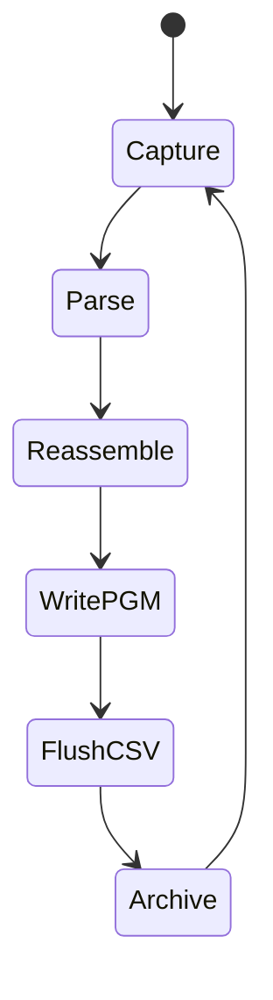
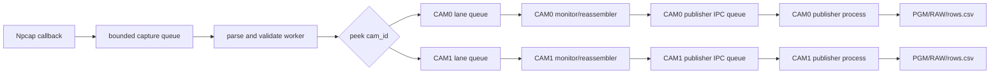

# Host receiver architecture, process isolation, and source reconstruction

## OBJECTIVE

This chapter explains how Ethernet packets move through the Host receiver and why image publication is isolated from packet ingestion. It also defines the repository layout after separating PowerShell user entry points, Python CLI adapters, and the reusable `taxi_receiver` package. The goal is that a fresh clone has one obvious place for each kind of code.

The six-layer terminology describes validation stages, but the operational architecture is a set of queues, workers and ownership boundaries. The critical rule is: capture must not wait for PGM conversion, CSV flush, archive serialization, or disk latency. A valid packet can be rejected by a later image/calibration gate, but a later sink must not stall the NIC ingestion path.

## INPUTS / DEPENDENCIES

Repository layout:

| Category | Location | Ownership |
|---|---|---|
| Reusable receiver/calibration code | `taxi_receiver/` | imported package; no shell-specific paths |
| Capture PowerShell entries | `scripts_ps/capture/` | user-facing Windows/Npcap launchers |
| Monitoring PowerShell entries | `scripts_ps/monitoring/` | read-only viewers/counters |
| Diagnostic PowerShell entries | `scripts_ps/diagnostics/` | A/B and protocol diagnostics |
| Calibration PowerShell entries | `scripts_ps/calibration/` | complete intrinsic/extrinsic workflows |
| Analysis Python CLIs | `scripts_py/analysis/` | thin adapters over package functions |
| Calibration Python CLIs | `scripts_py/calibration/` | thin adapters over calibration modules |
| Unit/integration tests | `tests/` | executable contracts |

The main Python CLI is `taxi_receiver.cli:main` (`taxi_receiver/cli.py:250`). The normal PowerShell entry is `scripts_ps/capture/run_receiver.ps1`; it resolves the repository root from `$PSScriptRoot`, builds CLI arguments and calls `python -m taxi_receiver.cli`. Root-level copies of these scripts are no longer the supported interface.

Dependencies are declared in `requirements.txt`, `requirements-live.txt`, and `requirements-calibration.txt`. Npcap and its capture interface GUID are host-environment dependencies; they are not stored in Git.

## RUN IDENTITY

A Host run needs at least:

- run ID and UTC start;
- Host Git HEAD and dirty state;
- Python, NumPy and OpenCV versions when calibration/image operations are used;
- Npcap interface GUID and EtherType;
- camera ID routing set;
- queue and publication modes;
- image/archive roots;
- FPGA bit/LTX hashes and MCU SHA supplied by the cross-repository experiment manifest.

`run_intrinsic_calibration.ps1` and `run_extrinsic_calibration.ps1` already emit `run_manifest.json`. The live receiver prints its complete configuration and final counters but does not own the combined FPGA/MCU identity. Use the FPGA repository's `scripts_ps/new_run_manifest.ps1` before the run and preserve the receiver terminal log beside it; neither document alone proves the hardware identity.

Before opening Npcap, run the public known-input gate from chapter 08. `docs/fixtures/golden_dual_camera_small` contains one complete 480-row frame for cam0 and cam1 plus a one-packet CRC fault. `scripts_ps/validate_golden_host_fixture.ps1` checks SHA-256, replays both files, and requires 960 positive valid packets, zero positive CRC errors, one PGM and 480 CSV rows per camera, followed by one detected negative CRC error. A PASS isolates Host parsing/reassembly/publication; it is not evidence for MCU, FPGA, RMII or NIC.

## PRECHECK

```powershell
$host = 'D:\prg\blank_project\Host_Camera_Packet_Receiver'
$python = Join-Path $host '.venv\Scripts\python.exe'
$receiver = Join-Path $host 'scripts_ps\capture\run_receiver.ps1'

$required = @(
  $receiver,
  (Join-Path $host 'taxi_receiver\cli.py'),
  (Join-Path $host 'taxi_receiver\pipeline.py'),
  (Join-Path $host 'taxi_receiver\packet_format.py'),
  (Join-Path $host 'taxi_receiver\camera_lane.py'),
  (Join-Path $host 'taxi_receiver\image_pipeline.py')
)
$missing = @(
  foreach ($path in $required) {
    if (!(Test-Path -LiteralPath $path -PathType Leaf)) { $path }
  }
)
if ($missing.Count -ne 0) { throw "Host source closure incomplete: $missing" }
```

Create the environment from the clone, not from an old absolute path:

```powershell
Set-ExecutionPolicy -Scope Process -ExecutionPolicy Bypass
Set-Location $host
py -3 -m venv .venv
& .\.venv\Scripts\python.exe -m pip install --upgrade pip
& .\.venv\Scripts\python.exe -m pip install -r .\requirements-live.txt
& .\.venv\Scripts\python.exe -m pip install -r .\requirements-calibration.txt
& .\.venv\Scripts\python.exe -m pytest -q
if ($LASTEXITCODE -ne 0) { throw 'Host tests failed' }
```

The current reorganized tree passes 216 tests with 2 skipped on the validated workstation. That proves Python contracts in the clone; it does not prove Npcap privileges, FPGA traffic or disk throughput on another host.

## DRY-RUN

List interfaces and print the exact capture plan without starting capture:

```powershell
Set-Location $host
& $python -m taxi_receiver.cli --list

$interface = '\Device\NPF_{REPLACE-WITH-LIST-RESULT}' # <- exact --list value
$images = Join-Path $host 'runs\dry_run\images'
& $receiver -Interface $interface -ImagesRoot $images `
  -CameraIds '0,1' -SplitByCamera on `
  -PublishFrames complete -PublishImages process -WhatIf
```

Expected output shows repository root, Python path and CLI arguments, then exits 0. The wrapper does not accept a `-CrcMode` parameter; CRC policy is a parser/FPGA protocol property, not a launch-time invention. Do not copy historical commands containing nonexistent `-RowsCsv` or path-valued `-SessionAudit`; the current switches are `-NoRowsCsv`, `-OutputRoot`, and `-SessionAudit on|off|auto`.

## MAIN: packet flow and decoupling

### Before isolation: one slow path can stop the lane



In the thread-based publication mode, a camera lane that finishes a frame can spend substantial time converting and writing it before returning to packet processing. The source comments record an observed lane blocking interval of 34 seconds in a 65-second run (`taxi_receiver/camera_lane.py:139-141`). With one camera, the ingress rate and disk service time may leave enough slack. With two cameras, both streams generate publication work; queue service falls behind, capture queues fill, and the program begins dropping packets even though FPGA/Ethernet traffic is correct.

This is not simply “Python threads are slow.” The exact failure is feedback: disk/serialization work is on a path whose completion is required before the same worker accepts more reassembled work. The OS page cache can hide the problem briefly and then produce bursts, so the failure looks intermittent.

### Current architecture: capture, lanes and publisher processes



`TaxiReceiverPipeline._on_frame` places raw Ethernet frames into a bounded queue (`taxi_receiver/pipeline.py:196`); `_run_worker` consumes them (`pipeline.py:224`) and `_process_frame` executes staged validation (`pipeline.py:247`). Camera routing uses `peek_camera_id` before lane submission. The camera ID is payload offset 4, absolute Ethernet-frame offset 18 (`taxi_receiver/packet_format.py:145`).

`CameraLanePool` owns a queue and worker per configured camera (`taxi_receiver/camera_lane.py:371-471`). Each lane feeds its own monitor, reassembler and image pipeline. Cross-camera disk delay therefore cannot directly serialize both reassemblers.

`CameraImagePipeline` serializes a completed frame into `_PublishedFrameEnvelope`; `_run_image_publication_worker` reconstructs it in a separate OS process and performs image publication (`taxi_receiver/image_pipeline.py:187-240,367`). The `-PublishImages process` wrapper option selects this current mode; `thread` is retained as the controlled A/B baseline.

### Why two cameras recovered after process isolation

Imagine two conveyor belts feeding one clerk. In the former design, the clerk receives a packet, assembles a photograph, walks to a filing cabinet, writes a ledger entry, then returns to the belts. One belt can pause while the clerk files; two belts continue filling the table until packages fall off. Adding threads does not remove the filing dependency if the lane worker still performs it.

The process design adds one filing room per camera. The front clerk labels and routes completed frames into bounded dispatch boxes, then returns to packet work. A slow disk can still fill a publisher queue and cause an explicit publication failure or drop policy, but it no longer silently consumes the capture worker's service time. Thus low packet loss after S2 is an architectural consequence of moving disk/serialization out of the ingestion process, not evidence that the cameras started transmitting less data.

## PACKET AND FRAME CONTRACTS

`packet_format.py` separates parsing success from semantic frame completion. The current packet has 14 Ethernet bytes plus a fixed 128-byte payload. Current sync `A5 A0 5A 50` uses big-endian metadata and CRC; legacy sync `A5 A5 5A 5A` retains little-endian compatibility. `CameraRowPacket.first_row` derives from `row_idx==0`; bit 2 is exposed separately as `first_processed_row` because MCU Sobel processing begins at row 2, not at frame row 0 (`packet_format.py:127-201`).

`StreamMonitor` owns sequence, duplicate, out-of-order, row-jump and error counters (`taxi_receiver/stream_monitor.py:87-259`). `FrameReassembler` owns frame sessions, row replacement/missing-row completion and timeout closure (`taxi_receiver/reassembler.py:139-394`). `CameraImagePipeline` owns publication policy, recovery assessment and rows CSV (`image_pipeline.py:367-1265`). These responsibilities must not be collapsed into a parser flag.

Rows CSV records both `first_row` and `first_processed_row`. A CSV with only a header is “no recorded row evidence,” not automatically “0% valid.” Monitoring code must test row count before calculating a percentage.

## VALIDATE

Run a deterministic PCAP before live capture:

```powershell
$replay = Join-Path $host 'scripts_ps\capture\replay_pcap.ps1'
$pcap = 'D:\prg\blank_project\evidence\sample.pcapng' # <- supplied capture
$out = Join-Path $host `
  ('runs\{0}_pcap_replay' -f (Get-Date -Format 'yyyyMMdd_HHmmss_fff'))
& $replay -Pcap $pcap -OutputRoot $out
if ($LASTEXITCODE -ne 0) { throw 'PCAP replay failed' }
```

Then run a live dual-camera capture:

```powershell
$run = Join-Path $host `
  ('runs\{0}_dual_capture' -f (Get-Date -Format 'yyyyMMdd_HHmmss_fff'))
$images = Join-Path $run 'images'
$archive = Join-Path $run 'archive'
New-Item -ItemType Directory -Force -Path $run | Out-Null

& $receiver -Interface $interface `
  -ImagesRoot $images -OutputRoot $archive `
  -ExpectedRows 480 -QueueDepth 65536 `
  -FrameOutputQueueDepth 256 -CameraIds '0,1' `
  -SplitByCamera on -ImagePolicy strict `
  -PublishFrames complete -PublishImages process `
  -PublisherQueueDepth 256 -SessionAudit on `
  -PythonExe $python
$captureExit = $LASTEXITCODE
if ($captureExit -ne 0) { throw "Capture failed: $captureExit" }
```

The capture command blocks by design until Ctrl+C. Open monitoring in separate terminals; do not append subsequent analysis commands to the same running foreground pipeline.

## OBSERVED vs EXPECTED

| Boundary | Expected | Current project evidence | Interpretation |
|---|---|---|---|
| raw ingress | capture counter grows | final report counter | NIC/Npcap boundary |
| EtherType filter | matching count grows | `Matching Ethernet` | correct L2 selection |
| parser | `Valid packets` grows | parser/fixed counters | packet format boundary |
| camera route | unroutable remains zero | per-run final report | offset 4 and `CameraIds` agree |
| capture queue | no drops under target load | depth/peak/drop counters | ingestion capacity |
| lane queues | CAM0 and CAM1 advance | lane peak/drop counters | per-camera isolation |
| publication | PGM and rows CSV grow | per-camera directories | publisher process and disk |
| A/B mode | process loss much lower than thread under same PCAP/load | historical S2 evidence; rerun for publication claims | architecture benefit |

## EXPORT

Preserve terminal output, `summary.csv`, per-camera `rows_v2.csv` or current rows CSV name produced by the run, PGM/RAW images, PCAP, configuration and top-level manifest. Use `Get-FileHash` for PCAP, bit/LTX and calibration JSON. Do not commit real capture datasets, interface GUIDs, personal paths or private calibration results to the public repository unless they were intentionally sanitized.

## FAILURE HANDLING

| Signature | Root cause class | First action |
|---|---|---|
| Npcap error 123 | placeholder or malformed interface path | rerun `--list`; assign the exact `\Device\NPF_{...}` string |
| packets received, all unroutable | payload offset 4 not in `CameraIds` | inspect raw byte 18 and FPGA replacement/grant |
| CAM0 works, CAM1 zero | CAM1 FPGA path, ID replacement or Host routing | run each ID alone, then trace first-zero matrix; do not adjust calibration |
| packet loss rises only with image output | publication feedback | compare `-PublishImages thread` and `process`; inspect publisher queue and disk |
| PGM absent but rows exist | publication/reassembly policy | inspect complete-frame count and publisher failures |
| rows CSV header only | no emitted row events | report “no evidence,” not 0% valid |
| CRC error | parser CRC or FPGA ingress status | identify which CRC layer failed before changing flags |
| exit 7 | all submitted outputs failed or sink disabled | inspect path permissions/disk errors; receiver wrapper surfaces this condition |

## PASS / FAIL

Host PASS requires matching Ethernet frames, valid parsed packets, zero unintended unroutable packets, bounded queue behavior, complete reassembled frames and expected outputs. Low capture loss alone does not prove correct images; valid PGM output alone does not prove that no packets were dropped. Results from thread and process modes are comparable only when input PCAP/live duration, queue sizes and disk target are controlled.

## NEXT ACTION

Use `06_host_execution_diagnostics_and_calibration.md` for three-terminal live operation, CRC and camera-rejection diagnosis, intrinsic mathematics, stereo R/t workflow, holdout gates and current release boundaries.
