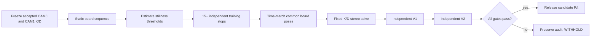

# Host execution, diagnostics, intrinsic and extrinsic calibration

## OBJECTIVE

This chapter is the operational guide from live two-camera capture to intrinsic calibration, fixed-intrinsic stereo solving and independent holdout validation. It also provides the shortest diagnostic path for a missing camera, CRC failures and apparent bit substitution. Mathematical symbols are defined before commands so that reported K, D, R, t and RMSE values are interpretable.

The public workflow ends with evidence and status. It does not claim a publishable physical stereo transform unless both holdouts pass and the resulting configuration is intentionally released. At the current project closure, public extrinsic R/t is **WITHHELD / NOT RELEASED**.

## INPUTS / DEPENDENCIES

```powershell
$host = 'D:\prg\blank_project\Host_Camera_Packet_Receiver'
$python = Join-Path $host '.venv\Scripts\python.exe'
$capture = Join-Path $host 'scripts_ps\capture\run_receiver.ps1'
$intrinsicRunner = Join-Path $host `
  'scripts_ps\calibration\run_intrinsic_calibration.ps1'
$extrinsicRunner = Join-Path $host `
  'scripts_ps\calibration\run_extrinsic_calibration.ps1'
```

On the validated workstation, the explicit Python environment reported Python 3.14.6, OpenCV 4.14.0 and NumPy 2.5.1. Those versions are observations, not hard-coded compatibility guarantees. The calibration wrappers probe and record versions in each run manifest.

Datasets are immutable input roots. Intrinsic requires separate Training, Holdout V1 and Holdout V2 roots for one camera. Extrinsic requires a dual-camera static root plus separate dual-camera Training, V1 and V2 roots, each containing `cam0` and `cam1` PGM files.

## RUN IDENTITY

Use one fresh output directory per run:

```powershell
$stamp = Get-Date -Format 'yyyyMMdd_HHmmss_fff'
$runBase = Join-Path $host "runs\$stamp"
New-Item -ItemType Directory -Force -Path $runBase | Out-Null
```

The calibration wrappers reject non-empty output roots and generate `run_manifest.json` with repository HEAD/dirty state, input paths/counts, Python/NumPy/OpenCV versions, algorithm policy, outputs and final status. Use `scripts_ps/new_run_manifest.ps1` in the FPGA repository to freeze the FPGA bit/LTX hash, MCU firmware SHA, Host HEAD, capture interface and camera IDs before acquisition. Chapter 08 requires the public Host golden replay before live capture and defines the independent sign-off boundary.

## PRECHECK

```powershell
$required = @($python, $capture, $intrinsicRunner, $extrinsicRunner)
$missing = @(
  foreach ($path in $required) {
    if (!(Test-Path -LiteralPath $path -PathType Leaf)) { $path }
  }
)
if ($missing.Count -ne 0) { throw "Missing Host entry points: $missing" }

Set-Location $host
& $python -c 'import cv2,numpy,taxi_receiver; print(cv2.__version__)'
if ($LASTEXITCODE -ne 0) { throw 'Python/calibration imports failed' }
```

Do not begin calibration until both cameras pass packet, reassembly and complete-frame checks. A board detector cannot repair missing rows, wrong camera IDs, a shifted byte stream, or a false CRC status.

## DRY-RUN

Each public wrapper supports a non-writing preflight:

```powershell
& $intrinsicRunner -CameraId 0 `
  -TrainingRoot 'D:\data\cam0\training' `
  -HoldoutV1Root 'D:\data\cam0\holdout_v1' `
  -HoldoutV2Root 'D:\data\cam0\holdout_v2' `
  -OutputRoot (Join-Path $runBase 'cam0_intrinsic') `
  -PythonExe $python -PreflightOnly

& $extrinsicRunner `
  -StaticRoot 'D:\data\stereo\static' `
  -TrainingRoot 'D:\data\stereo\training' `
  -HoldoutV1Root 'D:\data\stereo\holdout_v1' `
  -HoldoutV2Root 'D:\data\stereo\holdout_v2' `
  -Cam0Intrinsic 'D:\configs\cam0_intrinsics.json' `
  -Cam1Intrinsic 'D:\configs\cam1_intrinsics.json' `
  -OutputRoot (Join-Path $runBase 'extrinsic') `
  -PythonExe $python -PreflightOnly
```

Preflight verifies input existence, nonzero PGM counts, Python imports, fresh output roots and—on stereo runs—identical intrinsic point sets. It prints the plan and writes nothing.

## MAIN A: live capture in three terminals

### Terminal A — receiver

```powershell
Set-Location $host
& $python -m taxi_receiver.cli --list
$interface = '\Device\NPF_{REPLACE-WITH-EXACT-GUID}'
$captureRoot = Join-Path $runBase 'capture'
$imagesRoot = Join-Path $captureRoot 'images'
$archiveRoot = Join-Path $captureRoot 'archive'

& $capture -Interface $interface `
  -ImagesRoot $imagesRoot -OutputRoot $archiveRoot `
  -ExpectedRows 480 -QueueDepth 65536 `
  -FrameOutputQueueDepth 256 -CameraIds '0,1' `
  -SplitByCamera on -ImagePolicy strict `
  -PublishFrames complete -PublishImages process `
  -PublisherQueueDepth 256 -SessionAudit on `
  -PythonExe $python
```

This terminal remains occupied until Ctrl+C. That is normal foreground capture, not a deadlock. Do not pipe the live process into a command that must run only after capture unless you intend to wait.

### Terminal B — CAM0 valid frames and poses

```powershell
$host = 'D:\prg\blank_project\Host_Camera_Packet_Receiver'
$python = Join-Path $host '.venv\Scripts\python.exe'
$preflight = Join-Path $host `
  'scripts_py\calibration\preflight_calibration_frames.py'
$imagesRoot = '<copy the exact Terminal A imagesRoot>' # <- do not recompute another run ID
$liveRoot = Join-Path (Split-Path $imagesRoot -Parent) 'live_preflight'
New-Item -ItemType Directory -Force -Path $liveRoot | Out-Null

& $python $preflight (Join-Path $imagesRoot 'cam0\*.pgm') `
  --watch --poll-interval 1 --min-poses 15 --zone-map `
  --report (Join-Path $liveRoot 'cam0_preflight_live.csv')
```

### Terminal C — CAM1 valid frames and poses

Use the same command with `cam1` and `cam1_preflight_live.csv`. The two single-camera pose counts are acquisition guidance; they are not stereo `selected_pose_pairs`. A pose counted independently in both streams is not automatically time-matched.

If the report exists but contains only its header, display “NO ROW EVIDENCE” rather than dividing zero rows into a valid percentage:

```powershell
$report = Join-Path $liveRoot 'cam0_preflight_live.csv'
$rows = @()
if (Test-Path -LiteralPath $report -PathType Leaf) {
  $rows = @(Import-Csv -LiteralPath $report)
}
if ($rows.Count -eq 0) {
  Write-Host 'NO ROW EVIDENCE' -ForegroundColor Yellow
} else {
  $valid = @($rows | Where-Object accepted -eq 'True').Count
  [pscustomobject]@{
    Total=$rows.Count; Valid=$valid
    Percent=[math]::Round(100.0*$valid/$rows.Count,2)
  } | Format-List
}
```

## DIAGNOSTIC PATH: missing camera, CRC, and bit substitution

### CAM0 or CAM1 is rejected

Use the first-zero sequence, keeping all later stages out of the decision:

1. ILA raw camera PCLK/HREF/data toggle.
2. `camera*_capture_byte_valid_dbg` advances.
3. corresponding committed count/request advances.
4. corresponding `camera_arb_grant` bit is observed.
5. Byte_Replacer output offset 4 equals the expected camera ID.
6. RMII TX_EN emits the packet.
7. Wireshark sees EtherType `0x88B5` and raw payload byte 4.
8. Host `Matching Ethernet`, `Valid packets`, and camera lane counters grow.
9. `Unroutable cam_id` remains zero.

Run CAM0-only and CAM1-only Host routing without changing FPGA state. If raw packets contain cam ID 1 but `CameraIds '0'` is selected, rejection is correct configuration behavior. If the packet contains 0 for both physical cameras, trace FPGA arbitration and replacement; changing Host IDs would only hide the fault.

### CRC

There are three distinct facts:

- MCU places a big-endian CRC at payload offsets 126/127.
- FPGA ingress checking optionally compares that tail and records a mismatch in FPGA status bit `0x10` at offset 13.
- FPGA output replacement independently recomputes offsets 126/127 when output CRC is enabled.

Calibration does not consume CRC and must not be used as a CRC diagnostic. First capture raw FPGA ILA bytes at ingress, compute CRC-16/CCITT-FALSE over offsets 0..125, and compare bytes 126/127. Then inspect post-replacement output separately.

### `0→1` or shifted-bit appearance

Compare the same indexed byte at four boundaries: camera pins after synchronization, Camera_Capture output, Byte_Replacer input, and Ethernet payload. If corruption appears before replacement, inspect pin mapping, I/O standard, sample edge, synchronizer and PCLK qualification. If only offsets 4, 13, 126 or 127 differ, that is designed replacement. If every later byte moves by one position, inspect row length/HREF/PCLK event count; it is not a bit-order setting until byte boundaries have been proven.

## MAIN B: intrinsic mathematics and workflow

For a 3-D point in camera coordinates, normalize:

\[
x=X/Z,\quad y=Y/Z,\quad r=\sqrt{x^2+y^2},\quad \theta=\arctan(r).
\]

The OpenCV fisheye/Kannala–Brandt radial model used by this project is:

\[
\theta_d=\theta(1+k_1\theta^2+k_2\theta^4+k_3\theta^6+k_4\theta^8).
\]

With \(x'=\theta_d x/r\) and \(y'=\theta_d y/r\), pixel coordinates are:

\[
u=f_x(x'+\alpha y')+c_x,\qquad v=f_y y'+c_y.
\]

Symbols:

| Symbol | Meaning |
|---|---|
| `fx`, `fy` | focal length in pixels along image axes |
| `cx`, `cy` | principal point in pixels |
| `alpha` | skew term, normally constrained by OpenCV flags |
| `k1..k4` | fisheye radial coefficients stored in D |
| K | 3×3 intrinsic matrix containing focal/principal-point terms |
| D | 4×1 fisheye distortion vector |
| object points | known circle-grid coordinates in board millimetres |
| image points | detected circle centers in pixels |

The optimizer minimizes total reprojection error over views:

\[
E(K,D,\{R_i,t_i\})=\sum_i\sum_j
\lVert p_{ij}-\pi(K,D,R_i,t_i,P_j)\rVert^2.
\]

Here \(P_j\) is board point `j`, \(p_{ij}\) is its detected center in image `i`, and \(R_i,t_i\) are that board pose relative to the camera. RMSE is an image-space residual, not a millimetre translation accuracy.

Run each camera independently with three disjoint datasets:

```powershell
$cam0Out = Join-Path $runBase 'cam0_intrinsic'
& $intrinsicRunner -CameraId 0 `
  -TrainingRoot 'D:\data\cam0\training' `
  -HoldoutV1Root 'D:\data\cam0\holdout_v1' `
  -HoldoutV2Root 'D:\data\cam0\holdout_v2' `
  -OutputRoot $cam0Out -PythonExe $python `
  -FisheyeConstraint full -MinPoses 15 `
  -MinViews 15 -MinHoldoutViews 15
if ($LASTEXITCODE -ne 0) { throw 'CAM0 intrinsic workflow failed' }
```

Repeat for CAM1 with independent roots. The wrapper calls preflight, `calibrate_binary_camera.py`, then `validate_binary_calibration.py` twice. Default validation thresholds come from `taxi_receiver/calibration_validation.py:446-451`: at least 15 holdout views, median ≤0.8 px, P95 ≤1.2 px, maximum ≤1.5 px, and at least 90% at/below the P95 threshold. These are frozen **code-default engineering release gates**, not mathematical constants or values claimed directly from literature.

## MAIN C: extrinsic mathematics and workflow

CAM0 is the reference coordinate system. A point expressed in CAM0 coordinates maps to CAM1 as:

\[
X_1=R_{10}X_0+t_{10}.
\]

`R10` is a 3×3 rotation matrix; `t10` is a 3×1 translation in millimetres because board spacing is defined in millimetres. If each camera estimates the board pose independently as \(X_c=R_{cb}X_b+t_{cb}\), then a per-pose relative transform can be formed:

\[
R_{10}=R_{1b}R_{0b}^{T},\qquad
t_{10}=t_{1b}-R_{10}t_{0b}.
\]

The production solve fixes K/D and calls `cv2.fisheye.stereoCalibrate` (`taxi_receiver/stereo_calibration.py:858`). It does not average two intrinsic calibrations. `intrinsic_point_set()` resolves the exact board indices from each intrinsic JSON, and `validate_intrinsic_pair()` rejects unequal or ambiguous sets. No silent full-44 fallback, intersection or warning-only downgrade is allowed.

Acquisition sequence:



Use 15–20 genuine stationary episodes rather than hundreds of neighboring frames from the same stop. For hand-held acquisition, hold each pose 2–3 seconds, move briskly between positions, vary center/corners/tilt and depth, then use `quasi_static_episode_minimum` so one representative frame owns one episode's statistical weight.

```powershell
$extrinsicOut = Join-Path $runBase 'stereo_extrinsic'
& $extrinsicRunner `
  -StaticRoot 'D:\data\stereo\static' `
  -TrainingRoot 'D:\data\stereo\training' `
  -HoldoutV1Root 'D:\data\stereo\holdout_v1' `
  -HoldoutV2Root 'D:\data\stereo\holdout_v2' `
  -Cam0Intrinsic (Join-Path $cam0Out '01_training\cam0_intrinsics.json') `
  -Cam1Intrinsic 'D:\runs\cam1_intrinsic\01_training\cam1_intrinsics.json' `
  -OutputRoot $extrinsicOut -PythonExe $python `
  -PairingMode quasi_static_episode_minimum `
  -MinPairs 15 -MinStaticFrames 200 `
  -WindowFrames 5 -MaxCenterDtMs 33.5 `
  -MaxPredictedMotionPx 0.75 `
  -MaxMotionRatePxPerMs 0.02 `
  -QuasiEpisodeGapFrames 10 `
  -MinCam0EdgeMarginPx 12
$extrinsicExit = $LASTEXITCODE
```

The wrapper performs static threshold estimation, training pair construction, solve, V1 pairing/validation, and V2 pairing/validation. It refuses non-empty output roots and writes stage-specific JSON/CSV beneath `00_static` through `06_holdout_v2_validation`.

Stereo code defaults are traceable to `taxi_receiver/stereo_calibration.py:635-645`: minimum 15 pairs, maximum PnP RMSE 1.5 px, stereo RMS target 1.0 px, rotation dispersion target 0.5°, translation target `max(0.5 mm, 0.01×baseline)`, depth-drift correlation limit 0.3, and slope limit 0.005 mm/mm. Holdout defaults are in `extrinsic_validation.py:408-417`: median/P95/max cross RMSE 0.8/1.2/1.5 px, 90% pass fraction, rectified vertical P95 1.2 px, rotation dispersion 0.5°, and translation fraction 0.01. They are engineering gates defined by code defaults.

`--allow-limited`, where exposed by lower-level tools, can permit writing a limited candidate; it never converts `unacceptable` into `acceptable`. A low stereo RMS does not override depth-dependent R/t drift or physical baseline inconsistency.

## VALIDATE

Read manifests without assuming files exist:

```powershell
$manifestPath = Join-Path $extrinsicOut 'run_manifest.json'
if (!(Test-Path -LiteralPath $manifestPath -PathType Leaf)) {
  throw "Extrinsic manifest missing: $manifestPath"
}
$manifest = Get-Content -Raw -LiteralPath $manifestPath | ConvertFrom-Json
$manifest.status
$manifest.outputs | Format-List
```

Check stage summaries only after their paths are resolved from the manifest or documented output tree. A final green `Write-Host` line entered after a thrown exception is not evidence; `$LASTEXITCODE`, JSON `status`, `quality.failures`, and artifact existence govern the result.

## OBSERVED vs EXPECTED

| Quantity | Expected meaning | Release interpretation |
|---|---|---|
| intrinsic RMS | training image residual | necessary, not independent evidence |
| V1/V2 RMSE | fixed K/D on disjoint images | generalization evidence |
| stereo RMS | joint fit to training pairs | numerical fit only |
| baseline | norm of t in mm | compare with physical measurement |
| rotation dispersion | pose-to-pose R consistency | rigid-rig stability |
| translation dispersion | pose-to-pose t consistency | random/model variation |
| depth-drift slope/correlation | whether estimated t changes with board depth | systematic intrinsic/distortion mismatch if rigid rig |
| rectified vertical residual | epipolar vertical alignment | stereo geometry validation |

Current public status: the receiver and calibration implementation are present, intrinsic/extrinsic gates are implemented, but no public R/t is promoted as physically released. The earlier 120°+160° work was an engineering closure, not proof that mixed-FOV cameras are theoretically uncalibratable. A 120°+120° configuration must be evaluated as a new run; historical evidence cannot be promoted automatically.

## EXPORT

Preserve:

- intrinsic JSON and per-view CSV for both cameras;
- intrinsic V1/V2 summary JSON and views CSV;
- stillness config, stereo pair CSV and pairing summaries;
- extrinsic candidate/rejected JSON and per-pair report;
- V1/V2 holdout JSON/CSV and diagnostic montages;
- capture PCAP/rows CSV/PGM roots;
- run manifest and SHA-256 table.

Private or environment-specific calibration JSON, raw datasets and interface GUIDs remain outside the public source repository unless explicitly sanitized and licensed for publication.

## FAILURE HANDLING

| Failure text/status | Meaning | Next action |
|---|---|---|
| path does not exist | variable not defined in this PowerShell session or wrong repository layout | define all roots in the current terminal; use new `scripts_ps/scripts_py` paths |
| output root is not empty | immutable-evidence guard | create a new timestamped root; do not erase prior audit by default |
| `not_ready`, zero pairs | no common time-matched stationary episodes | inspect still frames, center-time delta and episode segmentation; do not solve |
| point sets differ/ambiguous | intrinsic JSON board index contract invalid | recalibrate both with identical point set; block A forbids intersection |
| exit 3 / `unacceptable` | data/quality validation failed | preserve rejected diagnostics; do not manufacture a green message |
| large cross RMSE with low training RMS | R/t or fixed K/D does not generalize, wrong pair identity, or transform convention mismatch | inspect pair paths/timestamps/point indices and transform direction |
| depth-dependent tx/ty/tz | rigid transform changes with board depth | investigate intrinsic/distortion/model/board-scale error before camera repositioning |
| CAM1 zero images | upstream data path/routing | return to first-zero diagnostic; calibration is not applicable |

## PASS / FAIL

Intrinsic PASS requires acceptable training plus two independent acceptable holdouts for each camera. Extrinsic PASS requires an identical explicit point set, adequate independent stereo episodes, acceptable training quality and two independent holdouts, consistent transform convention, plausible physical baseline and no depth-dependent transform failure. Numerical convergence is not physical release.

## NEXT ACTION

If all boundaries pass, freeze the K/D and candidate R/t by hash and record them in the experiment manifest. If any gate fails, preserve the run and diagnose the first failed boundary. Use `07_git_clone_branch_commit_pr_and_release.md` to publish source and documentation without committing generated/private evidence.
