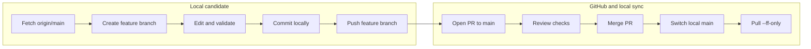

# Git clone, branch, commit, pull request, and public release

## OBJECTIVE

This chapter reproduces the three-repository workspace and explains the branch divergence that occurred during publication. It provides a safe, reversible feature-branch and pull-request workflow. It does not use `git reset --hard`, force push, destructive checkout, or branch deletion as normal repair tools.

The public system is split deliberately:

- MCU firmware: `-RP2354A-OV5640-Camera-Module`
- FPGA buffer/Ethernet/Tcl and cross-system guides: `FPGA-Based-Camera-Buffer`
- Python receiver and calibration: `Host_Camera_Packet_Receiver`

Each repository keeps `main` as the public default branch. Work is prepared on a named candidate branch, reviewed as a PR, then merged into `main`.

Source publication is not system validation. Before a release is described as independently reproducible, execute `08_independent_cold_start_acceptance.md` and attach its manifests or explicitly retain the `UNVERIFIED` physical limitations. A merged PR and exit code 0 do not promote evidence across layers.

## INPUTS / DEPENDENCIES

```powershell
$workspace = 'D:\prg\blank_project'
New-Item -ItemType Directory -Force -Path $workspace | Out-Null
Set-Location $workspace

git clone https://github.com/YuweiZhang-002/-RP2354A-OV5640-Camera-Module.git MCU_Camera_Module
git clone https://github.com/YuweiZhang-002/FPGA-Based-Camera-Buffer.git FPGA-Based-Camera-Buffer
git clone https://github.com/YuweiZhang-002/Host_Camera_Packet_Receiver.git Host_Camera_Packet_Receiver
```

Cloning creates independent `.git` histories. Placing one repository beside another does not nest their commits. Third-party TAXI/RMII clones are local build-only dependency closure and remain ignored by the FPGA Git repository.

## RUN IDENTITY

At the start of every Git operation, capture:

```powershell
$repo = Join-Path $workspace 'FPGA-Based-Camera-Buffer'
git -C $repo status --short --branch
git -C $repo branch -avv
git -C $repo log --oneline --decorate --graph --all -n 30
git -C $repo remote -v
git -C $repo remote show origin
```

Interpretation:

- `HEAD` is the currently checked-out commit; normally it is attached to a local branch.
- `origin/main` is the last fetched local record of the remote main branch.
- `ahead N` means the local branch has N commits not reachable from its configured upstream.
- `behind N` means the upstream has N commits not reachable locally.
- both ahead and behind means divergence: both sides added different commits after a common ancestor.
- a non-fast-forward push is rejected when moving the remote pointer would discard commits not present in the pushed history.

## ROOT CAUSE OF THE MULTIPLE-BRANCH GRAPH

The visible colored lines are commit ancestry, not duplicate file copies. A feature branch begins as another pointer to a commit. Once one line receives a commit and another line receives a different commit or PR merge, their paths diverge. PR merge commits then reconnect ancestry while preserving both parent histories, so the graph remains visibly branched even after successful integration.

A direct push updates only the named upstream branch. If the current branch is `chore/publication-boundaries`, `git push -u origin chore/publication-boundaries` creates/updates that remote feature branch; it does not update `main`. Updating `main` requires merging the PR into `main` or explicitly pushing a compatible local `main`. The feature branch remaining visible is normal evidence of the review workflow, not proof that the PR failed.

The earlier graph contains several “Merge pull request” commits. Those commits explain the colored arcs: independent work was integrated by merge commits. Squash or rebase can make future history more linear, but rewriting already-public history merely to make the graph pretty is not justified.



## PRECHECK

```powershell
git -C $repo fetch --prune origin
$status = @(git -C $repo status --porcelain)
if ($status.Count -ne 0) {
  throw 'Worktree is not clean; inspect and commit/stash intentionally before branch integration'
}
$branch = (git -C $repo branch --show-current).Trim()
if ([string]::IsNullOrWhiteSpace($branch)) {
  throw 'Detached HEAD; do not publish until attached to an intentional branch'
}
```

`fetch --prune` updates remote-tracking references and removes stale remote-tracking names; it does not delete local branches or working files. Inspect any `git status` changes before switching branches.

## DRY-RUN

Before pull or merge, inspect reachability:

```powershell
git -C $repo log --oneline origin/main..HEAD
git -C $repo log --oneline HEAD..origin/main
git -C $repo diff --stat origin/main...HEAD
git -C $repo diff --check origin/main...HEAD
```

The first log lists candidate-only commits; the second lists main-only commits. Triple-dot diff compares the feature work to its merge base, which approximates what a PR presents.

## MAIN A: create and publish a candidate branch

```powershell
Set-Location $repo
git switch main
git pull --ff-only origin main
git switch -c docs/cold-start-reproduction

git status --short
git diff --check
git add -- docs scripts scripts_ps third_party/README.md `
  THIRD_PARTY_DEPENDENCIES.md .gitignore
git diff --cached --stat
git diff --cached --check
git commit -m "docs: add cold-start system reproduction guides"
git push -u origin docs/cold-start-reproduction
```

Command meanings:

| Command | State change |
|---|---|
| `switch main` | changes working branch; refuses unsafe overlaps |
| `pull --ff-only` | advances local main only if no merge commit/rewrite is needed |
| `switch -c` | creates and checks out a new branch at current HEAD |
| `status/diff` | read-only review of worktree/staging area |
| `add -- paths` | stages only named publication files |
| `commit` | creates a local immutable snapshot on the candidate branch |
| `push -u` | creates/updates the same-named remote branch and records its upstream |

Pushing the candidate is performed in any PowerShell/VS Code terminal whose current directory is that repository. The shell type matters less than the working directory and Git executable; `Set-Location` makes the target explicit.

## MAIN B: pull request and merge

Create a PR from `docs/cold-start-reproduction` into `main` using the GitHub web UI. If GitHub CLI is installed and authenticated, the equivalent is:

```powershell
Set-Location $repo
gh pr create `
  --base main `
  --head docs/cold-start-reproduction `
  --title 'docs: cold-start reproduction and debug closure' `
  --body 'Adds verified source closure, Vivado/ILA, Host/calibration and Git guides.'
```

After checks and review, merge the PR in GitHub. Then update local main:

```powershell
git switch main
git pull --ff-only origin main
git log --oneline --decorate --graph -n 12
```

The feature branch may remain in GitHub as archival evidence or be deleted later after explicit confirmation. Its presence does not change the default branch. Do not delete it during the initial release merely to flatten the graph.

## MAIN C: resolving divergence without force

For a private, unshared feature branch, rebase onto current main produces a linear candidate:

```powershell
git fetch origin
git switch docs/cold-start-reproduction
git rebase origin/main
```

If conflicts occur:

```powershell
git status
git diff --name-only --diff-filter=U
# edit only the listed files after comparing both meanings
git add -- <resolved-files>
git rebase --continue
```

Use `git rebase --abort` to return to the pre-rebase state. If the branch was already pushed and other people may use it, prefer merging `origin/main` into the feature branch rather than rewriting it:

```powershell
git fetch origin
git switch docs/cold-start-reproduction
git merge --no-ff origin/main
```

The repository's prior public merge history makes merge the safer default for shared branches. Rebase is appropriate only before publication or with coordinated ownership. Force push is not required for the recommended PR workflow.

## PUBLIC REPOSITORY BOUNDARIES

| Publish | Local/generated/private |
|---|---|
| authored RTL, C/CMake, Python package | Vivado runs, caches, `.Xil`, generated DCP/bit/LTX unless intentionally released |
| Tcl/PowerShell/Python automation | cloned TAXI/RMII source trees |
| dependency pins and retrieval instructions | virtual environments and Python caches |
| sanitized example schemas/config templates | raw PCAP/PGM/CSV datasets and interface GUIDs |
| reproducible reports selected as evidence | personal absolute paths and unreviewed calibration JSON |

“Public repository” means files maintained and versioned by this project. “Local build-only dependency closure” means external source fetched at a documented commit to satisfy compilation but not copied into this Git history. The latter still affects reproducibility and licensing, so its URL, commit and license must be documented.

## VALIDATE

Before PR:

```powershell
git status --short --branch
git diff --cached --check
git ls-files | rg '(^|/)(__pycache__|\.Xil|\.venv|build/|third_party/taxi/|third_party/FPGA-RMII-SMII/)'
git log --oneline --decorate origin/main..HEAD
```

An empty `rg` result exits nonzero; that means no forbidden tracked path was found and must not be mistaken for script failure. Materialize it when scripting:

```powershell
$forbidden = @(git ls-files | rg '(^|/)(__pycache__|\.Xil|\.venv)')
if ($forbidden.Count -gt 0) { throw "Generated files tracked: $forbidden" }
```

After merge, verify that `main` contains the candidate commit and remote tracking is aligned:

```powershell
git switch main
git pull --ff-only origin main
git status --short --branch
git branch --contains <candidate-commit-sha>
```

## OBSERVED vs EXPECTED

| Item | Expected | Current publication interpretation |
|---|---|---|
| default branch | `main` in all three repos | retain `main` |
| candidate work | isolated feature branch | authoritative for review until PR merge |
| colored graph arcs | historical ancestry remains visible | normal after merge commits |
| third-party RTL | absent from tracked FPGA files | clone locally at pins |
| Host implementation detail | maintained in Host repository | FPGA docs link and summarize interface only |
| generated/private evidence | not in public commit | keep local or release deliberately |

## EXPORT

Preserve a release note with the three repository commit SHAs, dependency SHAs, validation commands/results, known limitations and PR URLs. A cross-repository tag can use the same release name in each repository, but tags do not create atomic multi-repository commits; the manifest remains the link.

## FAILURE HANDLING

| Git signature | Meaning | Safe response |
|---|---|---|
| `non-fast-forward` | remote contains commits absent locally | fetch, inspect both logs, merge/rebase according to sharing status |
| branch is ahead/behind | histories differ by reachable commits | inspect ranges before pull/push |
| unrelated histories | repositories or roots were initialized separately | stop; confirm intended history before any merge option |
| conflict in source | both branches changed authored logic | compare semantics and tests; do not choose by timestamp alone |
| conflict in generated artifact | stale build output on one/both branches | keep authored source; regenerate outside commit if appropriate |
| detached HEAD | no branch owns new commit by default | create/switch intentional candidate branch before commit |
| accidental third-party tracking | external clone crossed ignore boundary | stop staging; fix ignore/index deliberately without deleting local dependency |

## PASS / FAIL

Release hygiene passes when each repository has an intentional candidate branch, reviewed staged content, reproducible tests, a PR targeting `main`, and a recorded commit identity. A successful push to a feature branch is not a merge into main. A visually branched graph is not a failure. Never rewrite public main merely to change graph appearance.

## NEXT ACTION

Complete PR review in order: Host tests and CLI dry-runs; MCU cold build; FPGA isolated recreation/synthesis and selected Vivado/ILA flow; bilingual documentation link/path audit; then merge candidate branches into each repository's `main` through GitHub.
