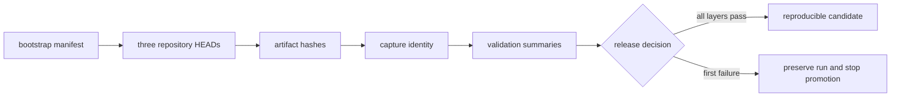
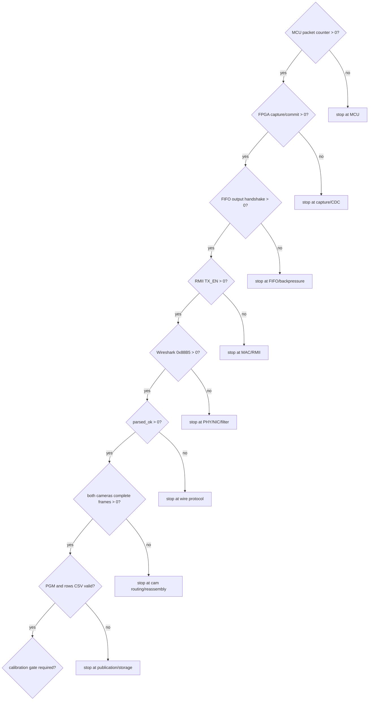

# Independent cold-start reproduction acceptance

## OBJECTIVE

This chapter turns the architecture guides into a falsifiable reproduction
test. A technically competent tester who has not developed PRG_CAM should be
able to create a pinned three-repository workspace, validate the Host with a
known input, build each hardware domain, and record the first failed boundary.
Read chapters 01-06 first. Run this chapter before using chapter 07 to publish
or claim a reproducible release.

The current repository does **not** claim that an independent person has
completed the physical test. The public Host fixture and local-mirror
bootstrap were executed on 2026-08-30; the GitHub-network bootstrap and fresh
120-degree dual-camera hardware run remain `NOT RUN`.

## INPUTS / DEPENDENCIES

- a clean Windows workspace such as `D:\prg\blank_project`;
- Git and Windows PowerShell 5.1 or PowerShell 7;
- the toolchains listed in chapters 02, 04 and 06;
- the target RP2350A/OV5640 units, FPGA board, PHY and known wiring for the
  physical phases;
- authority to install Npcap and program the MCU/FPGA;
- a second person, not the implementation author, for the independent result.

The bootstrap pins these public source identities:

| Domain | Repository/ref used by the script |
|---|---|
| MCU | `-RP2354A-OV5640-Camera-Module` at `6c4157b` |
| FPGA | `FPGA-Based-Camera-Buffer` at evidence-package commit `c52041d` |
| Host | `Host_Camera_Packet_Receiver` at `3910249` |
| TAXI | `bc4a6d3f2aa30156267ad279682e66d99558a633` |
| RMII bridge | `5fef5b5641029777655c5fc34228c3a8b13e4ac9` |

## RUN IDENTITY

There are two identities. `bootstrap_manifest.json` proves which repositories
were cloned. Before hardware capture, `new_run_manifest.ps1` freezes the three
HEADs, dirty states, firmware/bit/LTX/K/D hashes, interface and camera IDs into
an immutable run directory. Empty artifact fields mean `NOT RUN`, never PASS.



## PRECHECK AND DRY-RUN

Clone the FPGA repository as a seed only, then let the supplied script create
the pinned workspace. The seed is not itself experimental evidence.

```powershell
$seed = 'D:\prg\bootstrap_seed_fpga'
$workspace = 'D:\prg\blank_project'

git clone `
  https://github.com/YuweiZhang-002/FPGA-Based-Camera-Buffer.git `
  $seed
if ($LASTEXITCODE -ne 0) { throw 'seed clone failed' }

$bootstrap = Join-Path $seed `
  'scripts_ps\initialize_reproduction_workspace.ps1'
powershell.exe -NoProfile -ExecutionPolicy Bypass -File $bootstrap `
  -WorkspaceRoot $workspace `
  -PreflightOnly
if ($LASTEXITCODE -ne 0) { throw 'bootstrap preflight failed' }
```

`-PreflightOnly` prints all destinations and refs without creating the
workspace. If the target exists with unrelated files, the real run refuses it.
It never resets or overwrites an existing repository.

## MAIN A — PINNED SOURCE CLOSURE

```powershell
powershell.exe -NoProfile -ExecutionPolicy Bypass -File $bootstrap `
  -WorkspaceRoot $workspace
$bootstrapExit = $LASTEXITCODE
if ($bootstrapExit -ne 0) {
  throw "bootstrap failed: $bootstrapExit"
}

$bootstrapManifest = Join-Path $workspace 'bootstrap_manifest.json'
if (!(Test-Path -LiteralPath $bootstrapManifest -PathType Leaf)) {
  throw 'bootstrap manifest was not generated'
}
$identity = Get-Content -Raw -LiteralPath $bootstrapManifest |
  ConvertFrom-Json
$identity.status
$identity.repositories | Format-Table name,resolved_commit,dirty
$identity.third_party | Format-Table name,resolved_commit,dirty
```

PASS requires `bootstrap_ready`, all five hashes equal to the configured refs,
all `dirty` values false, and both required third-party source files present.

## MAIN B — KNOWN-INPUT HOST VALIDATION

Create the Python environment as described by chapter 06, then execute the
tracked positive and negative fixtures:

```powershell
$fpga = Join-Path $workspace 'FPGA'
$host = Join-Path $workspace 'Host'
$python = Join-Path $host '.venv\Scripts\python.exe'
$validator = Join-Path $fpga `
  'scripts_ps\validate_golden_host_fixture.ps1'
$goldenRoot = Join-Path $workspace 'runs\01_host_golden'

powershell.exe -NoProfile -ExecutionPolicy Bypass -File $validator `
  -HostRepository $host `
  -PythonExe $python `
  -OutputRoot $goldenRoot `
  -PreflightOnly
if ($LASTEXITCODE -ne 0) { throw 'Host golden preflight failed' }

powershell.exe -NoProfile -ExecutionPolicy Bypass -File $validator `
  -HostRepository $host `
  -PythonExe $python `
  -OutputRoot $goldenRoot
if ($LASTEXITCODE -ne 0) { throw 'Host golden validation failed' }
```

Do not continue if `golden_validation_summary.json.status` is not `pass`.
This gate removes NIC, Npcap, FPGA and MCU from the Host diagnosis.

## MAIN C — FREEZE THE PHYSICAL RUN

Choose a new run root. Supply only artifacts that really exist; absent fields
remain null and cannot be promoted.

```powershell
$runRoot = Join-Path $workspace 'runs\02_physical_dual_camera_run01'
$manifestTool = Join-Path $fpga 'scripts_ps\new_run_manifest.ps1'

powershell.exe -NoProfile -ExecutionPolicy Bypass -File $manifestTool `
  -RunRoot $runRoot `
  -McuRepository (Join-Path $workspace 'MCU') `
  -FpgaRepository $fpga `
  -HostRepository $host `
  -McuFirmware '<ACTUAL_UF2_PATH>' `
  -FpgaBit '<ACTUAL_BIT_PATH>' `
  -FpgaLtx '<MATCHING_LTX_PATH>' `
  -InterfaceGuid '<ACTUAL_NPCAP_GUID>' `
  -CameraIds '0,1' `
  -CaptureRoot (Join-Path $runRoot 'capture') `
  -PreflightOnly
if ($LASTEXITCODE -ne 0) { throw 'run identity preflight failed' }
```

Replace every angle-bracket value from tool output or a real file. Do not
guess it. Repeat without `-PreflightOnly` only after checking the preview.

## MAIN D — BUILD AND PHYSICAL FIRST-FAILURE TEST

Follow chapter 02 for the MCU build/program step and chapter 04 for recreated
Vivado synthesis, implementation, plain bit, ILA bit/LTX and reports. Then use
chapter 06 for Host live capture. The independent tester records the first
zero or first invalid value and stops diagnosing downstream layers.



## OBSERVED VS EXPECTED

| Probe | Expected | Current observed on 2026-08-30 | Interpretation |
|---|---:|---:|---|
| bootstrap preflight | no writes, exit 0 | exit 0 | VERIFIED |
| five local-mirror clones | pinned, clean | all pinned and clean | VERIFIED locally |
| GitHub-network bootstrap | same identities | NOT RUN in this audit | UNVERIFIED |
| positive golden replay | 960 valid, CRC 0 | 960 valid, CRC 0 | PASS |
| cam0 publication | 1 PGM, 480 CSV rows | 1 PGM, 480 rows | PASS |
| cam1 publication | 1 PGM, 480 CSV rows | 1 PGM, 480 rows | PASS |
| negative golden replay | valid 0, CRC 1 | valid 0, CRC 1 | PASS |
| clean Vivado physical release build | release bit/LTX and closed reports | diagnostic history only | NOT PROVEN |
| independent 120+120 live run | both camera lanes complete | NOT RUN | UNVERIFIED |
| public extrinsic R/t | independent holdout and physical release | WITHHELD | NOT RELEASED |

## PASS / FAIL

`SOURCE_CLOSURE_PASS` requires MAIN A. `HOST_OFFLINE_PASS` additionally requires
MAIN B. `HARDWARE_LINK_PASS` requires the physical first-failure matrix through
both complete camera frames. `SYSTEM_REPRODUCTION_PASS` requires all applicable
build, live receiver and calibration gates. One status must never imply the
next one.

## FAILURE HANDLING

- ExecutionPolicy errors: use the shown child-process `-ExecutionPolicy
  Bypass`; do not change machine policy globally.
- Non-empty workspace/run root: choose a new timestamped directory. Never
  delete another tester's evidence automatically.
- SHA/ref mismatch: stop. Do not silently checkout a different revision.
- Golden SHA mismatch: restore the tracked fixture; do not regenerate it to
  make an unknown Host revision pass.
- cam0 or cam1 zero: inspect payload cam_id, FPGA enable/generics, per-camera
  ingress counters and lane `Unroutable cam_id` before calibration.
- A script exit 0 with JSON not PASS: JSON status governs the experiment.

## EXPORT AND INDEPENDENT SIGN-OFF

Preserve manifests, command transcript, tool versions, build reports,
bit/LTX/UF2 hashes, PCAP, Final Report, rows CSV, PGM counts and every JSON
summary. Copy `docs/templates/independent_reproduction_report.md` into the run
directory and complete it there. The tester records their name, machine,
hardware IDs, first failed
boundary, undocumented help received, and final status. Until a non-author
completes this section, the correct project claim is “guided reproduction
package available; independent physical cold-start acceptance pending.”

## NEXT ACTION

If MAIN B fails, stay in Host. If MAIN B passes but Wireshark has no frames,
start at MCU/FPGA/PHY rather than changing Python. If live frames pass but
calibration fails, preserve K/D/R/t identities and diagnose only chapter 06
quality gates. Publish through chapter 07 only after the independent report is
attached or the limitation is explicitly retained.
