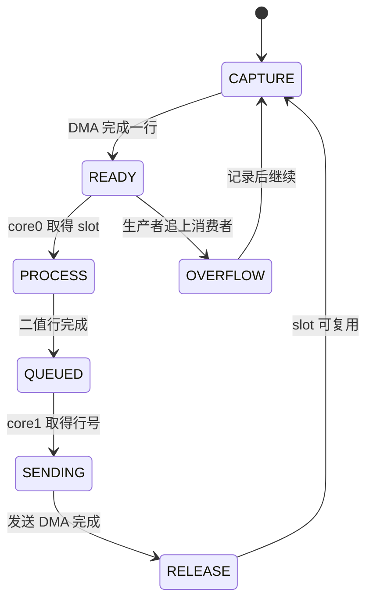

# 01 · MCU 架构与代码指南

## OBJECTIVE / 目标

说明 RP2350/RP2354 侧如何把 OV5640 的 8 位并行数据变为送往 FPGA 的
固定 128 字节行包。本篇只判定 MCU 域；MCU PASS 不能自动推出 FPGA 或 Host
PASS。

## INPUTS / DEPENDENCIES / 输入与依赖

统一复刻目录：

```text
D:\prg\blank_project\
├── RP2354A-OV5640-Camera-Module\
├── FPGA-Based-Camera-Buffer\
└── Host_Camera_Packet_Receiver\
```

活动可执行目标位于 `CMakeLists.txt:55-66`；活动函数库清单位于
`func/CMakeLists.txt:4-13`。`func/hstx.c` 和 `func/imu.c` 虽然存在，但没有
被当前目标链接，不能把它们当成活动发送链路。

## RUN IDENTITY / 运行身份

每次实验至少记录 MCU Git HEAD、dirty 状态、UF2 SHA-256、相机编号，以及
配套 FPGA/Host 的 hash。128 字节包目前没有固件 hash 字段，因此历史 CSV
无法反推出当时烧录的是哪一个固件。

## ACTIVE DATA FLOW / 活动数据流

```mermaid
flowchart LR
  subgraph A[第一列 · 相机输入]
    S[OV5640 D0..D7] --> P[PIO0 SM0]
    V[VSYNC] --> G[PIO0 SM1 鉴别]
    P --> D[DMA 行采集]
  end
  subgraph B[第二列 · 图像处理]
    D --> T[三行窗口]
    T --> E[Sobel 和阈值]
    E --> B[80 字节二值行]
  end
  subgraph C[第三列 · 发送]
    B --> K[128 字节组包]
    K --> Q[跨核 FIFO]
    Q --> X[PIO1 和 DMA]
    X --> F[FPGA 引脚]
  end
  G -.合格帧边界.-> D
```

`main.c:42-75` 初始化 GPIO、PIO、DMA 和 core1。core0 在
`main.c:93-115` 把完成的绝对行号写入 multicore FIFO；core1 在
`main.c:144-171` 取出行号、组包、等待前一次发送结束并启动下一次传输。
因此采集与发送并不共用一个相机中断临界路径。

PIO0 SM0 在 `cam_pio.pio:84-90` 等待 HREF，并在 PCLK 高/低阶段采样；SM1
在 `cam_pio.pio:38-50` 对 VSYNC 脉宽进行鉴别。DMA 的 8 位宽、固定 PIO RX
地址、递增内存地址和 DREQ 位于 `func/cam_pio.c:196-216`。

## BUFFER OWNERSHIP ASM / 缓冲区所有权



三缓冲区及 producer/send/consumer 序号位于 `func/cam_pio.c:63-84`；公开的
占用边界是 `cam_acquire_line()` 与 `cam_release_line()`，位置为
`func/cam_pio.c:301-333`。开始处理不等于可复用，必须走到 RELEASE。

## IMAGE PROCESSING / 图像处理

`fused_row_sq()` 在 `func/image_process.c:96-182` 计算 Sobel 梯度项，
`filter_pack_row_bits()` 在 `func/image_process.c:184-232` 把 640 个像素压成
80 字节。判定式为：

\[
b(x,y)=\begin{cases}1,&G_x^2+G_y^2\ge T^2\\0,&其他。\end{cases}
\]

`T_sq` 的代码初值是 `14400`（`func/image_process.c:16`），它是当前工程
值而不是普适理论阈值。曝光变化、圆环断裂或板面污染会降低 OpenCV 检测率，
即使链路完全不丢包。

## 128-BYTE WIRE CONTRACT / 128 字节契约

唯一事实源是 `func/image_process.c:234-273` 的 `packet_generator()`。

| offset | 含义 | 当前行为 |
|---:|---|---|
| 0–3 | sync | `A5 A0 5A 50` |
| 4 | cam_id | 可由 FPGA 按物理 lane 覆写 |
| 5–6 | frame_id | 大端 |
| 7–8 | row_idx | 大端；row0 才是帧开始 |
| 9 | sender flags | overflow、last、first-processed-row |
| 10 | payload_len | 80 |
| 11–12 | row_seq | 大端连续序号 |
| 13 | reserved | MCU 写 0，FPGA 独立写状态 |
| 24–103 | payload | 80 字节、每像素 1 bit |
| 126–127 | CRC | CRC 高字节、低字节 |

`wire_u16()` 位于 `func/image_process.c:33-39`；sync/帧号/行号/序号在
`239-254` 使用它，CRC 在 `272` 也通过它写出。因此当前
`A5 A0 5A 50` 协议的 CRC 是大端。Host 只为旧的 `A5 A5 5A 5A` ILA 样本
保留小端兼容。

offset9 bit2 的名字必须直译为“首个完成处理的行”。`main.c:152` 只有
`frame_row_idx == 2` 才置位，因为 Sobel 需要三行；它不是 row0，也不是
frame-start。下游从 `row_idx == 0` 判断帧开始。

## OBSERVED VS EXPECTED / 观察与预期

| Probe | Expected | Current observed | 解释 |
|---|---|---|---|
| 采集引擎 | PIO0+DMA | `cam_pio.c` 在活动库 | 源闭包 PASS |
| 发送引擎 | PIO1+DMA | `fpga_pio.c` 在活动库 | 源闭包 PASS |
| bit2 | row2 | `main.c:152` | PASS |
| CRC 顺序 | high/low | `wire_u16(packet_crc)` | PASS |
| 冷启动物理包 | 128 字节稳定 | 需要硬件重跑 | NOT RUN |

## FAILURE HANDLING / 故障处理

相机无行数据时只找第一个为零的位置：VSYNC → SM1 合格 IRQ → PIO0 RX →
DMA 完成 → producer 序号 → 跨核 FIFO → PIO1 DMA。VSYNC 有而 IRQ 无，查
极性与脉宽；IRQ 有而 DMA 无，查 HREF/PCLK 与 PIO wait；MCU 内存正确而
FPGA 引脚错误，才转去查物理总线和 FPGA 采样相位。

出现 `0→1` 时冻结同一行，在 OV5640 GPIO、DMA 原始缓冲、组包前 payload、
FPGA 输入四点比较。最早出现变化的位置才是责任层。不要用最终 PGM 反推所有
上游层。

FPGA offset13 的 `0x10` 表示 MCU→FPGA 入口 CRC 比较失败；Host 对包尾的
CRC 是 FPGA→Host 出口校验。两个 CRC 不能混为一个计数器，标定流程也不负责
开关它们。

## PASS / FAIL 与 NEXT ACTION

MCU 构建 PASS 需要 configure/build 退出 0 和 UF2/ELF hash；硬件 PASS 还需
PIO/DMA 进度与真实 128 字节 golden packet。然后阅读
[02 · MCU 构建、运行与调试](02_mcu_build_run_and_debug_guide.zh-CN.md)，再进入
[03 · FPGA 架构与数据流](03_fpga_architecture_third_party_and_dataflow.zh-CN.md)。
