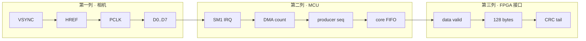

# 02 · MCU 构建、运行与调试指南

## OBJECTIVE / 目标

让第一次接触项目的人在不复制作者本机 `pico-sdk-master` 的前提下完成 MCU
配置、构建和分层排错。以下指令在独立 PowerShell 或 VS Code 的 PowerShell
终端执行。

## INPUTS / DEPENDENCIES

需要 Git、CMake、Ninja（或受支持的生成器）、Pico SDK、Arm 工具链和实际
RP2350/RP2354 编程方式。`CMakeLists.txt:8` 记录 SDK 版本 2.2.0；仓库通过
标准 `pico_sdk_import.cmake` 和 `PICO_SDK_PATH` 找 SDK，不内嵌 SDK。

## RUN IDENTITY / 路径

```powershell
$blankRoot = 'D:\prg\blank_project'
$mcuRoot = Join-Path $blankRoot 'RP2354A-OV5640-Camera-Module'
$mcuBuild = Join-Path $mcuRoot 'build\release'
$picoSdk = '<包含 pico_sdk_init.cmake 的绝对路径>' # 必须替换
$runId = '{0:yyyyMMdd_HHmmss}_mcu_build' -f (Get-Date)
$evidenceRoot = Join-Path $mcuRoot ("build\evidence\$runId")
```

## PRECHECK

```powershell
$precheck = @(
  [pscustomobject]@{Name='MCU root';Pass=Test-Path $mcuRoot -PathType Container}
  [pscustomobject]@{Name='SDK';Pass=Test-Path (Join-Path $picoSdk 'pico_sdk_init.cmake') -PathType Leaf}
  [pscustomobject]@{Name='CMake';Pass=$null -ne (Get-Command cmake -ErrorAction SilentlyContinue)}
  [pscustomobject]@{Name='Git';Pass=$null -ne (Get-Command git -ErrorAction SilentlyContinue)}
)
$precheck | Format-Table -AutoSize
if (@($precheck | Where-Object { -not $_.Pass }).Count -ne 0) {
  throw 'MCU precheck failed'
}
```

所有集合都用 `@(...)` 包裹，零个结果时 `.Count` 仍然是 0，不会出现空管道
含义不明确的问题。

## DRY-RUN / CONFIGURE

```powershell
if (!(Test-Path $mcuRoot)) {
  git clone https://github.com/YuweiZhang-002/-RP2354A-OV5640-Camera-Module $mcuRoot
}
git -C $mcuRoot status --short --branch
git -C $mcuRoot rev-parse HEAD

$env:PICO_SDK_PATH = $picoSdk
cmake -S $mcuRoot -B $mcuBuild -G Ninja `
  -DPICO_PLATFORM=rp2350 `
  -DPICO_BOARD=pico2 `
  -DCMAKE_BUILD_TYPE=Release
if ($LASTEXITCODE -ne 0) { throw 'MCU CMake configure failed' }
```

Configure 只证明 SDK、工具链和 CMake 图成立，不证明 C 编译成功，也不证明
硬件有数据。

## MAIN / BUILD

```powershell
cmake --build $mcuBuild --config Release --parallel
$mcuBuildExit = $LASTEXITCODE
if ($mcuBuildExit -ne 0) {
  throw "MCU build failed with exit code $mcuBuildExit"
}

$artifacts = @(
  Get-ChildItem -LiteralPath $mcuBuild -Recurse -File -ErrorAction SilentlyContinue |
    Where-Object Extension -in '.uf2','.elf','.bin','.hex'
)
$artifacts | Select-Object FullName,Length,LastWriteTime | Format-Table -AutoSize
if (@($artifacts | Where-Object Extension -eq '.uf2').Count -eq 0) {
  throw 'Build returned success but generated no UF2'
}
```

## VALIDATE / EXPORT

```powershell
New-Item -ItemType Directory -Force -Path $evidenceRoot | Out-Null
$artifactRows = @(
  foreach ($artifact in $artifacts) {
    [pscustomobject]@{
      path = $artifact.FullName
      bytes = $artifact.Length
      sha256 = (Get-FileHash -LiteralPath $artifact.FullName -Algorithm SHA256).Hash
    }
  }
)
$artifactRows | ConvertTo-Json -Depth 4 |
  Set-Content -LiteralPath (Join-Path $evidenceRoot 'mcu_artifacts.json') -Encoding UTF8
```

烧录方式取决于实际调试器或 BOOTSEL 盘符，冷启动机器上目前为 UNVERIFIED。
不得编造 OpenOCD interface 名称；若复制 UF2 到盘符，必须先人工核对目标盘。

## HARDWARE OBSERVATION / 观测顺序



逻辑分析仪记录必须包含信号名、时间尺度、电压阈值和地线位置，否则不能作为
可复现实验证据。

## CRC GOLDEN CHECK

当前 CRC 为 CRC-16/CCITT-FALSE：poly `0x1021`、init `0xFFFF`、不反射、
xorout `0`、覆盖 offset0–125、offset126 为高字节。先执行 Host 契约测试：

```powershell
$hostRoot = Join-Path $blankRoot 'Host_Camera_Packet_Receiver'
$python = Join-Path $hostRoot '.venv\Scripts\python.exe'
Set-Location $hostRoot
& $python -m pytest tests/test_packet_format.py -q
if ($LASTEXITCODE -ne 0) { throw 'Host/MCU packet contract regression failed' }
```

真实 128 字节必须作为二进制保存，不能从自动换行的终端手抄十六进制。

## FIRST-FAILURE MATRIX

| 第一个异常点 | 责任层候选 | 下一步 |
|---|---|---|
| 无 VSYNC | 传感器配置/XCLK | 查 `ov5640.c` 与时钟 |
| VSYNC 有、SM1 IRQ 无 | VSYNC 鉴别 | 查 `cam_pio.pio:38-50` |
| IRQ 有、DMA 无 | HREF/PCLK/PIO | 查 `cam_pio.pio:84-90`、`cam_pio.c:204-209` |
| DMA 有、core FIFO 无 | 缓冲所有权/处理 | 查 acquire/release 与 `main.c:93-115` |
| FIFO 有、FPGA 引脚无 | PIO1/DMA/pin mux | 查 `fpga_pio.c` |
| 只在 FPGA 后丢一路 | 尚不能归咎 MCU | 转查 FPGA per-lane 计数 |

## OBSERVED VS EXPECTED

| 项目 | Expected | 证据 | 状态 |
|---|---|---|---|
| SDK 内嵌 | 否 | 标准 import helper | PASS |
| 活动 target | `new_camera_project_app` | `CMakeLists.txt:55-66` | PASS |
| 新 clone 产物 | UF2/ELF/hash | 必须现场执行 | NOT RUN |
| 双路物理输出 | 两路持续进度 | 需要硬件 | NOT RUN |

## FAILURE HANDLING / PASS / NEXT ACTION

SDK not found 时只修 `$picoSdk`；PIO header 缺失时查
`pico_generate_pio_header`；出现 HSTX/IMU 链接错误说明有人改变了活动源清单。
构建成功但无数据时，应转入 first-failure 表而不是反复构建。

构建 PASS = configure/build 退出 0 + UF2/ELF/hash；硬件 PASS 还要真实包和 CRC。
随后阅读
[03 · FPGA 架构、第三方依赖与数据流](03_fpga_architecture_third_party_and_dataflow.zh-CN.md)。
