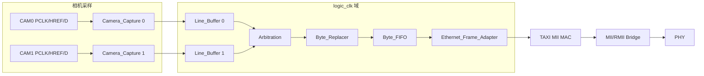

# FPGA 架构、第三方以太网依赖与数据通路

## OBJECTIVE（目标）

本章用于从零复刻两路相机字节总线到 RMII 的有效 FPGA 通路，明确第一方 RTL、外部依赖以及包边界不变量。`prg_cam.srcs/sources_1/new/deprecated/` 中的旧 AXI/DMA 文件只作为历史材料，不属于当前有效源集合。

有效顶层是 `Camera_Ethernet_Top`（`prg_cam.srcs/sources_1/new/Camera_Ethernet_Top.sv:15`）。`USE_CAMERA_PIPELINE=1` 选择相机链路，`ENABLE_CAM1=1` 打开 CAM1（`Camera_Ethernet_Top.sv:16-23`）。冷启动时应以 `scripts/recreate_project.tcl` 建立的源闭包为准，不能把某台电脑旧 XPR 中残留的文件列表当成架构事实。

## INPUTS / DEPENDENCIES（输入与依赖）

| 环节 | 代码锚点 | 职责 |
|---|---|---|
| 顶层选择/探针 | `Camera_Ethernet_Top.sv:15-23` | 选择相机/固定包链路与 CRC 策略 |
| 相机采样 | `Camera_Capture.v:16-31` | 资格化 PCLK/HREF，形成 128 字节行包 |
| 每路包缓存 | `Line_Buffer.v:29-52` | 四个完整包槽与稳定 ready/valid 输出 |
| 包仲裁 | `Arbitration.v:13-18` | 从包头到包尾锁住同一路 grant |
| 字段替换 | `Byte_Replacer.v:16-22` | offset 4/13 替换与 126/127 CRC 输出 |
| 末级 FIFO | `Byte_FIFO.v:14-30` | 吸收下游反压并绑定 data/last |
| 以太网封装 | `Ethernet_Frame_Adapter.sv:7` | 在 128 字节负载外增加 L2 帧 |
| TAXI MAC | `Taxi_Ethernet_Subsystem.sv:7,73-84` | AXI-stream 到 MII MAC/FIFO |
| RMII 桥 | `Ethernet_Mii_Rmii_Bridge.sv:7` | MII 到板级 RMII PHY |

第三方代码不直接纳入本仓库，必须放到约定的本地目录并固定提交：

```powershell
$fpga = 'D:\prg\blank_project\FPGA-Based-Camera-Buffer'
$third = Join-Path $fpga 'third_party'
New-Item -ItemType Directory -Force -Path $third | Out-Null
git clone https://github.com/fpganinja/taxi.git (Join-Path $third 'taxi')
git -C (Join-Path $third 'taxi') checkout bc4a6d3f2aa30156267ad279682e66d99558a633
git clone https://github.com/WangXuan95/FPGA-RMII-SMII.git `
  (Join-Path $third 'FPGA-RMII-SMII')
git -C (Join-Path $third 'FPGA-RMII-SMII') `
  checkout 5fef5b5641029777655c5fc34228c3a8b13e4ac9
```

`third_party/README.md` 记录目录、提交和许可证。TAXI 上游为 CERN-OHL-S-2.0，RMII 上游为 GPL-3.0。“本地构建依赖”仍需记录身份与许可，但不等于将外部源码复制进本项目历史。

## RUN IDENTITY（运行身份）

```powershell
$id = [ordered]@{
  run_id       = Get-Date -Format 'yyyyMMdd_HHmmss_fff'
  fpga_head    = (& git -C $fpga rev-parse HEAD).Trim()
  fpga_dirty   = @(& git -C $fpga status --porcelain).Count -gt 0
  taxi_head    = (& git -C (Join-Path $third 'taxi') rev-parse HEAD).Trim()
  rmii_head    = (& git -C (Join-Path $third 'FPGA-RMII-SMII') rev-parse HEAD).Trim()
  top          = 'Camera_Ethernet_Top'
  packet_bytes = 128
  ether_type   = '0x88B5'
}
$id | ConvertTo-Json -Depth 4
```

历史 bit、LTX、DCP 或 report 不能因为文件名相同就自动代表当前 run；必须保存 SHA-256 和生成它们的 Git/依赖身份。

## PRECHECK（前置检查）

```powershell
$required = @(
  'prg_cam.srcs\sources_1\new\Camera_Ethernet_Top.sv',
  'prg_cam.srcs\sources_1\new\Camera_Pipeline.v',
  'prg_cam.srcs\sources_1\new\Camera_Capture.v',
  'prg_cam.srcs\sources_1\new\Line_Buffer.v',
  'prg_cam.srcs\sources_1\new\Arbitration.v',
  'prg_cam.srcs\sources_1\new\Byte_Replacer.v',
  'prg_cam.srcs\sources_1\new\Byte_FIFO.v',
  'third_party\taxi\src\eth\rtl\taxi_eth_mac_mii_fifo.f',
  'third_party\FPGA-RMII-SMII\RTL\rmii_phy_if.v'
)
$missing = @(
  foreach ($relative in $required) {
    $path = Join-Path $fpga $relative
    if (!(Test-Path -LiteralPath $path -PathType Leaf)) { $path }
  }
)
if ($missing.Count -ne 0) { throw "依赖未闭合：`n$($missing -join "`n")" }
```

这里先把 `foreach` 结果包在 `@(...)` 中，避免空管道后继续访问 `$null`。`add_taxi_sources.tcl` 按 TAXI `.f` 清单递归解析依赖；不要把整个第三方仓库用通配符加入工程，否则可能引入重复包、无关 testbench 和错误编译顺序。

## DRY-RUN（隔离重建）

```powershell
$vivado = 'D:\Xilinx_Vivado\2025.2.1\Vivado\bin\vivado.bat' # <- 实际安装
Set-Location $fpga
& $vivado -mode batch -nolog -nojournal `
  -source .\scripts\recreate_project.tcl
if ($LASTEXITCODE -ne 0) { throw '隔离 Vivado 工程重建失败' }
```

输出是 `build/project_recreate_validation/prg_cam.xpr`。它不会覆盖根目录历史 `prg_cam.xpr`；后者目前含失效的本机引用，不能作为 fresh clone 的入口。

## MAIN（数据流与所有权）



### Camera_Capture

`Camera_Capture` 在 logic_clk 域内资格化相机输入，识别 HREF 行边界，并在合格的 PCLK 事件上采样。每行预期 128 字节；当前无 VSYNC 主链路通过 `LINES_PER_FRAME=480` 回卷帧号（`Camera_Capture.v:16-31`）。长度异常被记录为元数据，不应把短行伪装成完整有效包。

入站 CRC 与出站 CRC 是两个机制。`INGRESS_CRC_ENABLE=1` 时，FPGA 对 offset 0..125 做 CRC-16/CCITT-FALSE，并与 MCU 在 126/127 写入的大端值比较（`Camera_Capture.v:148-158,290-293`）；不一致使 offset 13 的 FPGA status 带 `0x10`。关掉入站比较并不会自动关掉 Byte_Replacer 的出站重算。

### Line_Buffer 与 Arbitration

每路 `Line_Buffer` 有四个 128 字节 slot（`Line_Buffer.v:29-31,79`）；只有完整提交的 slot 才请求仲裁。输出端在 `ready=0` 时保持 data/valid/metadata 稳定（`Line_Buffer.v:161-165,257-281`）。

`Arbitration` 直接用 `grant_onehot` 作为所有权状态。空闲时选请求方，直到 `released` 才清除（`Arbitration.v:69-85`）。因此一个包的 128 字节必须来自同一相机；如果 grant 在包尾握手前变化，就是 RTL 错误。

### Byte_Replacer 与 Byte_FIFO

`Byte_Replacer` 为双缓冲包变换器：offset 4 写 FPGA cam_id；offset 9 原样保留 MCU sender flags；offset 13 写 FPGA status；126/127 写计算出的 CRC 高/低字节，或在关闭出站 CRC 时写 `FF FF`（`Byte_Replacer.v:6-22,129-136`）。它只能在正在捕获或有空闲 buffer 时拉高 `in_ready`（`Byte_Replacer.v:99`）；反压可以暂停上游，但不能移动包尾。

`Byte_FIFO` 把 `{last,data}` 作为一个 9-bit word 保存。只有 `valid&&ready` 才算传输（`Byte_FIFO.v:61-69`）。`almost_full` 是保留一整包空间的预警，真正流控仍由 `in_ready` 决定。

### TAXI 与 RMII

`Taxi_Ethernet_Subsystem` 把 `frame_valid/frame_last/frame_ready` 映射到 TAXI 的 `tvalid/tlast/tready`（`Taxi_Ethernet_Subsystem.sv:73-78`），并永久拉高未使用 RX/completion/stat 输出的 ready，避免内部反压（82-84）。之后 MII/RMII 桥连接板载 PHY。

## VALIDATE（验证）

```powershell
& $vivado -mode batch -nolog -nojournal `
  -source .\scripts\validate_recreated_project.tcl
if ($LASTEXITCODE -ne 0) { throw '重建工程综合验证失败' }
```

当前隔离验证解析了 11 个第一方 RTL、26 个 TAXI RTL、RMII 依赖和 15 个仿真源；`Camera_Ethernet_Top` 综合后无未解析 black box。这是“源码闭合 PASS”，不是“布局布线、时序和真实相机全部 PASS”。

| 探针 | 预期 |
|---|---|
| `camera_arb_grant` | 0 或 one-hot；一包内稳定 |
| `selected_valid && replacer_in_ready` | 一次源字节接收 |
| `replaced_valid && replaced_ready` | 一次替换后字节接收 |
| `camera_packet_last` | 只在 offset 127 拉高 |
| offset 4/9/13 | cam_id / MCU flags / FPGA status 各自独立 |
| offset 126/127 | 与当前 CRC build policy 一致 |

## OBSERVED vs EXPECTED

| 边界 | 预期 | 当前观察 | 结论 |
|---|---|---|---|
| 源闭包 | 无未解析模块 | 最终无 black box | PASS |
| 顶层/泛型 | 相机链路、CAM1、两层 CRC 显式 | 重建脚本均设为 1 | 配置 PASS |
| 综合 | 0 error | 完成；日志峰值内存约 1.944 GB | PASS |
| MARK_DEBUG/IOB | 无冲突 | 相机输入出现 16 条 critical warning | 需 post-route 审查 |
| 根 XPR | 可移植 | 含历史失效引用 | 冷启动 FAIL |

## EXPORT（导出）

每个唯一 run 保存 XPR、DCP、utilization、timing、CDC、日志与源清单。未来统一 manifest 至少应包含第一方/第三方 hash、dirty、Vivado 版本、top/generic、artifact SHA 和状态。默认禁止覆盖旧 run。

## FAILURE HANDLING（故障处理）

| 现象 | 首个检查点 | 动作 |
|---|---|---|
| CAM1 引脚有波形但 Host 为 0 | grant[1]、offset 4 | 从采样→提交→授权→cam_id→Host 路由逐层找第一个 0 |
| 所有行 `0x10` | 入站 126/127 | 验证 MCU 是否真的发大端 CRC，而不是 `FFFF` 占位 |
| A7/A3 或系统性翻位 | 同步后的 data/PCLK/HREF | 查引脚、IOSTANDARD、采样沿和 PCLK 资格化 |
| 反压时包尾错位 | replacer/FIFO ready-valid-last | 在 124..127 周围拉低 ready，要求字节稳定且仅一次 last |
| TAXI 编译失败 | `.f` 与依赖 SHA | 重做依赖 PRECHECK，不递归加入整个仓库 |

## PASS / FAIL

源码闭合、包格式、实现时序和硬件传输必须分别取证。FPGA PASS 不自动推出 Host PASS；综合 PASS 不自动推出 bitstream/PHY PASS。只有同一 run 的边界证据均满足，才可升级结论。

## NEXT ACTION

继续阅读 `04_fpga_vivado_tcl_ila_build_and_debug.zh-CN.md`，用工程状态、report 与 ILA 把上述不变量落到可执行调试流程。
