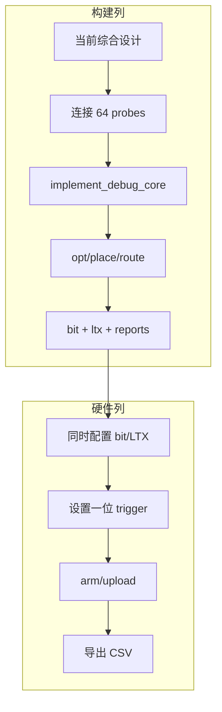

# Vivado 构建、Tcl 自动化、Report、ILA 与硬件调试

## OBJECTIVE（目标）

本章把 FPGA 源闭包转化为仿真、综合、实现、bitstream、report、烧写和 ILA CSV 采集流程，并明确每条 Tcl 命令要求的 Vivado design state。核心目标是避免“在错误工程/错误状态上运行了正确命令”。

冷启动权威入口是 `scripts/recreate_project.tcl`。它从作者维护的 RTL、固定的第三方路径，以及复制到 `build/project_recreate_validation/constraints/` 的 XDC 重建 `build/project_recreate_validation/prg_cam.xpr`。之所以使用副本，是因为 ILA 插核时 `save_constraints` 可能重写活动 XDC；作者维护的 `prg_cam.srcs/constrs_1/new/nexys_a7_ethernet.xdc` 必须保持不变。根目录 `prg_cam.xpr` 保留历史本机引用，不作为复刻入口。

## INPUTS / DEPENDENCIES（输入与依赖）

- Vivado 与 `xc7a50ticsg324-1L` 器件支持；验证机使用 2025.2.1。
- 本仓库 RTL/XDC 与 `third_party/README.md` 固定的 TAXI/RMII 提交。
- Program/Capture 阶段需要 JTAG 目标。
- ILA 烧写必须使用同一次 build 的 `.bit` 与 `.ltx`。

| 任务 | 入口 | 前置 design state |
|---|---|---|
| 重建工程 | `recreate_project.tcl` | 源/器件/依赖可读 |
| 综合闭合 | `validate_recreated_project.tcl` | 隔离 XPR 存在 |
| 综合报告 | `synth_ethernet_bringup.tcl` | synthesized design |
| 实现报告 | `implement_ethernet_bringup.tcl` | 依次 opt/place/route |
| plain bit | `rebuild_gui_ethernet.tcl` | synth_1/impl_1 project runs |
| ILA bit/LTX | `build_ethernet_ila.tcl` | synth 后插核并 route |
| 烧写 | `program_ethernet_ila.tcl` | bit/LTX 存在，硬件可连接 |
| 采集 CSV | `capture_ethernet_ila.tcl` | 已烧写且识别一个 ILA |
| 用户入口 | `scripts_ps/run_ethernet_ila.ps1` | 路径、run root 与完成标记可验证 |

## RUN IDENTITY（运行身份）

PowerShell wrapper 会在 `build/ila_runs/<timestamp>_<action>/` 保存日志和 `run_manifest.json`。至少关联 FPGA HEAD/dirty、Vivado 路径、Tcl 入口、action、trigger、bit/LTX hash、输出 CSV 与状态。MCU SHA、Host SHA、网卡 GUID、camera IDs 和标定 JSON hash 由跨仓库实验 manifest 追加；当前不能谎称单个 FPGA wrapper 已自动获得全部身份。

## PRECHECK（前置检查）

```powershell
Set-ExecutionPolicy -Scope Process -ExecutionPolicy Bypass
# 只影响当前 PowerShell 进程；不会更改 CurrentUser/LocalMachine policy。

$fpga = 'D:\prg\blank_project\FPGA-Based-Camera-Buffer'
$vivado = 'D:\Xilinx_Vivado\2025.2.1\Vivado\bin\vivado.bat' # <- 本机安装
$runner = Join-Path $fpga 'scripts_ps\run_ethernet_ila.ps1'
if (!(Test-Path -LiteralPath $vivado -PathType Leaf)) { throw 'Vivado 不存在' }
if (!(Test-Path -LiteralPath $runner -PathType Leaf)) { throw 'ILA wrapper 不存在' }
& $runner -Action Build -VivadoBin $vivado -PreflightOnly
if ($LASTEXITCODE -ne 0) { throw 'ILA PRECHECK 失败' }
```

若组织策略不允许 process-scope Bypass，应按组织要求签名或审批脚本，禁止
静默放宽机器级 policy。

该 wrapper 的当前约定：0=验证成功，1=环境/路径失败，2=输入或非空输出目录无效，4=产物/完成标记验证失败，5=Vivado/脚本内部失败。Vivado 的真实非零退出另存为 manifest 的 `tool_exit_code`，wrapper 返回 5。历史脚本不一定已统一到该约定。

wrapper 对 Vivado 子进程设置 `XILINX_LOCAL_USER_DATA=no`，并在 `finally` 恢复调用者原值，用于隔离损坏或过期的用户 Tcl-app manifest。未隔离时，本机实际在 Tcl 运行前出现 `[Common 17-356] Failed to install all user apps`。

## DRY-RUN（试运行）

```powershell
& $runner -Action Capture -VivadoBin $vivado `
  -TriggerName camera1_crc_error_pulse_dbg `
  -TriggerPosition 3072 -PreflightOnly
```

预期打印解析后的仓库、Tcl、run root、trigger 和 `PRECHECK_RESULT=PASS`/`DRY_RUN_RESULT=PASS`，且不启动 Vivado、不烧写、不 arm ILA。

## MAIN A：Project Flow


```powershell
Set-Location $fpga
& $vivado -mode batch -nolog -nojournal `
  -source .\scripts\recreate_project.tcl
if ($LASTEXITCODE -ne 0) { throw '工程重建失败' }
& $runner -Action PlainBit -VivadoBin $vivado
if ($LASTEXITCODE -ne 0) { throw 'Plain bitstream 失败' }
```

`rebuild_gui_ethernet.tcl:13-22` reset/launch `synth_1`，再执行 `impl_1 -to_step write_bitstream`，最后打开 `impl_1` 获取 routed reports。源码/XDC 变化后旧 run 属于 stale，不能复用其绿色图标。

## MAIN B：Non-Project Flow

| 命令 | 必须已有的状态 | 产物/后继 |
|---|---|---|
| `read_*` + `synth_design` | 源闭包、part 和约束 | synthesized netlist |
| `opt_design` | synthesized design | optimized design |
| `place_design` | optimized design | placed design |
| `phys_opt_design` | placed/routed design | 时序/物理优化 |
| `route_design` | placed design | routed design |
| `write_checkpoint` | 对应设计已打开 | 该状态 DCP |
| `write_bitstream` | route 完成、DRC 可接受 | bitstream |

`implement_ethernet_bringup.tcl` 按 `opt → place → phys_opt → route` 执行，并在 route 后生成 CDC、DRC、utilization 和 timing（`implement_ethernet_bringup.tcl:40-44`）。需要审计每一步和 checkpoint 时使用此流程。

## MAIN C：ILA 构建、烧写、采样



```powershell
& $runner -Action Build -VivadoBin $vivado
if ($LASTEXITCODE -ne 0) { throw 'ILA build 失败' }
& $runner -Action Program -VivadoBin $vivado
if ($LASTEXITCODE -ne 0) { throw 'ILA program 失败' }
```

ILA 采样时钟是 `logic_clk`。原始相机 PCLK 域信号如果没有同步到 logic_clk，不能仅凭该 ILA 波形推断无毛刺。`program_ethernet_ila.tcl` 同时设置 `PROGRAM.FILE` 与 `PROBES.FILE`；bit/LTX 不匹配会使探针名称和数值失去可信度。

普通 packet trigger：

```powershell
$run = Join-Path $fpga `
  ('build\ila_runs\{0}_packet' -f (Get-Date -Format 'yyyyMMdd_HHmmss_fff'))
& $runner -Action Capture -VivadoBin $vivado `
  -TriggerName camera_packet_valid -TriggerPosition 512 -RunRoot $run
if ($LASTEXITCODE -ne 0) { throw 'ILA capture 失败' }
```

CAM1 CRC 罕见事件需要更多前触发历史：

```powershell
$crcRun = Join-Path $fpga `
  ('build\ila_runs\{0}_cam1_crc' -f (Get-Date -Format 'yyyyMMdd_HHmmss_fff'))
& $runner -Action Capture -VivadoBin $vivado `
  -TriggerName camera1_crc_error_pulse_dbg `
  -TriggerPosition 3072 -RunRoot $crcRun
```

`capture_ethernet_ila.tcl` 要求 trigger 宽度为 1，depth=4096，比较条件为 `==1`，之后上传并输出 CSV。3072 是为行尾错误保留前历史的观察位置，不是质量阈值。

### valid/ready/last 与仲裁标准观察法

1. `valid=1, ready=0` 时 data/last 必须稳定。
2. `valid=1, ready=1` 才发生一次 transfer。
3. `last=1` 必须与最后一个被接收的 byte 同拍。
4. 下游反压时 FIFO level 可升高，但 source ownership 与 byte index 不能回退或换路。
5. `camera_arb_grant` 必须 one-hot，并保持到包尾 transfer。

Starvation 看“request 已高但多久没有 grant”；deadlock 看“valid 持续、ready 永远不返回、FIFO 不下降、任何状态都不前进”的闭环。不能仅看某根 ready 为 0 就宣布死锁。

## VALIDATE（Report 分析）

| 报告 | 重点字段 | 用途 |
|---|---|---|
| timing summary | WNS/TNS、失败端点、unconstrained | 频率是否被证明、哪条路径失败 |
| utilization | LUT/FF/BRAM/BUFG/IO | 资源压力与异常复制 |
| DRC | severity、rule ID | 电气、时钟、routing、bit 阻断条件 |
| clock interaction | clock pair 关系 | timed/async/缺失时钟关系 |
| CDC | crossing topology/severity | 漏同步、错误 bus/pulse crossing |
| methodology | 规则与对象 | 结构/约束隐患 |

判断来源：逻辑级数过深、握手不稳定、锁存或错误复制通常属于 RTL；unconstrained、错误 period、误用 false path、漏 generated clock 属于 XDC；综合估计尚可但 post-route net delay/拥塞占主导，属于 placement/routing 问题。

隔离综合当前无 black box，日志峰值内存约 1.944 GB。随后 ILA 实现完成 routing，并生成一对包含 64 个 probe 的 bit/LTX；峰值内存约 2.446 GB。post-route timing 为 WNS `+1.115 ns`、TNS `0`、WHS `+0.025 ns`、THS `0`。但 unconstrained-path 表非空，DRC 仍有 40 条 warning（包括缺失 `CFGBVS`/`CONFIG_VOLTAGE`），相机输入的 `MARK_DEBUG` 与 IOB/ZHOLD 之间仍出现 16 条 critical warning。因此这次产物可用于 ILA 诊断，不能表述为无告警的 plain release bit。

### CDC 与 Reset

| crossing | 合法结构 | 检查 |
|---|---|---|
| 异步 level | 2FF+、ASYNC_REG | 仅在同步延迟后改变 |
| 异步 pulse | 拉宽、toggle 或 handshake | 不漏、不重复 |
| 多 bit bus | handshake/Gray/async FIFO | 禁止每 bit 独立 2FF |
| async FIFO | Gray pointer 与域内 full/empty | 标志不跨域抖动 |
| reset | 必要时异步 assert、各域同步 release | 时钟稳定前状态不逃逸 |

TAXI 异步 reset exception 的目标 pin 数由 Tcl 显式检查。层级改变后匹配数不对时应失败，不能扩大 wildcard false path 来掩盖。

## OBSERVED vs EXPECTED

| 项目 | 预期 | 当前观察 | 解释 |
|---|---|---|---|
| 隔离工程 | fresh clone 可重建 | PASS | 可用入口 |
| 综合顶层 | 无 black box | PASS | 源闭包成立 |
| 根 XPR | 当前且可移植 | 失效历史引用 | 不作为冷启动入口 |
| ILA bit/LTX | 同次 build | 已生成，64 probes，归档 SHA-256 | 诊断用途 PASS |
| timing | 约束路径 setup/hold 通过 | WNS `+1.115 ns`，TNS `0`，WHS `+0.025 ns`，THS `0` | 约束路径 PASS |
| timing 覆盖 | 无无法解释的 unconstrained path | unconstrained 表非空 | 发布覆盖未证明 |
| DRC | 无未处理发布告警 | 40 warnings，0 error | 仅诊断 bit |
| debug/IOB | 无未处理冲突 | 16 条 `MARK_DEBUG`/ZHOLD critical warning | 调试代价仍存在 |

## EXPORT（导出）

run 目录保存 log、manifest、相关 bit/LTX/DCP/report/ILA CSV。用 `Get-FileHash` 记录 SHA；读取目录时先 `@(...)`，防止空目录触发空管道错误。历史 run 默认 immutable，不覆盖。

## FAILURE HANDLING（故障处理）


只沿第一个失败节点深入；Host 无包时不要先改标定，RMII TX_EN 为 0 时不要先改 Npcap。

| 现象 | 层 | 下一探针 |
|---|---|---|
| CAM 被拒接 | capture/cam_id 路由 | pins→valid→grant→offset4→unroutable |
| 0→1 翻位 | pin/采样/CDC | replacement 前的原始同步 byte |
| 全部 CRC `0x10` | MCU tail/入站 policy | offset126/127 与 CRC event |
| PC 无包 | frame/MII/RMII/PHY/NIC | frame_handshake→TX_EN→Wireshark→Npcap |
| probe 不见 | bit/LTX 不匹配 | 对比 SHA，成对重新烧写 |
| Tcl 执行前出现 `[Common 17-356]` | 用户 Tcl-app manifest 损坏或过期 | 使用随仓库提供的 PowerShell wrapper；它仅对子进程设置 `XILINX_LOCAL_USER_DATA=no` |
| 停在 `Processing IP ... ila:6.2` | Chipscope IP 生成停滞 | 保留 run log、中止 batch、确认作者 XDC hash 未变，再重建隔离工程后重试；旧 bit 时间戳不能当作新一轮成功 |

## PASS / FAIL

Vivado 返回 0 不自动等于实验 PASS。必须同时具备正确源身份、完成标记、匹配产物、无 black box、可接受 timing/DRC 和目标边界的硬件证据。ILA bit 会改变资源与 routing；plain bit 才是部署候选，二者不能混称。

## NEXT ACTION

FPGA/RMII 边界通过后，阅读 `05_host_receiver_architecture_and_reconstruction.zh-CN.md`。若仍无包，继续本章 first-failure 流程，不要跳到 Host 队列或标定阈值。
