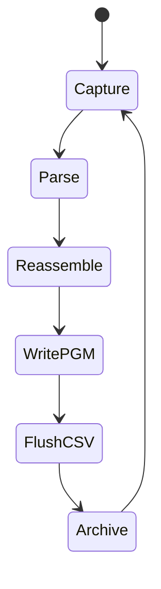
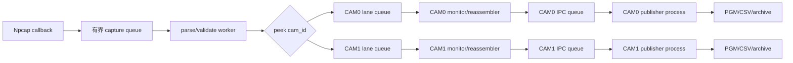

# Host 接收机架构、进程隔离与源码复刻

## OBJECTIVE（目标）

本章解释 packet 在 Host 内部经过哪些队列、worker 和所有权边界，以及为什么将图像发布移到独立 OS process 后，双相机丢包显著下降。六层描述的是验证层级；真正决定吞吐的是“谁会等待谁”。核心不变量是：Npcap 收包与解析不能等待 PGM 转换、CSV flush、archive 序列化或磁盘写入。

本章同时定义整理后的仓库入口，解决根目录 PowerShell/Python 混杂问题。fresh clone 后，用户命令、Python CLI adapter 与可复用 package 各有唯一位置。

## INPUTS / DEPENDENCIES（输入与依赖）

| 类型 | 位置 | 说明 |
|---|---|---|
| 核心包 | `taxi_receiver/` | packet、pipeline、lane、reassembly、publication、calibration |
| 捕获 PS | `scripts_ps/capture/` | Npcap 实时/回放入口 |
| 监视 PS | `scripts_ps/monitoring/` | 只读 viewer/counter |
| 诊断 PS | `scripts_ps/diagnostics/` | A/B 与协议验证 |
| 标定 PS | `scripts_ps/calibration/` | 完整 intrinsic/extrinsic workflow |
| 分析 CLI | `scripts_py/analysis/` | package 的薄适配入口 |
| 标定 CLI | `scripts_py/calibration/` | OpenCV 标定入口 |
| 测试 | `tests/` | 可执行接口约束 |

Python 主入口为 `taxi_receiver.cli:main`（`taxi_receiver/cli.py:250`）。常规用户入口为 `scripts_ps/capture/run_receiver.ps1`，它用 `$PSScriptRoot` 推导仓库根目录，再执行 `python -m taxi_receiver.cli`。根目录旧脚本名不再是受支持入口。

## RUN IDENTITY（运行身份）

Host run 至少记录 run_id/UTC、Host HEAD/dirty、Python/NumPy/OpenCV 版本、Npcap GUID、EtherType、camera IDs、queue/publisher 参数、image/archive root。跨仓库 manifest 还需补 MCU SHA 和 FPGA bit/LTX SHA。接收器的 Final Report 能证明运行计数，不能独自证明加载了哪个 MCU/bit。

## PRECHECK（前置检查）

```powershell
Set-ExecutionPolicy -Scope Process -ExecutionPolicy Bypass
$host = 'D:\prg\blank_project\Host_Camera_Packet_Receiver'
$python = Join-Path $host '.venv\Scripts\python.exe'
$receiver = Join-Path $host 'scripts_ps\capture\run_receiver.ps1'
$required = @(
  $receiver,
  (Join-Path $host 'taxi_receiver\cli.py'),
  (Join-Path $host 'taxi_receiver\pipeline.py'),
  (Join-Path $host 'taxi_receiver\packet_format.py'),
  (Join-Path $host 'taxi_receiver\camera_lane.py'),
  (Join-Path $host 'taxi_receiver\image_pipeline.py')
)
$missing = @(
  foreach ($path in $required) {
    if (!(Test-Path -LiteralPath $path -PathType Leaf)) { $path }
  }
)
if ($missing.Count -ne 0) { throw "Host 源码不完整：$missing" }

Set-Location $host
py -3 -m venv .venv
& $python -m pip install --upgrade pip
& $python -m pip install -r .\requirements-live.txt
& $python -m pip install -r .\requirements-calibration.txt
& $python -m pytest -q
if ($LASTEXITCODE -ne 0) { throw 'Host tests 失败' }
```

当前整理后的 tree 在验证机上得到 `216 passed, 2 skipped`。它证明 Python 合约，不证明另一台电脑的 Npcap 权限、网卡或磁盘吞吐。

## DRY-RUN（试运行）

```powershell
Set-Location $host
& $python -m taxi_receiver.cli --list
$interface = '\Device\NPF_{替换为--list原样输出}'
$images = Join-Path $host 'runs\dry_run\images'
& $receiver -Interface $interface -ImagesRoot $images `
  -CameraIds '0,1' -SplitByCamera on `
  -PublishFrames complete -PublishImages process -WhatIf
```

预期只打印 repo、Python 和 CLI 参数后退出 0。当前 wrapper 没有 `-CrcMode`；CRC 不是可凭空添加的启动参数。历史命令中的 `-RowsCsv` 或把路径传给 `-SessionAudit` 也无效；当前使用 `-NoRowsCsv`、`-OutputRoot` 与 `-SessionAudit on|off|auto`。

## MAIN（packet 流程与解耦）

### 改制前：慢发布环节反馈到收包 worker



线程发布模式下，lane 完成一帧后可能继续做转换、写盘和 CSV flush，完成后才返回 packet 工作。源码注释记录某次 65 秒运行中 lane 有 34 秒阻塞在同线程 publisher（`taxi_receiver/camera_lane.py:139-141`）。单相机的数据量可能仍有余量；双相机同时产生发布任务后，capture queue 堆满并丢包，即使 FPGA/Ethernet 正常。

这不是笼统的“Python thread 慢”，而是依赖反馈：前端 worker 的下一次服务要等待后端 I/O。OS cache 会暂时掩盖延迟，随后集中写回，所以故障呈突发性。

### 当前：capture、camera lane 与 publisher process



`TaxiReceiverPipeline._on_frame` 把 raw Ethernet frame 放进 bounded queue（`pipeline.py:196`），`_run_worker` 消费（224），`_process_frame` 执行分层验证（247）。`peek_camera_id` 在进入 lane 前读取 payload offset 4，也就是完整 Ethernet frame offset 18（`packet_format.py:145`）。

`CameraLanePool` 为配置中的每个 camera 建独立 queue/worker（`camera_lane.py:371-471`）。`CameraImagePipeline` 将完整帧封装成 `_PublishedFrameEnvelope`，独立 OS process 中的 `_run_image_publication_worker` 重建并写出（`image_pipeline.py:187-240,367`）。`-PublishImages process` 是当前模式，`thread` 只保留为受控 A/B baseline。

形象地说，旧系统是两条传送带共用一个既收件又去仓库归档的员工；员工离开收件台时包会堆满。新系统把 CAM0/CAM1 各自交给后端归档室，前台只负责识别、分流和投递到有界箱。磁盘仍可能慢并填满 publisher queue，但不再把耗时静默算在 capture worker 身上。

## PACKET / FRAME CONTRACT（包与帧合约）

当前 sync `A5 A0 5A 50` 使用大端 metadata/CRC；legacy `A5 A5 5A 5A` 保留小端兼容。`first_row` 由 `row_idx==0` 推导；bit2 独立命名为 `first_processed_row`，因为 MCU Sobel 的第一处理行是 row2，并不等于帧首行（`packet_format.py:127-201`）。

`StreamMonitor` 负责 sequence、duplicate、out-of-order、row jump 和错误计数（`stream_monitor.py:87-259`）；`FrameReassembler` 负责 frame session、缺行/替换/超时闭合（`reassembler.py:139-394`）；`CameraImagePipeline` 负责发布策略、恢复判断和 rows CSV。不能把三者压成一个 `ok` 标志。

CSV 只有表头表示“没有行证据”，不能写成“0% valid”。计算比例前必须检查导入行数。

## VALIDATE（验证）

先用固定 PCAP，再做 live：

```powershell
$replay = Join-Path $host 'scripts_ps\capture\replay_pcap.ps1'
$pcap = 'D:\prg\blank_project\evidence\sample.pcapng' # <- 实际证据
$out = Join-Path $host `
  ('runs\{0}_replay' -f (Get-Date -Format 'yyyyMMdd_HHmmss_fff'))
& $replay -Pcap $pcap -OutputRoot $out
if ($LASTEXITCODE -ne 0) { throw 'PCAP replay 失败' }
```

```powershell
$run = Join-Path $host `
  ('runs\{0}_dual' -f (Get-Date -Format 'yyyyMMdd_HHmmss_fff'))
& $receiver -Interface $interface `
  -ImagesRoot (Join-Path $run 'images') `
  -OutputRoot (Join-Path $run 'archive') `
  -ExpectedRows 480 -QueueDepth 65536 `
  -FrameOutputQueueDepth 256 -CameraIds '0,1' `
  -SplitByCamera on -ImagePolicy strict `
  -PublishFrames complete -PublishImages process `
  -PublisherQueueDepth 256 -SessionAudit on -PythonExe $python
```

该命令会占用当前终端直到 Ctrl+C，这是前台采集的正常行为；监控必须开新终端。

## OBSERVED vs EXPECTED

| 边界 | 预期 | 观测字段 |
|---|---|---|
| Npcap | capture ingress 增长 | Capture ingress |
| L2 | matching 增长 | Matching Ethernet |
| parser | valid packets 增长 | Valid/Bad counters |
| cam route | unroutable=0 | Unroutable cam_id |
| capture queue | 目标负载无 drop | peak/drop |
| lane | 两路均增长 | lane peak/drop、per-camera packets |
| publication | 两路 PGM/rows 增长 | cam0/cam1 目录 |
| A/B | 同一输入下 process 明显优于 thread | 需同 PCAP/时长/磁盘重跑后引用 |

## EXPORT（导出）

保存终端日志、summary、per-camera rows CSV、PGM/RAW、PCAP 与 run manifest，并 hash PCAP、bit/LTX 与 calibration JSON。真实接口 GUID、个人路径、原始数据和私有标定结果默认不进入 public Git。

## FAILURE HANDLING（故障处理）

| 现象 | 原因类别 | 第一动作 |
|---|---|---|
| Npcap error 123 | placeholder/非法接口字符串 | 重新 `--list` 并原样复制 GUID |
| 全部 unroutable | offset4 不在 CameraIds | 查 raw byte18 与 FPGA replacement |
| CAM0 有、CAM1 为0 | FPGA CAM1、cam_id 或 Host route | 单路运行并做 first-zero，不调标定 |
| 开图像后才丢包 | publication feedback | thread/process A/B；查 publisher queue/disk |
| rows 有但 PGM 无 | reassembly/publish policy | 查 complete frame 与 publisher failure |
| CSV 只有表头 | 没有 emitted row event | 报 NO EVIDENCE，不算 0% |
| exit 7 | 输出 sink 全失败/被禁用 | 查目录权限、磁盘与错误日志 |

## PASS / FAIL

Host PASS 需要 L2 匹配、packet parse、camera route、queue、完整重组与落盘分别通过。低 capture drop 不自动证明图像正确；有 PGM 也不自动证明未丢包。thread/process 只有在输入、时长、queue 和磁盘一致时才可用于 Discussion 对比。

## NEXT ACTION

继续阅读 `06_host_execution_diagnostics_and_calibration.zh-CN.md`，执行三窗口采集、CAM/CRC/翻位排查与内外参流程。
