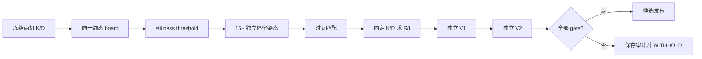

# Host 运行、故障诊断与内/外参标定

## OBJECTIVE（目标）

本章从双相机实时采集推进到单机内参、固定内参双目标定和两次独立 holdout，并提供 CAM 拒接、CRC 与疑似翻位的最短诊断流程。先定义 K/D/R/t/RMSE，再运行命令，避免把“数值收敛”误写成“物理外参可发布”。

当前 public closure 中外参 R/t 状态为 **WITHHELD / NOT RELEASED**。代码和验收门可以复刻，但不存在被本文自动升级为正式发布的公共 R/t。

## INPUTS / DEPENDENCIES（输入与依赖）

```powershell
$host = 'D:\prg\blank_project\Host_Camera_Packet_Receiver'
$python = Join-Path $host '.venv\Scripts\python.exe'
$capture = Join-Path $host 'scripts_ps\capture\run_receiver.ps1'
$intrinsicRunner = Join-Path $host `
  'scripts_ps\calibration\run_intrinsic_calibration.ps1'
$extrinsicRunner = Join-Path $host `
  'scripts_ps\calibration\run_extrinsic_calibration.ps1'
```

验证机实际版本为 Python 3.14.6、OpenCV 4.14.0、NumPy 2.5.1；它们是 observed version，不是本文捏造的最低兼容范围。wrapper 会在每次标定 manifest 中重新记录版本。

Intrinsic 需要同一相机相互独立的 Training、Holdout V1、Holdout V2。Extrinsic 需要 static、Training、V1、V2 四个双相机根目录，每个目录下都必须有 `cam0`、`cam1` PGM。

## RUN IDENTITY（运行身份）

```powershell
$stamp = Get-Date -Format 'yyyyMMdd_HHmmss_fff'
$runBase = Join-Path $host "runs\$stamp"
New-Item -ItemType Directory -Force -Path $runBase | Out-Null
```

标定 wrapper 拒绝非空输出，生成 `run_manifest.json`，记录 HEAD/dirty、输入/count、Python/OpenCV/NumPy、policy、outputs/status。正式实验再补 FPGA bit/LTX SHA、MCU firmware SHA 与 Npcap GUID。

## PRECHECK（前置检查）

```powershell
$required = @($python, $capture, $intrinsicRunner, $extrinsicRunner)
$missing = @(
  foreach ($path in $required) {
    if (!(Test-Path -LiteralPath $path -PathType Leaf)) { $path }
  }
)
if ($missing.Count -ne 0) { throw "缺少入口：$missing" }
Set-Location $host
& $python -c 'import cv2,numpy,taxi_receiver; print(cv2.__version__)'
if ($LASTEXITCODE -ne 0) { throw 'Python/标定依赖失败' }
```

在两路 packet、完整重组与 PGM 通过之前不得启动标定。圆心 detector 不能修复缺行、cam_id 错误、字节整体错位或虚假 CRC status。

## DRY-RUN（试运行）

```powershell
& $intrinsicRunner -CameraId 0 `
  -TrainingRoot 'D:\data\cam0\training' `
  -HoldoutV1Root 'D:\data\cam0\holdout_v1' `
  -HoldoutV2Root 'D:\data\cam0\holdout_v2' `
  -OutputRoot (Join-Path $runBase 'cam0_intrinsic') `
  -PythonExe $python -PreflightOnly

& $extrinsicRunner `
  -StaticRoot 'D:\data\stereo\static' `
  -TrainingRoot 'D:\data\stereo\training' `
  -HoldoutV1Root 'D:\data\stereo\holdout_v1' `
  -HoldoutV2Root 'D:\data\stereo\holdout_v2' `
  -Cam0Intrinsic 'D:\configs\cam0_intrinsics.json' `
  -Cam1Intrinsic 'D:\configs\cam1_intrinsics.json' `
  -OutputRoot (Join-Path $runBase 'extrinsic') `
  -PythonExe $python -PreflightOnly
```

Preflight 检查路径、PGM count、imports、fresh output，并在 stereo 时校验两份内参使用完全相同且明确的物点索引；不写文件。

## MAIN A：三窗口实时采集

### 窗口 A：Receiver

```powershell
Set-Location $host
& $python -m taxi_receiver.cli --list
$interface = '\Device\NPF_{按--list原样替换}'
$captureRoot = Join-Path $runBase 'capture'
$imagesRoot = Join-Path $captureRoot 'images'
$archiveRoot = Join-Path $captureRoot 'archive'
& $capture -Interface $interface `
  -ImagesRoot $imagesRoot -OutputRoot $archiveRoot `
  -ExpectedRows 480 -QueueDepth 65536 `
  -FrameOutputQueueDepth 256 -CameraIds '0,1' `
  -SplitByCamera on -ImagePolicy strict `
  -PublishFrames complete -PublishImages process `
  -PublisherQueueDepth 256 -SessionAudit on -PythonExe $python
```

该窗口到 Ctrl+C 才返回。不要把后续分析命令接在同一前台 pipeline 后面并误判为“卡死”。

### 窗口 B：CAM0 valid frame/pose

```powershell
$host = 'D:\prg\blank_project\Host_Camera_Packet_Receiver'
$python = Join-Path $host '.venv\Scripts\python.exe'
$preflight = Join-Path $host `
  'scripts_py\calibration\preflight_calibration_frames.py'
$imagesRoot = '<复制窗口A同一个imagesRoot>'
$liveRoot = Join-Path (Split-Path $imagesRoot -Parent) 'live_preflight'
New-Item -ItemType Directory -Force -Path $liveRoot | Out-Null
& $python $preflight (Join-Path $imagesRoot 'cam0\*.pgm') `
  --watch --poll-interval 1 --min-poses 15 --zone-map `
  --report (Join-Path $liveRoot 'cam0_preflight_live.csv')
```

### 窗口 C：CAM1

同上，把 `cam0`/文件名改为 `cam1`。单相机 pose 是采集反馈，不等于双目 `selected_pose_pairs`。只有表头的 live CSV 是 NO EVIDENCE：

```powershell
$report = Join-Path $liveRoot 'cam0_preflight_live.csv'
$rows = @()
if (Test-Path -LiteralPath $report -PathType Leaf) {
  $rows = @(Import-Csv -LiteralPath $report)
}
if ($rows.Count -eq 0) {
  Write-Host 'NO ROW EVIDENCE' -ForegroundColor Yellow
} else {
  $valid = @($rows | Where-Object accepted -eq 'True').Count
  [pscustomobject]@{Total=$rows.Count;Valid=$valid;
    Percent=[math]::Round(100.0*$valid/$rows.Count,2)} | Format-List
}
```

## CAM 拒接、CRC 与翻位诊断

CAM0/CAM1 无数据时只查 first-zero：相机 pins → capture valid → committed/request → grant bit → Byte_Replacer offset4 → RMII TX_EN → Wireshark EtherType 88B5/raw payload4 → Host Matching/Valid/lane/unroutable。后级为 0 时才向前级继续；不要先改标定。

CRC 必须分层：MCU 在 payload 126/127 写大端 CRC；FPGA ingress checker 可比较并把 mismatch 写入 offset13 的 `0x10`；Byte_Replacer 又独立重算输出 126/127。标定模块不参与 CRC。先在 FPGA 入站处取 0..127，再算 CCITT-FALSE；之后单独检查 replacement 后结果。

疑似 `0→1` 或错位时，对比同一 byte index 的同步相机数据、Camera_Capture 输出、Byte_Replacer 输入和 Ethernet payload。只有 4/13/126/127 改变属于设计行为；从某处起全部后移通常是 PCLK/HREF/行长边界问题，不应直接归咎 MSB/LSB。

## MAIN B：内参数学与执行

归一化点：

\[
x=X/Z,\quad y=Y/Z,\quad r=\sqrt{x^2+y^2},\quad \theta=\arctan r.
\]

OpenCV fisheye/KB 模型：

\[
\theta_d=\theta(1+k_1\theta^2+k_2\theta^4+k_3\theta^6+k_4\theta^8).
\]

令 \(x'=\theta_d x/r, y'=\theta_d y/r\)，像素为：

\[
u=f_x(x'+\alpha y')+c_x,\qquad v=f_y y'+c_y.
\]

`fx/fy` 是像素焦距，`cx/cy` 是主点，`k1..k4` 是 D 中的鱼眼径向系数，K 是 3×3 内参矩阵。已知 board 物点 \(P_j\) 与检测中心 \(p_{ij}\) 的重投影代价为：

\[
E=\sum_i\sum_j\lVert p_{ij}-\pi(K,D,R_i,t_i,P_j)\rVert^2.
\]

RMSE 是像素域残差，不直接等于毫米精度。

```powershell
$cam0Out = Join-Path $runBase 'cam0_intrinsic'
& $intrinsicRunner -CameraId 0 `
  -TrainingRoot 'D:\data\cam0\training' `
  -HoldoutV1Root 'D:\data\cam0\holdout_v1' `
  -HoldoutV2Root 'D:\data\cam0\holdout_v2' `
  -OutputRoot $cam0Out -PythonExe $python `
  -FisheyeConstraint full -MinPoses 15 `
  -MinViews 15 -MinHoldoutViews 15
if ($LASTEXITCODE -ne 0) { throw 'CAM0 intrinsic 失败' }
```

CAM1 使用独立三套数据重复。`calibration_validation.py:446-451` 的代码默认门为：holdout≥15，median≤0.8 px、P95≤1.2 px、max≤1.5 px、至少 90% 不超过 P95 limit。它们是工程冻结的 code defaults，不是数学定理或未经核查的文献常数。

## MAIN C：外参数学与执行

CAM0 为 reference：

\[
X_1=R_{10}X_0+t_{10}.
\]

若两机分别求出 board pose \(R_{0b},t_{0b}\) 与 \(R_{1b},t_{1b}\)，则：

\[
R_{10}=R_{1b}R_{0b}^{T},\qquad
t_{10}=t_{1b}-R_{10}t_{0b}.
\]

R 是 3×3 rotation，t 是 3×1 且单位随 board spacing 为 mm。正式求解固定 K/D 并调用 `cv2.fisheye.stereoCalibrate`（`stereo_calibration.py:858`）。`intrinsic_point_set()` 解析精确 board indices，`validate_intrinsic_pair()` 对不同或不明确点集直接拒绝；本流程不允许偷偷取交集或把 43 点当 44 点。



采集 15–20 个真实停留段，每个稳定 2–3 秒、位置间快速移动，覆盖中央/四角/俯仰和深度；使用 `quasi_static_episode_minimum` 每个 episode 只保留一帧，而不是让数百张相邻帧获得虚假的独立权重。

```powershell
$extrinsicOut = Join-Path $runBase 'stereo_extrinsic'
& $extrinsicRunner `
  -StaticRoot 'D:\data\stereo\static' `
  -TrainingRoot 'D:\data\stereo\training' `
  -HoldoutV1Root 'D:\data\stereo\holdout_v1' `
  -HoldoutV2Root 'D:\data\stereo\holdout_v2' `
  -Cam0Intrinsic (Join-Path $cam0Out '01_training\cam0_intrinsics.json') `
  -Cam1Intrinsic 'D:\runs\cam1_intrinsic\01_training\cam1_intrinsics.json' `
  -OutputRoot $extrinsicOut -PythonExe $python `
  -PairingMode quasi_static_episode_minimum `
  -MinPairs 15 -MinStaticFrames 200 -WindowFrames 5 `
  -MaxCenterDtMs 33.5 -MaxPredictedMotionPx 0.75 `
  -MaxMotionRatePxPerMs 0.02 -QuasiEpisodeGapFrames 10 `
  -MinCam0EdgeMarginPx 12
$extrinsicExit = $LASTEXITCODE
```

`stereo_calibration.py:635-645` 的默认值包括 min 15 pairs、PnP max 1.5 px、stereo RMS target 1.0 px、rotation dispersion 0.5°、translation `max(0.5 mm, 0.01×baseline)`、depth correlation 0.3 与 slope 0.005 mm/mm。`extrinsic_validation.py:408-417` 的 holdout 默认 median/P95/max=0.8/1.2/1.5 px、90%、rectified vertical P95=1.2 px、rotation=0.5°、translation fraction=0.01。均标注为代码工程门。

`--allow-limited` 只允许产出 limited candidate，永远不能把 unacceptable 变 acceptable。低 RMS 不能覆盖 depth drift 或 baseline 与实测不一致。

## VALIDATE（验收）

```powershell
$manifestPath = Join-Path $extrinsicOut 'run_manifest.json'
if (!(Test-Path -LiteralPath $manifestPath -PathType Leaf)) {
  throw "manifest 不存在：$manifestPath"
}
$manifest = Get-Content -Raw -LiteralPath $manifestPath | ConvertFrom-Json
$manifest.status
$manifest.outputs | Format-List
```

必须先验证 JSON 存在再读取。出现 throw 后手工输入一行绿色 `Write-Host` 不能推翻失败；以退出码、JSON status、quality.failures 和 artifact existence 为准。

## OBSERVED vs EXPECTED

| 数值 | 实际含义 | 判读 |
|---|---|---|
| intrinsic RMS | training 重投影残差 | 不是独立验证 |
| V1/V2 RMSE | 固定 K/D 在新图像上的残差 | 泛化证据 |
| stereo RMS | training pair 联合拟合 | 只说明数值拟合 |
| baseline | `||t||` mm | 与实测距离比较 |
| R/t dispersion | 各姿态相对变换一致性 | 刚性与随机/模型误差 |
| depth drift | t 是否随 board depth 改变 | 刚性 rig 下指向 intrinsic/distortion 系统误差 |
| rectified vertical | 极线垂直残差 | stereo geometry 验证 |

120°+160° 是工程收束，不是理论不可标定；120°+120° 必须作为新 run 重验，历史证据不能自动继承。

## EXPORT（导出）

保存两机 intrinsic JSON/per-view CSV/V1/V2、stillness、pairs CSV/summary、extrinsic candidate 或 rejected JSON、per-pair report、两次 holdout、montage、PCAP/rows/PGM 与 manifest/hash。私有原始数据和未发布参数默认不进 public Git。

## FAILURE HANDLING（故障处理）

| 失败 | 含义 | 下一步 |
|---|---|---|
| path missing | 本终端未定义变量或旧目录层级 | 当前窗口重新定义全部 root |
| output not empty | immutable guard | 新建 timestamp root，不覆盖 |
| not_ready/0 pair | 没有时间匹配静态 episode | 查 still frame、dt 与 episode，不求解 |
| point-set mismatch | 两机内参索引合约不同 | 同点集重标，块 A 禁止 intersection |
| exit3/unacceptable | 质量验证失败 | 保存 rejected diagnostics，不伪造 PASS |
| 大 cross RMSE、低 training RMS | R/t/KD 不泛化或 pair/方向错误 | 查 path、timestamp、indices、transform convention |
| R/t 随 depth 漂移 | 固定刚体参数随距离改变 | 优先查 intrinsic/distortion/board scale |
| CAM1 无图 | 上游数据/路由失败 | 返回 first-zero，不执行 calibration |

## PASS / FAIL

两机各自 Training+V1+V2 acceptable 才能冻结 K/D。外参还必须有明确相同点集、足够独立 episode、training 与两次 holdout、正确变换方向、物理合理 baseline、无 depth-dependent failure。数值收敛不等于物理 release。

## NEXT ACTION

全部通过后按 hash 冻结 K/D/R/t 并写入实验 manifest；否则保存当前 run 并定位第一失败边界。发布操作阅读 `07_git_clone_branch_commit_pr_and_release.zh-CN.md`。
