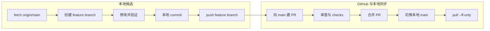

# Git 克隆、分支、提交、PR 与公开发布

## OBJECTIVE（目标）

本章复刻三个仓库的 workspace，并解释发布过程中出现多条 branch 线的原因，给出可逆的 feature branch→PR→main 流程。常规修复禁止 `git reset --hard`、force push、破坏性 checkout 和未经确认的分支删除。

三个 public repo 各自独立：MCU `-RP2354A-OV5640-Camera-Module`、FPGA `FPGA-Based-Camera-Buffer`、Host `Host_Camera_Packet_Receiver`。三者均保留 `main` 为默认分支；工作先进入候选 branch，审查后经 PR 合入 main。

## INPUTS / DEPENDENCIES（克隆）

```powershell
$workspace = 'D:\prg\blank_project'
New-Item -ItemType Directory -Force -Path $workspace | Out-Null
Set-Location $workspace
git clone https://github.com/YuweiZhang-002/-RP2354A-OV5640-Camera-Module.git MCU_Camera_Module
git clone https://github.com/YuweiZhang-002/FPGA-Based-Camera-Buffer.git FPGA-Based-Camera-Buffer
git clone https://github.com/YuweiZhang-002/Host_Camera_Packet_Receiver.git Host_Camera_Packet_Receiver
```

三个目录各有独立 `.git`；放在一起不会合并历史。FPGA 的 TAXI/RMII 是 ignored local build dependency，不属于上述三个第一方 history。

## RUN IDENTITY（先看状态）

```powershell
$repo = Join-Path $workspace 'FPGA-Based-Camera-Buffer'
git -C $repo status --short --branch
git -C $repo branch -avv
git -C $repo log --oneline --decorate --graph --all -n 30
git -C $repo remote -v
git -C $repo remote show origin
```

`HEAD` 是当前 commit；通常附着在 local branch。`origin/main` 是最近一次 fetch 得到的远端 main 记录。ahead=N 表示本地有 N 个 upstream 没有的 commit；behind=N 反之；二者同时存在就是双方从共同祖先分别提交而发生 divergence。non-fast-forward 是远端拒绝一个会丢失现有 commit 的指针移动。

## 为什么图表出现多条线

branch 起初只是指向某 commit 的另一个名字。feature 与 main 各自产生 commit 后，祖先图自然分叉；PR merge commit 会同时指向两个 parent，使线重新汇合但保留历史弧线。因此“彩色跨度仍存在”通常是完整历史，不代表合并失败。

`git push -u origin chore/publication-boundaries` 只会新建/更新同名 remote feature branch，不会更新 main。main 只有在 GitHub 合并 PR 或把兼容的 local main 推到 main 时才移动。feature branch 合并后仍可保留为 archive；其存在不改变默认分支。

过去已经公开的 merge history 没必要为了视觉直线而重写。未来可以在 PR 设置 squash，但当前优先保证可追溯与安全。



## PRECHECK（前置检查）

```powershell
git -C $repo fetch --prune origin
$changes = @(git -C $repo status --porcelain)
if ($changes.Count -ne 0) { throw '工作区不干净，请先逐项检查' }
$branch = (git -C $repo branch --show-current).Trim()
if ([string]::IsNullOrWhiteSpace($branch)) { throw '当前是 detached HEAD' }
```

`fetch --prune` 更新 remote-tracking refs 并移除失效的远端跟踪名，不删除 local branch 和工作文件。切换前必须解释所有 dirty changes。

## DRY-RUN（先比较再合并）

```powershell
git -C $repo log --oneline origin/main..HEAD
git -C $repo log --oneline HEAD..origin/main
git -C $repo diff --stat origin/main...HEAD
git -C $repo diff --check origin/main...HEAD
```

第一条看候选独有 commit，第二条看 main 独有 commit。三点 diff 从 merge base 比较，接近 PR 实际改动范围。

## MAIN A：候选分支与 Push

```powershell
Set-Location $repo
git switch main
git pull --ff-only origin main
git switch -c docs/cold-start-reproduction

git status --short
git diff --check
git add -- docs scripts scripts_ps third_party/README.md `
  THIRD_PARTY_DEPENDENCIES.md .gitignore
git diff --cached --stat
git diff --cached --check
git commit -m "docs: add cold-start system reproduction guides"
git push -u origin docs/cold-start-reproduction
```

| 命令 | 实际动作 |
|---|---|
| `switch main` | 切换工作分支，重叠未保存改动时会拒绝 |
| `pull --ff-only` | 只允许指针直进，不自动产生 merge commit |
| `switch -c` | 从当前 HEAD 建并进入新分支 |
| `status/diff` | 只读检查 working tree/index |
| `add -- paths` | 只 stage 指定发布文件 |
| `commit` | 在本地候选分支形成快照 |
| `push -u` | 建/更新同名远端候选分支并设置 upstream |

这些命令可以在 VS Code Terminal 或独立 PowerShell 执行；关键是先 `Set-Location` 到正确 repo，而不是窗口名称。

## MAIN B：创建和合并 PR

在 GitHub UI 建立 `docs/cold-start-reproduction → main`。若安装并登录了 GitHub CLI：

```powershell
Set-Location $repo
gh pr create --base main --head docs/cold-start-reproduction `
  --title 'docs: cold-start reproduction and debug closure' `
  --body 'Verified MCU/FPGA/Host reproduction, Vivado/ILA, calibration and Git guides.'
```

检查通过后在 GitHub 合并，再同步 local main：

```powershell
git switch main
git pull --ff-only origin main
git log --oneline --decorate --graph -n 12
```

不要在首次 release 为了图表简洁而立即删除 feature branches。

## MAIN C：无 force 的 divergence 修复

未共享的私有 feature 可 rebase：

```powershell
git fetch origin
git switch docs/cold-start-reproduction
git rebase origin/main
```

冲突时：

```powershell
git status
git diff --name-only --diff-filter=U
# 比较两边语义后编辑
git add -- <已解决文件>
git rebase --continue
```

`git rebase --abort` 可回到 rebase 前。若 branch 已 push 且他人可能使用，优先 merge main 进 feature，避免改写公共 SHA：

```powershell
git fetch origin
git switch docs/cold-start-reproduction
git merge --no-ff origin/main
```

## PUBLIC / LOCAL BOUNDARY（公开与本地边界）

| 公开 | 本地/生成/私有 |
|---|---|
| RTL、C/CMake、Python package | Vivado runs、`.Xil`、cache、一般生成 DCP/bit/LTX |
| Tcl/PowerShell/Python 自动化 | cloned TAXI/RMII 目录 |
| 依赖 URL/commit/license | `.venv`、`__pycache__` |
| 已脱敏 schema/config template | raw PCAP/PGM/CSV、真实 GUID、个人路径 |
| 经选择的可复现实验报告 | 未发布的标定 JSON/R/t |

public repo 是由本项目维护并版本化的文件；local build-only dependency 是在固定 commit 获取、用于编译但不复制进 history 的上游源。二者不能混淆，但都要可追溯。

## VALIDATE（发布前后验证）

```powershell
git status --short --branch
git diff --cached --check
$forbidden = @(git ls-files | rg '(^|/)(__pycache__|\.Xil|\.venv)')
if ($forbidden.Count -gt 0) { throw "跟踪了生成文件：$forbidden" }
git log --oneline --decorate origin/main..HEAD
```

注意 `rg` 无匹配会返回非零，但此处代表没有 forbidden 文件；使用 `@(...)` 和 Count 判定，不能直接把“无输出”当脚本失败。

合并后：

```powershell
git switch main
git pull --ff-only origin main
git status --short --branch
git branch --contains <候选commit-sha>
```

## OBSERVED vs EXPECTED

| 项目 | 预期 | 发布决策 |
|---|---|---|
| default branch | 三仓库均 main | 保留 main |
| 候选改动 | feature branch | PR 合并前的审查权威 |
| 彩色 graph | merge ancestry 可见 | 正常，不重写 |
| third-party | FPGA 不跟踪源树 | 本地按 pin clone |
| Host 细节 | Host repo 维护 | FPGA 只描述接口并链接 |
| 原始/生成证据 | 不随源码误提交 | 显式脱敏/选择后才发布 |

## EXPORT（发布记录）

release note 保存三仓库 SHA、两个依赖 SHA、验证命令/结果、限制与 PR URL。三个仓库可用同名 tag，但 tag 不能产生跨仓库原子事务；仍需 manifest 将身份绑定。

## FAILURE HANDLING（故障处理）

| Git 反馈 | 含义 | 安全动作 |
|---|---|---|
| non-fast-forward | 远端有本地缺少的 commit | fetch、看两个 range，再按共享状态 merge/rebase |
| ahead+behind | 历史已分叉 | 先查祖先和 diff，不盲 pull/push |
| unrelated histories | 初始化来源不同 | 立即停止并确认是否真的要合并 |
| source conflict | 两边都改了源码 | 按语义与测试处理，不按时间戳 |
| generated conflict | stale build 产物冲突 | 保留 authored source，重新生成 |
| detached HEAD | 新 commit 没有正常 branch 归属 | 先建/切候选 branch |
| third-party 被 stage | ignore/index 边界错误 | 停止 stage，修复边界但不删除本地依赖 |

## PASS / FAIL

Git 发布 PASS 是：候选 branch、明确 staged scope、测试/复刻通过、PR 指向 main、commit 身份被记录。push feature 不等于合并 main；graph 分叉外观不等于失败；禁止为了美化图形重写 public main。

## NEXT ACTION

按顺序完成 Host tests/CLI dry-run、MCU cold build、FPGA 隔离重建/综合/选定 ILA 流程、双语链接审计，再分别通过 PR 合入三仓库 main。
