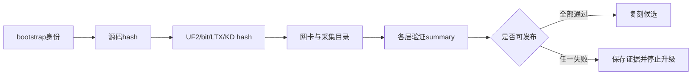
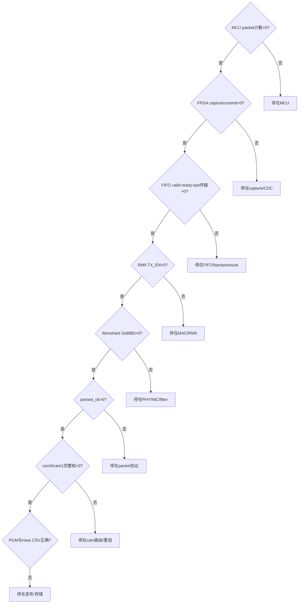

# 独立冷启动复刻验收

## 目标

本章把 01-06 的架构与操作说明变成可以证伪的复刻实验。测试者应具备
基本 FPGA、Python 与 PowerShell 能力，但不得依赖项目作者脑中的隐含路径、
网卡身份或历史 bit。完成本章后再按 07 发布。

当前不能宣称陌生测试者已完成整机复刻。2026-08-30 已验证公开 Host
golden fixture 和本地镜像 bootstrap；GitHub 网络 clone、全新 120+120 实机、
正式 release bit/LTX 与公开外参 R/t 仍分别是 `NOT RUN`、`NOT PROVEN` 或
`WITHHELD`。

## 输入与依赖

- 空目录，例如 `D:\prg\blank_project`；
- Git、PowerShell、02/04/06 指定的 MCU、Vivado、Python/Npcap 工具；
- RP2350A/OV5640、FPGA、PHY、已核实接线；
- 一名非项目实现者作为最终独立测试人。

bootstrap 固定 MCU `6c4157b`、Host `3910249`、FPGA evidence commit
`c52041d`、TAXI `bc4a6d3...633` 和 RMII
`5fef5b5...ac9`。不能把 `main` 当作永远不变的兼容版本。

## Run Identity

`bootstrap_manifest.json` 记录三仓与第三方源码身份；实机前再由
`new_run_manifest.ps1` 记录三仓 HEAD/dirty、UF2、bit/LTX、K/D/R/t hash、
Npcap GUID、camera IDs 与 capture root。空字段表示没有证据，不表示 PASS。



## 阶段 A：预检与三仓克隆

先克隆一个只负责提供 bootstrap 脚本的 seed；实验仓库由脚本另建：

```powershell
$seed = 'D:\prg\bootstrap_seed_fpga'
$workspace = 'D:\prg\blank_project'
git clone `
  https://github.com/YuweiZhang-002/FPGA-Based-Camera-Buffer.git `
  $seed
if ($LASTEXITCODE -ne 0) { throw 'seed clone失败' }

$bootstrap = Join-Path $seed `
  'scripts_ps\initialize_reproduction_workspace.ps1'
powershell.exe -NoProfile -ExecutionPolicy Bypass -File $bootstrap `
  -WorkspaceRoot $workspace `
  -PreflightOnly
if ($LASTEXITCODE -ne 0) { throw 'bootstrap预检失败' }

powershell.exe -NoProfile -ExecutionPolicy Bypass -File $bootstrap `
  -WorkspaceRoot $workspace
if ($LASTEXITCODE -ne 0) { throw 'bootstrap执行失败' }
```

预检不写盘。正式执行拒绝不受管理的非空目录，不 reset、不覆盖已有仓库。
读取 `bootstrap_manifest.json`，必须满足 `bootstrap_ready`、五个 commit 匹配、
dirty 全为 false、两个第三方入口文件存在。

## 阶段 B：已知输入 Host 验证

按 06 建立 Host `.venv` 后，执行正向 960 包和负向 CRC 样本：

```powershell
$fpga = Join-Path $workspace 'FPGA'
$host = Join-Path $workspace 'Host'
$python = Join-Path $host '.venv\Scripts\python.exe'
$validator = Join-Path $fpga `
  'scripts_ps\validate_golden_host_fixture.ps1'
$goldenRoot = Join-Path $workspace 'runs\01_host_golden'

powershell.exe -NoProfile -ExecutionPolicy Bypass -File $validator `
  -HostRepository $host `
  -PythonExe $python `
  -OutputRoot $goldenRoot `
  -PreflightOnly
if ($LASTEXITCODE -ne 0) { throw 'golden预检失败' }

powershell.exe -NoProfile -ExecutionPolicy Bypass -File $validator `
  -HostRepository $host `
  -PythonExe $python `
  -OutputRoot $goldenRoot
if ($LASTEXITCODE -ne 0) { throw 'golden验证失败' }
```

`golden_validation_summary.json.status` 必须是 `pass`。正向应为 ingress/
matching/valid=960、CRC=0、每机一张 PGM 与 480 行 CSV；负向应为 ingress=1、
valid=0、CRC=1。本项只证明 Host 解析、分路、重组和发布，不证明硬件。

## 阶段 C：冻结实机身份

```powershell
$runRoot = Join-Path $workspace 'runs\02_physical_dual_camera_run01'
$manifestTool = Join-Path $fpga 'scripts_ps\new_run_manifest.ps1'
powershell.exe -NoProfile -ExecutionPolicy Bypass -File $manifestTool `
  -RunRoot $runRoot `
  -McuRepository (Join-Path $workspace 'MCU') `
  -FpgaRepository $fpga `
  -HostRepository $host `
  -McuFirmware '<真实UF2路径>' `
  -FpgaBit '<真实BIT路径>' `
  -FpgaLtx '<与BIT匹配的LTX路径>' `
  -InterfaceGuid '<真实Npcap GUID>' `
  -CameraIds '0,1' `
  -CaptureRoot (Join-Path $runRoot 'capture') `
  -PreflightOnly
if ($LASTEXITCODE -ne 0) { throw 'run identity预检失败' }
```

所有尖括号必须由工具输出或真实文件替换。核对预览后去掉
`-PreflightOnly`。run 目录一旦有内容就视为不可覆盖证据。

## 阶段 D：第一失败边界

按 02 构建/烧录 MCU，按 04 生成 plain bit、ILA bit/LTX 和 reports，按 06
启动 Host。只沿第一个异常节点排查：



## 当前 Observed vs Expected

| 探针 | 预期 | 2026-08-30 观测 | 结论 |
|---|---:|---:|---|
| bootstrap预检 | 不写盘、exit 0 | exit 0 | VERIFIED |
| 本地镜像五仓克隆 | 固定且clean | 全部匹配 | VERIFIED locally |
| GitHub网络bootstrap | 同样身份 | NOT RUN | UNVERIFIED |
| 正向golden | valid 960、CRC 0 | 960、0 | PASS |
| cam0/cam1输出 | 各1 PGM、480 CSV行 | 符合 | PASS |
| CRC负向golden | valid 0、CRC 1 | 0、1 | PASS |
| 干净Vivado release build | bit/LTX和关闭的报告 | 只有诊断历史 | NOT PROVEN |
| 独立120+120实机 | 双路完整 | NOT RUN | UNVERIFIED |
| 公开外参R/t | 独立holdout+物理发布 | WITHHELD | NOT RELEASED |

## PASS/FAIL、故障处理与签字

Source closure、Host offline、hardware link、calibration 与 system
reproduction 是逐级状态，前一项 PASS 不能升级后一项。ExecutionPolicy 只对
子进程使用 `Bypass`；目录非空时改用新时间戳目录；hash 不一致立即停止；
cam0/cam1 为零时先查 payload cam_id、FPGA enable/generic、每路 ingress 与
`Unroutable cam_id`，不要先改 OpenCV。

最终保存 manifest、命令记录、版本、reports、UF2/bit/LTX hash、PCAP、Final
Report、rows CSV、PGM 计数和 JSON summary。把
`docs/templates/independent_reproduction_report.md` 复制到本次 run 内再填写，
不要修改仓库模板。独立测试者写明姓名、机器、硬件
身份、第一失败层和是否接受过未写入手册的帮助。在非作者完成实机阶段前，
准确表述应是：“已有引导式复刻包，独立物理冷启动验收待完成”。
