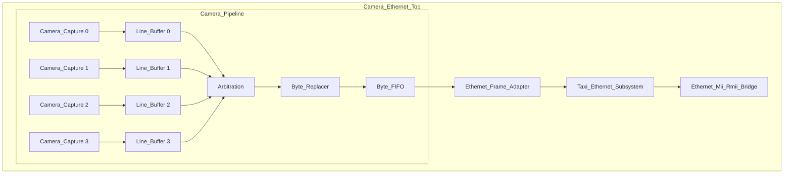
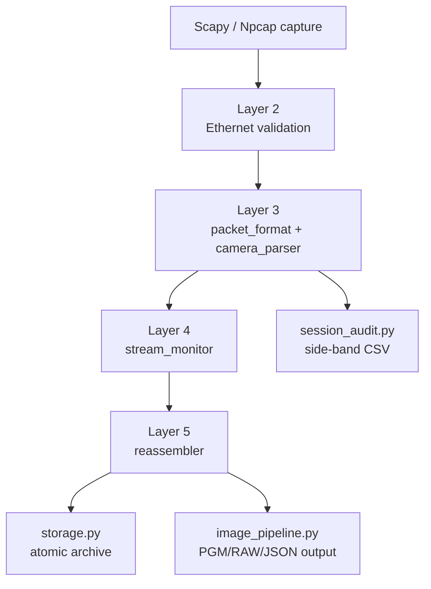

# 当前系统架构精简分析

> 适用范围：当前工程的 FPGA RTL、以太网发送链、Python 接收机与 MCU 端特殊机制。
> 目标：给 report 直接引用，尽量只写当前事实，不展开改进建议。

## 1. 一句话结论

当前系统是一个以 128-byte 行包为核心的数据链路：MCU 侧负责把相机像素打包成固定格式的行帧，FPGA 侧负责采样、校验、分路、仲裁和 Ethernet 封装，PC 侧 Python 接收机负责抓包、解析、重组、审计和归档。系统的关键边界不是“图像处理”，而是“行包协议 + 反压/缓存 + 会话审计”。

## 2. 端到端主流程

```mermaid
flowchart LR
    A[RP2350A / MCU
PIO + DMA + packet generator] --> B[FPGA input pins
PCLK / HREF / D0-D7]
    B --> C[Camera_Capture
2FF sync + PCLK filter]
    C --> D[Line_Buffer x4
4-slot line ring]
    D --> E[Arbitration
packet-level round robin]
    E --> F[Byte_Replacer
patch cam_id / flags / CRC]
    F --> G[Byte_FIFO
9-bit packet FIFO]
    G --> H[Ethernet_Frame_Adapter
14-byte Ethernet II header]
    H --> I[Taxi_Ethernet_Subsystem
AXI-Stream -> MII MAC]
    I --> J[Ethernet_Mii_Rmii_Bridge
MII <-> RMII]
    J --> K[LAN PHY / cable]
    K --> L[PC NIC + Npcap / Scapy]
    L --> M[Python receiver
capture -> validate -> parse -> monitor -> reassemble]
    M --> N[Storage / image output / session_audit.csv]
```

## 3. FPGA 侧架构

### 3.1 当前活动数据通路

当前顶层是 `Camera_Ethernet_Top`，活动路径以 `Camera_Pipeline` 为核心。`Camera_Pipeline` 内部有 4 路 `Camera_Capture`、4 路 `Line_Buffer`，再经过 `Arbitration`、`Byte_Replacer` 和内部 `Byte_FIFO`，最后进入 `Ethernet_Frame_Adapter` 与 Taxi Ethernet 子系统。

### 3.2 关键功能模块

- `Camera_Capture.v`: 把异步 `PCLK/HREF/data` 转成 `sys_clk` 域的字节流与行边界脉冲；内部采用等深度 2FF 同步和 PCLK 去抖。
- `Line_Buffer.v`: 每路 4 槽行缓存，负责行级预留、提交、丢弃统计和固定长度输出。
- `Arbitration.v`: 按包粒度做 one-hot grant，保证同一包在发送期间不会切源。
- `Byte_Replacer.v`: 在输出字节流上补写 `cam_id`、`flags` 并重算 CRC。
- `Byte_FIFO.v`: 9-bit 同步 FIFO，承接 `{last,data}` 并向下游 AXIS/Adapter 提供反压。
- `Ethernet_Frame_Adapter.sv`: 在 128-byte payload 前添加 14-byte Ethernet II header。
- `Taxi_Ethernet_Subsystem.sv` 与 `taxi_eth_mac_mii_fifo`: 负责 AXI-Stream 到 MII MAC 的封装、异步 FIFO 与 MAC 侧收发时序。
- `Ethernet_Mii_Rmii_Bridge.sv` 和 `rmii_phy_if.v`: 完成 MII 与 RMII 的时钟/位宽转换，连接板载 PHY。

### 3.3 当前时钟和约束事实

- FPGA 逻辑主时钟是 `100 MHz sys_clk`。
- Taxi / Adapter / Camera pipeline 的核心控制逻辑都在 `sys_clk` 域。
- PHY 侧通过桥接器输出 RMII 信号，板级 Ethernet 管脚已经在当前 XDC 中绑定。
- 当前实现的重点不是“多时钟并行处理”，而是“单一 sys_clk 域内完成采样后封包，再交给 Ethernet 子系统跨域发送”。

## 4. MCU 特殊机制

MCU 侧不是简单的“像素转发器”，而是协议边界的创建者。它的特殊机制主要体现在三点：

1. PIO + DMA 负责把连续像素组织成稳定的行级 wire packet，而不是让 FPGA 在原始像素流上做复杂协议重建。
2. 行包是固定 128 byte，FPGA 只负责接收和补充少量元数据，不负责重新定义整包格式。
3. 协议头里保留了同步字、frame/row 标识、flags、payload_len、row_seq 和尾部 CRC16，因此 MCU 侧是“协议生产者”，FPGA 侧是“协议验证与转发者”。

当前 `packet_format.py` 定义的行包结构是：

- 24-byte header
- 80-byte packed payload
- 24-byte trailer
- 总长度 128 byte

其中同步字和标志位是协议的关键边界：

- sync words: `A5A0 / 5A50`
- flags: `frame_overflow / last_row / first_row / length_error`
- CRC16: 用于 Python 侧和 FPGA 侧的协议一致性校验

## 5. Python 接收机架构

Python 侧是分层式接收链，不把业务逻辑塞在一个文件里，而是按“抓包 -> 验证 -> 解析 -> 统计 -> 重组 -> 归档”的顺序执行。

### 5.1 主要函数和职责

- `capture.py`: 只负责从 NIC/Npcap 拿到完整 Ethernet frame，输出 `RawEthernetFrame`。
- `pipeline.py`: 只做线程、队列和 stage chain 编排，不做具体协议判断。
- `packet_format.py`: 定义 128-byte packet layout、CRC16 和 `build_camera_row` / `parse_camera_row`。
- `camera_parser.py`: 根据模式解析固定帧或 camera 行包，并产出带结果对象的解析状态。
- `stream_monitor.py`: 记录收包速率、gap、重复、乱序和吞吐统计。
- `reassembler.py`: 以 `(cam_id, frame_id)` 为键重组会话，并处理超时、重复和缺失行。
- `storage.py`: 原子写出 frame 目录、raw、json、csv 和 summary。
- `session_audit.py`: 对每个处理上下文写一行审计 CSV，并传播同一 frame 内的 `0x08` 污染。

### 5.2 关键 orchestration 机制

`pipeline.py` 不是协议层，它只是把每个 frame 送进 stages 链。这个设计的意义是：

- 可以只跑到 validate、parse、monitor 或 reassemble 任意层。
- 可以把 capture 速率和后端处理速率分开观察。
- 存储失败不会抹掉审计记录，因为 `on_frame_processed` 是独立观察边界。

### 5.3 `session_audit.csv` 的特殊作用

`session_audit.py` 不是输出图像的主链路，而是旁路审计。

- `row_flags_raw` 保留原始接收值。
- `row_flags_effective` 会在同一 `(cam_id, frame_id)` 内传播 `0x08`。
- 如果 frame_id / row_seq 出现大幅回退，logger 会重开 CSV，防止把不同电源周期的数据混在一起。

这使得 Python 侧不仅能“看见数据”，还能“看见数据是如何污染和恢复的”。

## 6. 报告可直接引用的功能点

### FPGA RTL

- `Camera_Pipeline.v`
- `Camera_Capture.v`
- `Line_Buffer.v`
- `Arbitration.v`
- `Byte_Replacer.v`
- `Byte_FIFO.v`
- `Camera_Ethernet_Top.sv`
- `Ethernet_Frame_Adapter.sv`
- `Ethernet_Mii_Rmii_Bridge.sv`

### Python 接收机

- `packet_format.py`
- `camera_parser.py`
- `pipeline.py`
- `stream_monitor.py`
- `reassembler.py`
- `storage.py`
- `session_audit.py`
- `image_pipeline.py`

### 当前文档来源

- `docs/20_project_architecture_and_debug_training.md`
- `docs/taxi_ethernet_integration.md`
- `docs/taxi_local_file_manifest.md`
- `docs/rp2354_fpga_side_architecture_report.md`

## 7. 简短总结

如果要把当前系统概括成一个 report 句子，可以写成：

> 当前系统以 RP2350A 生成的 128-byte 行包为协议边界，FPGA 完成同步采样、行缓存、仲裁与 Ethernet 封装，PC 侧 Python 接收机完成分层验证、重组、审计与归档，整条链路的核心约束是固定 packet layout、明确的 flags 语义和可追踪的 session 机制。
