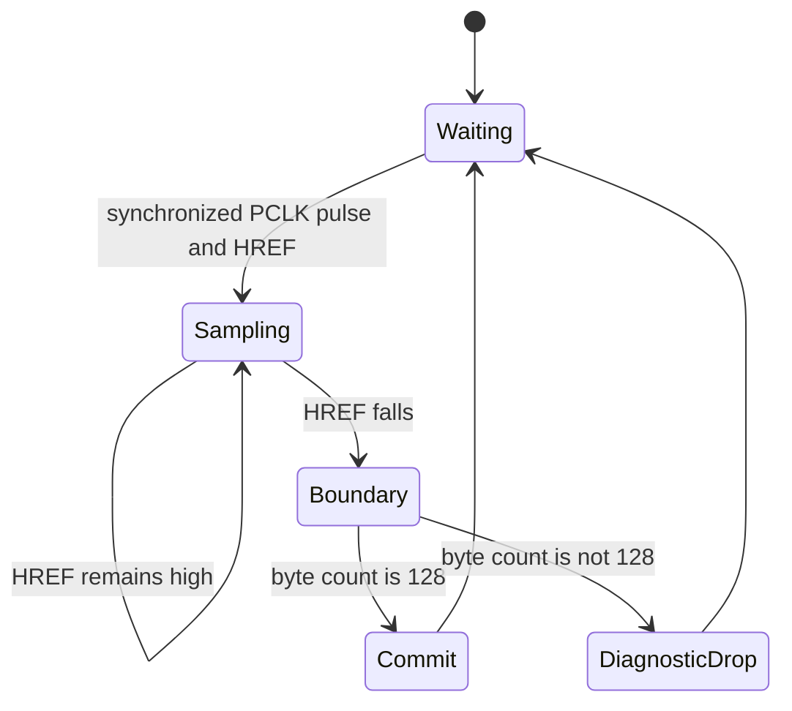
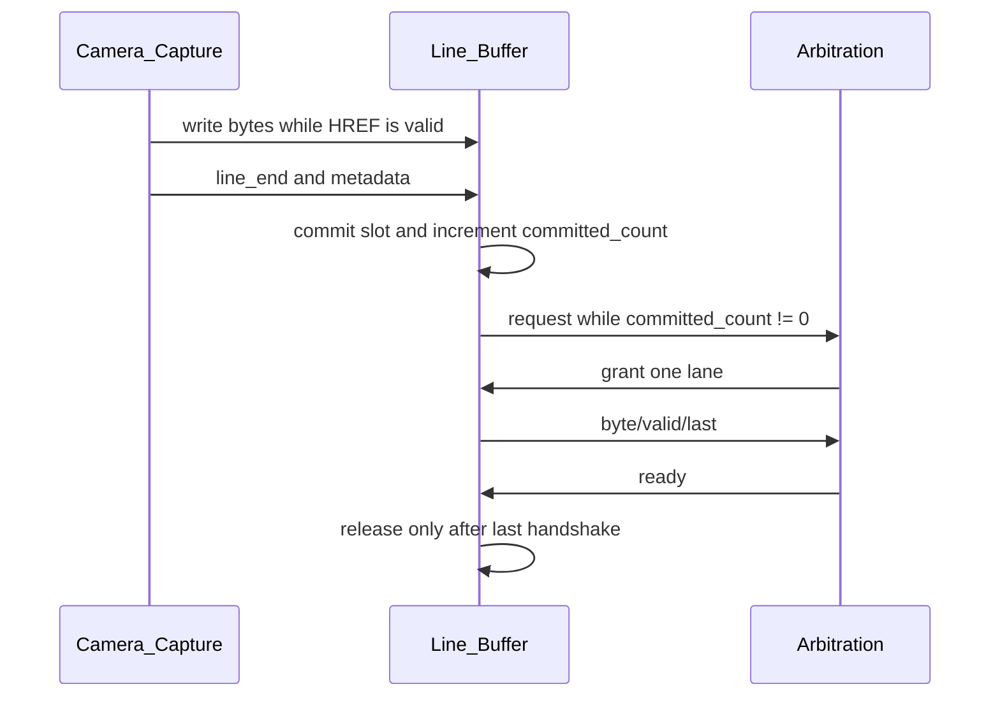
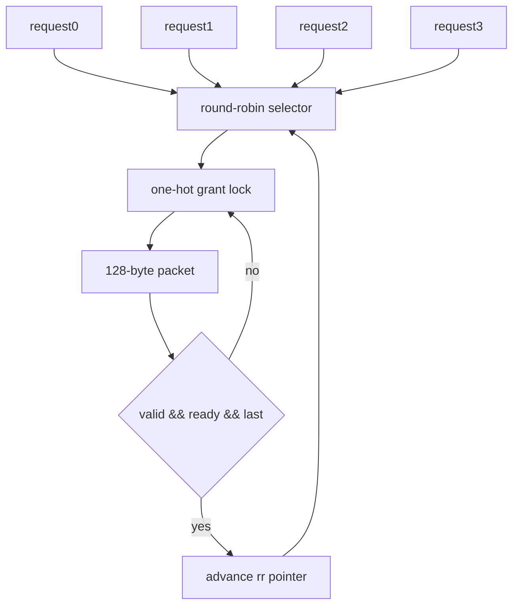
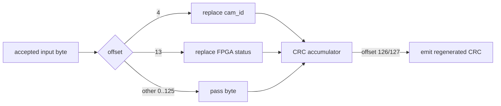
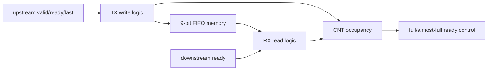
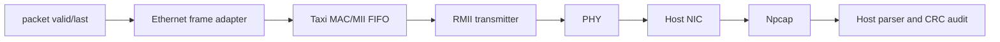
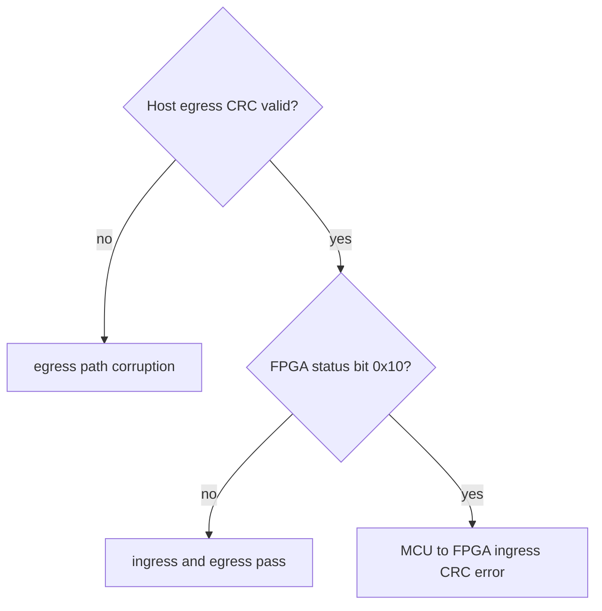
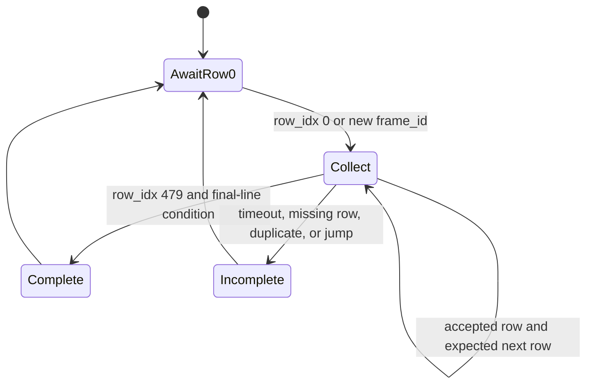

# FPGA Architecture Diagrams

These diagrams document the active control relationships without inventing explicit RTL state names.

## Camera capture implicit ASM

## Line Buffer read/write interlock

## Arbitration authorization

## Byte Replacer CRC processing

## Byte FIFO TX/RX/CNT relationship

## Ethernet and Host receive chain

## CRC dual-layer audit decision

## Host frame reassembly state view

The Host implementation represents these states through frame-id/row-index maps and result records rather than a single enum state variable.
