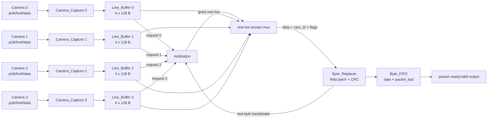
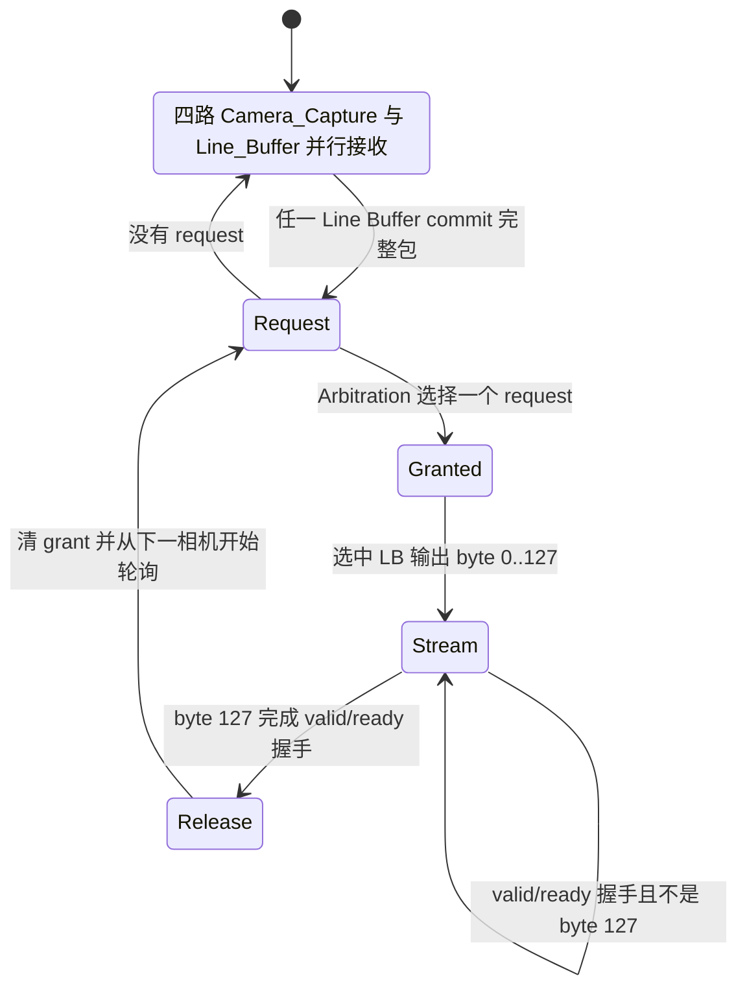
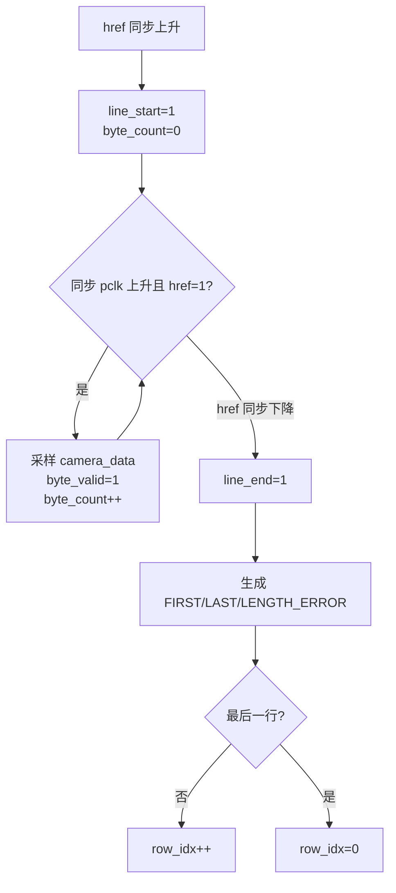
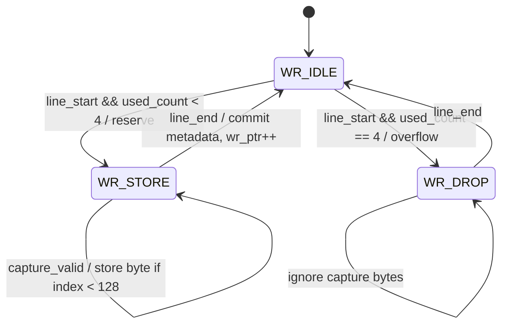
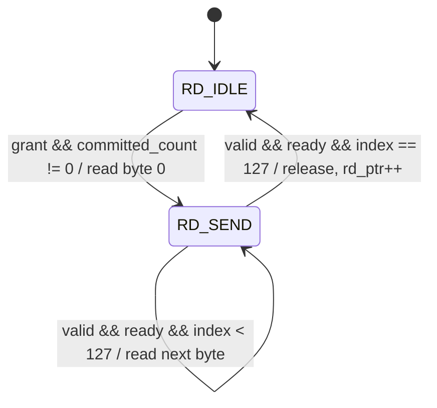
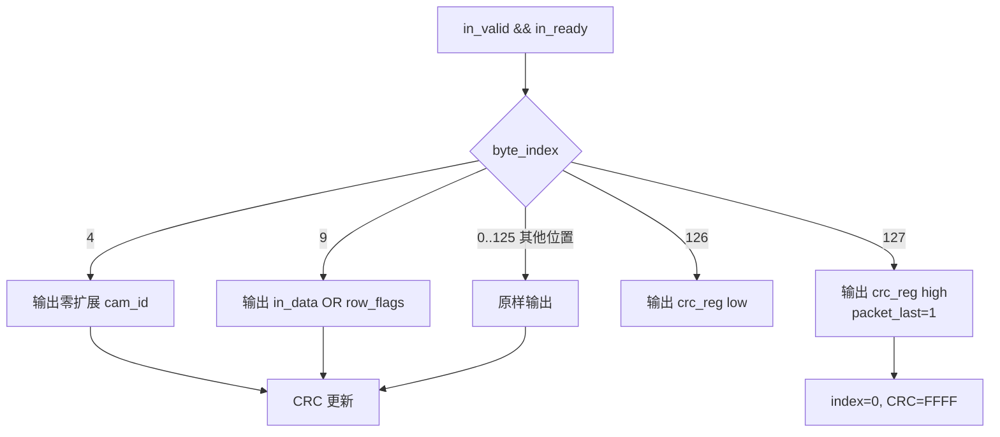

# FPGA 四相机模块结构与运行逻辑

更新日期：2026-07-17

本文描述当前 Vivado synthesis top `Camera_Pipeline`。当前协议的关键前提是：相机侧送入的已经是一个完整的固定 128-byte 行包，FPGA 不再生成包头或拆分 payload，只补入 FPGA 才能确定的 `cam_id`、`row_flags`，并重算包尾 CRC。

## 1. 当前有效 RTL

| 文件 | 实例数量 | 作用 |
|---|---:|---|
| [`Camera_Pipeline.v`](../prg_cam.srcs/sources_1/new/Camera_Pipeline.v) | 1 | 四相机顶层、one-hot 数据选择、最终输出 FIFO |
| [`Alarmer.v`](../prg_cam.srcs/sources_1/new/Alarmer.v) | 4 | 将异步 `pclk` 上升沿转换成 `sys_clk` 域单周期脉冲 |
| [`Camera_Capture.v`](../prg_cam.srcs/sources_1/new/Camera_Capture.v) | 4 | 采集 8-bit 数据、检测 href、统计 128-byte 长度和行号 |
| [`Line_Buffer.v`](../prg_cam.srcs/sources_1/new/Line_Buffer.v) | 4 | 每相机 4×128-byte 环形缓冲、向仲裁器请求完整包 |
| [`Arbitration.v`](../prg_cam.srcs/sources_1/new/Arbitration.v) | 1 | 四路完整包 round-robin 仲裁 |
| [`Byte_Replacer.v`](../prg_cam.srcs/sources_1/new/Byte_Replacer.v) | 1 | 合并 `cam_id/row_flags`，计算 CRC-16 |
| [`Byte_FIFO.v`](../prg_cam.srcs/sources_1/new/Byte_FIFO.v) | 1 | 仲裁和 CRC 后的 9-bit 输出 FIFO |
| [`System_ClkControl.v`](../prg_cam.srcs/sources_1/new/System_ClkControl.v) | 0 | 可选板级 reset 工具，当前 top 未实例化 |

以下两个旧模块已经移到 [`new/deprecated/`](../prg_cam.srcs/sources_1/new/deprecated/README.md)：

- `Packet_Formatter.v`：不再需要重新生成 header、payload padding 和 row sequence。
- `Stream_Byte_Replacer.v`：只能替换一个固定 byte，不能完成双字段合并和 CRC。

## 2. Top module

### 2.1 顶层端口分组

`Camera_Pipeline` 使用一个公共 `sys_clk` 和四组相机输入：

```text
sys_clk, rst

cam0_pclk, cam0_href, cam0_data[7:0]
cam1_pclk, cam1_href, cam1_data[7:0]
cam2_pclk, cam2_href, cam2_data[7:0]
cam3_pclk, cam3_href, cam3_data[7:0]

packet_data[7:0], packet_valid, packet_ready, packet_last
```

调试输出包括：

- `arb_grant[3:0]`：当前 one-hot 仲裁结果。
- `overflow_pulse[3:0]`：对应 Line Buffer 无空槽时的一拍脉冲。
- `dropped_packet_count_0..3`：每路被整包丢弃的累计数量。
- `buffer_used_count[11:0]`：每路 3-bit `used_count`。
- `buffer_committed_count[11:0]`：每路 3-bit `committed_count`。
- `packet_fifo_level`、`packet_fifo_almost_full`：最终输出 FIFO 状态。

### 2.2 完整连接图



`Byte_Replacer` 只实例化一次。CRC 单元位于仲裁之后，因此不会为四路相机复制四份 CRC 组合逻辑。

### 2.3 顶层 ASM



## 3. 时钟域

### 3.1 `pclk` 和 `sys_clk`

- `pclk0..3`：四个相机各自输出的异步采样时钟。
- `sys_clk`：FPGA 板载 100 MHz 时钟。
- 所有 Line Buffer、Arbitration、Byte Replacer、CRC 和 Byte FIFO 都只在 `sys_clk` 域运行。

每个 `Alarmer` 内部包含两级 `ASYNC_REG` 同步寄存器和一个延迟寄存器：

```text
pclk -> clk_meta -> clk_sync -> clk_sync_d
alarm = clk_sync && !clk_sync_d
```

### 3.2 使用条件

这种方案按照当前指示采用 `sys_clk` 观察 `pclk` 边沿。它要求：

1. `sys_clk` 明显快于 `pclk`，使 pclk 高、低电平都能被同步器观察到。
2. 相机 `data[7:0]` 在物理 pclk 上升沿之后保持稳定，直到同步后的 `alarm` 被处理。
3. 推荐 `sys_clk:pclk` 留出至少约 4:1 的工程余量。

如果实际相机 pclk 太高或数据保持时间不满足上述条件，应将 Camera Capture 改成 pclk 域写入、sys_clk 域读出的异步 FIFO。仅用同步器同步多 bit 数据总线不能替代异步 FIFO。

## 4. 128-byte 包定义

包头保持 MCU 的 packed 结构：

```c
typedef struct __attribute__((packed)) {
    uint16_t sync0;
    uint16_t sync1;
    uint8_t  cam_id;
    uint16_t frame_id;
    uint16_t row_idx;
    uint8_t  row_flags;
    uint8_t  payload_len;
    uint16_t row_seq;
    uint8_t  reserved[3];
} pkt_row_header_t;
```

| Offset | 长度 | 字段 | FPGA 行为 |
|---:|---:|---|---|
| 0..3 | 4 | `sync0/sync1` | 原样通过 |
| 4 | 1 | `cam_id` | 替换为 `{6'd0, cam_id[1:0]}` |
| 5..8 | 4 | `frame_id/row_idx` | 原样通过 |
| 9 | 1 | `row_flags` | 原 byte OR FPGA flags |
| 10..15 | 6 | `payload_len/row_seq/reserved` | 原样通过 |
| 16..125 | 110 | 包数据 | 原样通过；短包缺失区由 LB 补零 |
| 126 | 1 | CRC low | FPGA 重算并覆盖 |
| 127 | 1 | CRC high | FPGA 重算并覆盖，`packet_last=1` |

### 4.1 FPGA flags

| Bit | 名称 | 置位条件 |
|---:|---|---|
| 0 | `FIRST_ROW` | 复位后 row 0，或上一帧最后一行后的 row 0 |
| 1 | `LAST_ROW` | row 等于 `LINES_PER_FRAME-1` |
| 2 | `FRAME_OVERFLOW` | 当前帧至少有一个包因 Line Buffer 满而丢弃 |
| 3 | `LENGTH_ERROR` | href 高电平期间观察到的 byte 数不等于 128 |
| 7..4 | 保留 | FPGA 不主动置位，原包对应 bit 会保留 |

最终 offset 9 的值为：

```text
output_row_flags = original_packet_byte_9 | generated_flags
```

因此 FPGA 不会清除上游已经写入的任何 flags。

## 5. `Camera_Capture`

### 5.1 寄存器

| 寄存器 | 用途 |
|---|---|
| `href_meta/href_sync/href_sync_d` | href 两级同步和边沿检测 |
| `row_idx` | 无 VSYNC 行号；复位从 0 开始 |
| `byte_count` | 当前 href 区间观察到的 byte 数，9-bit 饱和 |
| `line_flags` | href 下降时锁存 FIRST/LAST/LENGTH_ERROR |

`cam_id` 是实例参数，不需要运行时寄存器。

### 5.2 接收流程



没有 VSYNC。系统依赖 MCU/相机在 FPGA reset 后从帧 0 的第一行重新开始发送。

## 6. `Line_Buffer`

### 6.1 删除的复杂状态

当前实现已经删除：

```text
slot_busy[]
slot_ready[]
capture_active
capture_drop
```

FIFO 顺序保证 `wr_ptr` 和 `rd_ptr` 不会指向需要逐 slot 查询的任意位置，因此没有必要保存四组 busy/ready bit。

### 6.2 核心状态

| 信号 | 含义 |
|---|---|
| `wr_ptr` | RX 下一次预留/提交的 slot |
| `rd_ptr` | TX 下一次发送的 committed slot |
| `used_count` | 已预留、已提交和正在发送的 slot 总数 |
| `committed_count` | 已完整接收但尚未完成最后 byte 握手的包数 |
| `WR_IDLE/WR_STORE/WR_DROP` | 写侧三个状态 |
| `RD_IDLE/RD_SEND` | 读侧两个状态 |

必须始终满足：

```text
0 <= committed_count <= used_count <= 4
request = (committed_count != 0)
```

### 6.3 双 agent 和计数块

RTL 被拆成三个职责明确的时序块：

1. RX agent：只管理 `wr_state/wr_ptr/wr_count`、metadata 和 overflow。
2. TX agent：只管理 `rd_state/rd_ptr`、输出 ready/valid 和发送 metadata。
3. Accounting：只根据 `reserve_event/commit_event/release_event` 更新两个 count。

这样 RX 和 TX 不会共同驱动同一组指针或状态寄存器。第三个计数块用于避免把 `used_count` 同时写在 RX、TX 两个 always 中造成多驱动。

### 6.4 RX ASM



- 短包仍提交；TX 对缺失 byte 补 0，bit3 标记长度错误。
- 长包只保存前 128 bytes，bit3 同样标记长度错误。
- Buffer 满时整个 href 包被丢弃，不移动 `wr_ptr`。

### 6.5 TX ASM



`request` 是持续电平，不是一拍 pulse；只有 `committed_count` 变成 0 才撤销。这样即使仲裁器正在服务其他相机，请求也不会丢失。

### 6.6 BRAM 模板

每路 `packet_mem` 是 512×8 simple-dual-port RAM：

- Port A：RX 写。
- Port B：TX 同步读。
- RAM 内容不复位，有效性完全由两个 count 控制。

内存端口位于独立、无异步复位的 `always @(posedge sys_clk)` 模板中。这一点是 Vivado 推断 RAMB18 的必要条件；如果把 RAM 访问放回异步复位块，综合器会将其展开成寄存器或 LUTRAM。

### 6.7 overflow sticky 规则

Buffer 满而丢包时，该包不会进入数据链，因此它无法给自己的 offset 9 写 bit2。实现采用：

1. 丢包时置 `frame_overflow_pending=1`。
2. 后续成功提交的包将 bit2 OR 进 metadata。
3. 一个成功提交的 `LAST_ROW` 报告该状态后清零。

如果恰好丢弃最后一行，bit2 会保留到后续成功输出，避免 overflow 完全静默。接收端也应结合 `dropped_packet_count_*` 判断精确丢包位置。

## 7. `Arbitration`

接口只有：

```verilog
input  wire       sys_clk;
input  wire       rst;
input  wire [3:0] request;
input  wire       released;
output reg  [3:0] grant_onehot;
```

内部只保留：

- `grant_onehot[3:0]`：同时充当输出和“当前已经锁定”的状态。
- `rr_ptr[1:0]`：下一轮搜索起点。
- `next_grant`：组合 priority 结果，不是寄存器 flag。

没有 `locked`、watchdog、drawback 或额外 one-hot splitter。

四路持续请求时顺序为：

```text
0001 -> 0010 -> 0100 -> 1000 -> 0001 ...
```

释放条件严格是：

```verilog
released = selected_valid && selected_ready && selected_packet_last;
```

不能只观察 `packet_last` 电平，否则下游暂停时会提前切换相机并交叉两个包。

## 8. `Byte_Replacer`

### 8.1 数据路径



`byte_index` 和 `crc_reg` 只在真实握手时变化，因此 backpressure 不会造成 offset 错位。

### 8.2 CRC

计算严格匹配给定的 C 函数：

```text
初值       0xFFFF
多项式     0x1021
输入顺序   offset 0 -> offset 125
每 byte    先 crc ^= byte << 8，再执行 8 次 MSB-first shift
反射       无
最终异或   无
输出顺序   offset126=low，offset127=high
```

CRC 输入使用已经替换后的 offset 4 和已经合并后的 offset 9，而不是原始包内容。

## 9. `Byte_FIFO`

FIFO word 为 9 bit：

```text
bit[7:0] data
bit[8]   packet_last
```

默认 512 entries，`almost_full` 在剩余空间不足一个 128-byte 包时置位。该 FIFO 位于 CRC 之后，因此下游暂停不会阻塞已经获得 grant 的相机，除非 FIFO 最终被填满并向前传播 backpressure。

## 10. 验证结果

### 10.1 功能仿真

| Testbench | 覆盖内容 | 结果 |
|---|---|---|
| [`tb_Camera_Pipeline.sv`](../prg_cam.srcs/sim_1/new/tb_Camera_Pipeline.sv) | 两路同时提交、第三包随后提交、FIRST/LAST、flags OR、cam_id、CRC、packet_last、输出反压 | PASS |
| [`tb_Arbitration.sv`](../prg_cam.srcs/sim_1/new/tb_Arbitration.sv) | 四路 round-robin、包内 grant 锁定、release | PASS |
| [`tb_Line_Buffer.sv`](../prg_cam.srcs/sim_1/new/tb_Line_Buffer.sv) | 四槽填满、第五包丢弃、双 count、后续包 sticky overflow | PASS |

### 10.2 Vivado 2025.2.1 OOC 综合

器件：`xc7a50ticsg324-1L`，`sys_clk=100 MHz`。

| 指标 | 结果 |
|---|---:|
| Slice LUT | 590 |
| Slice Register | 554 |
| RAMB18 | 5 |
| DSP | 0 |
| WNS | +3.875 ns |
| 综合 error / critical warning / warning | 0 / 0 / 0 |

5 个 RAMB18 的构成为：四路 Line Buffer 各一个 512×8 RAMB18，加一个 512×9 输出 Byte FIFO。

OOC 报告没有板级 input/output delay；生成 bitstream 前仍需按真实引脚、pclk 最大频率、数据保持时间和 I/O standard 补充 XDC。
