# PRG_CAM · 工作、复刻与证据协议

> **PRG_CAM · PROJECT REVIEW & TRAINING SERIES**<br>
> 文档编号：00　版本：3.0　基线日期：2026-08-26<br>
> 适用对象：后续维护者、复现实验人员、使用 AI/Codex 协作的开发者<br>
> 当前归档身份：120°+120°双相机；采集、传输、Python、两路内参已分阶段验证；外参候选未通过深度独立性，禁止发布<br>
> 事实优先级：当前源码/当前 JSON、CSV、report > 同一 run 的日志与 PCAP > Git 历史 > 技术说明 > 推测

## 1. 本文解决什么问题

> **本章目标｜规定以后怎样发起任务、怎样保存证据、怎样判断成功，避免不同层的“成功”互相冒充。**

本文不是某个模块的源码讲解，而是其余九份文档的总入口。任何复刻或排障都必须先回答三个问题：本次操作针对哪个硬件与源码快照；证据写到哪个唯一目录；哪一个接缝是第一个不满足预期的地方。当前工程入口、硬件身份和最终状态分别见 [01 系统总览](01_system_overview_and_dataflow.md)、[04 Vivado 实操](04_vivado_build_and_tcl_automation.md)、[07 Python 接收机](07_python_receiver_architecture.md) 和 [08 标定](08_calibration_and_validation_pipeline.md)。

总原则是：**No evidence promotion across layers（证据不得跨层晋级）**。

- Vivado timing PASS，只表示被约束的数字路径满足静态时序，不表示相机输入、电缆或 PHY 已工作。
- ILA 看见 `frame_valid`，不表示 PC 网卡已经收到 `0x88B5`。
- Python 退出码为 0，不表示两路都生成完整图；还必须检查 FINAL REPORT、两路 `rows_v2.csv` 与 PGM/RAW。
- 单相机 RMS 很低，不表示相机间的 (R,t) 具有物理有效性。
- 历史 bit/PCAP/JSON 只能证明当时的 run；若当前 Git、bit、LTX、MCU 或相机发生变化，必须建立新的 run identity。

## 2. 推荐阅读与实操顺序

> **本章目标｜把“先学架构”和“马上复刻”分成两条明确路径。**

### 2.1 架构学习路径

1. 本文：先掌握状态词、证据边界和停问条件。
2. [01 系统总览](01_system_overview_and_dataflow.md)：理解 OV5640/RP2350A 边界、FPGA、TAXI、Python、标定的端到端接缝。
3. [02 FPGA RTL](02_fpga_receiver_rtl_architecture.md)：理解采样、整包缓存、仲裁、字段替换、CRC 和 FIFO。
4. [03 TAXI/ETH](03_taxi_ethernet_bridge_architecture.md)：理解 128-byte 行包如何成为 142-byte Ethernet frame。
5. [07 Python](07_python_receiver_architecture.md)：理解捕获、解析、监控、重组、落盘。
6. [08 标定](08_calibration_and_validation_pipeline.md)：在先理解图像完整性的前提下学习 K/D/R/t 与验收数学。
7. [09 故障与脚本索引](09_failure_signatures_and_script_index.md)：遇到现场问题时按 first-failure 顺序操作。

### 2.2 冷启动复刻路径

1. 本文第 3～7 节建立 run identity 并做 dry-run。
2. 按 [04 Vivado 构建](04_vivado_build_and_tcl_automation.md)完成工程检查、实现、bit/LTX 和 report；只复用归档 bit 时也必须核 SHA256。
3. 按 [06 时序/CDC](06_timing_constraints_cdc_and_reset.md)解释 report，不能只看一行 WNS。
4. 按 [07 Python](07_python_receiver_architecture.md)先过离线 golden gate，再列接口，再做 live smoke capture。
5. 只在两路完整 PGM 与元数据门通过后，按 [08 标定](08_calibration_and_validation_pipeline.md)运行内参/外参流程。

## 3. 状态词与退出码合同

> **本章目标｜把“程序跑完”和“证据通过”拆开。**

| 状态 | 精确定义 | 允许的下一步 |
|---|---|---|
| `PASS` | 本次 run 的输入、输出和数值门均有可追溯证据 | 可进入相邻下一层，但下一层重新验收 |
| `PASS WITH WARNINGS` | 主门通过，但 report 中仍有必须保留的 warning/coverage limitation | 可继续诊断，不得写成 clean sign-off |
| `PARTIAL` | 只验证了部分链路或证据与当前身份未完全绑定 | 只能引用已验证部分 |
| `LIMITED` | 算法产生候选，但触发工程 warning 或受控 override | 只用于诊断，是否发布由明确 gate 决定 |
| `UNACCEPTABLE` / `FAIL` | 质量门失败 | 保留证据，停止 promotion |
| `NOT_READY` | 输入数量、配对、静态 episode 等前置条件不足 | 回到数据准备，不运行求解 |
| `NOT RUN` | 没有运行证据 | 禁止写成失败或通过 |
| `UNVERIFIED` | 仓库找不到能支持该事实的证据 | 必须说明还需要什么证据 |

统一的自动化退出码目标合同如下。现有脚本尚未全部遵守，因此调用者还必须读取 JSON `status` 与预期文件；现存冲突在 Topic 09 列出。

| Code | 统一语义 | 当前注意事项 |
|---:|---|---|
| 0 | 命令与质量门均通过 | `run_receiver.ps1` 仍需用产物和 FINAL REPORT 二次验收 |
| 1 | 环境或 precheck 失败 | PowerShell `throw` 未必形成原生 `$LASTEXITCODE` |
| 2 | 输入、路径、schema、点集或 OpenCV 运行错误 | 多个 Python CLI 当前使用该值 |
| 3 | 证据不足或验证门失败 | 当前 calibration validation 用 3 表示质量 fail；必须读 JSON 区分原因 |
| 4 | 受控 `limited` override，产物仅供诊断 | `stereo_calibration.py:973-980` 使用该语义 |
| 5 | 脚本内部错误 | 目标合同；并非所有现有脚本已实现 |

## 4. Run Identity 与 Evidence Manifest

> **本章目标｜让每一张图、每一个 report 和每一个 bit 都能回答“来自哪次运行”。**

每次新实验必须创建唯一目录，不覆盖旧目录。推荐命名为 `runs/yyyyMMdd_HHmmss_task/`；历史 `images/new_Temp` 和 `build/attempt*` 是不可变证据，不是可反复覆盖的 scratch space。

```powershell
$ErrorActionPreference = 'Stop'
$repo = 'D:\prg\prg_cam'
$runId = '{0}_dual_camera' -f (Get-Date -Format 'yyyyMMdd_HHmmss')
$runRoot = Join-Path $repo "runs\$runId"

if (Test-Path -LiteralPath $runRoot) {
  throw "run 目录已存在，拒绝覆盖：$runRoot"
}

$captureRoot = Join-Path $runRoot 'capture'
$auditRoot = Join-Path $runRoot 'audit'
$logRoot = Join-Path $runRoot 'logs'
New-Item -ItemType Directory -Path $captureRoot,$auditRoot,$logRoot | Out-Null
```

每个 `run_manifest.json` 至少应记录下表字段。当前正式冻结身份可参考 `build/protocol/04_phase2_entry_manifest.json:1-89`，但它只能作为字段示例，不能自动代表新 run。

| 组 | 必填字段 | 为什么必须有 |
|---|---|---|
| run | `schema`, `run_id`, `created_utc`, `objective`, `status` | 区分运行和阶段结果 |
| Git | `head`, `branch`, `dirty`, `changed_files` | 绑定源码，不把历史 bit 冒充当前构建 |
| FPGA | `part`, `top`, `generics`, `bit_path/sha256`, `ltx_path/sha256` | 绑定功能配置和 ILA 探针 |
| MCU | `firmware_sha`, `packet_schema` | 当前仓库缺 MCU 源码，缺失时必须写 `UNVERIFIED` |
| camera | `camera_ids`, `lens_identity`, `mount_identity` | 相机或安装变化会使 K/D/R/t 失效 |
| host | `python`, `receiver_version`, `interface_guid`, `crc_mode`, `bit_order` | 绑定 PC 解析环境 |
| calibration | `intrinsics_path/sha`, `extrinsics_path/sha`, `point_indices`, `thresholds` | 防止 K/D 或物点集合静默替换 |
| artifacts | `capture_root`, `logs`, `pcap`, `csv`, `reports` | 使结论可回到原始证据 |

## 5. 所有自动化的固定结构

> **本章目标｜让 Tcl、PowerShell、Python 自动化都能预演、验证、导出并在失败时保留现场。**

新脚本必须按以下顺序组织；这是项目专用的执行合同，不是泛化编码建议。

```text
OBJECTIVE
→ INPUTS / DEPENDENCIES
→ RUN IDENTITY
→ PRECHECK
→ DRY-RUN / -WhatIf / --dry-run / -PreflightOnly
→ MAIN
→ VALIDATE
→ OBSERVED vs EXPECTED
→ EXPORT
→ FAILURE HANDLING
→ PASS/FAIL
→ NEXT ACTION
```

`PRECHECK` 只检查工具、输入、schema、空输出目录和硬件身份；`DRY-RUN` 必须把将使用的 XPR、top、generic、bit/LTX、网卡 GUID、capture root、K/D 和目标报告路径打印出来，但不 programming、不采集、不求解。`MAIN` 才允许改变硬件或写文件。`VALIDATE` 必须解析机器可读产物，而不是只检查文件存在。`FAILURE HANDLING` 保留失败目录并返回明确状态，禁止自动删除或覆盖。

### 5.1 AI 生成脚本时的硬约束

- 不得猜 module、net、probe、CLI 参数或 JSON 字段；先用 `rg` 和源码行号确认。
- Tcl 要先声明需要的设计状态：无工程、open project、post-synth、post-route 或 hardware manager；命令与状态不匹配时先停止。
- PowerShell 必须先定义绝对路径变量，再 `Set-Location -LiteralPath $receiverRoot`；不能假设新窗口继承上一个窗口的函数或变量。
- 避免 PowerShell parser 的“空管道”问题：先把 `foreach` 结果包进 `$rows = @(...)`，下一行再 `$rows | Format-Table`。
- 对写入型目录执行“必须不存在或为空”的门；重试使用新后缀，不以 `Remove-Item` 作为默认流程。
- 所有脚本必须说明副作用、预期文件、预期控制台文本、PASS/FAIL 和失败后的上一层动作。

## 6. PRECHECK 与 DRY-RUN 示例

> **本章目标｜在调用 Vivado、Npcap 或 OpenCV 前，把最常见的路径和身份错误挡住。**

```powershell
$ErrorActionPreference = 'Stop'
$repo = 'D:\prg\prg_cam'
$receiverRoot = Join-Path $repo `
  'prg_cam.srcs\sources_1\tx\taxi_receiver_advanced\taxi_receiver'
$python = 'C:\Users\Z\AppData\Local\Python\pythoncore-3.14-64\python.exe'
$vivado = 'D:\Xilinx_Vivado\2025.2.1\Vivado\bin\vivado.bat'

$required = @(
  $repo,
  (Join-Path $repo 'prg_cam.xpr'),
  $receiverRoot,
  (Join-Path $receiverRoot 'run_receiver.ps1'),
  $python,
  $vivado
)

$precheck = @(
  foreach ($path in $required) {
    [pscustomobject]@{
      Path = $path
      Exists = Test-Path -LiteralPath $path
    }
  }
)
$precheck | Format-Table -AutoSize
if ($precheck.Exists -contains $false) { throw 'PRECHECK 失败：先修正路径' }

Set-Location -LiteralPath $repo
git rev-parse HEAD
git status --short
Write-Host "DRY-RUN receiver=$receiverRoot"
Write-Host "DRY-RUN python=$python"
Write-Host "DRY-RUN vivado=$vivado"
Write-Host 'DRY-RUN 完成：未编程、未采集、未求解。'
```

预期结果：所有 `Exists=True`，Git HEAD 和 dirty 列表被显示，且没有创建 capture/bit/calibration 产物。若 `$LASTEXITCODE` 为空，不得把它当 0；这是 PowerShell 函数或 cmdlet 未启动原生进程时的正常现象。只有紧跟在外部程序之后保存 `$LASTEXITCODE` 才有意义。

## 7. 跨域 First-Failure Matrix

> **本章目标｜只从第一个异常节点开始查，避免在没有数据时调整标定阈值。**

```mermaid
flowchart LR
    subgraph LEFT[第一列 · 相机到wire]
      direction TB
      A[MCU packet/HREF/PCLK] --> B[Camera_Capture byte/line]
      B --> C[Line Buffer committed]
      C --> D[Arbitration/Replacer/FIFO]
      D --> E[Ethernet Adapter 142 B]
      E --> F[TAXI MII/RMII TX_EN]
    end
    subgraph RIGHT[第二列 · NIC到几何发布门]
      direction TB
      G[NIC/PCAP EtherType 0x88B5] --> H[Python parsed_ok]
      H --> I[complete frame + PGM/CSV]
      I --> J[valid grid]
      J --> K[stereo pair]
      K --> L[K/D or R/t quality gate]
    end
    F --> G
```



| Order | 接缝可观测量 | 健康预期 | 首次异常说明 |
|---:|---|---|---|
| 1 | raw PCLK/HREF/DATA、MCU packet counter | 两路活动，HREF 包含 128-byte 行 | MCU、线束、pin、采样相位或 enable |
| 2 | `byte_valid`, `last_line_byte_count`, `line_flags` | count=128，0x08/0x10 为 0 | Camera_Capture/入口 CRC |
| 3 | `used_count`, `committed_count`, drop | committed 上升，drop=0 | Line Buffer 容量/提交 |
| 4 | one-hot grant、valid/ready/last、FIFO level | 包内 grant 不变，last 仅在握手释放 | 仲裁、backpressure、包尾错位 |
| 5 | Adapter handshake 数 | 每包 14+128=142 bytes | header/payload FSM 或 TLAST |
| 6 | `rmii_tx_en_dbg`, `rmii_txd_dbg` | 持续帧突发 | TAXI、MII/RMII、reset/clock |
| 7 | PCAP length/EtherType | 142 B、0x88B5、速率非零 | PHY、网线、NIC、Npcap/filter |
| 8 | `Matching Ethernet`, `parsed_ok`, CRC/sync/length | matching 与 valid 增长，错误为 0 | Python L2/L3 或协议身份 |
| 9 | `complete`, PGM/RAW、`rows_v2.csv` | 两路均非零且 480 行完整 | monitor/reassembler/storage |
| 10 | complete grid / pose | 检测率与 pose 增长 | 图像质量、板几何、K/D；不是接收机阈值 |
| 11 | selected stereo pairs | ready 且数量达到本次参数 | 静态 episode、时间匹配、共同可见区 |
| 12 | RMS/dispersion/depth drift | 所有本次 frozen gates 通过 | 模型/内参/安装/数据覆盖；不能回写降低门 |

## 8. 哪些情况必须停下来问人

> **本章目标｜区分可以自动完成的工程动作与需要硬件/论文决策的动作。**

以下情况禁止自行决定：需要删除或覆盖历史 `build/attempt*`、`images/new_Temp`、bit、LTX、PCAP、K/D 或 rejected JSON；需要改变相机安装、镜头、标定板物理尺寸、MCU 固件；需要修改 CRC 所有权或 packet offset；需要降低 0.5 mm、0.005 mm/mm、0.8/1.2/1.5 px 等冻结门；需要把 `limited/unacceptable` 提升为 release；需要根据缺失的 MCU 源码猜 GPIO、字节生成或 firmware SHA；需要用新的 bit 配旧 LTX；需要在 dirty worktree 做破坏性 Git 操作。

可以自主执行的动作包括：只读扫描、哈希计算、report/JSON/CSV 解析、离线 PCAP replay、在唯一新目录中生成诊断产物，以及与用户明确要求同一范围内的可逆源码修改和相应测试。

## 9. 当前基线的 Observed vs Expected

| Probe | Expected | Current observed | Interpretation |
|---|---|---|---|
| Git identity | HEAD + dirty 状态可见 | `6b697789…`, dirty | 身份已记录；不能称 clean release |
| active FPGA top | Camera pipeline、Cam1、两层 CRC 开启 | `build_ethernet_ila.tcl:45-46` 明确写入 | 当前 ILA build 配置可核 |
| dual-camera CRC run | 两路有效、错误为 0 | `build/dual_crc_20260823_verified01/crc_audit_summary.json` pass | 采集链证据成立 |
| intrinsics | 两路 `acceptable` + holdout pass | manifest 中 CAM0/CAM1 均通过 | 可作为本次 stereo 输入 |
| stereo pairing | ready，点集相同 | 23 selected pairs，full44 | 数据准备通过 |
| stereo numerical fit | 低 RMS | 0.167813 px | 数值拟合好，但不足以发布 |
| depth independence | 固定 rig 的 t 不随 board depth 漂移 | tx/ty 同时越过 corr+slope 门 | FAIL，candidate 不可发布 |
| external V1/V2 | 独立 holdout pass | NOT RUN / NOT RUN | 禁止宣称外参验证完成 |

## 10. 下一步入口

若目标是学习或复刻，继续阅读 Topic 01；若问题已经发生，直接进入 Topic 09 的故障签名表并回到 first-failure 的第一处异常；若目标是重新构建 FPGA，进入 Topic 04；若目标是获取图像，先读 Topic 07；若目标是理解 K/D/R/t 与失败原因，进入 Topic 08。任何新 run 都从本文第 4 节重新建立身份，不能继承历史 PASS。

## 11. 历史Host证据迁移规则

`docs/techical docs/word tasksheet/07_更新后的Python接收机架构演进与机制.md`保存了V1同步发布、S1按相机分线、S2多进程发布和V4捕获热路径优化的最完整历史叙述。本轮把该材料按职责迁入Topic 01、05、06、07、08、09；Topic 02–04只接收与跨层归因或自动化有关的边界，不把Host性能数字写成FPGA/ETH结论。

迁移后的状态标签固定如下：

| 标签 | 允许表达什么 | 禁止表达什么 |
|---|---|---|
| `CODE VERIFIED` | 当前源码确实存在对应队列、线程、进程、计数器和失败分支 | 当前硬件run已经达到历史吞吐 |
| `HISTORICAL DOCUMENTED` | 旧文档记录过指定数字和A/B现象 | 未绑定当前manifest时冒充当前实验 |
| `CSV REANALYSIS` | MATLAB从指定遗留`rows.csv/rows_v2.csv`重新计算了行接受率、序列缺口和frame completeness | 仅凭CSV确定drop发生在Npcap、capture queue还是lane |
| `RUN VERIFIED` | 同一run同时具有身份、日志、CSV/PCAP和产物合同 | 从另一个run借用PASS |

Host演进证据必须遵循本文总原则：**No evidence promotion across layers and across runs.** `row_seq`缺口证明CSV中缺少序列号，不自动证明FPGA丢包；`ps_drop=0`证明Npcap统计未见内核drop，不自动证明PGM成功；`publisher submitted`不等于磁盘文件已经生成。

## 12. 十篇文档的责任边界与实操入口

| Topic | 必须回答的问题 | 第一次实操应在何时 | 主要输出/证据 |
|---:|---|---|---|
| 00 | 任务怎样被指挥、何时停问、证据怎样命名 | 所有任务第一篇 | run identity、状态/退出合同 |
| 01 | 端到端数据如何流动、每个接缝谁拥有数据 | 完成00后 | 系统图、接缝不变量、复刻检查点 |
| 02 | Camera RTL怎样接纳、缓存、仲裁、改字段 | 需要理解/定位D1时 | source graph、ASM、ILA观察量 |
| 03 | 128-byte packet怎样成为Ethernet frame并到PHY | D1包正确但PC无包时 | header/AXIS/MII/RMII合同 |
| 04 | 怎样synth/impl/bit/report/program/capture | 准备Vivado动作前 | DCP、bit/LTX、reports、manifest |
| 05 | 资源、buffer、进程内存怎样计算和比较 | build或Host性能评估时 | utilization、queue/memory时间线 |
| 06 | WNS/TNS/CDC/reset/IO约束怎样判断 | 每次implementation后 | timing/CDC/DRC归因 |
| 07 | packet怎样分层、分相机、重组并多进程发布 | 准备离线/在线接收时 | FINAL REPORT、rows、图像、publisher统计 |
| 08 | K/D/R/t怎样求解、验证和拒绝发布 | D3完整图PASS后 | intrinsic/extrinsic JSON/CSV/holdout |
| 09 | 已发生故障时从哪里开始、调用哪个脚本 | 任一症状出现时 | first-failure incident与证据包 |

每篇实现级文档均应包含：目标、前置条件、真实文件/模块、执行命令、预期输出、Observed vs Expected、PASS/FAIL、常见故障、下一动作和至少一张不会横向溢出的流程/ASM图。若某项没有仓库证据，写`UNVERIFIED/TODO`并说明所需输入，禁止用通用知识补齐。

## 13. 发起后续任务的推荐指令格式

后续向AI/Codex发任务时，使用下列项目专用模板；它不是脚本，而是防止任务越权和证据混用的工作说明：

```text
[目标域] D1 / D2 / D3 / D4 / CROSS-DOMAIN
[目标] 本轮只回答什么问题
[当前身份] run_id、Git HEAD/dirty、bit/LTX、MCU firmware、camera/lens
[输入] 允许读取的文件、PCAP、CSV、JSON、report
[允许修改] 精确文件列表
[禁止修改] 历史attempt、bit/LTX、阈值、packet offset等
[执行阶段] PRECHECK → DRY-RUN → MAIN → VALIDATE → EXPORT
[PASS] 必须出现的机器可读字段和数值来源
[FAIL] 必须保留的产物和停止层
[图/文要求] 真实file:line、双列ASM、Observed vs Expected
[需要人工拍板] 物理安装、阈值、删除、烧录、发布等
```

若任务要求修改代码，必须先列不变量和最小回归；若任务只要求审计，不授权写代码、烧录、采集或删除。用户明确要求“清空/覆盖”前，仍需解析精确目标并确认不是历史immutable evidence。

## 14. Freeze前最终审计

在把文档或artifact声明为冻结基线前，逐项执行：

1. 所有引用路径存在；所有file:line锚点仍指向相同函数/模块语义。
2. PowerShell/Tcl/Python命令中的脚本名和参数来自当前`param()`/argparse/源码，不存在占位GUID或未定义变量。
3. 所有JSON字段路径和CSV列名在实际producer输出中存在；只有表头的live CSV不写成0%有效。
4. 当前实现、run verified、historical、future reference和unverified状态标签没有混用。
5. Training、V1、V2、单机pose和双目selected pairs没有互换。
6. bit/LTX/DCP/report/PCAP/KD/RT与同一run manifest的hash/路径绑定；旧staging不冒充当前run。
7. Mermaid图按两列续接或正常/异常分支排版，节点不形成覆盖页面的单条长线。
8. `git diff --check -- docs/reports`通过；Markdown链接、围栏代码块和关键PowerShell块完成语法/路径审计。

Freeze只冻结证据和文档身份，不把`PARTIAL/LIMITED/UNACCEPTABLE/NOT RUN`提升为PASS。当前120°+120°外参仍是WITHHELD，这一状态必须贯穿Topic 00、01、08、09。

## 15. 文档级验收摘要

- 后续操作者知道应先建立run identity，再从first-failure进入相应Topic，而不是从末端症状猜原因。
- 每个自动化都遵循PRECHECK、DRY-RUN、MAIN、VALIDATE、EXPORT和失败保留现场。
- 统一退出码只做外层映射，原生退出值与JSON状态始终保留。
- AI不得猜module/net/probe/参数/JSON字段；破坏性删除、硬件编程、阈值与发布决策必须停问。
- No evidence promotion across layers and across runs是十篇文档共同的不变量。
