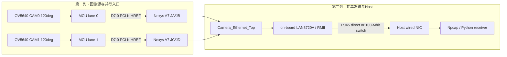
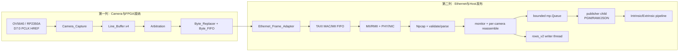
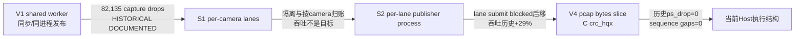

# PRG_CAM · 系统总览与端到端数据通路

> **PRG_CAM · PROJECT REVIEW & TRAINING SERIES**<br>
> 文档编号：01　版本：3.0　基线日期：2026-08-26<br>
> 适用对象：第一次接触项目、需要解释全链路或准备复刻的人<br>
> 范围：相机/MCU边界 → FPGA接收 → TAXI Ethernet → Python → 标定发布门<br>
> 当前状态：工程冷启动复刻 PASS；MCU取证复刻 PARTIAL；外参 release WITHHELD<br>
> 阅读约束：当前实现、历史证据、未来参考和报告缺口必须分开表述

## OBJECTIVE

建立从相机/MCU到标定发布门的唯一端到端视图，并为每个接缝指定“数据到这里仍正确”的可观测量。所有run遵循[工作协议](00_PRG_CAM-PROTOCOL-01_working_protocol.md)的身份、dry-run、幂等和证据不提升规则。

## 1. 系统要解决的问题

> **本章目标｜先理解为什么工程按“每行一个 packet”组织，再阅读模块名。**

两台相机产生的是二维图像，但 FPGA 和 Ethernet 处理的是随时间到达的字节流。项目必须同时解决四件事：第一，MCU送来的 PCLK/HREF/DATA 没有 `ready`，FPGA不能要求源端暂停；第二，两路相机可能同时送行，必须在共享 Ethernet 链上保持包内字节不交叉；第三，FPGA修改相机身份和诊断状态后，CRC必须反映修改后的最终内容；第四，PC必须把无状态的行包恢复成有相机、帧、行号和完整性状态的图像，之后才能送入OpenCV。

因此当前主链不是“收到一个像素就立刻发一个像素”，而是“接收完整128-byte行包 → commit → 包级仲裁 → 修改固定字段并重新计算CRC → 用ready/valid发送 → PC按行号重组”。完整行是跨越无反压输入和有反压输出之间的原子单位。`Camera_Pipeline.v:9-17`直接列出Capture、Line Buffer、Arbitration、Byte_Replacer和Byte_FIFO的顺序；`Camera_Ethernet_Top.sv:6-14`说明camera与fixed diagnostic只在编译时选择，因此不可能在包中途换源。

128 bytes来自当前线协议，而不是Ethernet的最大效率选择。每包中只有80 bytes承担640个1-bit像素，其余字节承载sync、序列/帧/行、flags、保留字段与CRC。行包经14-byte MAC header后成为142-byte pre-FCS Ethernet frame。这个设计让每条以太网帧都能独立诊断一行；代价是包率高、header占比大，但它与当前MCU、FPGA和Python格式已经共同冻结，不能为“优化”单独改变其中一层。

### 1.1 一条真实行数据的生命周期

1. MCU在HREF有效期间用PCLK推出128个字节；FPGA没有返回给MCU的反压线。
2. `Camera_Capture`在100 MHz域资格化PCLK/HREF，采样字节、统计长度，并在启用时用收到的126个内容字节核对入口CRC。
3. `Line_Buffer`在`line_start`预留slot，在`line_end`才commit；未完成行不可见于仲裁器。
4. `Arbitration`选择一路有committed packet的camera并锁到最终`valid && ready && last`。
5. `Byte_Replacer`把完整包写入双bank，再稳定地替换offset 4和13；offset 9原样保留；offset 126/127生成新CRC或`FF FF`。
6. `Byte_FIFO`把`{last,data}`一起缓存，保证backpressure后包尾仍与最后一个字节同拍。
7. `Ethernet_Frame_Adapter`先输出14-byte header，再透明传输128-byte payload；payload阶段才把ready反压给上游。
8. TAXI MAC/MII FIFO和MII→RMII bridge把frame送到LAN8720A；PC网卡/Npcap看到EtherType `0x88B5`。
9. Python执行Ethernet长度门、packet解析、monitor统计和per-camera reassembly；当前`SplitByCamera on + PublishImages process`配置再把每路完整帧经有界`mp.Queue`交给独立publisher子进程，恢复/位展开与PGM/RAW/JSON落盘不占用相机lane线程；`rows_v2.csv`仍由独立writer线程处理。完整机制见Topic 07的“Host Publisher Isolation”。
10. 标定模块只接收通过帧完整性门的图像；内参和外参再分别经过独立质量门。

### 1.2 设备职责表

| 节点 | 它负责什么 | 它不负责什么 | 首要证据 |
|---|---|---|---|
| OV5640/MCU | 生成阈值化行包和sender-owned字段 | FPGA cam_id/status、PC重组、OpenCV | 外部固件身份、逻辑分析仪；当前源码缺失 |
| FPGA D1 | 异步采样、完整行缓存、包级仲裁、字段/CRC处理 | 图像内容质量、内外参 | ILA、drop/length/CRC counter |
| FPGA D2 | 添加Ethernet header、MAC/FIFO、MII/RMII发送 | NIC/Npcap是否抓到 | frame handshake、TX_EN、PCAP |
| Python D3 | 过滤、解析、监控、重组、落盘 | 修改线上包、估计镜头模型 | FINAL REPORT、rows/summary、PGM/RAW |
| Calibration D4 | 圆心检测、K/D、R/t和独立验证 | 修复丢包、花屏、错误字节序 | JSON/CSV、quality.status、holdout |

## INPUTS / DEPENDENCIES

- 板级top：`prg_cam.srcs/sources_1/new/Camera_Ethernet_Top.sv:15-44`。
- 相机流水：`prg_cam.srcs/sources_1/new/Camera_Pipeline.v:123-318`。
- Ethernet adapter：`prg_cam.srcs/sources_1/new/Ethernet_Frame_Adapter.sv:31-106`。
- TAXI wrapper：`prg_cam.srcs/sources_1/new/Taxi_Ethernet_Subsystem.sv:70-84`。
- PC packet格式：`prg_cam.srcs/sources_1/tx/taxi_receiver_advanced/taxi_receiver/taxi_receiver/packet_format.py:26-80`。
- PC分层：`prg_cam.srcs/sources_1/tx/taxi_receiver_advanced/taxi_receiver/taxi_receiver/stages.py:34-57`。

## Physical topology与硬件边界



仓库能确认Nexys A7-50T器件`xc7a50ticsg324-1L`、板载LAN8720A、两条10-bit camera/MCU输入和120°+120°当前实验身份。它不能确认两只相机的模块/镜头SKU、MCU板修订、源端GPIO号、电源与线束BOM。因此“从MCU哪个pin接出”必须由外部MCU文档补齐，不能从FPGA XDC反推。

### Exact camera connector mapping

方向均为MCU/camera输出→FPGA输入；`Source pin`在本仓库中没有证据。

| Source | Signal | Source pin | Cable/connector | FPGA package pin | RTL name | Direction |
|---|---|---|---|---|---|---|
| CAM0 MCU | physical D0 | UNVERIFIED | JA1 | C17 | `GPIO[0]` | in |
| CAM0 MCU | physical D1 | UNVERIFIED | JA2 | D18 | `GPIO[1]` | in |
| CAM0 MCU | physical D2 | UNVERIFIED | JA3 | E18 | `GPIO[2]` | in |
| CAM0 MCU | physical D3 | UNVERIFIED | JA4 | G17 | `GPIO[3]` | in |
| CAM0 MCU | physical D4 | UNVERIFIED | JA7 | D17 | `GPIO[4]` | in |
| CAM0 MCU | physical D5 | UNVERIFIED | JA8 | E17 | `GPIO[5]` | in |
| CAM0 MCU | physical D6 | UNVERIFIED | JA9 | F18 | `GPIO[6]` | in |
| CAM0 MCU | physical D7 | UNVERIFIED | JA10 | G18 | `GPIO[7]` | in |
| CAM0 MCU | PCLK | UNVERIFIED | JB1 | D14 | `GPIO[8]` | in |
| CAM0 MCU | HREF | UNVERIFIED | JB7 | E16 | `GPIO[9]` | in |
| CAM1 MCU | physical D0 | UNVERIFIED | JC1 | K1 | `GPIO_CAM1[3]` | in |
| CAM1 MCU | physical D1 | UNVERIFIED | JC2 | F6 | `GPIO_CAM1[2]` | in |
| CAM1 MCU | physical D2 | UNVERIFIED | JC3 | J2 | `GPIO_CAM1[1]` | in |
| CAM1 MCU | physical D3 | UNVERIFIED | JC4 | G6 | `GPIO_CAM1[0]` | in |
| CAM1 MCU | physical D4 | UNVERIFIED | JC7 | E7 | `GPIO_CAM1[7]` | in |
| CAM1 MCU | physical D5 | UNVERIFIED | JC8 | J3 | `GPIO_CAM1[6]` | in |
| CAM1 MCU | physical D6 | UNVERIFIED | JC9 | J4 | `GPIO_CAM1[5]` | in |
| CAM1 MCU | physical D7 | UNVERIFIED | JC10 | E6 | `GPIO_CAM1[4]` | in |
| CAM1 MCU | PCLK | UNVERIFIED | JD1 | H4 | `GPIO_CAM1[8]` | in |
| CAM1 MCU | HREF | UNVERIFIED | JD7 | H2 | `GPIO_CAM1[9]` | in |
| Human control | capture enable | SW15 | on-board switch | V10 | `CAMERA_CAPTURE_ENABLE` | in, high=enable |

CAM1不是相邻位交换，而是每个4-bit connector组完整反序；XDC注释说明attempt2验证了该映射（`nexys_a7_ethernet.xdc:23-45`）。同步头看起来正确不足以证明data mapping正确。

### FPGA-to-PHY mapping

| Signal | Package pin | RTL direction | Note |
|---|---|---|---|
| `ETH_RSTN` | B3 | out | active-low PHY reset；top在MMCM lock后约10.5 ms释放 |
| `ETH_TXEN`, `ETH_TXD[0]`, `ETH_TXD[1]` | B9, A10, A8 | out | RMII transmit |
| `ETH_REFCLK` | D5 | out | 50 MHz forwarded clock |
| `ETH_CRSDV`, `ETH_RXERR`, `ETH_RXD[0:1]` | D9, C10, C11/D10 | in | RX path present but current system is TX-focused |
| `ETH_MDC`, `ETH_MDIO` | C9, A9 | out/inout | top drives MDC=0 and MDIO=Z; no MDIO management transaction |
| `ETH_INTN` | B8 | in | currently only consumed as unused input |

LAN8720A在XDC中被描述为REF_CLK input strap；TX output delay是4.0 ns setup与1.5 ns hold（`nexys_a7_ethernet.xdc:65-81`）。物理连接可为FPGA与PC有线NIC直连，或经100-Mbit switch；先确认link LED，再查`0x88B5`。IP地址不属于该L2 EtherType广播的解析契约。

## MCU Boundary and External Documentation

MCU implementation is documented separately. Phase-2 documentation begins at the MCU → FPGA interface contract。本仓库明确说明RP2350A PIO/DMA/packet generator源码不在仓库（`docs/20_project_architecture_and_debug_training.md:164,659`；`prg_cam.srcs/sources_1/tx/taxi_receiver_advanced/p3_rp2350_field_source_report.md:10-20`）。当前可核验的相关报告为：

- `docs/rp2354_fpga_side_architecture_report.md`：FPGA侧架构历史/参考，不是固件刷写手册。
- `prg_cam.srcs/sources_1/tx/taxi_receiver_advanced/p3_rp2350_field_source_report.md`：当前128-byte字段来源审计。
- `docs/20_project_architecture_and_debug_training.md`：端到端域边界与故障定位培训。

预期名称`MCU_ARCHITECTURE_DATAFLOW.md`与`MCU_PROJECT_REPRODUCTION_GUIDE.md`仍不在当前树中，故firmware project path、commit、binary SHA256、build/flash命令与源端GPIO继续标`EXTERNAL DOCUMENTATION DEPENDENCY`。它限制MCU的forensic复刻，但不再作为Phase-2 engineering reproduction blocker。

| MCU output | Required contract | Repository status |
|---|---|---|
| packet length | exactly 128 bytes per HREF row | FPGA/Python side confirmed |
| sync/header/trailer | match `packet_format.py` fixed fields | FPGA/Python side confirmed |
| camera_id | lane identity is overwritten into offset 4 by FPGA | source placeholder value UNVERIFIED |
| row index | offsets 7–8, big-endian | confirmed at receiver boundary |
| sender flags | offset 9; FPGA must preserve source semantics | confirmed at receiver boundary |
| CRC mode | current top enables ingress and egress CRC | source implementation/SHA missing |
| PCLK/HREF/D[7:0] | source pins, voltage and measured PCLK | missing; do not invent |
| packet rate | must be measured and recorded per firmware/camera mode | NOT MEASURED at source boundary |

MCU SHA、source pin和电压/地参考缺失时，run manifest必须保留null/NOT VERIFIED，不能宣称MCU实现可forensic复刻。仓库也没有冻结“FPGA先上电还是MCU先上电”的严格顺序；文档不得用一次工作经验冒充必须顺序。

## Hardware Bring-up Appendix

本附录只冻结当前树能证明的硬件事实。`docs/schematic*.pdf`是设计/逻辑原理图资料，不足以证明相机线束、MCU PCB、供电或镜头型号；当前树未发现硬件照片、camera/MCU BOM或板级线束原理图。

### A. Core Hardware

| Component | Current hardware | Evidence | Status |
|---|---|---|---|
| FPGA board | Nexys A7-50T，device `xc7a50ticsg324-1L` | `prg_cam.xpr:2`；`prg_cam.srcs/constrs_1/new/nexys_a7_ethernet.xdc` | VERIFIED CURRENT IMPLEMENTATION |
| MCU board | upstream RP2350A/RP2354 camera packet source；具体board revision不在本树 | `p3_rp2350_field_source_report.md:1-20`；`docs/rp2354_fpga_side_architecture_report.md` | EXTERNAL DOCUMENTATION DEPENDENCY |
| Camera module | 两路文档身份为OV5640 camera source；module SKU/PCB revision未记录 | 本文physical topology；`docs/20_project_architecture_and_debug_training.md:161-202` | FUNCTIONAL ROLE VERIFIED；PART ID NOT FULLY DOCUMENTED |
| Lens | 当前归档实验标签为120°+120°；具体镜头SKU、实测FOV和安装批次缺失 | `build/protocol/04_phase2_entry_manifest.json:3-4`及当前K/D命名 | EXPERIMENT IDENTITY VERIFIED；OPTICAL ID HISTORICAL/INCOMPLETE |
| Ethernet PHY | Nexys A7板载LAN8720A，RMII，REF_CLK-input strap | XDC `:52-85`；top `:384-466` | VERIFIED CURRENT IMPLEMENTATION |
| Host NIC | 能被Npcap枚举的有线Ethernet接口；型号没有写入run manifest | receiver `--list`与保留receiver evidence | RUN-FUNCTION VERIFIED；MODEL NOT FULLY DOCUMENTED |

### B. Camera/MCU → FPGA physical interface

| Source | Signal | Connector/pin | FPGA destination | RTL signal | Direction |
|---|---|---|---|---|---|
| CAM0 MCU | D0 | JA1 | C17 | `GPIO[0]` | MCU→FPGA |
| CAM0 MCU | D1 | JA2 | D18 | `GPIO[1]` | MCU→FPGA |
| CAM0 MCU | D2 | JA3 | E18 | `GPIO[2]` | MCU→FPGA |
| CAM0 MCU | D3 | JA4 | G17 | `GPIO[3]` | MCU→FPGA |
| CAM0 MCU | D4 | JA7 | D17 | `GPIO[4]` | MCU→FPGA |
| CAM0 MCU | D5 | JA8 | E17 | `GPIO[5]` | MCU→FPGA |
| CAM0 MCU | D6 | JA9 | F18 | `GPIO[6]` | MCU→FPGA |
| CAM0 MCU | D7 | JA10 | G18 | `GPIO[7]` | MCU→FPGA |
| CAM0 MCU | PCLK / HREF | JB1 / JB7 | D14 / E16 | `GPIO[8]` / `GPIO[9]` | MCU→FPGA |
| CAM1 MCU | D0 / D1 / D2 / D3 | JC1 / JC2 / JC3 / JC4 | K1 / F6 / J2 / G6 | `GPIO_CAM1[3:0]`按XDC反序映射 | MCU→FPGA |
| CAM1 MCU | D4 / D5 / D6 / D7 | JC7 / JC8 / JC9 / JC10 | E7 / J3 / J4 / E6 | `GPIO_CAM1[7:4]`按XDC反序映射 | MCU→FPGA |
| CAM1 MCU | PCLK / HREF | JD1 / JD7 | H4 / H2 | `GPIO_CAM1[8]` / `GPIO_CAM1[9]` | MCU→FPGA |
| CAM0/CAM1 MCU | VSYNC | NOT PRESENT IN ACTIVE TOP CONTRACT | none | none | NOT USED / NOT VERIFIED |
| CAM0/CAM1 harness | GND / power reference | source/harness pin NOT DOCUMENTED | no FPGA logic port | electrical reference only | NOT FULLY DOCUMENTED |

MCU侧source GPIO必须从外部固件/board文档交叉引用；不能由上述FPGA destination pin反推。两路逻辑IOSTANDARD均为LVCMOS33，这是FPGA端口约束，不自动证明MCU或相机电源rail。

### C. FPGA → PHY

| Signal | FPGA/package pin | Active use | Direction/status |
|---|---|---|---|
| RMII `REF_CLK` | `ETH_REFCLK` / D5 | ODDR转发50 MHz | FPGA→PHY，active |
| `TXD[1:0]` | A8 / A10 | frame payload dibits | FPGA→PHY，active |
| `TX_EN` | B9 | frame-valid | FPGA→PHY，active |
| `RXD[1:0]` | D10 / C11 | RX interface wired | PHY→FPGA，present；系统TX-focused |
| `CRS_DV` / `RXERR` | D9 / C10 | RX control | PHY→FPGA，present |
| `MDC` / `MDIO` | C9 / A9 | top固定MDC=0、MDIO=Z | management NOT IMPLEMENTED |
| `RSTN` | B3 | `phy_ready`释放active-low reset | FPGA→PHY，active |
| `INTN` | B8 | 未参与当前控制 | PHY→FPGA，unused input |

### D. Power

| Item | Repository-backed fact | Status |
|---|---|---|
| FPGA camera/RMII logic level | XDC将相关端口约束为`LVCMOS33` | VERIFIED at FPGA IO constraint only |
| Shared signal reference | 两路单端PCLK/HREF/D总线在物理上需要共同参考地才能解释逻辑电平 | REQUIRED INTERFACE CONDITION；harness pin NOT DOCUMENTED |
| Nexys A7 board power | 板卡必须供电且Digilent target可枚举；保留program log证明曾工作 | HISTORICAL EVIDENCE；USB/外部电源选择未冻结 |
| MCU/camera rails | 电压、连接器pin和USB/外部供电方式不在当前树 | NOT FULLY DOCUMENTED |
| PHY rail | 板载实现由Nexys A7提供；本项目没有独立rail操作步骤 | BOARD-OWNED；no separate project control |

### E. Power-up order

Observed working sequence：保留日志证明FPGA曾被`program_ethernet_ila.tcl`配置并达到`End of startup status: HIGH`，随后取得双路CRC接收证据；`cam1_after_sw15_snapshot_20260823.log`还证明SW15参与后续观察。日志没有记录MCU、相机和FPGA各rail的完整上电时间线。

Strict required sequence: **NOT VERIFIED**。工程quick-start可按“确认接线/共地 → 板卡与MCU/相机供电 → 必要时编程retained FPGA → 等PHY reset释放/link → SW15 high → Host capture”执行观察，但不得称其为电气上唯一允许的顺序。若上电后没有数据，按Topic 09 first-failure matrix从PCLK/HREF第一零点定位。

## RUN IDENTITY / PRECHECK / DRY-RUN

执行任何端到端测试前，先读取`run_manifest.json`中的Git、bit/LTX、camera IDs、interface GUID和capture root。dry-run只打印这些值，并验证`run_receiver.ps1`存在；不启动接收、不烧录FPGA。

**[READ ONLY] [RUN NOW]**

```powershell
$repo = 'D:\prg\prg_cam'
$receiverRoot = Join-Path $repo `
  'prg_cam.srcs\sources_1\tx\taxi_receiver_advanced\taxi_receiver'
$runReceiver = Join-Path $receiverRoot 'run_receiver.ps1'
$python = 'C:\Users\Z\AppData\Local\Python\pythoncore-3.14-64\python.exe'

foreach ($path in @($runReceiver, $python)) {
  if (!(Test-Path -LiteralPath $path -PathType Leaf)) {
    throw "缺少入口：$path"
  }
}
& $python -m taxi_receiver.cli --list
```

从输出复制真实Npcap接口名称到`$interface`；不得保留`<实际接口名称>`占位符。

## MAIN：端到端通路



### 接缝不变量

| Boundary | Input → output | Invariant | Observable |
|---|---|---|---|
| Camera→D1 | D[7:0], PCLK, HREF | 一行应形成固定128-byte packet；异步输入只经资格化，不等于物理时序已验证 | PCLK/HREF、byte count、line_end、length/CRC pulse |
| Capture→buffer | byte/valid/start/end/metadata | 已接收的行不得静默改变长度或丢失cam_id/status | used/committed/drop count |
| Buffer→arbiter | request/grant | owner锁定到TLAST握手后才释放 | grant、selected valid/ready/last |
| Replacer→FIFO | 128-byte packet | offset 4、9、13、126/127语义固定 | output index、replaced byte、TLAST |
| FIFO→adapter | ready/valid/last | stall时data/last必须保持；真实握手才推进 | FIFO level/almost_full、frame handshake |
| Adapter→MAC | 14-byte header+128 payload | destination/source/EtherType后跟完整payload | 142-byte pre-FCS frame |
| MAC→PHY | MII→RMII | TX underflow/overflow为0，RMII TX_EN随帧活动 | MII/RMII ILA probes |
| NIC→D3 | Ethernet frame | EtherType必须`0x88B5`，payload必须128 bytes | capture ingress、matching Ethernet |
| Parse→monitor | packet record | `parsed_ok`与诊断`ok`分层，禁止混成单一布尔值 | protocol/diagnostic errors |
| Reassemble→publisher process | `CompletedFrame` → `_PublishedFrameEnvelope` | `rows_blob`之外必须保留`present_rows/missing_rows`；队列满可反压，不能假定写盘被无限隔离 | publisher submitted/published/failures/stats ok/blocked |
| Reassemble→D4 | complete PGM+metadata | incomplete/CRC/sync/length异常不能成为标定视图 | rows_v2、frame metadata、preflight reason |
| Stereo→release | R/t candidate | 低RMS之外还须通过dispersion/depth independence/holdout | quality.status、publishable、failures |

### Packet与frame布局

| Offset | Owner | Meaning | Non-regression rule |
|---:|---|---|---|
| 4 | FPGA | `cam_id` | D3路由前从payload offset 4读取 |
| 7–8 | sender | row index | big-endian，范围受ExpectedRows检查 |
| 9 | sender | sender flags | Byte_Replacer不得挪作FPGA状态 |
| 13 | FPGA | FPGA status | `0x10`为入站CRC诊断位 |
| 24–103 | sender | 80-byte 1-bit row pixels | 默认`msb_first`展开为640 pixels |
| 126–127 | FPGA egress | CRC-16或`FF FF`placeholder | 必须与PC `crc_mode`一致 |

Camera payload固定128 bytes；adapter添加14-byte Ethernet header，MAC FCS前为142 bytes。D3只接收EtherType`0x88B5`（`taxi_receiver/eth_validate.py:18-47`）。

下面的当前RTL摘录是字段所有权的最终锚点，而不是本文重新定义协议：

```verilog
// Byte_Replacer.v:124-137
wire [7:0] patched_output_data =
    (output_index == CAM_ID_OFFSET) ? {6'd0, output_cam_id} :
    (output_index == FPGA_STATUS_OFFSET) ? output_status :
    buffered_output_data;

assign out_data = !output_active ? 8'd0 :
    (output_index == CRC_HIGH_OFFSET) ?
        ((CRC_ENABLE != 0) ? output_crc[15:8] : 8'hFF) :
    (output_index == CRC_LOW_OFFSET) ?
        ((CRC_ENABLE != 0) ? output_crc[7:0] : 8'hFF) :
    patched_output_data;
```

这段代码没有offset 9分支，所以sender flags按原字节流通过；offset 4和13在输出bank的稳定索引上修改；CRC tail直到输出126/127才替换。若未来改变任一offset，必须同步更新`packet_format.py`、golden vector、RTL仿真和PCAP验收，不能只改注释或JSON。

## VALIDATE：统一First-Failure Matrix

| Order | Probe | Expected | First failure points to | Next evidence |
|---:|---|---|---|---|
| 1 | MCU row/packet activity | >0 | camera/MCU/pin/electrical | logic analyzer、PCLK/HREF/data |
| 2 | FPGA capture byte/line count | >0且行长128 | synchronizer/qualifier/capture | ILA probes 0–25 |
| 3 | buffer/FIFO packet output | valid+TLAST，drop=0 | buffer/grant/backpressure | grant、level、almost_full |
| 4 | adapter/TAXI | frame_handshake>0，under/overflow=0 | adapter/MAC | probes 55–61 |
| 5 | RMII | TX_EN/TXD活动 | bridge/PHY | probes 62–63、link state |
| 6 | PCAP ingress | >0，kernel drops=0 | NIC/interface/Npcap | live pcap stats |
| 7 | Matching Ethernet | >0 | EtherType/MAC/长度门 | Wireshark payload bytes |
| 8 | parsed_ok | >0 | packet layout/CRC/sync | parser errors、offset 4/13/tail |
| 9 | complete frame | >0 | sequence/row/reassembly/publisher | rows_v2、summary_v2 |
| 10 | valid grid | >0 | 图像内容/板覆盖/detector | preflight CSV reason |
| 11 | stereo pair | >0 | timestamp/stillness/双路共同视野 | pairing_summary failures |

只从第一个异常行继续排查。例如两路逻辑分析仪均有波形，但cam1 `capture_byte_valid=0`，问题仍在D1 qualifier之前；反之PC `Matching Ethernet>0`且`Unroutable cam_id`增长，应检查offset 4和`-CameraIds`，不是引脚。

## OBSERVED vs EXPECTED

| Probe | Expected | Current observed | Interpretation |
|---|---|---|---|
| Dual-camera CRC audit | 两路pass | cam0/cam1各155136 rows、324 frame IDs、错误0 | D1→D3完整性证据PASS |
| Packet identity | cam0/cam1分路 | 当前配对run生成双路23 pairs | 相机分路与时间元数据可用 |
| Pair dt | 小于pairing门 | 23条accepted pair的median 1.270056 ms | retained run配对PASS |
| Intrinsic outputs | 两机独立pass | 两机holdout均pass | D4单目链PASS |
| External rigid condition | R/t与board depth无关 | tx/ty系统漂移 | D4物理发布门FAIL |

## EXPORT

端到端run至少归档：`run_manifest.json`、receiver stdout/stderr、FINAL REPORT、PCAP或其缺失原因、两路`rows_v2.csv`、PGM/RAW/JSON计数、ILA CSV（若运行）、所有输入/输出hash。当前bit/LTX只有编程路径证据而缺编程时source绑定，必须标`HISTORICAL EVIDENCE ONLY`。

## Host接收机四代演进在全系统中的位置

这段历史只改变Host如何调度已有packet，没有改变Ethernet 142-byte frame、128-byte camera payload、CRC覆盖范围或480行成帧语义。



端到端解释必须拆成三个因果步骤：S1消除跨相机直接队头阻塞；S2把恢复、位展开、PGM/RAW/JSON写盘移出lane线程和父进程GIL；V4再降低capture与CRC的单包成本。把最终恢复全部归因于“开了multiprocessing”会漏掉S1的隔离作用和V4的入口预算作用。

历史遗留CSV由`scripts_matlab/analyze_host_packet_loss.m`重新分析。`thread_before`两路合计记录252,889行、从`row_seq`推断缺少250,531个序列位置，约49,765.80/100k；`process_after`记录513,024行、推断缺少312,461，约37,851.81/100k。归一化缺口率下降约23.94%，但两组运行长度和输入窗口不同，因此这是`CSV REANALYSIS`，不是严格同输入A/B发布结论。

## FAILURE HANDLING / PASS-FAIL / NEXT ACTION

- D1–D3任何完整性门失败：禁止进入标定层解释。
- D4 preflight失败：不能反推接收机坏，先核对complete frame和图像内容。
- 外参`unacceptable`：保留`.rejected.json`并停止；`--allow-limited`不能覆盖。
- 当前下一动作是技术归档，不是新采集或外参promotion。

## 从零复刻的十个检查点

> **审计结论｜本页只规定跨域顺序；每一步的完整命令、参数和失败恢复分别下沉到Topic 04、07、08、09。前一步没有机器可读PASS时，不启动下一步。**

| 顺序 | 操作目标 | 用户入口 | 预期证据 | FAIL后停在哪 |
|---:|---|---|---|---|
| 1 | 建立run identity | Topic 00 manifest模板 | HEAD/dirty、硬件/镜头/路径身份 | 环境/身份 |
| 2 | 只读工程检查 | `scripts/check_project.tcl` | top/part/generic/source门 | Vivado工程 |
| 3 | 选择plain或ILA并构建 | Topic 04相应flow | DCP、reports、bit；ILA另有LTX | synth/impl/report |
| 4 | 解释timing/CDC/DRC | Topic 06 | 被约束域PASS或明确限制 | RTL/XDC/routing |
| 5 | 可选program/capture ILA | `program_ethernet_ila.tcl`、`capture_ethernet_ila.tcl` | startup、matched bit/LTX、CSV | FPGA/接缝 |
| 6 | Host离线golden gate | Topic 07 pytest/replay | parser/reassembler/publisher测试 | Python环境/语义 |
| 7 | NIC与live smoke | `run_receiver.ps1` | ingress→matching→parsed逐级非零 | PHY/NIC/Npcap/D3 |
| 8 | 双路图像合同 | Topic 07三窗口和采后审计 | 两路rows、PGM/RAW/JSON、drop/stat | 路由/重组/发布 |
| 9 | 两路内参冻结 | Topic 08 training+holdout | acceptable K/D、holdout pass、SHA | 图像/模型/覆盖 |
| 10 | 外参诊断与发布门 | Topic 08 pairs→solve→holdout | acceptable+publishable或withheld | 配对/KD/刚体一致性 |

“复刻成功”必须注明停在哪一级。例如只完成1–4可写“FPGA build reproduction PASS”，不能写“camera system PASS”；完成7但未完成8只能写“packet ingestion PASS”，不能写“image publication PASS”。

## 一条128-byte行包的端到端事务时序

```mermaid
flowchart LR
  subgraph TX1[第一列 · 无反压源到有所有权packet]
    direction TB
    T0[MCU HREF rise] --> T1[128次PCLK/data]
    T1 --> T2[Capture finalize length/ingress CRC]
    T2 --> T3[Line Buffer commit]
    T3 --> T4[Arbiter锁定camera owner]
    T4 --> T5[Replacer输出最终128-byte]
  end
  subgraph TX2[第二列 · frame到离线几何]
    direction TB
    T6[Adapter先发14-byte header] --> T7[TAXI/MII/RMII发送]
    T7 --> T8[Npcap收到142-byte pre-FCS frame]
    T8 --> T9[parse/monitor/reassemble]
    T9 --> T10[publisher写完整图与sidecar]
    T10 --> T11[OpenCV离线读取]
  end
  T5 --> T6
```



关键所有权变化为：MCU拥有原始offset9和行元数据；FPGA在整包状态已知后拥有offset4/13/126/127；Adapter拥有frame offset0–13；TAXI/MAC拥有preamble/FCS/IFG；Python不改变线上packet，只生成审计与图像；标定只消费完整文件。任何字段变更必须在其拥有层实现并同步更新相邻合同测试。

## 当前实现、历史证据与外部依赖

| 类别 | 本文可直接确认 | 不能自动确认 |
|---|---|---|
| CURRENT IMPLEMENTATION | RTL/Python/标定当前源码、XDC、CLI字段和机器可读报告 | 当前板上一定加载了由当前dirty HEAD生成的bit |
| RUN VERIFIED | `dual_crc_20260823_verified01`、当前两机内参及当前外参rejected证据 | 其他attempt或换镜头后的结果 |
| HISTORICAL DOCUMENTED | Host V1/S1/S2/V4演进数字、旧GUI build | 严格同输入A/B和当前机器性能 |
| EXTERNAL DEPENDENCY | MCU→FPGA接口格式与FPGA端pin | MCU source pin、firmware SHA、电源/线束BOM |
| REPORT LIMITATION | Camera PCLK未建完整外部时序、Host长时内存缺失 | 可以靠正WNS或短run自动补齐 |

## 文档级验收摘要

- 新读者能先理解“每行一个128-byte原子packet”的设计动机，再进入模块细节。
- 物理连接、RTL所有权、Ethernet frame、Host多进程发布和OpenCV离线标定形成一条不跳层的数据链。
- 十个复刻检查点均给出入口、证据和停止层；Topic 09提供现场first-failure分流。
- 当前120°+120°身份、两机内参PASS与外参WITHHELD被明确分开，不宣称物理R/t已发布。
- MCU固件、Camera PCLK外部时序和当前bit/dirty HEAD的forensic绑定继续如实标记限制。
