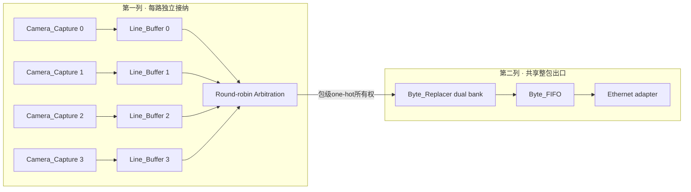
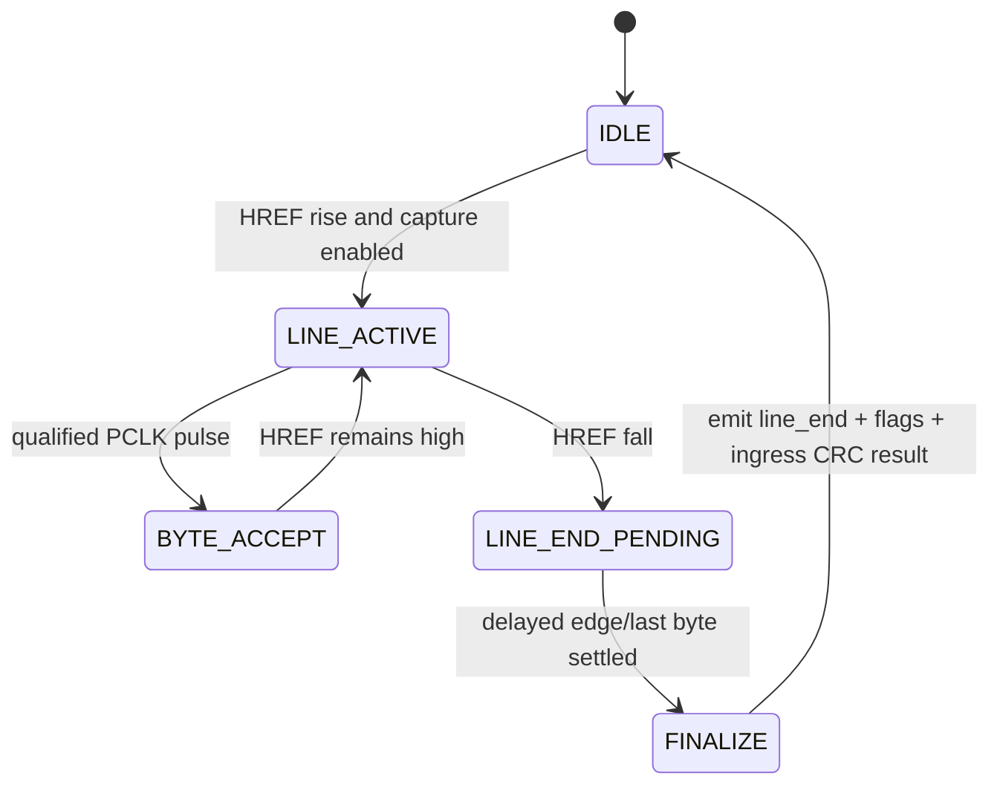
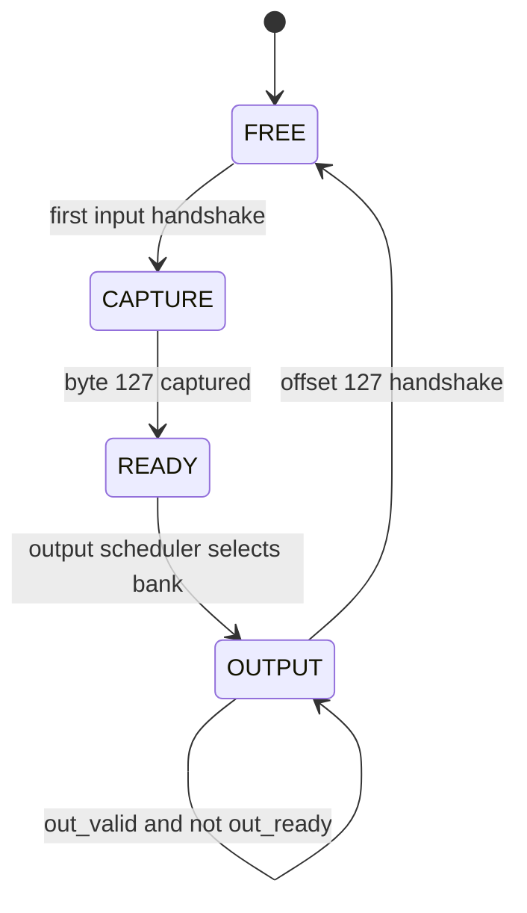
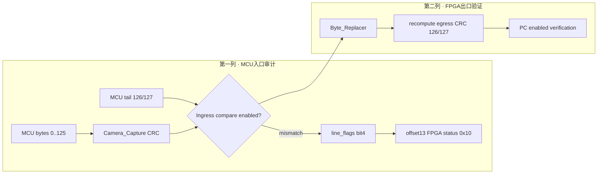
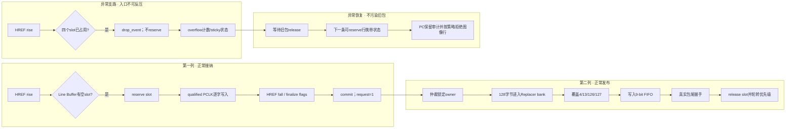

# PRG_CAM · FPGA接收机RTL架构与演进

> **PRG_CAM · PROJECT REVIEW & TRAINING SERIES**<br>
> 文档编号：02　版本：3.0　基线日期：2026-08-26<br>
> 适用对象：需要读懂Camera输入、缓存、仲裁、CRC、backpressure和ILA的人<br>
> 范围：`Camera_Ethernet_Top`的Camera入口至`Ethernet_Frame_Adapter`输入<br>
> 当前状态：双路接收和CRC归档证据PASS；PCLK板级时序仍属报告限制<br>
> 不变量：完整包不得交叉、offset 9不得改写、offset 13独立、TLAST只随真实握手推进

## OBJECTIVE

说明双路相机如何形成固定packet、如何在backpressure下保持包边界，以及CAM0/CAM1拒接、长度错误和CRC错误应在哪一级定位。

## INPUTS / DEPENDENCIES / RUN IDENTITY

- Top与generic：`prg_cam.srcs/sources_1/new/Camera_Ethernet_Top.sv:15-23,245-300`。
- Capture：`prg_cam.srcs/sources_1/new/Camera_Capture.v:16-46,59-74,148-160,290-322`。
- Pipeline：`prg_cam.srcs/sources_1/new/Camera_Pipeline.v:123-318`。
- Buffer/arbiter：`prg_cam.srcs/sources_1/new/Line_Buffer.v:29-59,128-240`、`prg_cam.srcs/sources_1/new/Arbitration.v:24-84`。
- Replacer/FIFO：`prg_cam.srcs/sources_1/new/Byte_Replacer.v:5-14,124-137`、`prg_cam.srcs/sources_1/new/Byte_FIFO.v:14-69`。

任何ILA结论都必须记录bit/LTX hash与Git/dirty。当前bit/LTX只有“路径已编程”的历史证据，不能自动绑定到当前HEAD。

## PRECHECK / DRY-RUN

先验证工程top、两路enable和CRC generic；该命令只读工程，不综合、不烧录：

**[CURRENT VERIFIED] [READ-ONLY]** 只打开工程并检查source/property；不会综合、实现、生成bit或连接硬件。

```powershell
$repo = 'D:\prg\prg_cam'
$vivado = 'D:\Xilinx_Vivado\2025.2.1\Vivado\bin\vivado.bat'
Set-Location $repo

& $vivado -mode batch -nolog -nojournal `
  -source .\scripts\check_project.tcl
$checkExit = $LASTEXITCODE
if ($checkExit -ne 0) {
  throw "Project precheck失败：$checkExit"
}
```

预期控制台包含`PROJECT_SOURCE_CHECK_PASS`；脚本明确要求`Camera_Ethernet_Top`、`USE_CAMERA_PIPELINE=1`、`ENABLE_CAM1=1`及两段CRC enable（`scripts/check_project.tcl:5-35`）。

## MAIN：模块与状态



图中第一列的四路并行只表示结构可扩展性；当前板级有效身份是cam0/cam1。第二列从仲裁后开始共享，因此共享出口阻塞会同时向两路传播，而单路`pclk_pulse`为零通常不会由共享出口单独造成。

## 1. 顶层身份、编译期选择与共享控制

> **本章目标｜先分清“代码里有四路”“板上接了两路”和“当前bit启用了哪两路”。**

`Camera_Pipeline`保留四路结构，但当前板级top只把`GPIO`和`GPIO_CAM1`连接到cam0/cam1，cam2/3被固定为0（`Camera_Ethernet_Top.sv:196-207,242-263`）。当前 ILA build 在综合边界明确传入`ENABLE_CAM1=1`、入口/出口CRC均为1和480行（`scripts/build_ethernet_ila.tcl:43-46`）。这比只读取RTL parameter默认值更可靠，因为最终bit采用的是综合时的effective generics。

顶层另保留fixed diagnostic source。`USE_CAMERA_PIPELINE`是编译期常量：1选择真实Camera Pipeline，0选择固定`00..7F`源；它不能运行时切换，因此不会在包中途换源（`Camera_Ethernet_Top.sv:4-14,320-342`）。fixed路径的目的，是在Camera入口未知时单独证明Ethernet后半链，而不是生产图像路径。

复位与采集使能不是同一件事。`phy_ready`在MMCM locked后约10.5 ms置位，再通过多个寄存分支释放camera/frame/bridge/Taxi reset（`Camera_Ethernet_Top.sv:67-108`）；SW15经过2FF成为`camera_enable_sync`，并由Capture在干净HREF边界执行，不清空已经进入下游的包（`Camera_Ethernet_Top.sv:110-120`）。所以“SW15低”能解释两路同时停止新采集，却不能解释只拒绝cam0或只拒绝cam1。

## 2. Camera_Capture：无反压输入变成行事件

> **本章目标｜明确第一个可能漏字节、重复字节或误判CRC的位置。**

输入是每路`D[7:0] + PCLK + HREF`，没有VSYNC和ready；输出是sys_clk域的`byte_data/byte_valid/line_start/line_end/cam_id/fpga_status`。PCLK不是Vivado中的独立时钟树，而是被同步、资格化后转成一个sys_clk脉冲。这样后续四路流在同一100 MHz域仲裁，但它仍然不能替代对源端setup/hold的物理测量。

当前实现不是简单对`pclk_sync`取边沿。`Camera_Capture.v:78-101`保留PCLK/HREF/DATA同步寄存器；后续逻辑用high/low持续计数和phase armed机制，避免同步后的高电平重复计数。判断一个字节是否真的被接收的唯一事件是`pclk_pulse && href_sync`，而不是raw PCLK翻转本身。现场如果raw PCLK有波形但`byte_valid=0`，必须同时观察`pclk_sync`、high/low count、phase armed、capture armed和HREF资格化。

行结束时模块根据最终计数产生0x08 length状态，并在入口CRC启用且行长可比较时产生0x10。短行/长行状态向后传递，不能通过提前丢弃元数据来“让错误消失”。入口CRC使用MCU原始offset 0..125和原始126/127，发生在FPGA修改cam_id/status之前（`Camera_Capture.v:148-160,290-322`）。

### 2.1 Capture ASM



ASM图中的`FINALIZE`必须理解为“行边界和最后字节已经确定后形成诊断状态”，不是生成图像帧。当前协议没有VSYNC；frame归属在PC端通过packet元数据和行号处理。`LAST_ROW`只能说明sender声明到了帧尾，不能替代480个不同row的完整性检查。

### 2.2 典型异常判定

| 观察组合 | 直观含义 | 首查位置 |
|---|---|---|
| raw PCLK/HREF均为0 | FPGA引脚没有看到源端活动 | 上电、enable、线束、XDC pin |
| raw有，sync无 | 同步/采样或电气电平异常 | synchronizer输入、IOSTANDARD、示波器 |
| sync有，`pclk_pulse`无 | 资格化条件未完成或PCLK相对100 MHz过快/畸变 | high/low count、phase armed |
| `byte_valid`有，last count≠128 | 漏采/重复采样或源端HREF长度不对 | PCLK相位、HREF边界、源包长度 |
| count=128但0x10持续 | MCU tail与FPGA入口CRC计算不同 | MCU CRC模式、端序、poly/init、固件SHA |
| cam0正常、cam1在Capture为0 | cam1 pin映射、cam1 qualifier或`ENABLE_CAM1` | probe 0–25、XDC反序映射 |

## 3. Line_Buffer：reserve、commit、release而不是简单FIFO

> **本章目标｜解释为什么正在接收的半包不会被发出，以及容量满时到底丢什么。**

每路默认拥有4个128-byte slot，内存线性地址是`{slot, byte_offset}`（`Line_Buffer.v:29-79`）。`line_start`到来且有空slot时发生reserve；字节进入当前slot；`line_end`才commit；仲裁器只看到`committed_count>0`的request；最后一个输出字节真实握手后release。`used_count`包含正在接收和已经commit的slot，`committed_count`只包含可发送slot，因此正常情况下两者差值为0或1。

这一结构解决的是“源端不能backpressure、下游可能stall”的冲突。正在接收的行与正在发送的行可以落在不同slot；若四个slot全占用，新行从开始就被标记为drop，并把overflow sticky信息带到后续可发送包，而不是覆盖旧包或把半包提交。短行在输出固定128-byte时补零、长行最多保留128 byte并携带0x08；这样下游packet大小仍稳定，错误不会演变为frame边界漂移。

```verilog
// Line_Buffer.v:122-129（事件语义）
// reserve: 新包成功占用 slot，used +1。
// drop   : 新包未占用 slot，仅更新错误统计和 sticky overflow。
// commit : 当前 reserved 包结束，committed +1。
// release: 最后一个 byte 被下游真正接收，used/committed 同时 -1。
wire reserve_event = line_start && !rx_reserved && (used_count < SLOT_COUNT);
wire drop_event    = line_start && !rx_reserved && (used_count >= SLOT_COUNT);
```

因此排查时不能只看`used_count`。`used>0, committed=0`可能只是当前行尚未结束；`committed>0, request=0`才是接口错误；drop增长但FIFO并不满，可能是持续backpressure让四个slot尚未release。

## 4. Arbitration：包级one-hot所有权

> **本章目标｜证明四路字节不会在同一个128-byte包里交叉。**

`request[i]`是level而不是pulse；`grant_onehot`本身就是锁状态，无额外`locked`标志。空闲时从`rr_ptr`开始按四种明确顺序选request；一旦grant非零，无论其他request怎样变化都保持owner；只有选中流的最后字节完成`valid && ready && last`才释放（`Arbitration.v:24-85`）。释放后优先级移到刚完成通道的下一路，并保留一个空仲裁拍让旧LB撤销valid、新LB预取首字节。

```verilog
// Camera_Pipeline.v:240-243
wire released = selected_valid && replacer_in_ready && selected_last;

// Camera_Pipeline.v:303-307
assign lb0_ready = replacer_in_ready && arb_grant[0];
assign lb1_ready = replacer_in_ready && arb_grant[1];
assign lb2_ready = replacer_in_ready && arb_grant[2];
assign lb3_ready = replacer_in_ready && arb_grant[3];
```

若`last=1`但`ready=0`，owner不能释放；否则下一路会覆盖最后字节或造成包尾错位。ILA的硬断言应是：grant始终为0000或one-hot；stall期间selected data/last稳定；grant改变前一拍必须有末字节握手；长期request有而grant始终轮不到才可怀疑starvation。

## 5. Byte_Replacer：双bank整包变换

> **本章目标｜解释为什么它不是“看到offset就组合替换”的直通模块，以及双缓冲的吞吐边界。**

当前`Byte_Replacer`有两个128-byte bank，每个bank有`FREE → CAPTURE → READY → OUTPUT → FREE`状态（`Byte_Replacer.v:42-50,69-99,139-225`）。输入包的cam_id和FPGA status在包开始锁存，整包捕获完成后bank才READY；输出从另一bank逐字节进行字段替换和CRC计算。这是为了让offset 13在行结束后已经包含最终length/ingress-CRC结果，也让输出在任意backpressure下保持稳定。



两个bank允许“一个输出、另一个接收”。当两bank都非FREE，`in_ready`下降；但一旦开始接包，`in_ready`保持到该包完成（`Byte_Replacer.v:89-100`），从而不会在包中途反压选中的Line Buffer。性能风险不在于CRC每字节多一拍——输入和输出都可每拍一个字节——而在于下游长期stall时两个bank被占满，反压沿Byte FIFO/arbiter传播，最终可能使某路Line Buffer slot耗尽并在无ready源端丢新行。

## 6. Byte_FIFO：把包尾与数据绑在一起

> **本章目标｜说明最终FIFO为何是9 bit，以及如何判断backpressure是否已经威胁入口。**

`Byte_FIFO`的每个word为`{last,data}`，默认深度512，可容纳四个128-byte包。`out_valid`由非空产生，`in_ready`由非满产生；读指针只在`out_valid && out_ready`推进。把last作为第9位写入，保证任何停顿后TLAST仍对应同一字节（`Camera_Pipeline.v:334-354`，`Byte_FIFO.v:14-69`）。`almost_full`不是“已经溢出”，而是剩余不足一整包的提前预警。

完整压力链为：MAC/bridge不ready → adapter payload不ready → packet FIFO不出 → replacer bank不free → 当前grant不release → Line Buffer不release → slot耗尽 → 无反压camera新行drop。现场应同时看FIFO level、almost_full、各路used/committed、grant和drop；只看到PGM丢帧就直接加深FIFO，无法证明瓶颈位置。

PCLK不是Vivado定义的独立clock；它在`sys_clk`域内同步并生成资格化pulse。这能说明RTL结构，却不能证明所有实物PCLK相位满足建立/保持，相关测量仍是`REPORT LIMITATION`。

## 7. 跨模块不变量速查

- `Line_Buffer`在line start时无空槽才丢弃；短行补零、长行截断到128 bytes，并携带错误状态，而不是改变下游packet大小。
- `Arbitration`按packet锁定owner；只有`selected_valid && selected_ready && selected_last`才release（`Camera_Pipeline.v:232-243,289-293`）。
- `Byte_Replacer`双bank把接收和输出解耦；任何stall下输出data/last必须稳定，输入ready决定是否能接下一packet。
- `Byte_FIFO`保存9-bit `{last,data}`；`almost_full`表示剩余容量不足一个128-word packet。

## 8. CRC与字段所有权



- offset 9始终保留sender flags。
- offset 13独立写FPGA status；入站CRC不一致置`0x10`。
- `CAMERA_CRC_ENABLE=1`重算offset126/127；关闭时写`FF FF`。
- PC CRC为出站验证，不能替代MCU入站审计。因此`FPGA CRC errors>0`而PC `CRC errors=0`是可能且一致的结果。
- CRC不在内/外参算法中重新计算；D4只消费D3完整性结论。

## 9. Cold-start RTL验收顺序

第一次接手不得直接用PGM是否正常反推RTL。依次取得：`check_project.tcl`通过 → CAM0/CAM1各自PCLK/HREF活动 → capture packet计数递增 → FIFO出端`valid/ready/last`边界稳定 → offset 4/9/13/126/127符合协议 → D2收到142-byte frame。任一节点为零或不稳定时停在该节点，禁止跨层提升证据。

CRC有两套彼此独立的用途：MCU入站比较决定offset 13的`0x10`，FPGA出站重算决定offset126/127供PC验证。它们都属于接收完整性审计，不属于内参/外参的几何拟合。若未来重新启用MCU CRC，必须把MCU firmware SHA、RTL两个CRC generic、PC `CrcMode`和一条故意破坏CRC的负向向量写入同一个run；不得只看到`CRC errors=0`便宣称入站比较有效。

## 10. CAM0/CAM1接纳矩阵

| Layer | CAM0 | CAM1 | Failure interpretation |
|---|---|---|---|
| Physical pins | `GPIO` | `GPIO_CAM1` | PCLK/HREF/data无活动：上游/接线/电气 |
| Shared enable/reset | `camera_enable_sync`, pipeline reset | same | 两路同时为0先查shared控制 |
| Extra generic | 无`ENABLE_CAM1`门 | 受`ENABLE_CAM1` | 该generic不能解释CAM0关闭 |
| Capture | capture0 byte/line | capture1 byte/line | raw活动但valid为0：查资格化/phase/enable |
| Buffer/drop | lane0 counters | lane1 counters | 有capture无output：查槽位/drop |
| Arbitration | grant[0] | grant[1] | request有而长期无grant：查owner/release |
| Packet identity | replacer写cam_id 0 | replacer写cam_id 1 | PC unroutable：检查offset4和D3 allowlist |

## 11. ILA标准观察

当前ILA定义深度4096、采样clock=`logic_clk`，probe 0–25为CAM1 pin→capture，26–63为buffer→RMII（`scripts/build_ethernet_ila.tcl:64-143`）。标准trigger规则：

- 采PCLK/HREF活动：先确认trigger probe真实存在且为1 bit。
- 包级stall：观察`selected_valid/replacer_in_ready`、`replaced_valid/ready/last`。
- FIFO压力：观察level/almost_full与drop count；当前`diagnose_fpga_host_drops_60s.tcl`要求的部分probe不在现行64-probe布局中，运行前必须`get_hw_probes`预检，不能假定兼容。
- 总线故障：valid=1且ready=0时data/last应保持；grant必须锁到last handshake；FIFO full/empty不应互相矛盾。

## 12. VALIDATE / OBSERVED vs EXPECTED

| Probe | Expected | Current observed | Interpretation |
|---|---|---|---|
| Project top/generics | camera top、cam1和CRC均启用 | `check_project.tcl`定义硬门 | 可复现PRECHECK |
| Line size | 128 bytes | Python current CRC audit每路155136行通过 | 没有被长度门系统拒绝 |
| Sender/FPGA flags | offset9/13分离 | current parser/audit无错误 | 字段语义保持 |
| Egress CRC | 两路错误0 | current audit pass | D1→D3当前证据PASS |
| PCLK physical margin | 有run-bound频率/相位数据 | 未记录 | REPORT LIMITATION，不推翻已观测接收 |

## 13. EXPORT

RTL验证run输出：Git/source hash、generic、bit/LTX/DCP hash、仿真log/WDB、ILA trigger/position/CSV、timing/DRC结果和first-failure结论。plain bit与ILA bit必须分开命名，ILA采集必须使用与bit配套的LTX。

## 14. FAILURE HANDLING / PASS-FAIL / NEXT ACTION

- `check_project.tcl`失败：停止，不进入综合。
- ILA probe数量/宽度不符：认定bit/LTX或脚本布局不兼容，不修改trigger绕过。
- length/CRC/drop异常：保留失败packet和下一clean packet，检查边界恢复。
- 当前阶段只归档既有CRC与双路证据；不因PCLK报告缺失启动新实验。

## 15. Host历史丢包对RTL归因的限制

Host旧架构曾记录`Capture queue drops`、`ps_drop`和双路近似相同的`sequence gaps`。这些量位于FPGA之后，不能反向证明`Camera_Capture`、`Line_Buffer`或`Arbitration`丢失了packet。特别是两路gap接近并不自动指向两路RTL同时故障；历史分析把它解释为共享Host队列无差别丢弃的指纹，该解释必须再由同一run的ILA/FPGA counter确认。

RTL与Host的接缝判定保持如下顺序：

1. ILA中某camera的committed packet、grant和`valid/ready/last`完整，PC侧`row_seq`仍有缺口：先查TAXI/PHY/NIC/Host，不改Camera RTL。
2. ILA在`Line_Buffer`输出前已经缺少对应行：问题才停在D1，继续查输入长度、commit/release和overflow。
3. Host CSV中“记录后拒绝”的行与“CSV之前完全缺失的行”必须分开；后者只能由`row_seq`推断，不能从`parsed_ok`统计得到。

因此Topic 02只收录跨层边界，不收录Host历史吞吐数字为RTL性能指标。

## 16. 实现身份与源码闭包

> **审计结论｜当前D1不是一个“Camera_Capture模块”，而是六级所有权传递链。理解或复刻时若漏掉任何一级，都会把正常反压误判为丢包。**

| 顺序 | 实际实例/文件 | 执行域 | 输入所有者 | 输出所有者 | 完成事件 |
|---:|---|---|---|---|---|
| 1 | `Camera_Capture` · `Camera_Capture.v:16-322` | `sys_clk`；异步PCLK先同步 | 相机引脚，无ready | 当前行事件流 | `href_fall`后的`line_end` |
| 2 | `Line_Buffer` ×4 · `Line_Buffer.v:29-331` | `sys_clk` | Capture | 已commit的slot | 最后一字节`valid && ready && last` |
| 3 | `Arbitration` · `Arbitration.v:13-84` | `sys_clk` | 四路level request | one-hot grant owner | `released` |
| 4 | `Byte_Replacer` · `Byte_Replacer.v:16-225` | `sys_clk` | 当前grant包 | READY/OUTPUT bank | offset127握手 |
| 5 | `Byte_FIFO` · `Byte_FIFO.v:14-133` | `sys_clk` | 替换后`{last,data}` | Adapter消费字节 | FIFO出端握手 |
| 6 | `Ethernet_Frame_Adapter`入口 | `logic_clk`，当前即共享逻辑域 | FIFO | D2 frame构造 | 见Topic 03 |

复刻时应从`Camera_Ethernet_Top.sv`的实例连接向下读，而不是把同名但未被top实例化的文件当成当前实现。实际source graph是：`Camera_Ethernet_Top → Camera_Pipeline → {Camera_Capture, Line_Buffer, Arbitration, Byte_Replacer, Byte_FIFO}`；`check_project.tcl`只证明工程绑定满足脚本断言，最终硬件身份仍需bit/DCP hash。

### 16.1 三段决定行为的真实代码

**PCLK资格化与CRC可比条件**（`Camera_Capture.v:123-160`）：

```verilog
wire pclk_pulse = pclk_phase_armed && pclk_sync &&
                  (pclk_high_count == PCLK_FILTER_LEN - 1);

wire href_rise = href_sync && !href_sync_d;
wire href_fall = !href_sync && href_sync_d;

wire line_length_error = (byte_count != PACKET_BYTES);
wire ingress_crc_error = (INGRESS_CRC_ENABLE != 0) &&
                         !line_length_error &&
                         (ingress_received_crc != ingress_crc);
```

这段代码把“引脚有波形”和“RTL真正接受字节”分开。只有`pclk_pulse`才推动字节计数；CRC只在长度恰好可比较时判错，所以短行首先是0x08，不应被解释成MCU CRC算法错误。

**Line Buffer唯一四事件模型**（`Line_Buffer.v:129-137`）：

```verilog
wire reserve_event = capture_line_start && !rx_reserved &&
                     (used_count < LINE_SLOTS);
wire drop_event    = capture_line_start && !rx_reserved &&
                     (used_count >= LINE_SLOTS);
wire commit_event  = capture_line_end && rx_reserved;
wire release_event = tx_valid && tx_ready && tx_packet_last;
```

`reserve`与`commit`之间的slot仍属写入者；`commit`之后才可被仲裁；`release`之前不能复用。由此可直接推导：容量满时只能拒绝一条尚未reserve的新行，不能覆盖已经commit的有效包。

**Replacer双bank入口与字段覆盖**（`Byte_Replacer.v:97-137`）：

```verilog
assign in_ready = capture_active || capture_buffer_free;

wire [7:0] patched_output_data =
    (output_index == CAM_ID_OFFSET) ? {6'd0, output_cam_id} :
    (output_index == FPGA_STATUS_OFFSET) ? output_status :
    buffered_output_data;

assign out_data = !output_active ? 8'd0 :
    (output_index == CRC_HIGH_OFFSET) ?
        ((CRC_ENABLE != 0) ? output_crc[15:8] : 8'hFF) :
    (output_index == CRC_LOW_OFFSET) ?
        ((CRC_ENABLE != 0) ? output_crc[7:0] : 8'hFF) :
    patched_output_data;
```

一旦开始接包，`in_ready`保持到包尾，因此仲裁owner不会在中途被切断。真正改写的业务字段只有offset4、13和CRC尾；offset9没有覆盖分支，继续由sender拥有。

## 17. 正常与异常事务ASM（双列续接）



这张图故意把入口异常画成独立支路：无ready相机不能等待FPGA，所以“容量满后拒绝新行”是可控降级；覆盖旧slot、提前释放owner或改变包长才是破坏架构的不允许行为。

## 18. 容量、吞吐与最坏传播

| 存储位置 | 默认容量 | 并发语义 | 满时直接结果 | 下一可观测量 |
|---|---:|---|---|---|
| 每路Line Buffer | 4 × 128 B | 可同时有1条写入、若干commit、1条读出 | 新行`drop_event` | `used/committed/drop` |
| Byte Replacer | 2 × 128 B | 一bank输出、一bank捕获 | 下一packet前`in_ready=0` | bank state、grant不释放 |
| Byte FIFO | 512 × 9 bit | 最多保存4个packet边界 | `in_ready=0` | level、almost_full |

这里的存储量是RTL参数推导值，不等同于器件最终BRAM消耗；推断为LUTRAM、寄存器还是BRAM必须以Topic 05的综合utilization为准。最坏传播方向固定为`Adapter/MAC stall → FIFO → Replacer → Arbitration → Line Buffer → drop_event`。若测到反方向的“Capture停住但下游空闲”，应优先查enable/PCLK，而不是加深FIFO。

## 19. 可复现验证与故障注入矩阵

| 向量 | 最小激励 | 预期 | FAIL签名 |
|---|---|---|---|
| 正常包 | 128字节，末字节`last=1` | 128字节输出；4/13被覆盖；126/127随CRC模式 | 长度变化、offset9变化 |
| 短行 | 127字节后HREF fall | 固定128字节输出并置0x08，缺字节补0 | 提前丢包导致审计元数据消失 |
| 长行 | 129字节 | 只保留128字节并置0x08 | 下游变成129字节、TLAST漂移 |
| CRC负向 | 改bytes0..125之一而保留旧tail | 入口比较启用时offset13置0x10；出站CRC仍自洽 | PC CRC与FPGA CRC状态被混为同一量 |
| Backpressure | 每包尾随机拉低ready | stall期间data/last稳定；grant不变 | 包尾重复/丢失、owner提前切换 |
| 双路同时请求 | cam0/cam1同时commit多包 | 每个包单一cam_id，owner按轮询切换 | 同包出现两路字节或长期饿死 |

可先运行只读source门，再运行工程已有的FIFO综合脚本；后者会创建/更新Vivado产物，必须使用新的run identity并按Topic 04归档：

```powershell
$repo = 'D:\prg\prg_cam'
$vivado = 'D:\Xilinx_Vivado\2025.2.1\Vivado\bin\vivado.bat'
Set-Location $repo

& $vivado -mode batch -nolog -nojournal `
  -source .\scripts\synth_fifo_pipeline.tcl
$rtlExit = $LASTEXITCODE
if ($rtlExit -ne 0) {
  throw "FIFO/Pipeline综合检查失败：$rtlExit"
}
```

该命令不是仿真，也不能证明板级PCLK。它只证明脚本选中的RTL在指定Vivado环境中能综合并产出相应报告；运行前必须按Topic 04检查输出目录是否会覆盖旧证据。

## 20. 文档级验收摘要

- 能从top追到六级实际source graph，并明确四路结构与两路板级启用的区别。
- 能用`reserve/commit/release`解释半包不可见、旧包不覆盖与容量满丢新行。
- 能用真实代码证明offset9不改、offset13独立、CRC tail受`CRC_ENABLE`控制。
- 能在ILA中用第一个异常接缝区分PCLK资格化、buffer容量、包级仲裁和共享出口反压。
- 仍不能仅凭本文宣称板级setup/hold、bit/HEAD身份或PHY链PASS；这些证据分别属于Topic 06、04和03。
