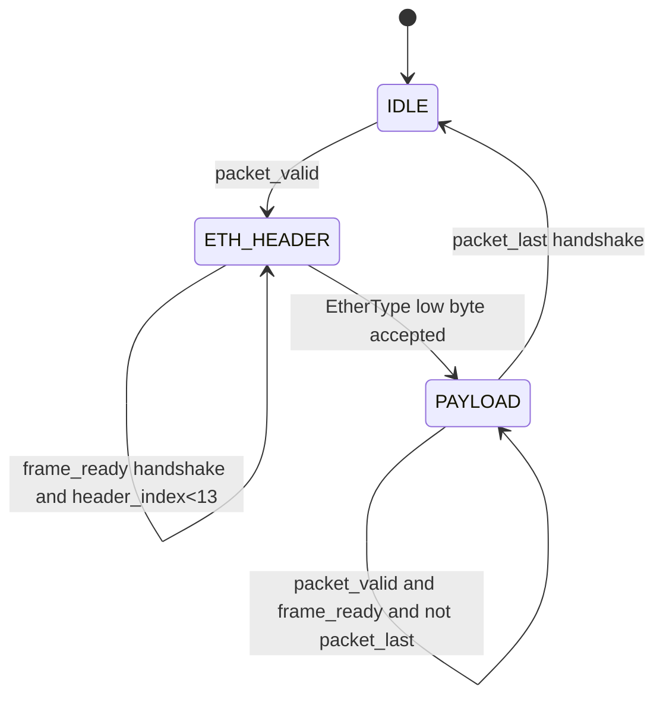
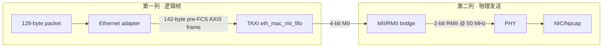
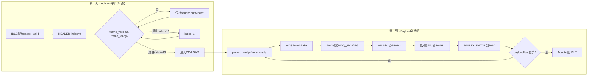

# PRG_CAM · TAXI Ethernet模块、MII/RMII桥与演进

> **PRG_CAM · PROJECT REVIEW & TRAINING SERIES**<br>
> 文档编号：03　版本：3.0　基线日期：2026-08-26<br>
> 适用对象：需要定位packet已出FPGA接收机、但PC仍无包的人<br>
> 范围：128-byte Camera packet → 142-byte pre-FCS frame → TAXI MAC/MII FIFO → RMII PHY<br>
> 当前状态：固定链和双路接收均有历史/归档证据；当前bit与上板时源码的取证绑定仍不完整<br>
> 不变量：ready/valid/last只在握手推进；header期间不消耗payload；MII/RMII不得静默改帧字节顺序

## OBJECTIVE

说明D1的128-byte packet如何经过Ethernet adapter、TAXI MAC/MII FIFO和MII→RMII bridge到达PHY；定义valid/ready/last、grant locking、backpressure、underflow/overflow和帧布局的验证方法。

## INPUTS / DEPENDENCIES / RUN IDENTITY

- Adapter：`prg_cam.srcs/sources_1/new/Ethernet_Frame_Adapter.sv:4-19,31-106`。
- TAXI wrapper：`prg_cam.srcs/sources_1/new/Taxi_Ethernet_Subsystem.sv:26-84`。
- Bridge/top debug：`prg_cam.srcs/sources_1/new/Camera_Ethernet_Top.sv:291-340,366-426`。
- RMII PHY IF：`prg_cam.srcs/sources_1/lib/FPGA-RMII-SMII-main/RTL/rmii_phy_if.v:9-32,278-305`。
- PC Ethernet门：`prg_cam.srcs/sources_1/tx/taxi_receiver_advanced/taxi_receiver/taxi_receiver/eth_validate.py:18-47`。

run manifest必须记录所用top/generic、bit/LTX、PHY/NIC接口和PCAP路径；缺少PHY寄存器/strap证据时写`NOT VERIFIED`。

## PRECHECK / DRY-RUN

**[CURRENT VERIFIED] [READ-ONLY]** 只解析路径绑定，不启动Vivado、不触碰硬件、不覆盖CSV。

```powershell
$repo = 'D:\prg\prg_cam'
$analyzer = Join-Path $repo 'scripts\analyze_ethernet_ila_capture.ps1'
$captureCsv = Join-Path $repo 'build\ethernet_ila\frame_capture.csv'

if (!(Test-Path -LiteralPath $analyzer -PathType Leaf)) {
  throw "缺少ILA分析器：$analyzer"
}
Write-Host "DRY-RUN analyzer=$analyzer"
Write-Host "DRY-RUN capture=$captureCsv"
Write-Host '不会启动硬件或覆盖CSV。'
```

只有真实CSV存在时才执行分析；不要用空文件或其他ILA layout的CSV。

## MAIN：frame构造与bridge

## 1. 这一层为什么单独存在

> **本章目标｜把“相机包正确”和“以太网发送正确”拆成两个可独立验证的问题。**

D1输出的是带`valid/ready/last`的128-byte业务packet，没有MAC地址、EtherType、preamble或FCS。D2负责把它包装成LAN8720A和PC网卡能接收的Ethernet frame。保留fixed diagnostic source的意义正是在这里：当相机/PCLK完全未知时，固定`00..7F`仍可通过同一Adapter、TAXI、MII/RMII和PHY，从而判断故障在D1之前还是D2之后（`Camera_Ethernet_Top.sv:4-14,133-194`）。

当前数据方向是TX-focused。TAXI core包含RX接口，但业务主链没有使用接收方向来控制相机；MDC固定0、MDIO高阻，工程没有通过MDIO读PHY寄存器（`Camera_Ethernet_Top.sv:430-439`附近顶层连接）。所以“link LED亮/PCAP有包”是当前板级证据，“PHY寄存器值证明strap正确”则仍是UNVERIFIED。

## 2. Ethernet_Frame_Adapter：14-byte header加128-byte payload

> **本章目标｜明确每个frame字节来自哪里，以及header阶段为什么必须压住packet_ready。**

pre-FCS frame总长142 bytes：6 bytes destination MAC、6 bytes source MAC、2 bytes EtherType、128 bytes payload。Adapter使用广播目的MAC`FF:FF:FF:FF:FF:FF`、locally administered source MAC`02:00:00:00:00:02`和大端线上EtherType`88 B5`。preamble/SFD/FCS不由Adapter生成，而由MAC/PHY链处理；因此Wireshark通常报告业务frame长度142，而线上的物理帧还包含preamble和FCS。

| Frame offset | 长度 | 值/来源 | 所有权 |
|---:|---:|---|---|
| 0–5 | 6 | `FF FF FF FF FF FF` | Adapter常量 |
| 6–11 | 6 | `02 00 00 00 00 02` | Adapter常量 |
| 12–13 | 2 | `88 B5` | Adapter常量，network order |
| 14–141 | 128 | Camera/Fixed packet | D1；其中offset需减14 |
| wire preamble/SFD/FCS | MAC/PHY添加 | 不在142-byte AXIS数组 | TAXI MAC/RMII |

header阶段`frame_valid=1`但`packet_ready=0`：Adapter必须先独立输出14个header字节，不能同时消耗payload。进入PAYLOAD后，`frame_valid=packet_valid`、`packet_ready=frame_ready`，最后一个payload字节使`frame_last=packet_last`。所有index和state只在`frame_valid && frame_ready`推进；如果ready低，当前data和last必须稳定。



直观地说，Adapter像在128字节信封前粘上14字节地址标签。贴标签期间上游必须停在第一个payload字节；标签最后一个字节被MAC接收后才允许packet前进。如果header阶段误把`packet_ready`拉高，payload首字节会被提前消费，PC看到的payload会整体左移；如果最后一个字节没有在真实握手后回IDLE，下一帧的header会与旧帧尾相接。

## 3. AXI-Stream/TAXI接口：四个信号的精确含义

> **本章目标｜用本项目的实际握手解释valid、ready和last，而不是只背AXI术语。**

`frame_data`映射到TAXI `s_axis_tx.tdata`，`frame_valid`映射`tvalid`，TAXI的`tready`返回`frame_ready`，`frame_last`映射`tlast`（`Taxi_Ethernet_Subsystem.sv:26-84`）。只有`valid && ready`同拍为1时，该字节才发生所有权转移。valid表示“发送者当前提供的字节有效”，ready表示“接收者本拍愿意接受”；任意一个为0都不得推进index。

```text
handshake = valid AND ready
stall     = valid AND NOT ready
```

stall期间发送者必须保持data、last和valid；接收者可以改变ready。`last`不是一个脱离字节的事件，而是当前字节的属性。D1最终FIFO将`{last,data}`一起存储，Adapter又把payload last映射到frame last，正是为了防止backpressure后包尾错位。

TAXI wrapper的作用不是重新解释业务packet，而是提供成熟的Ethernet MAC、MII FIFO、padding/FCS以及跨MAC时钟的缓冲。工程只递归加入`.f`依赖闭包，而不是把整个Taxi仓库无差别加入工程，防止重复module definition；实际闭包和unresolved检查在`scripts/add_taxi_sources.tcl:4-70,158-251`。

## 4. MII到RMII：位宽变换、时钟和边界

> **本章目标｜说明为什么MII有活动但PC无包时，下一步应查RMII/PHY而不是Python。**

TAXI MAC侧以4-bit MII在25 MHz发送100 Mb/s；bridge把每个MII nibble拆成两个2-bit RMII dibit，在50 MHz参考时钟域输出。吞吐守恒为：

\[
4\ \text{bit} \times 25\ \text{MHz}
=2\ \text{bit} \times 50\ \text{MHz}
=100\ \text{Mbit/s}.
\]

这里的100 Mbit/s是物理符号率，不是有效图像带宽；preamble、inter-frame gap、MAC header、FCS和128-byte packet内的协议字段都会占用带宽。bridge必须在nibble的低/高dibit顺序、TX enable起止和50 MHz edge上保持协议。当前top还通过ODDR转发`ETH_REFCLK`，其约束与外部时序见Topic 06。

## 5. Backpressure、deadlock与starvation定位

> **本章目标｜在valid卡住时判断是正常等待、吞吐不足还是状态机死锁。**

backpressure本身不是错误。健康stall表现为：上游valid保持，data/last稳定；ready恢复后只发生一次握手；FIFO level可能上升但随后下降；underflow/overflow和D1 drop不增长。吞吐瓶颈表现为stall占比长期很高、FIFO almost_full持续、Line Buffer used/committed逼近容量并最终drop。deadlock表现为上下游都有待处理数据，但ready永不恢复、状态/level长期不变，且没有合法外部等待原因。

| 观察 | 正常解释 | 异常条件 |
|---|---|---|
| `frame_valid=1, frame_ready=0` | MAC暂时施加反压 | data/last变化或永不恢复 |
| `packet_valid=1, packet_ready=0` | Adapter仍在header或下游stall | header已结束而ready永久0 |
| `tx_error_underflow=1` | 无正常解释 | MAC帧中上游断供/时钟配置错误 |
| `tx_fifo_overflow=1` | 无正常解释 | ready链或FIFO跨域处理错误 |
| MII TX_EN活动，RMII TX_EN不活动 | 无正常解释 | bridge reset/clock/mode故障 |
| RMII TX_EN活动，PCAP=0 | 可能未接正确NIC | PHY/link/cable/NIC/filter |

grant starvation仍属于D1：必须证明某路request持续存在且round-robin owner反复被其他路取得，或当前owner永不release。仅仅cam0/1包数不同不能证明starvation，因为源端行率、完整行数和错误过滤也可能不同。

Adapter固定发送广播目的MAC、源MAC`02:00:00:00:00:02`和EtherType`0x88B5`，随后逐字节透传payload。状态和index只在`valid && ready`握手时推进；stall时data/valid/last必须稳定（`Ethernet_Frame_Adapter.sv:49-106`）。



TAXI wrapper把`frame_data/valid/last`映射到`s_axis_tx.tdata/tvalid/tlast`并把`tready`返回adapter。TX-only bring-up中RX、completion和stat输出始终ready，防止无消费者造成内部阻塞。bridge的`mode_speed=1`表示100M，RMII ref clock要求50 MHz。

## Handshake与故障签名

| Signal set | Correct behavior | Failure signature | Likely layer |
|---|---|---|---|
| packet valid/ready/last | stall保持data/last；last只握手一次 | 包尾移动或重复 | D1 FIFO/adapter |
| frame valid/ready/last | 14 header+128 payload连续成帧 | 长度不是142或EtherType错 | adapter |
| AXIS→MAC | tvalid/tready形成进度 | 长期valid无ready | MAC reset/config/backpressure |
| `tx_error_underflow` | 0 | 帧中断 | TAXI source/MAC供数 |
| `tx_fifo_overflow` | 0 | 上游过快或ready链错误 | TAXI FIFO/backpressure |
| MII TX enable/data | 有帧时活动 | frame handshake有但MII静止 | MAC/MII配置 |
| RMII TX_EN/TXD | 与MII帧对应 | MII活动但RMII静止 | bridge/reset/ref clock |
| NIC ingress | 收到EtherType 0x88B5 | RMII活动而PC为0 | PHY/link/cable/NIC/interface |

grant starvation只能在request持续而owner长期不release时判定；必须同时看selected TLAST handshake。FIFO almost_full出现不等于丢包，需和drop count增量、ready stall及under/overflow组合判断。

## VALIDATE

硬件ILA采样命令在Topic 04。已有CSV可用：

**[CURRENT VERIFIED] [READ-ONLY]** 只读取既有ILA CSV并重建frame；输入不存在即停止。

```powershell
$ErrorActionPreference = 'Stop'
if (!(Test-Path -LiteralPath $captureCsv -PathType Leaf)) {
  throw "待分析CSV不存在：$captureCsv"
}
& $analyzer -CsvPath $captureCsv
$analysisExit = $LASTEXITCODE
if ($analysisExit -ne 0) {
  throw "Ethernet ILA分析失败：$analysisExit"
}
```

`scripts/analyze_ethernet_ila_capture.ps1:1-6`定义真实参数`-CsvPath`；`scripts/analyze_ethernet_ila_capture.ps1:27-79`重建142-byte adapter frame；`scripts/analyze_ethernet_ila_capture.ps1:81-149`从RMII dibit重建preamble/SFD/FCS。不得把历史聊天中的参数名当成接口。

PC侧交叉验证：

**[CURRENT VERIFIED] [READ-ONLY]** 只枚举Npcap接口；不开始采集。

```powershell
$python = 'C:\Users\Z\AppData\Local\Python\pythoncore-3.14-64\python.exe'
$receiverRoot = 'D:\prg\prg_cam\prg_cam.srcs\sources_1\tx\taxi_receiver_advanced\taxi_receiver'
Set-Location $receiverRoot
& $python -m taxi_receiver.cli --list
```

### Cold-start bridge最短证明链

在接触现场硬件前，先运行Topic 07的固定PCAP golden gate，证明host parser能识别1000个固定142-byte frame。现场只按下面顺序推进：adapter侧一次完整`valid/ready/last`握手 → TAXI无underflow/overflow → MII有活动 → RMII `TX_EN/TXD`有活动 → PHY link成立 → Wireshark/Npcap同一GUID看到`0x88B5`。前一接缝未证明时，不得修改后一层的过滤器或标定阈值。

| Stage | Artifact/measurement | PASS evidence | Scope |
|---|---|---|---|
| Offline frame contract | `wireshark_fixed_1000.pcapng` | SHA匹配且stdlib测试1000/1000 | 只证明D3能解释固定D2 frame |
| Adapter | ILA frame CSV | 14-byte Ethernet header + 128-byte payload，`last`仅一次 | D1→D2 |
| MAC/bridge | matched bit/LTX ILA | no underflow/overflow，MII/RMII均活动 | D2内部 |
| Wire | run-bound PCAP | EtherType `0x88B5`、长度142、NIC drop已记录 | PHY→D3 |
| Host | receiver FINAL REPORT | matching/valid/complete逐级非零且两路可路由 | D3，不提升为标定PASS |

选择正确接口后，观察`Capture ingress → Matching Ethernet → Valid packets`，并同时检查live pcap `ps_drop/ps_ifdrop`。`Capture ingress>0`而`Matching Ethernet=0`才指向EtherType/source-MAC/coarse length门。

## OBSERVED vs EXPECTED

| Probe | Expected | Current observed | Interpretation |
|---|---|---|---|
| EtherType | `0x88B5` | RTL和Python常量一致 | Interface definition PASS |
| Adapter length | 142 bytes before FCS | RTL固定14+128 | Definition PASS；live frame需run-bound CSV/PCAP |
| TAXI errors | underflow/overflow=0 | current CRC/receiver evidence未报告该类错误 | 未见故障，但不是独立ILA证明 |
| Dual traffic | 两路packet进入PC | current CRC audit两路各324 frame IDs | D2链路在保留run中可工作 |
| PHY identity | 型号/strap/register已绑定 | 仓库无MDIO实测 | NOT VERIFIED |

## EXPORT / FAILURE HANDLING / PASS-FAIL / NEXT ACTION

归档adapter ILA CSV、RMII重建结果、PCAP、NIC统计、bit/LTX hash和分析脚本hash。任何层的PASS只覆盖该接缝：frame handshake不能推出PHY/NIC正常，Wireshark有帧也不能推出Python重组完整。

失败时按`packet → frame → MII → RMII → PHY → NIC`找第一零点；不得直接改标定参数。当前没有授权重新烧录或采集，Topic 03只给未来复刻路径与既有证据边界。

## Host演进与ETH桥的证据接缝

Host历史中的四类损失量对应不同位置：`ps_drop`发生在Npcap内核缓冲，`Capture queue drops`发生在Python共享队列，`Lane queue drops`发生在按camera分线后，`csv_rows_dropped`只丢审计记录。四者均不能直接替代TAXI/MII/RMII的underflow、overflow、`tvalid/tready/tlast`或PHY波形证据。

当Wireshark/Npcap已有`0x88B5` frame而Host CSV出现`row_seq`缺口时，先按Topic 09对照：

```text
MII/RMII ILA连续 + ps_drop>0
    → Host取包预算或反压，不修改bridge

MII/RMII ILA本身断帧/underflow
    → 停在Topic 03，不能用增大Host queue掩盖

Wireshark有frame + Unroutable cam_id增长
    → 检查payload offset4与CameraIds白名单
```

S1/S2/V4没有修改ETH桥字节，因此历史thread/process输出逐字节一致只证明Host执行位置迁移保持语义，不能作为PHY信号完整性证明。

## 6. 当前实现的真实source graph与职责边界

> **审计结论｜D2由“自写的轻量Adapter + TAXI MAC/FIFO + 本地RMII转换核”组成；它不是一个单体Ethernet模块。PC无包时必须沿这三个实现边界找第一零点。**

| 顺序 | 实际文件/实例 | 本项目负责的行为 | 不由它负责的行为 |
|---:|---|---|---|
| 1 | `Ethernet_Frame_Adapter.sv` | 生成14-byte header；把packet握手映射为frame握手 | preamble、FCS、IFG、PHY电气 |
| 2 | `Taxi_Ethernet_Subsystem.sv` | AXIS端口绑定；实例化`taxi_eth_mac_mii_fifo`；暴露错误统计 | Camera协议字段含义 |
| 3 | TAXI依赖闭包 | MAC padding/FCS、MII FIFO、MAC时钟域处理 | RMII 2-bit物理接口 |
| 4 | `Ethernet_Mii_Rmii_Bridge.sv` | reset极性/释放适配；扁平化端口 | MII/RMII数据转换算法本身 |
| 5 | `rmii_phy_if.v` | MII nibble与RMII dibit转换；生成25 MHz MII TX clock | PHY配置寄存器、网线/NIC |
| 6 | `Camera_Ethernet_Top.sv` | 连接bridge/Taxi、寄存RMII输出、ODDR送50 MHz REFCLK | PC端Npcap接口选择 |

`scripts/add_taxi_sources.tcl`负责递归解析TAXI `.f`文件并检查unresolved module；这是复刻源闭包的入口。直接把整个TAXI仓库加入Vivado会让同名module或不需要的test/source进入fileset，不能视为等价复刻。

## 7. 三段决定协议行为的真实代码

### 7.1 Header所有权与网络字节序

`Ethernet_Frame_Adapter.sv:31-45`把线上header写死为广播目的MAC、本地管理源MAC和`0x88B5`：

```systemverilog
case (index)
    4'd0, 4'd1, 4'd2, 4'd3, 4'd4, 4'd5:
        header_byte = 8'hff;
    4'd6:  header_byte = 8'h02;
    4'd7, 4'd8, 4'd9, 4'd10: header_byte = 8'h00;
    4'd11: header_byte = 8'h02;
    4'd12: header_byte = 8'h88;
    4'd13: header_byte = 8'hb5;
    default: header_byte = 8'h00;
endcase
```

`0x88B5`在frame中是`88 B5`，而不是主机内存中小端整数的`B5 88`。Npcap看到EtherType不匹配时，应先确认frame offset12/13和所选NIC，不应调整128-byte Camera payload解析器。

### 7.2 Header阶段和payload阶段的反压边界

`Ethernet_Frame_Adapter.sv:49-70`明确header期间不拉高`packet_ready`：

```systemverilog
packet_ready = 1'b0;
frame_data    = 8'h00;
frame_valid   = 1'b0;
frame_last    = 1'b0;

case (state)
    STATE_HEADER: begin
        frame_data  = header_byte(header_index);
        frame_valid = 1'b1;
    end
    STATE_PAYLOAD: begin
        packet_ready = frame_ready;
        frame_data    = packet_data;
        frame_valid   = packet_valid;
        frame_last    = packet_valid && packet_last;
    end
endcase
```

这是防止“跳过payload第一个字节”的关键。Adapter在IDLE看到`packet_valid`只决定开始发header，上游FIFO仍保持首payload；直到进入PAYLOAD，`frame_ready`才直接返回为`packet_ready`。

### 7.3 TAXI的零转换AXIS绑定与TX-only防阻塞

`Taxi_Ethernet_Subsystem.sv:70-84`没有重排数据：

```systemverilog
assign s_axis_tx.tdata  = frame_data;
assign s_axis_tx.tkeep  = 1'b1;
assign s_axis_tx.tstrb  = 1'b1;
assign s_axis_tx.tvalid = frame_valid;
assign s_axis_tx.tlast  = frame_last;
assign frame_ready      = s_axis_tx.tready;

assign m_axis_rx.tready     = 1'b1;
assign m_axis_tx_cpl.tready = 1'b1;
assign m_axis_stat.tready   = 1'b1;
```

前三个源接口在当前TX-only bring-up没有业务消费者，因此被永久ready吸收；若把它们留在not-ready，MAC内部可能因完成/统计流无消费者而停住，此时症状会看似“Camera有packet但frame_ready永久低”。

## 8. Adapter与Bridge双列ASM



正常路径被折成两列，避免一个横向长图覆盖页面。需要注意：Adapter回IDLE的判据仍是payload最后一字节的真实握手，而不是RMII端已经物理发送完成；两者之间还有TAXI FIFO和MAC流水。

RMII发送核心在`rmii_phy_if.v:278-305`中把MII nibble缓存为两个dibit：

```verilog
if(~mac_mii_txc) begin
    rmii_txd <= rmii_txd_r;
end else if(mac_mii_txen) begin
    rmii_txen <= 1'b1;
    {rmii_txd_r,rmii_txd} <= mac_mii_txer ? 4'b1010 : mac_mii_txd;
end else begin
    rmii_txen <= 1'b0;
    {rmii_txd_r,rmii_txd} <= 4'h0;
end
```

赋值`{rmii_txd_r,rmii_txd} <= mac_mii_txd`意味着当前输出低2位，下一相位输出缓存的高2位。抓ILA重组时必须按该相位顺序拼回nibble；把采样相位倒置会得到“每个字节看似有规律但EtherType/FCS全错”的假故障。

## 9. 时钟、reset与前置设计状态

| 域/对象 | 时钟 | reset行为 | 进入该状态的前置条件 | 核查位置 |
|---|---|---|---|---|
| Adapter/logic AXIS | `logic_clk` | active-high同步状态复位 | MMCM locked、top release chain完成 | Top reset probes |
| TAXI MAC logic | `logic_clk` | `logic_rst` | 同上 | wrapper ports |
| TAXI MII TX | bridge生成`mii_tx_clk`约25 MHz | `mii_tx_rst` | RMII域reset释放、100M模式 | MII probes |
| RMII converter | `rmii_ref_clk` 50 MHz | async assert，4拍同步release | top `rst=0`且ref clock存在 | `Ethernet_Mii_Rmii_Bridge.sv:31-41` |
| PHY REFCLK输出 | ODDR转发50 MHz | 不作为业务状态机reset | clocking block锁定 | pin/示波器/ILA |

`mode_speed_100=1`是当前固定配置。若PHY strap实际处于10M、REFCLK方向错误或reset释放期间REFCLK不存在，MAC内部frame握手仍可能有进展，而PC端看不到合法帧。仓库当前没有MDIO读取闭环，因此这些物理状态只能由板级测量、link状态和run-bound PCAP确认。

## 10. 分层验证、负向向量与PASS边界

| 级别 | 最小操作 | 应看到什么 | 只能证明什么 |
|---:|---|---|---|
| L0 | `check_project.tcl` | top/source/generic检查通过 | 工程绑定，不证明行为 |
| L1 | `sim_ethernet_frame_adapter.tcl` | 14+128字节、stall保持、last一次 | Adapter逻辑 |
| L2 | TAXI/MII elaboration或仿真 | AXIS→MII有帧、无underflow | MAC source闭包与逻辑 |
| L3 | matched bit/LTX ILA | Adapter/MII/RMII同run都有活动 | FPGA内部到IOB前 |
| L4 | Wireshark/Npcap | 142-byte、EtherType 0x88B5 | PHY→NIC接缝 |
| L5 | Python FINAL REPORT | matching/valid/routed/complete逐级非零 | D3消费链，不证明图像几何 |

Adapter仿真会写Vivado仿真产物，先按Topic 04分配新run目录后执行：

```powershell
$repo = 'D:\prg\prg_cam'
$vivado = 'D:\Xilinx_Vivado\2025.2.1\Vivado\bin\vivado.bat'
Set-Location $repo

& $vivado -mode batch -nolog -nojournal `
  -source .\scripts\sim_ethernet_frame_adapter.tcl
$adapterExit = $LASTEXITCODE
if ($adapterExit -ne 0) {
  throw "Ethernet adapter仿真失败：$adapterExit"
}
```

建议的负向向量均可在仿真或离线分析执行，不需要更改质量门：header拍随机ready、payload首字节前stall、payload末字节stall、错误EtherType样本、RMII dibit相位交换、MAC source中途断供。预期分别验证index稳定、首字节不丢、TLAST不漂移、coarse filter拒绝、重建器能发现相位错和underflow统计能报警。

## 11. 文档级验收摘要

- 能逐字解释142-byte pre-FCS frame，并区分Camera payload offset与Ethernet frame offset。
- 能用Adapter源码证明header阶段不消费payload，用TAXI wrapper证明数据零转换映射。
- 能沿`packet → frame → AXIS → MII → RMII → PHY → NIC`找第一个零点，而不是直接改Python或标定。
- 能区分逻辑握手完成、TAXI FIFO发送、RMII IO活动和PCAP出现，它们不是同一时刻也不是同一PASS。
- 仍不能仅凭本文确认PHY strap/寄存器、线缆质量或当前bit源码身份；必须附run manifest及板级证据。
