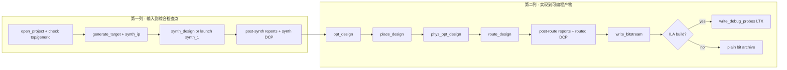
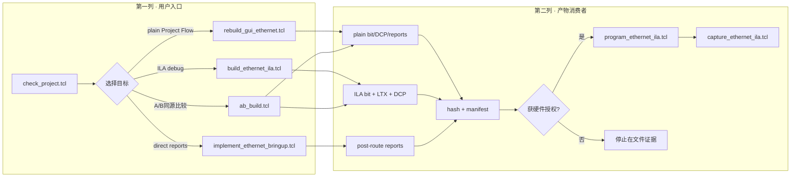

# PRG_CAM · Vivado/Xilinx复刻、实现与调试实验手册

> **PRG_CAM · PROJECT REVIEW & TRAINING SERIES**<br>
> 文档编号：04　版本：3.0　基线日期：2026-08-26<br>
> 适用对象：需要从XPR重新得到synthesis、implementation、bit、LTX和reports的人<br>
> 工具身份：Vivado 2025.2.1；part=`xc7a50ticsg324-1L`；top=`Camera_Ethernet_Top`<br>
> 当前状态：归档ILA bit/LTX/DCP文件身份可验证；当前HEAD与历史上板事件的forensic绑定不完整<br>
> 安全边界：只读检查、文件系统写入、FPGA编程和等待硬件trigger四类动作必须分开标注

## OBJECTIVE

给出可复现的Project Flow、Non-Project Flow、plain/ILA build、program、capture和report顺序；明确每一步设计状态、写入副作用与幂等规则。

## INPUTS / DEPENDENCIES / RUN IDENTITY

- 工程：`prg_cam.xpr`，top=`Camera_Ethernet_Top`，part=`xc7a50ticsg324-1L`。
- Project Flow：`scripts/rebuild_gui_ethernet.tcl:6-31`。
- Direct Non-Project-style commands in project context：`scripts/synth_ethernet_bringup.tcl:5-21`、`scripts/implement_ethernet_bringup.tcl:7-46`。
- Plain/ILA A/B：`scripts/ab_build.tcl:1-19,97-174`。
- ILA build/program/capture：`scripts/build_ethernet_ila.tcl:32-171`、`scripts/program_ethernet_ila.tcl:1-41`、`scripts/capture_ethernet_ila.tcl:1-92`。

每次build的run manifest必须记录Vivado版本、Git HEAD/dirty、source manifest、top/part/generic、plain/ILA artifact SHA、report路径和native exit code。

## 1. 实验地图与证据分级

> **本章目标｜每个实验只跨越一个Vivado状态边界，失败就停在该状态。**

| 实验 | 回答的问题 | 所需设计状态 | 主要产物 |
|---:|---|---|---|
| 0 | 这次到底在构建哪份源码？ | 无工程状态 | Git/dirty/XPR hash/run manifest |
| 1 | XPR的top、part、generic和source存在吗？ | project open | precheck log |
| 2 | TAXI依赖闭包能解析吗？ | project open/fileset | compile manifest/unresolved report |
| 3 | RTL功能边界先通过吗？ | simulation project | XSim log/WDB |
| 4 | 综合能映射、资源合理吗？ | post-synth | synth DCP/util/timing/methodology |
| 5 | place/route后满足被约束的时序吗？ | post-route | routed DCP/timing/DRC/CDC/route |
| 6 | plain bit能生成吗？ | routed | bit/hash |
| 7 | ILA探针能唯一绑定并实现吗？ | post-synth→post-route debug | matched bit/LTX/DCP |
| 8 | FPGA实际加载了哪套产物？ | hardware manager | program log/device startup |
| 9 | 指定trigger能导出可解释CSV吗？ | programmed matched bit/LTX | ILA CSV/capture log |

Vivado阶段的证据不能跨级：elaboration只证明模块与端口能展开；synthesis只证明RTL可映射；implementation证明被约束路径的布局布线结果；bit存在只证明配置文件生成；program success只证明FPGA启动；ILA/PCAP才证明运行活动。

## 2. 实验0：锁定构建身份

> **本章目标｜在任何Vivado写操作前保存HEAD、dirty和工程哈希。**

| 项目 | 内容 |
|---|---|
| 目的 | 防止新bit无法回答“由哪份源码生成” |
| 前置条件 | 仓库路径存在；本实验只读 |
| 观察点 | branch、HEAD、dirty、XPR SHA、Vivado路径 |
| PASS | 所有字段已写入本次唯一run；dirty也被如实记录 |
| 常见错误 | 把旧bit时间戳当源码身份；dirty却只记HEAD |
| 恢复方法 | 停止build，补齐manifest；不执行Git清理 |

```powershell
$ErrorActionPreference = 'Stop'
$repo = 'D:\prg\prg_cam'
$runId = '{0}_vivado' -f (Get-Date -Format 'yyyyMMdd_HHmmss')
$runRoot = Join-Path $repo "runs\$runId"
if (Test-Path -LiteralPath $runRoot) { throw "run已存在：$runRoot" }
New-Item -ItemType Directory -Path $runRoot | Out-Null

Set-Location -LiteralPath $repo
git branch --show-current
git rev-parse HEAD
git status --short
Get-FileHash -Algorithm SHA256 -LiteralPath .\prg_cam.xpr
```

预期输出没有固定hash值；正确结果是把实际值冻结到本run，不能要求它等于历史归档。命令退出0也不是build PASS，因为尚未打开Vivado。

## 3. 实验1：Project Source Precheck

> **本章目标｜在耗时综合前验证当前活动top和关键generic。**

| 项目 | 内容 |
|---|---|
| 目的 | 确认不是旧top、fixed source、Cam1关闭或CRC模式错 |
| 前置条件 | 实验0完成；Vivado 2025.2.1路径可执行 |
| 预期结果 | `PROJECT_SOURCE_CHECK_PASS`，native exit 0 |
| 观察点 | `Camera_Ethernet_Top`、`USE_CAMERA_PIPELINE=1`、`ENABLE_CAM1=1`、两层CRC=1 |
| FAIL | 任何property缺失或脚本error |
| 恢复方法 | 回到XPR/fileset/generic；禁止直接进入synthesis |

本实验的完整命令位于下一节PRECHECK。`check_project.tcl:5-35`是硬门来源；不要用文档表格代替实际脚本输出。

## 4. 实验2：TAXI依赖闭包

> **本章目标｜确认`.f`递归解析后的真实RTL闭包没有缺失或重复定义。**

| 项目 | 内容 |
|---|---|
| 目的 | 防止只在某台机器上依靠GUI缓存而成功 |
| 前置条件 | project source precheck通过 |
| 预期产物 | `docs/taxi_compile_manifest.txt`、compile order、unresolved report |
| PASS | missing/unresolved为空、duplicate module definition为0 |
| 常见错误 | 整个Taxi树加入导致重复定义；相对`.f`从仓库根错误解析 |
| 恢复方法 | 按filelist所在目录解析，只加入递归闭包 |

```powershell
Set-Location -LiteralPath $repo
& $vivado -mode batch -nolog -nojournal `
  -source .\scripts\add_taxi_sources.tcl
if ($LASTEXITCODE -ne 0) { throw 'TAXI dependency closure失败' }
```

该脚本会修改project fileset，因此属于文件系统写操作，不是dry-run。执行前后都要保存source manifest。

## 5. 实验3：先仿真再实现

> **本章目标｜在布局布线前证明Adapter的142-byte、stall稳定与TLAST位置。**

| 项目 | 内容 |
|---|---|
| 目的 | 把RTL功能错误和实现/物理问题分开 |
| 前置条件 | simulation source可解析 |
| 预期结果 | testbench自动byte compare且打印PASS |
| 观察点 | header期间packet_ready=0；stall时data/last不变；最后payload字节同拍last |
| FAIL | 任一byte mismatch、timeout、last错位 |
| 恢复方法 | 修复第一个scoreboard mismatch，不进入implementation |

```powershell
Set-Location -LiteralPath $repo
& $vivado -mode batch -nolog -nojournal `
  -source .\scripts\sim_ethernet_frame_adapter.tcl
if ($LASTEXITCODE -ne 0) { throw 'Frame Adapter simulation失败' }
```

更完整的Camera Pipeline/Byte FIFO仿真入口应以仓库当前testbench和实际脚本为准；若没有单命令wrapper，文档必须写`TODO`，不得发明脚本名。

## 6. Project Flow与direct flow的差异

> **本章目标｜理解两条构建路线为何都存在，以及为什么产物不能混称同一次build。**

Project Flow由`synth_1/impl_1`run数据库驱动，适合复现GUI Generate Bitstream；`rebuild_gui_ethernet.tcl:6-31`使用`reset_run/launch_runs/wait_on_run/open_run`。direct flow在已打开project的同一Vivado进程中直接调用`synth_design → opt_design → place_design → phys_opt_design → route_design`，适合自动报告和硬门；`implement_ethernet_bringup.tcl:7-64`就是当前入口。两者可能采用不同的incremental checkpoint或run property，A/B必须记录这些差异。

plain build不含debug core；ILA build在综合后用exact net/bus插入64 probes，再重新实现。ILA增加LUT/FF/BRAM和routing负担，所以plain/ILA的hash、资源和WNS不同是正常的。功能对比必须保持source/generic/XDC一致，不能把“ILA更慢”解释成RTL功能退化。

## PRECHECK

**[READ ONLY] [RUN NOW]** `check_project.tcl`只打开/检查工程，不综合、不编程：

```powershell
$ErrorActionPreference = 'Stop'
$repo = 'D:\prg\prg_cam'
$vivado = 'D:\Xilinx_Vivado\2025.2.1\Vivado\bin\vivado.bat'
$project = Join-Path $repo 'prg_cam.xpr'

foreach ($required in @($vivado, $project)) {
  if (!(Test-Path -LiteralPath $required -PathType Leaf)) {
    throw "Vivado前置对象不存在：$required"
  }
}
Set-Location $repo
& $vivado -mode batch -nolog -nojournal `
  -source .\scripts\check_project.tcl
if ($LASTEXITCODE -ne 0) { throw 'Project source/generic precheck失败' }
```

## DRY-RUN与幂等性

现有Vivado Tcl无通用`-WhatIf`。执行前用PowerShell打印计划并强制唯一run ID：

**[READ ONLY] [RUN NOW]** 下面只计算并打印路径；不得追加build调用：

```powershell
$runId = '{0}_ab_build' -f (Get-Date -Format 'yyyyMMdd_HHmmss')
$abRoot = Join-Path $repo "build\ab_build\$runId"
if (Test-Path -LiteralPath $abRoot) {
  throw "AB run已存在，禁止覆盖：$abRoot"
}

$env:AB_RUN_ID = $runId
Write-Host "DRY-RUN project=$project"
Write-Host "DRY-RUN script=$(Join-Path $repo 'scripts\ab_build.tcl')"
Write-Host "DRY-RUN output=$abRoot"
Write-Host "DRY-RUN git=$(git -C $repo rev-parse HEAD)"
```

`ab_build.tcl`把最终A/B证据归档到唯一目录，但其子脚本仍会更新固定的`build/gui_ethernet_rebuild`和`build/ethernet_ila` staging目录，并使用`-force`。因此旧staging不是immutable evidence；只有`build/ab_build/<run_id>`中的source/artifact manifest和副本可作为该run归档。相同`AB_RUN_ID`禁止重跑。

## Bootstrap Path A与Path B

### Path A — retained artifact，条件式启动

| Artifact | Path | SHA256 | Target/status |
|---|---|---|---|
| ILA bit | `build/ethernet_ila/Camera_Ethernet_Top_ila.bit` | `8E8047DFDDC293A835A5AA5E56AEA8ABB0A7EFD1BF92A939FFF21BC8F33A92FC` | `xc7a50t_0`; retained hardware-smoke candidate |
| ILA probes | `build/ethernet_ila/Camera_Ethernet_Top_ila.ltx` | `7D9EAE45674B3F977B238B6AD9DF78A1C63F65796373F803FA08F5F197F2B447` | must accompany the bit above |
| routed DCP | `build/ethernet_ila/Camera_Ethernet_Top_ila_routed.dcp` | `205ED25EA9D95D917AE2E22D77B8D5B31D530D71C38F00A0A0672393C7C5D81B` | report/debug provenance |

`build/ethernet_ila/cam1_reprogram_20260823.log:28-63`证明2026-08-23脚本从上述staging路径编程并得到`End of startup status: HIGH`；随后双路CRC证据通过。但编程日志没有记录当刻SHA，CRC run也没有统一manifest绑定bit，所以Path A的**file identity VERIFIED、program-time source binding HISTORICAL EVIDENCE ONLY**。`FINAL_HARDWARE_IDENTITY_MANIFEST.json`将当前retained files冻结为engineering bootstrap基线；它不把历史编程事件升级成forensic verified。

**[READ ONLY] [RUN NOW]** 编程前只读身份门：

```powershell
$repo = 'D:\prg\prg_cam' # ← 实际repo
$expectedBit = '8E8047DFDDC293A835A5AA5E56AEA8ABB0A7EFD1BF92A939FFF21BC8F33A92FC'
$expectedLtx = '7D9EAE45674B3F977B238B6AD9DF78A1C63F65796373F803FA08F5F197F2B447'
$bit = Join-Path $repo 'build\ethernet_ila\Camera_Ethernet_Top_ila.bit'
$ltx = Join-Path $repo 'build\ethernet_ila\Camera_Ethernet_Top_ila.ltx'
if ((Get-FileHash -Algorithm SHA256 $bit).Hash -ne $expectedBit -or
    (Get-FileHash -Algorithm SHA256 $ltx).Hash -ne $expectedLtx) {
  throw 'Retained bit/LTX identity mismatch; do not program.'
}
Write-Host 'IDENTITY MATCH for engineering bootstrap; historical program-time binding remains partial.'
```

**[MUTATES FPGA] [RUN NOW ONLY WITH HARDWARE AUTHORIZATION]**：

```powershell
$vivado = 'D:\Xilinx_Vivado\2025.2.1\Vivado\bin\vivado.bat' # ← 实际路径
Set-Location $repo
& $vivado -mode batch -nolog -nojournal `
  -source .\scripts\program_ethernet_ila.tcl
if ($LASTEXITCODE -ne 0) { throw 'Path-A program failed' }
```

预期控制台：恰好一个`xc7a50t_0`、`End of startup status: HIGH`、`HW_ILA_COUNT=1`以及probe清单。预期文件：此命令不应改写bit/LTX；program log应写入本次唯一run目录（现有Tcl不自动归档，需要wrapper处理）。PASS：启动状态高且随后link/`0x88B5`/receiver分别取证。FAIL：无device是cable/driver/供电，probes失败是bit/LTX错配，不能通过rebuild绕过。

### Path B — rebuild from source

只有Path A先证明环境/硬件基线后，才按`source precheck → synthesis → implementation → timing/DRC → bit/LTX → hash archive → program`进入Path B。这样可把“环境/接线错误”与“自己的重新build错误”分开。Path A hash不符时必须停止；不得用Path B掩盖artifact损坏。新build只有在本身通过完整report和run identity后才能成为新的候选，不能继承历史known-good标签。

## 7. 实验4～9操作卡

> **本章目标｜给每个主要Vivado动作一个可执行的验收与恢复边界。**

### 实验4｜Synthesis与post-synth报告

| 项目 | 内容 |
|---|---|
| 目的 | 证明当前top可映射并取得初步资源/CDC/DRC/timing |
| 完整命令 | `& $vivado -mode batch -nolog -nojournal -source .\scripts\synth_ethernet_bringup.tcl` |
| 前置状态 | project/source/IP ready，尚不要求routed design |
| 预期产物 | `docs/reports/ethernet_bringup/post_synth_*.rpt` |
| PASS/FAIL | Tcl exit 0、无Error/Critical Warning；资源明显异常也应人工FAIL |
| 常见错误 | 把post-synth WNS当最终routing结论 |
| 恢复方法 | 查第一个missing module/multi-driver/CDC；不进入route |

### 实验5｜Implementation与routed checkpoint

| 项目 | 内容 |
|---|---|
| 目的 | 完成opt/place/phys_opt/route并生成sign-off类报告 |
| 完整命令 | `& $vivado -mode batch -nolog -nojournal -source .\scripts\implement_ethernet_bringup.tcl` |
| 前置状态 | 工程可综合，XDC为当前active constraint |
| 预期产物 | routed DCP、methodology/CDC/DRC/utilization/route/timing reports |
| PASS/FAIL | setup和hold slack非负且Error/Critical Warning为0；普通warning逐条分类 |
| 常见错误 | 只看到“All constraints met”就忽略no-input-delay或CDC结构 |
| 恢复方法 | 按Topic 06先分RTL、constraint或routing，不盲目加false path |

### 实验6｜Project Flow plain bit

| 项目 | 内容 |
|---|---|
| 目的 | 复现GUI `Generate Bitstream`路径 |
| 完整命令 | `& $vivado -mode batch -nolog -nojournal -source .\scripts\rebuild_gui_ethernet.tcl` |
| 前置状态 | run property、incremental checkpoint和generic已写入manifest |
| 预期产物 | `impl_1/Camera_Ethernet_Top.bit`、routed DCP和reports |
| PASS/FAIL | run complete、报告门通过、产物hash归档 |
| 常见错误 | 以为`reset_run`清除了所有外部stale artifact |
| 恢复方法 | 查看run DIRECTORY和incremental checkpoint，建立新run归档 |

### 实验7｜ILA build

| 项目 | 内容 |
|---|---|
| 目的 | 用当前64-probe布局生成同源bit/LTX |
| 完整命令 | `& $vivado -mode batch -nolog -nojournal -source .\scripts\build_ethernet_ila.tcl` |
| 前置状态 | `exact_net/exact_bus`所需net在post-synth唯一存在 |
| 预期产物 | `Camera_Ethernet_Top_ila.bit/.ltx/_routed.dcp`和3份report |
| PASS/FAIL | `ILA_BUILD_RESULT=PASS`、core=1、probe count=64、timing/DRC门通过 |
| 常见错误 | net被优化/重命名；旧LTX与新bit混配 |
| 恢复方法 | 先修probe来源或MARK_DEBUG，再整套重建；不手工拼LTX |

### 实验8｜Program

| 项目 | 内容 |
|---|---|
| 目的 | 把已经通过hash门的bit/LTX加载到唯一Artix-7 target |
| 完整命令 | `& $vivado -mode batch -nolog -nojournal -source .\scripts\program_ethernet_ila.tcl` |
| 前置状态 | 明确硬件授权；bit/LTX同run；JTAG device恰好一个 |
| 预期输出 | startup HIGH、一个ILA core、program log |
| PASS/FAIL | program成功只是本实验PASS；link/packet需下一层另验 |
| 常见错误 | USB cable/driver/供电导致device=0；plain bit配LTX |
| 恢复方法 | 不重build，先查target、cable、hash和PROBES.FILE |

### 实验9｜ILA trigger与CSV

| 项目 | 内容 |
|---|---|
| 目的 | 在正确clock domain捕获指定接缝并导出机器可读CSV |
| 完整命令 | 设置`ILA_TRIGGER_NAME/POSITION/COMPARE_VALUE/CAPTURE_CSV`后调用`capture_ethernet_ila.tcl` |
| 前置状态 | matching ILA bit/LTX已program；trigger为实际存在的1-bit probe |
| 预期输出 | `ILA_CAPTURE_ARMED`、`ILA_CAPTURE_RESULT=PASS`、非空CSV |
| PASS/FAIL | CSV含任务所需pre/post-trigger窗口；无trigger不是功能FAIL的充分证据 |
| 常见错误 | `wait_on_hw_ila`被误认为Vivado卡死；camera未活动导致永不触发 |
| 恢复方法 | 用`observe_ethernet_ila_trigger.tcl`查armed状态或把trigger上移到首个活动节点 |

## MAIN A：推荐A/B可复现构建

**[MUTATES FILESYSTEM] [LONG RUN] [RUN NOW]** 当前 retained A/B run实测plain约2分21秒、ILA约5分21秒；新主机时间不得据此保证：

```powershell
New-Item -ItemType Directory -Path $abRoot | Out-Null
$log = Join-Path $abRoot 'orchestrator_console.log'
& $vivado -mode batch -nolog -nojournal `
  -source .\scripts\ab_build.tcl 2>&1 |
  Tee-Object -FilePath $log
$buildExit = $LASTEXITCODE

if ($buildExit -ne 0) {
  throw "A/B Vivado build失败：$buildExit；保留 $abRoot"
}
```

该流程先写`source_manifest_before.csv`，运行plain Project Flow和ILA build，再写`source_manifest_after.csv`并比较；源码变化即失败。输出`artifact_manifest.csv`保存plain/ILA SHA256（`scripts/ab_build.tcl:97-174`）。

## MAIN B：设计状态与命令顺序



| Operation | Required state before command | State/output after | Current script |
|---|---|---|---|
| `synth_design` | project open, top/part/source/IP ready | synthesized in memory | `synth_ethernet_bringup.tcl:5-15` |
| post-synth reports | synthesized design open | methodology/CDC/DRC/util/timing | `scripts/synth_ethernet_bringup.tcl:16-21` |
| `opt/place/phys_opt/route` | synthesized design | routed design | `implement_ethernet_bringup.tcl:34-37` |
| post-route reports/DCP | routed design | reports+routed DCP | `scripts/implement_ethernet_bringup.tcl:39-46` |
| Project `launch_runs impl_1 -to_step write_bitstream` | synth run complete | project bitstream run complete | `rebuild_gui_ethernet.tcl:12-31` |
| ILA insert | synthesized design and exact nets | debug core implemented/routed | `build_ethernet_ila.tcl:64-153` |
| bit/LTX output | routed debug design | `.bit/.ltx/.dcp` | `scripts/build_ethernet_ila.tcl:155-170` |

Project Flow使用run数据库、`reset_run/launch_runs/wait_on_run/open_run`；直接流在当前Vivado进程中显式推进`synth_design→route_design`。不能在只有synth状态时调用`write_bitstream`或把post-synth report称为post-route结果。

## Report自动化补充架构

现有current-top脚本未统一生成clock interaction和power。未来独立report Tcl必须在已完成并打开的`impl_1`或已route的in-memory design上运行：

**[FUTURE] [REFERENCE] [MUTATES FILESYSTEM]** 这是报告脚本骨架，不是仓库现有入口：

```tcl
set root_dir [file normalize [file join [file dirname [info script]] ..]]
set out_dir [file normalize $::env(PRG_REPORT_OUT)]
if {[file exists $out_dir] && [llength [glob -nocomplain -directory $out_dir *]] > 0} {
    error "Report output is not empty: $out_dir"
}
file mkdir $out_dir
open_project [file join $root_dir prg_cam.xpr]
set status [get_property STATUS [get_runs impl_1]]
if {![string match "*Complete*" $status]} {
    error "impl_1 is not complete: $status"
}
open_run impl_1
report_timing_summary -delay_type min_max -report_unconstrained \
    -file [file join $out_dir timing_summary.rpt]
report_clock_interaction -file [file join $out_dir clock_interaction.rpt]
report_cdc -details -file [file join $out_dir cdc.rpt]
report_drc -file [file join $out_dir drc.rpt]
report_utilization -file [file join $out_dir utilization.rpt]
report_power -file [file join $out_dir power.rpt]
```

`report_power`若没有SAIF/VCD活动输入，只是基于默认/推断toggle的估算，不能写成板上测量。当前仓库根`clock_interaction_report.txt`属于`AXI4_Compiler`而非当前top，只能作历史证据。

## ILA：probe、program与capture

### Probe选择

`build_ethernet_ila.tcl`中的`exact_net/exact_bus`要求唯一匹配，防止错误连接；logic clock采样、4096深度、64 probes。Layer1为CAM1 pins/capture，Layer2为buffer/replacer/FIFO/adapter/RMII。

### Program前dry-run

**[READ ONLY] [RUN NOW]**

```powershell
$bit = Join-Path $repo 'build\ethernet_ila\Camera_Ethernet_Top_ila.bit'
$ltx = Join-Path $repo 'build\ethernet_ila\Camera_Ethernet_Top_ila.ltx'
$archivedBit = Join-Path $abRoot 'ila\Camera_Ethernet_Top_ila.bit'
$archivedLtx = Join-Path $abRoot 'ila\Camera_Ethernet_Top_ila.ltx'
$hardwareRunId = '{0}_ila_hw' -f (Get-Date -Format 'yyyyMMdd_HHmmss')
$hardwareRunRoot = Join-Path $repo "runs\$hardwareRunId"

foreach ($path in @($bit,$ltx,$archivedBit,$archivedLtx)) {
  if (!(Test-Path -LiteralPath $path -PathType Leaf)) {
    throw "ILA前置对象不存在：$path"
  }
}
$bitHash = (Get-FileHash -Algorithm SHA256 -LiteralPath $bit).Hash
$ltxHash = (Get-FileHash -Algorithm SHA256 -LiteralPath $ltx).Hash
if ($bitHash -ne (Get-FileHash -Algorithm SHA256 -LiteralPath $archivedBit).Hash -or
    $ltxHash -ne (Get-FileHash -Algorithm SHA256 -LiteralPath $archivedLtx).Hash) {
  throw '固定staging与本次A/B归档不一致；禁止编程'
}
if (Test-Path -LiteralPath $hardwareRunRoot) {
  throw "Hardware run已存在：$hardwareRunRoot"
}
$identity = @(
  Get-FileHash -Algorithm SHA256 -LiteralPath $bit
  Get-FileHash -Algorithm SHA256 -LiteralPath $ltx
)
$identity | Format-Table -AutoSize
Write-Host "DRY-RUN hardware_root=$hardwareRunRoot"
Write-Host 'DRY-RUN only：尚未执行program_hw_devices。'
```

实际烧录会改变FPGA，必须获得明确授权后执行：

**[MUTATES FPGA] [MUTATES FILESYSTEM]**

```powershell
New-Item -ItemType Directory -Path $hardwareRunRoot | Out-Null
& $vivado -mode batch -nolog -nojournal `
  -source .\scripts\program_ethernet_ila.tcl 2>&1 |
  Tee-Object -FilePath (Join-Path $hardwareRunRoot 'program_ila.log')
if ($LASTEXITCODE -ne 0) { throw 'ILA program失败' }
```

脚本要求恰好一个`xc7a50t_0`，同时设置`PROGRAM.FILE/PROBES.FILE/FULL_PROBES.FILE`并刷新probes（`scripts/program_ethernet_ila.tcl:7-35`）。该脚本固定读取`build/ethernet_ila` staging（`scripts/program_ethernet_ila.tcl:1-5`），所以编程前必须执行上面的staging↔A/B archive逐文件hash相等门；不能只看文件名。

### Capture与CSV

**[MUTATES FILESYSTEM] [LONG RUN] [RUN NOW]** 需要已经加载匹配bit/LTX的硬件：

```powershell
$env:ILA_TRIGGER_NAME = 'frame_handshake'
$env:ILA_TRIGGER_COMPARE_VALUE = "eq1'b1"
$env:ILA_TRIGGER_POSITION = '512'
$env:ILA_CAPTURE_CSV = Join-Path $hardwareRunRoot 'frame_handshake.csv'

& $vivado -mode batch -nolog -nojournal `
  -source .\scripts\capture_ethernet_ila.tcl 2>&1 |
  Tee-Object -FilePath (Join-Path $hardwareRunRoot 'capture_ila.log')
if ($LASTEXITCODE -ne 0) { throw 'ILA capture失败' }
```

capture脚本只接受1-bit trigger，position范围0..4095，compare只接受`eq1'b0/eq1'b1`（`scripts/capture_ethernet_ila.tcl:10-47,63-88`）。bit/LTX必须来自同一A/B run；plain bit没有debug core，不得搭配LTX使用。

### Major operation output contract

| Operation | Expected console | Expected files | PASS condition |
|---|---|---|---|
| `check_project.tcl` | source/top/generic checks无error | 无新artifact | native exit 0 |
| `ab_build.tcl` | plain与`ILA_BUILD_RESULT=PASS` | unique A/B root、before/after manifests、bit/DCP/reports；ILA另有LTX | exit 0、source snapshots相同、artifact manifest完整 |
| report skeleton | 各report命令无error | timing/clock/CDC/DRC/util/power reports | 文件非空；timing/DRC按Topic 06判定 |
| program ILA | startup HIGH、一个device/ILA | 本次program log | bit/LTX SHA先通过且硬件刷新成功 |
| capture ILA | trigger armed/captured/exported | 指定CSV与capture log | CSV非空、probe名/clock domain与任务一致 |

## VALIDATE / OBSERVED vs EXPECTED

| Gate | Expected | Current observed | Interpretation |
|---|---|---|---|
| Project source check | top/generics/modules全部匹配 | 脚本提供硬失败 | 可执行PRECHECK |
| Source stability | before=after | A/B脚本已实现比较 | 未来推荐入口 |
| Post-route timing | setup/hold slack >=0 | 归档ILA report WNS 1.115 ns、WHS 0.025 ns，TNS/THS均0（`build/ethernet_ila/timing_summary.rpt:161-171`） | PASS for该retained ILA report；不代表外部IO完整sign-off |
| DRC | Error/Critical Warning=0 | implementation脚本硬门 | 需随run归档report |
| retained ILA artifacts | bit/LTX/DCP分别hash | bit `8E8047DFDDC293A835A5AA5E56AEA8ABB0A7EFD1BF92A939FFF21BC8F33A92FC`；LTX `7D9EAE45674B3F977B238B6AD9DF78A1C63F65796373F803FA08F5F197F2B447`；DCP `205ED25EA9D95D917AE2E22D77B8D5B31D530D71C38F00A0A0672393C7C5D81B` | 文件身份VERIFIED；编程时source绑定仍是HISTORICAL EVIDENCE ONLY |
| Clock interaction | current top report | 缺失 | REPORT LIMITATION |
| Power | routed estimate且注明activity | 缺失 | REPORT LIMITATION |

## EXPORT / FAILURE HANDLING / NEXT ACTION

成功与失败都保留console log、journal（若启用）、source before/after、artifact manifest、reports、DCP、bit/LTX及run manifest。run非空、source snapshot变化、timing/DRC失败、probe不存在或bit/LTX错配均必须停止；不得用`-force`覆盖归档run。当前阶段不执行Vivado rebuild或program，只记录现有证据和未来可执行入口。

## Host A/B与MATLAB分析的自动化接缝

Vivado build与Host性能A/B必须使用同一run identity，但不能由一个脚本的exit 0代替另一层PASS。历史S2工具链现在补充了MATLAB入口：

```powershell
$repo = 'D:\prg\prg_cam'
$matlab = 'D:\Other_Tools\Matlab\bin\matlab.exe'
Set-Location $repo

& $matlab -batch `
  "addpath('scripts_matlab'); run('scripts_matlab/run_s2_historical_comparison.m')"
if ($LASTEXITCODE -ne 0) {
  throw "Host packet-loss MATLAB analysis failed: $LASTEXITCODE"
}
```

该脚本不调用Vivado、不编程FPGA，也不覆盖历史目录；每次在`build/matlab_host_packet_loss/<run_id>`建立新证据。若以后将Vivado和Host压测编排到同一PowerShell入口，仍必须保持`PRECHECK → DRY-RUN → FPGA BUILD/PROGRAM → RECEIVER → MATLAB VALIDATE → EXPORT`，并在manifest分别记录bit/LTX SHA、receiver Git SHA、两组CSV路径和MATLAB脚本SHA。

## 8. 当前Tcl脚本调用拓扑

> **审计结论｜当前仓库已有可用脚本，但还不是一个统一的“一键构建器”。复刻者必须先选择Project Flow、direct flow或ILA flow，不能把三者连续执行后把固定staging目录当成同一个run。**



| 脚本 | 用户是否直接调用 | 前置状态 | 主要写入 | 失败后是否可继续 |
|---|---|---|---|---|
| `check_project.tcl` | 是，所有flow第一步 | XPR可打开 | 无正式artifact | 否，先修工程身份 |
| `add_taxi_sources.tcl` | 条件调用/helper | project fileset open | 修改source set/manifest | 否，闭包未解析不能综合 |
| `rebuild_gui_ethernet.tcl` | 是 | source/IP ready | synth_1/impl_1及plain bit | 否，保留失败run |
| `implement_ethernet_bringup.tcl` | 是 | source/XDC ready | direct DCP与reports | 否，report门未过 |
| `build_ethernet_ila.tcl` | 是 | exact nets可匹配 | 固定ILA staging bit/LTX/DCP/reports | 否，不拼接旧LTX |
| `ab_build.tcl` | 推荐编排入口 | 唯一`AB_RUN_ID` | 固定staging + immutable A/B副本 | 否，source before/after必须相同 |
| `program_ethernet_ila.tcl` | 是，需授权 | 同run bit/LTX已过hash门 | 改FPGA配置、硬件log | 不自动rebuild |
| `capture_ethernet_ila.tcl` | 是 | 已program且trigger存在 | CSV/log | 无trigger先查活动/条件 |

## 9. AI或人工新增自动化的强制骨架

未来新增Tcl/PowerShell/JSON脚本必须按同一生命周期组织，但不得伪装成当前已存在实现：

1. `PRECHECK`：扫描真实top、part、source、IP、XDC、环境变量和输出目录；module/net/probe名必须来自`get_*`查询或仓库扫描。
2. `DRY-RUN`：打印工程、flow、run ID、输入DCP/bit/LTX、输出根和可能改变的对象；不调用`launch_runs`、`write_*`或`program_hw_devices`。
3. `MAIN`：只跨一个清晰设计状态；综合、实现、bit、program、capture不得用一个无法局部重试的黑盒函数包住。
4. `VALIDATE`：检查native exit、Vivado run status、非空artifact、report门和hash；“文件存在”不是充分PASS。
5. `EXPORT`：写`run_manifest.json`、日志、source/artifact manifest和报告索引；历史run只读。
6. `FAILURE HANDLING`：失败目录保留；不自动删除、不回滚Git、不拿旧artifact补齐当前缺项。

推荐的机器可读run identity最小字段：

```json
{
  "run_id": "yyyyMMdd_HHmmss_vivado_plain_or_ila",
  "git_head": "<actual hash>",
  "git_dirty": true,
  "vivado_version": "2025.2.1",
  "top": "Camera_Ethernet_Top",
  "part": "xc7a50ticsg324-1L",
  "flow": "project|direct|ila",
  "source_manifest": "<path>",
  "artifacts": [],
  "reports": [],
  "native_exit_code": 0,
  "status": "PASS|FAIL|PARTIAL"
}
```

尖括号字段必须在运行时填真实值；不能把这个示例保存为实验manifest。MCU firmware SHA、receiver version、camera IDs、intrinsics SHA和capture root属于跨域实验身份，可由Topic 00的总manifest扩展加入。

## 10. Report判读：先问设计状态，再问失败来源

| Report | 必须在哪个状态生成 | 先核什么 | 典型RTL问题 | 典型constraint问题 | 典型routing问题 |
|---|---|---|---|---|---|
| timing summary | post-synth或post-route，必须标阶段 | Design/Device/WNS/TNS/WHS/THS/unconstrained | 深逻辑、fanout、ready组合链 | clock缺失、generated关系错、IO delay缺 | synth过而route负、拥塞/长线 |
| utilization | synth或route | top/part、hierarchy、BRAM/DSP/clock | 意外复制、FIFO未推断 | 通常不直接判约束 | ILA/优化后资源变化 |
| DRC | route后最有意义 | Error/Critical Warning和rule family | multi-driver、loop、RAMB reset | UCIO/NSTD/CFGBVS | placement/IOB/routing rule |
| methodology | synth/route | severity和对象 | CDC/reset/组合反馈结构 | exception过宽 | 高扇出/拥塞建议 |
| CDC | synth/route netlist | source/dest clock、crossing class | bus逐bit同步、窄pulse、reset release | clock group/exception错误 | 不以route修CDC语义 |
| clock interaction | routed open design | related/asynchronous/ignored矩阵 | 错误跨域架构 | 未声明或误声明关系 | 通常不是首因 |
| route status | routed design | unrouted/partially routed、congestion | 宏观结构造成拥塞 | Pblock/LOC冲突 | 直接定位未布线与拥塞 |
| power | routed design；最好有活动文件 | toggle来源、junction temp假设 | 高频无门控逻辑 | clock定义影响估算 | placement对net power影响 |

归因顺序固定：先确认report属于当前run和正确Design State；再查unconstrained与clock关系；之后才把负slack分为同一逻辑锥的RTL深度、只有route恶化的拥塞/布线、或IO/generated clock模型错误。任何`set_false_path`都必须能说明被切路径为何在协议上不需要同步；“为了让WNS转正”不是理由。

## 11. ILA自动化的最小安全合同

- Probe选择：在post-synth design用`get_nets/get_pins`得到唯一对象；bus必须验证宽度和bit顺序，不能猜综合后名称。
- 采样时钟：所有probe都要能在ILA采样clock域解释；异步原始引脚只用于活动证据，不由单次采样证明setup/hold。
- Trigger：执行前打印probe名、宽度、compare value和position；长时间等待是armed状态，不等于Vivado卡死。
- bit/LTX：必须来自同一ILA run；plain bit不含debug core。编程日志要记录两者SHA并验证device/ILA count。
- Export：CSV必须连同bit/LTX/hash、trigger配置、采样clock和脚本hash归档；CSV列名要先读header再交给分析器。
- Plain/ILA差异：功能source/generic/XDC相同才允许A/B；资源、WNS和hash不同是debug core的正常代价，功能输出仍须另作协议等价验证。

## 12. 文档级验收摘要

- 冷启动者可选择并完成Project Flow、direct report flow、plain/ILA A/B，而不会混用设计状态。
- 每个主要动作都有前置状态、完整命令、预期产物、PASS/FAIL和停止点。
- bit、LTX、DCP、report和硬件program事件通过同一run identity绑定；旧staging不被当作immutable evidence。
- ILA脚本能在不猜net名的前提下选择probe、配置trigger、配对bit/LTX并导出CSV。
- report异常能先归因RTL、constraint或routing，再决定修复方向；不会通过宽泛false path清除症状。
