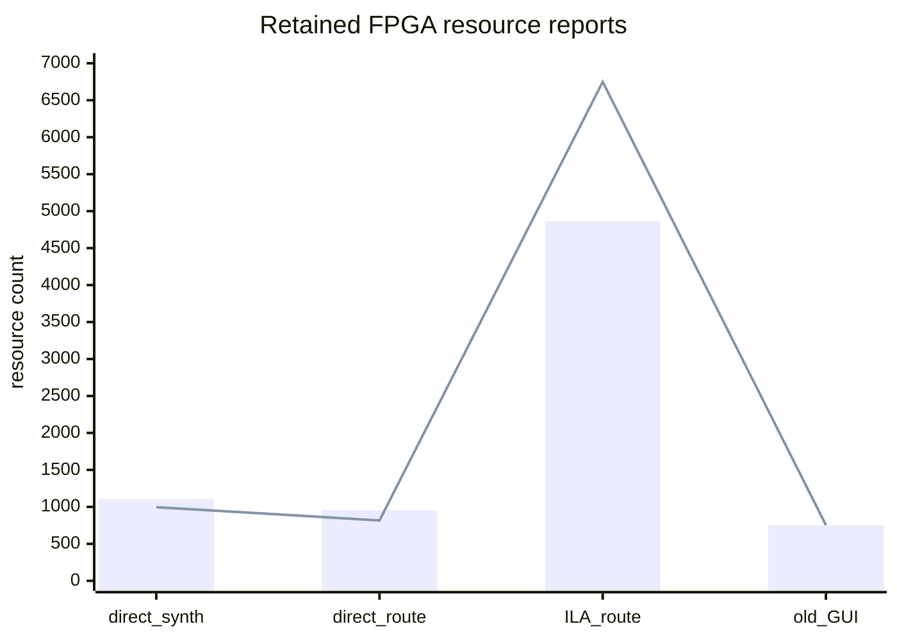
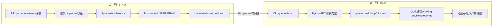

# PRG_CAM · FPGA资源、缓存容量与主机内存实验手册

> **PRG_CAM · PROJECT REVIEW & TRAINING SERIES**<br>
> 文档编号：05　版本：3.0　基线日期：2026-08-26<br>
> 适用对象：需要回答“资源花在哪里”“缓存能顶多久”“PC为什么占内存”的人<br>
> 范围：LUT/FF/BRAM/clock resource、RTL buffer bit数、Python queue、进程内存、磁盘吞吐<br>
> 当前状态：FPGA retained reports可核；当前120°+120° run缺进程内存时间线<br>
> 量纲规则：FPGA tile、逻辑word、Python对象、byte、packet和frame严禁直接相加

## OBJECTIVE

统一解释FPGA LUT/register/BRAM、RTL FIFO容量、Python queue峰值和Windows进程内存；禁止把不同设计、不同build或不同量纲的数据相加或直接对比。

## INPUTS / DEPENDENCIES / RUN IDENTITY

- Current-top direct reports：`docs/reports/ethernet_bringup/post_synth_utilization.rpt:34-83`、`docs/reports/ethernet_bringup/post_route_utilization.rpt:35-112`。
- ILA report：`build/ethernet_ila/utilization.rpt:35-112`。
- 较旧Project Flow report：`build/gui_ethernet_rebuild/utilization.rpt:35-112`。
- D3 queue参数：`prg_cam.srcs/sources_1/tx/taxi_receiver_advanced/taxi_receiver/run_receiver.ps1:11-53`。
- D3 queue/drop输出：`taxi_receiver/stream_monitor.py:322-400`。
- D3 publisher进程与envelope：`taxi_receiver/image_pipeline.py:141-281,315-348,439-472,772-792,1156-1195`。
- D3 per-camera进程接线：`taxi_receiver/camera_lane.py:136-163,257-300,472-513`。

跨build比较必须记录run ID、Git/source hash、generic、top、part、flow、report stage和生成时间。缺少任一身份时，只能标`HISTORICAL EVIDENCE ONLY`。

## PRECHECK / DRY-RUN

**[CURRENT VERIFIED] [READ-ONLY]** 只列出retained reports；缺失时不自动调用Vivado。

```powershell
$repo = 'D:\prg\prg_cam'
$reports = @(
  'docs\reports\ethernet_bringup\post_synth_utilization.rpt',
  'docs\reports\ethernet_bringup\post_route_utilization.rpt',
  'build\ethernet_ila\utilization.rpt'
)
$reportRows = @(
  foreach ($relative in $reports) {
    $path = Join-Path $repo $relative
    [pscustomobject]@{
      Path = $path
      Exists = Test-Path -LiteralPath $path -PathType Leaf
      LastWrite = if (Test-Path -LiteralPath $path) {
        (Get-Item -LiteralPath $path).LastWriteTime
      } else { $null }
    }
  }
)
$reportRows | Format-Table -AutoSize
```

这是只读preflight。任一report缺失时，不自动运行Vivado；先在manifest标记缺口。

## MAIN：资源口径

## 1. 从RTL参数计算“逻辑容量”

> **本章目标｜先计算代码声明了多少数据位，再用Vivado report说明它实际映射成什么资源。**

逻辑容量与物理BRAM tile不是一回事。逻辑容量按`深度 × 每word位宽`计算；Vivado还会受双口模式、读宽、奇偶校验、最小primitive粒度和ILA打包影响。当前关键缓存为：

| 缓存 | RTL参数/实例 | 逻辑容量 | 作用 |
|---|---|---:|---|
| 每路Line Buffer | 4 slots × 128 B | 512 B = 4096 bit | 隔离无反压Camera与包级仲裁 |
| 四路Line Buffer总计 | 4 lanes × 512 B | 2048 B = 16384 bit | cam2/3虽inactive，结构仍被综合与generic/优化共同决定 |
| Byte_Replacer双bank | 2 × 128 B | 256 B = 2048 bit | 整包后处理、稳定CRC/status |
| Camera packet FIFO | 512 × 9 bit | 4608 bit | 保存`{last,data}`，深度4包 |
| fixed diagnostic FIFO | 512 × 9 bit | 4608 bit | 只在fixed path使用；编译期选择会影响优化 |
| TAXI TX FIFO | default 4096 entries | 位宽/物理映射由Taxi axis async FIFO决定 | 跨logic/MII并吸收MAC速率差 |
| TAXI RX FIFO | default 4096 entries | 当前TX-focused仍被wrapper实例化/综合优化决定 | RX接口存在但业务未消费 |

来源分别是`Line_Buffer.v:29-79`、`Byte_Replacer.v:47-50`、`Camera_Pipeline.v:337-350`、`Camera_Ethernet_Top.sv:169-184`和`taxi_eth_mac_mii_fifo.sv:18-39`。不能把上表bit数相加后声称等于33个BRAM tile；ILA自身4096-depth、64-probe采样存储才是归档ILA build从4 tile增加到33 tile的主要成本。

若要估算某一级能缓冲多少时间，必须知道输入包率 (r_p\)（packets/s）和可用包数 (N\)：

\[
t_{buffer}=\frac{N}{r_p}.
\]

例如Camera packet FIFO有512 words，只等于4个完整128-byte packet；它不是512个packet。Line Buffer每路4 slot也只等于4行。实际总缓冲不能简单相加，因为这些级之间可能同时占用、也可能被backpressure锁住。

## 2. 从图像几何计算原始数据率

> **本章目标｜分清图像有效位、128-byte协议流量和Ethernet线速开销。**

单路640×480、每像素1 bit的有效图像量为：

\[
B_{image}=640\times480\times1=307200\ \text{bit}=38400\ \text{byte/frame}.
\]

协议每行固定128 bytes，480行则为61440 bytes/frame；其中像素只是80×480=38400 bytes。再加14-byte Ethernet header后为142×480=68160 pre-FCS bytes/frame。若帧率为 (f\)，双路仅按pre-FCS计算的数据率为：

\[
R_{preFCS}=2\times68160\times8\times f\ \text{bit/s}.
\]

线上的实际占用还包括8-byte preamble/SFD、4-byte FCS和12-byte inter-frame gap等。若按每个行帧额外24 bytes估算，双路线占用为：

\[
R_{wire}\approx2\times480\times(142+24)\times8\times f.
\]

这里的 (f\) 必须来自本次run的真实frame/时间统计，本文不发明目标fps。这个计算解释了为什么“1-bit图像很小”仍可能产生高packet rate：每80-byte像素行都要承担固定协议与Ethernet开销。

| Quantity | Meaning | Correct source | Common misuse |
|---|---|---|---|
| Slice LUTs | combinational/distributed logic | utilization report同一stage | 把synth和route当两个版本 |
| Slice Registers | sequential cells | utilization report | 与Python对象数比较 |
| Block RAM Tile | FPGA RAM资源 | utilization report | 与PC RAM字节相加 |
| FIFO depth/level | 设计容量/运行占用 | RTL parameter/ILA | 用BRAM tile反推瞬时level |
| queue peak/drop | 应用层缓冲压力 | FINAL REPORT | 当成Windows进程内存 |
| WorkingSet64 | 进程驻留内存 | `Get-Process`采样 | 当成Python heap精确值 |
| PrivateMemorySize64 | 进程私有提交 | `Get-Process`采样 | 与WorkingSet相加 |

### 当前FPGA数据

| Build/report | Stage | LUT | Registers | BRAM tiles | Evidence status |
|---|---|---:|---:|---:|---|
| Ethernet bring-up | post-synth | 1108 | 995 | 4 | VERIFIED report, 2026-08-20 |
| Ethernet bring-up | post-route | 953 | 817 | 4 | VERIFIED report, 2026-08-20 |
| ILA build | post-route | 4863 | 6749 | 33 | VERIFIED current file; source/program binding limited |
| GUI rebuild | post-route | 750 | 753 | 4 | HISTORICAL EVIDENCE ONLY, 2026-07-26 |

LUT/寄存器数量对比（BRAM因量纲不同保留在上表）：



ILA显著增加LUT/register/BRAM是4096-depth、64-probe debug core的成本，不代表功能datapath突然变大。post-synth到post-route数值变化来自优化/映射，不能描述为运行时释放内存。

### 实验A｜核对一份utilization report

| 项目 | 内容 |
|---|---|
| 目的 | 在抄数字前确认Design、Device和报告阶段 |
| 前置条件 | report真实存在；不自动触发Vivado |
| 预期输出 | report头、Slice LUTs、Registers、BRAM、DSP、BUFG、MMCM |
| PASS | 数字能逐项回到同一文件和行号 |
| 常见错误 | 把old GUI、direct route和ILA三份report当时间序列 |
| 恢复方法 | 补run/source/flow身份；身份不全时降级为historical |

```powershell
$report = Join-Path $repo 'build\ethernet_ila\utilization.rpt'
if (!(Test-Path -LiteralPath $report -PathType Leaf)) {
  throw "utilization report不存在：$report"
}
rg -n 'Design Information|Slice LUTs|Slice Registers|Block RAM Tile|DSPs|BUFGCTRL|MMCME2_ADV' -- $report
```

归档ILA report的真实值为4863 LUT（14.92%）、6749 registers（10.35%）、33 BRAM tiles（44.00%）、0 DSP、7 BUFG和1 MMCM（`build/ethernet_ila/utilization.rpt:35-40,106-121,159-161`）。这些值属于这一份ILA routed report，不能写成plain功能设计的资源。

## Cold-start时间、磁盘与数据预算

下表只给仓库中能够重新计算的观测值，不把它们升级为保证值。新开发者应在run manifest中记录开始/结束UTC、输出目录起止大小和采集时长；仓库没有定义“必须保留多少空闲空间”的阈值，因此磁盘PASS门为`待定 · 需人工确认`。

| Workload | Retained observation | Evidence status | Planning interpretation |
|---|---:|---|---|
| plain A/B Vivado build | 2 min 21 s；3,392,811 B archive | HISTORICAL VERIFIED | 同机历史量级，不是新主机SLA |
| ILA Vivado build | 5 min 21 s；7,060,865 B archive | HISTORICAL VERIFIED | 另一次为7 min 18 s；需为routing波动留余量 |
| `build/ethernet_ila` retained tree | 187,806,602 B | CURRENT OBSERVED | 包含历史产物，不能当单次build增量 |
| dual-camera CRC capture | 约22 s；442,182,257 B | CURRENT VERIFIED RUN | 短时双路采集已是数百MB量级 |
| historical one-camera 60 s | 60.444 s；761,689,718 B | HISTORICAL VERIFIED | 460,063 valid packets、957 PGM、0 drops |
| intrinsic training dataset | 约2 h 00 min 34 s；4,858,694,394 B | HISTORICAL OBSERVED | 只用于磁盘/时间量级，不代表必要采样时长 |
| intrinsic holdout dataset | 约50 min 52 s；3,337,461,195 B | HISTORICAL OBSERVED | 必须与training保持目录隔离 |
| stereo training dataset | 约2 min 30 s；3,043,178,275 B | HISTORICAL OBSERVED | 高吞吐会快速消耗磁盘 |

审计主机在2026-08-24观测D盘可用约76.62 GiB；它不是目标机最低要求。若预估输出无法放入唯一的新run目录，必须在采集前停止并向所有者确认保留/迁移策略，不能删除旧attempt腾空间。

## 主机内存采样架构

### Host Publisher Isolation改变了内存核算边界

`-SplitByCamera on -PublishImages process`不是“一个Python进程多两条线程”。`CameraLanePool`只在某个可信camera首次到达时创建对应lane，而每个已创建lane的`CameraImagePipeline`都会用Windows `spawn`创建一个`taxi-image-publisher`子进程（`camera_lane.py:472-513`，`image_pipeline.py:448-472`）。因此双路都实际路由时，至少要核算receiver父进程和两条publisher子进程；操作系统还可能显示Python multiprocessing辅助进程，必须按父子关系采样，不能靠进程名猜“第一个python就是receiver”。

IPC队列中的frame仍是1-bit packed数据，而不是已经展开的640×480图。默认480行时，`rows_blob = 480 × 80 = 38,400 bytes`，`present_rows = 480 bytes`；仅这两个字段每项至少38,880 bytes。默认每lane 256项时，下限为`38,880 × 256 = 9,953,280 bytes ≈ 9.49 MiB/lane`，双lane约18.98 MiB。这个数**不是实际RAM上限**：还没有包括pickle、`missing_rows`、对象头、`mp.Queue` feeder/pipe和allocator；子进程处理单帧时还会重建row字典并生成至少307,200-byte的灰度pixels和同量级PGM/RAW内容（`image_pipeline.py:141-238,820-953`）。因此不能把`PublisherQueueDepth × 307,200`当队列大小，也不能只量父进程。

Host Publisher Isolation把CPU位展开和磁盘写入移出lane线程，却没有创造无限缓冲。`mp.Queue.put()`在队列满时阻塞，并累计`publisher blocked`；阻塞继续增长时，压力仍可反向传到dispatcher、lane、capture queue和Npcap（`image_pipeline.py:775-792`）。内存增长、blocked增长和drop增长必须放在同一时间轴解释：只有内存涨而队列/产物不推进，才像泄漏；队列暂时积压同时blocked增加，首先像磁盘/子进程吞吐不足。

接收编排器应保存准确的receiver根进程ID，再由独立observer按ParentProcessId递归写CSV；不要使用模糊的`Get-Process python | Select -First 1`，也不要只量根PID而漏掉publisher。

**[FUTURE] [MUTATES FILESYSTEM]** 以下是待实现observer骨架，会新建CSV；不得把它描述成仓库现有入口，且输出已存在时必须拒绝覆盖。

```powershell
param(
  [Parameter(Mandatory)] [int]$TargetProcessId,
  [Parameter(Mandatory)] [string]$OutputCsv,
  [int]$IntervalSeconds = 2
)

if (Test-Path -LiteralPath $OutputCsv) {
  throw "内存CSV已存在，禁止覆盖：$OutputCsv"
}

while ($true) {
  $rootProcess = Get-Process `
    -Id $TargetProcessId `
    -ErrorAction SilentlyContinue
  if ($null -eq $rootProcess) { break }

  $processTable = @(Get-CimInstance Win32_Process)
  $familyIds = [System.Collections.Generic.HashSet[int]]::new()
  [void]$familyIds.Add($TargetProcessId)
  $added = $true
  while ($added) {
    $added = $false
    foreach ($entry in $processTable) {
      if (
        $familyIds.Contains([int]$entry.ParentProcessId) -and
        -not $familyIds.Contains([int]$entry.ProcessId)
      ) {
        [void]$familyIds.Add([int]$entry.ProcessId)
        $added = $true
      }
    }
  }

  $sampleRows = @(
    foreach ($processIdValue in $familyIds) {
      $process = Get-Process `
        -Id $processIdValue `
        -ErrorAction SilentlyContinue
      if ($null -ne $process) {
        [pscustomobject]@{
          timestamp_utc = [DateTime]::UtcNow.ToString('o')
          root_process_id = $TargetProcessId
          process_id = $process.Id
          role = if ($process.Id -eq $TargetProcessId) {
            'receiver_root'
          } else {
            'receiver_descendant'
          }
          cpu_seconds = $process.CPU
          working_set_bytes = $process.WorkingSet64
          private_memory_bytes = $process.PrivateMemorySize64
          handle_count = $process.Handles
        }
      }
    }
  )
  if ($sampleRows.Count -gt 0) {
    $sampleRows | Export-Csv `
      -LiteralPath $OutputCsv `
      -NoTypeInformation `
      -Append
  }
  Start-Sleep -Seconds $IntervalSeconds
}
```

此架构是未来脚本模板；当前仓库没有与120°+120°run绑定的父子进程内存时间线，状态为`REPORT LIMITATION`，也没有既定PASS阈值。`receiver_descendant`只是进程树身份，不应在没有命令行/运行日志佐证时全部强称为publisher；真正的publisher数量还要和FINAL REPORT中每路`publish mode: process`对照。

### Python queue容量为什么不能直接换算成RAM

若capture queue只保存一份142-byte Ethernet frame，`65536×142≈8.9 MiB`只是payload理论下限；实际项还可能包含Scapy packet、Python bytes、tuple、timestamp和allocator开销。publisher queue则保存至少38,880-byte的packed envelope，子进程处理时才展开成640×480的uint8图像。两种queue的item类型不同，不能共用一个“每项大小”。准确方法是同时记录各层capacity/blocked/drop和整棵receiver进程树的working set/private memory，而不是用queue depth乘一个猜测对象大小。

### 实验B｜启动独立内存观察器时要记录什么

| 项目 | 内容 |
|---|---|
| 目的 | 把receiver吞吐压力与Windows进程内存增长放在同一时间轴 |
| 前置条件 | receiver PID由启动器准确保存；输出CSV是新路径 |
| 观察点 | UTC、root PID、全部descendant PID、working set、private memory、CPU、handle count；同时保留queue peak/drop与publisher blocked/failures/stats ok |
| PASS | observer不影响receiver；进程结束后CSV非空且manifest写入路径/hash |
| FAIL | PID错误、CSV覆盖、observer异常退出 |
| 恢复方法 | 标`memory_observation=failed`但不杀receiver；新建observer retry目录 |

当前项目没有冻结“working set不得超过多少”的门，因此不能仅凭某个MiB数字FAIL。可判定的异常是：随时间单调无界增长、队列已经清空但内存/handle持续增长、或内存增长与publisher/CSV错误同步；阈值仍需在相同workload的基线run上建立。

## Queue与吞吐验证

接收命令中的`QueueDepth`、`FrameOutputQueueDepth`、`PublisherQueueDepth`、`CsvQueueDepth`只是容量配置。应同时读取FINAL REPORT中的peak和drop：

| Signal | Expected for healthy run | Interpretation if abnormal |
|---|---|---|
| Capture queue drops | 0 | Npcap producer超过consumer或CPU停顿 |
| Capture queue peak | 明显低于capacity | 长期接近capacity表示吞吐裕量不足 |
| Lane queue drops | 0 | per-camera worker/publisher阻塞 |
| Publisher failures | 0 | 子进程中的recovery或PGM/RAW/JSON写入失败；当前不保证自动映射为exit 7 |
| Publisher stats ok | 1 per active lane | 0表示正常关闭时未收到子进程最终统计，计数不可作为PASS证据 |
| Publisher blocked | 不应持续成为运行时间的大比例；无冻结数值门 | 有界IPC已满，磁盘/子进程成为上限，反压可继续向capture传播 |
| CSV drops | 0 for audit-grade run | `drop`策略可保图像吞吐但破坏逐行完整审计 |
| FPGA packet FIFO almost_full/drop | 0事件/0增量 | D1/D2 backpressure瓶颈 |

## OBSERVED vs EXPECTED

| Probe | Expected | Current observed | Interpretation |
|---|---|---|---|
| Functional BRAM | 有限且报告可定位 | post-route 4 tiles | PASS for retained build |
| ILA overhead | 高于plain | 33 vs 4 BRAM tiles | Expected debug cost |
| Post-route timing/resource identity | 同一top/flow/run | direct reports完整 | 可用于当前架构描述 |
| Host memory timeline | run-bound CSV | 无 | REPORT LIMITATION |
| Publisher process tree | 父PID与每个active lane子进程均被采样 | 当前run无父子PID时间线 | REPORT LIMITATION；只量父PID无效 |
| Publisher IPC health | failures=0、stats ok=1、blocked可解释 | 当前run未冻结逐lane六项摘录 | UNVERIFIED，不由receiver exit 0替代 |
| Current CRC run queue/drop | 0 | CRC audit错误0；未提供完整内存采样 | 只能支持完整性，不支持RAM趋势 |

## VALIDATE / EXPORT / FAILURE HANDLING / PASS-FAIL / NEXT ACTION

- report必须先核对Design/Device/Design State头，再提取数字。
- 同一表格不同run必须分别给hash和日期；不同设计名禁止合并。
- 导出`resource_summary.csv`时保留原report路径和行号，不能只留手抄数字。
- 内存observer异常不应终止receiver，但必须在manifest标`memory_observation=failed`。
- 当前没有新build或采集授权；下一步只把既有资源数字和缺失项写入报告。

## Host四代演进的CPU预算与资源代价

历史技术文档记录的40,000包本机基准如下，状态为`HISTORICAL DOCUMENTED`，不是不同主机可直接复用的常数：

| Host阶段 | V3 μs/packet | V4 μs/packet | 变化来源 |
|---|---:|---:|---|
| capture/Scapy对象路径 | 28.8 | 0.5 | `pcap_next_ex`结果直接做bytes切片 |
| parse + CRC16 | 19.5 | 9.3 | `binascii.crc_hqx`的C实现 |
| reassembler | 2.8 | 2.8 | 未改 |
| monitor | 0.5 | 0.5 | 未改 |
| Ethernet validate | 0.4 | 0.4 | 未改 |
| 合计 | 52.0 | 13.5 | 历史3.85×下降 |

该表解释CPU/GIL预算，不能与FPGA WNS混用。S1本身还增加一次队列和线程交接，历史离线replay吞吐从11,388降到10,998 pkt/s；它换取的是每camera隔离和归账。S2才把恢复、PGM编码和写盘迁入每lane子进程，历史记录consumer rate从11,033升至14,214 pkt/s，并把lane `submit blocked`从17.8 s+57.2 s降到0。

资源代价必须同时保留：双active lane至少有receiver父进程、两个publisher子进程、两条lane queue、两个frame dispatcher queue、两个CSV queue和两个IPC queue。优化不是“省内存”，而是用有界RAM与额外进程换取突发吸收和故障隔离。任何Discussion图都应把CPU吞吐收益与RAM/process数量放在同一表中。

## 3. 从声明容量到运行占用的证据链

> **审计结论｜“参数写了多少”“综合映射多少”“运行时占了多少”是三份不同证据。只有把三者用同一run identity连接起来，才能回答资源是否成为瓶颈。**



| 证据层 | 能回答 | 不能回答 | 必须保存 |
|---|---|---|---|
| RTL声明 | 最大word/slot和位宽 | 最终BRAM tile、瞬时占用 | source hash、parameter/generic |
| post-route utilization | 实际映射LUT/FF/BRAM/DSP/clock资源 | 运行时FIFO level | report header/path/hash |
| FPGA ILA/counter | 指定窗口的level、stall、drop | Host queue对象开销 | matched bit/LTX、trigger、CSV |
| CLI配置 | 有界队列上限 | 实际RAM字节 | 完整命令/manifest |
| FINAL REPORT | peak/drop/blocked/失败 | OS进程私有内存 | receiver log |
| 进程树采样 | root及descendant内存/CPU/handle趋势 | Python具体对象归因 | PID树、UTC、CSV |
| 磁盘统计 | 写入速率和总量 | packet在何层丢失 | capture root、起止大小/时间 |

## 4. 缓冲时间预算与反压定位

对任意队列，若输入速率为`r_in`、输出速率为`r_out`，且`r_in > r_out`，可用空闲项`N_free`被填满的理想时间为：

\[
t_{fill}=\frac{N_{free}}{r_{in}-r_{out}}.
\]

这比`N/r_in`更适合分析短时拥塞，但仍是假设速率在窗口内近似稳定的估算。项目尚未冻结统一采样窗口，实际run必须同时记录producer/consumer rate、queue peak、drop和publisher blocked，不能只用一个平均packet rate代替突发。

| 首个升高量 | 后续组合 | 更可能的瓶颈 | 下一动作 |
|---|---|---|---|
| FPGA Byte FIFO level | Replacer bank满、grant不release、Line Buffer drop | MAC/RMII出口反压 | Topic 03 ILA看AXIS/MII/RMII |
| Npcap `ps_drop` | Python capture drop仍0 | 内核缓冲/取包速度 | 核对V4 capture路径和NIC统计 |
| capture queue peak/drop | lane peak较低 | shared validate/parse/CRC预算 | CPU profile和packet service time |
| 单路lane peak/drop | 另一lane健康 | 该camera重组/output压力 | 单路dispatcher/publisher统计 |
| publisher blocked | queue/drop随后升高 | 子进程/磁盘吞吐 | 进程CPU、private bytes、磁盘延迟 |
| CSV dropped | 图像仍正常 | audit writer跟不上且策略为drop | 不能把CSV作完整packet证据 |
| Working Set持续升高 | queue均已回落、handle也升 | 可能泄漏/资源未释放 | 长时同workload复验、对象/handle分析 |

## 5. 内存观察器的正式接口建议

本文前面的PowerShell是`FUTURE`骨架。若落地为`scripts_ps/observe_receiver_process_tree.ps1`，接口至少应为：

```powershell
param(
  [Parameter(Mandatory)] [int]$TargetProcessId,
  [Parameter(Mandatory)] [string]$OutputRoot,
  [string]$RunId,
  [ValidateRange(1,3600)] [int]$IntervalSeconds = 2,
  [switch]$PreflightOnly
)
```

PRECHECK验证PID存在、输出根不存在或为空、CSV/manifest目标不会覆盖；`-PreflightOnly`只打印进程树和路径。MAIN按UTC采样root/descendant的PID、ParentPID、命令行摘要、CPU、WorkingSet、PrivateMemory、handle；VALIDATE要求至少两批样本且时间递增；EXPORT写CSV、observer summary JSON和脚本SHA；observer失败只标记memory evidence失败，不擅自终止receiver。该文件当前不存在，以上是后续生成脚本的合同，不是可直接执行命令。

统一summary建议至少包含：

```json
{
  "run_id": "<actual run id>",
  "receiver_root_pid": 0,
  "sample_count": 0,
  "start_utc": "<actual timestamp>",
  "end_utc": "<actual timestamp>",
  "peak_family_working_set_bytes": 0,
  "peak_family_private_memory_bytes": 0,
  "observed_descendant_count_max": 0,
  "status": "PASS|PARTIAL|FAIL"
}
```

示例中的0和尖括号都是schema占位，不是当前实测值。PASS只表示采样合同完整，不表示内存低；项目尚无冻结的内存上限，趋势解释必须与queue/drop/blocked同图呈现。

## 6. FPGA与Host跨版本比较规则

| 比较目标 | 固定变量 | 自变量 | 推荐输出 |
|---|---|---|---|
| plain vs ILA | source/generic/XDC/flow尽量相同 | debug core | LUT/FF/BRAM/WNS增量表 |
| post-synth vs post-route | 同一run/netlist意图 | implementation优化 | 资源与slack阶段表，不称版本迭代 |
| Host thread vs process | 同一PCAP/图片策略/queue/磁盘 | publisher mode | drop、rate、blocked、CPU、内存、逐字节等价 |
| 单cam vs双cam | 同协议/单路速率/发布策略 | active camera count | 总/每lane rate与资源 |
| 历史V3 vs V4 | 同一40k packet基准才可比较 | capture/CRC热路径 | μs/packet分解 |

Discussion用图应至少有两个面板：A显示capture/Npcap/lane的loss或rate，B显示publisher blocked、进程数和峰值family memory。只画“改后丢包低”会隐藏其以额外进程、有界IPC和RAM换取吞吐隔离的工程代价。

## 7. 文档级验收摘要

- 能从RTL参数计算逻辑bit/packet容量，再用同run post-route report确认实际资源映射。
- 能区分plain功能资源与ILA调试开销，不把不同Design State或不同top相减。
- 能按父进程和所有descendant统计Host内存，并说明Publisher Isolation为何需要多进程口径。
- 能把queue peak/drop、publisher blocked、进程内存和磁盘写入放在同一时间轴。
- 能设计不覆盖历史证据、支持preflight/dry-run和机器可读summary的内存observer，但不把未实现脚本写成CURRENT。
