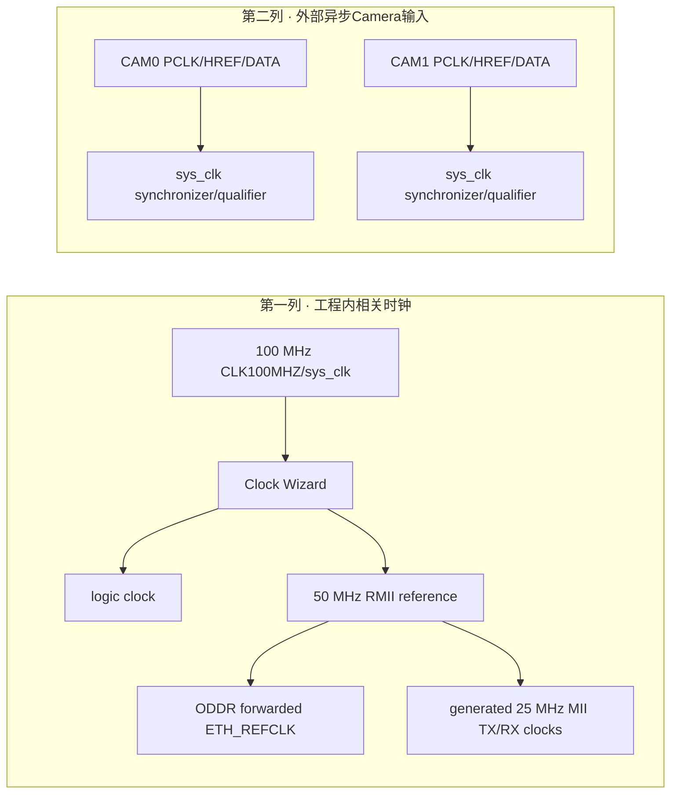
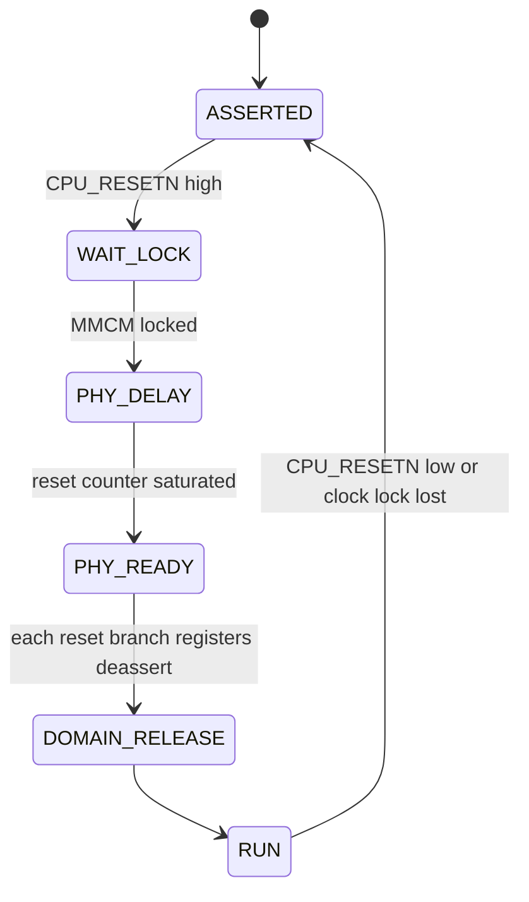
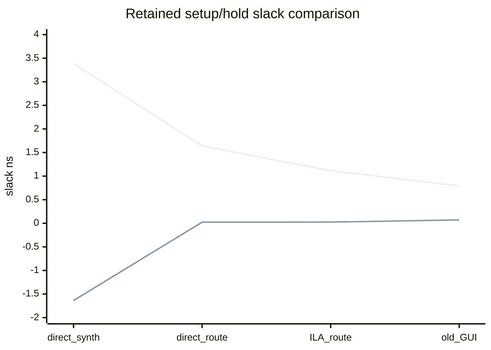
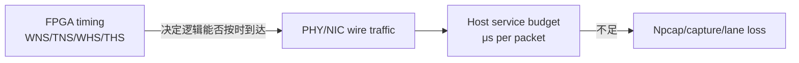
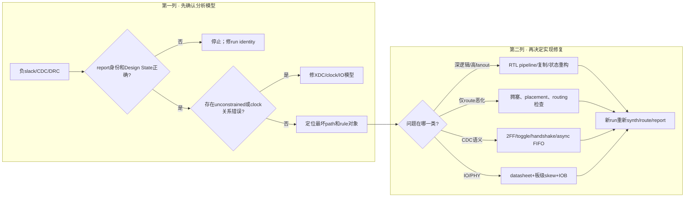

# PRG_CAM · 时序、约束、CDC与Reset分析手册

> **PRG_CAM · PROJECT REVIEW & TRAINING SERIES**<br>
> 文档编号：06　版本：3.0　基线日期：2026-08-26<br>
> 适用对象：需要读懂WNS/TNS/WHS/THS、CDC、IO delay和reset warning的人<br>
> 范围：100/50/25 MHz时钟、Camera异步输入、Taxi reset、RMII外部接口、report归因<br>
> 当前状态：retained direct和ILA post-route timing通过；Camera PCLK外部时序未形成完整run-bound sign-off<br>
> 结论边界：STA只分析模型中被正确约束的路径；漏约束不能靠正WNS被发现

## OBJECTIVE

说明当前clock/reset/CDC约束、WNS/TNS判读和问题归因方法；把“Vivado约束内收敛”与“相机异步接口物理裕量已证明”严格分开。

## INPUTS / DEPENDENCIES / RUN IDENTITY

- XDC：`prg_cam.srcs/constrs_1/new/nexys_a7_ethernet.xdc:4-11,41-45,65-103`。
- Capture同步：`prg_cam.srcs/sources_1/new/Camera_Capture.v:59-74`。
- Reset pin数量门：`scripts/implement_ethernet_bringup.tcl:15-31`。
- Direct timing：`docs/reports/ethernet_bringup/post_synth_timing_summary.rpt:168-177`、`docs/reports/ethernet_bringup/post_route_timing_summary.rpt:167-176`。
- ILA timing：`build/ethernet_ila/timing_summary.rpt:164-171`。

每次分析必须先记录report的Design、Device、Design State、生成时间和build identity；`AXI4_Compiler`或其他top的报告不得替代`Camera_Ethernet_Top`。

## PRECHECK / DRY-RUN

**[CURRENT VERIFIED] [READ-ONLY]** 只校验XDC与report路径；不会启动综合、实现或硬件操作。

```powershell
$repo = 'D:\prg\prg_cam'
$timing = Join-Path $repo `
  'docs\reports\ethernet_bringup\post_route_timing_summary.rpt'
$cdc = Join-Path $repo `
  'docs\reports\ethernet_bringup\post_route_cdc.rpt'
$drc = Join-Path $repo `
  'docs\reports\ethernet_bringup\post_route_drc.rpt'

$checks = @(
  foreach ($path in @($timing, $cdc, $drc)) {
    [pscustomobject]@{
      Path = $path
      Exists = Test-Path -LiteralPath $path -PathType Leaf
      SHA256 = if (Test-Path -LiteralPath $path) {
        (Get-FileHash -Algorithm SHA256 -LiteralPath $path).Hash
      } else { $null }
    }
  }
)
$checks | Format-Table -AutoSize
```

缺report时只记录限制；不自动重跑implementation。

## MAIN：Clock与约束模型

## 1. 四个slack数字分别代表什么

> **本章目标｜让读者看到report数字时知道它回答的是哪种时序问题。**

对setup检查，数据必须在下一个采样边沿之前到达。简化关系为：

\[
S_{setup}=T_{required}-T_{arrival}.
\]

`WNS`是所有setup endpoint中最小的(S_{setup}\)；小于0表示至少一条路径失败。`TNS`是所有负setup slack之和；WNS告诉最坏一条有多差，TNS反映失败面有多大。对hold检查，数据在采样边沿后必须保持足够久，`WHS`是最坏hold slack，`THS`是所有负hold slack之和。只有WNS≥0、TNS=0、WHS≥0、THS=0，才能说该report中被分析的setup/hold路径通过。

正slack不是“速度提高了多少”，而是当前PVT模型、约束与实现下的余量。WHS=0.024 ns只剩24 ps，虽然数学上通过，但它强调报告身份和约束准确性很重要；不能用另一次build的0.071 ns替换。post-synth hold为负、route后转正通常是implementation插入延迟/改变布线后的正常收敛，不能因此把post-synth报告删除。

## 2. 时钟树和generated clock

> **本章目标｜明确每个频率从哪里产生，哪些是同步关系，哪些是异步输入。**

Cold-start时先区分“约束定义存在”和“当前实现满足约束”。前者可由XDC/source扫描证明；后者必须来自与当前run identity绑定的post-route timing/DRC/clock-interaction/CDC报告。只有一个旧WNS数字时，最多标为历史证据，不能推导当前bit满足时序。



- `CLK100MHZ`由10 ns `create_clock`约束。
- ETH forwarded clock由ODDR产生并使用`create_generated_clock`；TXD/TXEN具有4.0 ns setup和1.5 ns hold外部delay模型（`prg_cam.srcs/constrs_1/new/nexys_a7_ethernet.xdc:65-79`）。
- MII TX/RX clock由RMII逻辑寄存器Q端定义divide-by-2 generated clocks（`prg_cam.srcs/constrs_1/new/nexys_a7_ethernet.xdc:81-86`）。
- CAM0/CAM1 PCLK目前没有`create_clock`，XDC明确要求实测周期后才能添加（`prg_cam.srcs/constrs_1/new/nexys_a7_ethernet.xdc:8-11,41-45`）。当前实现把PCLK/HREF同步到logic域，但multi-bit data的相干性仍依赖物理关系，不能只凭单bit 2FF宣称闭合。

### 2.1 为什么Camera DATA的2FF不能自动保证总线原子性

8个data bit分别经过寄存器，只能降低每一位亚稳态向后传播的概率；它不保证所有位在同一源PCLK字节上被采到。如果某些位的线路延迟或源端变化时刻不同，目标域可能得到前后两个字节的混合。当前设计通过PCLK资格化、data_on_pclk_rise等结构和实际CRC/图像证据降低风险，但缺少源PCLK周期、数据有效窗口和input delay模型，所以仍需把“实测工作”与“完整外部时序签核”分开。

### 2.2 RMII output delay的物理含义

`set_output_delay`不是给FPGA内部添加延迟，而是告诉STA：相对PHY采样clock，外部器件在板外需要多少setup/hold窗口。当前XDC的4.0 ns setup和1.5 ns hold必须最终与LAN8720A datasheet、板级clock/data skew和ODDR相位核对；只看到命令存在说明constraint definition VERIFIED，不说明物理数值已经完成datasheet sign-off。

## CDC与Reset检查规则

| Crossing | Classification | Accepted implementation/evidence | Failure condition |
|---|---|---|---|
| single-bit level | level | 2FF或更深同步器 | 直接跨域组合使用 |
| pulse | event | pulse synchronizer/握手/toggle | 目标域可能漏窄pulse |
| multi-bit bus | bus | handshake、稳定窗口或async FIFO | 每bit独立2FF却声明总线原子性 |
| stream | data+control | async FIFO/ready-valid CDC | data/control来自不同步延迟 |
| reset assert | async event | 异步assert允许 | 普通数据false path掩盖 |
| reset release | per-domain level | 同步release | 直接异步deassert |

Taxi两组reset synchronizer均为异步assert、四周期同步release。XDC只切两组PRE pins；implementation后必须恰好找到4+4=8个pin，否则脚本报错。禁止把宽泛false path加到普通AXIS/MII路径。

### Reset ASM



异步assert的目标是故障来临时立即进入安全态；同步release的目标是每个clock domain只在有效边沿离开reset，避免不同寄存器半拍释放。DRC中的RAMB async control warning需要逐实例判断：如果异步reset寄存器直接控制BRAM地址/enable/write，Vivado明确提醒memory内容/读值可能损坏且默认STA不分析（归档ILA `drc.rpt:136-223`）。这类warning不能简单以“没有Error”清零。

## 3. 四个可执行分析实验

> **本章目标｜把report生成、数值读取、CDC检查和问题归因分成可重复任务。**

### 实验A｜读取post-route timing summary

| 项目 | 内容 |
|---|---|
| 目的 | 核对report身份并读取四个slack与unconstrained table |
| 前置条件 | report来自本run的routed design |
| 命令 | `rg -n 'Design Timing Summary|WNS\(ns\)|All user specified|Unconstrained Path Table' -- $timing` |
| PASS | WNS/WHS非负、TNS/THS为0，且unconstrained项逐条解释 |
| 常见错误 | 只grep“constraints are met”而没核Design/Device |
| 恢复方法 | 回到run manifest和report header；身份不符立即停止 |

### 实验B｜重新生成current routed reports

| 项目 | 内容 |
|---|---|
| 目的 | 在同一routed state生成timing/CDC/DRC/util/route报告 |
| 前置条件 | 已授权新build；唯一输出目录；Topic 04 precheck通过 |
| 完整命令 | `& $vivado -mode batch -nolog -nojournal -source .\scripts\implement_ethernet_bringup.tcl` |
| PASS | Tcl硬门通过，所有报告非空且写入本run manifest |
| 常见错误 | 输出固定目录被旧report污染；把post-synth当post-route |
| 恢复方法 | 保留失败run，创建新run wrapper；不删除原证据 |

### 实验C｜CDC与reset pin门

| 项目 | 内容 |
|---|---|
| 目的 | 确认Taxi仅切预期的两组四级reset PRE，并分类其他CDC |
| 观察点 | 控制台两组count各4，总计8；`post_route_cdc.rpt`逐项severity |
| PASS | expected pin count=8；无未解释unsafe crossing |
| 常见错误 | 为清报告把整个clock group false path，掩盖真实数据流 |
| 恢复方法 | 根据level/pulse/bus/stream选择2FF、toggle、handshake或async FIFO |

### 实验D｜Camera PCLK现场补证

| 项目 | 内容 |
|---|---|
| 目的 | 补充STA当前不能证明的源端period、duty、data window |
| 前置条件 | matched bit/LTX、逻辑分析仪或示波器、记录camera/MCU firmware SHA |
| 观察点 | raw PCLK period/duty、HREF边界、D[7:0]相对PCLK稳定窗口、ILA pclk_pulse/count |
| PASS | 物理测量与RTL每行128字节/CRC结果一致；约束值来源可追溯 |
| 常见错误 | 用ILA 100 MHz采样点代替示波器级源边沿相位 |
| 恢复方法 | 不先发明input delay；保存波形后由硬件负责人确认约束模型 |

## VALIDATE：Timing/DRC/CDC分析

### 当前数字

| Report | WNS ns | TNS ns | WHS ns | THS ns | Result |
|---|---:|---:|---:|---:|---|
| direct post-synth | +3.388 | 0 | -1.637 | -40.242 | hold未收敛，不能作为最终签核 |
| direct post-route | +1.640 | 0 | +0.024 | 0 | timing met |
| ILA post-route | +1.115 | 0 | +0.025 | 0 | timing met for retained ILA file |
| older GUI post-route | +0.793 | 0 | +0.071 | 0 | historical, not current direct run |



图中第一条线是WNS，第二条线是WHS；四点来自不同stage/build，并非时间序列。

post-synth hold失败、post-route通过说明placement/routing和hold修复改变了最短路径；最终签核看post-route，但应保留post-synth解释收敛过程。

### 问题归因

| Report signature | First classification | Check next |
|---|---|---|
| unconstrained endpoints/clock missing | constraint | `check_timing`、clock定义、I/O delay |
| setup在synth和route均失败，集中同一逻辑锥 | RTL/architecture | pipeline depth、fanout、ready chain |
| synth有裕量但route setup失败 | placement/routing/congestion | utilization、high fanout、pblock/route status |
| hold仅post-synth负、route转正 | normal implementation convergence | 保留两阶段报告，不改RTL |
| hold post-route仍负 | constraint/routing | generated clock关系、min delay、跨域误约束 |
| CDC unsafe multi-bit | RTL CDC | async FIFO/handshake/stable-window协议 |
| DRC NSTD/UCIO | XDC/port | pin与IOSTANDARD；禁止忽略 |
| DRC combinational loop/multiple driver | RTL/netlist | source连接和generate选择 |

归档ILA DRC不是clean report。其汇总包括CFGBVS-1、CHECK-3、PDCN-1569、PLIO-6、REQP-1617、REQP-1839、REQP-1840和RTSTAT-10 warning（`build/ethernet_ila/drc.rpt:31-38`）。其中REQP-1839/1840明确指向异步reset寄存器控制RAMB端口，属于RTL/reset结构风险；CFGBVS/CONFIG_VOLTAGE属于器件配置property；PLIO/IOB与外部IO实现相关。交付时应逐类写“已接受原因/需修复/需板级确认”，不能只报告warning总数。

| DRC family | 当前含义 | 归因方向 | 文档允许的状态 |
|---|---|---|---|
| CFGBVS-1 | 配置电压属性缺失 | project/device property | WARNING，需工程配置确认 |
| PDCN-1569 | LUT equation term检查 | netlist/implementation | 逐实例复核 |
| PLIO-6 / REQP-1617 | IO placement/IOB register | XDC/RTL IO结构 | 与RMII外部时序一起复核 |
| REQP-1839/1840 | RAMB控制来自异步reset寄存器 | reset/RTL | 不能用时序PASS覆盖 |
| RTSTAT-10 | 无可布线负载 | 被优化或debug网 | 查net用途，不能猜 |

Clock interaction report必须在current routed design上生成。仓库根`clock_interaction_report.txt`设计名为`AXI4_Compiler`，不可用于当前top。Power report同样缺失，状态为`REPORT LIMITATION`。

## OBSERVED vs EXPECTED

| Probe | Expected | Current observed | Interpretation |
|---|---|---|---|
| sys_clk constraint | 10 ns | XDC明确存在 | VERIFIED |
| RMII output timing | generated clock+I/O delay | XDC存在 | VERIFIED definition |
| Taxi reset cuts | exactly 8 PRE pins | implementation脚本硬门 | 可复现检查 |
| Current post-route timing | WNS/WHS>=0 | +1.640/+0.024 ns | PASS |
| Camera PCLK physical margin | run-bound测量与约束 | 无 | REPORT LIMITATION |
| Current-top clock interaction | current report | 无 | REPORT LIMITATION |

## EXPORT / FAILURE HANDLING / PASS-FAIL / NEXT ACTION

每个timing run归档synth/route timing、CDC、DRC、methodology、route status、exceptions、source/artifact hash。目标设计的 post-route WNS、TNS、WHS、THS 均非负，且不存在未解释的 unconstrained path/阻断性 DRC，才可给“已约束数字域 PASS”；任一条件不满足为 FAIL。遇到负slack时先按上表分类，不能先加false path；CDC报告通过也不能替代PCLK电气测量。当前归档只声明“已约束域的post-route timing通过”，不声明相机输入物理裕量完整闭合。

## Host服务时间不是FPGA timing slack

历史文档把双路约15,000 pkt/s换算为约66.7 μs/packet的软件服务预算；V3路径估算52.0 μs，只剩约1.28×余量，GIL调度和队列抖动足以令Npcap溢出。V4估算13.5 μs，历史余量约4.9×。这些数字属于Host wall-clock profiling，不是Vivado约束、WNS/TNS或CDC结果。



因此“Host `ps_drop`下降”不能推出FPGA时序改善；“Vivado WNS为正”也不能推出Python在双路速率下不丢包。两套时间证据只能在同一run时间轴上相关联，不能互相替代。

## 4. 约束源码、物理含义与验证对象

> **审计结论｜当前XDC对100 MHz主时钟、RMII转发时钟、MII派生时钟和Taxi reset PRE有明确约束；Camera PCLK故意保持未建时钟状态，等待实测。正WNS只覆盖前一组已建模对象。**

| XDC对象 | 当前定义 | 物理/协议含义 | 验证方式 | 证据限制 |
|---|---|---|---|---|
| `CLK100MHZ` | `create_clock -period 10.00` | 板载100 MHz源 | clock summary、timing paths | 不证明振荡器实测偏差 |
| `ETH_REFCLK` | ODDR Q上的generated clock | FPGA向LAN8720A转发50 MHz | generated clock tree、pin波形 | 需datasheet/板级skew复核 |
| `ETH_TXD/TXEN` | max 4.0 ns、min -1.5 ns output delay | PHY相对REFCLK的setup/hold模型 | output timing paths | 数值来源是XDC注释，不是新run实测 |
| `mii_tx_clk/rx_clk` | RMII寄存器Q divide-by-2 | TAXI消费的25 MHz MII clock | clock interaction/timing | exact synthesized pin名可能随结构变化 |
| Taxi reset PRE | 两组窄`set_false_path` | 只切async assert端 | pin数量必须4+4 | 不得扩到AXIS/MII普通数据 |
| CAM0/1 PCLK | 当前无`create_clock` | MCU/Camera异步字节节拍 | 示波器/逻辑分析仪+ILA资格化 | 未完成外部setup/hold sign-off |

XDC真实片段（`nexys_a7_ethernet.xdc:71-79`）为：

```tcl
create_generated_clock -name eth_refclk_out \
    -source [get_pins {u_eth_refclk_oddr/C}] \
    -divide_by 1 \
    [get_ports {ETH_REFCLK}]

set_output_delay -clock [get_clocks {eth_refclk_out}] -max  4.000 \
    [get_ports {ETH_TXEN ETH_TXD[*]}]
set_output_delay -clock [get_clocks {eth_refclk_out}] -min -1.500 \
    [get_ports {ETH_TXEN ETH_TXD[*]}]
```

`-min -1.500`不是“允许负延迟”，而是按Vivado output-delay符号约定表达外部接收器的正hold要求。修改这个值必须引用PHY datasheet、REFCLK方向/相位和板级skew；不能为了改善WHS而调小。

## 5. Reset实现：立即assert、逐域同步release

顶层先等待MMCM lock，再用20-bit计数器延迟PHY约10.5 ms，随后把同一条件注册成source/camera/frame/bridge/Taxi各自reset分支（`Camera_Ethernet_Top.sv:67-108`）。这减少一个巨型高扇出组合reset树，但不改变释放条件：

```systemverilog
always_ff @(posedge logic_clk) begin
    if (!CPU_RESETN || !clock_locked) begin
        phy_reset_count <= 20'd0;
        phy_ready       <= 1'b0;
    end else if (!phy_ready) begin
        if (&phy_reset_count) begin
            phy_ready <= 1'b1;
        end else begin
            phy_reset_count <= phy_reset_count + 1'b1;
        end
    end
end

always_ff @(posedge logic_clk) begin
    source_rst_reg     <= ~phy_ready;
    camera_rst_reg     <= ~phy_ready;
    frame_rst_reg      <= ~phy_ready;
    bridge_rst_reg     <= ~phy_ready;
    taxi_logic_rst_reg <= ~phy_ready;
    taxi_mac_rst_reg   <= ~phy_ready;
end
```

RMII wrapper再把logic域reset转换为50 MHz域的async assert、四拍同步release（`Ethernet_Mii_Rmii_Bridge.sv:31-45`）：

```systemverilog
(* ASYNC_REG = "TRUE" *) logic [3:0] rmii_reset_sync = 4'hf;
always_ff @(posedge rmii_ref_clk or posedge rst) begin
    if (rst)
        rmii_reset_sync <= 4'hf;
    else
        rmii_reset_sync <= {rmii_reset_sync[2:0], 1'b0};
end
```

Reset验证不能只观察`rst=0`。应捕获assert期间输出安全、clock恢复后四拍内不提前活动、各域release后状态机从IDLE启动、丢lock后重新assert。RAMB相关REQP-1839/1840 warning说明某些BRAM控制路径与async reset结构仍需逐实例复核，不能由上述wrapper正确性自动清除。

## 6. CDC对象分类与标准ILA观察

| 类别 | 本项目例子 | 正确观察组合 | FAIL特征 | 首选修复结构 |
|---|---|---|---|---|
| level | SW15 capture enable | meta/sync依次变化，最终稳定 | 同拍多次翻转/直接组合使用 | 2FF或更深 |
| sampled event | PCLK资格化pulse | raw活动→sync历史→单周期pulse | raw有而pulse长期0，或一次边沿多pulse | phase qualifier/toggle/handshake |
| multi-bit bus | Camera D[7:0] | 在资格化事件周围保持稳定，CRC/长度一致 | 混合前后字节、位间不一致 | 源稳定窗口或async FIFO |
| ready/valid stream | TAXI logic↔MII FIFO | valid/ready/last遵循握手 | data/last在stall变化 | async FIFO/协议CDC |
| reset | Taxi/RMII reset chain | async assert、每域边沿release | 不同寄存器随机离开reset | reset synchronizer |

ILA只能在采样clock边沿看到数字状态。观察Camera异步输入时，raw pin用于证明“有活动”，同步历史与`pclk_pulse`用于证明“RTL接受了事件”，长度/CRC/图像用于证明“字节序列可解释”；仍不能把100 MHz ILA采样图当成引脚setup/hold的模拟测量。

## 7. 从报告签名到修复动作的故障树



若`report_clock_interaction`显示两个本应异步的clock被当成related，先修clock group/CDC；若本应同步的generated clock显示unrelated，则查`-source`与对象路径。若timing全正但`report_cdc`仍有unsafe multi-bit，必须修CDC；STA的单bit路径收敛不提供总线原子性。

## 8. 文档级验收摘要

- 能确认当前top的clock/reset/XDC闭包，并明确Camera PCLK仍未完成外部时序建模。
- 能逐项解释WNS/TNS/WHS/THS和post-synth/post-route差异，不把不同build当时间趋势。
- 能从真实源码解释顶层reset分支和RMII四拍同步release。
- 能按level、pulse、bus、stream、reset分类CDC，并选择相应观察量与结构。
- 能根据report身份、约束完整性、逻辑锥和route变化区分RTL、constraint、routing问题。
