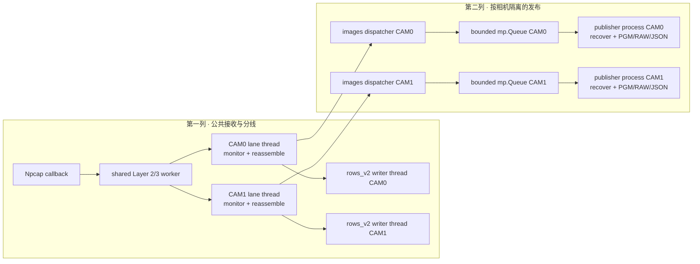
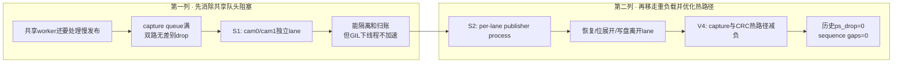
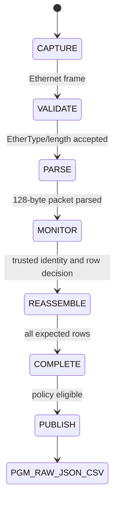
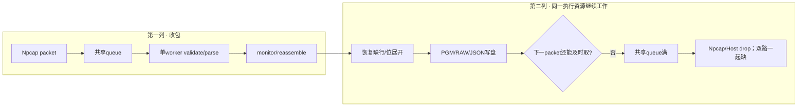
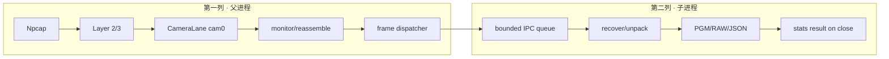
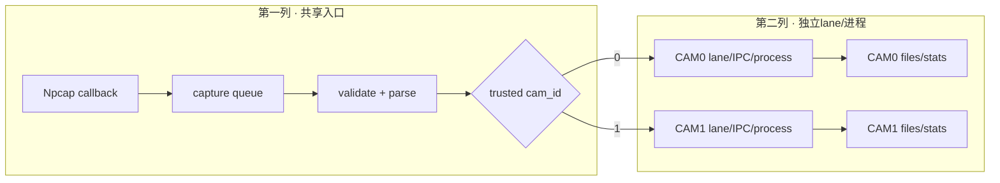

# PRG_CAM · Python接收机架构、复刻与调试实验手册

> **PRG_CAM · PROJECT REVIEW & TRAINING SERIES**<br>
> 文档编号：07　版本：3.0　基线日期：2026-08-26<br>
> 适用对象：需要从Npcap接口获得双路PGM/RAW/CSV，或定位“有包无图”的人<br>
> 范围：Layer 1 capture → Layer 2 validate → Layer 3 parse → Layer 4 monitor → Layer 5 reassemble/publish<br>
> 当前状态：离线golden tests与publisher thread/process逐字节等价测试通过；归档双路CRC采集通过；当前主机内存时间线缺失<br>
> 不变量：坏包仍需统计，只有合格row进入图像；单相机失败不能被总包数掩盖

## OBJECTIVE

说明Npcap帧如何经过validate、parse、monitor、reassemble和publish，提供双路接收的可执行PowerShell流程，并防止路径、camera allowlist、CRC模式、前台阻塞和空输出被误判。

## INPUTS / DEPENDENCIES / RUN IDENTITY

- Wrapper参数：`prg_cam.srcs/sources_1/tx/taxi_receiver_advanced/taxi_receiver/run_receiver.ps1:1-78`。
- CLI：`taxi_receiver/cli.py:162-259,260-438`。
- 分层：`taxi_receiver/stages.py:34-57`。
- Ethernet门：`taxi_receiver/eth_validate.py:18-47`。
- Packet parser：`taxi_receiver/packet_format.py:134-197`、`taxi_receiver/camera_parser.py:119-159`。
- Monitor：`taxi_receiver/stream_monitor.py:23-76,322-400`。
- Reassembly/output：`taxi_receiver/image_pipeline.py:62-105,644-729,869-910`。
- Per-camera lane与publisher接线：`taxi_receiver/camera_lane.py:118-163,257-300,472-513`。
- Publisher进程、跨进程envelope、关闭与统计：`taxi_receiver/image_pipeline.py:141-281,315-348,439-472,542-580,772-792,1156-1195`。

run manifest记录interface GUID、camera IDs、CRC mode、bit order、所有queue参数、capture root、receiver入口hash、开始/结束时间和FINAL REPORT。

## 1. 五层架构和每层的停止权

> **本章目标｜解释为什么接收机能“收到包”却仍然不生成图像。**

`stages.py:1-17`明确规定：只有Layer 2 Ethernet validation可以因“不是本协议、MAC过滤或长度错误”直接停止链；Layer 3解析即使发现CRC/协议错误也继续到Layer 4，让统计不丢失故障证据；Layer 5会看到结构化错误记录，但不把坏payload写入图像。于是`Capture ingress>0`只证明网卡回调收到frame；`Matching Ethernet>0`证明通过粗门；`Valid packets>0`才是可进入图像语义的包；完整PGM还要求同一camera/frame收齐期望rows。

| 层 | 当前入口 | 输入 → 输出 | 可拒绝什么 | 主要观测量 |
|---:|---|---|---|---|
| 1 | `capture.py` / Scapy | NIC frame → `RawEthernetFrame` | OS/Npcap drop | ingress、queue peak/drop、pcap stats |
| 2 | `ValidationStage` | raw frame → 128-byte payload | EtherType、MAC、Ethernet长度 | matching、bad Ethernet length |
| 3 | `ParsingStage` | payload → `CameraRowPacket` | sync、payload_len、CRC、reserved、trailer、cam/row范围 | parsed_ok、protocol/diagnostic errors |
| 4 | `MonitoringStage` | parse result → counters | 不阻断；只分类 | duplicate/gap/out-of-order、per-camera errors |
| 5 | `ReassemblyStage` | trusted rows → `CompletedFrame` | 坏row、duplicate冲突、缺行、session边界 | complete/recovered/rejected、PGM/RAW/JSON/CSV |

### 1.1 `parsed_ok`、`ok`和`row_accepted`

这三个量处于不同层，不可互换：

- `parsed_ok=True`：没有协议结构错误，例如sync、length、CRC、reserved和trailer都可解释。
- `ok=True`：在`parsed_ok`基础上，sender overflow、FPGA overflow/length/CRC等诊断错误也为空。
- `row_accepted=True`：Layer 5最终接受该row进入当前frame，且不是冲突duplicate等重组拒绝。

`camera_parser.py:133-159`将protocol errors与diagnostic errors分离；`image_pipeline.py:648-667`只使用reassembler的`PacketRecord.accepted`写`row_accepted`。因此“CSV中有一行”不表示“该行进入图像”；“parsed_ok=1但validation_status=DIAGNOSTIC_REJECT”是特意保留的审计能力，不是逻辑矛盾。

### 1.2 packet parser的字节序和bit order

多字节元数据按network/big-endian解包：`sync0/sync1/frame_id/row_idx/row_seq/CRC`均高字节先传，`packet_format.py:17,56-80`用`struct.Struct('>...')`固定。`msb_first`是80-byte像素payload内部每个byte如何展开成8个横向像素，与多字节字段端序不是同一问题。把`msb_first`改成`lsb_first`会使每8像素的小组内部镜像/重排，不是整个640列的简单左右翻转；不能用它修复物理镜像而不做golden图对比。

### 1.3 CRC的两种PC模式

`CrcMode enabled`使PC计算offset 0..125的CRC-16/CCITT-FALSE并与126/127比较；`placeholder`不比较，期望tail为`FF FF`，非FFFF只记warning（`packet_format.py:147-197`、`camera_parser.py:109-112`）。这只控制PC对FPGA出站tail的解释；FPGA是否审计MCU入口CRC由`CAMERA_INGRESS_CRC_ENABLE`单独控制。当前归档top和接收命令均为enabled，不能在新run中只改PC一侧。

### 1.4 Host Publisher Isolation：主机发布器隔离

> **本节目标｜说明`-PublishImages process`实际隔离了什么、没有隔离什么，以及怎样证明它真的工作。**

**结论先行：当前实现已经具备Host Publisher Isolation，但此前本文只列出了开关，没有完整解释机制。** 在`SplitByCamera on`时，`CameraLanePool`按可信且在白名单内的`cam_id`惰性创建lane；每个实际出现的camera lane各有一条重组线程、一个image dispatcher和一个`spawn`方式的publisher子进程。父进程负责收包、解析、监控、重组和逐行CSV入队；子进程负责frame recovery、1-bit到640×480灰度像素展开、PGM/RAW/JSON生成和磁盘写入（`camera_lane.py:145-163,257-300,472-513`，`image_pipeline.py:241-281`）。若`SplitByCamera off`，则只有共享`CameraImagePipeline`及一个publisher进程，不能把“一路磁盘慢只影响该路”当成已成立。这个名称也不能扩张成“所有Host磁盘I/O均已多进程化”：`rows_v2.csv`仍由父进程内writer线程写，额外archive storage走独立dispatcher线程，启用session audit还会在lane回调中同步写入（`camera_lane.py:123-142,278-300`）；当前正式命令使用`SessionAudit off`正是为了避免这条同步路径重新耦合lane。



#### CURRENT IMPLEMENTATION：进程如何创建

以下代码是实际的进程边界，不是设计建议。Windows明确使用`spawn`；队列有界，result queue只回传最终统计；进程名固定为`taxi-image-publisher`。

```python
if self.publish_async:
    self._publisher_context = mp.get_context("spawn")
    self._publisher_queue = self._publisher_context.Queue(
        maxsize=self.publisher_queue_depth
    )
    self._publisher_result_queue = self._publisher_context.Queue(
        maxsize=1
    )
    self._publisher_process = self._publisher_context.Process(
        target=_run_image_publication_worker,
        name="taxi-image-publisher",
        args=(
            str(self.images_root),
            self.expected_rows,
            self.bit_order,
            self.image_policy,
            self.max_missing_rows,
            self.max_consecutive_missing,
            self.report_interval,
            self._publisher_queue,
            self._publisher_result_queue,
        ),
        daemon=True,
    )
    self._publisher_process.start()
```

来源：`taxi_receiver/image_pipeline.py:448-472`。

跨进程传输的不是480个零散row对象，而是`_PublishedFrameEnvelope`：连续`rows_blob`保存`expected_rows × 80`字节的1-bit行数据，`present_rows`保留每行是否真实存在，`missing_rows`保留恢复判据。`to_bytes()`会给缺行填零；若只传blob，子进程就无法区分“缺失行”和“真实全黑行”，可能静默发布伪完整图（`image_pipeline.py:141-238`）。现有测试`test_publication_envelope_round_trip_preserves_missing_rows`专门钉住这个语义。

#### CURRENT IMPLEMENTATION：背压没有消失，只是后移

```python
if self.publish_async:
    # Every frame goes across, not only COMPLETE ones.  Recovery
    # assessment plus a ZERO_FILL unpack is the most expensive path in
    # this module, so leaving non-complete frames in the caller's
    # thread would keep exactly the work S2 exists to move.
    if self._publisher_queue is None:
        raise RuntimeError("image publication process is not available")
    envelope = _frame_to_envelope(frame)
    self.publisher_stats.submitted += 1
    started = time.monotonic()
    self._publisher_queue.put(envelope)
    blocked = time.monotonic() - started
    # An mp.Queue feeder makes put() nearly free until the bound is hit,
    # so a growing blocked total is the signal that the child, not the
    # caller, has become the ceiling.
    if blocked > 0.001:
        self.publisher_stats.submit_blocked_seconds += blocked
        self.publisher_stats.submit_blocked_count += 1
```

来源：`taxi_receiver/image_pipeline.py:775-792`。

直观地说，传统线程模式相当于“分拣员自己停下来打包并搬到磁盘”；进程模式相当于“分拣员把完整frame放进每台相机自己的传送带，由另一个工人打包”。只要传送带还有空位，磁盘短暂停顿不会占用lane线程，也不会受父进程GIL中的CPU位展开拖累；但传送带填满后，`put()`仍会等待，反压会沿`publisher queue → image dispatcher → camera lane → capture queue → Npcap`向前传播。因此它是**有界隔离和削峰**，不是“写盘永远不会影响收包”。

| 边界 | 解决的问题 | 没有解决的问题 | 直接观测量 |
|---|---|---|---|
| S1 per-camera lane | 一路重组/输出压力不再直接占用另一lane队列；drop可按相机归账 | shared Layer 1–3仍是公共入口；白名单外ID被拒绝 | lane peak/drop、unroutable cam_id |
| per-sink dispatcher | storage失败不再让images callback一起消失 | dispatcher满时仍阻塞lane | sink submitted/processed/failures/submit blocked |
| S2 publisher process | recovery、PGM编码、RAW/JSON写盘离开lane线程和父进程GIL | 有界IPC满时仍反压；磁盘容量/权限问题仍会失败 | publisher submitted/published/failures/stats ok/blocked |
| rows CSV writer thread | CSV格式化和flush离开packet处理热路径 | `CsvBackpressure drop`会主动丢审计行；不是publisher子进程的一部分 | CSV submitted/written/dropped/failures |
| session audit / archive storage | session audit提供逐packet审计；storage提供额外frame archive | session audit启用时同步占用lane；storage虽有独立dispatcher但仍不是S2子进程 | session audit开关、各sink submit blocked/failures |

#### 失败回传与退出码边界

子进程对每个frame捕获异常，增加`failures`并继续服务；正常停止时父进程发送可pickle的`_PublisherStop`，等待最多120秒取得统计，再等待30秒退出（`image_pipeline.py:241-281,542-580`）。FINAL REPORT中的以下六项必须一起看：`publish mode`、`publisher submitted`、`publisher published`、`publisher failures`、`publisher stats ok`、`publisher blocked`（`image_pipeline.py:1156-1195`）。这里的`publisher published`表示worker调用`archive_frame()`未抛异常，不必然等于PGM数量；policy可让一次正常调用不产图，因此最终仍要核对`images complete/recovered/rejected`和磁盘文件合同。

当前CLI的exit 7检查的是各`AsyncCallbackDispatcher`是否被禁用或“submitted>0但processed=0”（`cli.py:631-656`）。在process模式中，dispatcher的callback只需成功把envelope放入队列就可记为processed；子进程之后发生的单帧写盘异常会体现在`publisher failures`，不一定自动变成exit 7。因此：**exit 0不能单独证明图像发布成功**，还必须要求每路`publisher failures=0`、`publisher stats ok=1`，并核对PGM/RAW/JSON实际计数。Ctrl+C若没有走完正常close，`stats ok=0`表示最终发布计数不可信，应保留日志并以磁盘清点补证，不能把全0统计写成“没有图像”。

#### 最小等价回归与现场验证

**[READ ONLY EXCEPT PYTEST TEMP] [RUN NOW]** 先验证thread/process只是执行位置变化，输出字节必须一致：

```powershell
$receiverRoot = 'D:\prg\prg_cam\prg_cam.srcs\sources_1\tx\taxi_receiver_advanced\taxi_receiver'
$python = 'C:\Users\Z\AppData\Local\Python\pythoncore-3.14-64\python.exe'
Set-Location $receiverRoot

& $python -m pytest .\tests\test_image_recovery.py `
  -k 'publication_envelope or publisher_stop or process_publication' `
  -q
$publisherTestExit = $LASTEXITCODE
if ($publisherTestExit -ne 0) {
  throw "Publisher isolation regression failed: $publisherTestExit"
}
```

Expected：3 tests passed；其中process/thread产生的PGM与RAW逐字节相同、缺行位图往返不丢、停止哨兵可pickle（`tests/test_image_recovery.py:296-398`）。这证明功能等价，不证明live吞吐或磁盘容量。

正式双路run正常Ctrl+C结束后，用不依赖空管道的方式检查日志：

```powershell
if (!(Test-Path -LiteralPath $receiverLog -PathType Leaf)) {
  throw "Receiver log不存在：$receiverLog"
}
$publisherReport = @(
  Select-String -LiteralPath $receiverLog -Pattern `
    'publish mode|publisher submitted|publisher published|publisher failures|publisher stats ok|publisher blocked'
)
if ($publisherReport.Count -eq 0) {
  throw '没有IMAGE PUBLICATION统计；检查ImagesRoot与PublishImages是否真正接线'
}
$publisherReport | ForEach-Object { $_.Line }
```

双路且两路都有可信packet时，Expected为两组`publish mode: process`；每组`failures=0`、`stats ok=1`，`submitted = published + failures`。`publisher blocked`没有冻结的绝对PASS阈值，但其持续增长或占运行时间的大比例表示磁盘/子进程已成为吞吐上限，应转Topic 05量主进程与子进程内存并转Topic 09沿反压链定位。历史文档`CHEATSHEET.md:101-114`记录过process相对thread的吞吐收益和逐字节等价，但原始A/B产物未在本Topic重新绑定run manifest，因此该数字只标`HISTORICAL DOCUMENTED`，不能代替新机器实测。

### 1.5 四代Host架构：为什么双CAM从严重丢包恢复

历史演进不能缩写成“线程换进程”。四代各自解决不同的first failure：

| 代 | 执行结构 | 首要问题/收益 | 证据状态 |
|---|---|---|---|
| V1 | Scapy callback、单shared worker、同步/同进程archive | 历史记录82,135 capture drops | HISTORICAL DOCUMENTED |
| S1/V2 | `CameraLanePool`按cam_id分lane、每sink独立dispatcher | 隔离跨相机head-of-line；吞吐历史约−3.4% | CODE VERIFIED + HISTORICAL DOCUMENTED |
| S2/V3 | 每active lane一个`spawn` publisher进程 | lane发布阻塞后移；历史consumer rate约+29% | CODE VERIFIED + HISTORICAL DOCUMENTED |
| V4 | `pcap_next_ex` bytes切片、`crc_hqx` | 历史单包52.0→13.5 μs，ps_drop 33.2%→0 | CODE VERIFIED + HISTORICAL DOCUMENTED |



S1路由使用raw Ethernet absolute offset18作为廉价提示，但真正建lane前仍要求解析后的可信`cam_id`落在`CameraIds`白名单；否则stuck bit/bad sync可能为伪ID创建线程、CSV writer、publisher进程和目录。当前实现的白名单拒绝位于`camera_lane.py:430-439,457-470`。

### 1.6 五个有界边界与反压方向

| 边界 | 容量入口 | 满时行为 | 直接字段 |
|---|---|---|---|
| Npcap kernel | `PcapBufferSize` | 内核丢包 | `ps_drop` |
| capture queue | `QueueDepth` | live `put_nowait`丢；replay阻塞 | capture peak/drops |
| per-camera lane | `QueueDepth/2` | live丢对应camera packet | lane peak/drops |
| rows CSV | `CsvQueueDepth` | drop或block，取决于策略 | CSV dropped |
| frame dispatcher | `FrameOutputQueueDepth` | 阻塞lane，不静默丢完整帧 | sink submit blocked |
| publisher IPC | `PublisherQueueDepth` | 阻塞dispatcher | publisher blocked |

阻塞从publisher向前传播的顺序是`publisher → IPC queue → dispatcher → lane → capture queue → Npcap`。所以S2是有界隔离，不是无限吞吐。

### 1.7 遗留rows CSV的MATLAB复核

新增`scripts_matlab/analyze_host_packet_loss.m`同时支持旧`rows.csv`和当前`rows_v2.csv`。它将证据拆成三类：已经记录并接受的行、已经记录但拒绝的行、从16-bit `row_seq`前向缺口推断的未记录packet。输出包括逐行标注、逐frame缺行、原因汇总和Discussion图。

对`build/s2_verify_live/thread|process/images`的`CSV REANALYSIS`结果：四份CSV的已记录行均为100% accepted，说明主要损失发生在CSV记录之前；thread两路合计缺口率约49,765.80/100k，process约37,851.81/100k，归一化下降约23.94%。但两组recorded rows和时间窗口不同，不能把原始行总数或frame complete百分比直接写成严格A/B。最终drop位置还必须与同一run FINAL REPORT结合。

### 1.8 Ctrl+C与publisher统计边界

历史attempt13曾出现`publisher submitted=1458`但`published=0/stats ok=0`，同时磁盘两路各存在1,456张PGM。现有源码仍在正常close时等待child result queue，并未让child显式忽略控制台SIGINT。因此`stats ok=0`只能表示收尾统计未成功回传，不能改写成“运行期没有图像”；必须清点磁盘并标`PARTIAL`。自然结束的offline replay仍是验证publisher计数最干净的入口。

### 1.9 从历史文档继承的未闭合项

以下项目没有因文档迁移而自动完成：超过30分钟的双路连续采集及父子进程内存时间线、超过历史15,000 pkt/s工作点的实测余量、Ctrl+C后`publisher stats ok=1`的live收尾复验，以及RAMDisk对额外`OutputRoot` storage sink阻塞的A/B。它们继续标记为`PENDING`；当前代码存在机制或观察点不等于已经获得run-bound证据。

## 2. 实验地图

> **本章目标｜先离线证明软件，再逐层加入NIC、双路、落盘和标定。**

| 实验 | 目的 | 输出 | 不通过时停在哪 |
|---:|---|---|---|
| 0 | Python import和依赖 | 版本清单 | 主机环境 |
| 1 | Npcap/NIC/GUID枚举 | real `NPF_{GUID}` | 驱动/权限/网卡 |
| 2 | packet/PCAP golden | pytest结果 | parser/stdlib PCAP |
| 3 | image/reassembly golden | pytest结果 | monitor/reassembler/storage |
| 4 | live盲测，不落大图 | FINAL REPORT | NIC→parse |
| 5 | 双路strict capture | PGM/RAW/JSON/rows_v2 | publish/storage |
| 6 | 采后完整性审计 | 两路计数与错误表 | 不进入calibration |
| 7 | preflight pose观察 | per-camera preflight CSV | D4检测而非D3 |

实验0～3可在无硬件环境运行。实验4开始需要管理员权限、正确GUID、PHY link和当前协议身份；实验5在前台持续阻塞直到Ctrl+C是正常行为，不是命令卡死。

## Host Setup From Zero

### 1. Python与依赖

仓库原始依赖是`requirements-live.txt`中的`scapy`，以及`requirements-calibration.txt`中的`numpy>=1.24`、`opencv-python-headless>=4.8,<5`。没有原始lock；`docs/reports/requirements-reproduction.txt`固定了2026-08-24当前主机的scapy 2.7.0、NumPy 2.5.1、OpenCV 4.14.0.94和pytest 9.1.1，只是`RECOMMENDED`快照。Python 3.14.6是当前主机观测，不是仓库声明的唯一支持版本。

**[MUTATES FILESYSTEM] [RUN NOW]**：

```powershell
$repo = 'C:\Users\NewDeveloper\src\prg_cam' # ← 实际repo根目录
$receiverRoot = Join-Path $repo `
  'prg_cam.srcs\sources_1\tx\taxi_receiver_advanced\taxi_receiver'
Set-Location $repo
py -3.14 -m venv .venv
Set-ExecutionPolicy -Scope Process Bypass
.\.venv\Scripts\Activate.ps1
python -m pip install --upgrade pip
python -m pip install -r .\docs\reports\requirements-reproduction.txt
if ($LASTEXITCODE -ne 0) { throw 'Host Python bootstrap failed' }
$python = Join-Path $repo '.venv\Scripts\python.exe'
Push-Location $receiverRoot
try {
  & $python -c "import cv2,numpy,scapy,taxi_receiver.cli; print(cv2.__version__,numpy.__version__,scapy.__version__)"
  if ($LASTEXITCODE -ne 0) { throw 'Receiver imports failed' }
} finally { Pop-Location }
```

Expected console：四个import成功并打印版本。Expected files：`.venv`。PASS：exit 0。FAIL：若Python/wheel安装失败，停留在Host，不得改CRC或FPGA。

### 2. Npcap、dumpcap、权限与NIC

Npcap和Wireshark installer/version没有被仓库锁定。当前接收只需Npcap/Scapy；wire-side PCAP审计额外需要dumpcap。`scripts_ps/env.ps1`硬编码了作者机器GUID、dumpcap index和旧`rows.csv`路径，并且dot-source时会创建目录，所以不能作为陌生主机的只读入口。

**[READ ONLY] [RUN NOW]**：

```powershell
$isAdmin = ([Security.Principal.WindowsPrincipal] `
  [Security.Principal.WindowsIdentity]::GetCurrent()).IsInRole(
    [Security.Principal.WindowsBuiltInRole]::Administrator
  )
Get-Service -Name npcap -ErrorAction SilentlyContinue |
  Select-Object Name,Status,StartType
Get-NetAdapter -Physical |
  Select-Object Name,InterfaceDescription,Status,LinkSpeed,MacAddress
Write-Host "Elevated=$isAdmin"

$dumpcap = 'C:\Program Files\Wireshark\dumpcap.exe' # ← 实际安装路径
if (Test-Path -LiteralPath $dumpcap -PathType Leaf) { & $dumpcap -D }

Set-Location $receiverRoot
& $python -m taxi_receiver.cli --list
if ($LASTEXITCODE -ne 0) { throw 'Npcap interface enumeration failed' }
```

Expected console：Npcap为Running；目标有线NIC在硬件连接后为Up；CLI输出至少一个`\Device\NPF_{GUID}`。`dumpcap -D`编号与Scapy列表编号不是同一命名空间，必须靠adapter描述/GUID对应，不得复制旧index。若CLI没有接口：先用管理员PowerShell复验，再查Npcap；若NIC Down：先查PHY/link/cable；若NIC Up但无`0x88B5`：转Topic 09的RMII→PCAP接缝。该协议是L2广播，不要求代码配置静态IP。

### 3. Command / expected / failure contract

| Command | Expected output | Failure meaning |
|---|---|---|
| `python -c import...` | 版本字符串，exit 0 | venv/依赖，不是FPGA |
| `Get-Service npcap` | Running | Npcap未装/未启动/权限 |
| `dumpcap -D` | NIC清单 | Wireshark/dumpcap安装或权限 |
| `taxi_receiver.cli --list` | NPF GUID清单 | Scapy/Npcap/权限 |
| `Get-NetAdapter -Physical` | 目标NIC Up、LinkSpeed非空 | PHY/cable/link |
| receiver startup | `Mode: camera`, `CRC mode: enabled`, real Source | 参数/GUID/工作目录 |
| receiver shutdown | FINAL REPORT | 非正常kill可能没flush CSV/report |

## Offline Golden Gate

执行顺序固定为：offline packet parser → offline reassembly → live NIC → live dual camera。第一项失败时禁止先调FPGA。

**[READ ONLY] [RUN NOW]** packet/PCAP门：

```powershell
Set-Location $receiverRoot
& $python -m pytest -q `
  tests\test_protocol_golden_vector.py `
  tests\test_pcap_stdlib.py
if ($LASTEXITCODE -ne 0) { throw 'Offline packet gate failed' }
```

审计实测：`13 passed`。其中fixed PCAP必须是1000个142-byte、EtherType `0x88B5`、payload `00..7F`帧。它只证明Layer 1/2，不证明camera parser。

**[READ ONLY] [RUN NOW]** reassembly门：

```powershell
& $python -m pytest -q tests\test_image_pipeline.py
if ($LASTEXITCODE -ne 0) { throw 'Offline image/reassembly gate failed' }
```

审计实测：`7 passed`。两组pytest都出现过“无法写`.pytest_cache`”warning，但exit 0且测试全过；这是cache权限提示，不是协议失败。若断言失败则修复Host代码/依赖，不能用live packet掩盖。

Golden artifact的路径、SHA和语义见`COLD_START_GAP_ANALYSIS.md`。`docs/sample_eth_data6.pcapng`在当前CRC语义下是历史失败样本，不得当golden输入。

## PRECHECK / DRY-RUN

**[READ ONLY] [RUN NOW]**

```powershell
$ErrorActionPreference = 'Stop'
$repo = 'D:\prg\prg_cam'
$receiverRoot = Join-Path $repo `
  'prg_cam.srcs\sources_1\tx\taxi_receiver_advanced\taxi_receiver'
$runReceiver = Join-Path $receiverRoot 'run_receiver.ps1'
$python = 'C:\Users\Z\AppData\Local\Python\pythoncore-3.14-64\python.exe'

foreach ($path in @($runReceiver, $python)) {
  if (!(Test-Path -LiteralPath $path -PathType Leaf)) {
    throw "接收前置对象不存在：$path"
  }
}
Set-Location $receiverRoot
& $python -m taxi_receiver.cli --list
```

将真实输出完整复制到`$interface`。下面的dry-run只打印配置：

**[READ ONLY] [RUN NOW]**

```powershell
$interface = '\Device\NPF_{REPLACE_WITH_ACTUAL_GUID}' # 必须替换
$runId = '{0}_dual_receiver' -f (Get-Date -Format 'yyyyMMdd_HHmmss')
$captureRoot = Join-Path $repo "runs\$runId\capture"
$receiverLog = Join-Path $repo "runs\$runId\receiver.log"

$plan = [pscustomobject]@{
  Interface = $interface
  ImagesRoot = $captureRoot
  CameraIds = '0,1'
  BitOrder = 'msb_first'
  CrcMode = 'enabled'
  Log = $receiverLog
}
$plan | Format-List
if ($interface -match 'REPLACE_WITH') { throw '尚未设置真实Npcap GUID' }
if (Test-Path -LiteralPath (Split-Path $captureRoot -Parent)) {
  throw "Run目录已存在，换用新run ID：$(Split-Path $captureRoot -Parent)"
}
```

## MAIN：处理状态



`parsed_ok`只表示协议字段可以解析；`ok`还包含FPGA status等诊断结果。因此一个packet可以`parsed_ok=True`但`ok=False`，仍能写审计CSV但不能进入图像。

### 窗口A：正式接收

**[MUTATES FILESYSTEM] [LONG RUN] [RUN NOW]** 前台阻塞是正常行为；目标目录必须是新run：

```powershell
$runRoot = Split-Path $captureRoot -Parent
New-Item -ItemType Directory -Path $captureRoot -Force | Out-Null

& $runReceiver `
  -Interface $interface `
  -ImagesRoot $captureRoot `
  -ExpectedRows 480 `
  -QueueDepth 65536 `
  -PcapBufferSize 67108864 `
  -FrameOutputQueueDepth 256 `
  -CameraIds '0,1' `
  -SplitByCamera on `
  -ImagePolicy strict `
  -PublishFrames complete `
  -PublishImages process `
  -PublisherQueueDepth 256 `
  -CsvQueueDepth 65536 `
  -CsvBackpressure drop `
  -BitOrder msb_first `
  -SessionAudit off `
  -CrcMode enabled `
  -PythonExe $python 2>&1 |
  Tee-Object -FilePath $receiverLog

$receiverNativeExit = $LASTEXITCODE
```

该命令在前台持续接收，直到Ctrl+C，属于正常阻塞；停止后才执行下一行。需要实时监控时打开其他PowerShell窗口，不要把watch命令接在它后面。

### 10–60秒 smoke capture

首次运行建议先15秒；这不是质量阈值，只是避免在路径/GUID错误时产生大型输出。使用上面的正式命令，在15秒后按Ctrl+C，使receiver走正常finally并flush `rows_v2.csv`。不要用`Stop-Process`模拟正常结束。若需要自动定时，可调用`$repo\scripts_ps\run_receiver_timed.py`，但它是smoke helper，使用CLI默认camera allowlist而非上面显式的`0,1`，不能代替正式完整性验收。

Expected console：启动段含真实`Source`、`Mode camera`、`CRC mode enabled`、`Max stage reassemble`；停止后有FINAL REPORT。Expected files：`cam0/rows_v2.csv`、`cam1/rows_v2.csv`和两路PGM/RAW。Expected counts/range：两路`Matching Ethernet/Valid packets/PGM > 0`；clean run的CRC、sync、length、parse、processing errors和capture queue drops均为0。PASS必须同时满足控制台与文件合同，不能只看exit 0。

### 三窗口实时观察：接收、CAM0 pose、CAM1 pose

窗口A运行上面的receiver并保持前台。窗口B/C分别重新定义变量；PowerShell新窗口不会继承窗口A的函数或变量。

**窗口B（CAM0，只读正在增长的图像并写live report）：**

```powershell
$repo = 'D:\prg\prg_cam'
$receiverRoot = Join-Path $repo `
  'prg_cam.srcs\sources_1\tx\taxi_receiver_advanced\taxi_receiver'
$python = 'C:\Users\Z\AppData\Local\Python\pythoncore-3.14-64\python.exe'
$preflight = Join-Path $receiverRoot 'preflight_calibration_frames.py'
$captureRoot = 'D:\prg\prg_cam\runs\REPLACE_RUN_ID\capture' # ← 与窗口A完全相同
$liveRoot = Join-Path (Split-Path $captureRoot -Parent) 'audit\live'
New-Item -ItemType Directory -Force -Path $liveRoot | Out-Null

& $python $preflight `
  (Join-Path $captureRoot 'cam0\*.pgm') `
  --watch --poll-interval 1 --min-poses 15 --zone-map `
  --report (Join-Path $liveRoot 'cam0_preflight_live.csv')
```

**窗口C（CAM1）：**只把最后两行路径中的`cam0`改为`cam1`，但仍需重新执行完整变量定义。预期控制台持续显示`frames=... grids=... poses=.../15`（`preflight_calibration_frames.py:346-368`）。15是当前CLI默认/本次示例参数，不是理论上每种镜头都必须的自然常数。

这个watch读取已经写完的PGM，不参与receiver hot path。它统计的是单相机distinct poses，不是双目`selected_pose_pairs`；两台各有15 pose也不自动表示存在15个同步双目pose。

## 数据布局与字段

```text
captureRoot/
  cam0/
    <frame_id>.pgm
    <frame_id>.raw
    <frame_id>.json
    rows_v2.csv
  cam1/
    ...
```

`rows_v2.csv`包含capture/csv sequence、cam/frame/row、sender flags、FPGA status、payload/sync/CRC、`parsed_ok`、validation status、`row_accepted`和errors（`taxi_receiver/image_pipeline.py:62-105,683-729`）。frame sidecar记录capture start/end/center timestamp、bit order、row count和missing rows（`taxi_receiver/image_pipeline.py:869-910`）。

`-OutputRoot`是额外的逐帧archive，不是PGM目录；只需要图片和`rows_v2.csv`时保持未设置。`run_receiver.ps1`会Push-Location到自身目录并透传Python exit code（`prg_cam.srcs/sources_1/tx/taxi_receiver_advanced/taxi_receiver/run_receiver.ps1:80-137`），所以从`C:\Users\Z`运行时也应调用完整`$runReceiver`路径。

## VALIDATE

停止后先检查两路产物，不使用空管道：

**[READ ONLY] [RUN NOW]**

```powershell
$captureRows = @(
  foreach ($camera in 'cam0','cam1') {
    $cameraRoot = Join-Path $captureRoot $camera
    $files = @()
    if (Test-Path -LiteralPath $cameraRoot -PathType Container) {
      $files = @(Get-ChildItem -LiteralPath $cameraRoot -Filter '*.pgm' -File)
    }
    [pscustomobject]@{
      Camera = $camera
      PgmCount = $files.Count
      RawCount = if (Test-Path $cameraRoot) {
        @(Get-ChildItem -LiteralPath $cameraRoot -Filter '*.raw' -File).Count
      } else { 0 }
      JsonCount = if (Test-Path $cameraRoot) {
        @(Get-ChildItem -LiteralPath $cameraRoot -Filter '*.json' -File).Count
      } else { 0 }
      RowsCsv = Test-Path -LiteralPath (Join-Path $cameraRoot 'rows_v2.csv')
    }
  }
)
$captureRows | Format-Table -AutoSize
$captureBad = @(
  $captureRows | Where-Object {
    $_.PgmCount -le 0 -or -not $_.RowsCsv
  }
)
if ($captureBad.Count -gt 0) {
  throw 'Dual-camera smoke output contract failed'
}
```

### 为什么“ValidPercent=0”常常是统计脚本错，而不是4500张图都坏

`rows_v2.csv`当前列名是`parsed_ok`、`validation_status`和`row_accepted`，没有通用`valid`列（`image_pipeline.py:683-730`）。若脚本读取不存在的`$_.valid`，PowerShell得到空字符串，所有行都会被计为false。另一个常见情况是live CSV刚创建、只有表头；这只能写“尚无row记录”，不能写成“0个有效frame”。

下面按当前字段统计row级协议、诊断和重组准入，避免空管道：

```powershell
$validRows = @(
  foreach ($camera in 'cam0','cam1') {
    $csv = Join-Path (Join-Path $captureRoot $camera) 'rows_v2.csv'
    $rows = @()
    if (Test-Path -LiteralPath $csv -PathType Leaf) {
      $rows = @(Import-Csv -LiteralPath $csv)
    }
    [pscustomobject]@{
      Camera = $camera
      CsvRows = $rows.Count
      ParsedOk = @($rows | Where-Object parsed_ok -eq '1').Count
      DiagnosticPass = @($rows | Where-Object validation_status -eq 'PASS').Count
      ReassemblyAccepted = @($rows | Where-Object row_accepted -eq '1').Count
    }
  }
)
$validRows | Format-Table -AutoSize
```

这是row统计，不是frame统计。frame是否完整要读取sidecar/summary或统计PGM；不能用480行整数除法替代session/reassembler的duplicate、missing和frame boundary决策。

原生exit 0只表示主程序正常结束；仍须检查FINAL REPORT和产物。原生2多为参数/配置，3为权限，4为capture OS error，5为Scapy缺失，7为输出sink全失败（`taxi_receiver/cli.py:573-590,631-658`）。上层wrapper应映射到Topic 00统一契约并保留原生值。

## OBSERVED vs EXPECTED

| Probe | Expected | Current observed | Interpretation |
|---|---|---|---|
| Capture ingress | >0 | current retained CRC run有双路rows | 接收链曾工作 |
| Camera routing | cam0/cam1均非0 | 两路各324 unique frame IDs | PASS in retained run |
| CRC errors | PC和FPGA错误0 | current audit pass | PASS |
| PGM/RAW/JSON | 每路非0且一致 | CRC run为每路323 PGM/RAW、324 frame IDs | 计数口径不同，需按audit字段解释 |
| Publisher thread/process semantics | 输出逐字节一致，缺行语义不丢 | 3个定向回归测试覆盖envelope、stop sentinel和A/B输出 | SOURCE/TEST VERIFIED；live性能需另测 |
| Publisher正常关闭 | 每路failures=0、stats ok=1 | 未在当前120°+120°证据清单中单独摘录 | UNVERIFIED FOR CURRENT RUN；不得由exit 0推断 |
| Pair-ready timestamps | sidecar center可用 | 23条accepted pair，median dt 1.270056 ms | timestamp输出可用 |
| Current live host memory | run-bound sample | 无 | REPORT LIMITATION |

## EXPORT / FAILURE HANDLING / PASS-FAIL

- 归档receiver log、manifest、两路CSV/sidecar/图像计数及可选PCAP。
- `Unroutable cam_id`增加：先检查Ethernet absolute byte18/payload offset4和`-CameraIds`；不是自动判定RTL关闭。
- `Capture failed the dual-camera integrity gate`是对既有目录的聚合审计，不会启动V1采集；必须展开两路计数。
- `valid frame=0`时先确认实时CSV是否只有表头、列名是否与统计命令一致，再判图像无效。
- 当前阶段不启动新接收；以上命令是未来复刻入口。

## NEXT ACTION

接收完整性PASS后进入Topic 08；任何D3完整性FAIL都禁止通过降低标定阈值绕过。

## 3. 当前运行对象与调用拓扑

> **审计结论｜用户入口是`run_receiver.ps1`/`taxi_receiver.cli`，但运行时真正的控制对象是`TaxiReceiverPipeline`；双路隔离由`CameraLanePool`在解析后建立，图像发布进程由每个lane的`CameraImagePipeline`创建。**

```text
run_receiver.ps1
  -> python -m taxi_receiver.cli
     -> TaxiReceiverPipeline.start()
        -> capture callback: TaxiReceiverPipeline._on_frame()
        -> shared worker: _run_worker() / _process_frame()
           -> ValidationStage -> ParsingStage
           -> CameraLanePool.submit()
              -> CameraLane(cam_id)._run()
                 -> MonitoringStage -> ReassemblyStage
                 -> CameraImagePipeline.record_packet()
                 -> AsyncCallbackDispatcher(frame)
                    -> CameraImagePipeline.archive_frame()
                       -> bounded mp.Queue
                          -> _run_image_publication_worker()
```

| 对象 | 创建位置 | 数量 | 负责状态 | 不能从其PASS推出什么 |
|---|---|---:|---|---|
| `TaxiReceiverPipeline` | `pipeline.py:34-114` | 1 | capture queue、公共stage、全局monitor | 单路图像已发布 |
| `CameraLanePool` | CLI接线后 | 1 | cam白名单、lane惰性创建、lane汇总 | 白名单外cam数据正确 |
| `CameraLane` | `camera_lane.py:472-513` | 每个可信active cam 1个 | 单路队列、monitor、reassembler、outputs | 另一相机没有阻塞 |
| `CameraImagePipeline` | `camera_lane.py:257-300` | 每lane 0或1个 | rows CSV、recovery判据、publisher统计 | 磁盘实际已有完整文件 |
| publisher `Process` | `image_pipeline.py:448-472` | process模式下每image pipeline 1个 | PGM/RAW/JSON编码和写盘 | Npcap/capture queue没有丢包 |

该拓扑解释了为什么`-CameraIds '0,1'`只是一道白名单，不会凭空启用RTL cam1；也解释了为什么`cam1`完全没有可信packet时不会预先生成一套有效publisher统计。目录存在不等于lane被创建，lane被创建也不等于完整frame被发布。

## 4. 旧单线程、当前单相机与当前双相机ASM对比

### 4.1 旧共享热路径：慢操作直接占住唯一消费者



旧路径的问题不是“线程一定错误”，而是慢磁盘和CPU位展开与收包消费者共享执行预算。双相机使到达率和待发布frame数量同时上升，写盘停顿更容易超过共享队列可吸收的时间，从而在camera分线之前无差别丢包。

### 4.2 当前单相机：全局调用位置与隔离边界



单相机ASM不是另一套代码：它是全局`CameraLanePool`只创建一个lane时的退化情况。它仍会在`-PublishImages process`下创建一个publisher进程；因此可用单相机先验证envelope、关闭哨兵和磁盘合同，再加入第二路验证跨camera隔离。

### 4.3 当前双相机：共享入口后分裂，慢路不立即拖住快路



双路恢复的核心是两次解耦叠加：S1把相机重组和输出队列分线，S2把最重的发布工作移出父进程；V4又降低共享捕获/CRC热路径成本。若只改成多进程但仍让所有相机共用一个lane或一个无界输出，head-of-line blocking和不可控内存仍存在。

## 5. Packet生命周期、所有权与背压

| 生命周期点 | 数据对象 | 谁拥有 | 满/失败时行为 | 证据字段 |
|---|---|---|---|---|
| NIC→callback | raw bytes | libpcap/Npcap | 内核drop，Python未见对象 | `ps_drop/ps_ifdrop` |
| capture queue | `RawEthernetFrame` | `TaxiReceiverPipeline` | live模式`put_nowait`失败并计drop | capture drops/peak |
| parsed context | `FrameContext` | shared worker | Layer2可终止；Layer3错误继续审计 | matching、parsed_ok、errors |
| camera lane | `FrameContext` | 单路lane线程 | live lane满只丢该camera并计数 | lane drops/peak |
| completed frame | `CompletedFrame` | reassembler/dispatcher | policy决定complete/recovered/rejected | frame counters |
| IPC envelope | `_PublishedFrameEnvelope` | publisher queue | 有界queue满时`put()`阻塞 | publisher blocked |
| filesystem | PGM/RAW/JSON | publisher child | 单frame异常计failure，worker继续 | published/failures/stats ok |

“解耦后丢包率极低”应解释为：磁盘抖动和GIL内CPU工作不再立即占用共享lane/capture消费者，队列获得了可观测的缓冲时间；不是网络变快，也不是packet协议改变。后续影响有三点：需要同时监控父子进程内存；Ctrl+C必须让stop sentinel和统计回传完成；任何publisher queue持续阻塞都会重新把压力推回Npcap。

## 6. 最小故障注入与退出合同

| 故障 | 注入方法 | 预期可观测结果 | 不允许的结果 |
|---|---|---|---|
| 错EtherType | 离线frame offset12/13改值 | Layer2停止；matching不增 | 建lane或产图 |
| 错cam_id | payload offset4改为白名单外值 | `Unroutable cam_id`增；不创建目录风暴 | 为伪ID创建publisher |
| CRC错 | 修改0..125且保留旧tail | parsed/protocol错误被monitor记录；不进图 | 从CSV完全消失 |
| duplicate row | replay同一row_seq/row | duplicate计数；重组按规则处理 | 作为两个独立row写图 |
| 慢publisher | 限速/慢盘测试 | blocked增长，最终可能沿有界链反压 | 无限内存增长或静默丢完整frame |
| 子进程写盘失败 | 不可写测试目录 | publisher failure增长、stats回传 | CLI exit 0被单独当成实验PASS |

统一包装层建议把原生退出值和机器可读状态同时写进run manifest；不得改写当前CLI的原生语义。本文确认的原生值是0正常结束、2输入/参数、3权限、4capture OS错误、5Scapy缺失、7输出sink失效；“完整性不足”仍需从FINAL REPORT/JSON字段判定，而不是只看进程退出。

## 7. 文档级验收摘要

- 能从`run_receiver.ps1`追到`TaxiReceiverPipeline → CameraLanePool → CameraImagePipeline → publisher process`。
- 能解释旧共享热路径、当前单相机退化路径和当前双路隔离路径，并指出单相机机制在全局的调用位置。
- 能区分Npcap drop、capture queue drop、lane drop、CSV drop和publisher failure，禁止把它们汇成一个“丢包率”。
- 能用`parsed_ok/ok/row_accepted`说明协议可解释、诊断可接受和重组准入是三道不同门。
- 能说明process模式是有界隔离，不是无限吞吐；后续仍需run-bound父子内存、正常关闭和live A/B证据。
