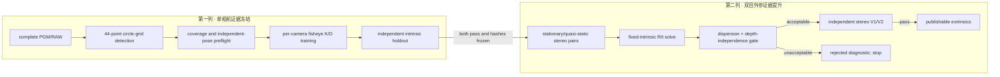
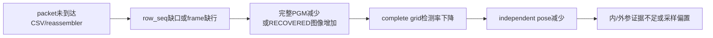
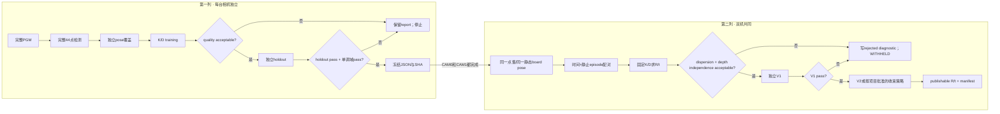

# PRG_CAM · 内参、双目外参与独立验证

> **PRG_CAM · PROJECT REVIEW & TRAINING SERIES**<br>
> 文档编号：08　版本：3.0　基线日期：2026-08-26<br>
> 适用对象：需要复刻二值圆阵内参、理解 K/D/R/t 或审查外参发布门的人<br>
> 当前状态：两路 120° 内参通过；外参候选因深度无关性失败而 withheld

## OBJECTIVE

从完整二值图像开始，解释 44 点物点、OpenCV fisheye K/D、双目 R/t、重投影误差、单调域、深度回归和独立 holdout；同时给出可复跑的 PowerShell 阶段命令，并禁止把“数值收敛”提升成“物理外参已发布”。

## INPUTS / DEPENDENCIES / RUN IDENTITY

| 项目 | 本章定义 |
|---|---|
| 适用仓库 | `D:\prg\prg_cam` |
| 当前相机身份 | CAM0 120° + CAM1 120°；不是已结束的 120°+160° 组合 |
| 图像几何 | 640×480，二值 `uint8` PGM/RAW |
| 标定板 | 4×11 非对称圆阵，44 个物点，基础间距 20 mm |
| 当前内参 | 两机均 `acceptable`，独立 holdout 均 `pass` |
| 当前外参 | 已完成配对和数值求解，但深度无关性失败；候选为 `unacceptable`、`publishable=false` |
| 证据身份 | `build/protocol/04_phase2_entry_manifest.json` |

> 本章目标｜读完后，应能解释每个 K、D、R、t 符号，能从 PGM 追到 OpenCV 调用，能独立复跑内参和外参诊断，并且不会把“数值能收敛”误写成“物理外参已发布”。

---

## 1. 本模块处在什么位置

标定不是接收机主循环的一部分。在线链路先把以太网包解析、按行监控、按帧重组并写成 PGM/RAW；标定程序随后离线读取这些文件。数据顺序是：

```text
FPGA/ETH packet
  -> Python parser/monitor/reassembler
  -> complete 640x480 binary PGM/RAW
  -> complete circle-grid detection
  -> single-camera K/D solve
  -> independent intrinsic holdout
  -> freeze both K/D and their SHA-256
  -> timestamp/stillness stereo pairing
  -> fixed-intrinsic R/t solve
  -> depth-independence and independent stereo holdout
  -> publish or withhold
```



因此，CRC、行完整性和标定检测属于不同证据层。CRC 通过只证明字节传输与约定一致；完整 PGM 只证明一帧可用；圆阵检测成功只证明这一帧找到完整 44 点；低 RMS 只证明给定模型对这些点拟合得好。它们不能互相替代。接收机的在线门见 `taxi_receiver/image_pipeline.py`，图像读入门见 `taxi_receiver/binary_calibration.py:444-467`。

主要入口如下：

| 阶段 | CLI | 实际实现 |
|---|---|---|
| 单机实时预检 | `preflight_calibration_frames.py` | 圆阵检测和 pose 去重 |
| 单机内参求解 | `calibrate_binary_camera.py` | `taxi_receiver/binary_calibration.py` |
| 单机独立验证 | `validate_binary_calibration.py` | `taxi_receiver/calibration_validation.py` |
| 双目静止阈值/配对 | `build_stereo_pairs.py` | `taxi_receiver/stereo_pairs.py` |
| 双目 R/t 求解 | `calibrate_binary_stereo.py` | `taxi_receiver/stereo_calibration.py` |
| 双目独立验证 | `validate_binary_extrinsics.py` | `taxi_receiver/extrinsic_validation.py` |

---

## 2. 坐标系与符号总表

数学式读不懂通常不是计算本身难，而是坐标系没固定。本文统一采用列向量。

| 符号 | 维度 | 单位 | 含义 |
|---|---:|---|---|
| \(P_b=[X_b,Y_b,Z_b]^T\) | 3×1 | mm | 标定板坐标系中的物点；本项目平面板的 \(Z_b=0\) |
| \(P_0,P_1\) | 3×1 | mm | 同一空间点分别在 CAM0、CAM1 坐标系的位置 |
| \(R_{cb}\) | 3×3 | 无量纲 | 从板坐标系旋转到相机 \(c\) 坐标系 |
| \(t_{cb}\) | 3×1 | mm | 板原点在相机 \(c\) 坐标系中的位置 |
| \(r\) / `rvec` | 3×1 | rad | Rodrigues 旋转向量；不是图像半径 |
| \(t\) / `tvec` | 3×1 | mm | 平移向量 |
| \(K\) | 3×3 | pixel | 相机内参矩阵 |
| \(f_x,f_y\) | 标量 | pixel | 水平、垂直等效焦距 |
| \(c_x,c_y\) | 标量 | pixel | 主点坐标，不必等于图像正中心 |
| \(D=[k_1,k_2,k_3,k_4]^T\) | 4×1 | 无量纲 | OpenCV fisheye 角度畸变系数 |
| \((u,v)\) | 2×1 | pixel | 图像坐标，原点位于左上角 |
| \((x,y)\) | 2×1 | 无量纲 | 透视归一化坐标 \((X_c/Z_c,Y_c/Z_c)\) |
| \(\theta\) | 标量 | rad | 入射光线与光轴的夹角 |
| \(\theta_d\) | 标量 | rad | 经过 KB 多项式后的畸变角 |
| \(R_{10},t_{10}\) | 3×3、3×1 | 无量纲、mm | CAM0 坐标到 CAM1 坐标的外参 |
| \(B=\lVert t_{10}\rVert_2\) | 标量 | mm | 双目基线长度 |
| \(e_i\) | 标量 | pixel | 第 \(i\) 个视图或双目对的重投影 RMSE |
| \(z_i\) | 标量 | mm | 第 \(i\) 个姿态在 CAM0 PnP 中的 `pose0.tvec[2]`，用于深度无关性回归 |

旋转矩阵满足 \(R^TR=I\) 且 \(\det R=1\)。`t_cam1_from_cam0_mm` 的三个数不是“三个镜头距离”，而是 CAM0 原点在 CAM1 坐标表达中的 x/y/z 分量。真正的镜头中心距离是三者的欧氏范数 \(B\)。当前 JSON 明确写出约定：

\[
P_1=R_{10}P_0+t_{10}.
\]

对应字段为 `R_cam1_from_cam0`、`t_cam1_from_cam0_mm`、`transform_convention`，生成点在 `taxi_receiver/stereo_calibration.py:839-855`。

---

## 3. 44 个物点是怎样建立的

### 3.1 非对称圆阵方程

令行号 \(r\in\{0,\ldots,10\}\)，列号 \(c\in\{0,\ldots,3\}\)，基础间距 \(s=20\) mm。物点坐标为：

\[
P_{r,c}=
\begin{bmatrix}
s\,[2c+(r\bmod 2)]\\
sr\\
0
\end{bmatrix},
\qquad j=4r+c.
\]

`r mod 2` 使奇数行在 x 方向错开一个基础间距；同一行相邻圆心相隔 \(2s\)，相邻行相隔 \(s\)。索引 \(j\) 采用先行后列，所以完整集合是 0…43。真实实现位于 `taxi_receiver/binary_calibration.py:120-135`：

```python
points = np.zeros((columns * rows, 3), np.float64)
index = 0
for row in range(rows):
    for column in range(columns):
        points[index, :2] = (
            (2 * column + (row & 1)) * spacing,
            row * spacing,
        )
        index += 1
return points
```

### 3.2 为什么“两机必须使用同一个点集”

若 CAM0 的第 26 项仍代表板上第 26 圆，而 CAM1 删除了该项，那么两个图像数组中的第 26 项不再对应同一个三维点。算法仍可能返回一个低 RMS 的数值，但它拟合的是错误对应关系。当前块 A 的策略不是取交集，而是直接拒绝不一致。

`intrinsic_point_set()` 的解析顺序位于 `taxi_receiver/extrinsic_config.py:61-142`：优先使用明确的 `used_point_indices`；否则用全集减 `excluded_point_indices`；只有 `used_point_count == rows*columns` 才能解释为全集；数量小于全集却没有索引时抛“点集不明确”。两机集合比较位于 `taxi_receiver/extrinsic_config.py:145-177`，求解实际切片位于 `taxi_receiver/stereo_calibration.py:691-725`，holdout 逐元素复核位于 `taxi_receiver/extrinsic_validation.py:480-504`。

不变量是：物点数组、CAM0 检测中心、CAM1 检测中心、stereoCalibrate 输入和 holdout 输入必须使用同一个、有序且可追溯的索引集合；外参 JSON 必须把该集合写入 `pattern.used_point_indices`。

---

## 4. 单相机 fisheye 模型：K、D 到底做什么

### 4.1 刚体变换到相机坐标

对某一张图，先把板上物点变换到相机坐标：

\[
P_c=R_{cb}P_b+t_{cb}
=\begin{bmatrix}X_c&Y_c&Z_c\end{bmatrix}^T.
\]

这里每一张训练图都有自己的 \(R_{cb},t_{cb}\)，因为板姿态在变化；K 和 D 对同一台固定焦距相机应保持不变。这正是“多 pose 标定”的含义：用多个板姿态共同约束一个 K/D，而不是把 pose 数量当成帧数量。

### 4.2 归一化与角度畸变

先计算：

\[
x=X_c/Z_c,\qquad y=Y_c/Z_c,\qquad
r=\sqrt{x^2+y^2},\qquad \theta=\arctan(r).
\]

OpenCV fisheye 使用 Kannala–Brandt 形式的奇次多项式：

\[
\theta_d=\theta\left(1+k_1\theta^2+k_2\theta^4+k_3\theta^6+k_4\theta^8\right).
\]

当 \(r>0\) 时，畸变后的归一化坐标为：

\[
x_d=x\,\theta_d/r,\qquad y_d=y\,\theta_d/r.
\]

当 \(r=0\) 时光线就在光轴上，极限值直接取中心，避免除零。最后用 K 映射到像素：

\[
K=\begin{bmatrix}
f_x&0&c_x\\
0&f_y&c_y\\
0&0&1
\end{bmatrix},\qquad
u=f_xx_d+c_x,\quad v=f_yy_d+c_y.
\]

`fisheye.calibrate` 求的是所有图共同的 \(f_x,f_y,c_x,c_y,k_1\ldots k_4\)，以及每张图自己的 `rvec/tvec`。调用点为 `taxi_receiver/binary_calibration.py:546-599`。输入 `objects` 是若干个 `(44,1,3)` 的 `float64` 数组，单位 mm；`images` 是对应的 `(44,1,2)` `float64` 像素数组；K 是 `(3,3)`，D 是 `(4,1)`。

### 4.3 `--fov-deg` 不是最后测得的视场角

`--fov-deg` 只用于生成初始焦距：fisheye 初值 \(f=(W/2)/(FOV/2)\)，见 `taxi_receiver/binary_calibration.py:497-509` 和 CLI 文本 `--fov-deg ... initialization only`。OpenCV 随后优化 K/D。因此不得把命令行的 120 写成“标定证明实际 FOV 恰好 120°”。它只是已知镜头类别提供的数值初值。

### 4.4 为什么约束 k4

`--fisheye-fix-k4` 令 \(k_4=0\)，只求 \(k_1,k_2,k_3\)；`--fisheye-fix-k3-k4` 只求前两项。高阶项自由度越高，越能降低训练 RMS，也越可能在观测范围以外弯折或产生非单调逆映射。约束不是“更准确”的同义词，而是在当前覆盖不足时用较少自由度换取数值稳定。代码会验证被固定项仍为零，否则抛 `OpenCV did not preserve fixed fisheye coefficients at zero`，见 `taxi_receiver/binary_calibration.py:574-599`。

---

## 5. 从 PGM 到完整圆阵检测

### 5.1 输入数据

`load_binary_image()` 在 `taxi_receiver/binary_calibration.py:444-467` 中读取：PGM 由 `cv2.imread(..., IMREAD_GRAYSCALE)` 得到二维数组；RAW 必须正好 `640*480` 字节并 reshape 成 `(480,640)`。两者最终被阈值化为只含 0/255 的 `uint8`。同名 `.pgm/.raw` 被视为同一帧，优先选 PGM，见 `binary_calibration.py:470-494`。

检测器先获得黑白连通轮廓，再依据圆点直径、轴比、弧覆盖率、椭圆残差和邻点间距筛选候选。`preflight_calibration_frames.py:397-406` 给出的项目默认值包括 4×11 非对称阵、最小圆直径 6 px、最大 120 px、最小网格间距 10 px、最小轴比 0.24、最小弧覆盖 0.42、最大椭圆残差 0.30、闭运算核 3。

严格模式要求找到完整 44 点。`candidate_count` 接近 44 但 `found=False` 只表示“候选数接近”，不表示可用于几何求解。单机 `pose` 是根据图像位置、尺度、倾斜等去重后的覆盖样本；双目 `selected_pose_pairs` 则还要满足 CAM0/CAM1 的时间与静止条件，二者不能互换。

### 5.2 实时预检实验

**目的**：采集时观察完整网格帧和独立 pose 是否增加，不参与最终 K/D 求解。

```powershell
$repo = 'D:\prg\prg_cam'
$receiverRoot = Join-Path $repo 'prg_cam.srcs\sources_1\tx\taxi_receiver_advanced\taxi_receiver'
$python = 'C:\Users\Z\AppData\Local\Python\pythoncore-3.14-64\python.exe'
$captureRoot = Join-Path $repo 'images\new_Temp\runs\20260824_120x120_intrinsic_train'
$liveRoot = Join-Path $repo 'build\runs\20260824_120x120_intrinsic_live'
New-Item -ItemType Directory -Force -Path (Join-Path $captureRoot 'cam0'),$liveRoot | Out-Null
& $python (Join-Path $receiverRoot 'preflight_calibration_frames.py') `
  (Join-Path $captureRoot 'cam0\*.pgm') `
  --watch --poll-interval 1 --min-poses 15 --zone-map `
  --report (Join-Path $liveRoot 'cam0_preflight_live.csv')
```

CAM1 窗口只把两处 `cam0` 改成 `cam1`。监控窗口是阻塞型长任务，这是预期行为；接收、CAM0 预检、CAM1 预检必须分别放在三个 PowerShell 窗口。若 live CSV 只有表头，含义是监控尚未写出可判定行，不能直接宣称“0% valid”。

---

## 6. 内参求解、异常剔除与 holdout

### 6.1 重投影误差

对第 \(i\) 张视图的 \(N\) 个圆心，观测点为 \(q_{ij}\)，用 K、D 和该视图姿态投影出的点为 \(\hat q_{ij}\)。本项目每视图 RMSE 为：

\[
e_i=\sqrt{\frac{1}{N}\sum_{j=1}^{N}\lVert \hat q_{ij}-q_{ij}\rVert_2^2}.
\]

代码逐字对应于 `taxi_receiver/binary_calibration.py:529-543`。单位是像素。它同时混合了圆心检测误差、模型误差、板尺寸/平面误差与该视图 pose 误差，所以低值不是“每个物理参数都正确”的单独证明。

### 6.2 鲁棒剔除门

令当前所有视图误差中位数为 \(m\)，MAD 为 \(\operatorname{median}|e_i-m|\)，用户硬上限为 \(h\)。每轮阈值为：

\[
\tau=\min\left(h,\max[m+0.15,\;m+3(1.4826)MAD]\right).
\]

每轮删除大于 \(\tau\) 的最差视图并重算，直到最差视图通过或达到最少视图数。实现位于 `taxi_receiver/binary_calibration.py:633-712`。`1.4826` 把正态分布下的 MAD 近似换算成标准差；0.15 px 是代码中的最小容差带，不是文献常数。

### 6.3 Training 命令

以下是新 run 模板，不覆盖历史证据。`$trainCam0` 与 `$trainCam1` 必须来自同一镜头固定状态下各自的 training 集，而 holdout 目录必须是独立采集。

```powershell
$runId = '20260824_120x120_intrinsics_run01'   # ← 每次改为唯一 ID
$auditRoot = Join-Path $repo "build\runs\$runId"
$trainRoot = Join-Path $repo "images\new_Temp\runs\${runId}_train"
$holdoutRoot = Join-Path $repo "images\new_Temp\runs\${runId}_holdout_v1"
$trainCam0 = Join-Path $trainRoot 'cam0'
$trainCam1 = Join-Path $trainRoot 'cam1'
$cam0Solve = Join-Path $auditRoot '01_cam0_solve'
$cam1Solve = Join-Path $auditRoot '02_cam1_solve'
$cam0Json = Join-Path $cam0Solve 'cam0_intrinsics.json'
$cam1Json = Join-Path $cam1Solve 'cam1_intrinsics.json'
New-Item -ItemType Directory -Force -Path $cam0Solve,$cam1Solve | Out-Null

& $python (Join-Path $receiverRoot 'calibrate_binary_camera.py') `
  (Join-Path $trainCam0 '*.pgm') `
  --camera-id 0 --pattern asymmetric --columns 4 --rows 11 `
  --spacing-mm 20 --dot-diameter-mm 10 --model fisheye `
  --fisheye-fix-k4 --fov-deg 120 --min-views 15 `
  --max-view-rmse-px 1.5 --output $cam0Json `
  --report (Join-Path $cam0Solve 'cam0_intrinsics.views.csv') `
  --diagnostics-dir (Join-Path $cam0Solve 'diagnostics')
$cam0Exit = $LASTEXITCODE

& $python (Join-Path $receiverRoot 'calibrate_binary_camera.py') `
  (Join-Path $trainCam1 '*.pgm') `
  --camera-id 1 --pattern asymmetric --columns 4 --rows 11 `
  --spacing-mm 20 --dot-diameter-mm 10 --model fisheye `
  --fisheye-fix-k4 --fov-deg 120 --min-views 15 `
  --max-view-rmse-px 1.5 --output $cam1Json `
  --report (Join-Path $cam1Solve 'cam1_intrinsics.views.csv') `
  --diagnostics-dir (Join-Path $cam1Solve 'diagnostics')
$cam1Exit = $LASTEXITCODE
```

**VALIDATE**：不要只看文件存在。

```powershell
$intrinsicRows = @(
  foreach ($item in @(
    @{ Camera='cam0'; Exit=$cam0Exit; Json=$cam0Json },
    @{ Camera='cam1'; Exit=$cam1Exit; Json=$cam1Json }
  )) {
    $doc = $null
    if (Test-Path -LiteralPath $item.Json -PathType Leaf) {
      $doc = Get-Content -Raw -LiteralPath $item.Json | ConvertFrom-Json
    }
    [pscustomobject]@{
      Camera = $item.Camera
      ExitCode = $item.Exit
      JsonExists = Test-Path -LiteralPath $item.Json -PathType Leaf
      Status = if ($null -ne $doc) { $doc.quality.status } else { 'NO_JSON' }
      RMS_px = if ($null -ne $doc) { $doc.quality.rms_px } else { $null }
      Views = if ($null -ne $doc) { $doc.quality.accepted_images } else { 0 }
    }
  }
)
$intrinsicRows | Format-Table -AutoSize
```

### 6.4 独立 holdout 命令

```powershell
$cam0HoldoutAudit = Join-Path $auditRoot '03_cam0_holdout_v1'
$cam1HoldoutAudit = Join-Path $auditRoot '04_cam1_holdout_v1'

& $python (Join-Path $receiverRoot 'validate_binary_calibration.py') `
  $cam0Json (Join-Path $holdoutRoot 'cam0\*.pgm') `
  --output-root $cam0HoldoutAudit --sample-count 30 `
  --min-holdout-views 15 --median-rmse-px 0.8 `
  --p95-rmse-px 1.2 --maximum-rmse-px 1.5 `
  --required-pass-fraction 0.9
$cam0HoldoutExit = $LASTEXITCODE

& $python (Join-Path $receiverRoot 'validate_binary_calibration.py') `
  $cam1Json (Join-Path $holdoutRoot 'cam1\*.pgm') `
  --output-root $cam1HoldoutAudit --sample-count 30 `
  --min-holdout-views 15 --median-rmse-px 0.8 `
  --p95-rmse-px 1.2 --maximum-rmse-px 1.5 `
  --required-pass-fraction 0.9
$cam1HoldoutExit = $LASTEXITCODE
```

输出目录必须在调用前不存在或为空；程序在非空目录上拒绝运行，避免混入旧报告。验证返回 0 表示 `pass`，返回 2 表示执行/输入错误，返回 3 表示报告已生成但质量门失败，依据 `taxi_receiver/calibration_validation.py:563-577`。

---

## 7. 内参数值域：为什么还要检查单调性

即使 training/holdout RMS 低，畸变多项式也可能在图像边缘折返，使一个畸变半径对应多个入射角。对 KB 多项式求导：

\[
\frac{d\theta_d}{d\theta}
=1+3k_1\theta^2+5k_2\theta^4+7k_3\theta^6+9k_4\theta^8.
\]

在实际图像四角所需的角度区间内必须保持大于零。`fisheye_domain_report()` 在 `taxi_receiver/extrinsic_config.py:210-290` 采样传感器网格、调用 `cv2.fisheye.undistortPoints`，检查有限性和一一映射，并输出：

| 字段 | 含义 |
|---|---|
| `required_corner_theta_deg` | 当前 640×480 四角要求模型覆盖到的最大光线角 |
| `monotonic_limit_theta_deg` | 导数首次不再为正前的边界；若未出现则到扫描上限 |
| `monotonic_margin_deg` | 单调边界减去四角要求；越小，边缘外推余量越少 |
| `finite_undistort_grid` | 网格去畸变是否全部为有限数 |

它检验的是函数可逆域，不是 RMS。二者都要通过；“没有出现 OpenCV 异常”也不能代替该检查。

---

## 8. 双目外参的几何关系

### 8.1 每个相机先各自看板

对同一静态板姿态，PnP 分别得到：

\[
P_0=R_{0b}P_b+t_{0b},\qquad
P_1=R_{1b}P_b+t_{1b}.
\]

消去 \(P_b\) 后：

\[
R_{10}=R_{1b}R_{0b}^{T},\qquad
t_{10}=t_{1b}-R_{10}t_{0b}.
\]

这就是每个 pose 对给出的相对外参种子，代码位于 `taxi_receiver/stereo_calibration.py:100-117`。固定支架的真实 \(R_{10},t_{10}\) 不应随着板的位置或深度改变。

### 8.2 全局 stereoCalibrate

求解器调用 `cv2.fisheye.stereoCalibrate`，并带 `CALIB_FIX_INTRINSIC`，见 `taxi_receiver/stereo_calibration.py:270-307`。这意味着两机 K/D 被视为冻结输入，只优化共同的 R/t。它不会替你修正错误内参；相反，内参残差会被迫投影到 R/t 中。

基线为：

\[
B=\sqrt{t_x^2+t_y^2+t_z^2}.
\]

旋转离散度把每个姿态的相对旋转 \(R_i\) 与汇总旋转 \(\bar R\) 比较：

\[
\Delta\phi_i=arccos\left(\frac{\operatorname{tr}(R_i\bar R^T)-1}{2}\right).
\]

平移离散度是：

\[
\Delta t_i=\lVert t_i-\bar t\rVert_2.
\]

中位数代表典型姿态的一致性，P95 代表尾部。它们衡量逐姿态散布，而不是简单除以 \(\sqrt n\) 后的均值标准误；当前发布门直接使用逐姿态指标，不能在报告里自行换成标准误。

### 8.3 交叉重投影与极线垂直误差

交叉重投影把 CAM0 解出的板姿态通过 R/t 转到 CAM1，再投影并与 CAM1 圆心比较，反方向也做一次；`bidirectional_rmse_px` 汇总两向误差，计算链见 `taxi_receiver/stereo_calibration.py:311-356`。它回答“同一个 R/t 能否把一边的几何预测到另一边”。

独立验证还调用 `cv2.fisheye.stereoRectify`，见 `taxi_receiver/extrinsic_validation.py:160-181`。校正后同一物点理想上位于同一水平扫描线，因此垂直残差为：

\[
e_{v,j}=|v'_{0,j}-v'_{1,j}|.
\]

RMSE、P95 和最大值在 `taxi_receiver/extrinsic_validation.py:184-205` 计算。大的垂直误差不是由 2 cm 基线“自然产生”的；正确 K/D、正确点对应和正确 R/t 本应解释不同视角。

---

## 9. 深度无关性：本项目外参为何被拒绝

固定支架的外参不应随板深度变化。当前实现把 CAM0 对板的 PnP 平移 z 分量 `pose0.tvec[2]` 定义为每个姿态的板深度 \(z_i\)，见 `taxi_receiver/stereo_calibration.py:410-417`。对每个轴 \(a\in\{x,y,z\}\)，用 \(z_i\) 回归该姿态估得的相机间平移分量：

\[
t_{a,i}=\alpha_a+\beta_a z_i+\varepsilon_i.
\]

| 符号 | 含义 |
|---|---|
| \(\alpha_a\) | 深度为零时的截距，仅为回归参数，不宜作物理基线 |
| \(\beta_a\) | 深度每增加 1 mm，估计平移轴变化多少 mm；单位 mm/mm |
| \(\varepsilon_i\) | 该姿态未被线性趋势解释的残差 |
| \(\rho_a\) | \(z_i\) 与 \(t_{a,i}\) 的相关系数，范围 -1…1 |
| \(\Delta t_a\) | `predicted_drift_over_depth_span_mm`，等于 \(\beta_a(z_{max}-z_{min})\) |

当前 `and` 规则只有在 \(|\rho_a|>0.3\) 且 \(|\beta_a|>0.005\) mm/mm 同时成立时，才把该轴判为系统性漂移。源码默认值和理由位于 `taxi_receiver/stereo_calibration.py:644-654`，门的应用位于 `stereo_calibration.py:796-809`。这两个阈值是当前代码冻结的工程判据，不是由相机理论自动推导的自然常数。

直白解释：如果板从 0.53 m 移到 0.74 m，算法算出的“两个镜头固定距离”也跟着规律变化，那么镜头当然没有真的在支架上移动；更可能是 K/D 的畸变形状、板点模型、检测中心或同步残差在不同尺度下形成了系统偏差。低 stereo RMS 仍可能出现，因为每个局部深度附近都能拟合得很好，而跨深度不一致揭露了它不是同一个刚体变换。

---

## 10. 两个只用于理解误差方向的近似式

这些式子没有作为本项目质量门直接实现，必须标为“解释模型”，不能当成已测结论。

### 10.1 主点误差到角度误差

小角度下：

\[
\Delta\theta\approx\frac{\Delta c_x}{f}.
\]

\(\Delta c_x\) 是主点横向误差，单位 pixel；\(f\) 是同方向焦距，单位 pixel；比值为弧度。它说明焦距越短的广角镜头，同样 1 px 主点偏差对应更大的光线角偏差。它不能单独证明某次 tx/ty 漂移由主点造成。

### 10.2 偏心目标与径向畸变耦合

用于量级直觉的近似为：

\[
\delta\approx f\,k_1\left(\frac{R}{f}\right)\left(\frac{a}{f}\right)^2.
\]

\(\delta\) 是像素域质心偏差的近似量；\(f\) 是像素焦距；\(k_1\) 是一阶 fisheye 系数；\(R\) 是目标中心离主点的像素半径；\(a\) 是圆斑的像素尺度。它表达“越靠边、圆斑越大、径向项越强，圆心估计与畸变模型的耦合越明显”。这不是 `binary_calibration.py` 中被直接求值的公式，也不能替代实际 per-view CSV。

---

## 11. 双目复刻实验：静止阈值、配对、求解和 V1/V2

### 11.1 RUN IDENTITY 与 PRECHECK

```powershell
$repo = 'D:\prg\prg_cam'
$receiverRoot = Join-Path $repo 'prg_cam.srcs\sources_1\tx\taxi_receiver_advanced\taxi_receiver'
$python = 'C:\Users\Z\AppData\Local\Python\pythoncore-3.14-64\python.exe'
$runId = '20260824_120x120_stereo_run01'    # ← 新实验必须唯一
$captureBase = Join-Path $repo "images\new_Temp\runs\$runId"
$auditBase = Join-Path $repo "build\runs\$runId"
$staticRoot = Join-Path $captureBase '00_static'
$trainRoot = Join-Path $captureBase '01_train'
$v1Root = Join-Path $captureBase '02_holdout_v1'
$v2Root = Join-Path $captureBase '03_holdout_v2'
$staticAudit = Join-Path $auditBase '00_static'
$pairAudit = Join-Path $auditBase '01_pairs'
$solveAudit = Join-Path $auditBase '02_solve'
$v1PairAudit = Join-Path $auditBase '03_v1_pairs'
$v1Audit = Join-Path $auditBase '04_v1_validation'
$v2PairAudit = Join-Path $auditBase '05_v2_pairs'
$v2Audit = Join-Path $auditBase '06_v2_validation'
$cam0Intrinsic = 'D:\prg\prg_cam\build\cam1_replacement_20260820_run01\17_cam0_k1k2k3_solve\cam0_intrinsics_k1k2k3.json'
$cam1Intrinsic = 'D:\prg\prg_cam\build\cam1_replacement_20260820_run01\19_cam1_k1k2k3_solve\cam1_intrinsics_k1k2k3.json'

foreach ($required in $python,$cam0Intrinsic,$cam1Intrinsic) {
  if (!(Test-Path -LiteralPath $required -PathType Leaf)) { throw "缺少输入：$required" }
}
foreach ($out in $staticAudit,$pairAudit,$solveAudit,$v1PairAudit,$v1Audit,$v2PairAudit,$v2Audit) {
  if ((Test-Path -LiteralPath $out) -and @(Get-ChildItem -LiteralPath $out -Force -ErrorAction SilentlyContinue).Count -gt 0) {
    throw "输出目录非空，换 run_id，不得覆盖：$out"
  }
}
```

该 PRECHECK 是 dry-run 的核心：只打印/验证将使用的 K/D、数据根和输出根，不进行求解。采集命令与三窗口观察法见 Topic 07；本章从已完成双路落盘开始。

### 11.2 由固定画面估计静止阈值

```powershell
& $python (Join-Path $receiverRoot 'build_stereo_pairs.py') $staticRoot `
  --cam0-intrinsics $cam0Intrinsic --cam1-intrinsics $cam1Intrinsic `
  --output-root $staticAudit --estimate-stillness-only `
  --window-frames 5 --min-static-frames 200
$staticExit = $LASTEXITCODE
$stillnessPath = Join-Path $staticAudit 'stillness_config.json'
if ($staticExit -ne 0 -or !(Test-Path -LiteralPath $stillnessPath -PathType Leaf)) {
  throw "静止阈值生成失败，退出码：$staticExit"
}
```

若报 `output root is not empty`，不是路径不存在，而是程序在保护旧证据。正确处理是换新的 `$runId/$staticAudit`；只有用户明确决定废弃该次空跑时，才可在人工确认精确目录后删除。不要先 `New-Item $staticAudit` 再放日志进去，因为 CLI 要求输出根为空。

### 11.3 Training 配对

```powershell
& $python (Join-Path $receiverRoot 'build_stereo_pairs.py') $trainRoot `
  --cam0-intrinsics $cam0Intrinsic --cam1-intrinsics $cam1Intrinsic `
  --output-root $pairAudit --stillness-config $stillnessPath `
  --pairing-mode quasi_static_episode_minimum `
  --max-center-dt-ms 33.5 --min-pairs 15
$pairExit = $LASTEXITCODE
$pairSummaryPath = Join-Path $pairAudit 'pairing_summary.json'
$pairsPath = Join-Path $pairAudit 'pairs.csv'
if (!(Test-Path -LiteralPath $pairSummaryPath -PathType Leaf) -or !(Test-Path -LiteralPath $pairsPath -PathType Leaf)) {
  throw "没有生成双目配对证据，退出码：$pairExit"
}
$pairSummary = Get-Content -Raw -LiteralPath $pairSummaryPath | ConvertFrom-Json
$pairSummary.status
$pairSummary.counts | Format-List
$pairSummary.failures
```

`quasi_static_episode_minimum` 的含义是：把连续低运动区间视为一个物理停留 episode，每个 episode 只保留运动代价最小的一帧，而不是把同一停留的数百帧当数百个独立 pose。该模式仍需两机均完整检测、时间中心差通过、点集一致。`selected_pose_pairs=0` 时必须先看 `cam0_complete_grids`、`cam1_complete_grids`、`timestamp_matched_candidates`、`stationary_pose_episodes` 的第一个零。

### 11.4 R/t 求解与发布门

```powershell
$extrinsics = Join-Path $solveAudit 'cam0_to_cam1_extrinsics.json'
$pairReport = Join-Path $solveAudit 'cam0_to_cam1_extrinsics.pairs.csv'
New-Item -ItemType Directory -Force -Path $solveAudit | Out-Null
& $python (Join-Path $receiverRoot 'calibrate_binary_stereo.py') $pairsPath `
  --pairing-summary $pairSummaryPath `
  --cam0-intrinsics $cam0Intrinsic --cam1-intrinsics $cam1Intrinsic `
  --stillness-config $stillnessPath `
  --output $extrinsics --report $pairReport --min-pairs 15
$solveExit = $LASTEXITCODE
```

退出码来自 `taxi_receiver/stereo_calibration.py:933-986`：0 为 `acceptable` 且写出正式 JSON；2 为输入/执行错误；3 为 `unacceptable`，拒绝写正式 JSON但保留 rejected 诊断；4 为 `limited` 被 `--allow-limited` 覆盖写出，仍是非零。`--allow-limited` 永远不能把 `unacceptable` 改成 acceptable。

### 11.5 V1 独立验证

只有 `$solveExit -eq 0`、正式 `$extrinsics` 存在且 JSON 的 `quality.gate.publishable` 为 true，才允许消费独立 V1。否则应该收束为诊断结论，不要用 rejected JSON 强行跑 holdout。

```powershell
$solveDoc = Get-Content -Raw -LiteralPath $extrinsics | ConvertFrom-Json
if ($solveExit -ne 0 -or $solveDoc.quality.status -ne 'acceptable' -or !$solveDoc.quality.gate.publishable) {
  throw 'Training 外参未通过发布门，不得消费 V1'
}

& $python (Join-Path $receiverRoot 'build_stereo_pairs.py') $v1Root `
  --cam0-intrinsics $cam0Intrinsic --cam1-intrinsics $cam1Intrinsic `
  --output-root $v1PairAudit --stillness-config $stillnessPath `
  --pairing-mode quasi_static_episode_minimum `
  --max-center-dt-ms 33.5 --min-pairs 15
$v1PairExit = $LASTEXITCODE

$v1Pairs = Join-Path $v1PairAudit 'pairs.csv'
$v1PairSummary = Join-Path $v1PairAudit 'pairing_summary.json'
& $python (Join-Path $receiverRoot 'validate_binary_extrinsics.py') `
  $extrinsics $v1Pairs --pairing-summary $v1PairSummary `
  --cam0-intrinsics $cam0Intrinsic --cam1-intrinsics $cam1Intrinsic `
  --stillness-config $stillnessPath --output-root $v1Audit `
  --min-holdout-pairs 15
$v1Exit = $LASTEXITCODE
$v1SummaryPath = Join-Path $v1Audit 'holdout_summary.json'
if (!(Test-Path -LiteralPath $v1SummaryPath -PathType Leaf)) {
  throw "V1 未生成 summary；先检查上方 Python 原始错误和退出码 $v1Exit"
}
$v1 = Get-Content -Raw -LiteralPath $v1SummaryPath | ConvertFrom-Json
$v1.status
$v1.counts | Format-List
$v1.quality | Format-List
```

V2 使用全新的 `$v2Root/$v2PairAudit/$v2Audit` 重复 V1，不得复用 V1 图像或输出目录。V1 已提供独立证据时，V2 是额外复验而非训练的一部分；在时间受限的诊断收束中可以标 `NOT RUN`，但不能写成 `pass`。

---

## 12. 阈值来源与状态语义

| 判据 | 当前值 | 来源 | 分类 |
|---|---:|---|---|
| 单机训练整体 RMS 提示 | 0.8 px | `binary_calibration.py:764-765` | 代码默认工程目标 |
| 单机训练最大接受视图提示 | 1.2 px | `binary_calibration.py:766-767` | 代码默认工程目标 |
| 单机 holdout median/P95/max | 0.8/1.2/1.5 px | `calibration_validation.py:448-450` | 代码默认发布门 |
| 单机 holdout 通过比例 | 0.90 | `calibration_validation.py:451` | 代码默认发布门 |
| stereo PnP 最大 RMSE | 1.5 px | `stereo_calibration.py:636` | 代码默认输入门 |
| stereo RMS 目标 | 1.0 px | `stereo_calibration.py:641` | 代码默认工程目标 |
| 旋转离散度目标 | 0.5° | `stereo_calibration.py:642` | provisional 工程目标 |
| 平移离散度目标 | `max(0.5 mm, 0.01B)` | `stereo_calibration.py:643,774-795` | provisional 工程目标 |
| 深度相关系数/斜率 | 0.3 / 0.005 mm/mm | `stereo_calibration.py:644-654` | 代码冻结的系统性门 |
| stereo holdout median/P95/max | 0.8/1.2/1.5 px | `extrinsic_validation.py:410-412` | 代码默认发布门 |
| rectified vertical P95 | 1.2 px | `extrinsic_validation.py:414` | 代码默认发布门 |

`acceptable` 是训练求解没有 failure/warning；`limited` 是没有 failure 但有 warning；`unacceptable` 是至少一个 failure；`pass/fail` 用于独立验证；`ready/not_ready` 用于配对证据；`NOT RUN` 表示没执行，绝不是零误差。阈值都必须注明“代码默认/工程冻结”，不可包装成普适理论常数。

---

## 13. 当前 120°+120° 的实测证据

### 13.1 内参

| 指标 | CAM0 | CAM1 | 解释 |
|---|---:|---:|---|
| JSON | `17_cam0_k1k2k3_solve/cam0_intrinsics_k1k2k3.json` | `19_cam1_k1k2k3_solve/cam1_intrinsics_k1k2k3.json` | 完整路径见本章末 |
| `quality.status` | acceptable | acceptable | 训练门通过 |
| 接受视图 | 35 | 33 | 不是总 PGM 数 |
| training RMS | 0.23785644462112296 px | 0.5590240162673038 px | 两机各自拟合误差 |
| holdout status | pass | pass | 独立图像验证 |
| holdout median | 0.4292355918336487 px | 0.2829206832581376 px | 均低于 0.8 px 门 |
| holdout P95 | 0.8982974735338685 px | 0.7770839489858042 px | 均低于 1.2 px 门 |
| holdout max | 1.4538942744373111 px | 1.3158356663344977 px | 均低于 1.5 px 门 |

CAM0：

\[
K_0=\begin{bmatrix}
917.1488770712929&0&345.6998668321345\\
0&918.9368952663718&236.38940223916632\\
0&0&1
\end{bmatrix},
\]

\[
D_0=[-0.05699385287355732,-0.38495169335629775,1.326708856713784,0]^T.
\]

CAM1：

\[
K_1=\begin{bmatrix}
907.9459810342756&0&343.98858217703264\\
0&909.4433327650102&243.59406799032914\\
0&0&1
\end{bmatrix},
\]

\[
D_1=[-0.08646964674978173,0.11351388646648687,0.08087487693638265,0]^T.
\]

### 13.2 外参候选

配对证据 `build/stereo_final_20260821/01_pairs/pairing_summary.json` 为 `ready`：23 个 selected pose pairs，最低要求 20，24 个 stationary episodes，147 个 timestamp candidates，物点集合为 full44。

候选 `build/stereo_final_20260821/02_solve/cam0_to_new_cam1_extrinsics.rejected.json`：

\[
R_{10}=\begin{bmatrix}
0.9939701644056097&0.01840519272683278&-0.10809514860609334\\
-0.01523372576852538&0.9994310260772846&0.030092485994270987\\
0.1085875032897185&-0.028264341400325806&0.9936850009608231
\end{bmatrix},
\]

\[
t_{10}=[25.022035339080507,0.39777680786049047,1.652648399504591]^T\text{ mm},
\quad B=25.079707447086587\text{ mm}.
\]

| 指标 | 实测 | 门/期望 | 判读 |
|---|---:|---:|---|
| accepted pairs | 20/23 | ≥20 | 数量满足 |
| stereo RMS | 0.16781309681782364 px | 1.0 px target | 数值拟合低 |
| rotation dispersion median | 0.20243790057208932° | 0.5° | 满足 |
| translation dispersion median | 1.9064783779398544 mm | 0.5 mm | warning |
| depth range | 531.5015109993499…741.3710907187772 mm | 必须可评估 | span 209.8695797194273 mm |
| tx corr/slope/drift | -0.343737 / -0.00949057 / -1.99178 mm | 0.3 / 0.005 | fail |
| ty corr/slope/drift | -0.306521 / -0.00714761 / -1.50007 mm | 0.3 / 0.005 | fail |
| overall status | unacceptable | acceptable | FAIL |
| publishable | false | true | WITHHELD |
| V1/V2 | NOT RUN / NOT RUN | 独立 holdout | 未消费 |

结论必须写成：双目配对和数值优化已经实现，R/t 候选具有低训练重投影误差，但 tx/ty 随目标深度系统漂移，违反刚体外参不变量；所以该候选只作诊断证据，不能正式发布。不能写成“OpenCV 外参函数失效”，也不能写成“120°+120° 理论上不可标定”。

---

## 14. Observed vs Expected

| Probe | Expected | Current observed | Interpretation |
|---|---|---|---|
| 两机内参身份 | JSON 可读、SHA 固定 | manifest 已记录两份 SHA | 可追溯 |
| 两机物点集合 | 逐元素相同 | full44/full44 | PASS |
| 单机 training | `acceptable` | 两机均 acceptable | PASS |
| 单机独立 holdout | `pass` | 两机均 pass | PASS |
| fisheye 单调域 | 覆盖实际四角 | CAM0 余量 63.0765°；CAM1 62.9740° | PASS |
| stereo 配对 | ready 且 ≥20 | 23 selected | PASS |
| stereo 数值 RMS | ≤1.0 px target | 0.1678 px | PASS，但仅数值层 |
| R/t 随板深度 | 不呈系统趋势 | tx、ty 同时越 correlation/slope 门 | FAIL |
| 外参发布 | acceptable + publishable | unacceptable + false | WITHHELD |
| 外参 V1/V2 | 在发布候选上独立验证 | NOT RUN / NOT RUN | 不得提升证据 |

---

## 15. 常见失败签名与下一步

| 原始症状/报错 | 实际含义 | 先检查 | 下一步 |
|---|---|---|---|
| `only N usable detections` | 完整圆阵视图少于 `--min-views` | views CSV 的 `found/reason` | 改采集覆盖或成像，不降低几何事实 |
| `output root is not empty` | 防止旧报告混入 | 当前变量是否仍指旧 attempt | 换唯一 run ID；不要盲删历史 |
| `point set is ambiguous` | 数量小于全集但没记录索引 | 两份 intrinsic JSON 的 `pattern` | 用可追溯点集重标 |
| `intrinsic point sets differ` | 两机物点索引不一致 | cam0-only/cam1-only 差集 | 用同一点集重标；当前禁止取交集 |
| `selected_pose_pairs=0` | 尚未形成双目独立姿态 | first-zero 四个 pairing counts | 查检测、时间、静止 episode |
| stereo scan 完成后长时间计算 | OpenCV 在多 pair 上进行全局优化 | pair 数及任务管理器 CPU | 用 episode minimum 控制独立姿态，不把 410 密集帧作最终输入 |
| 低 RMS 但 depth fail | 局部拟合好，跨深度 R/t 不恒定 | 轴的 corr、slope、drift | 检查 K/D、圆心系统偏差、板尺度/刚性与深度覆盖 |
| `holdout_summary.json` 不存在 | 前一 CLI 已在写报告前失败 | 原始 stderr 与 `$LASTEXITCODE` | 不继续 `Get-Content`；先修第一处错误 |
| `--allow-limited` 后退出非零 | 候选仍是 limited | JSON status/gate | 仅诊断，不写 PASS |
| rejected JSON 有 R/t | 诊断文件，不是正式外参 | `quality.status`、`gate.publishable` | 不传给部署或正式 V1 |

---

## 16. 本章 PASS/FAIL 与当前收束动作

单相机内参链路：**PASS**。两台当前 120° 相机均有冻结 K/D、训练 acceptable、独立 holdout pass 和单调域证据。

双目算法链路：**IMPLEMENTED / STAGE-VALIDATED**。配对、点集一致性、固定 K/D 求解、交叉重投影、深度无关性和 holdout 入口均存在并有证据。

当前双目物理发布：**FAIL / WITHHELD**。现有候选深度无关性失败，正式 JSON 不应存在，V1/V2 保持 NOT RUN。本阶段的正确收束是保留 rejected JSON、pairs CSV、pairing summary、两机 intrinsic SHA 和 manifest；不得把低 RMS 单独提升为成功外参。

当前正式证据路径：

- CAM0 K/D：`build/cam1_replacement_20260820_run01/17_cam0_k1k2k3_solve/cam0_intrinsics_k1k2k3.json`
- CAM0 holdout：`build/cam1_replacement_20260820_run01/18_cam0_k1k2k3_validation/holdout_summary.json`
- CAM1 K/D：`build/cam1_replacement_20260820_run01/19_cam1_k1k2k3_solve/cam1_intrinsics_k1k2k3.json`
- CAM1 holdout：`build/cam1_replacement_20260820_run01/20_cam1_k1k2k3_validation/holdout_summary.json`
- stereo pairing：`build/stereo_final_20260821/01_pairs/pairing_summary.json`
- rejected diagnostic：`build/stereo_final_20260821/02_solve/cam0_to_new_cam1_extrinsics.rejected.json`
- Phase 2 identity：`build/protocol/04_phase2_entry_manifest.json`

下一阅读顺序：先读 Topic 07 复刻双路采集，再用本章完成 K/D 与 R/t 判读；出现任一零计数或状态矛盾时转 Topic 09，禁止越层猜因。

## 17. Host packet loss怎样传播到标定证据

标定模块不直接处理Ethernet packet，但一个未记录packet通常对应一条80-byte图像行。严格模式下，单行缺失可能使完整帧不再发布；即使恢复模式补零，`present_rows/missing_rows`仍必须保留，防止把“没有收到”误当成“真实全黑”。因此Host丢包会依次表现为：



这条链只能解释“有效证据减少”，不能解释固定K/D下的系统性深度漂移、宽视场边缘模型不可逆或不同相机焦距误差。若PGM已经完整且`rows_v2.csv`无frame缺行，后续高RMSE应停在图像/几何层，不应继续归咎于Host publisher。

MATLAB工具输出的几个字段用于Discussion时应这样引用：

| 字段 | 可支持的论点 | 不能支持的论点 |
|---|---|---|
| `RecordedInvalidRows` | 已到CSV但被协议/重组门拒绝 | CSV之前丢了多少 |
| `EstimatedMissingPackets` | `row_seq`存在前向缺口 | drop一定发生在Host |
| `MissingRows`/`CompleteFrame` | frame能否由480个唯一accepted row组成 | 圆阵一定可检测 |
| `PrimaryReason` | CRC、sync、duplicate等已记录原因 | 未记录packet的唯一物理原因 |

遗留S2 A/B中所有已记录行均accepted，而序列缺口显著，证明“无效行”主要是完全未进入CSV的缺失事件。该结果适合用于讨论架构吞吐和证据可见性，不适合与当前120°+120° K/D或R/t数值合并成同一实验run。

## 18. 实现模块图与数据类型合同

> **审计结论｜D4是离线CLI薄入口和四个算法模块的组合。CLI负责参数/退出码，算法模块负责检测、求解和报告；任何JSON存在性检查都必须发生在CLI成功写出之后。**

| 阶段 | CLI入口 | 实现模块 | 核心输入dtype/shape | 核心输出 |
|---|---|---|---|---|
| 圆阵检测/预检 | `preflight_calibration_frames.py` | `binary_calibration.py` | 二值图`uint8 (480,640)` | centers `float64 (N,2)`、preflight CSV |
| 单机K/D | `calibrate_binary_camera.py` | `binary_calibration.py` | object `(N,1,3)`、image `(N,1,2)` | K `(3,3)`、D `(4,1)`、per-view r/t |
| 单机holdout | `validate_binary_calibration.py` | `calibration_validation.py` | frozen K/D + 独立PGM | `holdout_summary.json`、`holdout_views.csv` |
| 内参合同 | 由双目CLI调用 | `extrinsic_config.py` | 两份intrinsic JSON | 同一精确点集、单调域报告 |
| 静止/配对 | `build_stereo_pairs.py` | `stereo_pairs.py` | 两路sidecar/PGM + K/D | `pairs.csv`、`pairing_summary.json` |
| 固定K/D外参 | `calibrate_binary_stereo.py` | `stereo_calibration.py` | 同一物点+两路像点 | R `(3,3)`、t `(3,1)`、rejected或publishable JSON |
| 外参holdout | `validate_binary_extrinsics.py` | `extrinsic_validation.py` | frozen K/D、R/t、独立pairs | cross RMSE、rectified vertical、summary |

OpenCV中的`image_size`顺序是`(width,height)=(640,480)`，而NumPy灰度图shape是`(height,width)=(480,640)`。把二者互换可能仍能进入函数，但主点、焦距初值和映射尺寸都会被错误解释；这是复刻时必须显式检查的接口，不应靠“函数没有抛异常”判断。

## 19. 方程、代码和报告字段的逐项映射

| 数学对象/判据 | 代码调用或函数 | 输入 | 报告字段/证据 | 解释边界 |
|---|---|---|---|---|
| (P_{r,c})非对称阵 | object-point builder | rows/cols/spacing | `pattern.*` | 定义物理点，不检测像点 |
| (K,D) KB模型 | `cv2.fisheye.calibrate` | 多视图objects/images | `camera_matrix`、`distortion_coefficients`、`quality.rms_px` | training拟合，不是holdout |
| (hat q_{ij}) | `cv2.fisheye.projectPoints` | K/D、rvec/tvec、物点 | per-view RMSE | 像素拟合，不证明尺度正确 |
| PnP板姿态 | `undistortPoints` + `solvePnP` | frozen K/D、单图点 | board tilt/depth、pose | 每帧板姿态，不是相机间R/t |
| (R_{10},t_{10}) | `cv2.fisheye.stereoCalibrate` | 同一点集、两路像点、frozen K/D | stereo RMS、R/t、baseline | 训练候选 |
| 极线垂直误差 | `stereoRectify` + `undistortPoints` | frozen K/D/R/t、holdout点 | rectified vertical P95 | 独立几何验证 |
| (t_a=\alpha+\beta z) | depth-independence regression | per-pose t与board depth | corr/slope/drift/status | 刚体一致性，不是随机散布 |
| 单调性导数 | `fisheye_domain_report` | K/D、image size | required/limit/margin | 可逆域，不是重投影误差 |

阈值必须同时记录“值”和“来源”。当前0.8/1.2/1.5 px、0.5°、0.5 mm、0.005 mm/mm等值由当前CLI/实现默认或本项目冻结命令给出，属于工程发布判据；本文未把它们宣称为OpenCV理论常数或文献普适阈值。

## 20. 点集块A：记录与计算不得分叉

`intrinsic_point_set()`的当前策略是严格块A：采用明确`used_point_indices`；否则由`excluded_point_indices`推出；只有`used_point_count`等于完整网格时才能解释为全集；其余情况直接报“点集不明确”。核心实现位于`extrinsic_config.py:61-142`：

```python
if "used_point_indices" in pattern:
    used = parse_indices("used_point_indices")
    _require(bool(used), "intrinsic pattern.used_point_indices must not be empty")
    if used_count is not None:
        _require(
            used_count == len(used),
            "intrinsic pattern.used_point_count "
            f"is {used_count}, but used_point_indices contains {len(used)} indices",
        )
    if "excluded_point_indices" in pattern:
        excluded = parse_indices("excluded_point_indices")
        expected = frozenset(range(total)) - excluded
        _require(
            used == expected,
            "intrinsic used_point_indices conflicts with excluded_point_indices",
        )
    return used

if "excluded_point_indices" in pattern:
    excluded = parse_indices("excluded_point_indices")
    used = frozenset(range(total)) - excluded
    _require(bool(used), "intrinsic excluded_point_indices removes every object point")
    if used_count is not None:
        _require(
            used_count == len(used),
            "intrinsic pattern.used_point_count "
            f"is {used_count}, but excluded_point_indices leaves {len(used)} indices",
        )
    return used

if used_count == total:
    return frozenset(range(total))

raise ExtrinsicValidationError(
    "intrinsic point set is ambiguous (点集不明确): used_point_count is smaller "
    "than the full grid or missing, but no explicit point-index field is present"
)
```

两机点集不一致时禁止warning、禁止取交集、禁止继续求解。即使集合相同，顺序也必须固定为排序后的index顺序，并同时切片object points、cam0 centers、cam1 centers。输出外参JSON记录同一列表；holdout在`extrinsic_validation.py:480-504`逐元素核对记录顺序与当前内参集合：

```python
recorded_indices = tuple(extrinsic_doc["pattern"]["used_point_indices"])
expected_indices = tuple(sorted(points0))
if recorded_indices != expected_indices:
    raise ExtrinsicValidationError(
        "extrinsic pattern.used_point_indices does not match the intrinsic point set: "
        f"recorded order={list(recorded_indices)}, "
        f"expected order={list(expected_indices)}"
    )
```

这道门解决的是“JSON说43点、计算实际44点”的静默不一致；它不会自动改善K/D，也不会把一个`unacceptable`外参变成`acceptable`。

## 21. OpenCV求解调用与冻结不变量

单机fisheye调用先把每视图物点/像点变成`float64`，并根据CLI约束固定高阶系数（`binary_calibration.py:565-587`）：

```python
objects = [object_points.reshape(-1, 1, 3).astype(np.float64) for _ in image_points]
images = [points.reshape(-1, 1, 2).astype(np.float64) for points in image_points]
rms, K, D, rvecs, tvecs = cv2.fisheye.calibrate(
    objects,
    images,
    image_size,
    K0,
    np.zeros((4, 1), dtype=np.float64),
    flags=flags,
    criteria=criteria,
)
```

双目调用显式`CALIB_FIX_INTRINSIC`，并在OpenCV返回后逐元素检查K0/D0/K1/D1没有被改变（`stereo_calibration.py:277-307`）：

```python
objects = [object_points.reshape(-1, 1, 3).astype(np.float64) for _ in records]
points0 = [record.selected.points0.reshape(-1, 1, 2).astype(np.float64) for record in records]
points1 = [record.selected.points1.reshape(-1, 1, 2).astype(np.float64) for record in records]
input_matrices = (K0.copy(), D0.copy(), K1.copy(), D1.copy())
flags = cv2.fisheye.CALIB_FIX_INTRINSIC
result = cv2.fisheye.stereoCalibrate(
    objects,
    points0,
    points1,
    input_matrices[0],
    input_matrices[1],
    input_matrices[2],
    input_matrices[3],
    image_size,
    flags=flags,
    criteria=(cv2.TERM_CRITERIA_EPS | cv2.TERM_CRITERIA_MAX_ITER, maximum_iterations, epsilon),
)
rms, solved_K0, solved_D0, solved_K1, solved_D1, rotation, translation = result[:7]
frozen = (K0, D0, K1, D1)
solved = (solved_K0, solved_D0, solved_K1, solved_D1)
for name, before, after in zip(("K0", "D0", "K1", "D1"), frozen, solved, strict=True):
    if not np.allclose(before, after, rtol=0.0, atol=1e-12):
        raise ValueError(f"CALIB_FIX_INTRINSIC changed frozen {name}")
```

因此“外参求解自动调整内参”在当前实现中不成立。深度漂移失败时，应回到冻结K/D覆盖、目标质心和物理板模型审计，或重新采集；不能期待stereoCalibrate在同一调用中修复K/D。

## 22. Training—Holdout状态ASM与证据提升规则



状态词必须按原文使用：`not_ready`表示配对证据不足；`limited`表示候选可用于诊断但不自动发布；`unacceptable`表示质量门明确失败，`--allow-limited`也不能覆盖；`pass`是独立验证结果；`NOT RUN`表示根本没有进入该阶段。历史训练数据、V1和V2不得混用，训练pair出现在holdout时应由overlap检查拒绝。

## 23. 文档级验收摘要

- 能从完整PGM追到圆阵中心、K/D、独立holdout、点集合同、配对、R/t和发布门。
- 能逐符号解释K、D、R、t、baseline、RMSE、dispersion、depth correlation/slope/drift。
- 能说明低training RMS为何不等于物理外参有效，并用当前120°+120° rejected JSON给出实证。
- 能用真实源码证明两机点集逐元素一致、K/D冻结和holdout记录一致性。
- 能区分工程阈值、代码默认、实验观察和解释性近似公式，禁止把任一类别写成普适理论常数。
