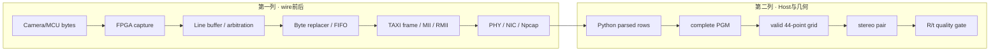
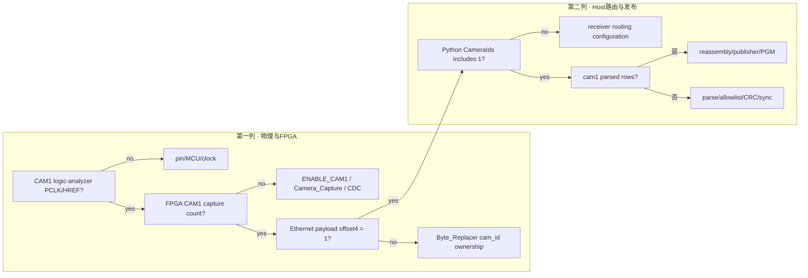
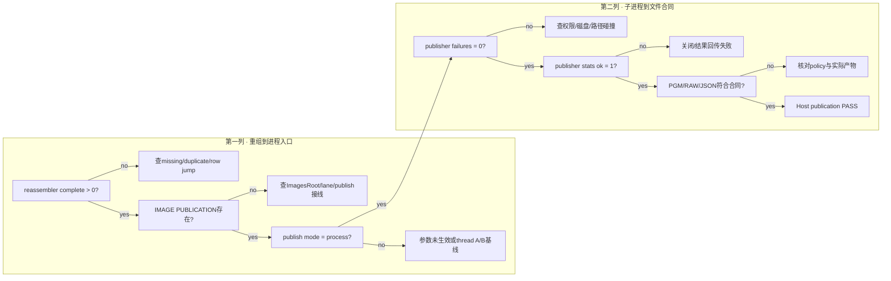
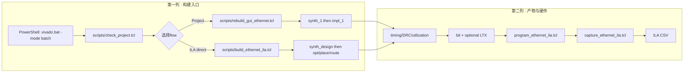
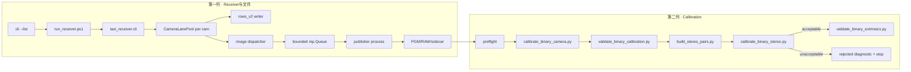
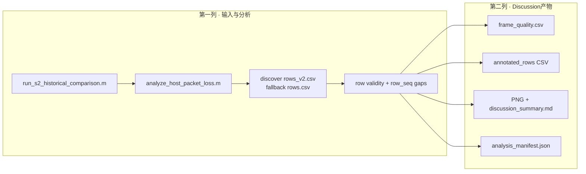

# PRG_CAM · 故障签名、逐层二分与脚本调用索引

> **PRG_CAM · PROJECT REVIEW & TRAINING SERIES**<br>
> 文档编号：09　版本：3.0　基线日期：2026-08-26<br>
> 适用对象：面对 CAM 拒接、无包、无图、无 pose、无 stereo pair 或质量门失败的现场人员<br>
> 当前状态：用于 120°+120° 归档；外参 release 仍为 withheld

## OBJECTIVE

把现场症状映射到第一个失效接缝，为每个接缝给出真实脚本、机器可读证据、PASS/FAIL 和停止条件，避免靠绿色控制台文本或下游现象反推上游正确。

## INPUTS / DEPENDENCIES / RUN IDENTITY

| 项目 | 本章定义 |
|---|---|
| 作用 | 从现象定位到第一个失效接缝，并给出真实入口、预期证据和停止条件 |
| 覆盖域 | 相机/MCU → FPGA → TAXI/ETH → PHY/NIC → Python → 图像 → 标定 |
| 当前身份 | 120°+120°；当前外参候选 withheld |
| 总原则 | No evidence promotion across layers |
| 代码修改 | 本章不要求修改代码；先复现和取证 |
| Publisher证据 | `image_pipeline.py:241-281,439-472,542-580,772-792,1156-1195`；Topic 07 Host Publisher Isolation |

> 本章目标｜面对“CAM1 拒接、无 PGM、花屏、CRC 全错、valid frame 为零、stereo pair 为零、RMS 很大”等现象，不凭经验跳层，而是找到第一项从非零/正确变为零/错误的观测量。

---

## 1. 唯一调试规则：先找 first failure

一条数据必须依次穿过多个接缝。下游正常可以证明部分上游工作过，但上游 PASS 不能自动证明下游；历史 run 的 PASS 也不能自动证明当前 bit、镜头、网卡或 K/D。每轮只追踪同一个 `run_id`。



从左到右检查，第一次不满足 Expected 的行才是当前主调查层。若 `Capture ingress > 0` 而 `parsed_ok=0`，不应先调整标定参数；若 PGM 完整而 44 点检测为零，不应先改 RTL。

---

## 2. 统一 First-Failure Matrix

| 顺序 | Probe | Expected | 证据位置 | 第一次失败指向 |
|---:|---|---|---|---|
| 1 | MCU packet counter；PCLK/HREF/D[7:0] | 计数持续增加；行边界稳定 | MCU 侧计数/逻辑分析仪；仓库仅有接口报告 | 相机、MCU 固件或物理引脚 |
| 2 | FPGA `capture_packet_count` | 两路启用时 CAM0/CAM1 均增加 | `Camera_Ethernet_Top.sv` ILA probe；Topic 02 | `Camera_Capture`、CAM1 enable、PCLK 域 |
| 3 | Line buffer/FIFO 输出 | 写读计数推进，full/drop 不持续 | `Line_Buffer.v`、`Byte_FIFO.v`、ILA | buffer、CDC、backpressure |
| 4 | adapter/MII/RMII TX | frame/byte 计数增加，`TX_EN` 有活动 | `scripts/capture_ethernet_ila.tcl` CSV | TAXI adapter、MAC、RMII bridge |
| 5 | NIC 收包 | EtherType `0x88B5`，142-byte frame | Wireshark/dumpcap/PCAP | PHY、线缆、NIC、Npcap |
| 6 | Python ingress/matching | 两者 >0 且接近 | receiver FINAL REPORT | 接口 GUID、过滤器、EtherType |
| 7 | `parsed_ok` | >0，错误计数有解释 | `rows_v2.csv`、summary | 128-byte payload、sync、长度、CRC mode |
| 8 | cam_id 路由 | CAM0/CAM1 均有 routed rows | `Unroutable cam_id`、offset 4 | FPGA cam_id 覆写或 `-CameraIds` |
| 9 | reassembler complete | 每路complete frame增加 | lane/reassembler FINAL REPORT | missing/duplicate/row jump或publish policy |
| 10 | publisher process | 两路`mode=process`、failures=0、stats ok=1，PGM/RAW/JSON增加 | IMAGE PUBLICATION段和磁盘计数 | publisher未接线、IPC反压、子进程/磁盘失败 |
| 11 | complete grid | `found=True` 的视图 >0 | preflight CSV | 圆阵成像、曝光、遮挡、bit order |
| 12 | independent pose | pose 数随位置/尺度/倾斜覆盖增加 | preflight console/report | 采样多样性不足；不是帧不足 |
| 13 | stereo pair | `ready` 且 selected pairs 达门 | `pairing_summary.json` | 时间、静止 episode、共同视野 |
| 14 | R/t training gate | `acceptable` + `publishable=true` | 正式 extrinsics JSON | K/D、模型、系统漂移、支架稳定性 |
| 15 | independent V1/V2 | `pass` 且 overlap=0 | holdout summary | 泛化失败；不得回灌训练 |

仓库无法直接证明 MCU 固件身份：`build/protocol/04_phase2_entry_manifest.json` 把 `mcu_firmware_identity` 标为 `NOT VERIFIED`。因此第 1 行只能依靠外部固件 SHA 和仪器记录，不能由 FPGA 收包结果倒推出具体 MCU binary。

---

## 3. 最短只读预检

### 3.1 OBJECTIVE

确认仓库、Python、Vivado、接收器入口和冻结 K/D 存在，不进行编程、采集、综合或标定。

### 3.2 COMMAND

```powershell
$repo = 'D:\prg\prg_cam'
$python = 'C:\Users\Z\AppData\Local\Python\pythoncore-3.14-64\python.exe'
$vivado = 'D:\Xilinx_Vivado\2025.2.1\Vivado\bin\vivado.bat'

& powershell.exe -NoProfile -ExecutionPolicy Bypass `
  -File (Join-Path $repo 'scripts_ps\repro_doctor.ps1') `
  -RepoRoot $repo -PythonExe $python -VivadoPath $vivado
$doctorExit = $LASTEXITCODE
if ($doctorExit -ne 0) { throw "Cold-start doctor FAIL: $doctorExit" }
```

`scripts_ps/repro_doctor.ps1` 是只读 cold-start 入口；`scripts_ps/env.ps1` 不是等价入口，因为后者包含作者主机上的历史配置并创建输出目录。doctor 的 WARN 必须进入 manifest，不得显示为绿色就提升成 release PASS。

### 3.3 DRY-RUN 绑定表

现有所有脚本并没有统一实现 `-WhatIf` 或 `--dry-run`。在调用有副作用的脚本前，先运行这一只读块：

```powershell
$receiverRoot = Join-Path $repo 'prg_cam.srcs\sources_1\tx\taxi_receiver_advanced\taxi_receiver'
$runId = '20260824_103100_debug_v1'       # ← 必须唯一
$captureRoot = Join-Path $repo "images\new_Temp\runs\$runId"
$auditRoot = Join-Path $repo "build\runs\$runId"
$interface = '\Device\NPF_{REPLACE_WITH_ACTUAL_GUID}' # ← 用 --list 取得
$cam0Intrinsic = Join-Path $receiverRoot 'calibration_configs\cam0_replacement_20260820_run01\cam0_intrinsics_120.json'
$cam1Intrinsic = Join-Path $receiverRoot 'calibration_configs\cam1_replacement_20260820_run01\cam1_intrinsics_120.json'

$bindings = [ordered]@{
  run_id = $runId
  receiver_root = $receiverRoot
  capture_root = $captureRoot
  audit_root = $auditRoot
  interface = $interface
  cam0_intrinsic = $cam0Intrinsic
  cam1_intrinsic = $cam1Intrinsic
  git_head = (git -C $repo rev-parse HEAD)
  git_dirty = (@(git -C $repo status --short).Count -gt 0)
}
$bindings | Format-List
foreach ($path in $receiverRoot,$cam0Intrinsic,$cam1Intrinsic,$python) {
  if (!(Test-Path -LiteralPath $path)) { throw "PRECHECK missing: $path" }
}
if (Test-Path -LiteralPath $captureRoot) { throw "run_id 已存在：$captureRoot" }
if (Test-Path -LiteralPath $auditRoot) { throw "run_id 已存在：$auditRoot" }
```

---

## 4. 故障签名表

### 4.1 采集与路由

| 现象/原文 | 先判断什么 | 可执行证据 | 禁止误判 |
|---|---|---|---|
| `run_receiver.ps1 is not recognized` | 当前目录/绝对路径 | `Test-Path $runReceiver` 后 `& $runReceiver` | 不是接收机算法失效 |
| adapter error 123 | 接口字符串仍是占位符或语法非法 | `& $python -m taxi_receiver.cli --list` | 不要改 RTL 解决 GUID |
| ingress>0，`Unroutable cam_id` 全增加 | payload offset 4 不在允许集合 | PCAP absolute byte 18；`-CameraIds '0,1'` | 不能立即断言 CAM1 硬件关断 |
| CAM0 有、CAM1 无 | CAM1 哪一层首先为零 | PCLK/HREF → capture count → packet cam_id → routed rows | CAM0 成功不证明 CAM1 链路 |
| 两机文件写入旧路径 | 变量被重新赋值或旧 receiver 仍运行 | 启动前打印 `ImagesRoot`；任务管理器确认单实例 | 新建目录本身不会改变运行中进程 |
| receiver 看似“卡住” | 长驻采集是否正在等待 Ctrl+C | FINAL REPORT 只在停止时出现；看文件计数 | 不把阻塞型服务当死机 |

CAM1 拒接的标准二分是：



当前保留 run `images/new_Temp/dual_crc_20260823_verified01` 的两路结果证明该 run 中 CAM0/CAM1 均可经过完整链路；它不能证明换 bit、换接线后的任意新 run 自动正常。

### 4.2 packet、sync 与 CRC

| 现象 | 第一层 | 检查字段 | 解释 |
|---|---|---|---|
| 所有行 `FPGA CRC ERROR` | ingress CRC 所有权 | offset 13 bit `0x10`；MCU tail；RTL CRC enable | 比较门开启而上游仍发 `FFFF` 会形成系统性 error |
| offset126/127 始终 `FFFF` | egress CRC mode | `-CrcMode`、FPGA `CAMERA_CRC_ENABLE` | placeholder 模式不等于 CRC 计算失败 |
| `A7A3` 或固定异常 sync | 字节采样/引脚/相位 | 原始 8-bit ILA、offset0/1、长度 | 不先用 `-BitOrder` 掩盖字节级错误 |
| PC `CRC errors` 增加但 FPGA status 不增 | egress CRC | payload tail 与 PC 计算 | 与 ingress `0x10` 是不同语义 |

CRC 字段和模式的完整所有权见 Topic 02、03、07。CRC 审计用于 packet 接收与传输完整性，不作为内/外参质量门；相反，标定开始前应先保证图像来自完整帧。

### 4.3 Python、CSV 与图像

| 现象 | 检查顺序 | 原因候选 | 下一步 |
|---|---|---|---|
| ingress/matching 都为 0 | GUID → EtherType → Npcap | 抓错网卡或无线侧无包 | 重新 `--list`，同时用 Wireshark |
| matching>0、valid=0、无 parser error | cam_id routing | `CameraIds` 不含包中的 ID | 看 `Unroutable cam_id` |
| parsed rows>0、PGM=0 | expected rows/sequence/strict policy | missing/duplicate/row jump；publisher | 看每机 summary/sidecar |
| 图像左右镜像 | 先确认传感器/MCU 行内位顺序 | pixel bit order 或物理镜像 | 用已知不对称标志图，不凭圆阵对称性判断 |
| `rows_v2.csv` 存在但有效帧显示 0 | 统计脚本列名错或 live CSV 仅表头 | 把 per-frame report 当 rows CSV | 读取表头和第一行再统计 |
| PGM 数量少 1 | 最后一帧未完成/停止时机 | Ctrl+C 时帧仍在重组 | 对照 sidecar 与 rows frame_id |
| 启动行显示`via process`但没有`IMAGE PUBLICATION`段 | `ImagesRoot`/lane是否实际创建 | 没有image pipeline，或没有可信cam_id创建lane | 核对启动Images路径、unroutable、两路lane报告 |
| `publisher submitted>0`、`failures>0` | 子进程单帧异常 | 目录碰撞、权限、磁盘满、recovery/geometry错误 | 读取同一日志中的`[IMAGE PUBLISH ERROR]`；清点PGM/RAW/JSON；保留失败run |
| `publisher stats ok=0` | 子进程是否正常close并回传 | Ctrl+C波及子进程、worker异常退出或关闭超时 | 该段published/images计数不可信；用磁盘清点补证，不能宣称PASS |
| `publisher blocked`持续增长 | 有界`mp.Queue`已满 | 子进程CPU/磁盘慢，反压正向lane/capture传播 | 同时看sink submit blocked、lane/capture peak/drop和父子进程内存 |
| exit 0但publisher failures非0 | 当前exit语义边界 | CLI exit 7主要检查dispatcher；入队成功不等于子进程写盘成功 | 以publisher六项+实际文件合同判定，不以exit 0单独判定 |

避免 PowerShell 空管道的项目模板：先把 `foreach` 结果装入数组，再输出。

```powershell
$captureRoot = 'D:\prg\prg_cam\images\new_Temp\runs\REPLACE_RUN_ID'
$rows = @(
  foreach ($camera in 'cam0','cam1') {
    $cameraRoot = Join-Path $captureRoot $camera
    $files = @()
    if (Test-Path -LiteralPath $cameraRoot -PathType Container) {
      $files = @(Get-ChildItem -LiteralPath $cameraRoot -Filter '*.pgm' -File -ErrorAction SilentlyContinue)
    }
    [pscustomobject]@{
      Camera = $camera
      PgmCount = $files.Count
      RowsCsv = Test-Path -LiteralPath (Join-Path $cameraRoot 'rows_v2.csv') -PathType Leaf
      Latest = if ($files.Count -gt 0) { ($files | Sort-Object LastWriteTime | Select-Object -Last 1).Name } else { '无文件' }
    }
  }
)
$rows | Format-Table -AutoSize
```

Host Publisher Isolation的first-failure分支如下。它把“重组没完成”和“完成了但没落盘”分开；两者不能都归咎于publisher。



### 4.4 标定

| 现象/原文 | 含义 | 查什么 | 不该做什么 |
|---|---|---|---|
| `only N usable detections` | 完整 44 点帧不足 | views CSV `found/reason` | 不把总 PGM 当 pose |
| pose 很难增加 | 新帧与已有 pose 太近 | 位置、尺度、板法向、边角覆盖 | 不靠原地多拍堆帧 |
| `selected_pose_pairs=0` | 没有双目共同静止姿态 | complete grids → matched candidates → episodes | 单机 pose 不能替代 stereo pairs |
| `not_ready` 但控制台随后打印通过 | 后一条 `Write-Host` 没受 if 保护 | JSON status 和退出码 | 绿色文本不是证据 |
| solve RMS 低但 `unacceptable` | 其他发布门失败 | dispersion、depth independence | 不只引用 RMS |
| cross RMSE 数十/上百 px | R/t、配对或 K/D 不一致 | training/holdout provenance、点集、方向约定 | 不是 2 cm 基线的自然结果 |
| `holdout_summary.json` 不存在 | validator 在写 summary 前失败 | 上一命令 stderr、exit、pairs 路径 | 不继续 `Get-Content` |
| `extrinsics...rejected.json` 存在 | 诊断结果 | `quality.status/gate.publishable` | 不重命名成正式 JSON |

标定公式、门值和当前 120°+120° 证据见 Topic 08。

### 4.5 Vivado 与 ILA

| 现象 | 第一判断 | 可执行动作 | 解释 |
|---|---|---|---|
| synth 失败 | elaboration/源文件/IP | 查 batch log 第一条 ERROR | 不先看 timing |
| implementation 失败 | DRC/place/route | 查 `post_route_drc.rpt`、route status | synth PASS 不代表可布线 |
| WNS<0/TNS<0 | setup timing | `report_timing_summary` 最差路径 | 区分 RTL depth、constraint、routing |
| WHS<0/THS<0 | hold timing | 最差 hold 路径与 clock relation | 不用放宽 period 修 hold |
| bit 可编程、ILA 无 probe | bit/LTX 不同 build 或无 debug core | 比较 manifest SHA、`get_hw_ilas` | plain bit 不能搭配旧 LTX |
| trigger 永不到 | 触发信号/采样 clock/电路无活动 | 先 immediate capture，再逐步加条件 | 不直接判定总线死锁 |
| valid=1 ready=0 持续 | backpressure | 同域看 FIFO full/owner/last | 可能是下游停顿 |
| valid=0 ready=1 持续 | 上游无数据 | 看 capture/FIFO empty | 可能是上游断流 |
| valid=1 ready=1、last 不到 | packet 尾丢失/owner 未释放 | 看 byte count/last/grant | 可能造成仲裁饥饿 |

---

## 5. 脚本调用拓扑

### 5.1 Vivado



Project Flow 入口 `scripts/rebuild_gui_ethernet.tcl:6-58` 使用 `launch_runs/wait_on_run/open_run`；direct synthesis/implementation 入口 `scripts/build_ethernet_ila.tcl:32-165` 显式调用 `synth_design` 到 `write_bitstream/write_debug_probes`。详细前置设计状态和命令见 Topic 04，report 判读见 Topic 05、06。

### 5.2 Receiver 与 calibration



`run_receiver.ps1`把`PublishImages`和`PublisherQueueDepth`透传到CLI；默认`process`不等于已经产生子进程，只有`ImagesRoot`有效且相机lane实际建立后才有对应publisher（`run_receiver.ps1:42-48,88-110`，`cli.py:430-475`）。`run_intrinsic_candidate_gate.ps1` 是内参 holdout + stillness 的编排入口；`run_stereo_training.ps1` 是配对 + 求解编排入口。它们会检查输入、拒绝非空输出，并保留原生命令退出码，代码锚点分别为 `run_intrinsic_candidate_gate.ps1:41-111,116-198` 与 `run_stereo_training.ps1:43-80,99-179`。

---

## 6. 脚本索引：谁是入口，谁是 helper

| 文件 | 身份 | 写入边界 | 原生成功证据/危险点 |
|---|---|---|---|
| `scripts_ps/repro_doctor.ps1` | cold-start 用户入口 | 只读；`-AsJson` 由调用方接收 | PASS/WARN/FAIL，不执行构建 |
| `scripts_ps/env.ps1` | 历史环境 helper | 会创建带时间戳目录 | 必须 dot-source；含主机绑定，不作新用户入口 |
| `scripts_ps/preflight.ps1` | 只读 helper | 不采集 | 查工具、路径、Python import、接口 |
| `scripts_ps/capture_ctl.ps1` | dumpcap 控制 helper | 会处理同名 PCAP/log/PID | start/stop 生命周期；注意旧文件策略 |
| `scripts_ps/run_step1.ps1` | wire-vs-CSV 诊断编排 | 写 PCAP/CSV/log | 同一采集窗口才能对比 |
| `receiverRoot/run_receiver.ps1` | 当前正式接收入口 | 写 ImagesRoot/OutputRoot | FINAL REPORT；exit 0 不自动等于实验 PASS |
| `receiverRoot/replay_pcap.ps1` | 离线重放入口 | 写指定输出 | 退出码透传，便于固定 PCAP 复现 |
| `watch_calibration_poses.ps1` | 单相机实时 helper | 周期写 preflight report | pose 不是 stereo pair |
| `run_intrinsic_candidate_gate.ps1` | 内参发布门编排 | 默认拒绝非空；可归档旧输出 | 两机 holdout + stillness 全部校验 |
| `run_stereo_training.ps1` | 外参 training 编排 | 默认拒绝非空；可归档旧输出 | pairing ready + 正式 extrinsics 才成功 |
| `promote_stereo_intrinsics.ps1` | K/D 发布入口 | 写 canonical config + release manifest | 只发布内参，不发布 R/t |
| `scripts/check_project.tcl` | Vivado project 预检 | 只读工程状态 | 确认 top/part/fileset |
| `scripts/rebuild_gui_ethernet.tcl` | Project Flow 构建入口 | 更新 Vivado runs/输出 reports | synth_1→impl_1→bit |
| `scripts/build_ethernet_ila.tcl` | ILA direct flow 入口 | 写固定 staging 的 DCP/report/bit/LTX | 需外层 run 归档避免覆盖 |
| `scripts/program_ethernet_ila.tcl` | FPGA 编程入口 | 改设备配置 | 要求 bit/LTX 配对 |
| `scripts/capture_ethernet_ila.tcl` | ILA capture helper | 写 CSV | trigger 位置 0…4095；采样时钟必须匹配 |
| `scripts/analyze_ethernet_ila_capture.ps1` | ILA CSV 分析 helper | 读 CSV、输出 console | 实参为 `-CsvPath` |

---

## 7. PowerShell 项目约定与真实冲突

### 7.1 参数与路径

新 wrapper 倾向使用 `[CmdletBinding()]` 和 `[Parameter(Mandatory=$true)]`，如 `run_intrinsic_candidate_gate.ps1:1-30`；正式 `run_receiver.ps1` 只有 Interface 是 mandatory，其余采用默认值。文档不得补造不存在的参数。路径必须先以 `$repo/$receiverRoot/$captureRoot/$auditRoot` 绑定，再用 `Join-Path`；不要依赖当前窗口 cwd。

### 7.2 长驻命令和三个窗口

receiver 与 `preflight --watch` 都是设计上的长驻进程。窗口 A 接收；窗口 B 监控 CAM0；窗口 C 监控 CAM1。不要把它们串在同一窗口期待自动执行下一段。只有停止 receiver 后 `$LASTEXITCODE` 才代表该进程的最终返回。

### 7.3 输出幂等性

标定 Python 默认拒绝非空输出；两个标定 wrapper 支持 `-ArchiveExistingOutputs`。`scripts_ps/run_step1.ps1`、`capture_ctl.ps1` 和部分旧脚本存在主动清理同名输出的历史行为。这是现实冲突，尚未在代码中统一。正式 run 的收敛规则是唯一 `run_id` + 新目录 + immutable evidence；不要通过 `-Force` 静默覆盖。

### 7.4 退出码契约

原生程序已有不同语义，不能在文档中改写。外层 manifest 可再映射统一 0…5，但必须同时保留 `native_exit_code`：

| 统一码 | 建议含义 | 约束 |
|---:|---|---|
| 0 | 目标层 PASS | 还须读取 JSON status；不是跨层 PASS |
| 1 | 环境/precheck 失败 | 上游输入未满足 |
| 2 | 输入或数据格式无效 | 多个 Python CLI 已使用 2 |
| 3 | 证据不足或质量验证失败 | 必须由 stage/status 再细分 |
| 4 | limited/受控覆盖 | stereo `--allow-limited` 原生使用 4 |
| 5 | 内部脚本错误 | 外层编排保留 stderr |

例如 intrinsic holdout 的 3 是“报告生成但 fail”，stereo solve 的 3 是 `unacceptable`；因此统一码不能替代 JSON 的 `status/failures`。

### 7.5 失败行为

项目 wrapper 主要采用 `throw` 中止，不自动回滚；失败 JSON、CSV、log 是证据，应保留。PowerShell 中 `if (...) { throw ... }` 后不能在新的独立输入块直接键入 `else`，因为 parser 已结束上一语句。也不要在 throw 后无条件打印绿色“通过”。正确模板：

```powershell
if ($nativeExit -ne 0 -or $status -ne 'pass') {
  Write-Host 'FAIL' -ForegroundColor Red
  throw '阶段门未通过'
} else {
  Write-Host 'PASS' -ForegroundColor Green
}
```

---

## 8. Run Manifest 最低字段

新自动化的每个入口应输出一个 `run_manifest.json`，但现有脚本并非全部已实现。字段建议不是虚构证据；取不到的值必须为 `null` 加状态，不能猜。

```json
{
  "run_id": "20260824_103100_stereo_v1",
  "created_utc": "<ISO-8601>",
  "git": {"head": "<40-hex>", "dirty": true},
  "fpga": {"bit_sha256": "<hex-or-null>", "ltx_sha256": "<hex-or-null>"},
  "mcu": {"firmware_sha256": null, "status": "UNVERIFIED"},
  "receiver": {"version": "<package/git identity>", "interface_guid": "<NPF GUID>"},
  "cameras": [0, 1],
  "intrinsics": {"cam0_sha256": "<hex>", "cam1_sha256": "<hex>"},
  "paths": {"capture_root": "<absolute>", "audit_root": "<absolute>"},
  "parameters": {},
  "native_exit_code": null,
  "status": "NOT_RUN"
}
```

不同脚本生成的 CSV/JSON 只有通过路径、hash 或明确 provenance 绑定到该 manifest，才能被合并为同一 run 的结论。

---

## 9. Observed vs Expected：当前归档

| Probe | Expected | Current observed | Interpretation |
|---|---|---|---|
| Git identity | commit/tag/remote 可取 | HEAD 可取，dirty=true，remote 未定义 | 本地工程复刻可行；取证复刻受限 |
| FPGA retained identity | bit/LTX/DCP 有 SHA | 三者均已记录 SHA | 文件身份 VERIFIED；program event 绑定仅历史证据 |
| 两路 CRC run | 两机 error=0 | `dual_crc_20260823_verified01` 顶层和两路均 pass | 仅对该 run PASS |
| Host golden tests | 固定向量通过 | 20 tests passed | 离线协议/图像链 PASS |
| 两机内参 | acceptable + holdout pass | 当前 120°+120° 两机均满足 | PASS |
| stereo pairing | ready | 23 selected pairs | PASS |
| stereo physical release | depth invariant + publishable | tx/ty depth drift，unacceptable/false | FAIL / WITHHELD |
| external V1/V2 | training gate 后独立 pass | NOT RUN / NOT RUN | 正确停门，不是 PASS |

---

## 10. PASS/FAIL、导出包与下一步

故障排查 PASS 的定义不是“命令没报错”，而是目标层的 Expected 与同一 run 的机器可读字段相符。FAIL 时保留：run manifest、原始 stdout/stderr、native/统一退出码、PCAP、FINAL REPORT、两路 rows/sidecar、ILA CSV、Vivado report、bit/LTX SHA、K/D SHA、pair/solve/validation JSON/CSV。只有截图而无字段路径时标 `UNVERIFIED`。

当前工程结论：120°+120° 的双路接收、FPGA/ETH、Host 重组和两机内参均有阶段证据；双目配对与数值求解已实现，但当前 R/t 候选违反深度无关性，V1/V2 未运行，正式发布被 withholding gate 阻止。这是工程收束，不是“不同焦距镜头理论上无法标定”的普遍结论。

推荐跳转：

- first failure 在 FPGA capture/buffer：Topic 02，再读 Topic 06；
- first failure 在 TAXI/MII/RMII：Topic 03，再按 Topic 04 获取 ILA；
- first failure 在 NIC/Python/PGM：Topic 07；
- first failure 在 grid/pose/pair/R-t：Topic 08；
- 构建失败：Topic 04；资源/内存：Topic 05；时序/CDC/reset：Topic 06。

## 11. Host四个loss位置与MATLAB脚本入口

历史Host文档的排查模型现在收敛为下表。`queue peak==capacity`只证明曾经满过；`submit blocked`或`publisher blocked`持续增长才说明该sink正在限制吞吐。

| 现象/字段 | 第一物理边界 | 下一证据 | 禁止动作 |
|---|---|---|---|
| `ps_drop>0`且capture peak未满 | Npcap→capture thread | capture单包预算、CPU/GIL、pcap buffer | 直接改FPGA CRC |
| capture drops>0 | capture queue | shared parser rate、CRC成本 | 先扩大所有下游queue掩盖 |
| lane drops>0 | 指定camera lane | 对应sink `submit blocked`、reassembler rate | 把两路合并统计 |
| CSV dropped>0 | CSV writer queue | flush latency、CSV backpressure | 宣称packet/PGM必然丢失 |
| publisher blocked增长 | IPC/publisher | child CPU、磁盘、权限、容量 | 宣称多进程已经无限隔离 |
| row CSV accepted=100%但`row_seq`有gap | CSV之前存在缺失 | 同run FINAL REPORT/PCAP/ILA | 把missing都标成protocol reject |

### 11.1 MATLAB调用拓扑



入口：`scripts_matlab/run_s2_historical_comparison.m`。核心helper：`scripts_matlab/analyze_host_packet_loss.m`。说明：`scripts_matlab/README_host_packet_loss.md`。默认历史输入为`build/s2_verify_live/thread/images`与`process/images`，每次创建新的`build/matlab_host_packet_loss/<run_id>`，拒绝覆盖非空输出。

### 11.2 当前已生成的复核证据

最终成功试跑目录为`build/matlab_host_packet_loss/historical_s2_20260826_retry04`。主要产物：

- `architecture_camera_summary.csv`：每架构/相机的记录、接受、缺口和归一化率；
- `invalid_reason_summary.csv`：记录后拒绝原因与推断缺失；
- `frame_quality.csv`：逐frame唯一行、缺行、重复和边界状态；
- `annotated_rows/*.csv`：每个真实CSV记录的有效性与原因；
- `01_rows_before_after.png`、`02_normalized_quality.png`、`03_invalid_reasons.png`；
- `discussion_summary.md`与`analysis_manifest.json`。

另有`schema_smoke_20260826`使用仓库测试fixture验证当前`rows_v2.csv`字段：CRC错误被标为`crc_error`，重复行被标为`duplicate_row`。这证明原因分类工作，不代表live硬件run的错误率。

## 12. 现场Incident Worksheet

每次排障先复制下表到本run的`incident.md`，只填同一时间窗口。空字段写`NOT OBSERVED`，不能从另一attempt补数。

| 字段 | 本run填写内容 | 取值来源 |
|---|---|---|
| `run_id/start_utc/end_utc` |  | manifest/日志 |
| Git HEAD/dirty |  | `git rev-parse`、`git status --short` |
| bit/LTX SHA |  | `Get-FileHash` |
| MCU firmware SHA |  | 外部固件记录；缺失写UNVERIFIED |
| interface GUID |  | `python -m taxi_receiver.cli --list` |
| camera IDs/CRC/bit order |  | 完整receiver命令 |
| first symptom |  | 原始错误文本，不概括改写 |
| first failing probe |  | 本文First-Failure Matrix行号 |
| last passing probe |  | 同一run上一接缝证据 |
| native exit/status |  | `$LASTEXITCODE` + JSON status |
| evidence paths |  | PCAP/CSV/JSON/report/ILA/log绝对路径 |
| conclusion boundary |  | 仅声明定位到的层，不跨层 |

## 13. 三个最高频故障的可执行分诊

### 13.1 CAM0或CAM1“拒接”

1. 同时确认两路MCU packet counter和PCLK/HREF；只有逻辑分析仪看到“某根线有波形”不足以证明128-byte边界。
2. 用matched bit/LTX观察对应raw pin、同步信号、`pclk_pulse`、byte count和line end。raw有而pulse无停在Capture资格化；pulse有而count不为128停在采样/源HREF。
3. 若Line Buffer commit/grant存在，导出同一packet的adapter或PCAP，检查Ethernet absolute byte18是否为预期cam_id（14-byte header + payload offset4）。
4. 若byte18正确而`Unroutable cam_id`增，检查`-CameraIds`实际值；若路由rows有而PGM无，再查reassembly/publisher。

只读Host侧绑定检查：

```powershell
$repo = 'D:\prg\prg_cam'
$receiverRoot = Join-Path $repo `
  'prg_cam.srcs\sources_1\tx\taxi_receiver_advanced\taxi_receiver'
$python = 'C:\Users\Z\AppData\Local\Python\pythoncore-3.14-64\python.exe'
$runReceiver = Join-Path $receiverRoot 'run_receiver.ps1'

foreach ($path in @($python,$runReceiver)) {
  if (!(Test-Path -LiteralPath $path -PathType Leaf)) {
    throw "缺少接收入口：$path"
  }
}
Set-Location -LiteralPath $receiverRoot
& $python -m taxi_receiver.cli --list
```

该命令只枚举接口，不证明cam0/1活动。若共享`camera_enable_sync`或reset为0，两路可能同时停；若只有一路Capture为0，优先查该路pin/XDC/资格化，不能用共享enable解释单路拒接。

### 13.2 PC无包或`Matching Ethernet=0`

按`Adapter handshake → TAXI under/overflow → MII TX_EN → RMII TX_EN/TXD → link → Wireshark → Npcap GUID → Matching Ethernet`推进。Adapter有142-byte frame但MII无活动停在TAXI；MII有而RMII无停在bridge/reset/refclock；RMII有而Wireshark无停在PHY/线缆/NIC；Wireshark有`0x88B5`而Python matching为0停在GUID/filter/权限。

不得先改Python `ExpectedRows`、OpenCV参数或Camera bit order；这些变量位于第一零点之后。

### 13.3 有图但pose/pair为零

先确认PGM来自完整frame，再分三道量：`complete grid`、单机`independent pose`、双目`selected_pose_pairs`。完整grid为零查曝光、遮挡、边缘断圆、bit order与板规格；grid多但pose不增查尺度/位置/法向去重；两机pose各自有而pair为零查timestamp candidates、still frames和stationary episodes。单机25 poses不能替代双目15/20 pairs。

## 14. 自动化脚本调用合同

所有新wrapper必须明确身份：用户入口只回答一个阶段问题，helper只做被调用的局部任务。建议调用拓扑为：

```text
user_entry.ps1
  PRECHECK / DRY-RUN
  -> helper Tcl/Python/PowerShell
  -> native log + machine-readable JSON/CSV/report
  VALIDATE
  -> run_manifest.json update
  EXPORT / FAIL preserving evidence
```

脚本至少输出`objective`、`run_id`、输入路径/hash、输出路径、native exit、machine status、failures和next_action。PowerShell不得依赖上一窗口定义的函数；Tcl不得猜综合net；JSON字段必须从当前producer源码读取；已有输出默认拒绝覆盖。`-PreflightOnly/-WhatIf/--dry-run`若尚未实现，wrapper必须提供等价的只读路径绑定步骤并明确标注，而不是静默执行MAIN。

## 15. 文档级验收摘要

- 面对CAM拒接、无包、无图、无pose或外参失败，能定位同一run中的第一异常接缝。
- 每个高频症状都有具体观测量、真实入口、禁止误判和下一动作。
- 可区分原生exit、JSON status、机器产物与人工绿色文本；任何一项不能单独作为跨层PASS。
- 脚本索引标出用户入口/helper、写入边界和非空目录策略，避免路径不存在、旧目录复用和空管道。
- 故障结论始终带run identity与证据路径；历史run、当前代码和计划脚本不混写。
