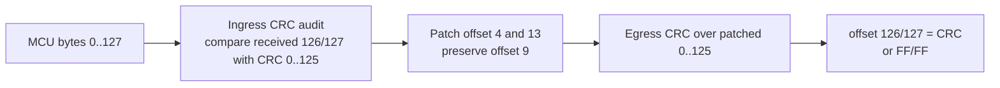
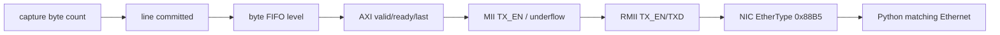
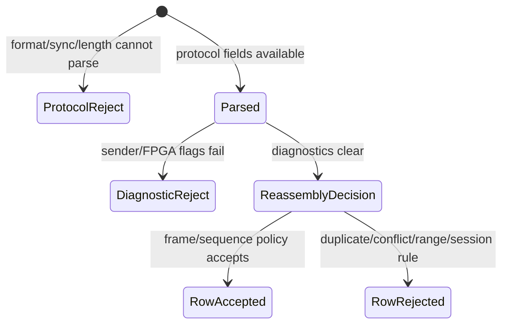
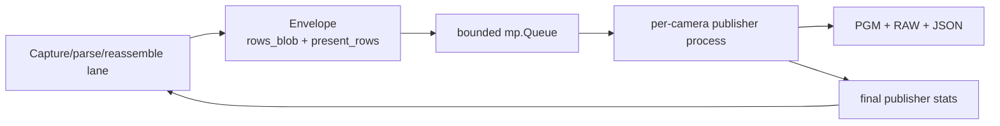
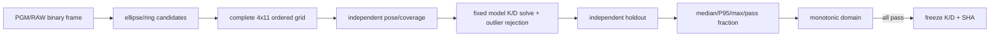
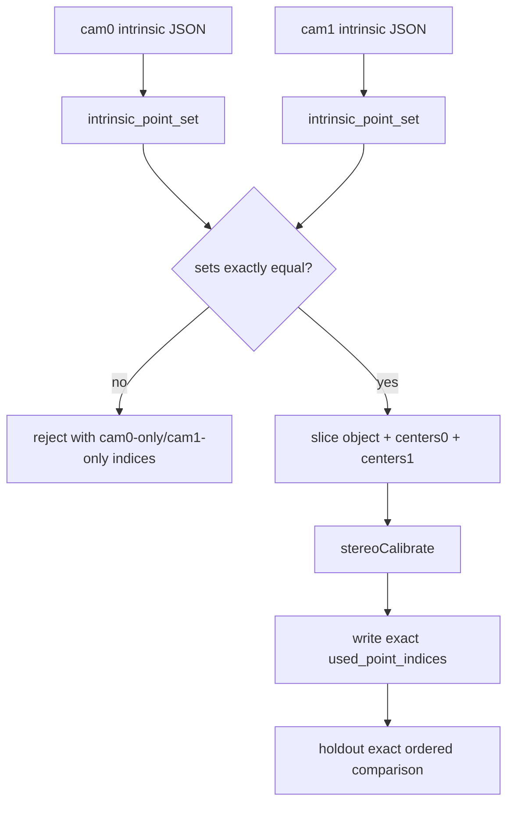
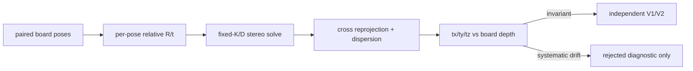
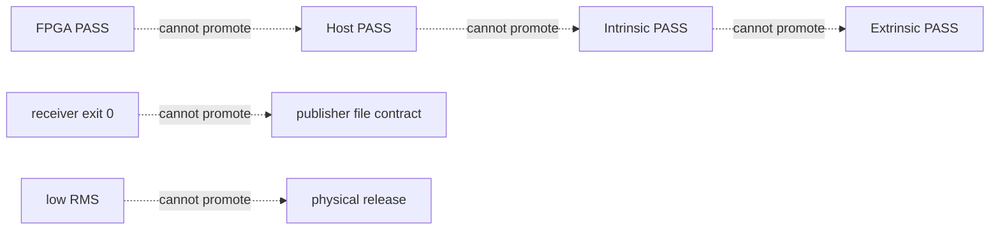

# PRG_CAM 项目创新点与技术贡献审计

> 文档编号：10　审计日期：2026-08-25<br>
> 仓库身份：`6b697789017509e9c31a3a2986d93e40d7b812f9`，工作区 `dirty=true`，见 `docs/reports/FINAL_HARDWARE_IDENTITY_MANIFEST.json:6-12`<br>
> 当前硬件身份：CAM0 120° + CAM1 120°；历史 120°+160° 结果不作为当前结论<br>
> 证据等级：`IMPLEMENTED` / `TEST VERIFIED` / `RUN VERIFIED` / `HISTORICAL DOCUMENTED` / `PROPOSED` / `WITHHELD`

本文的 Python 相对路径均锚定到 `prg_cam.srcs/sources_1/tx/taxi_receiver_advanced/taxi_receiver/`；例如 `taxi_receiver/camera_parser.py:145` 展开后就是仓库中的真实文件与行号。RTL、`scripts/`、`build/` 和 `docs/` 路径均相对仓库根目录。

## 0. 审计结论

本项目值得写入论文的内容不是“使用了 FIFO、CRC、Ethernet、OpenCV 或 Python 多进程”，而是围绕一个具体难题形成了可验证的组合：把没有 `ready` 的多路相机字节源可靠地送入会产生反压的 Ethernet 链路，再把传输完整性、图像完整性、内参拟合质量和外参物理有效性分成互不替代的证据层。核心贡献是完整包原子性、字段所有权、分层有效性、发布器隔离、点集身份约束和深度无关性拒绝门。

当前最强的论文贡献是 I01、I02、I04、I05、I06、I07、I08。I03 是诊断与工程实现贡献；I09 是复现方法贡献，但其自动化 manifest 仍不完整。当前外参只有 rejected diagnostic，不能称为已发布 R/t：`build/stereo_final_20260821/02_solve/cam0_to_new_cam1_extrinsics.rejected.json` 的 `quality.status=unacceptable`、`quality.gate.publishable=false`，V1/V2 均未运行。

### 项目创新贡献矩阵

| ID | 创新点 | Domain | Problem | Mechanism | Evidence | Verification level | Novelty type | Current limitation |
|---|---|---|---|---|---|---|---|---|
| I01 | 完整 128-byte 行包作为反压跨越的原子单元 | FPGA RTL | MCU 无 ready，而 Ethernet 可停顿 | reserve/commit/release + grant lock + `{last,data}` FIFO | RTL、ILA/PCAP 历史产物 | IMPLEMENTED；HISTORICAL DOCUMENTED | Architecture integration | PCLK 仍在普通 I/O 上，见 `prg_cam.srcs/sources_1/new/Camera_Capture.v:95-97` |
| I02 | 字段所有权明确的再封包与双 CRC 域 | FPGA/协议 | 修改 cam/status 后旧 CRC 失效，sender flags 易被污染 | ingress audit 与 egress regenerate 分离；offset 4/9/13/126-127 固定所有权 | RTL、Python parser | IMPLEMENTED | Protocol/invariant design | 当前 MCU CRC 身份仍是外部依赖，不能由标定结果代替 |
| I03 | 从采集到 RMII/NIC 的 first-zero 可观测链 | TAXI/ETH/Vivado | “PC 没图”无法定位具体接缝 | valid/ready/last、FIFO、underflow、TX_EN 探针及 bit/LTX/report 绑定 | Tcl、ILA bit/LTX、CSV、PCAP | RUN VERIFIED（文件身份）；事件绑定仅 HISTORICAL | Diagnostic observability | manifest 明确 `program_time_source_verified=false` |
| I04 | 三层有效性与按相机隔离的接收语义 | Python host | 一个 `valid` 同时表达解析、诊断和重组会掩盖原因 | `parsed_ok`、`ok`、`row_accepted` 分层；白名单 lane | Python、rows CSV schema | IMPLEMENTED | Protocol/invariant design | receiver exit 0 不保证 publisher 文件合同成立 |
| I05 | 每路相机独立进程发布器与语义保持 envelope | Python host | 解包/PGM/RAW 写盘反压前端线程 | per-lane spawn、bounded queue、`present_rows`、结果回传 | 代码 + byte-equivalence tests | TEST VERIFIED | Concurrency/isolation | 进程队列满仍会产生受控阻塞，必须看 blocked/stats |
| I06 | 二值圆阵的检测—姿态—refill—holdout 发布链 | Intrinsic | 大量重复帧和低总 RMS 不能证明 K/D 稳健 | 椭圆候选、完整网格、独立 pose、异常剔除、独立 holdout、单调域 | 代码、两机 JSON/holdout | RUN VERIFIED | Calibration robustness | 圆心仍可能受透视/畸变和边缘截断产生系统偏差 |
| I07 | 内参物点集合身份强制贯穿 stereo 全链 | Intrinsic/Extrinsic | “JSON 写 43 点，计算偷偷用 44 点”可静默通过 | 精确解析集合、两机必须相同、五处切片、holdout 逐元素复核 | 代码 + 12 tests | TEST VERIFIED | Protocol/invariant design | 本周实现禁止自动取交集；不同集合只能重标 |
| I08 | 数值优化与物理发布分离的 depth-independence 门 | Extrinsic | 低 stereo RMS 可共存于错误尺度/深度漂移 | 固定 K/D、R/t、cross RMSE、dispersion、深度相关/斜率、rejected JSON | 20 accepted pairs + rejected JSON | RUN VERIFIED；WITHHELD | Validation methodology | 当前 tx/ty 漂移，R/t 不可发布 |
| I09 | 跨层证据禁止提升与运行身份归档 | Reproduction | 不同 run 的 bit、K/D、CSV 容易被混用 | SHA、状态、路径、first-failure、immutable evidence | Phase 2 docs + final manifest | PARTIAL | Evidence/reproducibility engineering | MCU firmware SHA 和统一自动生成 run manifest 尚缺 |

---

## Innovation 1：以完整行包为原子的无 ready→有反压桥接

### 1. 问题背景

相机/MCU 侧按 PCLK/HREF 连续送字节，不能等待 FPGA；Ethernet 侧采用 `valid/ready`，MAC、MII FIFO 或 PHY 可以停顿。如果只放一个字节 FIFO 或在仲裁中按拍切换相机，反压期间可能读到仍在写的行、把两台相机的字节拼成一包，或使 `last` 与最后一个数据字节错位。

### 2. 本项目的方法

系统把一个 128-byte 行包视为最小原子事务。`Camera_Capture` 先把异步 PCLK/HREF 资格化；`Line_Buffer` 在 `line_start` 预留 slot，在 `line_end` 一次提交 metadata，只允许已 commit 包被读；`Arbitration` 选中相机后锁住 grant，直到 `valid && ready && last`；`Byte_FIFO` 把 `last` 与数据作为同一个 9-bit 记录。下游可以任意停顿，但不能改变已经呈现的 byte、来源和包尾。

### 3. 对应代码

- `prg_cam.srcs/sources_1/new/Camera_Capture.v:304-322`：HREF 下降后等待最后一个合格 PCLK 完成，再同时提交 `line_end` 和 flags。
- `prg_cam.srcs/sources_1/new/Line_Buffer.v:129-137`：reserve/drop/commit/release 四个事件；release 只发生在真实末字节握手。
- `prg_cam.srcs/sources_1/new/Line_Buffer.v:257-290`：输出寄存器在 `ready=0` 时保持不变。
- `prg_cam.srcs/sources_1/new/Arbitration.v:37-85`：轮询只决定候选，grant 在整包期间锁定。
- `prg_cam.srcs/sources_1/new/Byte_FIFO.v:21-30,61-69,99-116`：`{packet_last,data}` 同存，并有输出 holding register。

真实代码摘录（`prg_cam.srcs/sources_1/new/Line_Buffer.v:129-137`）：

```verilog
wire reserve_event = capture_line_start && !rx_reserved &&
                     (used_count < LINE_SLOTS);
wire drop_event    = capture_line_start && !rx_reserved &&
                     (used_count >= LINE_SLOTS);
wire commit_event  = capture_line_end && rx_reserved;
wire release_event = tx_valid && tx_ready && tx_packet_last;
```

### 4. 机制图

```mermaid
flowchart LR
    A[PCLK/HREF byte stream<br/>no ready] --> B[Camera_Capture<br/>qualified byte + line boundary]
    B --> C[Line_Buffer<br/>reserve → commit]
    C --> D[Arbitration<br/>grant locked per packet]
    D --> E[Byte_Replacer<br/>whole-packet bank]
    E --> F[Byte_FIFO<br/>{last,data}]
    F -->|valid/ready stall safe| G[Ethernet adapter/MAC]
```

### 5. 为什么可称为项目贡献

FIFO 和 round-robin 都是通用组件；贡献在于用“完整包已提交”作为所有模块共同的不变量，并把释放条件固定为真实末字节握手。它解决的是本项目无 ready 相机输入与可反压网络输出之间的语义断层，而不是单纯增加缓存深度。

### 6. 验证证据

- `build/ethernet_ila/frame_handshake_capture.csv`、`camera_line_end_dbg_capture.csv` 和多个 PCAP 是保留的历史运行证据。
- `build/ethernet_ila/Camera_Ethernet_Top_ila.bit/.ltx` 是现存调试构建；哈希见 final manifest 的 `fpga` 对象。
- 本轮没有重新运行 RTL 仿真，所以不得把静态审计写成新一次硬件 run。

### 7. Observed vs Expected

| Probe | Expected | Current observed | Interpretation |
|---|---|---|---|
| row transaction | 128 bytes 后 commit | `PACKET_BYTES=128`，commit 在 `capture_line_end` | IMPLEMENTED |
| source grant | 包内不切换 | 释放条件包含 `tx_packet_last` | IMPLEMENTED |
| stalled output | data/last 保持 | FIFO 有独立 `out_valid_r` holding register | IMPLEMENTED |
| 当前硬件波形 | 每包精确一次 last | 仅保留历史 CSV/PCAP，本轮未采新波形 | HISTORICAL DOCUMENTED |

### 8. 限制与未完成项

`prg_cam.srcs/sources_1/new/Camera_Capture.v:95-97` 明确说明 PCLK 位于非时钟专用脚时只是织构内缓解；若频率或毛刺超出当前资格化能力，仍需 PCLK 域组包加异步 FIFO。状态：`IMPLEMENTED / PARTIAL PHYSICAL ASSURANCE`。

### 9. 论文表达

- 中文：提出以完整 128-byte 行包为提交和仲裁原子的反压安全相机—Ethernet 桥接结构。
- English: *A packet-atomic bridge converts an unthrottled camera byte stream into a backpressure-safe Ethernet stream by coupling commit, grant locking, and data/last storage.*
- 摘要版：针对相机输入无 ready 而网络输出可反压的问题，设计完整行包 reserve/commit、整包 grant lock 和 `{last,data}` 同步 FIFO，使任意下游停顿不破坏来源、字节序与包尾边界。
- PPT：**整包 commit + 整包锁定：反压只能暂停包，不能撕裂包。**

---

## Innovation 2：字段所有权与 ingress/egress 双 CRC 语义

### 1. 问题背景

FPGA 会覆盖 `cam_id`、写入自身诊断状态，因此 MCU 发送的尾部 CRC 不再能代表修改后的出站包。若同时覆写 sender flags，PC 端又无法区分“发送方报告的问题”和“FPGA 接收链报告的问题”。

### 2. 本项目的方法

128-byte payload 的所有权固定为：offset 4 由 FPGA 写 cam_id；offset 9 原样保留 MCU sender flags；offset 13 独立写 FPGA status；offset 126/127 由出站模式决定重算 CRC 或输出 `FF/FF`。入口 CRC 在任何补丁前比较 MCU 尾部，出站 CRC 在所有补丁之后重新计算；两者用途不同，且 CRC 只证明字节完整性，不参与 K/D 或 R/t 的质量结论。

### 3. 对应代码

- `prg_cam.srcs/sources_1/new/Byte_Replacer.v:5-22`：四个字段的协议所有权和 CRC 模式。
- `prg_cam.srcs/sources_1/new/Byte_Replacer.v:125-137,205-213`：补丁后 CRC 与 `FF/FF` 行为。
- `prg_cam.srcs/sources_1/new/Camera_Capture.v:20-23,150-160,293-299`：入口 CRC 覆盖 0..125，接收尾部为大端 126/127。
- `prg_cam.srcs/sources_1/new/Camera_Capture.v:317-327`：长度/CRC 状态随该行提交，offset 9 不再由 FPGA重造。
- `prg_cam.srcs/sources_1/new/Camera_Pipeline.v:22-29`：`CRC_ENABLE`、`INGRESS_CRC_ENABLE` 和 CAM1 gate 是独立参数。

```verilog
// Byte_Replacer.v:125-137
wire [7:0] patched_output_data =
    (output_index == CAM_ID_OFFSET) ? {6'd0, output_cam_id} :
    (output_index == FPGA_STATUS_OFFSET) ? output_status :
    buffered_output_data;
assign out_data = !output_active ? 8'd0 :
    (output_index == CRC_HIGH_OFFSET) ?
        ((CRC_ENABLE != 0) ? output_crc[15:8] : 8'hFF) :
    (output_index == CRC_LOW_OFFSET) ?
        ((CRC_ENABLE != 0) ? output_crc[7:0] : 8'hFF) :
    patched_output_data;
```

### 4. 机制图



### 5. 为什么可称为项目贡献

CRC-16/CCITT-FALSE 本身不是创新。项目贡献是把两个 CRC 的观察对象、时间点和字段所有权写成不变量：入口判断 MCU→FPGA，出口保护 FPGA→PC；FPGA 状态与 sender flags 不共用一个字节。这使诊断不会被再封包覆盖，也避免把 CRC 错误误判为标定误差。

### 6. 验证证据

CRC 实现参数直接由 `prg_cam.srcs/sources_1/new/Camera_Capture.v:62-77` 给出：poly `0x1021`、init `0xFFFF`、refin/refout false、xorout 0。Python 的 packet parser 同时保留 received/calculated CRC 与 FPGA flags；rows 输出字段位于 `taxi_receiver/image_pipeline.py:717-726`。当前 MCU firmware SHA 未进入仓库 manifest，因此端到端入口 CRC 身份仍不可独立复刻。

### 7. Observed vs Expected

| Probe | Expected | Current observed | Interpretation |
|---|---|---|---|
| offset 4 | FPGA cam_id | 输出补丁明确 | IMPLEMENTED |
| offset 9 | sender byte exact | Byte_Replacer 无该 offset 补丁 | IMPLEMENTED |
| offset 13 | FPGA status only | 独立 `FPGA_STATUS_OFFSET` | IMPLEMENTED |
| offset 126/127 | 重算或 FF/FF | `CRC_ENABLE` 两分支 | IMPLEMENTED |
| CRC 与标定 | 不互相提升证据 | 标定门只消费图像/几何指标 | PASS（架构边界） |

### 8. 限制与未完成项

当前 manifest 的 `mcu_boundary.firmware_sha256=null`；所以“RTL 入口 CRC 已实现”不能提升为“当前 MCU 固件与 FPGA CRC 参数已经同身份验证”。状态：`IMPLEMENTED / MCU END-TO-END UNVERIFIED`。

### 9. 论文表达

- 中文：构建了发送端状态、FPGA 接收状态与补丁后出站 CRC 相互独立的字段所有权协议。
- English: *The repacketizer enforces disjoint ownership of sender flags, FPGA diagnostics, and pre-/post-patch CRC evidence.*
- 摘要版：通过分离补丁前入口 CRC 审计与补丁后出站 CRC 生成，并固定 cam_id、sender flags、FPGA status 与 CRC 尾字段的所有权，系统可在不污染上游语义的情况下追踪传输错误。
- PPT：**CRC 分两段、状态分两字节：谁产生、保护哪段数据都可追溯。**

---

## Innovation 3：TAXI/ETH 的 first-zero 可观测证据链

### 1. 问题背景

“PC 没收到包”可能来自相机无字节、行未提交、FIFO 不出、AXI 反压、MAC underflow、MII/RMII 桥、PHY、NIC 或 Npcap。若只看最终 PGM，调试会跨层猜测。

### 2. 本项目的方法

Ethernet adapter 只添加 14-byte Ethernet II header，不改 payload 顺序；TAXI 接口把 `frame_data/valid/last` 映射到 AXI stream，并把 ready 传回。顶层暴露 `rmii_tx_en_dbg`、`rmii_txd_dbg`、underflow、FIFO overflow/good frame，Tcl 自动构建 ILA bit/LTX、DCP、timing、DRC、utilization。排查只沿第一个为零的节点继续。

### 3. 对应代码

- `prg_cam.srcs/sources_1/new/Ethernet_Frame_Adapter.sv:4-6,51-70,94-106`：14-byte header、payload 零拷贝握手、last 停顿保持。
- `prg_cam.srcs/sources_1/new/Taxi_Ethernet_Subsystem.sv:70-78,105-113`：AXI 映射与 MAC 状态。
- `prg_cam.srcs/sources_1/new/Camera_Ethernet_Top.sv:372-408,406-431`：RMII 与 FIFO/MAC probes。
- `scripts/build_ethernet_ila.tcl:65-71,148-165`：ILA core、采样时钟、DCP/bit/LTX/report 输出。

### 4. 机制图



### 5. 为什么可称为项目贡献

TAXI MAC 和 ILA 是通用工具。贡献在于把协议原子性信号与物理发送信号放在同一排查链，并使 ILA 构建同时导出匹配的 bit/LTX 和实现报告，从而把“无图”缩小到具体接缝，而不是直接改 RTL 或标定阈值。

### 6. 验证证据

`docs/reports/FINAL_HARDWARE_IDENTITY_MANIFEST.json:34-59` 记录现存 bit、LTX、routed DCP 和编程日志的 SHA-256；`build/ethernet_ila/` 还保留多轮 ILA CSV 与 PCAP。manifest 同时明确 `program_event_binding=HISTORICAL_EVIDENCE_ONLY` 和 `program_time_source_verified=false`，所以文件身份可验证，但不能杜撰某一次上电与某一份抓包的严格事件绑定。

### 7. Observed vs Expected

| Probe | Expected | Current observed | Interpretation |
|---|---|---|---|
| bit/LTX | 同一 ILA build 配对 | 两者均存在且各有 SHA | FILE IDENTITY VERIFIED |
| Ethernet frame | 14-byte header + 128-byte payload | adapter 固定 header/payload FSM | IMPLEMENTED |
| RMII observability | TX_EN/TXD 可采样 | `MARK_DEBUG` nets 存在 | IMPLEMENTED |
| 当前烧写事件绑定 | 明确时间与 bit | 时间源未验证 | HISTORICAL ONLY |

### 8. 限制与未完成项

该链能定位“第一个异常接缝”，不能自动证明外部 PHY 引脚、电缆和 NIC 状态。plain bit 与 ILA bit 是不同身份，必须各自哈希；当前只有 retained ILA baseline 的强文件证据。状态：`RUN VERIFIED (ARTIFACT) / PARTIAL EVENT PROVENANCE`。

### 9. 论文表达

- 中文：建立了覆盖 FPGA 包原子性、TAXI 握手、MII/RMII 与主机收包的 first-zero 诊断链。
- English: *A first-zero observability chain connects packet-atomic RTL probes to TAXI/MII/RMII and host capture evidence.*
- 摘要版：项目将行提交、FIFO 水位、AXI 握手、MAC 错误、RMII TX_EN 和 NIC EtherType 纳入同一证据序列，配合 bit/LTX/report 绑定实现跨层故障二分。
- PPT：**不从“PC 无图”猜原因，只追第一个从非零变成零的接缝。**

---

## Innovation 4：协议可解析、诊断合格与行可重组三层语义

### 1. 问题背景

若一个布尔 `valid` 同时代表“字节格式可解析”“没有 FPGA/MCU 错误”“可进入图像”，长度被规范化但带错误状态的行会完全失去审计痕迹；反之，错误行也可能混入图像。多相机共用总计数还会掩盖某一路拒接。

### 2. 本项目的方法

Layer 3 产生 `parsed_ok` 与 diagnostic errors；`ok=parsed_ok and not diagnostic_errors`。Layer 5 的 reassembler 再决定 `PacketRecord.accepted`，rows CSV 将其写成 `row_accepted`。相机 ID 必须属于配置白名单，才会创建该 camera 的独立 queue、reassembler、CSV 和 publisher。

### 3. 对应代码

- `taxi_receiver/camera_parser.py:43-54,132-158`：协议错误和诊断错误分层。
- `taxi_receiver/image_pipeline.py:648-726`：CSV 只记录 Layer 5 的接受决定，不再运行竞争状态机。
- `taxi_receiver/reassembler.py:245-247,370-400`：重复、缺行与 frame status。
- `taxi_receiver/camera_lane.py:430-470,472-513`：白名单路由与每路资源实例化。

```python
# camera_parser.py:145-150
errors = (*protocol_errors, *diagnostic_errors)
parsed_ok = not protocol_errors

return CameraModeResult(
    ok=parsed_ok and not diagnostic_errors,
    parsed_ok=parsed_ok,
```

### 4. 机制图



### 5. 为什么可称为项目贡献

分层 parser 本身常见；项目贡献是让三个判断分别拥有输出字段、停止权和统计口径，并把相机白名单放在 lane 创建前。这样 CAM0 正常不能掩盖 CAM1 全部 unroutable，长度错误的 metadata 仍可进入审计但不能污染 PGM。

### 6. 验证证据

字段写入点为 `image_pipeline.py:719-726`，输出明确含 `parsed_ok`、`validation_status`、`reject_reason`、`row_accepted`。当前真实双机采集与内参图像存在，但本轮没有重新生成 receiver summary，故这里只把源代码语义评为 IMPLEMENTED；历史运行见 `images/new_Temp` 与相关 rows CSV。

### 7. Observed vs Expected

| Probe | Expected | Current observed | Interpretation |
|---|---|---|---|
| parsed_ok | 只回答协议能否解析 | 与 protocol errors 绑定 | IMPLEMENTED |
| ok | parsed 且无 diagnostics | 明确逻辑与 | IMPLEMENTED |
| row_accepted | 由 reassembler 决定 | 从 `PacketRecord.accepted` 写 CSV | IMPLEMENTED |
| CAM 路由 | 非白名单不创建 lane | 计入 unroutable 后 return | IMPLEMENTED |

### 8. 限制与未完成项

分层字段只能保留事实，不能消除上游错误；receiver 进程退出 0 也不能自动证明 publisher 已返回 stats、PGM 数量匹配或标定网格有效。状态：`IMPLEMENTED`。

### 9. 论文表达

- 中文：提出协议可解析性、传输诊断状态和重组接受性相互独立的主机验证语义。
- English: *Protocol parseability, transport diagnostics, and row admission are represented as distinct, non-promotable states.*
- 摘要版：接收机将 `parsed_ok`、diagnostic `ok` 与 `row_accepted` 分离，并按可信 cam_id 建立独立 lane，使错误元数据可审计而无效像素不进入重组。
- PPT：**能读懂包 ≠ 包没有错误 ≠ 这一行能进图。**

---

## Innovation 5：Host Publisher Isolation 与等价 envelope

### 1. 问题背景

行重组完成后，缺行恢复、1-bit 展开、PGM/RAW/JSON 编码和磁盘写入既有 CPU 工作又有 I/O。在线程模型中它们可能受 GIL 和写盘延迟影响，反向阻塞每路 camera lane，最终影响前端队列。

### 2. 本项目的方法

每个 active camera lane 可启用一个 `spawn` 子进程和有界 `mp.Queue`。父进程不传 480 个离散 row 对象，而传连续 `rows_blob`；同时必须传 `present_rows` 和 `missing_rows`，否则真正的全黑行与缺失后补零行无法区分。关闭时通过可 pickle 的 sentinel 排空、回传统计，并对进程超时作显式错误报告。

### 3. 对应代码

- `taxi_receiver/camera_lane.py:136-141`：S2 的性能动机和 per-lane 配置。
- `taxi_receiver/image_pipeline.py:142-170`：envelope 字段与缺行语义。
- `taxi_receiver/image_pipeline.py:448-472`：Windows `spawn`、bounded queue、process。
- `taxi_receiver/image_pipeline.py:542-580`：sentinel、stats 回传和超时处理。
- `tests/test_image_recovery.py:296-398`：缺行 round-trip、sentinel pickle、thread/process 字节一致性。

### 4. 机制图



### 5. 为什么可称为项目贡献

`multiprocessing` 不是创新；贡献是 S1 每相机 lane 与 S2 每 lane publisher 的组合、对缺行/黑行的无歧义 envelope、受控反压以及 thread/process 输出等价验证。迁移执行位置而不改变文件字节，是该隔离可安全采用的关键不变量。

### 6. 验证证据

本轮执行：

```powershell
& 'C:\Users\Z\AppData\Local\Python\pythoncore-3.14-64\python.exe' -m pytest -q `
  tests\test_extrinsic_config.py tests\test_stereo_calibration.py `
  tests\test_extrinsic_validation.py tests\test_image_recovery.py
```

结果为 `41 passed`；另行执行 `tests/test_intrinsic_point_sets.py` 为 `12 passed`。pytest 仅有无法建立 `.pytest_cache` 的 warning，不影响断言结果。publisher 的直接证据是 `tests/test_image_recovery.py:351-398` 对 PGM/RAW bytes 做 thread/process 全等比较。

### 7. Observed vs Expected

| Probe | Expected | Current observed | Interpretation |
|---|---|---|---|
| envelope missing-row identity | 黑行与缺行可区分 | round-trip test 保留 absent row | TEST VERIFIED |
| stop sentinel | spawn 后类型仍可识别 | pickle test 通过 | TEST VERIFIED |
| file result | thread/process byte-equal | 全等断言通过 | TEST VERIFIED |
| publisher completion | stats 从 child 返回 | 代码有 timeout 与 `stats_returned` | IMPLEMENTED |

### 8. 限制与未完成项

bounded queue 满时仍可能阻塞 lane；隔离是把慢路径移出接收线程并使阻塞可观测，不是无限吞吐。最终实验必须同时检查 queue blocked、child failures、stats returned 和实际文件合同。状态：`TEST VERIFIED`。

### 9. 论文表达

- 中文：设计了保持缺行语义和文件逐字节等价的每相机多进程发布隔离机制。
- English: *Per-camera publisher processes are isolated through a bounded, semantics-preserving frame envelope whose output is byte-equivalent to in-thread publication.*
- 摘要版：接收侧将恢复、位展开与图像落盘迁入每相机独立进程，并用 `rows_blob + present_rows` 保留缺行语义；A/B 测试证明线程和进程输出逐字节一致。
- PPT：**把慢写盘移出去，但不允许它改变任何一字节或把缺行伪装成黑行。**

---

## Innovation 6：二值圆阵的完整内参证据链

### 1. 问题背景

项目输入不是普通灰度照片，而是 640×480 二值图；圆环会受透视、鱼眼畸变、边缘截断和印刷污染影响。仅调用一次 `fisheye.calibrate` 或用大量连续帧降低 RMS，会把重复姿态当成独立证据，也无法证明 K/D 在未见数据和图像边缘可用。

### 2. 本项目的方法

读取 PGM/RAW 后统一为 0/255 `uint8`；先从轮廓拟合椭圆并过滤直径、轴比、弧覆盖和残差，再在合成中心图上调用 `findCirclesGrid` 排序。完整网格只是 detection，preflight 再按位置、尺度与法向选择独立 pose；求解进行 per-view RMSE 异常剔除；最终用独立 holdout 的 median/P95/max/pass fraction 和 fisheye 单调域共同判断。

### 3. 对应代码

- `taxi_receiver/binary_calibration.py:178-215,293-340`：椭圆候选与网格排序。
- `taxi_receiver/binary_calibration.py:444-494`：PGM/RAW 输入、shape/dtype 和去重。
- `taxi_receiver/binary_calibration.py:561-599`：fisheye flags、K/D 求解和固定系数复核。
- `taxi_receiver/binary_calibration.py:641-712`：异常视图迭代剔除。
- `taxi_receiver/calibration_validation.py:87-151,438-461`：固定 K/D 的 PnP、投影和 holdout 门。

### 4. 机制图



### 5. 为什么可称为项目贡献

OpenCV 是通用求解器。项目贡献是围绕二值圆阵建立“完整检测—独立姿态—训练—独立 holdout—数值域”的不提升链，并把 `complete grid`、`valid frame`、`pose`、`accepted view` 分开。这样连续移动产生的几千帧不会虚增姿态覆盖。

### 6. 验证证据

当前 120°+120°：CAM0 内参 `accepted_images=35`、training RMS `0.23785644462112296 px`；CAM1 为 33 和 `0.5590240162673038 px`。独立 holdout：CAM0 median/P95/max 为 `0.4292355918336487 / 0.8982974735338685 / 1.4538942744373111 px`，CAM1 为 `0.2829206832581376 / 0.7770839489858042 / 1.3158356663344977 px`，均为 `pass`。原始路径见 `docs/reports/08_calibration_and_validation_pipeline.md:629-642,750-755`。

### 7. Observed vs Expected

| Probe | Expected | Current observed | Interpretation |
|---|---|---|---|
| training status | acceptable | CAM0/CAM1 均 acceptable | RUN VERIFIED |
| holdout median | ≤0.8 px | 0.429236 / 0.282921 | PASS |
| holdout P95 | ≤1.2 px | 0.898297 / 0.777084 | PASS |
| holdout max | ≤1.5 px | 1.453894 / 1.315836 | PASS |
| monotonic margin | 覆盖四角且为正 | 63.0765° / 62.9740° | PASS |

### 8. 限制与未完成项

这些阈值来自项目代码默认发布门（`calibration_validation.py:448-451`），不是普适理论常数。圆形控制点中心存在透视和畸变偏差；靠近边缘、圆环破裂或板面污染仍可能给出系统性中心偏移。状态：`RUN VERIFIED`，但只证明两机各自 K/D，不自动证明外参。

### 9. 论文表达

- 中文：形成了面向 1-bit 圆阵图像的多级内参证据链，抑制重复帧、边缘数值折返和单一 RMS 误判。
- English: *A binary circle-grid calibration chain couples geometric candidate filtering, independent-pose selection, robust fitting, held-out validation, and fisheye-domain checks.*
- 摘要版：针对二值圆阵和广角镜头，项目将椭圆中心检测、姿态覆盖、异常视图剔除、独立 holdout 与 KB 单调域联合为内参发布门；当前两台 120° 相机均通过该链。
- PPT：**不是“OpenCV 跑出 K/D”，而是 K/D 必须经独立图像和边缘数值域双重验收。**

---

## Innovation 7：精确物点子集身份贯穿求解与验证

### 1. 问题背景

一台相机若删除污染圆点、另一台仍用完整 44 点，数组下标会失去同一物理点语义。更危险的是 JSON 声称使用 43 点，而求解代码硬编码全集，仍可能得到低 RMS 并静默通过。

### 2. 本项目的方法

`intrinsic_point_set()` 按明确优先级解析：`used_point_indices`；否则全集减 `excluded_point_indices`；只有 `used_point_count == columns*rows` 才能解释为全集；较小数量但无具体索引直接拒绝。两机集合必须完全相等，不取交集。求解用该集合同时切片 object points、CAM0 centers、CAM1 centers，写入外参 JSON，holdout 再逐元素、逐顺序核对。

### 3. 对应代码

- `taxi_receiver/extrinsic_config.py:61-142`：集合解析和内部矛盾拒绝。
- `taxi_receiver/extrinsic_config.py:145-177`：两机差集错误消息。
- `taxi_receiver/stereo_calibration.py:690-725,839-855`：真实求解切片和外参 JSON 记录。
- `taxi_receiver/extrinsic_validation.py:480-504`：验证阶段逐元素/顺序复核。
- `tests/test_intrinsic_point_sets.py:62-118,224-245`：full44、差异、歧义、记录不一致测试。

### 4. 机制图



### 5. 为什么可称为项目贡献

数组切片不是创新；贡献是把“物理对应点身份”提升为跨内参 JSON、stereo 输入、输出和 holdout 的强协议，禁止警告降级、默认全集和取交集。这直接封堵了一类能得到漂亮数值但物理对应关系错误的静默故障。

### 6. 验证证据

本轮 `tests/test_intrinsic_point_sets.py` 为 `12 passed`；与 publisher/外参其余测试合计本轮共 53 个断言测试通过。当前两机内参 `used_point_count=44`、`excluded_point_indices=[]`，所以解析为同一 full44 集合；现有外参 pairing summary 也记录 full44。

### 7. Observed vs Expected

| Probe | Expected | Current observed | Interpretation |
|---|---|---|---|
| full44/full44 | 通过且数值不变 | 当前两机均解析为 0..43 | PASS |
| full44/43 | 明确拒绝差异索引 | 单元测试覆盖 | TEST VERIFIED |
| count/index 矛盾 | 拒绝 | 单元测试覆盖 | TEST VERIFIED |
| 小于全集但无索引 | “点集不明确” | 单元测试覆盖 | TEST VERIFIED |
| extrinsics recorded order | 与 intrinsic 完全一致 | validation 强制比较 | IMPLEMENTED |

### 8. 限制与未完成项

当前策略有意不支持 common intersection。只要两机不是同一集合，就必须用相同物点集重标；这牺牲便利性来保护对应关系。状态：`TEST VERIFIED`。

### 9. 论文表达

- 中文：提出并实现跨单机内参、双目求解和独立验证的精确物点集合身份约束。
- English: *Exact calibration-target point identity is enforced end to end, preventing metadata/computation mismatches from silently entering stereo optimization.*
- 摘要版：系统将使用点索引作为标定模型身份的一部分，两机集合不一致或数量不明确时直接拒绝，并把同一集合实际应用于物点、双机中心、求解输出和 holdout。
- PPT：**报告说 43 点，计算就必须真用同一批 43 点；否则立即拒绝。**

---

## Innovation 8：外参数值解与物理发布的深度无关性门

### 1. 问题背景

`stereoCalibrate` 可以在当前训练姿态上得到很低的像素残差，但错误 K/D、圆心系统偏差、尺度偏差或覆盖不足仍会使每个姿态估计出不同的相机间平移。刚性支架的真实 R/t 不应随标定板远近变化，因此低 RMS 不是物理正确性的充分条件。

### 2. 本项目的方法

以 CAM0 为 reference，先由两机对同一 board pose 的 PnP 得到每姿态相对变换，再固定两机 K/D 执行 `cv2.fisheye.stereoCalibrate(..., CALIB_FIX_INTRINSIC)`。除 stereo RMS 外，计算旋转/平移离散度、双向 cross reprojection、rectified vertical error和独立 holdout；训练阶段对 tx/ty/tz 分别回归 board depth，相关系数和斜率同时越门时判为系统漂移。任何 depth failure 直接进入 failures，并写 `.rejected.json`，不写正式外参。

### 3. 对应代码

- `taxi_receiver/stereo_calibration.py:114-117`：由两机 board pose 组合相对 R/t。
- `taxi_receiver/stereo_calibration.py:279-308`：固定 K/D 的 fisheye stereo solve 与“不许更改 K/D”复核。
- `taxi_receiver/stereo_calibration.py:311-350`：双向组合投影误差。
- `taxi_receiver/stereo_calibration.py:770-818`：RMS、dispersion、depth failure 与状态。
- `taxi_receiver/stereo_calibration.py:839-860,911-921`：R/t 约定、gate 与 rejected-only 写入。
- `taxi_receiver/extrinsic_validation.py:408-425`：独立外参 holdout 门。

### 4. 机制图



### 5. 为什么可称为项目贡献

OpenCV 求解器和相关系数都不是创新。贡献是将刚体物理不变量转成不可降级的发布门，并保留失败候选用于诊断而阻止其进入部署。它把“求解收敛”和“可正式发布”分开，解决低训练误差掩盖尺度/畸变系统误差的问题。

### 6. 验证证据

当前 120°+120° 候选来自 23 个输入 pair，其中 20 个 accepted：stereo RMS `0.16781309681782364 px`，baseline `25.079707447086587 mm`，rotation dispersion median `0.20243790057208932°`，translation dispersion median `1.9064783779398544 mm`，cross RMSE median/P95/max `0.1884342448275838 / 0.2577598833784008 / 0.3059139419747189 px`。

但 tx 的 correlation/slope/drift 为 `-0.3437371158863752 / -0.009490567048713747 mm/mm / -1.9917813178125994 mm`；ty 为 `-0.3065207521367645 / -0.007147606274012415 / -1.5000651247269272 mm`。二者同时越过代码门 `|corr|>0.3` 且 `|slope|>0.005 mm/mm`，因此 `unacceptable`、`publishable=false`。这些数字逐字段来自 rejected JSON。

### 7. Observed vs Expected

| Probe | Expected | Current observed | Interpretation |
|---|---|---|---|
| stereo RMS | ≤1.0 px 工程目标 | 0.167813 px | PASS，仅数值层 |
| accepted pairs | ≥15（本 run pairing 要求更高） | 20 / 23 | PASS |
| rotation dispersion | ≤0.5° | 0.202438° | PASS |
| translation dispersion | ≤max(0.5 mm, 1% baseline) | 1.906478 mm | WARNING |
| tx depth drift | corr/slope 不同时越门 | -0.343737 / -0.009491 | FAIL |
| ty depth drift | corr/slope 不同时越门 | -0.306521 / -0.007148 | FAIL |
| quality gate | acceptable + publishable | unacceptable + false | WITHHELD |
| external V1/V2 | 在正式候选上 pass | NOT RUN / NOT RUN | 正确停门 |

### 8. 限制与未完成项

depth independence 能证明“当前 R/t 随深度变化”，不能凭单次回归唯一定位到 K、D、圆心、板尺寸或机械结构中的哪一个。当前不应重排相机或降低阈值后宣称成功；外参 R/t 仍为 `WITHHELD`。

### 9. 论文表达

- 中文：引入基于刚体深度无关性的外参物理发布门，阻止低 RMS 但随目标深度漂移的 R/t 被正式发布。
- English: *A rigidity-derived depth-independence gate separates numerical stereo convergence from physically publishable extrinsics.*
- 摘要版：系统在固定内参的双目优化后，对每姿态相对平移与标定板深度做相关—斜率联合检验；即使当前 RMS 仅 0.168 px，tx/ty 的系统漂移仍触发拒绝，从而避免数值成功被误报为物理标定成功。
- PPT：**0.168 px 仍被拒绝：因为刚性相机的 R/t 不应随板子远近变化。**

---

## Innovation 9：No evidence promotion 与运行身份工程

### 1. 问题背景

跨天实验常见错误不是算法本身，而是把旧 bit、新 LTX、另一轮 K/D、同名输出目录和当前 CSV 拼成一个结论。某层 PASS 也常被错误提升到下一层：FPGA 有包不等于 Host 有图，Host 有 PGM 不等于内参 pass，低 RMS 不等于外参可发布。

### 2. 本项目的方法

Phase 2 文档把证据按层分开，final manifest 记录 Git HEAD/dirty、bit/LTX/DCP SHA、两机 intrinsic SHA、外参候选 SHA、路径和状态。统一原则是 **No evidence promotion across layers**；失败沿 first-failure matrix 定位，旧 run 视为 immutable evidence，不默认覆盖。

### 3. 对应证据

- `docs/reports/00_PRG_CAM-PROTOCOL-01_working_protocol.md:39-58`：跨层证据原则与停门。
- `docs/reports/09_failure_signatures_and_script_index.md:45-72`：first-failure 层级。
- `docs/reports/FINAL_HARDWARE_IDENTITY_MANIFEST.json:1-96`：Git、FPGA、K/D、外参候选身份。
- `taxi_receiver/image_pipeline.py:913-927,1262-1271`：编号图像拒绝覆盖与原子替换。

### 4. 机制图



### 5. 为什么可称为项目贡献

哈希和 manifest 是通用方法；项目贡献是把硬件构建、抓包、图像、K/D、R/t 和发布门放入同一身份链，并用当前外参失败证明不提升原则确实会改变发布决策，而不是文档口号。

### 6. 验证证据

final manifest 记录 bit SHA `8E8047...92FC`、LTX SHA `7D9EAE...B447`、CAM0 intrinsic SHA `688E13...00B`、CAM1 intrinsic SHA `75093A...068`、rejected extrinsics SHA `B9DC05...329`。它也诚实记录 `dirty=true`、MCU firmware SHA 为 null、外参 `REJECTED_DIAGNOSTIC_ONLY`。

### 7. Observed vs Expected

| Probe | Expected | Current observed | Interpretation |
|---|---|---|---|
| FPGA artifacts | 路径+SHA | bit/LTX/DCP 均记录 | VERIFIED |
| intrinsic identity | 两机路径+SHA+status | 均记录且 holdout pass | VERIFIED |
| extrinsic identity | 候选状态不可伪装 | rejected path + publishable false | VERIFIED |
| MCU identity | firmware SHA | null | UNVERIFIED |
| per-run automatic manifest | 每次采集自动产生 | 尚无统一入口 | PROPOSED |

### 8. 限制与未完成项

当前 final manifest 是收官证据，不等于所有脚本都自动生成统一 `run_manifest.json`。MCU 工程不在仓库、canonical remote 未定义、工作区 dirty；法证级复现仍是 PARTIAL。状态：`PARTIAL`。

### 9. 论文表达

- 中文：建立跨 FPGA、主机与标定层的不可提升证据和多产物身份绑定方法。
- English: *A non-promotable evidence model binds hardware, host, and calibration artifacts while preventing success at one layer from certifying the next.*
- 摘要版：项目以 SHA、路径、运行状态和 first-failure matrix 绑定 bit/LTX、PCAP、图像、K/D 与 R/t，并强制各层独立验收；缺少固件身份或外参物理门失败时保持未验证/拒绝状态。
- PPT：**同一次 run、同一组 hash、逐层 PASS；任何一层都不能替下一层签字。**

---

## 10. 数学解释与符号表

### 10.1 CRC 覆盖与字段所有权

CRC-16/CCITT-FALSE 的状态记为 $c_i\in[0,2^{16}-1]$，初值 $c_0=\texttt{0xFFFF}$，生成多项式 $g(x)=x^{16}+x^{12}+x^5+1$（十六进制 `0x1021`）。入口对 MCU 原始 $b_0\ldots b_{125}$ 迭代，比较大端尾部 $256b_{126}+b_{127}$。出口先令 $b_4\leftarrow cam\_id$、保持 $b_9$、令 $b_{13}\leftarrow fpga\_status$，再对补丁后的 0..125 重算。实现锚点：`prg_cam.srcs/sources_1/new/Camera_Capture.v:62-77,150-160` 与 `prg_cam.srcs/sources_1/new/Byte_Replacer.v:125-137,205-211`。

| 符号 | 含义 | 单位/坐标系 |
|---|---|---|
| $b_i$ | payload 的 wire offset i 字节 | byte；包坐标 |
| $c_i$ | 处理至第 i 字节时的 CRC 寄存器 | 16-bit 无单位 |
| `cam_id` | FPGA 选择的相机编号 | offset 4 |
| `sender_flags` | MCU 产生的行/状态语义 | offset 9 |
| `fpga_status` | FPGA 接收完整性诊断 | offset 13 |

### 10.2 Fisheye/KB 投影

归一化 pinhole 坐标 $x=X/Z, y=Y/Z$，$r=\sqrt{x^2+y^2}$，入射角 $\theta=\arctan(r)$。OpenCV fisheye 使用：

\[
\theta_d=\theta(1+k_1\theta^2+k_2\theta^4+k_3\theta^6+k_4\theta^8),
\quad x_d=\frac{\theta_d}{r}x,\quad y_d=\frac{\theta_d}{r}y
\]

\[
u=f_xx_d+c_x,\qquad v=f_yy_d+c_y.
\]

当 $r=0$ 时按极限取主点。$(X,Y,Z)$ 位于相机坐标系；$(x,y,x_d,y_d)$ 无量纲；$(f_x,f_y,c_x,c_y,u,v)$ 以 pixel 为单位；$k_1\ldots k_4$ 是角度多项式系数。项目调用见 `binary_calibration.py:561-599`，输出 K/D 见 `binary_calibration.py:837-866`。

单调性检查考察：

\[
\frac{d\theta_d}{d\theta}=1+3k_1\theta^2+5k_2\theta^4+7k_3\theta^6+9k_4\theta^8>0.
\]

若导数变成非正，边缘可能出现一个畸变半径对应多个入射角的不可逆区。

### 10.3 重投影统计

对第 i 个观察点，误差 $e_i=\lVert\hat{\mathbf p}_i-\mathbf p_i\rVert_2$，单位 pixel。RMS $=\sqrt{N^{-1}\sum_i e_i^2}$ 对大误差敏感；median 表示典型视图；P95 关注尾部 5%；maximum 捕获最坏视图；pass fraction 表示满足 P95 门值的样本比例。项目 holdout 默认 0.8/1.2/1.5 px 和 0.90 来自 `calibration_validation.py:448-451`，是工程冻结阈值而不是物理定律。

### 10.4 外参刚体关系与 board pose 组合

外参约定：

\[
\mathbf X_{cam1}=\mathbf R_{10}\mathbf X_{cam0}+\mathbf t_{10}.
\]

若同一板点分别满足 $\mathbf X_{cam0}=\mathbf R_0\mathbf X_B+\mathbf t_0$ 与 $\mathbf X_{cam1}=\mathbf R_1\mathbf X_B+\mathbf t_1$，则：

\[
\mathbf R_{10}=\mathbf R_1\mathbf R_0^T,\qquad
\mathbf t_{10}=\mathbf t_1-\mathbf R_{10}\mathbf t_0.
\]

这正是 `stereo_calibration.py:114-117`。R 为无量纲 3×3 旋转矩阵；t 和板点坐标以 mm；下标 10 表示“从 CAM0 坐标变换到 CAM1”。

### 10.5 Depth independence

对每个姿态 j，令板深度 $z_j$（mm）和某一相对平移分量 $q_j\in\{t_x,t_y,t_z\}$。线性拟合 $q_j=a z_j+b$：Pearson correlation $\rho$ 表示趋势一致性，slope $a$ 单位 mm/mm 表示板每远离 1 mm 时估计外参漂移多少，drift-over-span $=a(z_{max}-z_{min})$ 单位 mm 表示采样深度范围内的总系统位移。

随机噪声独立时，均值标准误通常约按 $\sigma/\sqrt n$ 下降；但 $a\neq0$ 的系统性项不会因复制相似帧而消失。低 stereo RMS 只说明训练像点在当前 K/D、R/t 下能被拟合，K/D 与 R/t 之间仍可能互相补偿，所以可同时出现低 RMS、错误 baseline 或随深度漂移。

---

## 11. 不要误写成独立创新的内容

| 内容 | 为什么不是独立创新 | 可以怎样准确表述 |
|---|---|---|
| 使用 `cv2.fisheye.calibrate` | 通用库调用 | 它是二值圆阵检测、pose 筛选、holdout 和单调域链中的求解后端 |
| 使用 `cv2.fisheye.stereoCalibrate` | 通用固定内参求解器 | 项目贡献在点集一致、episode 配对和物理发布门 |
| 使用 CRC-16 | 标准算法 | 强调 CRC 所有权、补丁前/后两种保护对象及跨层可观测性 |
| 使用 FIFO | 通用 RTL 结构 | 强调整包 commit、grant lock 和 `{data,last}` 反压一致性 |
| 使用 Ethernet/TAXI | 通用协议/IP | 强调 payload 不变式和从 valid/ready 到 RMII/NIC 的证据链 |
| 使用 Python multiprocessing | 通用并发机制 | 强调 per-camera publisher、语义 envelope、bounded backpressure 和等价测试 |
| 低 RMS | 只是拟合指标 | 必须与 holdout、单调域、dispersion 和 depth independence 一起报告 |
| 120°+120° 可成像 | 观察事实 | 可写内参和配对阶段证据；不可写外参已发布 |

## 12. 论文分档与推荐陈述顺序

### A 类：主要技术贡献

1. I01 完整包原子桥接。
2. I05 语义保持的 Host Publisher Isolation。
3. I06 二值圆阵多级内参证据链。
4. I07 精确物点身份约束。
5. I08 depth-independence 物理发布门。

推荐论文顺序：先描述端到端数据链和 I01/I02，证明像素证据可信；再写 I04/I05，证明主机不会因写盘混淆完整性；然后写 I06/I07；最后用 I08 的“低 RMS 仍拒绝”给出最有辨识度的验证方法与诚实边界。

### B 类：工程实现与可靠性贡献

- I02 字段所有权与双 CRC。
- I03 first-zero/ILA/TAXI 可观测链。
- I04 三层有效性与 per-camera lane。
- I09 运行身份和跨层证据不提升。

### C 类：限制与未来工作

- PCLK 普通 I/O 的织构内资格化不是最终 CDC 根治。
- MCU firmware SHA 未纳入当前 manifest。
- 统一、自动生成的 per-run `run_manifest.json` 仍为 PROPOSED。
- 当前外参 tx/ty depth drift 未消除；R/t、V1、V2 不能声称完成。
- 圆形控制点在强透视与广角边缘的系统中心偏差需进一步建模或用新板/新采样验证。

## 13. 审计摘要

| Innovation | Source evidence | Runtime evidence | Status | Suitable for paper |
|---|---|---|---|---|
| I01 packet atomic bridge | Capture/Line Buffer/Arbitration/FIFO RTL | retained ILA/PCAP | IMPLEMENTED / historical run | 是，架构贡献 |
| I02 field ownership + dual CRC | Capture/Replacer/Pipeline RTL | historical rows/PCAP；MCU SHA 缺 | IMPLEMENTED / partial end-to-end | 是，协议贡献 |
| I03 first-zero observability | Ethernet RTL + ILA Tcl | bit/LTX/DCP/CSV/PCAP | RUN VERIFIED artifact | 是，工程诊断 |
| I04 layered host validity | parser/reassembler/lane/pipeline | historical capture | IMPLEMENTED | 是，可靠性贡献 |
| I05 publisher isolation | lane/image pipeline/tests | 本轮相关测试通过 | TEST VERIFIED | 是，并发贡献 |
| I06 intrinsic evidence chain | calibration modules | 当前两机 training+holdout pass | RUN VERIFIED | 是，标定贡献 |
| I07 point-set identity | config/solve/validation/tests | 本轮 12 tests pass；current full44 | TEST VERIFIED | 是，正确性贡献 |
| I08 physical extrinsic gate | stereo solve/validation | 当前 rejected JSON | RUN VERIFIED / WITHHELD | 是，方法贡献；不能写成功 R/t |
| I09 evidence identity | reports/manifest/atomic outputs | final manifest | PARTIAL | 是，复现贡献，注明未自动化 |

最终边界：本项目已实现并阶段验证双路采集、FPGA Ethernet 传输、主机接收、两路内参和双目数值优化链；当前可正式发表的结论是外参候选因深度无关性失败而被质量门拒绝，而不是“已经获得可发布 R/t”。
