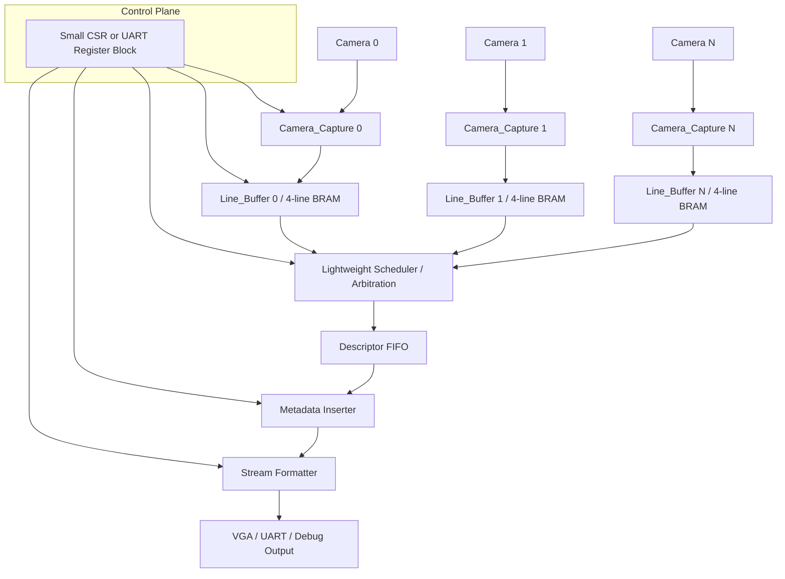
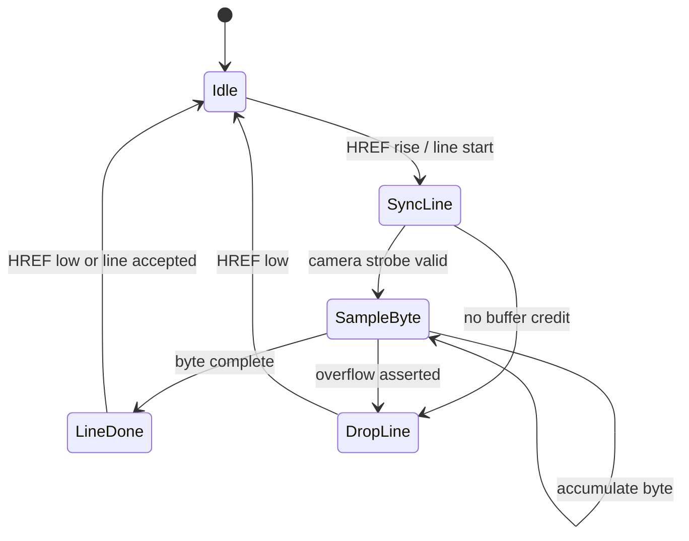
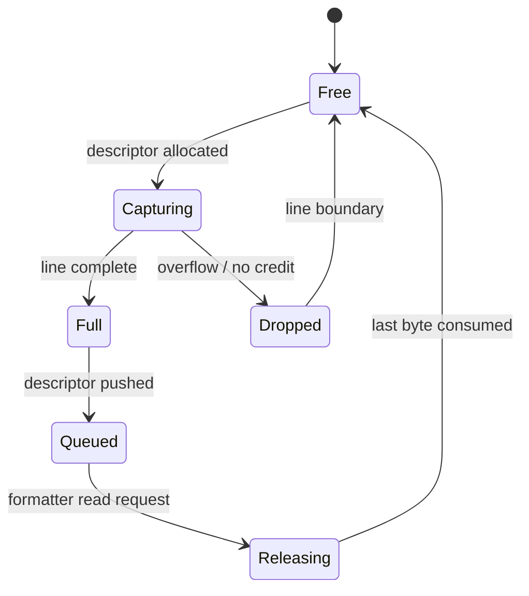
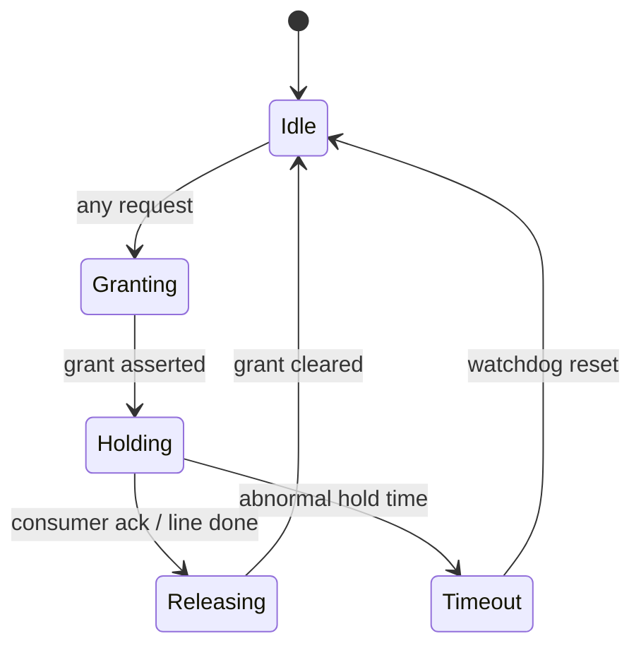
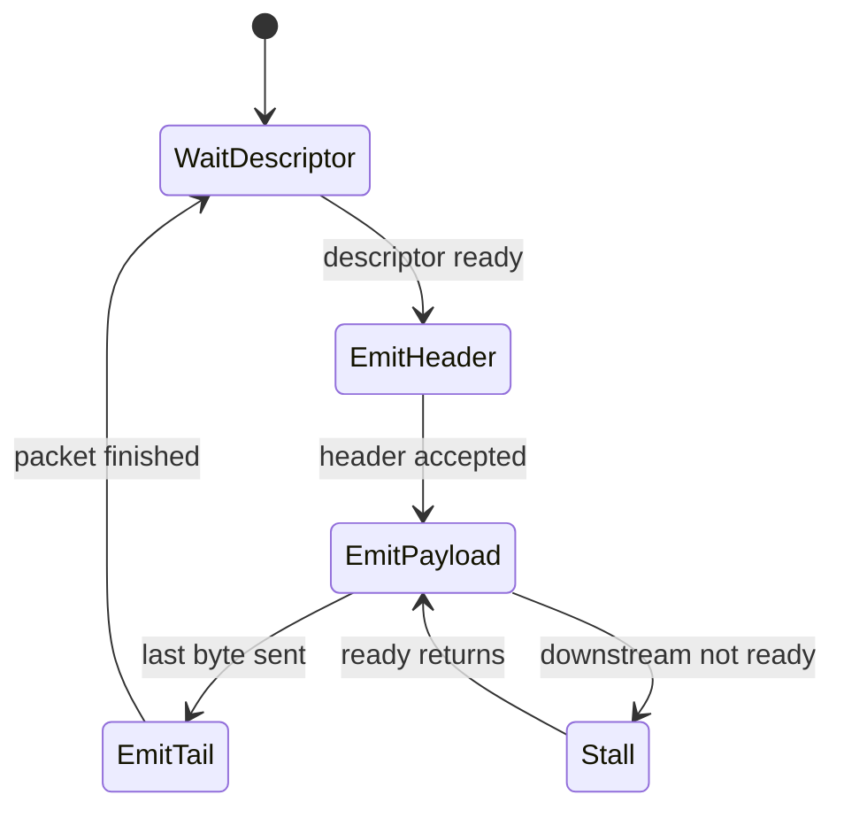
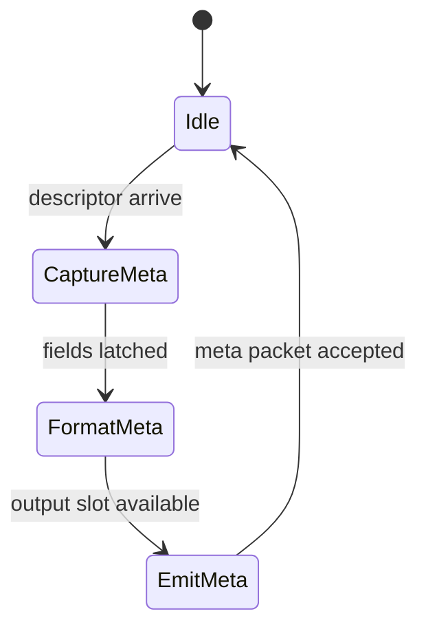
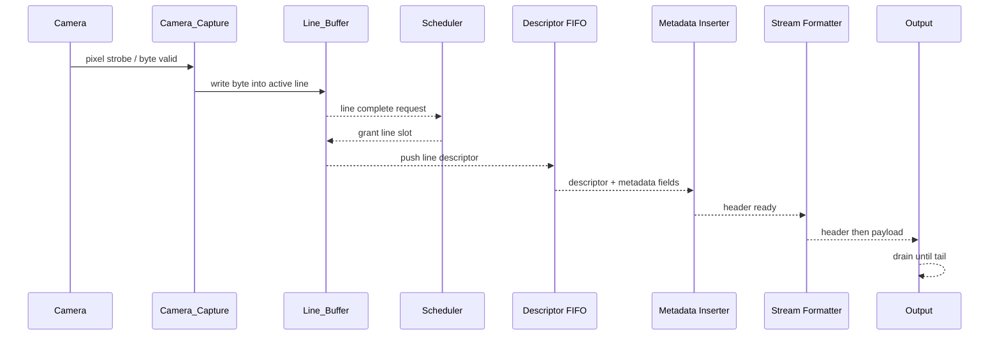

# RP2354 视觉流水线 FPGA 侧架构评审

> 2026-07-17 implementation note: 本文前半部分保留早期架构取舍记录；当前可综合实现已经更新为四相机、100 MHz `sys_clk` 主域和固定 128-byte 输入包。最新模块级事实以 [fpga_module_structure.md](fpga_module_structure.md) 和 [fpga_fifo_refactor_status.md](fpga_fifo_refactor_status.md) 为准。

本文是基于当前仓库事实、并结合新的项目目标重新写出的架构评审。它不是对现有 Verilog 做语法优化，而是从系统层面重新裁剪：保留还有效的能力，删除为旧目标准备的过度设计，给出可验证的最小版本和未来高带宽版本的分层路线。

当前仓库里能核实的基础事实是：工程器件是 xc7a50ticsg324-1L，板卡是 Nexys A7 50T，工具链是 Vivado v2025.2.1。现存的 `Pixel_Generator`、`Line_Generator`、`AXI4_Compiler` 已移动到 `new/deprecated/`，仅用于记录重构前的 4-bit 组字、旧行缓存和 AXI4/DDR2 架构。[Pixel_Generator.v](../prg_cam.srcs/sources_1/new/deprecated/Pixel_Generator.v) [Line_Generator.v](../prg_cam.srcs/sources_1/new/deprecated/Line_Generator.v) [AXI4_Compiler.v](../prg_cam.srcs/sources_1/new/deprecated/AXI4_Compiler.v)

## 1. 总体结论

新的目标是 640x480、Y8、只验证相机接收、FPGA 管线和缓冲正确性，而不是追求最大吞吐。以这个目标看，当前架构明显偏向旧时代：它为了“未来可能的高带宽输出”提前引入了 DDR2 临时存储、AXI4-Full 写通道、异步 FIFO、DMA、双控制器和额外的总线整形层。这些组件对当前目标的直接价值很低，但会增加时钟域、时序、调试和资源复杂度。

推荐的系统方向是：

Camera ingress -> per-camera byte capture -> per-camera line buffer / 4-line ring -> lightweight scheduler -> stream formatter -> VGA or UART / debug output

这条链路保留相机接收和缓冲正确性，移除所有不服务于当前输出的重型内存体系。若未来必须恢复高带宽、长时延、可重放或网络输出，再把 DDR2 和 AXI4 写路径作为可选扩展层加回去，而不是作为当前主干。

## 2. 模块取舍

| 当前模块 | 处理方式 | 理由 |
|---|---|---|
| Pixel_Generator | 合并进 Camera_Capture 层 | 历史实现仍是 4-bit 组 16-bit，和新的 Y8 目标不匹配。[Pixel_Generator.v](../prg_cam.srcs/sources_1/new/deprecated/Pixel_Generator.v) |
| Line_Generator | 保留能力、替换实现 | 历史模块已由当前 `Line_Buffer` 取代。[Line_Generator.v](../prg_cam.srcs/sources_1/new/deprecated/Line_Generator.v) |
| Arbitration | 保留 | 四相机场景使用轻量 4 路调度器。[Arbitration.v](../prg_cam.srcs/sources_1/new/Arbitration.v) |
| MUX_Machine | 删除 | one-hot grant 后直接组合选择即可。[MUX_Machine.v](../prg_cam.srcs/sources_1/new/deprecated/MUX_Machine.v) |
| Grant_Splitter | 删除 | 纯 wiring 层，直接使用 `grant[3:0]`。[Grant_Splitter.v](../prg_cam.srcs/sources_1/new/deprecated/Grant_Splitter.v) |
| AXI4_Compiler | 删除 | 旧 DDR2 写入核心。[AXI4_Compiler.v](../prg_cam.srcs/sources_1/new/deprecated/AXI4_Compiler.v) |
| fifo_generator_axi | 删除 | 旧 AXI/DDR 跨域搬运层。 |
| Send_Control | 删除 | 旧 DMA AXI-Lite 控制器。[Send_Control.v](../prg_cam.srcs/sources_1/new/deprecated/Send_Control.v) |
| System_RefControl | 删除 | 旧参考帧 DMA 控制器。[System_RefControl.v](../prg_cam.srcs/sources_1/new/deprecated/System_RefControl.v) |
| Location_Generator | 删除 | 与当前验证目标无关。[Location_Generator.v](../prg_cam.srcs/sources_1/new/deprecated/Location_Generator.v) |
| Location_Buffer | 删除 | 旧 location/Ethernet 原型。[Location_Buffer.v](../prg_cam.srcs/sources_1/new/deprecated/Location_Buffer.v) |

## 3. 应保留的核心能力

当前真正还值得保留的能力只有三类：

1. 相机采样和字节化入口。
2. 行级缓冲和帧计数。
3. 多相机调度时的轻量仲裁。

在这个定义下，最小可行的保留模块集合不是原来的整条 AXI/DDR 链，而是：Camera_Capture、Line_Buffer、Arbitration、Stream_Formatter、Control/Status。

Pixel_Generator 不应该继续作为“16-bit pixel packer”保留；它的能力已经被吸收到 `Camera_Capture`。Line_Generator 的有效能力也已收敛到 `Line_Buffer`，历史实现见 [deprecated/](../prg_cam.srcs/sources_1/new/deprecated/README.md)。

## 4. DDR2 是否仍然必要

结论：对当前版本，不必要。

原因很直接。新目标只要求 640x480、Y8、验证接收和缓冲正确性；板上实际可用的输出只有 VGA 和 UART。这样的目标不需要把整帧落 DDR2 再通过 DMA 拉出来。现有设计中的 DDR2 更像是为“旧目标中的高带宽外发”准备的通用缓冲池，而不是当前验证路径的最短闭环。[prg_cam.xpr](prg_cam.xpr#L46-L47) [prg_cam.gen/sources_1/bd/design_1/synth/design_1.v](prg_cam.gen/sources_1/bd/design_1/synth/design_1.v#L478-L551)

DDR2 只有在以下情况重新变得有意义：

- 需要完整帧缓存并允许下游慢速读取。
- 需要跨帧重放、后处理或随机访问。
- 需要保留未来的 Ethernet / USB3 / 主机拉流扩展。
- 需要同时支撑多个消费者，而不希望相机输入节奏直接压到输出端。

如果这些条件都不成立，DDR2 只是增加复杂度和时序风险。

## 5. AXI4 是否还值得保留

结论：当前版本不值得保留 AXI4-Full 数据写路径。

仓库里现在的 AXI4 写通道是 128-bit、write-only、burst write、连到 smartconnect 和 MIG，再配上异步 FIFO 和 DMA 控制器。[prg_cam.gen/sources_1/bd/design_1/ip/design_1_AXI4_Compiler_0_0/synth/design_1_AXI4_Compiler_0_0.v](prg_cam.gen/sources_1/bd/design_1/ip/design_1_AXI4_Compiler_0_0/synth/design_1_AXI4_Compiler_0_0.v#L129-L157) [prg_cam.gen/sources_1/bd/design_1/synth/design_1.v](prg_cam.gen/sources_1/bd/design_1/synth/design_1.v#L406-L551) 这套链路适合“写 DDR2 再由别的系统读”，但不适合当前只想确认相机接收正确性的版本。

建议保留的不是 AXI4-Full 数据面，而是最多一条很小的控制面，例如 AXI-Lite 或 UART 寄存器接口，用于配置分辨率、相机选择、测试模式和状态读取。数据平面应改成内部流式链路，而不是 AXI4 写内存。

## 6. 4-line ring buffer 是否够用

结论：对当前版本，够用；对未来完整高带宽版本，不够。

640x480 Y8 的单行有效数据量是 640 bytes。4 行 ring buffer 只是 2560 bytes / camera，这个规模非常适合做行级解耦、短时 backpressure 吸收、以及 line correctness 验证。[prg_cam.gen/sources_1/bd/design_1/ip/design_1_Line_Generator_0_0/synth/design_1_Line_Generator_0_0.v](prg_cam.gen/sources_1/bd/design_1/ip/design_1_Line_Generator_0_0/synth/design_1_Line_Generator_0_0.v#L55-L55) 如果你的目标是 VGA 扫描输出或 UART 低速观察，这个缓冲深度已经足够。

但如果要完整支撑多相机、帧级并发和慢速外发，4 行只够做“流水线的喘息区”，不够做帧级解耦。那个时候应该把 4-line buffer 视作前端弹性缓存，而不是主缓冲。

## 7. 溢出处理应该怎么改

当前版本的溢出处理不应该隐藏在多个模块内部，而应该提升为显式的缓冲资源管理。

推荐规则是：

- 每个相机通道维护一个 line credit 计数。
- HREF 上升时如果没有可用 line credit，就直接把整行标成 drop，而不是继续写一半再补救。
- line 结束时才提交一次 descriptor，descriptor 里记录 cam_id、frame_id、line_id、valid/overflow 标志。
- overflow 是一个 line-level 事件，不是一个像素级修补事件。

这样做的好处是，系统不会因为局部满载在多个模块里各自做“猜测式补救”。旧 `Line_Generator` 中 request、overflow、request/grant 和 FIFO 满空之间的耦合已被拆分为当前 `Line_Buffer` 的行级 credit 与独立 `Arbitration`。

## 8. packet construction 是否应和 line buffering 合并

结论：应合并到同一个 front-end 里，至少在逻辑上要紧耦合。

这里的 packet construction 不应该再像旧架构那样独立成 AXI4 写包 + DMA 包 + 参考帧包三套机制。对当前版本，最自然的切法是：

- line buffer 负责把一行收完整。
- 行结束时产生一个 descriptor。
- formatter 读取 descriptor，发出一帧或一行的 packet header。
- payload 直接从行缓冲中吐出。

也就是说，packet construction 应该靠近 line completion，而不是远离它挂在 DDR2 之后。这样最容易验证 frame correctness，也最容易插入 metadata。

## 9. metadata 应如何插入输出流

建议不要把 metadata 混进像素字节本身，而是在输出流上使用独立 header。

推荐字段：frame_id、line_id、cam_id、timestamp、gyro、accel。插入方式有两种：

1. 行头模式：每行前面先发短 header，再发 640 bytes payload。
2. 帧头模式：每帧先发更大的 header，后面按行发 payload。

对于当前验证目标，行头模式更实用，因为它最适合定位丢行、重复行和乱序问题。metadata 应该来自 descriptor FIFO，由 formatter 在输出侧按顺序拼接，而不是由各个相机模块各自向下游直接喷 sideband 信号。

如果最终输出是 VGA，则 metadata 不应进入显示像素流，而应走 UART / debug stream。若最终输出是串流协议，则 metadata 作为封包头存在即可。

## 10. 推荐架构图

## 11. 各模块状态图

### Camera_Capture

### Line_Buffer

### Scheduler / Arbitration

### Stream_Formatter

### Metadata Inserter

## 12. 完整 timing flow

对于当前版本，最重要的时序事实是：延迟按“行”为单位，而不是按“整帧 + DDR 往返”为单位。也就是说，第一层可观察延迟大约是一个行时间加少量控制开销，而不是完整帧缓存路径。

## 13. BRAM 估算

按 640x480 Y8 重新估算：

- 单行数据量 = 640 bytes = 5120 bits。
- 4 行 ring buffer = 2560 bytes = 20480 bits / camera。
- 一个 18Kb BRAM 约 18432 bits，所以 payload-only 的 4-line buffer 每个 camera 至少要 2 个 BRAM18，实际做成双口、带对齐和读写分离时，保守按 2 到 3 个 BRAM18 / camera 估算更稳。

如果是 2 路摄像头，行缓冲大约是 4 到 6 个 BRAM18，再加 descriptor / metadata FIFO 和少量控制 RAM，总体仍然很轻。

如果是 8 路摄像头，payload-only 的 4-line buffer 大约是 16 个 BRAM18 左右，再加控制和 descriptor，仍然远低于把 8 路整帧都压进 DDR2 再做 AXI4 写回的复杂度成本。

## 14. LUT 估算

当前重构后的轻量版本，LUT 主要消耗在：

- Camera_Capture 里的同步、字节组装和 line counter。
- Line_Buffer 的地址管理和 descriptor 逻辑。
- Scheduler 的仲裁与锁存。
- Formatter 的 header/payload FSM。

对 2 路摄像头的最小版本，粗略估计在 1.5k 到 3k LUT 级别。若扩展到 8 路摄像头并保留更完整的 metadata 头格式，可能上升到 3k 到 6k LUT 级别，但仍明显低于当前 DDR2 + AXI4 + DMA 总线化方案的整体复杂度。

这只是架构级估算，不是综合结果；但方向上很明确：删掉 AXI4/DDR2 后，LUT 压力会显著下降，时钟收敛风险也会明显下降。

## 15. Latency 估算

当前推荐版本的延迟分成三层：

1. 字节采样延迟：一个像素时钟到一个字节有效，通常是 1 到若干个采样周期。
2. 行缓冲延迟：约 1 行，等行完成后再进入 descriptor / formatter。
3. 输出排队延迟：取决于是否有其他相机正在占用 formatter，通常是 0 到几行。

对 640x480 Y8 的验证目标，最常见的端到端延迟会在“1 行 + 少量控制周期”的范围内。若把 frame header 放在整帧前面，则第一字节可见延迟会增加到“等待首行完成 + header 输出”的级别，但仍比 DDR2 全帧缓存低得多。

## 16. 当前架构中哪些部分是过度设计

过度设计的核心不是某个语法写法，而是整条数据面被设计成了“为未来高带宽输出预先铺路”，而当前目标已经变了。

明显过度的部分包括：

- DDR2 作为临时图像仓库。
- AXI4-Full 128-bit 写通道。
- Async FIFO 到 DDR2 的跨域搬运。
- DMA + DMA 控制器 + 双控制器。
- Grant_Splitter 这类纯 wiring 中间层。
- MUX_Machine 这种在 one-hot 已经存在时仍要再包一层组合选择的模块。
- Send_Control / System_RefControl 这种围绕 DMA 写寄存器的控制器。

为什么说它们过度：因为新目标已经不要求最大带宽和外部高速输出，而只要求验证接收、管线和缓冲正确性。把一个为旧目标准备的完整后端继续挂在当前版本上，只会让每一条异常都更难定位。

## 17. 迁移计划

### Current Architecture

Camera -> Pixel_Generator -> Line_Generator -> Grant_Splitter / Arbitration -> MUX_Machine -> AXI4_Compiler -> Async FIFO -> DDR2 -> DMA -> Output

这是现在仓库里已经能核实的形态。[prg_cam.gen/sources_1/bd/design_1/synth/design_1.v](prg_cam.gen/sources_1/bd/design_1/synth/design_1.v#L237-L551)

### Recommended Architecture

Camera -> Camera_Capture -> Line_Buffer / 4-line BRAM -> Scheduler -> Descriptor FIFO -> Metadata Inserter -> Stream Formatter -> VGA / UART

这是面向当前 640x480 Y8 目标的推荐形态。AXI4 数据面、DMA、DDR2 都不作为主路径存在。

### Minimal Validation Version

Camera -> Byte Capture -> Single-line or 4-line Buffer -> Line Counter / Frame Counter -> UART or VGA debug output

这个版本只保留最小闭环：相机输入正确、行号正确、帧号正确、缓冲不乱、溢出可见。它是当前任务的最佳验证基线。

### Future High-bandwidth Version

Camera -> Capture -> Line Buffer -> Scheduler -> DDR2 Frame Store -> AXI4 / DMA -> Ethernet / USB3 / Host

只有在未来真的需要大吞吐、长时延解耦或高速外发时，才把 DDR2 和 AXI4 数据面重新放回主路径。那时它们才是“值得付出复杂度”的组件。

## 18. 最终回答摘要

1. 应保留：相机采样前端、行缓冲、轻量仲裁、描述符/元数据格式化器。
2. 应合并：Pixel_Generator 进入 Camera_Capture，Line_Generator 进入 Line_Buffer / Channel FSM，MUX_Machine 并入 Arbitration 或删除，packet construction 并入 line completion 逻辑。
3. 应删除：AXI4_Compiler、fifo_generator_axi、DMA 控制链、Send_Control、System_RefControl、Grant_Splitter、Location_Generator、Location_Buffer 的主路径版本。
4. DDR2：当前版本不需要；仅在未来重放、整帧缓存、慢速外发或高速网络输出时再启用。
5. AXI4：当前版本不值得保留 AXI4-Full 数据面；最多保留很小的控制面。
6. 4-line ring buffer：当前版本足够，未来高带宽版本不够。
7. overflow：按 line-level credit 和 descriptor 丢弃策略重做，不要像素级修补。
8. metadata：通过 descriptor FIFO + packet header 插入，不要混进像素 payload。

## 19. 2026-07 实施状态

当前实现已调整为四相机 `Camera_Pipeline`：`4 x (Camera_Capture -> 4-packet Line_Buffer) -> Arbitration -> Byte_Replacer -> Byte_FIFO`。相机 `pclk` 由 `Alarmer` 转成 100 MHz `sys_clk` 域采样脉冲；输入是已经包含 header 和 CRC tail 的固定 128-byte 包。FPGA 只合并 offset 4 的 `cam_id`、offset 9 的 `row_flags` 并重算 offset 126/127 的 CRC。旧 `Packet_Formatter`、AXI4/DDR2/DMA 与多余 glue 模块均默认隔离，当前资源与验证结果见 [fpga_fifo_refactor_status.md](fpga_fifo_refactor_status.md)。
