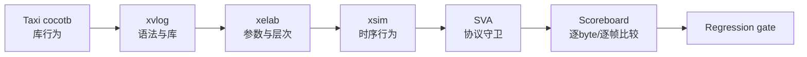
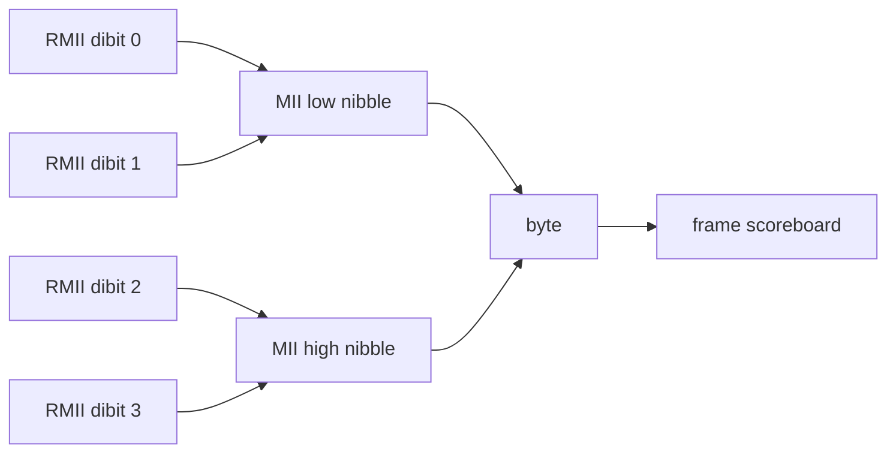

# 16 Xilinx 仿真、断言与记分板

> 目标：复刻“Taxi 库回归 → XSim 编译/展开/运行 → AXI-Stream 断言 → FIFO与RMII记分板”的验证过程。每一步都说明做什么、为什么做，以及工具实际执行了什么。

## 事实来源范围

- Taxi测试与参数：`../../prg_cam.srcs/sources_1/lib/taxi-master/*/tb/`中的Makefile和testbench。
- 项目TB：`../../prg_cam.srcs/sim_1/new/`。
- 当前日志：`../../build/ethernet_frame_adapter_sim/`、`../../build/byte_fifo_source_sim/`、`../../build/taxi_mii_fifo_elab/`、`../../build/camera_pipeline_regression/`。
- 依赖入口：`../../scripts/add_taxi_sources.tcl`和`../taxi_compile_manifest.txt`。
- 事实优先级：当前源码 > 当前日志/报告 > 旧文档。没有日志的测试一律不写成PASS。

## 未确认项

- 仓库中存在Taxi cocotb测试，但当前证据目录没有本轮cocotb的`FAIL=0`日志，因此状态为PENDING。
- `tb_Fixed_Frame_Taxi_Rmii`证明RMII活动和12次good-frame事件，但当前仿真TB没有逐dibit重建并自动核对完整线上帧；完整RMII仿真scoreboard仍为PENDING。
- 现有硬件CSV分析已经检查preamble、SFD、FCS和IFG，但硬件分析不能替代仿真中的随机stall覆盖。

## 1. 验证层次



原则是先证明依赖闭包和模块能展开，再证明握手行为，最后证明字节内容。只看到波形翻转不等于内容正确；只看到`tx_fifo_good_frame`也不等于帧已经到达网线。

## 2. Taxi 自带 cocotb 回归

### 2.1 当前实际目录

| 目录 | 关注范围 | 当前状态 |
|---|---|---|
| `eth/tb/taxi_eth_mac_mii_fifo` | 本工程使用的10/100 MII MAC+FIFO | AVAILABLE / PENDING RUN |
| `eth/tb/taxi_eth_mac_1g_gmii_fifo` | 1G GMII，学习和回归用 | AVAILABLE / OPTIONAL |
| `eth/tb/taxi_eth_mac_1g_rgmii_fifo` | 1G RGMII，学习用 | AVAILABLE / OPTIONAL |
| `axis/tb/taxi_axis_fifo` | 同步FIFO、frame FIFO、反压 | AVAILABLE / OPTIONAL |
| `axis/tb/taxi_axis_async_fifo` | CDC FIFO | AVAILABLE / OPTIONAL |
| `axis/tb/taxi_axis_adapter` | AXIS位宽适配 | AVAILABLE / OPTIONAL |

本地MII Makefile默认`SIM=verilator`、`WAVES=0`、`PARAM_SIM=1`、`PARAM_VENDOR="XILINX"`、`PARAM_FAMILY="virtex7"`。Artix-7覆盖值是运行时显式覆盖，不要把它误写成仓库默认值。

### 2.2 命令

在带GNU Make的Git Bash、MSYS2或WSL环境中执行：

```bash
cd prg_cam.srcs/sources_1/lib/taxi-master/eth/tb/taxi_eth_mac_mii_fifo
make SIM=verilator PARAM_FAMILY='"artix7"'
make SIM=verilator WAVES=1 PARAM_FAMILY='"artix7"'
```

如果使用Icarus：

```bash
make SIM=icarus PARAM_FAMILY='"artix7"'
```

做什么：Make调用cocotb runner、编译Taxi测试顶层并运行Python激励/记分板。

为什么：先把上游库与本工程集成问题分离。若库自身回归失败，应保存第一个失败case，而不是先修改项目wrapper。

机制：`PARAM_SIM=1`选择仿真配置；`PARAM_VENDOR/FAMILY`影响Taxi内部厂商实现分支。最终判据必须来自cocotb结果行，例如`PASS>0, FAIL=0`，不能只看进程退出或波形文件存在。

## 3. XSim三阶段

### 3.1 xvlog：编译

```powershell
& 'D:\Xilinx_Vivado\2025.2.1\Vivado\bin\xvlog.bat' `
  --incr --relax -prj .\scripts\taxi_mii_fifo_vlog.prj
```

做什么：把Verilog/SystemVerilog源编译进XSim工作库。

为什么：检查语法、package/interface可见性和编译顺序。

机制：`xvlog`只建立编译单元，不会实例化完整层次。Taxi `.sv`必须按SystemVerilog解析，否则`interface`会在这一阶段报错。

### 3.2 xelab：展开

```powershell
& 'D:\Xilinx_Vivado\2025.2.1\Vivado\bin\xelab.bat' `
  --debug typical --relax -L unisims_ver `
  tb_Taxi_Eth_Mac_Mii_Fifo_Elab glbl `
  -s tb_Taxi_Eth_Mac_Mii_Fifo_Elab_sim
```

做什么：解析参数、生成实例层次、绑定interface端口和Xilinx原语模型。

为什么：很多“源码能编译、顶层却不能用”的问题只在elaboration暴露，例如参数不存在、端口宽度不符或模块缺失。

机制：`-L unisims_ver`为设计中的7-series原语提供仿真库；`-s`给快照命名。展开成功不代表数据功能正确。

### 3.3 xsim：运行

```powershell
& 'D:\Xilinx_Vivado\2025.2.1\Vivado\bin\xsim.bat' `
  tb_Taxi_Eth_Mac_Mii_Fifo_Elab_sim -runall
```

做什么：推进仿真时间、执行激励、断言和scoreboard。

为什么：只有运行阶段能验证stall、reset、TLAST和多帧序列。

机制：XSim按事件调度执行RTL。`$finish`只表示TB主动结束；必须同时检查TB打印的PASS、断言计数和退出前FIFO状态。

## 4. 当前项目TB与证据

| TB | 输入和扰动 | 自动检查 | 当前证据 |
|---|---|---|---|
| `tb_Ethernet_Frame_Adapter.sv` | 128 byte，含ready stall | 14-byte头、payload、TLAST、稳定性 | PASS日志存在 |
| `tb_Byte_FIFO_Ethernet_Source.sv` | 连续、暂空、反压、末byte stall、reset | 顺序、长度、TLAST、timeout、5帧 | PASS；push=256、pop=256、frame_hs=284 |
| `tb_Taxi_Eth_Mac_Mii_Fifo_Elab.sv` | 最小端口激励 | Taxi闭包可展开 | compile/elab PASS |
| `tb_Taxi_Rmii_Subsystem_Elab.sv` | flat wrapper+bridge | wrapper层次可展开 | PASS日志存在 |
| `tb_Fixed_Frame_Taxi_Rmii.sv` | `00..7F`重复帧 | RMII活动、underflow/overflow、good-frame事件 | PASS；good_frames=12 |
| `tb_Camera_Pipeline.sv` | 4路Camera packet | 仲裁、header merge、CRC-16 | PASS日志存在 |

`tb_Byte_FIFO_Ethernet_Source`的最后状态比“出现过一帧”更重要：reset后的256次写入与256次读出相等，说明该运行没有无法解释的FIFO积压。

## 5. AXI-Stream断言

断言建议放在TB、`bind`模块或用`ifndef SYNTHESIS`保护。不要笼统假设所有SVA都不会进入综合。

```systemverilog
// valid被阻塞时，producer必须保持事务。
assert property (@(posedge clk) disable iff (rst)
    valid && !ready |=> valid && $stable(data) && $stable(last));

// TLAST是当前有效beat的属性，不是独立完成脉冲。
assert property (@(posedge clk) disable iff (rst)
    last |-> valid);

// 有效输出不得携带X/Z。
assert property (@(posedge clk) disable iff (rst)
    valid |-> !$isunknown({data, last}));

// 末beat若被stall，整个末beat必须保持。
assert property (@(posedge clk) disable iff (rst)
    valid && last && !ready |=> valid && last && $stable(data));
```

不要把`almost_full`写成“禁止任何写入”。当前`Byte_FIFO`的`almost_full`表示剩余RAM空间不足一个128-byte packet，真正是否接收由`in_valid && in_ready`决定；`level`还包含RAM外的output holding register。

## 6. Handshake计数与自动byte compare

推荐在TB中只对真实握手计数：

```systemverilog
if (valid && ready) begin
    if (data !== expected_byte)
        $fatal(1, "byte mismatch idx=%0d got=%02x exp=%02x",
               byte_index, data, expected_byte);
    if (last !== (byte_index == 127))
        $fatal(1, "TLAST mismatch idx=%0d", byte_index);
    byte_index <= last ? 0 : byte_index + 1;
    if (last) frame_count <= frame_count + 1;
end
```

通过标准：写握手数=读握手数；每帧128个payload beat；TLAST只在index 127；仿真结束`level==0`；timeout未触发。

## 7. RMII dibit/nibble/byte scoreboard

100M模式下每个MII nibble占25 MHz的一拍，每个RMII dibit占50 MHz的一拍；一个byte由四个dibit组成。scoreboard必须按bridge源码确认顺序，不能凭经验猜LSB/MSB先后。



完整自动检查顺序：

1. TXEN上升后检查`55`×7。
2. 第8 byte检查SFD=`D5`。
3. 检查14-byte Ethernet II header。
4. 检查128-byte payload=`00..7F`。
5. 对`DST..payload`重算Ethernet CRC-32并比较4-byte FCS。
6. TXEN下降后检查至少12 byte-times IFG。

当前仿真仅完成到“RMII有活动、错误标志为0”；逐dibit仿真scoreboard是后续高优先级PENDING。硬件CSV可用`../../scripts/analyze_ethernet_ila_capture.ps1`作独立参考，但不能替代此TB。

## 8. Reset、边界和timeout

每个功能TB至少覆盖：

- reset在空闲期释放；
- reset在传输中打断，旧半帧不得被当成新完整帧；
- 上游暂时无valid；
- 下游连续和随机stall；
- 最后一个byte被stall多拍；
- 两帧背靠背；
- FIFO接近容量边界；
- 足够长的仿真时间和显式timeout。

timeout模板：

```systemverilog
initial begin
    #1ms;
    $fatal(1, "TIMEOUT: simulation did not reach completion gate");
end
```

## 9. 仿真Gate矩阵

| Gate | PASS条件 | 当前状态 |
|---|---|---|
| Taxi cocotb MII | 结果表`FAIL=0`，保存日志与版本 | PENDING |
| Taxi compile/elab | missing/duplicate=0，snapshot建立 | PASS |
| Adapter unit | header/payload/TLAST/stall自动比较 | PASS |
| Byte_FIFO source | 5帧、reset/stall、push=pop、无积压 | PASS |
| Fixed→Taxi→RMII smoke | RMII活动、underflow/overflow=0 | PASS（活动级） |
| RMII完整仿真scoreboard | preamble至IFG逐项自动比较 | PENDING |
| Camera Pipeline RTL | 4路数据、仲裁、CRC-16自动比较 | PASS（有限覆盖） |

## 10. 复刻检查清单

- [ ] 记录仿真器、Python、cocotb和Taxi本地源码版本。
- [ ] 保存完整命令、stdout/stderr、随机种子和波形路径。
- [ ] `xvlog`、`xelab`、`xsim`分别判定，不能用后一阶段掩盖前一阶段warning。
- [ ] stall期间valid/data/last稳定断言零失败。
- [ ] 所有byte只在`valid && ready`时计数。
- [ ] TLAST位置、多帧边界、reset中断和timeout全部有自动判据。
- [ ] 仿真结束FIFO无未解释积压。
- [ ] `tx_fifo_good_frame`只记为FIFO提交证据，不写成线上发送完成。
