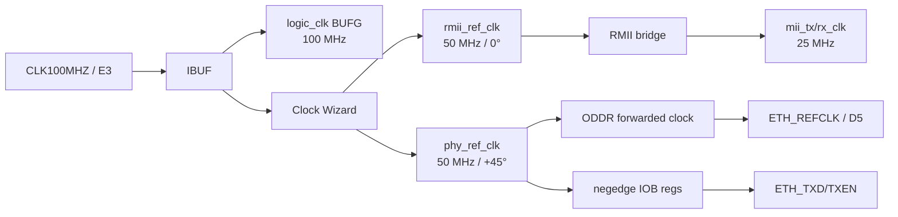

# 17 Vivado 综合、实现与RMII时序

> 目标：复刻“源文件闭包 → 综合 → 布局布线 → CDC/DRC/时序 → bitstream”的流程，并理解ODDR、IOB和外部I/O delay为什么决定PHY能否稳定采样。

## 事实来源范围

- 活动顶层：`../../prg_cam.srcs/sources_1/new/Camera_Ethernet_Top.sv`。
- 活动约束：`../../prg_cam.srcs/constrs_1/new/nexys_a7_ethernet.xdc`。
- Clock Wizard：`../../prg_cam.srcs/sources_1/ip/ethernet_clk_wiz/ethernet_clk_wiz.xci`。
- 构建脚本：`../../scripts/implement_ethernet_bringup.tcl`、`../../scripts/build_ethernet_ila.tcl`。
- 当前报告：`../reports/ethernet_bringup/post_route_*.rpt`。
- 当前数字：WNS +0.492 ns、WHS +0.053 ns；RMII TX外部setup +5.288 ns、hold +8.048 ns；DRC 19条Warning。

## 未确认项

- 最新ODDR/IOB源码已有routed DCP，但尚无对应的新bitstream/ltx和硬件复验。
- RX没有`set_input_delay`，没有完整RX验收。
- output delay使用PHY需求建立了FPGA边界模型，但仓库没有板级走线偏差测量；尚不构成温压和多次clean build sign-off。
- methodology仍报告5条TIMING-18，其中3条是ETH_TXD/TXEN。时序报告证明上升沿capture约束已应用，但warning尚未书面豁免或清零。

## 1. 设计与时钟树



Clock Wizard的`reset`是高有效，顶层连接`~CPU_RESETN`。`locked`只参与后级约10.49 ms的PHY reset释放，不反馈到Clock Wizard自身reset，因此没有locked自复位死锁。

## 2. Taxi源文件闭包

### 做什么

```powershell
& 'D:\Xilinx_Vivado\2025.2.1\Vivado\bin\vivado.bat' `
  -mode batch -nolog -nojournal `
  -source .\scripts\add_taxi_sources.tcl
```

### 为什么

Taxi包含嵌套`.f`和SystemVerilog interface。只添加顶层`.sv`会在展开或综合时缺模块；递归添加整棵仓库则可能带入testbench、example和重复定义。

### Vivado机制

脚本从`taxi_eth_mac_mii_fifo.f`出发，按每个`.f`自身目录解析相对路径；失效路径只在本地Taxi目录按文件名重映射。当前manifest为8个`.f`、26个RTL、16个唯一remap、missing=0。所有`.sv`设置为SystemVerilog，再执行`update_compile_order`和missing-instance检查。

## 3. 综合、优化、布局和布线

当前基线脚本的真实顺序：

```tcl
synth_design -top Camera_Ethernet_Top -part xc7a50ticsg324-1L
opt_design
place_design
phys_opt_design
route_design
```

| 阶段 | 做什么 | 机制 | 主要失败类型 |
|---|---|---|---|
| synth_design | RTL变为器件网表 | 推断LUT/FF/BRAM、展开参数和层次 | missing module、多驱动、宽度错误 |
| opt_design | 逻辑优化 | 常量传播、冗余删除、物理可实现检查 | 不可驱动网、冲突约束 |
| place_design | 放置单元 | 为SLICE/BRAM/IOB/MMCM选站点 | I/O或clock资源冲突 |
| phys_opt_design | 物理优化 | 复制、重定时或路径优化 | 余量不足、拥塞 |
| route_design | 路由网络 | 选择可编程互连并计算真实延迟 | unrouted nets、timing failure |

route PASS只证明网络完成且已约束路径满足当前时序，不证明PHY link或Wireshark PASS。

## 4. 为什么必须转发REFCLK

早期写法是把内部`phy_ref_clk`直接assign到`ETH_REFCLK`。这种功能描述可能产生时钟输出，但不会自动建立一个可审计的forwarded-clock I/O接口。

当前RTL使用7-series ODDR：

```systemverilog
ODDR #(
    .DDR_CLK_EDGE("SAME_EDGE"), .INIT(1'b0), .SRTYPE("SYNC")
) u_eth_refclk_oddr (
    .Q(ETH_REFCLK), .C(phy_ref_clk), .CE(1'b1),
    .D1(1'b1), .D2(1'b0), .R(1'b0), .S(1'b0)
);
```

做什么：D1恒1、D2恒0，让ODDR在每个半周期翻转输出，保持Clock Wizard的50 MHz/+45°相位。

为什么：ODDR位于专用OLOGIC路径，可把内部时钟和输出端口的关系交给时序引擎分析。

机制：`create_generated_clock`把ODDR输入时钟和端口波形关联起来；后续`set_output_delay`才有明确参考时钟。

## 5. 为什么TXD/TXEN还需要IOB寄存器

只有ODDR并不能自动保证数据窗口。当前bridge数据相对0° RMII时钟产生，而PHY参考时钟为+45°；如果直接从fabric组合/寄存器输出，板端相位仍依赖路由。

当前顶层在`negedge phy_ref_clk`锁存三根TX信号，并加`IOB=TRUE`：

```systemverilog
(* IOB = "TRUE" *) logic       eth_txen_out;
(* IOB = "TRUE" *) logic [1:0] eth_txd_out;

always_ff @(negedge phy_ref_clk) begin
    eth_txen_out <= rmii_tx_en_dbg;
    eth_txd_out  <= rmii_txd_dbg;
end
```

这样数据在PHY下一次上升采样沿之前约半个50 MHz周期发出。post-route报告确认三个寄存器进入OLOGIC/IOB；此级只调整I/O发射时刻，不改变既有dibit顺序或上游ETH数据流。

## 6. RMII TX约束

当前活动XDC：

```tcl
create_generated_clock -name eth_refclk_out \
    -source [get_pins {u_eth_refclk_oddr/C}] \
    -divide_by 1 [get_ports {ETH_REFCLK}]

set_output_delay -clock [get_clocks {eth_refclk_out}] -max  4.000 \
    [get_ports {ETH_TXEN ETH_TXD[*]}]
set_output_delay -clock [get_clocks {eth_refclk_out}] -min -1.500 \
    [get_ports {ETH_TXEN ETH_TXD[*]}]
```

`-max 4.000`表达接收器的setup需求；`-min -1.500`用负值表达接收器在采样沿后的正hold需求。数值来源必须与实际PHY工作模式和datasheet版本绑定，复刻时不得凭经验替换。

### 报告如何读

当前clock interaction中：

| From | To | Setup余量 | Hold余量 | 状态 |
|---|---|---:|---:|---|
| `phy_ref_clk_ethernet_clk_wiz` | `eth_refclk_out` | +5.288 ns | +8.048 ns | PASS |

这三条endpoint对应`ETH_TXD[1:0]`和`ETH_TXEN`。正余量说明本次布线满足当前模型，不等于示波器已经验证板外波形。

## 7. 当前实现报告

运行：

```powershell
& 'D:\Xilinx_Vivado\2025.2.1\Vivado\bin\vivado.bat' `
  -mode batch -nolog -nojournal `
  -source .\scripts\implement_ethernet_bringup.tcl
```

输出目录：`docs/reports/ethernet_bringup/`；routed checkpoint：`build/ethernet_bringup/Camera_Ethernet_Top_routed.dcp`。

| 报告 | 当前结论 |
|---|---|
| timing summary | WNS +0.492 ns、WHS +0.053 ns、0 failing endpoint |
| external TX timing | setup +5.288 ns、hold +8.048 ns |
| route status | 620/620 routable nets，0 routing errors |
| CDC | All paths are Safely Timed |
| DRC | 0 Error、0 Critical Warning、19 Warning |
| methodology | 1×SYNTH-6、5×TIMING-18 |

状态必须写成`PASS WITH WARNINGS`，不能写clean sign-off。

## 8. 19条DRC Warning分类

| Rule | 数量 | 含义/当前处置 |
|---|---:|---|
| CFGBVS-1 | 1 | 未设置CFGBVS/CONFIG_VOLTAGE；bitstream前需按板卡电源事实处置 |
| PLIO-6 | 6 | placement/I/O约束检查；逐实例核对，不批量忽略 |
| REQP-1617 | 6 | 建议使用IOB寄存器的接口；TX三根已新增最终IOB级，但其他告警仍存在 |
| REQP-1839 | 2 | RAMB36异步控制检查；来自FIFO结构，需结合CDC和实例审阅 |
| REQP-1840 | 3 | RAMB18异步控制检查；同上 |
| RTSTAT-10 | 1 | 无可路由负载；定位具体网后决定删除、保留或豁免 |

warning数量是实例总数，不是规则种类数。`write_bitstream`成功也不会自动关闭这些warning。

## 9. Methodology Warning

| Rule | 数量 | 当前事实 |
|---|---:|---|
| SYNTH-6 | 1 | `u_ethernet_byte_fifo/mem_reg`未把输出寄存器合入BRAM，可能影响最优时序 |
| TIMING-18 | 5 | CPU_RESETN、ETH_RSTN、ETH_TXD[0]、ETH_TXD[1]、ETH_TXEN |

TXD/TXEN虽仍被methodology泛化检查提示，但`report_timing_summary`已把它们纳入`eth_refclk_out`外部路径并给出正余量。正确处置是记录“约束已应用、rule仍提示边沿覆盖”，然后决定补充falling-edge模型或书面豁免；不能简单声称warning是误报并删除。

CPU_RESETN是异步按钮，ETH_RSTN是启动控制输出，它们与同步数据总线不同；应按真实外部时序需求决定false path、input/output delay或异步控制说明，不能套用RMII数据约束。

## 10. CDC报告

本设计涉及100/50/25 MHz。CDC PASS的重点不是“没有跨域”，而是跨域路径被同步器或异步FIFO正确封装。Taxi TX frame FIFO把100 MHz写侧完整帧提交到25 MHz MII读侧；bridge reset也有自己的同步释放结构。

每次修改reset、FIFO或Clock Wizard后重新运行：

```tcl
report_cdc -details -file post_route_cdc.rpt
```

任何新增unsafe或unknown crossing必须先定位，不得用全局false path掩盖。

## 11. bitstream与debug probes

`implement_ethernet_bringup.tcl`当前只写routed DCP和报告，不写bitstream。普通版本可从routed design执行：

```tcl
open_checkpoint build/ethernet_bringup/Camera_Ethernet_Top_routed.dcp
write_bitstream -force build/ethernet_bringup/Camera_Ethernet_Top.bit
```

ILA版本由`build_ethernet_ila.tcl`同时写`.bit`和`.ltx`。磁盘上现有ILA bit/ltx时间早于ODDR/IOB源码修改，因此只可保存为历史证据；要验证新I/O级必须重新构建。

## 12. 两次clean build复现

不要删除`.runs/.cache/prg_cam.gen`来“修复”依赖。建议使用两个新的输出目录或两份工程副本，固定：

- Vivado 2025.2.1；
- part `xc7a50ticsg324-1L`；
- top与XDC集合；
- Taxi manifest和XCI；
- Tcl命令行。

每次保存bit、ltx、DCP、报告和SHA-256。两次都必须route、timing、CDC、DRC gate一致；hash不同不必然失败，因为布局布线可非确定，但接口时序和warning分类必须一致。

## 13. 实现Gate矩阵

| Gate | PASS条件 | 当前状态 |
|---|---|---|
| source/dependency | missing=0、duplicate=0 | PASS |
| synthesis | 无missing/multi-driver | PASS |
| route | 0 routing errors | PASS |
| timing | WNS/WHS≥0 | PASS |
| RMII TX output timing | setup/hold≥0 | PASS（本次实现） |
| CDC | 无unsafe crossing | PASS |
| DRC/methodology clean | Error/Critical=0且warning闭环 | FAIL/OPEN |
| latest normal bitstream | 对应最新ODDR/IOB源码 | PENDING |
| latest ILA bit/ltx | 同次实现、可识别probe | PENDING |
| two clean builds | 两次独立证据一致 | PENDING |

## 14. 部署检查清单

- [ ] 只通过Taxi入口`.f`递归加入26个依赖RTL。
- [ ] top、part、XCI和活动XDC均记录在日志中。
- [ ] Clock Wizard reset为高有效，locked不反馈自身reset。
- [ ] ODDR存在于D5输出路径，三个TX寄存器进入IOB/OLOGIC。
- [ ] `eth_refclk_out`和两条output delay命令匹配实际端口。
- [ ] WNS/WHS和RMII TX外部setup/hold均非负。
- [ ] CDC无unsafe；DRC/methodology逐条分类。
- [ ] 新bitstream从最新routed design生成并记录hash。
- [ ] ILA版本的bit和ltx来自同一次实现。
- [ ] 两次clean build完成前不宣布可重复构建PASS。
