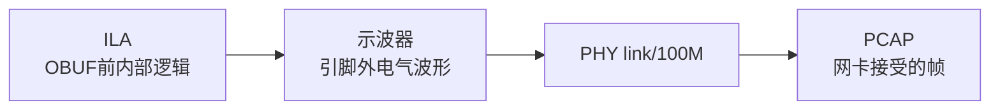
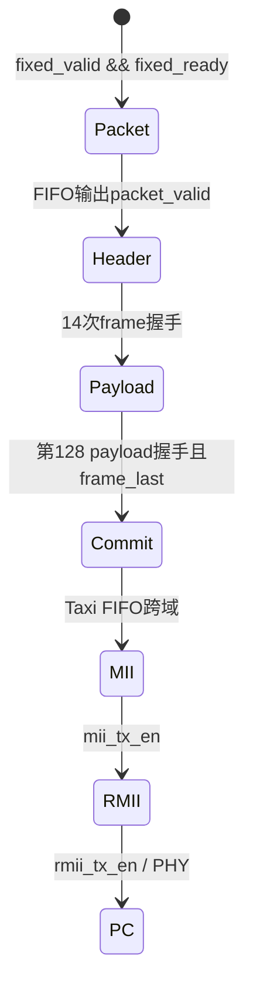

# 18 ILA、VIO与物理层调试

> 目标：复刻“内部AXIS → Taxi/MII → RMII → FPGA引脚 → PHY → PC”的分层取证。ILA证明芯片内部，示波器证明芯片外，PCAP证明网卡真正接收；三者不能互相替代。

> **版本提示：** 本文保留的是早期 21-probe ILA 设计说明，不是当前 A3 运行清单。当前 `scripts/build_ethernet_ila.tcl` 配置 64 个 probe，并以 CAM1 诊断为重点。实际构建、编程、触发与 CSV 导出必须以 [ILA_TCL_AUTOMATION.md](../ILA_TCL_AUTOMATION.md) 和本次 `.bit/.ltx` 配对日志为准；本文后续的 21-probe 表只作历史架构参考。

## 事实来源范围

- ILA构建/采集：`../../scripts/build_ethernet_ila.tcl`、`../../scripts/capture_ethernet_ila.tcl`、`../../scripts/program_ethernet_ila.tcl`。
- 当前硬件证据：`../../build/ethernet_ila/frame_handshake_capture.csv`和PCAP文件。
- 当前顶层内部网：`../../prg_cam.srcs/sources_1/new/Camera_Ethernet_Top.sv`。
- 管脚事实：[14_eth_pin_and_data_configuration.md](14_eth_pin_and_data_configuration.md)。
- 部署总览：[15_eth_deployment_debug_manual.md](15_eth_deployment_debug_manual.md)。

## 未确认项

- 当前脚本只创建1个以`logic_clk=100 MHz`采样的ILA，共21组probe；不是100/50/25 MHz三个独立ILA。
- 该ILA可判断RMII网活动和重建已知固定帧，但不能用100 MHz采样结果做精确板外相位测量。
- 当前没有VIO实例。本文VIO部分是可复刻方案，实施会修改项目自有RTL/Tcl并重新实现，不能描述为现状。
- 当前没有MII、`clock_locked`、`logic_rst`、`ETH_RSTN`专用probe。
- 现存bit/ltx早于最新ODDR/IOB源码；新I/O级尚未用ILA和示波器复验。

## 1. 三类证据



| 证据 | 能证明 | 不能证明 |
|---|---|---|
| ILA | AXIS握手、FIFO状态、MII/RMII内部网 | 引脚幅度、板外skew、网卡已接收 |
| 示波器 | REFCLK/TXD/TXEN/RSTN真实电气时序 | CRC/帧字段一定正确 |
| Link LED | PHY建立链路 | FPGA正在发送有效帧 |
| PCAP | NIC接受了Ethernet frame | FCS通常被NIC剥离，不能直接看到内部FIFO状态 |

## 2. 当前ILA的真实配置

`build_ethernet_ila.tcl`创建`u_ila_ethernet_bringup`，深度4096，clock=`logic_clk`。21组probe如下：

| # | probe | 宽度 | 断点 |
|---:|---|---:|---|
| 0 | rmii_tx_en_dbg | 1 | RMII输出前enable |
| 1 | rmii_txd_dbg | 2 | RMII输出前dibit |
| 2 | phy_ref_clk | 1 | PHY参考时钟内部网 |
| 3 | frame_data | 8 | Adapter→Taxi byte |
| 4..7 | frame_valid/ready/last/handshake | 各1 | AXIS帧边界 |
| 8 | packet_data | 8 | FIFO→Adapter byte |
| 9..11 | packet_valid/ready/last | 各1 | packet侧握手 |
| 12 | tx_error_underflow | 1 | MAC读侧断供 |
| 13 | tx_fifo_overflow | 1 | Taxi TX FIFO写侧溢出 |
| 14 | tx_fifo_good_frame | 1 | Taxi TX frame FIFO提交 |
| 15 | fixed_packet_data | 8 | 发生器写入数据 |
| 16..18 | fixed_packet_valid/ready/last | 各1 | 发生器→Byte_FIFO握手 |
| 19 | byte_fifo_level | 16 | FIFO占用 |
| 20 | byte_fifo_almost_full | 1 | 包级容量预警 |

探针抓的是驱动OBUF/IOB之前的内部网。最新顶层又增加了`eth_txen_out/eth_txd_out`最终IOB级；复验新I/O级时应额外抓这三个寄存器的D/Q内部网，但仍不能抓OBUF之后的物理波形。

## 3. ILA构建、program和捕获

### 3.1 构建

```powershell
& 'D:\Xilinx_Vivado\2025.2.1\Vivado\bin\vivado.bat' `
  -mode batch -nolog -nojournal `
  -source .\scripts\build_ethernet_ila.tcl
```

输出应包含同次实现的：

- `build/ethernet_ila/Camera_Ethernet_Top_ila.bit`
- `build/ethernet_ila/Camera_Ethernet_Top_ila.ltx`
- `build/ethernet_ila/Camera_Ethernet_Top_ila_routed.dcp`
- timing、DRC、utilization报告

### 3.2 Program

```powershell
& 'D:\Xilinx_Vivado\2025.2.1\Vivado\bin\vivado.bat' `
  -mode batch -source .\scripts\program_ethernet_ila.tcl
```

`.bit`是FPGA配置，`.ltx`是probe元数据。两者不配对时，器件可能program成功但Hardware Manager显示0个ILA或probe名称错误。

### 3.3 捕获

```powershell
& 'D:\Xilinx_Vivado\2025.2.1\Vivado\bin\vivado.bat' `
  -mode batch -source .\scripts\capture_ethernet_ila.tcl
```

捕获脚本应先检查`get_hw_ilas`数量和目标probe唯一性，再设置深度、trigger position并`run_hw_ila`。若`wait_on_hw_ila`一直等待，说明触发从未发生；应上移断点，而不是立即修改Taxi。

## 4. 触发与ASM



推荐触发顺序：

1. `frame_handshake==1`：证明Adapter/TAXI边界开始工作。
2. `frame_valid && frame_ready && frame_last`：定位完整帧提交。
3. `rmii_tx_en_dbg==1`：定位PHY前发送burst。
4. 若1不发生，上移到`packet_valid`或`fixed_packet_valid && fixed_packet_ready`。
5. 若1发生而3不发生，下移到MII并检查MII clock/reset。

当前主触发是`frame_handshake==1`，trigger position 512，保留3584个后触发100 MHz样点。

## 5. 波形判读

### 5.1 Fixed Generator → Byte_FIFO

正常：

- 写侧只在`fixed_packet_valid && fixed_packet_ready`推进。
- 数据为`00..7F`，last只与`7F`同拍。
- `byte_fifo_level`可升降，最终可回到0。
- `almost_full`不是full；真正停止写入由ready决定。

故障：valid被stall时data/last变化，表示producer违反握手；level持续上升且不下降，表示下游没有消费；level为0且packet_valid始终0，表示FIFO没有成功写入或处于reset。

### 5.2 Byte_FIFO → Adapter

HEADER期间`packet_ready=0`，但`frame_valid`应发送14个header byte。PAYLOAD期间`packet_ready=frame_ready`；每次packet握手必须对应一次frame payload握手。最后`7F`真实握手时`frame_last=1`。

### 5.3 Taxi

`tx_fifo_good_frame`表示完整TLAST已经在TX frame FIFO写侧提交。它不表示MII已发送、PHY已编码或PC已接收。真正的下一级证据是MII TXEN/TXD，再下一级是RMII TXEN/TXD。

### 5.4 MII和RMII

| 现象 | 判断 |
|---|---|
| mii_tx_en=0 | MAC读侧未启动，查FIFO提交、mii_tx_clk/reset |
| mii_tx_en=1且mii_txd变化 | MAC在输出nibble |
| MII正常、RMII TXEN=0 | bridge reset/mode/refclk问题 |
| RMII TXEN=1、TXD包含0/1/2/3 | converter输出有内容 |
| RMII内部正确、PC无帧 | 查IOB/ODDR、外部时序、PHY和PC接口 |

## 6. 当前硬件捕获结论

现有CSV记录：

- 4096个100 MHz样点，trigger位置512；
- 440次frame handshake，覆盖2个完整142-byte Adapter帧；
- 每个RMII burst对应154 byte：preamble 7 + SFD 1 + Adapter frame 142 + FCS 4；
- 前缀`55×7 D5 FF×6 02 00 00 00 00 02 88 B5`；
- 尾部`7C 7D 7E 7F 6F 0D 02 4D`；
- IFG为48个RMII周期；
- underflow/overflow在采样窗口内为0。

这些结论与旧诊断bitstream配对，证明当时固定源经Byte_FIFO的数据通道可工作。它们不证明最新ODDR/IOB版本已上板。

## 7. 多时钟域ILA的推荐扩展

一个ILA只有一个采样时钟。长期复刻建议分别建立：

| ILA | clock | probe |
|---|---|---|
| logic域 | logic_clk 100 MHz | fixed、FIFO、packet、frame、error flags |
| RMII域 | rmii_ref_clk 50 MHz | bridge rmii_tx_en/txd、reset状态 |
| MII域 | mii_tx_clk 25 MHz | mii_tx_en/txd/tx_er |

不要用logic_clk采样结果计算REFCLK与引脚数据的精确相位；异步/相关时钟跨采样可能产生错拍。多ILA应通过共同事件或跨域同步后的触发标记关联，而不是把原始单周期trigger直接跨域。

## 8. VIO：当前未实现的调试增强

VIO适合在线控制soft reset、TX enable和test mode，但当前工程没有该core。最小Tcl框架：

```tcl
create_debug_core u_vio_ctrl vio
set_property C_NUM_PROBE_OUT 3 [get_debug_cores u_vio_ctrl]
connect_debug_port u_vio_ctrl/clk [get_nets logic_clk]
```

机制：VIO probe_out由JTAG/debug hub更新，相对于用户logic_clk不是天然同步。任何VIO控制位必须在目标域打两拍；reset采用异步assert、同步release结构。直接把VIO异步输出接MAC reset或状态机enable会人为制造CDC故障。

VIO实现后才可记录为PASS，且需要新bit/ltx；旧普通bit或旧ILA bit不包含新VIO。

## 9. 物理层测量

FPGA PACKAGE_PIN不是排针坐标。确认原理图和可达测试点后才测：

| 信号 | PACKAGE_PIN | 预期 |
|---|---|---|
| ETH_REFCLK | D5 | 50 MHz，干净占空比；由ODDR输出 |
| ETH_TXEN | B9 | 帧期间拉高 |
| ETH_TXD[0] | A10 | TXEN高期间随dibit变化 |
| ETH_TXD[1] | A8 | 同上 |
| ETH_RSTN | B3 | 启动先低，locked后约10.49 ms拉高 |

示波器至少同时看REFCLK和一根数据/enable，测量采样沿前后的setup/hold。ILA只能看到OBUF前，不能证明引脚幅度、过冲、抖动和板级skew。

## 10. Wireshark与TShark

显示过滤器：

```text
eth.type == 0x88b5
```

叠加源MAC：

```text
eth.src == 02:00:00:00:00:02 && eth.type == 0x88b5
```

不要写`0xb588`。先用`tshark -D`重新确认接口编号：

```powershell
& 'C:\Program Files\Wireshark\tshark.exe' -D
& 'C:\Program Files\Wireshark\tshark.exe' `
  -i <接口编号> -f 'ether proto 0x88b5' -c 1000 `
  -w .\build\ethernet_ila\wireshark_fixed_1000.pcapng
```

当前旧诊断版本已有1000帧、每帧142 byte、payload `00..7F`一致的PCAP。网卡通常剥离preamble和FCS，所以PCAP的142 byte不含这两部分。

## 11. 故障定位矩阵

| 现象 | 最先看 | 可能原因 | 下一步 |
|---|---|---|---|
| 无link | REFCLK/RSTN/PC速率 | clock/reset/线缆/PHY | 暂不看Taxi，先测50 MHz和reset |
| fixed握手有、packet无 | FIFO level/ready/reset | FIFO未写入或未读出 | 比较写/读握手计数 |
| packet有、frame无 | Adapter状态 | reset或header状态机 | 看14个header握手 |
| frame有、good无 | TLAST/FIFO ready | 帧未完成或TX FIFO拒绝 | 查最后beat握手 |
| good有、MII无 | mii clock/reset | FIFO读侧或MAC未运行 | 加MII域ILA |
| MII有、RMII无 | bridge | 50 MHz/reset/mode | 加RMII域ILA |
| RMII内部有、引脚无 | IOB/ODDR/XDC | 输出级或约束错误 | post-route+示波器 |
| 引脚有、PC无帧 | FCS/位序/时序/接口 | frame无效或PHY采样失败 | RMII scoreboard和PC接口确认 |
| PC有ARP但无88B5 | 抓错接口或FPGA未发 | ARP来自PC自身 | 用capture filter和源MAC过滤 |

## 12. 部署检查清单

- [ ] bit和ltx时间戳、DCP和源码版本属于同一次实现。
- [ ] Hardware Manager识别到预期ILA数量和21组probe。
- [ ] 触发先从frame handshake开始，失败时逐层上移。
- [ ] 14个header byte全部握手，期间packet_ready=0。
- [ ] 128个payload byte顺序正确，末byte握手伴随frame_last。
- [ ] TXEN拉高，TXD在TXEN期间变化。
- [ ] underflow=0、overflow=0；good-frame不作为网线完成证据。
- [ ] 新ODDR/IOB版本重新生成bit/ltx并重复捕获。
- [ ] 物理相位用示波器，不用ILA采样替代。
- [ ] Wireshark保存PCAP并记录接口、过滤器、时间和bit hash。
