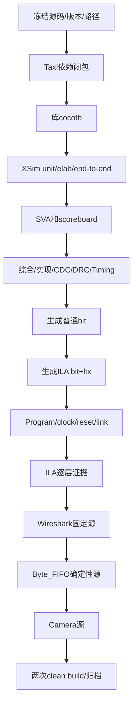

# 19 完整复刻流程与验收清单

> 用途：在不依赖当前调试者记忆的情况下，按固定顺序复刻Camera-to-Ethernet工程。每个Gate都有命令、机制、证据和回退点。

## 事实来源范围

本文是[16](16_xilinx_simulation_and_assertions.md)、[17](17_vivado_implementation_and_rmii_timing.md)、[18](18_ila_vio_and_physical_debug.md)的执行索引。具体接口以当前RTL/XDC/XCI为准，数字以当前报告为准；旧文档只作定位。

## 未确认项

- Taxi cocotb和完整RMII仿真scoreboard尚无本轮PASS证据。
- 最新ODDR/IOB版本尚未生成bitstream/ltx并上板。
- Camera_Pipeline未进入活动Ethernet top；GPIO虽已约束，仍未被逻辑消费。
- RX、MDIO、两次clean build和长时间Camera压力测试未完成。

## 1. 工程坐标

| 类别 | 当前路径/值 |
|---|---|
| 工程 | `D:/prg/prg_cam/prg_cam.xpr` |
| part | `xc7a50ticsg324-1L` |
| top | `Camera_Ethernet_Top` |
| 顶层RTL | `prg_cam.srcs/sources_1/new/Camera_Ethernet_Top.sv` |
| 当前数据源 | Fixed Generator → Byte_FIFO（`USE_BYTE_FIFO_PATH=1`） |
| Taxi入口 | `prg_cam.srcs/sources_1/lib/taxi-master/eth/rtl/taxi_eth_mac_mii_fifo.f` |
| RMII core | `prg_cam.srcs/sources_1/lib/FPGA-RMII-SMII-main/RTL/rmii_phy_if.v` |
| Clock Wizard | `prg_cam.srcs/sources_1/ip/ethernet_clk_wiz/ethernet_clk_wiz.xci` |
| 活动XDC | `prg_cam.srcs/constrs_1/new/nexys_a7_ethernet.xdc` |
| 报告 | `docs/reports/ethernet_bringup/` |

## 2. 总流程



不得跳Gate。上游FAIL时下游自动保持PENDING；例如route PASS不能让Wireshark变成PASS。

## 3. Gate 0：冻结复刻输入

做什么：记录Vivado版本、part、top、活动XDC/XCI、Taxi manifest、源码状态和当前输出hash。

```powershell
git status --short
Get-FileHash .\prg_cam.xpr -Algorithm SHA256
Get-FileHash '.\prg_cam.srcs\constrs_1\new\nexys_a7_ethernet.xdc' -Algorithm SHA256
```

为什么：没有输入快照，两个“同名bit”无法比较。

机制：hash只证明文件字节一致，不证明工程内fileset属性一致，所以还要保存compile order和top/part。

PASS：输入清单齐全。回退：不进入构建，先补齐记录。

## 4. Gate 1：Taxi依赖

```powershell
& 'D:\Xilinx_Vivado\2025.2.1\Vivado\bin\vivado.bat' `
  -mode batch -nolog -nojournal `
  -source .\scripts\add_taxi_sources.tcl
```

PASS：8个`.f`、26个RTL、16个唯一remap、missing=0、duplicate=0、missing instances为空。脚本只访问本地`lib`，不下载、不整树加入。

回退：查看`docs/taxi_compile_manifest.txt`的首个missing；只在本地Taxi目录搜索，不修改上游`.f`来隐藏问题。

## 5. Gate 2：仿真

执行顺序：

1. Taxi MII cocotb（当前待补证据）。
2. Taxi standalone xvlog/xelab。
3. Frame Adapter unit TB。
4. Byte_FIFO source TB。
5. Taxi flat wrapper+RMII elaboration。
6. Fixed→Taxi→RMII smoke。
7. Camera Pipeline regression。
8. 完整RMII scoreboard（当前待实现）。

现成Adapter脚本：

```powershell
& 'D:\Xilinx_Vivado\2025.2.1\Vivado\bin\vivado.bat' `
  -mode batch -nolog -nojournal `
  -source .\scripts\sim_ethernet_frame_adapter.tcl
```

PASS共同条件：compile/elab error=0；SVA零失败；自动byte compare、handshake count、TLAST位置、多帧、reset、stall、timeout通过；最终FIFO无未解释积压。

回退：保存第一个失败时间点和seed，缩到最小TB；不修改Taxi核心来绕过项目侧错误。

## 6. Gate 3：非ILA实现

```powershell
& 'D:\Xilinx_Vivado\2025.2.1\Vivado\bin\vivado.bat' `
  -mode batch -nolog -nojournal `
  -source .\scripts\implement_ethernet_bringup.tcl
```

当前PASS WITH WARNINGS基线：

- WNS +0.492 ns；WHS +0.053 ns；
- RMII TX external setup +5.288 ns、hold +8.048 ns；
- CDC safely timed；
- 620/620 routable nets；
- DRC 0 Error/Critical，19 Warning；
- methodology 6 Warning。

PASS：route完成、WNS/WHS≥0、RMII TX外部余量≥0、CDC无unsafe。DRC/methodology仍是OPEN gate，必须分类，不能用“bitgen成功”代替处置。

## 7. Gate 4：普通bitstream

基线脚本不写bit。使用最新routed DCP：

```tcl
open_checkpoint build/ethernet_bringup/Camera_Ethernet_Top_routed.dcp
write_bitstream -force build/ethernet_bringup/Camera_Ethernet_Top.bit
```

机制：bitstream把已路由配置转换成器件配置帧。普通bit包含业务数据流但不含脚本后来插入的ILA；这不影响Ethernet功能本身，只影响内部可观测性。

PASS：bit时间晚于源码/DCP且命令无ERROR，保存SHA-256。当前最新ODDR/IOB普通bit为PENDING。

## 8. Gate 5：ILA bitstream

```powershell
& 'D:\Xilinx_Vivado\2025.2.1\Vivado\bin\vivado.bat' `
  -mode batch -nolog -nojournal `
  -source .\scripts\build_ethernet_ila.tcl
```

机制：脚本综合top、插入ILA、重新布局布线并同时写bit/ltx。ILA会改变资源和路由，所以它的WNS/WHS不是普通版本的时序。

PASS：新bit、ltx、DCP和报告属于同一次运行；Hardware Manager识别1个ILA和21组probe。当前磁盘旧ILA产物可作历史证据，但最新ODDR/IOB ILA版本为PENDING。

## 9. Gate 6：Program、clock、reset和link

顺序：

1. 确认JTAG目标和器件ID。
2. 明确设置`PROGRAM.FILE`；ILA版同时设置`PROBES.FILE`。
3. program后确认DONE。
4. 检查Clock Wizard reset=`~CPU_RESETN`且locked不自锁。
5. 检查RMII converter 50 MHz/0°、PHY REFCLK 50 MHz/+45°。
6. 检查ETH_RSTN约10.49 ms后释放。
7. 确认PC link与100M。

无link时停止在物理层，不先调Adapter/Taxi。回退到已知可用且配对的bit/ltx，确认线缆和PC接口。

## 10. Gate 7：ILA逐层验收

| 层 | 必看信号 | PASS |
|---|---|---|
| 固定写入 | fixed valid/ready/data/last | 00..7F，last在7F |
| Byte_FIFO | level/almost_full、packet_* | 写读推进、最终level=0 |
| Adapter | frame_* | 14 header+128 payload，last末beat |
| Taxi写侧 | ready/good/overflow | 完整帧提交，overflow=0 |
| MII | tx_clk/en/txd/er | 25 MHz，TXEN期间nibble变化 |
| RMII | refclk/tx_en/txd | 50 MHz，TXEN期间dibit变化 |

当前脚本没有MII专用probe；这项要在新的MII域ILA中完成。`tx_fifo_good_frame`只通过L3写侧，不通过网线Gate。

## 11. Gate 8：Wireshark固定帧

```text
eth.src == 02:00:00:00:00:02 && eth.type == 0x88b5
```

PASS：连续出现142-byte帧；DST广播、SRC正确、EtherType 0x88B5；128-byte payload为`00..7F`；序号连续；ILA underflow/overflow=0。保存PCAP、接口号、过滤器、捕获时长和bit hash。

当前旧诊断bit已PASS此Gate；最新ODDR/IOB bit尚未复验，因此新版本仍PENDING。

## 12. Gate 9：三阶段数据源

### A. Fixed direct

`USE_BYTE_FIFO_PATH=0`，用于排除FIFO。每次切参数后必须重新构建。

### B. Fixed through Byte_FIFO

`USE_BYTE_FIFO_PATH=1`，当前默认。独立仿真已覆盖5帧、暂空、stall、reset；旧硬件ILA/PCAP已PASS固定payload。

### C. Camera through Byte_FIFO

把Camera_Pipeline packet写入端接到同一Byte_FIFO，不改变Adapter/Taxi/bridge。必须观察PCLK/HREF接收、四路request/grant/released、Line Buffer used/committed/drop、Byte FIFO level、frame/RMII和PC payload。

只有C完成后才能宣布Full Camera-to-Ethernet PASS。当前C为PENDING。

## 13. 失败回退规则

1. 每次只跨一个边界：source、FIFO、Adapter、Taxi、MII、RMII、PHY、PC。
2. 新边界FAIL时恢复上一Gate的top参数/连接和已知bit，不删除源码。
3. 不删除`.runs/.cache/prg_cam.gen`掩盖依赖；使用新的输出目录保留失败证据。
4. 不修改Taxi或RMII core来绕过wrapper、reset或约束问题。
5. 保存首个ERROR、完整命令、工具版本、top、part、XDC集和hash。
6. 硬件与两次clean build前，不remove旧AXI/DDR/DMA活动文件。

## 14. PASS/FAIL/PENDING总矩阵

| Gate | 当前状态 | 备注 |
|---|---|---|
| Taxi local dependency | PASS | missing=0 |
| Taxi standalone compile/elab | PASS | XSim证据 |
| Taxi cocotb | PENDING | 无本轮日志 |
| Adapter unit | PASS | stall/TLAST |
| Byte_FIFO deterministic sim | PASS | 5帧，push=pop |
| Fixed→Taxi→RMII smoke | PASS（活动级） | 未完成完整仿真scoreboard |
| Camera Pipeline RTL | PASS（有限覆盖） | 未接活动top |
| Digital implementation | PASS WITH WARNINGS | +0.492/+0.053 ns，19 DRC warning |
| Latest ODDR/IOB bitstream | PENDING | routed DCP已有 |
| Historical fixed hardware TX | PASS | ILA+PCAP，旧诊断bit |
| Latest ODDR/IOB hardware TX | PENDING | 待新bit复验 |
| Full Camera-to-Ethernet | PENDING | Camera未接入 |
| Clean DRC/methodology | FAIL/OPEN | warning未闭环 |
| Two clean builds | PENDING | 无两次证据 |

## 15. 最终归档

每次可复现发布目录至少包含：

- 源码commit/status和Taxi manifest；
- compile order；
- 仿真日志、seed、波形和scoreboard结果；
- post-synth/post-route timing、CDC、DRC、methodology、utilization、route status；
- routed DCP；
- 普通bit，或ILA bit+ltx；
- ILA CSV、分析报告、PCAP；
- SHA-256清单；
- PASS/FAIL/PENDING矩阵和所有书面warning处置。

## 16. 一页执行清单

- [ ] 冻结版本、top、part、XCI、XDC和hash。
- [ ] Taxi依赖8/26/16/0，duplicate=0。
- [ ] cocotb与XSim全部保留日志；未跑项标PENDING。
- [ ] SVA、byte compare、TLAST、stall、reset、多帧、timeout通过。
- [ ] route、timing、CDC通过；DRC/methodology逐条分类。
- [ ] ODDR、TX IOB寄存器和output delay在post-route中可见。
- [ ] 从最新DCP生成普通bit；另行生成匹配ILA bit/ltx。
- [ ] program后先查clock/reset/link，再查数据。
- [ ] ILA从fixed/FIFO/packet/frame逐层到MII/RMII。
- [ ] Wireshark保存0x88B5 PCAP，不把ARP当FPGA帧。
- [ ] 固定直通 → 固定经FIFO → Camera经FIFO依次过Gate。
- [ ] 两次clean build和长时间硬件测试后才宣布最终PASS。
