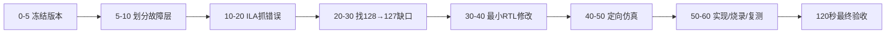
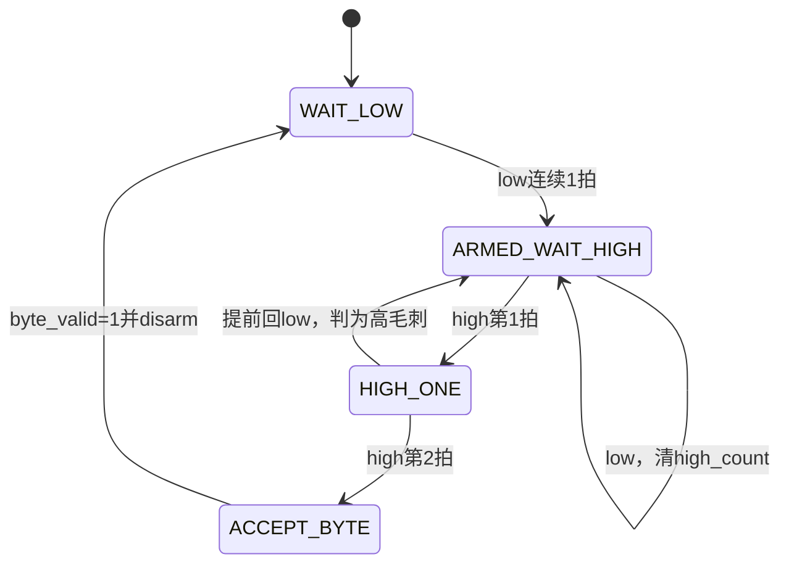
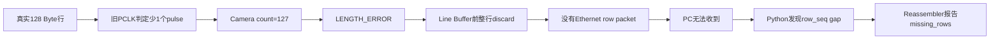

# 21 一小时 FPGA 故障排查手册：用 ILA 找到 128 Byte 在哪里变成 127

> 文档性质：故障复盘 + 可直接执行的操作手册 + FPGA 新人教学说明。  
> 真实案例：2026-08-02 Camera PCLK 漏采、整行丢弃和 Python `missing_rows`。  
> 适用工程：`D:\prg\prg_cam`，Vivado 2025.2.1，Nexys A7-50T。  
> 事实边界：当前源码和本次 ILA CSV > 本次 Vivado/XSim/pytest 报告 > 历史运行统计 > 推测。  
> 验收边界：本文证明本次 PCLK 根因、修复后正常行和 FPGA 内部 Camera→RMII TX 定向链路；新 bit 的长期 PC 抓包和完整图片速率仍需 120 秒验收。

---

## 0. 核心原则与本次结论

### 核心原则

> 用数量守恒逐级检查“128 个 Byte 在哪一级首次变成 127”，只修改最后一个正确点与第一个错误点之间的逻辑。

不要同时修改 Camera、Line Buffer、FIFO、MAC 和 Python。每多改一层，就多一个无法排除的新变量。

### 本次一句话结论

旧 `Camera_Capture` 要求同步后的 PCLK 低电平连续 2 个 `sys_clk` 周期才能重新 armed。ILA 抓到一个真实 Byte 边界只有 1 个可见低拍，因此下一段稳定高电平没有产生 `pclk_pulse`，128-byte 行只计到 127，随后在 Ethernet 之前被整行丢弃。

最小修复：

```text
低电平：连续1拍即可重新 armed
高电平：仍需连续2拍才确认一个 Byte
DATA：在高相位确认后使用 data_sync
```

这样同时做到：

- 不再漏掉只有 1 个可见低拍的真实 PCLK 周期；
- 单拍高毛刺仍不能产生 Byte；
- DATA 有更多时间稳定，不再使用过早的边沿快照作为功能数据。

---

## 1. 60 分钟排查流程表

> 这是操作顺序，不是 Vivado 必然在 60 分钟内完成的性能保证。第一次构建、许可证等待或 debug core 工具故障可能延长总时间，但不能跳过任何验证 Gate。

| 时间 | 阶段 | 关键动作 | 本阶段输出 |
|---:|---|---|---|
| 0–5 分钟 | 冻结版本 | 确认源码、top、bit、ltx、时间戳和 SHA-256 | 明确板上将烧录哪一对 bit/ltx |
| 5–10 分钟 | 划分故障层 | 比较 PC ingress、Matching、queue drops、rows rejected、sequence gaps | 判断先查 PC、Ethernet 还是 FPGA 前端 |
| 10–20 分钟 | 抓错误瞬间 | ILA 触发 `camera_length_error_pulse_dbg`，保留完整行的触发前历史 | 修复前错误行 CSV |
| 20–30 分钟 | 找第一个计数缺口 | 比较 raw/sync PCLK、`pclk_pulse`、`byte_valid`、`byte_count` | 找到 128→127 首次发生的位置 |
| 30–40 分钟 | 最小 RTL 修改 | 只修改 PCLK 资格判定和功能 DATA 采样点 | 可审查的小范围 diff |
| 40–50 分钟 | 仿真回归 | 短低相位、高毛刺、DATA 相位、Camera→Ethernet source | 定向 XSim PASS/FAIL |
| 50–60 分钟 | 构建、烧录、复测 | Timing/DRC、成对 bit/ltx、正常行、完整 frame、有限错误观察 | 新产物、ILA CSV、PASS/PENDING清单 |



---

## 2. 正常值参考表

先写出“正常应该是多少”，再打开波形。没有参考值，就容易在大量翻转中迷路。

| 层级 | 正常值 | 含义 |
|---|---:|---|
| Camera 行输入 | 128 个有效 Byte | 一个 HREF 行包固定为 128 Byte |
| `pclk_pulse` | 128 次/行 | FPGA 认可了 128 个 PCLK Byte 事件 |
| `byte_valid` | 128 次/行 | 128 个 Byte 被交给行捕获逻辑 |
| `current_byte_count` / `last_line_byte_count` | `0x0080` | 十六进制 0x80 等于十进制 128 |
| `line_flags` | `0x00` | 没有 FPGA LENGTH_ERROR |
| `length_error_pulse` | 0 | 本行长度正确 |
| Camera drop counter | 不增长 | 完整行没有在前端被丢弃 |
| Ethernet AXIS handshake | 142 次/帧 | 14-byte Ethernet II header + 128-byte payload |
| `frame_last` | 仅第 142 次握手为 1 | TLAST 位于最后一个 payload Byte |
| `tx_error_underflow` | 0 | Taxi 发送过程中没有取空 |
| `tx_fifo_overflow` | 0 | Taxi TX FIFO 没有写爆 |
| `rmii_tx_en_dbg` | 发送时有活动 | RMII 发送侧正在输出 |

### 本次修复前/后对照

| 项目 | 修复前错误行 | 修复后正常行 |
|---|---:|---:|
| `pclk_pulse` | 127 | 128 |
| `byte_valid` | 127 | 128 |
| 最终 Byte count | `0x007F` | `0x0080` |
| `line_flags` | `0x08` | `0x00` |
| 行处理 | discard | commit |

---

## 3. 新人必须先懂的 8 个词

| 词 | 通俗解释 |
|---|---|
| armed | “已经准备好等待下一次事件”。未 armed 时，即使信号变高，也不会被当成新事件。 |
| `pclk_pulse` | FPGA 内部生成的单周期“收到一个 Camera Byte”通知，不等同于外部 PCLK 电平本身。 |
| `valid/ready` | `valid=1` 表示“我有数据”，`ready=1` 表示“我能接”；只有两者同时为1，数据才真正前进。 |
| handshake | `valid && ready`，像双方同时点头。只看 `valid` 不能证明数据已被接走。 |
| commit | Line Buffer 宣布“这一整行完整，可以交给仲裁器发送”。不完整行不应 commit。 |
| TLAST | AXI-Stream 中“这是本帧最后一个 Byte”的标记；必须和最后一个 Byte 一起握手。 |
| ILA trigger | 告诉芯片内逻辑分析仪“看到这个条件时冻结波形”。好的 trigger 应指向错误判定或真实握手。 |
| trigger position | ILA 存储中 trigger 所在位置。位置越靠后，能看到越多错误发生前的历史。 |

### 软件队列与 FPGA FIFO 的区别

```text
FPGA FIFO：芯片内部、按时钟和ready/valid工作
Python queue：PC内存中、由采集线程和处理线程生产/消费
```

两者都可能积压，但本次 `Capture queue drops=0`，所以没有先修改 Python queue。

---

## 4. 先认识要检查的系统边界

```mermaid
flowchart LR
    RP[RP2350A<br/>DATA/PCLK/HREF] --> SYNC[FPGA IBUF/IOB<br/>2FF同步]
    SYNC --> QUAL[PCLK资格判定]
    QUAL --> CAP[Camera Capture<br/>byte/count/line check]
    CAP --> LB[Line Buffer<br/>reserve/commit/discard]
    LB --> ARB[Arbitration]
    ARB --> BR[Byte Replacer]
    BR --> BF[Byte FIFO]
    BF --> AD[Frame Adapter]
    AD --> TAXI[Taxi TX FIFO/MAC]
    TAXI --> MII[MII]
    MII --> RMII[RMII bridge]
    RMII --> PHY[LAN8720A]
    PHY --> PC[PC NIC/Npcap]
    PC --> PY[Python Layer1-5]
```



数量守恒检查顺序：

```text
外部PCLK事件数
  → 同步后PCLK事件数
  → pclk_pulse数
  → byte_valid数
  → byte_count
  → Line Buffer commit数
  → MAC前packet数
  → Ethernet frame数
  → PC capture数
  → Python valid row数
```

---

## 5. ILA 探针分组

### 5.1 最小定位组

第一次只挂这组，目标是回答“错误在 Camera 前端、缓冲还是发送端”。

| 探针 | 用途 |
|---|---|
| `camera_href_dbg` / `href_sync` | 一行什么时候开始和结束 |
| `camera_capture_byte_valid_dbg` | 捕获逻辑实际交出了多少 Byte |
| `camera_current_byte_count_dbg` | 当前行计数走到哪里 |
| `camera_last_line_byte_count_dbg` | 行结束时最终计数 |
| `camera_line_end_dbg` | 行判定时刻 |
| `camera_length_error_pulse_dbg` | 精确错误触发点 |
| `camera_line_flags_dbg` | 本行最终 FPGA 状态 |
| `camera_drop_count_0` | 前端是否丢行 |
| `camera_packet_valid/ready/last` | 完整行是否进入 packet 输出 |

### 5.2 PCLK 细查组

只有最小组证明 Byte count 不正确时，再加入这一组。

| 探针 | 用途 |
|---|---|
| `camera_pclk_dbg` | FPGA 输入侧 PCLK 活动 |
| `pclk_sync` | 两级同步后的 PCLK |
| `pclk_low_count` / `pclk_high_count` | 相位资格计数 |
| `pclk_phase_armed` | 是否准备接收下一次高相位 |
| `pclk_pulse` | 最终认可的 Byte 事件 |
| `data_on_pclk_rise[7:0]` | 第一次同步观察到的 DATA，仅诊断 |
| `data_sync[7:0]` | 资格确认时使用的稳定 DATA |
| `href_rise` / `href_fall` | 同步后行边界 |
| `line_active` / `line_end_pending` | 行状态和延迟结束处理 |

### 5.3 Ethernet 链路组

Camera 行计数正常后，才用这一组检查后半链。

| 探针 | 用途 |
|---|---|
| `camera_packet_data/valid/ready/last` | Camera Pipeline 输出 |
| `packet_data/valid/ready/last` | Byte FIFO/Adapter 输入边界 |
| `frame_data/valid/ready/last` | Taxi AXIS 输入边界 |
| `frame_handshake` | 每个真正进入 Taxi 的 Byte |
| `tx_error_underflow` | Taxi 发送取空 |
| `tx_fifo_overflow` | Taxi TX FIFO 写满 |
| `rmii_tx_en_dbg` / `rmii_txd_dbg[1:0]` | RMII 内部输出活动 |
| `phy_ref_clk` | PHY 参考时钟活动 |

### 探针选择口诀

```text
转换前的输入 + 转换后的事件 + 被事件推进的计数器
```

本次对应：

```text
pclk_sync → pclk_pulse → byte_count
href_sync → line_end   → line_flags/commit
frame_*   → handshake  → 142-byte frame
```

---

## 6. 0–5 分钟：确认源码、bit、ltx 和版本

### 目的

确保后续波形、源码和板上实际运行的是同一版本。避免用新源码解释旧 bit。

### 具体操作或命令

```powershell
cd D:\prg\prg_cam

git status --short
Get-Item .\build\ethernet_ila\Camera_Ethernet_Top_ila.bit,
         .\build\ethernet_ila\Camera_Ethernet_Top_ila.ltx |
    Select-Object FullName,Length,LastWriteTime

Get-FileHash -Algorithm SHA256 `
    .\build\ethernet_ila\Camera_Ethernet_Top_ila.bit
Get-FileHash -Algorithm SHA256 `
    .\build\ethernet_ila\Camera_Ethernet_Top_ila.ltx
```

确认当前 top 和 part：

```text
top  = Camera_Ethernet_Top
part = xc7a50ticsg324-1L
```

### 需要观察的信号/信息

- bit/ltx 的完整路径；
- 两者时间戳；
- SHA-256；
- 当前 Git diff；
- build Tcl 中的 top、generics 和 probe 数。

### 正常结果

- bit 和 ltx 来自同一次构建；
- 路径明确；
- 旧产物已归档；
- 没有把历史 PCAP 当成当前 bit 的证据。

### 异常结果及下一步

| 异常 | 下一步 |
|---|---|
| bit时间比RTL修改早 | 重新构建，不要继续上板解释 |
| ltx与bit不是同批 | 重新生成/归档成对产物 |
| 不知道板上版本 | 重新 program 并查看 `HW_ILA_COUNT` |
| Vivado启动报 user apps错误 | 先关闭所有Vivado；检查用户Tcl App状态；本项目可临时设置 `XILINX_LOCAL_USER_DATA=no` |

### 一句浅显解释

先确认“书和答案是同一版”，否则波形分析得再漂亮也可能解释错对象。

---

## 7. 5–10 分钟：判断问题在 PC、Ethernet 还是 FPGA 前端

### 目的

利用已有统计缩小范围，不要一开始同时修改所有模块。

### 具体操作或命令

读取 receiver final report，至少记录：

```text
Capture ingress
Matching Ethernet
Capture queue drops
Valid packets
rows accepted/rejected
sessions created
sequence gaps
```

对 attempt21 做数量检查：

```text
Capture ingress       = 334591
Matching Ethernet     = 334591
Capture queue drops   = 0
rows accepted         = 334366
rows rejected         = 225
sessions created      = 816
sequence gaps         = 56815

816 × 480 = 391680
391680 - 334366 = 57314
```

### 需要观察的信号/信息

- `ingress - matching` 是否等于 queue drops；
- PCAP 中 `row_seq` 是否跳号；
- `rows rejected` 与 `missing_rows` 是否为同一数量级；
- CRC、Ethernet length 和 parser error 是否增长。

### 正常结果

本案例中：

- ingress 等于 matching；
- queue drops 为 0；
- 约 5.7 万个缺失位置与 sequence gaps 同数量级；
- 只有 225 个包是“收到后被拒绝”。

因此优先向 FPGA 前端检查，而不是先改 Python queue 或恢复阈值。

### 异常结果及下一步

| 观察 | 故障范围 | 下一步 |
|---|---|---|
| queue drops持续增长 | Python capture/consumer | 查队列高水位、producer/consumer、磁盘输出 |
| 原始PCAP连续但Python缺行 | parser/reassembler | 查session key、row_idx放置和生命周期 |
| PCAP本身row_seq跳号 | FPGA/PHY/NIC之前 | 用ILA检查MAC前packet |
| CRC/固定长度错误增长 | 字节损坏或解析 | 检查RMII/协议边界；不要先改恢复策略 |

### 一句浅显解释

“收到后丢掉”和“根本没收到”是两种完全不同的问题。

---

## 8. 10–20 分钟：用 ILA 抓错误瞬间

### 目的

从错误判定时刻向前回看完整 Camera 行，避免只抓到错误之后。

### 具体操作或命令

先烧录明确的 bit/ltx：

```powershell
$env:XILINX_LOCAL_USER_DATA = 'no'
& 'D:\Xilinx_Vivado\2025.2.1\Vivado\bin\vivado.bat' `
  -mode batch -nolog -nojournal `
  -source .\scripts\program_ethernet_ila.tcl
```

然后抓 LENGTH_ERROR：

```powershell
$env:ILA_TRIGGER_NAME = 'camera_length_error_pulse_dbg'
$env:ILA_TRIGGER_POSITION = '3072'

& 'D:\Xilinx_Vivado\2025.2.1\Vivado\bin\vivado.bat' `
  -mode batch -nolog -nojournal `
  -source .\scripts\capture_ethernet_ila.tcl
```

### 需要观察的信号

使用“最小定位组 + PCLK细查组”，重点：

```text
href_sync / href_fall
pclk_sync
pclk_phase_armed
pclk_low_count / pclk_high_count
pclk_pulse
byte_valid
current_byte_count
last_line_byte_count
length_error_pulse
line_flags
```

### 正常结果

错误确实存在时，ILA快速触发并生成：

```text
build/ethernet_ila/camera_length_error_pulse_dbg_capture.csv
```

4096深度、trigger position=3072，应保留足够触发前样本覆盖约1100个100MHz周期的完整行。

### 异常结果及下一步

| 异常 | 处理顺序 |
|---|---|
| `HW_ILA_COUNT=0` | 先查 bit/ltx 和 PROGRAM.FILE/PROBES.FILE，不改RTL |
| 找不到probe | 检查ltx是否配对、probe是否被优化 |
| 一直停在 `wait_on_hw_ila` | 错误可能没发生；改用 `line_end` 正常触发或有限观察脚本 |
| 一上来立刻触发但无完整前史 | 将 trigger position 调大，如3072 |

### 一句浅显解释

把相机放在“事故发生”前面，而不是事故发生后才打开录像。

---

## 9. 20–30 分钟：比较 PCLK、pulse、valid 和 count

### 目的

找到 128 第一次变成 127 的精确边界。

### 具体操作或命令

用 PowerShell 读取 ILA CSV：

```powershell
$rows = Import-Csv `
  .\build\ethernet_ila\camera_length_error_pulse_dbg_capture.csv |
  Where-Object { $_.'Sample in Buffer' -ne 'Radix - UNSIGNED' }

$trigger = $rows | Where-Object { $_.TRIGGER -eq '1' } |
  Select-Object -First 1
$triggerSample = [int]$trigger.'Sample in Buffer'

$line = $rows | Where-Object {
    [int]$_.'Sample in Buffer' -le $triggerSample -and
    $_.'u_camera_pipeline/u_capture_0/href_sync' -eq '1'
}

$pclkPulses = ($line | Where-Object {
    $_.'u_camera_pipeline/u_capture_0/pclk_pulse' -eq '1'
}).Count
$byteValids = ($line | Where-Object {
    $_.camera_capture_byte_valid_dbg -eq '1'
}).Count

"pclk_pulses=$pclkPulses byte_valid=$byteValids"
```

随后按连续高/低 run 检查每个未接受的 PCLK 区段。

### 需要观察的信号

```text
raw/sync PCLK rise数
每段pclk_sync高电平持续拍数
高电平前低电平持续拍数
pclk_phase_armed
pclk_pulse
data_sync
byte_count
```

### 正常结果

本次修复前实际证据：

| 项目 | 结果 |
|---|---:|
| raw PCLK rises | 130 |
| synchronized PCLK rises | 130 |
| 单拍高毛刺 | 2 |
| 理论真实Byte | 128 |
| 被接受的`pclk_pulse` | 127 |
| `byte_valid` | 127 |
| 最终计数 | `0x007F` |
| flags | `0x08` |

决定性区段：

```text
sample 2074: high_len=1, pre_low=2 → 高毛刺，应拒绝
sample 2107: high_len=7, pre_low=1 → 真实高相位，却未armed
sample 3024: high_len=1, pre_low=2 → 高毛刺，应拒绝
```

第一个计数缺口位于“同步后 PCLK”到“`pclk_pulse`”之间。

### 异常结果及下一步

| 观察结果 | 故障模块 | 下一步 |
|---|---|---|
| raw/sync PCLK本身少事件 | 输入电气/同步器 | 同时测RP端和FPGA端PCLK/HREF |
| PCLK事件够，`pclk_pulse`少 | PCLK资格判定 | 检查armed和高低计数 |
| pulse=128但valid少 | Camera_Capture控制 | 检查line_active和byte_valid生成 |
| valid=128但count少 | byte_count逻辑 | 检查计数条件和复位 |
| count=128但未commit | Line Buffer边界 | 检查flags、reserve/commit/discard |

### 一句浅显解释

像数接力棒：在哪一棒从128少到127，问题就在哪两棒之间。

---

## 10. 30–40 分钟：执行最小 RTL 修改

### 目的

接受真实的一拍低相位，同时继续拒绝一拍高毛刺；不改变 Ethernet、协议和 Python。

### 具体操作或代码

修改：

```text
prg_cam.srcs/sources_1/new/Camera_Capture.v
```

参数拆分：

```verilog
parameter integer PCLK_FILTER_LEN     = 2,
parameter integer PCLK_LOW_FILTER_LEN = 1
```

Byte确认仍要求高相位连续2拍：

```verilog
wire pclk_pulse = pclk_phase_armed && pclk_sync &&
                  (pclk_high_count == PCLK_FILTER_LEN - 1);
```

重新 armed 只要求一个可见低拍：

```verilog
if (pclk_low_count == PCLK_LOW_FILTER_LEN - 1) begin
    pclk_phase_armed <= 1'b1;
    pclk_low_count   <= {PCLK_FILTER_LEN{1'b0}};
    pclk_level       <= 1'b0;
end
```

功能 DATA 使用资格确认后的同步样本：

```verilog
if (pclk_pulse && line_active) begin
    byte_data  <= data_sync;
    byte_valid <= 1'b1;
end
```

### 需要观察的信号

代码审查时关注：

```text
pclk_phase_armed
pclk_low_count
pclk_high_count
pclk_pulse
data_sync
byte_valid
```

### 正常结果

- 一拍低电平即可重新 armed；
- 一拍高电平只进入候选状态，不产生 Byte；
- 第二拍连续高电平才产生 `pclk_pulse`；
- Byte 产生后 disarm，等待下一次低相位。

### 异常结果及下一步

| 异常 | 下一步 |
|---|---|
| 改成高1拍确认 | 立即撤回；会把高毛刺当Byte |
| 同时修改FIFO/MAC/Python | 拆回独立提交，只保留PCLK最小改动 |
| 仿真出现129 Byte | 重点查高毛刺是否误采 |
| 数据顺序错但计数正确 | 查DATA取样相位，不再调整计数阈值 |

### 一句浅显解释

低电平只负责“准备好”，高电平才负责“真的收一个Byte”，所以两边可以使用不同门槛。

### 修改后的 ASM



```text
low 1拍：只打开“接收许可”
high 1拍：只成为候选
high第2拍：确认真实Byte
```

---

## 11. 40–50 分钟：完成四类仿真

### 目的

证明修复解决目标问题，同时没有制造重复Byte、DATA污染或数据链回归。

### 具体操作或命令

完整命令见附录A。必须运行：

1. `tb_Camera_Capture_Pclk_Low_Runt`；
2. `tb_Camera_Capture_Pclk_Glitch`；
3. `tb_Camera_Capture_Data_Phase`；
4. `tb_Camera_Pipeline_Ethernet_Source`。

此外运行全部 Python 测试：

```powershell
& 'C:\Users\Z\AppData\Local\Python\pythoncore-3.14-64\Scripts\pytest.exe' `
  -q -p no:cacheprovider
```

### 需要观察的信号/结果

| 测试 | 观察点 |
|---|---|
| 短低相位 | 16/16 Byte、count=16、无length error |
| 高毛刺 | 不增加Byte、不丢后续真实Byte |
| DATA相位 | 输出使用稳定新Byte，不继承前一个Byte |
| 数据链 | packet/frame握手数、stall、最后Byte TLAST |

### 正常结果

本次实际结果：

```text
PASS: one-sample low phase re-arms a stable high byte
PASS: PCLK low-phase glitches neither drop nor replay bytes
PASS: qualified PCLK sample rejects preceding-byte contamination
PASS: Camera_Pipeline -> Byte_FIFO -> Frame Adapter
PASS: frames=3 packet_hs=384 frame_hs=426 stalls_and_last_stall=covered
107 passed in 5.67s
```

### 异常结果及下一步

| 异常测试 | 下一步 |
|---|---|
| 短低相位FAIL | 检查low rearm比较和非阻塞赋值拍数 |
| 高毛刺FAIL | 保持high=2，不可继续上板 |
| DATA相位FAIL | 对比`data_on_pclk_rise`与`data_sync` |
| 数据链FAIL | 修复握手回归后再构建bit |
| pytest FAIL | 判断是否只是环境/缓存；功能FAIL必须处理 |

### 一句浅显解释

修好“少收一个”以后，还必须证明没有变成“多收一个”或“收错一个”。

---

## 12. 50–60 分钟：实现、烧录和三项上板验证

### 目的

生成包含修复的新 bit/ltx，并依次证明正常行、完整 AXIS frame 和有限错误窗口。

### 具体操作或命令

构建：

```powershell
$env:XILINX_LOCAL_USER_DATA = 'no'
& 'D:\Xilinx_Vivado\2025.2.1\Vivado\bin\vivado.bat' `
  -mode batch `
  -source .\scripts\build_ethernet_ila.tcl `
  -log build_pclk_low_rearm.log `
  -journal build_pclk_low_rearm.jou
```

烧录：

```powershell
& 'D:\Xilinx_Vivado\2025.2.1\Vivado\bin\vivado.bat' `
  -mode batch -nolog -nojournal `
  -source .\scripts\program_ethernet_ila.tcl
```

验证1——正常行：

```powershell
$env:ILA_TRIGGER_NAME = 'camera_line_end_dbg'
$env:ILA_TRIGGER_POSITION = '3072'
& 'D:\Xilinx_Vivado\2025.2.1\Vivado\bin\vivado.bat' `
  -mode batch -nolog -nojournal `
  -source .\scripts\capture_ethernet_ila.tcl
```

验证2——完整 frame：

```powershell
$env:ILA_TRIGGER_NAME = 'frame_handshake'
$env:ILA_TRIGGER_POSITION = '512'
& 'D:\Xilinx_Vivado\2025.2.1\Vivado\bin\vivado.bat' `
  -mode batch -nolog -nojournal `
  -source .\scripts\capture_ethernet_ila.tcl
```

验证3——15秒有限错误观察：

```powershell
$env:ILA_TRIGGER_NAME = 'camera_length_error_pulse_dbg'
$env:ILA_OBSERVE_MS = '15000'
& 'D:\Xilinx_Vivado\2025.2.1\Vivado\bin\vivado.bat' `
  -mode batch -nolog -nojournal `
  -source .\scripts\observe_ethernet_ila_trigger.tcl
```

### 需要观察的信号/报告

- WNS/WHS和failing endpoints；
- DRC Error；
- `HW_ILA_COUNT`和probe数；
- 正常值参考表中的128/142计数；
- underflow/overflow；
- 有限窗口的 ILA status。

### 正常结果

本次实际结果：

```text
WNS=+1.179 ns
WHS=+0.018 ns
0 failing endpoints
bitgen DRC=0 Error
HW_ILA_COUNT=1
hardware probes=64
正常行：128 pulse / 128 valid / count=128 / flags=0
frame：142 handshakes / TLAST最后一次 / header正确
underflow=0 / overflow=0 / RMII TXEN活动
15秒：WAITING FOR TRIGGER（没有LENGTH_ERROR）
```

### 异常结果及下一步

| 异常 | 简短处理顺序 |
|---|---|
| Vivado `Failed to install all user apps` | 关闭Vivado→确认无进程→检查用户Tcl App/陈旧锁→本项目临时设`XILINX_LOCAL_USER_DATA=no` |
| 卡在 `implement_debug_core` | 看CPU与OOC run日志→确认是否只有`.vivado.begin`→优先重跑；应急时按当前临时run的`htr.txt`串行执行dbg_hub和ILA OOC Tcl |
| 卡在 `wait_on_hw_ila` | 错误可能没发生；用`line_end`或有限观察脚本，不要误判PowerShell死机 |
| WNS/WHS负值 | 不烧录作为正式版本；先处理时序 |
| 128正常但142不完整 | 查Frame Adapter的ready/valid/TLAST |
| frame正确但RMII不动 | 查Taxi TX FIFO、MII/RMII桥和复位 |

### 一句浅显解释

先证明一行完整，再证明一帧完整，最后观察错误是否在一段时间内消失。

---

## 13. “观察结果 → 故障模块 → 下一步”判断表

| 观察结果 | 最可能故障模块 | 下一步操作 | 暂时不要改 |
|---|---|---|---|
| `pclk_sync`事件已少 | 输入电气/CDC | 双端测PCLK/HREF，检查同步和窄脉冲 | Python、Taxi |
| `pclk_sync`够，`pclk_pulse`少 | PCLK资格判定 | 查armed、高低计数和被忽略run | FIFO、MAC |
| pulse=128，valid<128 | Camera Capture控制 | 查line_active/byte_valid条件 | Ethernet |
| valid=128，count<128 | Byte counter | 查计数使能和复位 | Python |
| count=128，Line Buffer不commit | Line Buffer边界 | 查reserve/commit/discard和flags | RMII |
| Line Buffer有request，grant不来 | Arbitration | 查one-hot grant/released | Camera采样 |
| Camera packet连续，frame不完整 | Byte FIFO/Adapter | 查ready/valid/last和stall稳定 | PCLK阈值 |
| frame 142正确，RMII无活动 | Taxi/MII/RMII | 查TX reset、FIFO status、TXEN | Python reassembler |
| RMII内部活动，PC原始抓包缺包 | PHY/NIC/外部时序 | 查REFCLK、TXD/TXEN、PHY和PCAP | Camera row恢复 |
| PCAP连续，Python缺行 | Parser/Reassembler | 查row_idx/session/hash/queue | FPGA PCLK |
| queue drops增长 | Python吞吐 | 查capture queue和async output | Taxi core |

这张表的使用规则：先选择最符合证据的一行，一次只推进“下一步操作”这一列。

---

## 14. 本次故障复盘：为什么 Python 看起来像嫌疑人

本次最容易误判的现象是：

```text
rows rejected很少
每帧missing_rows却很多
没有完整图片
```

真实路径是：



`rows rejected` 只统计“已经到达但未通过严格校验”的包。被 FPGA 整行丢弃的包不会出现在该计数中。

因此，本次没有放宽 Layer3、没有扩大 zero-fill 阈值，也没有修改 Taxi core。

---

## 15. 120 秒最终验收 Gate

> 下表是本项目下一轮验收规则。使用新 bit、新输出目录，并记录 bit/ltx hash、开始时间和网卡。

### 15.1 PASS / WARN / FAIL 标准

| 指标 | PASS | WARN | FAIL |
|---|---|---|---|
| `capture queue drops` | `<0.1%` | `0.1%–1%`，需结合queue peak解释 | `>1%`或持续增长 |
| `capture queue peak/capacity` | 明显低于容量 | 偶发接近容量但无drop | 长期贴近容量并drop |
| CRC / bad Ethernet length / parser errors | 全部0 | 极少、可定位且不持续 | 持续增长 |
| Camera `length errors` | 0 | 非0但极少，必须保存对应ILA/包 | 持续出现或与缺行同步增长 |
| `sequence gaps` | 0或全部有已知解释 | 少量且可由已记录drop/错误守恒解释 | 大量无解释gap |
| underflow/overflow | 均为0 | 不适用；任何非0都需调查 | 任一非0 |
| `images complete + recovered` | 接近有效session输入 | 有差距但reject原因集中且可解释 | 大量session无可用图片 |
| `total_usable_fps`（源约15fps时） | `≥15 fps`或与实测源率一致 | `12–<15 fps` | `<12 fps` |
| ZERO_FILL | 只出现在JSON记录的missing row_idx | 个别需人工复核 | 填错位置或跨frame复用 |
| 输出目录 | RAW/PGM/JSON/CSV一致且可读 | 少量存储重试但最终成功 | callback/storage failure |

### 15.2 120 秒操作

```powershell
cd D:\prg\prg_cam\prg_cam.srcs\sources_1\tx\taxi_receiver_advanced\taxi_receiver

powershell.exe -NoProfile -ExecutionPolicy Bypass -File `
  '.\run_receiver.ps1' `
  -Interface '\Device\NPF_{6BDDE37E-7DCA-4078-98B0-E374EFE04E7C}' `
  -OutputRoot 'D:\prg\prg_cam\build\receiver_output\pclk_rearm_validation' `
  -ImagesRoot 'D:\prg\prg_cam\images\temp\archive\pclk_rearm_validation' `
  -QueueDepth 65536 `
  -ImagePolicy 'recover-zero-fill' `
  -MaxMissingRows 4 `
  -MaxConsecutiveMissing 2
```

前台运行约120秒后按一次 Ctrl+C，等待 final report 完整打印。不要用旧 attempt21 结果代替新 bit 的验证。

---

## 16. 常见工具故障速查

| 工具现象 | 它通常意味着什么 | 正确处理顺序 |
|---|---|---|
| `Failed to install all user apps` | 用户Tcl App Store/manifest/锁问题 | 关闭进程→检查锁和manifest→临时禁用user data→保留日志 |
| `implement_debug_core`无日志、CPU不变 | debug hub/ILA OOC wrapper卡住 | 查临时run→看`.begin/.end/runme.log`→重跑→必要时按`htr.txt`串行恢复 |
| `wait_on_hw_ila`一直等待 | trigger没有发生，不一定是程序死机 | 改正常事件trigger或使用有限窗口脚本 |
| ILA探针为0 | bit/ltx不配对或无debug core | 检查PROGRAM.FILE/PROBES.FILE和构建产物 |
| ILA改变后时序变差 | ILA改变布局布线 | ILA版与普通版时序必须分开记录 |
| bitgen成功但PC无帧 | 数字实现不等于物理链路 | 继续查RMII、PHY、PCAP，不把route PASS当Wireshark PASS |

---

## 17. 附录 A：完整可复制命令

### A.1 XSim：短低相位

```powershell
cd D:\prg\prg_cam\build\sim_camera_data_phase

& 'D:\Xilinx_Vivado\2025.2.1\Vivado\bin\xvlog.bat' `
  --incr --relax -sv `
  'D:\prg\prg_cam\prg_cam.srcs\sources_1\new\Camera_Capture.v' `
  'D:\prg\prg_cam\prg_cam.srcs\sim_1\new\tb_Camera_Capture_Pclk_Low_Runt.sv'

& 'D:\Xilinx_Vivado\2025.2.1\Vivado\bin\xelab.bat' `
  --debug typical --relax `
  tb_Camera_Capture_Pclk_Low_Runt `
  -s tb_Camera_Capture_Pclk_Low_Runt_sim

& 'D:\Xilinx_Vivado\2025.2.1\Vivado\bin\xsim.bat' `
  tb_Camera_Capture_Pclk_Low_Runt_sim -runall
```

### A.2 XSim：高毛刺

```powershell
& 'D:\Xilinx_Vivado\2025.2.1\Vivado\bin\xvlog.bat' `
  --incr --relax -sv `
  'D:\prg\prg_cam\prg_cam.srcs\sim_1\new\tb_Camera_Capture_Pclk_Glitch.sv'

& 'D:\Xilinx_Vivado\2025.2.1\Vivado\bin\xelab.bat' `
  --debug typical --relax `
  tb_Camera_Capture_Pclk_Glitch `
  -s tb_Camera_Capture_Pclk_Glitch_sim

& 'D:\Xilinx_Vivado\2025.2.1\Vivado\bin\xsim.bat' `
  tb_Camera_Capture_Pclk_Glitch_sim -runall
```

### A.3 XSim：DATA相位

```powershell
& 'D:\Xilinx_Vivado\2025.2.1\Vivado\bin\xelab.bat' `
  --debug typical --relax `
  tb_Camera_Capture_Data_Phase `
  -s tb_Camera_Capture_Data_Phase_sim

& 'D:\Xilinx_Vivado\2025.2.1\Vivado\bin\xsim.bat' `
  tb_Camera_Capture_Data_Phase_sim -runall
```

### A.4 XSim：完整Camera源数据链

```powershell
& 'D:\Xilinx_Vivado\2025.2.1\Vivado\bin\xelab.bat' `
  --debug typical --relax `
  tb_Camera_Pipeline_Ethernet_Source `
  -s tb_Camera_Pipeline_Ethernet_Source_sim

& 'D:\Xilinx_Vivado\2025.2.1\Vivado\bin\xsim.bat' `
  tb_Camera_Pipeline_Ethernet_Source_sim -runall
```

### A.5 Vivado构建、烧录和ILA

```powershell
cd D:\prg\prg_cam
$env:XILINX_LOCAL_USER_DATA = 'no'

& 'D:\Xilinx_Vivado\2025.2.1\Vivado\bin\vivado.bat' `
  -mode batch `
  -source .\scripts\build_ethernet_ila.tcl `
  -log build_pclk_low_rearm.log `
  -journal build_pclk_low_rearm.jou

& 'D:\Xilinx_Vivado\2025.2.1\Vivado\bin\vivado.bat' `
  -mode batch -nolog -nojournal `
  -source .\scripts\program_ethernet_ila.tcl
```

---

## 18. 附录 B：本次产物、hash 和证据路径

### B.1 修改前归档

```text
build/ethernet_ila/archive/pre_pclk_low_rearm_20260802_0108/
```

修改前 bit SHA-256：

```text
F0A752119647A08F9F17120B0D4DE6EB6D0125F8359F2F6BC10F31968DE9B649
```

### B.2 修改后产物

生成时间：`2026-08-02 01:48:23`

| 文件 | SHA-256 |
|---|---|
| `build/ethernet_ila/Camera_Ethernet_Top_ila.bit` | `877733CC169DCE108861D57A3960D566B0C68F4BDC75147BB4619F299776F6D9` |
| `build/ethernet_ila/Camera_Ethernet_Top_ila.ltx` | `83EDA3E29FA3FFD7987AB6D7450A2237E152C80609E3AF448E31AF216FCDC623` |
| `build/ethernet_ila/Camera_Ethernet_Top_ila_routed.dcp` | `E17987B5BD6819045E553285FAB8B2216AD64B1257685F060EE1DD871C15A0D4` |

LTX hash 与旧版相同是因为 probe 集合未改变；仍按同次时间戳成对归档。

### B.3 ILA和报告证据

| 证据 | 路径 |
|---|---|
| 修复前错误行 | `build/ethernet_ila/camera_length_error_pulse_dbg_capture.csv` |
| 修复后正常行 | `build/ethernet_ila/camera_line_end_dbg_capture.csv` |
| 完整142-byte frame | `build/ethernet_ila/frame_handshake_capture.csv` |
| Timing | `build/ethernet_ila/timing_summary.rpt` |
| DRC | `build/ethernet_ila/drc.rpt` |
| Utilization | `build/ethernet_ila/utilization.rpt` |

完整 frame CSV 的实际解码值：

```text
handshakes=142
header=ff ff ff ff ff ff 02 00 00 00 00 02 88 b5
payload head=a5 a0 5a 50 00 bc 64 00 6c 00 50 3b ec 00 00 00
frame_last只在第142次握手有效
tx_error_underflow=0
tx_fifo_overflow=0
```

---

## 19. 附录 C：DRC Warning 分类

| Rule | 数量 |
|---|---:|
| CFGBVS-1 | 1 |
| CHECK-3 | 1 |
| PDCN-1569 | 3 |
| PLIO-6 | 6 |
| REQP-1617 | 6 |
| REQP-1839 | 2 |
| REQP-1840 | 20 |
| RTSTAT-10 | 1 |

bitgen 前置 DRC 为 0 Error，但这些 Warning 尚未全部清零，因此数字实现状态为：

```text
PASS WITH WARNINGS
```

---

## 20. 附录 D：本次实际执行时间线

时间来自产物和工具日志；部分步骤包含 Vivado 等待。

| 时间段 | 实际执行 | 结果 |
|---|---|---|
| 约00:58–01:02 | 核对旧bit/ltx、探针、脚本，烧录故障基线 | 确认先观察再修改 |
| 01:02左右 | `camera_length_error_pulse_dbg`触发ILA | 抓到127-byte错误行 |
| 随后 | 对CSV统计HREF、PCLK run、pulse和count | 找到`pre_low=1`的真实稳定高相位 |
| 随后 | 修改`Camera_Capture.v`并新增定向TB | low=1重新armed，high=2确认 |
| 01:26–01:48 | 处理Vivado user apps和debug-core OOC卡点，完成实现 | WNS/WHS为正，生成新bit/ltx |
| 01:48–01:49 | 核对hash并烧录 | 硬件识别1个ILA、64个probe |
| 01:49 | `camera_line_end_dbg`触发 | 正常行128/128，flags=0 |
| 01:50 | `frame_handshake`触发 | 完整142-byte AXIS frame |
| 01:52 | 15秒有限LENGTH_ERROR观察 | 窗口内无触发 |
| 01:53–01:54 | 重跑XSim和pytest | 定向仿真PASS，107 pytest PASS |

---

## 21. 附录 E：本次修改与新增文件

### 功能修改

```text
prg_cam.srcs/sources_1/new/Camera_Capture.v
```

### 新增定向验证

```text
prg_cam.srcs/sim_1/new/tb_Camera_Capture_Pclk_Low_Runt.sv
prg_cam.srcs/sim_1/new/tb_Camera_Capture_Data_Phase.sv
scripts/observe_ethernet_ila_trigger.tcl
```

Taxi core、Frame Adapter、Byte FIFO、MII/RMII bridge和Python功能源码没有为本次根因修改。

---

## 22. 一页速查

```text
0-5   核对源码/bit/ltx/hash
  ↓
5-10  看queue drops、PCAP、rows rejected、sequence gaps
  ↓
10-20 ILA触发length_error，位置3072，深度4096
  ↓
20-30 数 raw/sync PCLK → pulse → valid → count
  ↓
       第一次128→127发生在哪一层？
  ↓
30-40 只修改最后正确点和第一个错误点之间
       本次：low=1重新armed，high=2确认
  ↓
40-50 短低相位 + 高毛刺 + DATA相位 + 数据链仿真
  ↓
50-60 Timing/DRC → bit/ltx → program
       正常行128 → frame握手142 → 15秒错误窗口
  ↓
120秒 receiver：PASS/WARN/FAIL Gate
```

最终原则：**先数清楚，再改代码；先证明哪一级出错，再修改那一级。**
