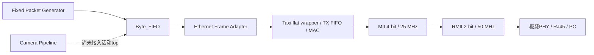

# Nexys A7 Camera-to-Ethernet 文档索引

本目录记录当前`D:/prg/prg_cam`工程的设计、验证和上板证据。事实优先级为：当前源码 > 当前Vivado报告/ILA/PCAP > 当前日志 > Git状态 > 旧文档。文档中的PASS只覆盖其明确列出的层级；route PASS不等于Wireshark PASS，`tx_fifo_good_frame`也不等于帧已经发到网线。

## 当前状态

| 层级 | 状态 | 当前可证明范围 |
|---|---|---|
| Taxi本地依赖 | PASS | 8个`.f`、26个RTL、16个remap、missing=0 |
| Adapter与Byte_FIFO仿真 | PASS | header、TLAST、stall、reset、多帧与push/pop自动检查 |
| Camera Pipeline RTL | PASS（有限覆盖） | 四路仲裁、字段替换、CRC-16回归；未接活动Ethernet top |
| Digital implementation | PASS WITH WARNINGS | WNS +0.492 ns、WHS +0.053 ns；RMII TX setup +5.288 ns、hold +8.048 ns；19条DRC warning |
| 历史固定源硬件TX | PASS | 旧诊断bit下，固定源经Byte_FIFO，ILA解码和1000帧PCAP通过 |
| 最新ODDR/IOB硬件TX | PENDING | routed DCP已生成，新bit/ltx尚未生成和上板 |
| Full Camera-to-Ethernet | PENDING | GPIO已约束，Camera_Pipeline尚未实例化到活动top |
| Clean DRC/methodology | FAIL/OPEN | warning、RX input delay和板级sign-off未闭环 |
| 两次clean build | PENDING | 尚无两次独立构建证据 |

当前活动顶层是`Camera_Ethernet_Top`，默认链路为：

## 设计文档 00–11

| 文档 | 内容 |
|---|---|
| [00_project_overview.md](00_project_overview.md) | 工程边界、层次、目标架构和状态 |
| [01_camera_pipeline_dataflow.md](01_camera_pipeline_dataflow.md) | 四路Camera采集到packet输出 |
| [02_line_buffer_and_arbitration.md](02_line_buffer_and_arbitration.md) | Line Buffer、request/grant/released和反压 |
| [03_byte_replacer_and_fifo.md](03_byte_replacer_and_fifo.md) | 字段替换、CRC-16、Byte FIFO和Adapter ASM |
| [04_taxi_library_integration.md](04_taxi_library_integration.md) | Taxi `.f`闭包、interface、flat wrapper和Vivado引用 |
| [05_taxi_ethernet_runtime.md](05_taxi_ethernet_runtime.md) | Taxi TX FIFO、CDC、MAC、FCS、IFG和MII |
| [06_mii_rmii_bridge.md](06_mii_rmii_bridge.md) | 4-bit/25 MHz MII到2-bit/50 MHz RMII |
| [07_simulation_and_verification.md](07_simulation_and_verification.md) | 现有TB、日志、覆盖与判据 |
| [08_vivado_build_and_reports.md](08_vivado_build_and_reports.md) | 综合、实现、timing、CDC、DRC和资源 |
| [09_hardware_bringup.md](09_hardware_bringup.md) | 初始板级bring-up顺序 |
| [10_interface_and_signal_reference.md](10_interface_and_signal_reference.md) | 模块参数、端口、协议和引脚参考 |
| [11_known_issues_and_next_steps.md](11_known_issues_and_next_steps.md) | 冲突、未知项、风险和后续优先级 |

## 部署与验收文档 12–15

| 文档 | 内容 |
|---|---|
| [12_taxi_rmii_deployment_workflow.md](12_taxi_rmii_deployment_workflow.md) | Taxi/RMII部署步骤和阶段回退 |
| [13_vivado_verification_and_acceptance.md](13_vivado_verification_and_acceptance.md) | Vivado与硬件验收规范 |
| [14_eth_pin_and_data_configuration.md](14_eth_pin_and_data_configuration.md) | JA/JB、PHY管脚、时钟、复位和数据格式的当前事实 |
| [15_eth_deployment_debug_manual.md](15_eth_deployment_debug_manual.md) | 综合部署、Tcl、ILA、Wireshark和故障矩阵 |

## Xilinx复刻手册 16–19

原“16 Xilinx验证与上板工作流”按领域拆为四册，控制单册篇幅，并允许纸质批注时独立使用：

| 顺序 | 文档 | 适用阶段 |
|---:|---|---|
| 1 | [16_xilinx_simulation_and_assertions.md](16_xilinx_simulation_and_assertions.md) | cocotb、XSim、SVA、byte compare和RMII scoreboard |
| 2 | [17_vivado_implementation_and_rmii_timing.md](17_vivado_implementation_and_rmii_timing.md) | 综合、实现、ODDR/IOB、I/O delay、CDC/DRC/timing和bitstream |
| 3 | [18_ila_vio_and_physical_debug.md](18_ila_vio_and_physical_debug.md) | ILA/VIO、分层触发、示波器、PHY和Wireshark |
| 4 | [19_reproduction_workflow_and_checklists.md](19_reproduction_workflow_and_checklists.md) | 从冻结输入到Camera验收的完整命令顺序、Gate和归档 |

建议按16→17→18→19打印：先建立“仿真证明逻辑”的证据，再理解“实现和外部时序”，随后学习“板上观察和物理层”，最后用19作为总操作单。这样批注时每一册对应一个问题域，19中的Gate可直接回指前三册。

## 重点打印组合

若只打印最小组合：

1. [14_eth_pin_and_data_configuration.md](14_eth_pin_and_data_configuration.md)：板卡、接口和当前事实底图。
2. [15_eth_deployment_debug_manual.md](15_eth_deployment_debug_manual.md)：故障定位主手册。
3. [16_xilinx_simulation_and_assertions.md](16_xilinx_simulation_and_assertions.md)：软件验证机制。
4. [17_vivado_implementation_and_rmii_timing.md](17_vivado_implementation_and_rmii_timing.md)：实现与时序机制。
5. [18_ila_vio_and_physical_debug.md](18_ila_vio_and_physical_debug.md)：上板调试机制。
6. [19_reproduction_workflow_and_checklists.md](19_reproduction_workflow_and_checklists.md)：最终执行清单。

Camera数据流需要深入修改时，再加印01–06；审计验收时加印07、08、13。

## 关键证据入口

- Taxi manifest：`../taxi_compile_manifest.txt`
- 仿真日志：`../../build/ethernet_frame_adapter_sim/`、`../../build/byte_fifo_source_sim/`、`../../build/taxi_mii_fifo_elab/`、`../../build/camera_pipeline_regression/`
- 最新实现报告：`../reports/ethernet_bringup/`
- 最新routed DCP：`../../build/ethernet_bringup/Camera_Ethernet_Top_routed.dcp`
- 历史ILA/PCAP证据：`../../build/ethernet_ila/`
- 活动XDC：`../../prg_cam.srcs/constrs_1/new/nexys_a7_ethernet.xdc`

## 阅读规则

- “RTL PASS”只表示指定TB和断言通过。
- “Implementation PASS WITH WARNINGS”只表示当前已约束数字设计完成并满足时序，warning仍需处置。
- “Hardware PASS”必须有匹配bit/ltx、ILA或示波器证据以及PCAP。
- “Full Camera-to-Ethernet PASS”必须从真实Camera输入到PC payload全链路连续通过；当前仍为PENDING。
- 每次修改Clock Wizard、ODDR/IOB、XDC或debug core后，都必须重新实现；旧bit/ltx/PCAP不能自动继承为新版本证据。
