# Project Integrated Architecture and Design

> **项目整合架构与设计说明**  
> 工程根目录：`D:/prg/prg_cam`  
> 扫描基线：2026-07-28  
> 目标器件：`xc7a50ticsg324-1L`，Nexys A7-50T  
> 当前活动顶层：`Camera_Ethernet_Top`  
> 当前主链：Camera0 → FPGA Camera Pipeline → Taxi Ethernet TX → PC Python Receiver

本文用于后续撰写项目报告，集中解释系统目标、设计选择、模块接口、数据格式、
错误传播、验证证据和未来扩展。它不是操作命令合集，也不替代同目录中的六份
架构/实验 Word。

## 事实规则与状态口径

事实优先级为：

```text
当前源码和 prg_cam.xpr
  > 当前测试、ILA、PCAP、CSV/JSON 和 Vivado 报告
  > Git history/diff
  > 当前技术文档和六份新版 Word
  > 旧报告、旧截图和历史推测
```

状态只使用：

| 状态 | 含义 |
|---|---|
| `PASS` | 有与当前对象匹配、可复现的证据，且验收项成立 |
| `PARTIAL` | 部分链路或部分工况有证据，但不能完成整体 sign-off |
| `PENDING` | 尚无足够证据，或证据未与当前源码/bit/固件绑定 |
| `BLOCKED` | 已知外部条件阻止继续验证 |

以下解释边界贯穿全文：

- `tx_fifo_good_frame`只表示 Taxi TX frame FIFO 写侧接受了一帧，不表示已发到网线。
- route、timing 或 bitstream 生成成功不等于 LAN8720A、PCAP 或图像链成功。
- `LAST_ROW`只表示某一行包携带帧尾标志，不等于已经收齐480行。
- Ethernet packet rate、Camera row packet rate和image fps是三个不同指标。
- ILA增加可观察性并改变布局布线，但不是Ethernet功能依赖。
- 当前单Camera闭环为`PARTIAL`；完整640×480、目标帧率和多Camera仍需板级验收。

## 目录

- [1. 项目概述](#sec-1)
- [2. 系统需求与设计约束](#sec-2)
- [3. 总体端到端架构](#sec-3)
- [4. RP2350A与FPGA输入接口](#sec-4)
- [5. FPGA Camera采集和缓冲架构](#sec-5)
- [6. Camera行包协议](#sec-6)
- [7. Ethernet封装与Taxi架构](#sec-7)
- [8. Python接收机架构](#sec-8)
- [9. 错误传播与恢复机制](#sec-9)
- [10. 时钟、复位和CDC](#sec-10)
- [11. 项目演进过程](#sec-11)
- [12. 当前验证状态](#sec-12)
- [13. 性能分析](#sec-13)
- [14. 后续Cam1扩展](#sec-14)
- [15. 报告写作素材索引](#sec-15)

---

<a id="sec-1"></a>

## 1. 项目概述

### 1.1 系统要解决的问题

High Bandwidth Flexible Camera Array的工程目标，是把Camera产生的连续像素流转化为
有边界、可校验、可复原的行包，经FPGA完成多路缓冲与共享链路调度，再通过
100 Mbps Ethernet传给PC，由软件按Camera和frame编号重建图像。

系统需要同时解决四类问题：

1. Camera接口没有传统`ready`，FPGA无法要求上游暂停；
2. Camera、FPGA逻辑、MII、RMII和PC软件工作在不同速率或时钟域；
3. Ethernet发送端允许反压，但必须保证`valid/data/last`在stall期间稳定；
4. PC既要严格识别错误，又要在有限缺行时提供可审计的`RECOVERED`输出。

### 1.2 各设备职责

| 设备/层级 | 当前职责 | 证据边界 |
|---|---|---|
| OV5640 | 产生图像像素、PCLK和HREF | 当前FPGA仓库没有传感器配置源码 |
| RP2350A | 接收Camera数据，执行PIO/DMA、阈值/压缩和128-byte行包生成 | 固件源码和hash不在当前仓库，内部细节为`PENDING` |
| Nexys A7 FPGA | 捕获D0-D7/PCLK/HREF，缓冲、仲裁、修补metadata并发送Ethernet | RTL、XDC、仿真、Vivado和ILA证据 |
| Taxi MAC | 接受AXI-Stream MAC帧，完成TX FIFO/CDC、MAC编码、FCS和IFG | 本地Taxi源码及独立compile/elaboration |
| LAN8720A | RMII与双绞线Ethernet之间的PHY转换 | LINK和历史PCAP可证明部分TX路径 |
| PC NIC/Npcap | 接收Ethernet帧并交给Python | PCAP和live报告；kernel/NIC内部drop未完全观测 |
| Python receiver | Layer1～5解析、重组、恢复、异步归档和统计 | 当前源码、88项pytest和attempt3归档 |

### 1.3 当前实现为什么采用128-byte行包

当前图像行是640个二值像素，按1 bit/pixel打包后为80 byte。128-byte固定包除了
80 byte图像数据，还容纳24-byte header和24-byte trailer，使FPGA的Line Buffer、
Byte FIFO、Adapter及Python parser都可以使用固定边界。

固定包的主要价值是：

- RTL只需按固定`0..127`计数，TLAST位置唯一；
- Line Buffer可以按slot提交完整行，短行补零、长行截断并保留错误标志；
- Ethernet MAC输入长度固定为`14 + 128 = 142 byte`；
- Python可以先做128-byte长度、sync和CRC校验，再进入重组。

### 1.4 当前闭环和未来方向

当前`.xpr`保存的generic为`USE_CAMERA_PIPELINE=1`和
`USE_BYTE_FIFO_PATH=1`，Camera0实际接入`GPIO[7:0]`、`GPIO[8]` PCLK和
`GPIO[9]` HREF。Camera1～3在`Camera_Pipeline`中保留了逻辑结构，但顶层输入绑0。

当前闭环可概括为：

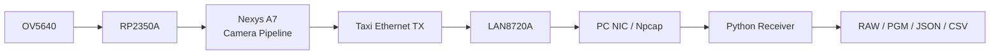

**图1-1：系统级闭环。** 当前有单Camera数据和图像归档证据，但最新bit、RP2350A
固件和最终性能报告尚未形成完整版本绑定，因此整体状态仍为`PARTIAL`。

**主要源码证据**

- `D:/prg/prg_cam/prg_cam.xpr:481-492`：top与generic。
- `D:/prg/prg_cam/prg_cam.srcs/sources_1/new/Camera_Ethernet_Top.sv:15-24`：
  顶层参数和GPIO定义。
- `D:/prg/prg_cam/prg_cam.srcs/sources_1/new/Camera_Ethernet_Top.sv:199-250`：
  Camera Pipeline实例和数据源选择。

---

<a id="sec-2"></a>

## 2. 系统需求与设计约束

### 2.1 当前数据几何与链路参数

| 项目 | 当前值 | 来源/说明 |
|---|---:|---|
| 图像宽度 | 640 pixel | Python packed 1bpp恢复配置 |
| 图像高度 | 480 row | `image_pipeline.py`默认与恢复gate |
| packed图像行 | 80 byte | `640 / 8` |
| Camera行包 | 128 byte | 24 header + 80 payload + 24 trailer |
| Ethernet II header | 14 byte | DST 6 + SRC 6 + EtherType 2 |
| MAC提供给Taxi的帧长 | 142 byte | 14 + 128，不含FCS |
| Preamble + SFD | 8 byte-time | Taxi MAC生成 |
| Ethernet FCS | 4 byte | Taxi MAC生成 |
| IFG | 12 byte-time | Taxi MAC生成 |
| 单包线上占用 | 166 byte-time | 8 + 142 + 4 + 12 |
| 单帧行数 | 480 packet | 每行一个Ethernet帧 |
| Ethernet速率 | 100 Mbps | MII 4-bit/25 MHz、RMII 2-bit/50 MHz |
| FPGA器件 | xc7a50ticsg324-1L | `prg_cam.xpr` |

`15 fps`是当前软件验收中使用的可用帧率目标；用户曾观察约`16 fps`源帧率，但
当前仓库没有与该数字绑定的传感器配置和固件hash，因此16 fps只能作为估算场景。

### 2.2 带宽计算

单帧有效二值图：

```text
640 pixel × 480 row × 1 bit = 307,200 bit = 38,400 byte
```

单帧Camera固定行包：

```text
128 byte/row × 480 row = 61,440 byte
```

单帧Ethernet线上占用：

```text
(8 preamble/SFD + 142 MAC frame + 4 FCS + 12 IFG)
× 480 row
= 79,680 byte-time
= 637,440 bit
```

| 帧率 | row packet rate | 有效图像带宽 | Camera行包带宽 | Ethernet线上带宽 | 100 Mbps占用 |
|---:|---:|---:|---:|---:|---:|
| 15 fps | 7,200 packet/s | 4.608 Mb/s | 7.373 Mb/s | 9.562 Mb/s | 9.56% |
| 16 fps（估算） | 7,680 packet/s | 4.915 Mb/s | 7.864 Mb/s | 10.199 Mb/s | 10.20% |
| 2 Camera ×15 fps（规划） | 14,400 packet/s | 9.216 Mb/s | 14.746 Mb/s | 19.123 Mb/s | 19.12% |

这些数字是协议层理论值，不包含PC驱动、Python对象和磁盘开销，也不证明实际链路
能够达到对应fps。

### 2.3 FPGA资源与时钟约束

当前普通实现报告约为752 LUT、777 FF、4 BRAM tile、0 DSP；ILA实现约为
3858 LUT、5640 FF、28.5 BRAM tile。ILA显著增加资源与路由，因此普通bit和ILA
bit的时序、hash及物理行为不能直接互换。

当前主要时钟：

- `logic_clk`：100 MHz，Camera Pipeline、Adapter和Taxi AXIS写侧；
- `rmii_ref_clk`：50 MHz、0°，RMII bridge；
- `phy_ref_clk`：50 MHz、+45°，TX IOB寄存器和ODDR转发；
- `mii_tx_clk/mii_rx_clk`：25 MHz，由RMII bridge生成；
- Camera PCLK：外部异步输入，实测频率和输入窗口仍为`PENDING`。

### 2.4 为什么需要多级缓存和异步输出

| 机制 | 解决的问题 | 不能解决的问题 |
|---|---|---|
| Line Buffer多slot | Camera不可反压时，暂存完整行并按包提交 | 长期输出低于输入仍会满并整行丢弃 |
| Arbitration | 多Camera共享单一Byte/Ethernet链路 | 不能增加链路总带宽 |
| Byte FIFO | 吸收包级短期反压，隔离上游和Adapter | 512 byte只能吸收约4个固定包 |
| Taxi async TX FIFO | 100 MHz AXIS到25 MHz MII CDC | PHY/NIC或线缆错误 |
| Python capture queue | 吸收NIC回调与packet worker的短期速率差 | 满队列时live包会被主动drop |
| frame output queue | 把磁盘写入移出packet热路径 | 长期磁盘慢于图像产生时最终仍会背压 |

---

<a id="sec-3"></a>

## 3. 总体端到端架构

### 3.1 完整数据流

```mermaid
flowchart LR
    OV[OV5640] --> RP[RP2350A<br/>PIO / DMA / packet generator]
    RP --> GPIO[GPIO<br/>D0-D7 / PCLK / HREF]
    GPIO --> CAP[Camera_Capture]
    CAP --> LB[Line_Buffer]
    LB --> ARB[Arbitration<br/>one-hot packet lock]
    ARB --> REP[Byte_Replacer]
    REP --> BF[Byte_FIFO]
    BF --> ADP[Ethernet_Frame_Adapter]
    ADP --> TAXI[Taxi TX FIFO / CDC / MAC]
    TAXI --> MII[MII<br/>4-bit / 25 MHz]
    MII --> BR[MII/RMII Bridge]
    BR --> RMII[RMII<br/>2-bit / 50 MHz]
    RMII --> PHY[LAN8720A]
    PHY --> NIC[PC NIC / Npcap]
    NIC --> L1[Layer1 Capture]
    L1 --> L2[Layer2 Ethernet Decode]
    L2 --> L3[Layer3 Camera Parse]
    L3 --> L4[Layer4 Monitor]
    L4 --> L5[Layer5 Reassembler]
    L5 --> POL{Image policy}
    POL -->|COMPLETE| Q[Frame output queue]
    POL -->|RECOVERED| Q
    POL -->|REJECTED| LOG[Reject log]
    Q --> WORK[Async output worker]
    WORK --> FILES[RAW / PGM / JSON / CSV]
```

**图3-1：完整工程数据流。** Camera输入端没有`ready`；从Line Buffer输出到Taxi
采用可反压握手；PC端再使用两个有界队列隔离抓包和磁盘输出。

### 3.2 各节点契约

| 节点 | 输入 → 输出 | 时钟/线程 | 缓存/握手 | 错误或丢弃 | 观测方法 |
|---|---|---|---|---|---|
| RP2350A输出 | 像素 → D0-D7/PCLK/HREF | 外部Camera域 | 无FPGA ready | 源端DMA/PIO异常未知 | 源端逻辑分析仪 |
| Camera_Capture | GPIO → byte/line事件 | 100 MHz采样异步输入 | 2FF + PCLK filter，无反压 | `byte_count!=128` | ILA raw/sync/pulse/count |
| Line_Buffer | 行事件 → 128-byte流 | 100 MHz | 4 slot，reserve/commit | 满时整行drop | overflow、drop count、slot计数 |
| Arbitration | 4 request → one-hot grant | 100 MHz | 包级锁定至released | grant饥饿/未释放 | request/grant/released |
| Byte_Replacer | 原行包 → patched行包 | 100 MHz | ready/valid | 只在握手时推进 | offset、CRC、last |
| Byte_FIFO | `{last,data}`流 | 100 MHz | 512×9同步FIFO | 满时`in_ready=0` | level/full/almost_full |
| Frame Adapter | 128 → 142-byte MAC帧 | 100 MHz | AXIS式ready/valid/last | stall保持 | frame handshake |
| Taxi | AXIS → MII | 100→25 MHz | async frame FIFO | overflow/underflow | Taxi status + MII ILA |
| RMII bridge | MII → RMII | 25↔50 MHz | bridge内部状态 | 相位/位序/复位 | MII和RMII分域ILA |
| PHY/NIC | RMII → Ethernet | 50 MHz/网络 | PHY/NIC buffer | FCS/线缆/kernel drop | LINK、示波器、PCAP |
| capture queue | raw frame → worker | producer/consumer线程 | 有界，live满时drop | queue drop | peak/capacity/rates |
| Layer2/3 | Ethernet → typed packet | packet worker | 同步函数调用 | length/sync/CRC/flags | parser reason |
| reassembler | valid row → frame session | packet worker | `(cam_id,frame_id)` | conflict/gap/timeout | session统计 |
| output queue | frame → writer | 独立worker | 有界，满时阻塞 | worker failure | queue peak/failure |
| storage | frame → files | output worker | temp/replace + append | Windows rename/磁盘异常 | output counters/files |

### 3.3 三个关键边界

1. **Camera边界**：PCLK/HREF/DATA在物理引脚是否正确，到`Camera_Capture`
   是否仍被正确采样。
2. **Ethernet边界**：MAC前row packet是否连续，MII/RMII和PHY是否把完整Ethernet
   帧交给NIC。
3. **PC软件边界**：Npcap回调是否已收到帧，以及Python capture queue和消费者
   是否跟得上。

整帧缺失而已收到帧的CRC和长度均正确时，应优先检查整包drop，不应先假设RMII
发生随机bit翻转。

---

<a id="sec-4"></a>

## 4. RP2350A与FPGA输入接口

### 4.1 当前能够证明的接口

顶层定义：

```systemverilog
// Camera_Ethernet_Top.sv:24
input wire [9:0] GPIO; // [7:0]=D0..D7, [8]=PCLK, [9]=HREF
```

当前XDC映射：

| 信号 | Pmod位置 | FPGA PACKAGE_PIN | IOSTANDARD | 方向 |
|---|---|---|---|---|
| D0 / GPIO[0] | JA1 | C17 | LVCMOS33 | input |
| D1 / GPIO[1] | JA2 | D18 | LVCMOS33 | input |
| D2 / GPIO[2] | JA3 | E18 | LVCMOS33 | input |
| D3 / GPIO[3] | JA4 | G17 | LVCMOS33 | input |
| D4 / GPIO[4] | JA7 | D17 | LVCMOS33 | input |
| D5 / GPIO[5] | JA8 | E17 | LVCMOS33 | input |
| D6 / GPIO[6] | JA9 | F18 | LVCMOS33 | input |
| D7 / GPIO[7] | JA10 | G18 | LVCMOS33 | input |
| PCLK / GPIO[8] | JB1 | D14 | LVCMOS33 | input |
| HREF / GPIO[9] | JB7 | E16 | LVCMOS33 | input |

证据：`D:/prg/prg_cam/prg_cam.srcs/constrs_1/new/nexys_a7_ethernet.xdc:8-21`。

### 4.2 RP2350A侧事实边界

当前仓库没有正式RP2350A `main.c`、PIO程序、DMA配置和固件hash。因此本文只能从
FPGA收到的128-byte格式和用户提供的header定义反推接口契约，不能证明：

- OV5640寄存器配置和实际sensor fps；
- PIO状态机如何采样；
- DMA缓冲深度与overflow行为；
- HREF/PCLK在连接FPGA前后是否保持同样波形；
- metadata在RP2350A内的确切生成时刻。

这些内容统一标为`PENDING`，直到固件源码或带hash的构建产物进入证据集。

### 4.3 为什么输入侧不能提供传统ready反压

PCLK、HREF和D0-D7是源同步推送接口。Camera/RP2350A不会等待FPGA的
`ready`，所以当Line Buffer满时，FPGA只能：

1. 继续采样当前物理输入；
2. 对无法预留slot的行产生drop/overflow证据；
3. 不能让上游“停在当前byte”。

这与AXI-Stream不同：AXI-Stream发送方在`valid=1, ready=0`时必须保持
`data/last`，可以等待后续时钟再继续。

### 4.4 电气和采样风险

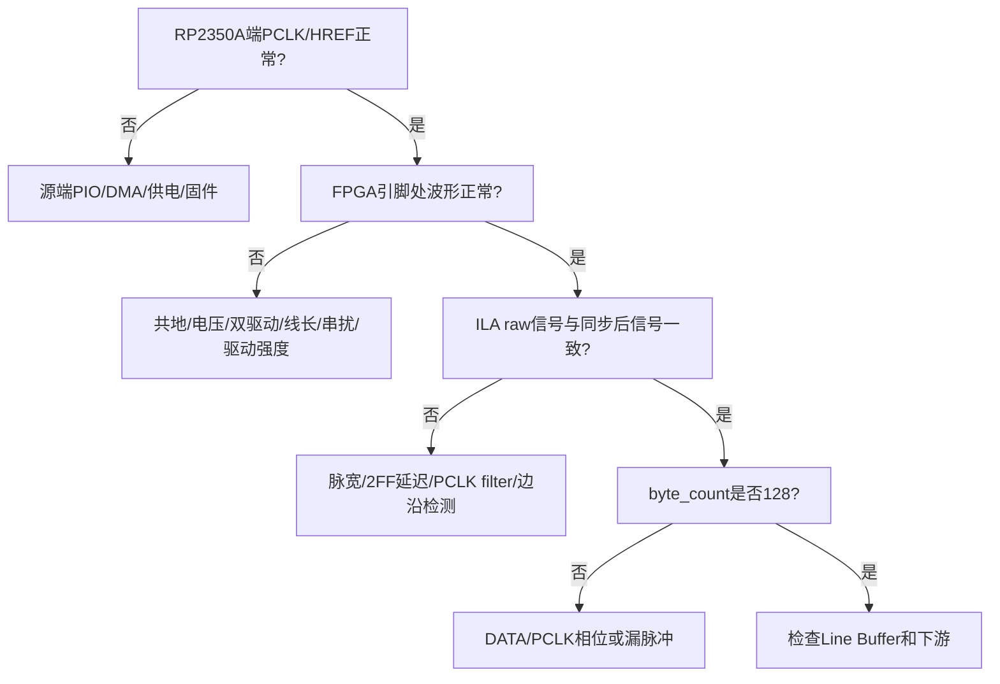

**图4-1：Camera物理输入与FPGA采样的证据分层。** 逻辑分析仪只测RP2350A端，
不能证明FPGA引脚处和同步后的HREF/PCLK相同；下一次验证应在源端与FPGA端同时测量。

---

<a id="sec-5"></a>

## 5. FPGA Camera采集和缓冲架构

### 5.1 顶层与模块层级

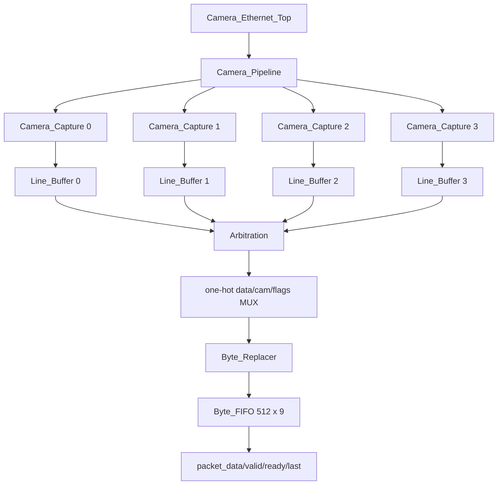

**图5-1：FPGA Camera Pipeline层级。** 逻辑预留四路，但当前只有Camera0连接真实GPIO；
Camera1～3在顶层绑0。

关键实例：

- `Camera_Pipeline.v:99-190`：4×Capture与4×Line Buffer；
- `Camera_Pipeline.v:195-252`：one-hot选择和Arbitration；
- `Camera_Pipeline.v:263-304`：Byte_Replacer与Byte_FIFO；
- `Camera_Ethernet_Top.sv:199-250`：Camera0接线与packet源选择。

### 5.2 Camera_Capture：异步输入与行计数

`Camera_Capture`把外部PCLK、HREF和DATA采样到100 MHz域。当前实现让三者经过
相同深度的2FF，再对PCLK同步电平进行`PCLK_FILTER_LEN=2`投票。

关键代码区域：

- `Camera_Capture.v:46-75`：同步寄存器和debug网；
- `Camera_Capture.v:88-109`：PCLK历史投票与边沿；
- `Camera_Capture.v:132-190`：line start/end、byte count和length error。

简化后的行采集ASM：

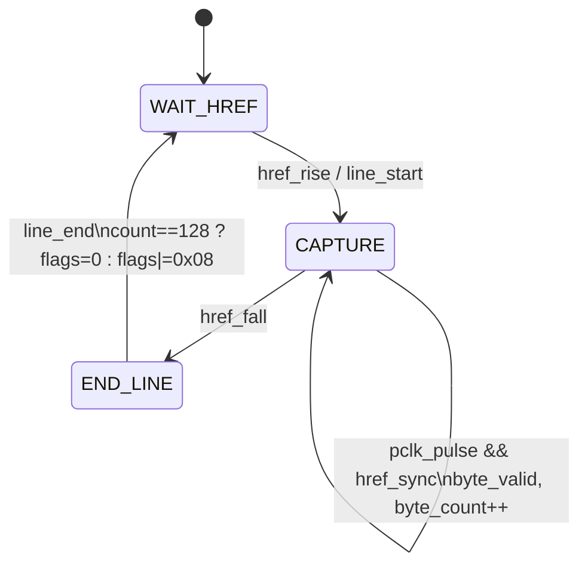

**图5-2：一行数据的采集ASM。** `length_error_pulse`只说明FPGA观测到的行长度不是
128，不能单凭该信号区分源端少发、引脚畸变还是FPGA漏采。

### 5.3 Line Buffer：reserve、commit与release

每路Line Buffer有4个128-byte slot。它不会让读端看到正在写入的半行：

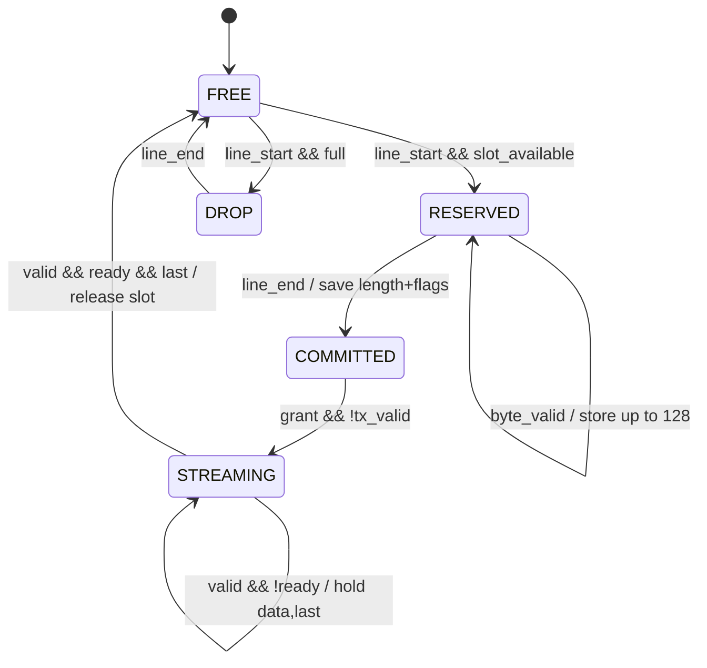

**图5-3：Line Buffer状态。** 短行的未接收位置补0，长行只保留前128 byte；
metadata保留真实长度错误。满载时整行不预留slot，并产生overflow/drop计数。

事件定义见`Line_Buffer.v:103-108`附近：

```verilog
wire reserve_event = capture_line_start && !rx_reserved &&
                     (used_count < LINE_SLOTS);
wire drop_event    = capture_line_start && !rx_reserved &&
                     (used_count >= LINE_SLOTS);
wire commit_event  = capture_line_end && rx_reserved;
wire release_event = tx_valid && tx_ready && tx_packet_last;
```

### 5.4 Arbitration：包级one-hot锁定

`request`是“已有已提交包”的level信号。仲裁器在空闲时选择一个request，
将one-hot grant保持整个128-byte包，只有最后一个byte真实握手才释放。

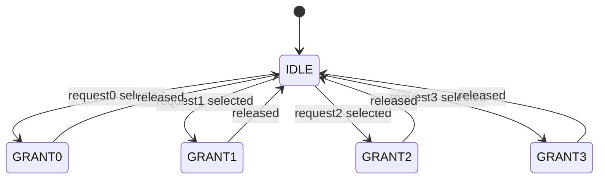

`released`在`Camera_Pipeline.v:201-209`定义为：

```verilog
selected_valid && replacer_in_ready && selected_last
```

这避免了在stall时提前换Camera，也防止一个Ethernet payload混入两路数据。
round-robin游标用于下一次授权，但公平性只能在请求持续和链路可服务的前提下成立。

### 5.5 Byte_Replacer

Byte_Replacer只在真实`valid&&ready`握手时前进offset并更新CRC：

- offset 4：覆盖`cam_id`；
- offset 9：上游`row_flags | FPGA line_flags`；
- offset 126/127：写入重新计算的CRC16低字节/高字节；
- offset 127：产生packet last。

证据：`Byte_Replacer.v:20-23,65-108`。stall期间offset和CRC不重复推进。

### 5.6 Byte FIFO与反压

Camera Pipeline内部Byte FIFO深度为512，每项为`{last,data}`共9 bit，可容纳约4个
固定行包。FIFO输出使用holding register，因此`out_valid && !out_ready`期间
`out_data/out_last`保持稳定。

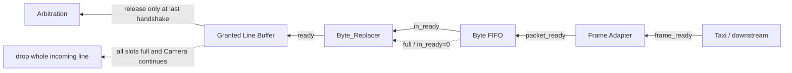

**图5-4：下游反压向上传播。** Ethernet侧能够等待；Camera物理输入不能等待。
当反压持续超过Byte FIFO和Line Buffer容量时，设计选择整行丢弃并留下overflow
证据，而不是输出混合或不确定长度的数据。

---

<a id="sec-6"></a>

## 6. Camera行包协议

### 6.1 128-byte布局

当前Python协议定义位于
`prg_cam.srcs/sources_1/tx/taxi_receiver_advanced/taxi_receiver/taxi_receiver/packet_format.py:28-74`。
FPGA不会重新生成整个header；它只修补`cam_id`、OR入FPGA flags并重算CRC16。

| Offset | 长度 | 字段 | 当前线上端序 | 生成者 | FPGA处理 | Python解析/校验 |
|---:|---:|---|---|---|---|---|
| 0 | 2 | `sync0` | BE，`A5 A0` | RP2350A | 原样，CRC覆盖 | 必须为`0xA5A0` |
| 2 | 2 | `sync1` | BE，`5A 50` | RP2350A | 原样，CRC覆盖 | 必须为`0x5A50` |
| 4 | 1 | `cam_id` | U8 | 上游占位/FPGA | Byte_Replacer覆盖 | session key第一部分 |
| 5 | 2 | `frame_id` | BE | RP2350A | 原样 | 16-bit图像帧编号 |
| 7 | 2 | `row_idx` | BE | RP2350A | 原样 | 必须在预期行范围 |
| 9 | 1 | `row_flags` | bit field | RP2350A + FPGA | 与FPGA flags按位OR | raw flags用于严格判断 |
| 10 | 1 | `payload_len` | U8 | RP2350A | 原样 | `0..80`；0为warning，>80为error |
| 11 | 2 | `row_seq` | BE | RP2350A | 原样 | 16-bit全局行序列 |
| 13 | 11 | `reserved` | byte array | RP2350A | 原样 | 保留，不推测语义 |
| 24 | 80 | packed row payload | MSB-first 1bpp | RP2350A | 原样 | 展开为640个0/255像素 |
| 104 | 10 | trailer pad | byte array | RP2350A | 原样 | 当前应为0，保留审计 |
| 114 | 4 | `m00` | BE U32 | RP2350A | 原样 | 运动/质心metadata |
| 118 | 2 | `xc_q4` | BE U16 | RP2350A | 原样 | x坐标Q4 |
| 120 | 2 | `yc_q4` | BE U16 | RP2350A | 原样 | y坐标Q4 |
| 122 | 2 | `vx_q8` | BE S16 | RP2350A | 原样 | x方向动量/速度Q8 |
| 124 | 2 | `vy_q8` | BE S16 | RP2350A | 原样 | y方向动量/速度Q8 |
| 126 | 2 | `CRC16` | little-endian存放 | FPGA最终重算 | 覆盖offset 0..125 | CRC16/CCITT-FALSE |

### 6.2 C packed、线上端序和legacy边界

用户提供的C结构使用`__attribute__((packed))`，它只消除结构体padding，不自动规定
网络端序。当前正式Python构包和解析采用大端body、CRC16小端存放：

```python
# packet_format.py:45-72
SYNC0_DEFAULT = 0xA5A0
SYNC1_DEFAULT = 0x5A50
_BODY_STRUCT_BE = struct.Struct(">HHBHHBBH11s80s10sIHHhh")
```

`parse_camera_row()`仍保留旧`A5 A5 5A 5A`数据的little-endian兼容分支，但该分支
只用于legacy回归，不能作为当前正式协议。

当前正式sync为`A5 A0 5A 50`。此前sync异常已被定位为硬件问题并修正；没有与
固件hash绑定的旧`sample_eth_data4_ref.pcapng`不能继续作为当前字节序证据。

### 6.3 标志位

| Bit | 值 | 名称 | 当前语义 |
|---:|---:|---|---|
| 0 | `0x01` | `OVERFLOW` | 上游或FPGA缓存溢出/丢行证据 |
| 1 | `0x02` | `LAST_ROW` | 当前包声明为一帧最后一行 |
| 2 | `0x04` | `FIRST_ROW` | 当前包声明为一帧第一行 |
| 3 | `0x08` | `LENGTH_ERROR` | FPGA观测到该HREF内byte count不是128 |

`0x04`不是overflow。`0x58`也不是协议定义的新flag；attempt3中它与长度异常和字段
错位同时出现，应作为错误证据，不应加入合法flag集合。

`row_flags_raw`保存线上原始值；`row_flags_effective`是SessionAudit在同一
`(cam_id, frame_id)`中向后传播污染状态后的审计值。恢复决策依据严格解析结果、
raw flags和实际`missing_rows`，不能把effective污染位误当成后续所有行都无效。

### 6.4 两层CRC不能混淆

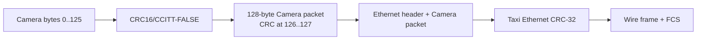

**图6-1：Camera CRC16与Ethernet FCS。** Camera CRC16保护行包语义，Python能够
直接检查；Ethernet FCS由Taxi MAC生成，通常由NIC验证后不会作为payload交给Python。

---

<a id="sec-7"></a>

## 7. Ethernet封装与Taxi架构

### 7.1 Ethernet Frame Adapter

`Ethernet_Frame_Adapter.sv:31-45`生成14-byte Ethernet II header：

```text
DST       FF:FF:FF:FF:FF:FF
SRC       02:00:00:00:00:02
EtherType 88 B5
Payload   128-byte Camera row packet
```

Adapter输出给Taxi的MAC帧为142 byte，不包含preamble、SFD和FCS。

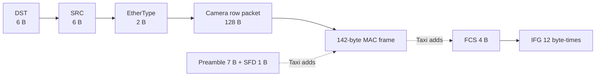

**图7-1：Camera packet嵌套在Ethernet帧中。**

Adapter状态机：

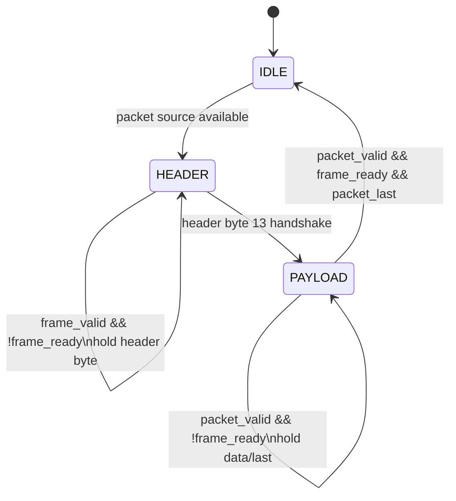

HEADER阶段`packet_ready=0`；PAYLOAD阶段`packet_ready=frame_ready`。只有最后一个
payload byte真实`valid&&ready`时，`frame_last`才随该byte完成握手。证据：
`Ethernet_Frame_Adapter.sv:49-108`。

### 7.2 AXI-Stream握手

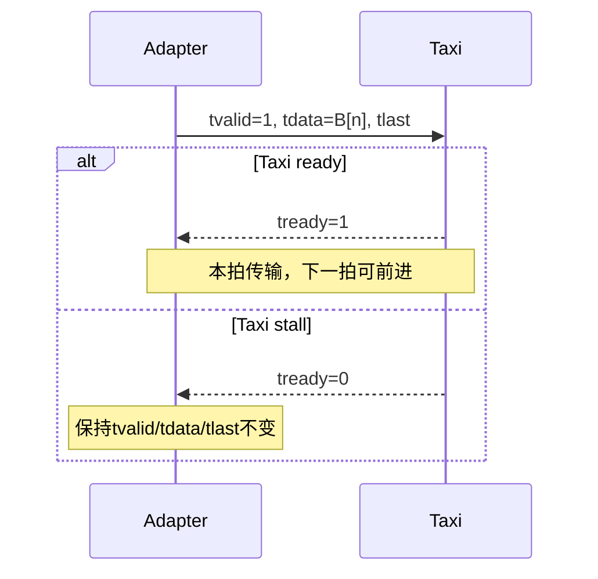

**图7-2：AXI-Stream单byte握手。** `valid`表示发送方当前有确定数据，`ready`
表示接收方本拍能够接受；两者同时为1才算传输。

`Taxi_Ethernet_Subsystem.sv:70-90`把扁平端口映射到内部`taxi_axis_if`：

- `tdata=frame_data`；
- `tvalid=frame_valid`；
- `frame_ready=tready`；
- `tlast=frame_last`；
- `tkeep=tstrb=1`，`tuser/tid/tdest=0`。

未使用RX、completion和statistics stream的`tready`拉高，避免未消费接口反压
内部链路。原始SystemVerilog interface没有暴露到BD边界。

### 7.3 Taxi依赖和运行机制

入口filelist为：

`prg_cam.srcs/sources_1/lib/taxi-master/eth/rtl/taxi_eth_mac_mii_fifo.f`

`add_taxi_sources.tcl`递归解析相对路径并在本地lib中按文件名重映射。当前清单：

- 8个filelist；
- 26个RTL；
- 16个路径remap；
- missing dependency=0。

Taxi发送链：

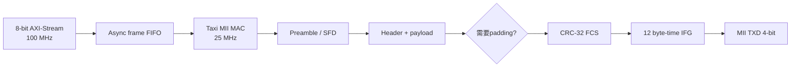

**图7-3：Taxi TX运行流程。** 当前142-byte MAC帧已经超过Ethernet最小长度，所以
本项目正常包不会触发padding；Taxi仍保留通用padding机制。

主要源码：

- `taxi_eth_mac_mii_fifo.sv:364-404`：TX async frame FIFO；
- `taxi_eth_mac_mii.sv`：MII MAC包装；
- `taxi_axis_gmii_tx.sv:343-503`：preamble、SFD、payload、padding、FCS和IFG；
- `Taxi_Ethernet_Subsystem.sv:92-170`：本项目参数与端口连接。

### 7.4 MII到RMII

MII在25 MHz每拍传4 bit；RMII在50 MHz每拍传2 bit。当前bridge来自本地
`FPGA-RMII-SMII-main/RTL/rmii_phy_if.v`，不是Vivado `mii_to_rmii` XCI。

一个byte的发送顺序：

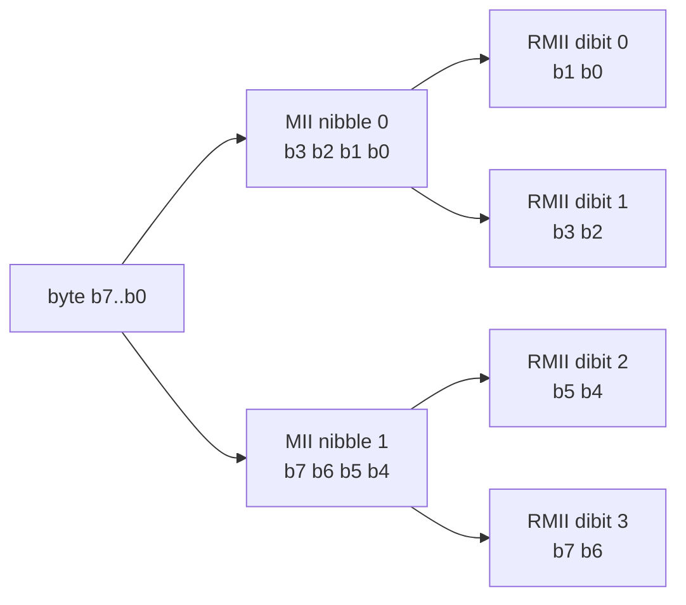

**图7-4：byte → MII nibble → RMII dibit。** 低nibble先发，每个nibble再按低2 bit、
高2 bit发出。判断位序必须使用scoreboard或ILA重建，不能只看TXD“有翻转”。

### 7.5 FPGA、PHY与引脚

| 端口 | 引脚 | 方向 | 当前用途 |
|---|---:|---|---|
| ETH_REFCLK | D5 | output | ODDR转发50 MHz |
| ETH_RSTN | B3 | output | PHY低有效硬复位 |
| ETH_TXEN | B9 | output | RMII TX enable |
| ETH_TXD[0] | A10 | output | RMII TX dibit bit0 |
| ETH_TXD[1] | A8 | output | RMII TX dibit bit1 |
| ETH_CRSDV | D9 | input | RMII RX carrier/data valid |
| ETH_RXD[0] | C11 | input | RMII RX |
| ETH_RXD[1] | D10 | input | RMII RX |
| ETH_RXERR | C10 | input | RMII RX error |
| ETH_MDC | C9 | output | 当前常量0，无正式MDIO控制 |
| ETH_MDIO | A9 | inout | 当前高阻 |
| ETH_INTN | B8 | input | 未进入当前TX功能 |

全部使用LVCMOS33。证据：
`prg_cam.srcs/constrs_1/new/nexys_a7_ethernet.xdc:23-34`。

### 7.6 时钟转发与外部时序

`Camera_Ethernet_Top.sv:344-376`使用：

- falling-edge TX IOB寄存器驱动`ETH_TXEN/TXD`；
- 7-series `ODDR`正规转发`ETH_REFCLK`；
- `phy_ref_clk`为50 MHz、+45°。

XDC当前对TXD/TXEN设置：

```tcl
set_output_delay -clock [get_clocks eth_refclk_out] -max  4.000 \
    [get_ports {ETH_TXEN ETH_TXD[*]}]
set_output_delay -clock [get_clocks eth_refclk_out] -min -1.500 \
    [get_ports {ETH_TXEN ETH_TXD[*]}]
```

这些数值已进入当前实现，但仓库缺少LAN8720A数据手册，无法从本地一手资料重新核验
4.0 ns/1.5 ns，板级sign-off仍为`PENDING`。

### 7.7 当前TX/RX状态

| 项目 | 状态 | 说明 |
|---|---|---|
| Adapter 14+128与stall/TLAST | `PASS` | XSim自动比较 |
| Taxi依赖、compile/elaboration | `PASS` | missing=0 |
| Fixed/Byte FIFO 0x88B5 TX | `PASS`（历史硬件证据） | 固定payload PCAP |
| Camera-like 0x88B5包 | `PARTIAL` | 已有抓包和归档，但未完成最新版本绑定 |
| MII/RMII完整dibit scoreboard | `PENDING` | 当前主要证据是活动和历史PCAP |
| MDIO | `PENDING` | 未实现管理事务 |
| Ethernet RX应用路径 | `PENDING` | 当前目标为TX-only |

---

<a id="sec-8"></a>

## 8. Python接收机架构

### 8.1 真实调用链

```mermaid
flowchart LR
    PS[run_receiver.ps1] --> CLI[cli.py]
    CLI --> CAP[Scapy/Npcap Capture]
    CAP --> CQ[Capture packet queue]
    CQ --> W[Packet worker]
    W --> L1[Layer1]
    L1 --> L2[Layer2 Ethernet]
    L2 --> L3[Layer3 Camera]
    L3 --> L4[Layer4 Monitor]
    L4 --> L5[Layer5 Reassembler]
    L5 --> IMG[Image policy]
    IMG --> FQ[Frame output queue]
    FQ --> OW[Async output worker]
    OW --> ST[Storage + Image output]
```

**图8-1：Python调用和线程边界。** packet worker处理每个Ethernet row packet；
output worker只处理已关闭的image session。

主要入口：

- `run_receiver.ps1:1-52`：参数转发；
- `taxi_receiver/cli.py:29-255`：对象装配；
- `taxi_receiver/cli.py:257-322`：退出和资源关闭；
- `taxi_receiver/stages.py:58-228`：Layer链构造。

### 8.2 Layer1～Layer5

| 层 | 文件/类 | 输入 | 输出 | 拒绝/状态 |
|---|---|---|---|---|
| Capture | `capture.py/ScapyLiveCapture` | NIC packet | `RawEthernetFrame` | 权限、接口、BPF、queue full |
| Layer1 | pipeline source | raw frame | 带时间戳frame | live/offline来源 |
| Layer2 | `eth_validate.py` | Ethernet bytes | 128-byte payload | MAC/EtherType/长度 |
| Layer3 | `camera_parser.py` | payload | `CameraModeResult` | sync、payload_len、CRC、flags |
| Layer4 | `stream_monitor.py` | parsed packet | 统计与上下文 | gap、duplicate、out-of-order |
| Layer5 | `reassembler.py` | accepted row | `CompletedFrame` | session、conflict、timeout、frame switch |
| Publication | `image_pipeline.py` | completed frame | COMPLETE/RECOVERED/REJECTED | 恢复gate和图像生成 |
| Output | `async_sink.py/storage.py` | frame/result | 文件和summary | queue/worker/disk错误 |

Layer3保持严格。长度、sync或CRC失败的包可以进入审计统计，但payload不能进入
`frame.rows`，也不能被RECOVERED用作像素来源。

### 8.3 两个有界队列

| 属性 | capture packet queue | frame output queue |
|---|---|---|
| 代码 | `pipeline.py:93-176` | `async_sink.py:23-103` |
| 数据单位 | 一个Ethernet frame | 一个关闭的Camera frame/session |
| 生产者 | Npcap/PCAP callback | Reassembler/publication callback |
| 消费者 | packet worker | output worker |
| 当前脚本默认深度 | 65,536 | 256 |
| live满队列行为 | `put_nowait`失败并计入drop | `put`阻塞，不静默丢图 |
| offline满队列行为 | 阻塞重试，保持无损 | 阻塞 |
| 关键指标 | drop、peak/capacity、producer/consumer rate | submitted、processed、failure、peak |

短时突发可以被队列吸收；如果consumer或磁盘长期慢于生产者，有限队列最终仍会满。
无限队列只会把drop转化为不可控内存增长，不是正确修复。

### 8.4 Session和固定row_idx重组

Reassembler以`(cam_id, frame_id)`为key，为每个Camera维护独立session：

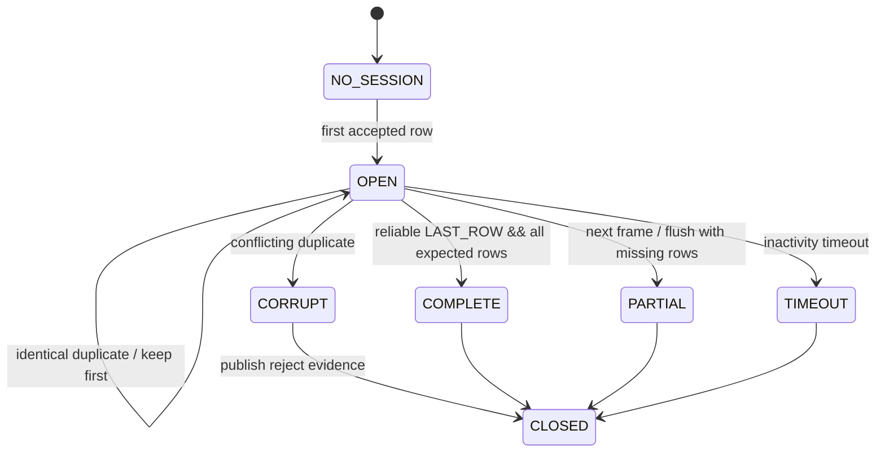

**图8-2：FrameReassembler生命周期。** 新frame创建独立row容器；输出时复制为不可变
`bytes`快照；发布/拒绝后清理session。ZERO_FILL写入缺失的固定`row_idx`位置，
不是append到末尾。

证据：

- `reassembler.py:139-277`：session、frame switch和row接收；
- `reassembler.py:312-370`：missing/status和关闭快照；
- `tests/test_reassembler.py:77-99`：不同frame_id不复用旧row。

### 8.5 COMPLETE、RECOVERED和REJECTED

`FrameStatus`原生状态为`COMPLETE/PARTIAL/CORRUPT/TIMEOUT`；
`RECOVERED/REJECTED`是`CameraImagePipeline`的publication结果。

- **COMPLETE**：480行全部通过严格校验并位于正确row_idx，不做补行。
- **RECOVERED**：显式启用`recover-zero-fill`且满足第9章所有gate，缺失row_idx填全0。
- **REJECTED**：任一安全gate不成立，不生成正式PGM/RAW，记录reason。

`--max-consecutive-missing 2`在当前代码中是拒绝阈值：连续缺失长度`>=2`即拒绝，
因此实际只允许单个连续缺行。

### 8.6 RAW、PGM、JSON和CSV

必须区分两种RAW：

| 输出 | 内容 | 480行大小 |
|---|---|---:|
| Layer5 archive `image.raw` | 80-byte/row packed 1bpp | 38,400 byte |
| ImagesRoot正式/恢复RAW | 640-byte/row U8，值0或255 | 307,200 byte |

PGM为`P5` header加307,200 byte U8像素。它不是OV5640原始Y8，而是packed 1bpp
阈值结果展开为可显示灰度。

JSON记录frame、missing rows、status、flags和错误；CSV用于逐行审计、拒绝原因、
summary和性能统计。

Storage使用temp文件/目录再replace，并针对Windows rename进行处理。
`summary.csv`已从“每帧读取并重写全部历史”的累计`O(n²)`方式改为持久句柄追加，
每帧接近`O(1)`。证据：`storage.py:169-212`。

### 8.7 异步输出的设计边界

同步写盘版本把RAW/PGM/JSON/summary操作放在packet worker的回调链上，延长了每包
消费时间。当前`AsyncCallbackDispatcher`将关闭的frame放入独立有界队列：

```text
packet worker → CompletedFrame → frame output queue → output worker → files
```

它能解决短时磁盘抖动和热路径阻塞，但不能保证磁盘长期吞吐不足时仍无反压。
worker异常会计入failure并打印；当前CLI不会自动因failure返回非零，正式验收必须
显式检查`output_worker_failures=0`。

---

<a id="sec-9"></a>

## 9. 错误传播与恢复机制

### 9.1 Camera采样错误传播

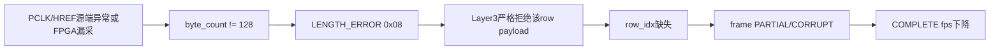

**图9-1：Camera length error传播链。** `LENGTH_ERROR`是下游可见症状；根因仍需
源端和FPGA端同步测量HREF/PCLK后才能区分。

### 9.2 Python热路径错误传播


**图9-2：PC接收端吞吐错误传播链。** 异步输出和append summary针对A/B两点减负，
但不能修复FPGA真实漏行或NIC/kernel在Scapy callback之前的drop。

### 9.3 RECOVERED准入条件

当前恢复模式只有同时满足以下条件才允许输出：

1. 可靠看到`LAST_ROW`，且接受的row 479携带LAST标志；
2. `expected_rows=480`；
3. 无`0x01 OVERFLOW`；
4. 无bad sync；
5. 无Camera CRC error；
6. 无conflicting duplicate；
7. `missing_rows = set(range(480)) - valid_rows`不超过4；
8. 最大连续缺失为1行；
9. 所有用于输出的`row_idx`位于0～479；
10. 同一session内`frame_id`一致；
11. `row_seq`跳变能由已知缺行、16-bit回绕或frame切换解释；
12. 其余用于输出的行全部通过Layer3严格校验；
13. 每个有效行长度与当前`ROW_BYTES=80`一致；
14. 像素格式为当前支持的packed 1bpp/U8展开路径。

补行：

```text
missing row_idx → bytes([0]) × 80 packed bytes
                 → 展开为 bytes([0]) × 640 U8 pixels
```

RECOVERED提升可用率并保留`missing_rows`证据，不等于原始图像完整，也不能替代
修复Camera漏采或PC queue drop。

### 9.4 错误定位判据

| 证据 | 首次能够证明的问题层 |
|---|---|
| MAC前row_seq已跳号 | Camera Capture、Line Buffer、Arbitration或Byte FIFO之前 |
| MAC前连续，MII前连续，PC原始PCAP跳号 | MII/RMII、PHY、网线、NIC或抓包层 |
| 原始PCAP连续，Python worker看到gap | capture packet queue或消费者 |
| raw/PGM缺行位置不是JSON missing_rows | publication的row_idx定位问题 |
| 新frame出现上一frame对应row的精确hash | session/buffer生命周期污染 |
| 静止画面看起来相似 | 不能证明跨帧污染 |

---

<a id="sec-10"></a>

## 10. 时钟、复位和CDC

### 10.1 时钟域表

| 时钟/速率 | 频率 | 来源 | 使用模块 | 跨域方式 | 约束/观测 | 风险 |
|---|---:|---|---|---|---|---|
| `CLK100MHZ` | 100 MHz | Nexys晶振E3 | IBUF/BUFG输入 | 无 | `create_clock 10 ns` | 板级基础时钟 |
| `logic_clk` | 100 MHz | BUFG | Camera、FIFO、Adapter、Taxi写侧、主ILA | Taxi async FIFO到MII | 内部派生 | Camera异步输入在此采样 |
| `rmii_ref_clk` | 50 MHz 0° | Clock Wizard | `rmii_phy_if` | bridge生成25 MHz | XCI/ILA分域 | bridge相位和reset |
| `phy_ref_clk` | 50 MHz +45° | Clock Wizard | TX IOB和ODDR | 输出到PHY | generated clock/output delay | 45°不能替代完整板级sign-off |
| `mii_tx_clk` | 25 MHz | RMII bridge二分频 | Taxi MAC TX | Taxi async frame FIFO | 建议25 MHz独立ILA | 与100 MHz reset同步 |
| `mii_rx_clk` | 25 MHz | RMII bridge | Taxi RX | 未使用RX应用 | 建议25 MHz独立ILA | RX未充分验证 |
| Camera PCLK | 未完成版本绑定 | RP2350A | Camera_Capture输入 | 2FF+filter到100 MHz | 当前XDC无PCLK create_clock | 普通Pmod非专用clock pin、总线原子性 |
| Python producer/consumer | 非硬件clock | OS线程 | capture/packet/output worker | 有界queue | rate/peak/drop指标 | GIL、磁盘和调度抖动 |

### 10.2 Clock Wizard、locked和PHY reset

Clock Wizard输入reset为高有效，顶层连接`~CPU_RESETN`。它产生50 MHz 0°和50 MHz
+45°，`locked`只作为下游ready/reset条件，不反馈到Clock Wizard自身reset，避免
“等待locked才能释放reset、又因reset无法locked”的死锁。

顶层PHY reset逻辑在Clock Wizard locked后继续保持`ETH_RSTN=0`约10.49 ms，再拉高。
相关代码：

- `Camera_Ethernet_Top.sv:57-109`：reset计数、复制reset域和Clock Wizard；
- `Camera_Ethernet_Top.sv:344-376`：IOB输出与ODDR；
- `ethernet_clk_wiz.xci:87`附近：输出频率和相位。

### 10.3 Camera CDC

Camera PCLK、HREF和8-bit DATA均经过等深2FF。PCLK同步后再经两拍历史投票形成
`pclk_level`和`pclk_pulse`，用于拒绝过窄毛刺。

该结构解决了旧版PCLK/HREF/DATA路径延迟不一致的问题，但仍有边界：

- 多位DATA逐位2FF不能形式化保证总线原子一致；
- Camera PCLK和DATA的外部输入delay尚未定义；
- PCLK高/低时间必须足够让100 MHz采样与filter识别；
- raw PCLK由100 MHz ILA观察可能alias，不能替代示波器。

### 10.4 Taxi CDC与reset

Taxi TX frame FIFO跨越100 MHz写侧和25 MHz读侧。`taxi_sync_reset`是异步置位、
同步释放结构。XDC对同步器异步PRE路径设置了CDC例外，以避免把设计用途明确的异步
reset释放路径当普通同步数据路径分析。

复位高扇出已通过按用途复制寄存器分担Camera和Taxi reset网络，降低
`phy_ready_reg → mac_rst`单网扇出和recovery违例风险。

### 10.5 IOB、ODDR与ILA边界

- IOB寄存器使TXD/TXEN在可控输出资源附近发出；
- ODDR把50 MHz时钟作为forwarded clock输出到D5；
- output delay告诉Vivado PHY需要的建立/保持窗口；
- ILA抓的是OBUF前内部网，不能直接证明引脚外波形；
- ILA会增加BRAM、debug hub和路由，可能让普通bit和ILA bit的物理实现不同；
- ILA不会主动改变协议状态机、生成缺失数据或修复错误。

当前普通实现时序为WNS `+2.293 ns`、WHS `+0.033 ns`，0 failing endpoints；
现有ILA实现为WNS `+1.431 ns`、WHS `+0.026 ns`。两者均为
`PASS WITH WARNINGS`语义，不能提升为板级Ethernet PASS。

---

<a id="sec-11"></a>

## 11. 项目演进过程

当前Git提交数量有限，许多阶段通过工作树、报告和历史文档体现。下表只给工程顺序，
不为无法确认的事件编造日期。

| 阶段 | 目标与实现 | 遇到的问题/根因 | 修改 | 验证证据 | 遗留风险 |
|---|---|---|---|---|---|
| 固定发生器 | 产生`00..7F`的128-byte诊断包 | Camera尚未进入发送链 | 保留`Fixed_Packet_Generator` | Fixed PCAP出现142-byte、0x88B5 | 不代表Camera |
| Byte FIFO | 在100 MHz域缓存诊断包 | source/ready切换可能堵塞 | 加入同步512×9 FIFO和stable输出 | Byte FIFO→Adapter XSim | 深度有限 |
| Frame Adapter | 添加广播DST、固定SRC和0x88B5 | header期间不能提前读payload | HEADER/PAYLOAD状态机 | 142次握手、TLAST/stall测试 | 仅MAC帧入口 |
| Taxi依赖闭包 | 本地加入MII FIFO MAC | 提取目录的`.f`路径失效 | 本地文件名remap，扁平wrapper | 8 filelist/26 RTL/missing=0 | 上游版本hash未独立锁定 |
| MII/RMII | 连接Nexys板载RMII PHY | Taxi输出MII，板载PHY为RMII | 使用本地`rmii_phy_if` bridge | MII/RMII activity、历史PCAP | 完整dibit scoreboard待补 |
| PHY LINK/0x88B5 | 建立物理link并让PC看到帧 | Clock reset、REFCLK、RSTN和bit版本混淆 | Clock Wizard、reset延时、XDC | LINK和Wireshark历史证据 | 最新GUI/ILA A/B待做 |
| ODDR与外部时序 | 降低不同布局下PHY采样风险 | REFCLK裸连和输出delay不足 | ODDR、IOB TX寄存器、output delay | routed timing PASS WITH WARNINGS | PHY datasheet sign-off待核验 |
| Camera Pipeline接入 | Camera0替代固定源 | 早期顶层只接了Byte FIFO、未真正接Camera | 实例化`Camera_Pipeline`并设置generic | Camera Pipeline→Adapter仿真 | 实时硬件完整性仍PARTIAL |
| Camera CDC修复 | 降低127/129-byte行 | PCLK/HREF/DATA路径延迟不匹配 | 等深2FF、PCLK投票 | 历史PCAP length error显著下降 | 残余length error仍需ILA |
| Reset/时序修复 | 消除高扇出reset recovery违例 | `phy_ready_reg`同时复位Camera和Taxi | reset复制、CDC PRE例外 | 当前WNS/WHS转正 | 异步reset仍需保持结构约束 |
| Python Layer1～5 | 从raw frame到typed row和session | 单脚本无法定位层级错误 | Capture/Ethernet/Camera/Monitor/Reassembler分层 | pytest和PCAP replay | live环境依赖Npcap |
| 图像输出 | 按frame_id生成RAW/PGM/JSON/CSV | LAST_ROW不等于完整图 | 480行严格重组和固定row_idx | attempt3 1022组输出 | 真实视觉正确性待sign-off |
| RECOVERED | 少量缺行时提高可用率 | 严格COMPLETE fps偏低 | 安全gate+zero-fill隔离目录 | 15项恢复测试、attempt3 795帧 | 不能掩盖上游drop |
| 异步输出 | 移除packet热路径磁盘阻塞 | 同步RAW/PGM/JSON与O(n²)summary拖慢consumer | frame output queue、worker、summary append | 慢消费者合成测试 | 新120 s live报告待补 |
| Queue监控 | 量化producer/consumer瓶颈 | 只看packet数量无法说明丢在哪 | peak/capacity/drop/rate/failure | stream monitor与final report | Npcap kernel/NIC drop仍不可见 |
| 当前单Camera闭环 | Camera0到PC归档 | 版本绑定和性能未最终闭合 | 保留严格与恢复两条输出 | 数字实现、pytest、历史PCAP/attempt3 | 目标fps和最新硬件回归PENDING |

### 11.1 关键认知修正

以下旧结论已被当前源码取代：

- “Camera Pipeline未实例化”已过期；当前顶层199～239行已经实例化。
- “PCLK由Alarmer处理”已过期；当前同步/filter在`Camera_Capture`内部。
- “ETH_REFCLK裸assign、无output delay”已过期；当前有ODDR、IOB和XDC delay。
- “0x04是overflow”已过期；当前overflow为0x01，0x04为FIRST_ROW。
- 旧`A5A5/5A5A`仅为legacy，当前正式sync为`A5A0/5A50`。
- 旧WNS/WHS和“17条DRC Warning”属于历史实现；当前普通实现为
  `+2.293/+0.033 ns`，当前DRC为37项warning检查。
- “ILA bit能通信，因此ILA是功能依赖”是错误推论。ILA只改变可观察性和物理实现。

---

<a id="sec-12"></a>

## 12. 当前验证状态

### 12.1 验证矩阵

| 模块/链路 | 状态 | 当前证据 | 能证明什么 | 不能证明什么 | 下一项验证 |
|---|---|---|---|---|---|
| OV5640/RP2350A | `PARTIAL` | 用户逻辑分析仪观察、有Camera-like包 | 源端曾产生数据 | 当前固件、配置、fps和连接后波形 | 导入固件源码/hash，双端测PCLK/HREF |
| Camera GPIO/XDC | `PASS`（静态） | JA/JB约束与顶层方向一致 | pin mapping无重复 | 电气质量和setup/hold | 示波器/ILA同测 |
| Camera_Capture | `PARTIAL` | RTL、XSim、历史PCAP改善 | 2FF/filter和计数机制成立 | 残余2729 length errors根因 | raw/sync/pulse/count ILA |
| Line_Buffer | `PASS`（RTL/仿真） | 多slot、补零、drop逻辑和测试 | commit前不暴露半包、stall稳定 | 板上永不overflow | ILA slot/drop count |
| Arbitration | `PASS`（RTL/仿真） | one-hot与released测试 | 包内不换Camera | 多路板级公平性 | Cam1压力测试 |
| Camera Byte FIFO | `PASS`（RTL/仿真） | 512×9、empty/stall/reset测试 | 同域FIFO握手成立 | 深度足够覆盖所有现场突发 | ILA level/full |
| Frame Adapter | `PASS` | header/payload/stall/TLAST XSim | 142-byte MAC输入正确 | PHY已收到 | Taxi/MII/RMII/PCAP分层 |
| Taxi依赖与elaboration | `PASS` | 8 filelist、26 RTL、missing=0 | 编译闭包和wrapper展开 | 线路帧正确 | MAC/RMII scoreboard |
| Taxi TX运行 | `PASS`（固定链） | 历史Fixed PCAP、ILA burst | 固定链曾完整通过 | 最新Camera版本持续正确 | 最新bit绑定PCAP |
| MII/RMII bridge | `PARTIAL` | RTL、活动仿真和历史硬件帧 | bridge可工作 | 所有dibit/相位跨构建稳定 | 完整scoreboard和外部时序 |
| LAN8720A LINK | `PASS`（历史） | LINK/100M LED和PCAP | PHY曾建立100M link | 当前每个bit都稳定 | 最新bit/线缆同条件记录 |
| Wireshark 0x88B5 | `PASS`（历史固定链） | 固定142-byte PCAP | FPGA固定数据到PC链成立 | Camera完整图成立 | 最新Camera PCAP |
| Python Layer2/3 | `PASS` | 88项pytest、固定/合成PCAP | strict length/sync/CRC/flags | live永不丢包 | 120 s live A/B |
| Reassembler | `PASS`（测试） | 多Camera、乱序、重复、跨帧隔离测试 | session和row_idx机制 | 硬件数据总满足前提 | 大规模PCAP replay |
| COMPLETE输出 | `PASS`（attempt3内容） | 227 COMPLETE，RAW/PGM一致 | 已有完整帧按当前规则发布 | 最新硬件目标fps | 新归档与场景对照 |
| RECOVERED输出 | `PASS`（规则/attempt3） | 795 RECOVERED、zero-fill failure=0 | missing位置正确补0 | 图像等同原始完整图 | 与完整参考帧差异统计 |
| Python性能 | `PARTIAL` | attempt3 usable 8.453 fps；已做异步优化 | 旧瓶颈量化和代码方向 | 优化后达到15 fps | 新120 s报告 |
| GUI普通bit | `PARTIAL` | 当前bit生成、WNS/WHS为正 | 数字实现完成 | 与最新ILA bit同样硬件行为 | A/B PCAP + hash |
| ILA bit | `PARTIAL` | bit/ltx、ILA timing | 当前47-probe产物可调试 | 新脚本50 probe已在bit中 | 重建并记录hash |
| RMII外部时序 | `PARTIAL` | ODDR/IOB/output delay、timing PASS | 约束已进入实现 | 数值符合PHY datasheet和PVT | datasheet核验+示波器 |
| MDIO/RX | `PENDING` | 端口存在、未消费stream拉ready | TX不被unused stream堵塞 | 管理和完整RX协议 | 独立需求与测试 |
| Cam1～3 | `PENDING` | Pipeline结构预留，顶层绑0 | RTL可扩展点存在 | 物理、CDC、公平性、带宽 | Cam1端口/XDC/仿真/板测 |

### 12.2 当前Vivado状态

最新普通GUI routed报告：

- WNS：`+2.293 ns`；
- WHS：`+0.033 ns`；
- failing endpoints：0；
- 资源：约752 LUT、777 FF、4 BRAM tile；
- DRC：`PASS WITH WARNINGS`，37项warning检查；
- `no_input_delay=11`、`no_output_delay=2`等检查说明仍不能写成“所有板外接口已完整约束”。

现有ILA实现：

- WNS：`+1.431 ns`；
- WHS：`+0.026 ns`；
- 现有`.ltx`为47 probe；
- 当前`build_ethernet_ila.tcl`定义50 probe，因此新增Camera边沿探针需要重建。

### 12.3 当前Python状态

- 全量pytest：`88 passed`；
- Fixed PCAP Layer1/2：`PASS`；
- strict Layer3、Reassembler和RECOVERED测试：`PASS`；
- attempt3文件一致性与zero-fill位置：`PASS`；
- attempt3 live性能：`PARTIAL`，不能作为优化后结果；
- 最新120秒队列/worker/usable fps：`PENDING`。

---

<a id="sec-13"></a>

## 13. 性能分析

### 13.1 attempt3运行数据

来源：120.905 s final report及
`D:/prg/prg_cam/images/temp/archive/attempt3/cam0`的CSV/JSON/PGM/RAW。

| 指标 | 数值 |
|---|---:|
| Elapsed | 120.905 s |
| Capture ingress | 877,432 |
| Matching Ethernet | 795,297 |
| Valid packets | 792,568 |
| Capture queue drops | 82,135 |
| Camera length errors | 2,729 |
| sequence gaps | 84,864 |
| sessions created | 1,824 |
| frames COMPLETE | 227 |
| images RECOVERED | 795 |
| images REJECTED | 802 |
| rows zero-filled | 1,459 |
| complete fps | 1.877 |
| recovered fps | 6.575 |
| total usable fps | 8.453 |
| CRC errors | 0 |
| bad Ethernet length | 0 |
| parser/processing errors | 0 |

### 13.2 当前守恒关系

本轮数据精确满足：

```text
877,432 capture ingress
-795,297 matching Ethernet
= 82,135 capture queue drops
```

因此该报告中的`Capture ingress`是在Scapy/Npcap callback入口计数，而
`Matching Ethernet`是成功进入处理队列的目标EtherType帧；差值正好是Python
队列满时主动drop，不是EtherType过滤差值。

同时：

```text
82,135 capture queue drops
+ 2,729 length-error rows
= 84,864 sequence gaps
```

这组等式只适用于attempt3当前数据。它说明该轮row_seq缺口可由Python queue drop
和Layer3拒绝的length-error行完整解释，不支持优先归因于CRC随机bit损坏。

### 13.3 入口frame rate与可用fps

```text
sessions created / elapsed
= 1,824 / 120.905
≈ 15.09 session/s
```

入口frame/session速率接近15 fps，而：

```text
(227 COMPLETE + 795 RECOVERED) / 120.905
= 8.453 usable fps
```

所以attempt3的主要损失不在Camera源完全没有达到15 fps，而在：

1. 约9.36%的Scapy callback帧未进入capture queue；
2. 另有2729行因Camera长度异常被严格拒绝；
3. 缺行使大量session超过恢复阈值或没有可靠LAST_ROW；
4. 同步写盘和旧summary实现拖慢consumer。

### 13.4 瓶颈分层

| 可能层 | 指标/证据 | attempt3判断 | 下一项证据 |
|---|---|---|---|
| Camera源/RP2350A | 源端HREF/PCLK、DMA计数 | 固件不在仓库，不能排除 | 源端计数和hash |
| FPGA Camera Capture | length errors 2729 | 存在独立残余问题 | ILA raw/sync/pulse/count |
| Line Buffer/FIFO | overflow=0，但现场level未完整归档 | 暂无大规模overflow证据 | ILA level/drop |
| Taxi/MII/RMII | CRC=0、Ethernet length=0 | 不支持“收到的帧随机损坏” | MAC前/PCAP包数对比 |
| PC capture queue | drops=82135且等式成立 | attempt3主要瓶颈之一 | 优化后drop/peak/rates |
| Python parsing | parser errors=0 | 不是主要吞吐错误源 | consumer rate |
| 磁盘输出 | 旧同步写入/O(n²) | 机制上会拖慢consumer | output queue peak/failure |

### 13.5 优化后应比较的指标

下一次相同120秒测试必须同时保存：

```text
capture_queue_drops
capture_queue_peak/capacity
producer_rate
consumer_rate
frame_output_queue_peak/capacity
output_worker_failures
length_errors
sequence_gaps
sessions_created
images_complete
images_recovered
images_rejected
complete_fps
recovered_fps
total_usable_fps
```

目标不是只让`RECOVERED`变多，而是确认：

- capture queue drops接近0，至少低于0.1%；
- producer与consumer长期速率匹配；
- frame output queue不会持续逼近capacity；
- output worker failure=0；
- sequence gap不再随queue drop大规模增长；
- usable fps尽量接近真实session入口fps；
- 剩余length error能被FPGA ILA独立解释。

---

<a id="sec-14"></a>

## 14. 后续Cam1扩展

### 14.1 规划结构

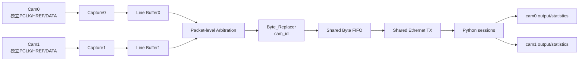

**图14-1：Cam1规划。** 每路Camera先独立捕获和缓存，只有完整行包进入共享仲裁，
避免在一个Ethernet payload内交织两路数据。

### 14.2 需要保持的设计原则

1. **独立输入和PCLK域**：Cam1必须有独立D0-D7/PCLK/HREF引脚和XDC；
2. **独立Capture/Line Buffer**：不能把两路异步Camera直接MUX后再同步；
3. **包级仲裁**：grant必须保持到最后一个byte握手；
4. **cam_id可信**：Byte_Replacer根据被授权通道写入cam_id；
5. **公平性**：round-robin需要在双路持续request下验证；
6. **共享缓存边界**：Byte FIFO和Taxi带宽按总packet rate预算；
7. **Python session隔离**：继续使用`(cam_id, frame_id)`；
8. **独立输出和统计**：cam0/cam1目录、CSV和污染状态不能共享；
9. **Cam0回归保护**：加入Cam1后必须重跑Cam0单路全部测试和PCAP；
10. **版本绑定**：保存top、generic、XDC、bit/ltx、固件与PCAP hash。

### 14.3 两路带宽预算

两路各15 fps理论线上占用约19.123 Mb/s，低于100 Mbps；四路各15 fps约
38.246 Mb/s，理论上仍低于100 Mbps。但该结论只说明线路平均带宽，不说明：

- Camera行包是否突发到同一时段；
- Line Buffer和512-byte共享FIFO能否吸收瞬时拥塞；
- Python和磁盘能否处理成倍packet/image rate；
- 仲裁是否造成某一路长期等待。

因此Cam1接入顺序应为：

```text
Cam1 Capture单元仿真
→ 双路Line Buffer/Arbitration压力测试
→ Fixed双cam metadata PCAP
→ Python双cam session/output测试
→ 板上单独Cam1
→ Cam0+Cam1同时运行
→ 120秒带宽与公平性验收
```

---

<a id="sec-15"></a>

## 15. 报告写作素材索引

### 15.1 “系统架构”章节摘要

本系统把OV5640/RP2350A产生的固定128-byte Camera行包送入Nexys A7。FPGA通过
Camera Capture、完整行缓冲、包级仲裁、metadata修补和Byte FIFO形成稳定的
ready/valid/last数据流；Ethernet Frame Adapter添加14-byte Ethernet II header，
Taxi完成TX FIFO、CDC、MAC编码和FCS，MII/RMII bridge驱动LAN8720A。PC端使用
分层Python receiver对Ethernet和Camera协议进行严格校验，以`(cam_id, frame_id)`
隔离session，并按`row_idx`重建COMPLETE或受控RECOVERED图像。

### 15.2 “FPGA设计”章节摘要

FPGA输入侧无法向Camera施加反压，因此每路Camera使用独立Capture和4-slot
Line Buffer，将只有完成的行提交给仲裁器。Arbitration以one-hot grant锁定整个
128-byte包，直到最后一个byte真实握手才释放。Byte_Replacer在握手域内修补
cam_id/flags并重算CRC16，512×9 Byte FIFO吸收短期下游stall。当前Camera0接入真实
GPIO，Camera1～3结构预留但未板级启用。

### 15.3 “Ethernet设计”章节摘要

Adapter把每个128-byte Camera行包封装为142-byte Ethernet II MAC帧，目的地址为
广播、源地址为`02:00:00:00:00:02`、EtherType为`0x88B5`。Taxi的异步frame FIFO
完成100 MHz到25 MHz CDC，MAC增加preamble、SFD、必要时padding、CRC-32 FCS和
IFG。MII以4-bit/25 MHz输出，`rmii_phy_if`转换为2-bit/50 MHz RMII；TX数据使用
IOB寄存器，50 MHz REFCLK通过ODDR转发到LAN8720A。

### 15.4 “PC接收软件”章节摘要

Python接收机由Capture、Ethernet Decode、Camera Parse、Monitor、Reassembler、
Image Policy和Storage组成。Layer3不放宽sync、长度或CRC校验；Layer5只使用严格
通过的row payload。Capture packet queue隔离Npcap与packet worker，frame output
queue把图像写盘移出热路径。COMPLETE要求480行齐全；RECOVERED只在安全gate全部
成立时对不超过4个、且不连续的缺失row_idx填全0，并与正式完整图物理隔离。

### 15.5 “验证与结果”章节摘要

当前Adapter、Byte FIFO、Camera Pipeline源、Taxi依赖和Python核心具有仿真或自动
测试证据；Python全量测试为88项PASS。普通Vivado实现WNS/WHS为正，但DRC仍有
warning。固定0x88B5链具有历史硬件PCAP证据；attempt3发布227 COMPLETE和
795 RECOVERED图像，并通过RAW/PGM和zero-fill一致性检查。该轮仍有82135 capture
queue drops和2729 length errors，usable fps为8.453，因此完整Camera到Ethernet
性能只能标为PARTIAL。

### 15.6 “限制与未来工作”章节摘要

当前缺少RP2350A正式固件hash、Camera PCLK/HREF板级输入时序、LAN8720A外部时序
数值的一手核验、最新GUI/ILA bit同条件PCAP以及异步输出优化后的120秒报告。
Camera1～3尚未接入真实端口。下一阶段应先完成Camera输入和Python吞吐的独立闭环，
再按每Camera独立Capture/Line Buffer、共享包级仲裁和独立Python session扩展Cam1。

### 15.7 关键图表目录

| 图表 | 用途 |
|---|---|
| 图1-1 | 系统级设备闭环 |
| 表2-1/2-2 | 数据几何和带宽预算 |
| 图3-1 | 完整端到端工程流 |
| 表3-1 | 每层输入、缓存、握手和观测 |
| 图4-1 | RP2350A端与FPGA端测量决策 |
| 图5-1～5-4 | FPGA层级、Capture、Line Buffer、仲裁和反压 |
| 表6-1 | 128-byte Camera协议offset |
| 图6-1 | Camera CRC16与Ethernet FCS |
| 图7-1～7-4 | Ethernet嵌套、AXIS、Taxi和MII/RMII |
| 图8-1/8-2 | Python线程/队列与Reassembler |
| 图9-1/9-2 | Camera和PC吞吐错误传播 |
| 表10-1 | 时钟域、CDC和风险 |
| 表11-1 | 项目演进复盘 |
| 表12-1 | 当前验证矩阵 |
| 表13-1 | attempt3性能与守恒关系 |
| 图14-1 | Cam1扩展规划 |

### 15.8 关键源码索引

#### FPGA

| 文件 | 关键区域 | 说明 |
|---|---|---|
| `prg_cam.xpr` | 481-510、634、674 | top、generic、source/constraint set |
| `Camera_Ethernet_Top.sv` | 57-109 | Clock Wizard、locked和PHY reset |
| `Camera_Ethernet_Top.sv` | 120-166 | Fixed诊断源和独立Byte FIFO |
| `Camera_Ethernet_Top.sv` | 169-250 | Camera0接入和源选择 |
| `Camera_Ethernet_Top.sv` | 258-376 | Adapter、Bridge、Taxi、IOB和ODDR |
| `Camera_Pipeline.v` | 92-304 | 4路Capture/Buffer、仲裁、Replacer、FIFO |
| `Camera_Capture.v` | 46-109、132-190 | 2FF、filter、line和length error |
| `Line_Buffer.v` | 103-156、198-310 | slot事件、写入、输出和stall |
| `Arbitration.v` | 60-85 | one-hot packet lock和released |
| `Byte_Replacer.v` | 44-108 | patch、CRC和last |
| `Byte_FIFO.v` | 50-115 | push/fetch、level和stable output |

#### Ethernet

| 文件 | 关键区域 | 说明 |
|---|---|---|
| `Ethernet_Frame_Adapter.sv` | 31-108 | header和HEADER/PAYLOAD握手 |
| `Taxi_Ethernet_Subsystem.sv` | 70-170 | flat→interface和MAC实例 |
| `taxi_eth_mac_mii_fifo.f` | 全文件 | Taxi入口依赖 |
| `taxi_eth_mac_mii_fifo.sv` | 364-404 | TX async frame FIFO |
| `taxi_axis_gmii_tx.sv` | 343-503 | preamble、FCS、padding和IFG |
| `rmii_phy_if.v` | 251-305 | MII/RMII TX序列 |
| `nexys_a7_ethernet.xdc` | 4-50 | 时钟、GPIO、PHY引脚和output delay |
| `ethernet_clk_wiz.xci` | 87附近 | 50 MHz 0°/+45° |
| `scripts/add_taxi_sources.tcl` | 54-258 | filelist解析、remap和manifest |
| `scripts/build_ethernet_ila.tcl` | 65-163 | ILA、probe、bit/ltx和报告 |

#### Python

| 文件 | 关键区域 | 说明 |
|---|---|---|
| `run_receiver.ps1` | 1-52 | 正式PowerShell入口 |
| `taxi_receiver/cli.py` | 29-322 | 参数、装配和退出 |
| `taxi_receiver/capture.py` | 49-100 | Npcap/BPF和raw frame |
| `taxi_receiver/pipeline.py` | 93-176 | capture queue、drop和worker |
| `taxi_receiver/packet_format.py` | 28-74、145-184 | 协议、端序和CRC |
| `taxi_receiver/camera_parser.py` | 62-112 | strict Layer3 |
| `taxi_receiver/stream_monitor.py` | 70-256 | rate、gap和queue指标 |
| `taxi_receiver/reassembler.py` | 139-370 | session、row和关闭状态 |
| `taxi_receiver/image_pipeline.py` | 262-516 | publication和恢复gate |
| `taxi_receiver/threshold_recover.py` | 90-234 | packed 1bpp展开 |
| `taxi_receiver/async_sink.py` | 23-103 | frame output queue/worker |
| `taxi_receiver/storage.py` | 44-102、169-279 | atomic archive和summary |
| `taxi_receiver/session_audit.py` | 42-186 | raw/effective flags审计 |
| `analyze_camera_archive.py` | 17-220 | missing、zero-fill和row hash |

### 15.9 关键报告与运行证据

| 证据 | 用途 |
|---|---|
| `prg_cam.runs/impl_1/Camera_Ethernet_Top_timing_summary_routed.rpt` | 当前普通实现WNS/WHS |
| `prg_cam.runs/impl_1/Camera_Ethernet_Top_drc_routed.rpt` | 当前DRC warning |
| `prg_cam.runs/impl_1/Camera_Ethernet_Top_utilization_placed.rpt` | 普通实现资源 |
| `build/ethernet_ila/timing_summary.rpt` | ILA实现时序 |
| `build/ethernet_ila/utilization.rpt` | ILA资源开销 |
| `docs/taxi_compile_manifest.txt` | Taxi依赖闭包 |
| `docs/sample_eth_data4.pcapng`及固定链PCAP | 0x88B5历史链路证据 |
| `images/temp/archive/attempt3/cam0/rows.csv` | 每row metadata和flags |
| `images/temp/archive/attempt3/cam0/rejected.csv` | reject reason |
| attempt3 JSON/PGM/RAW | 完整/恢复图像内容证据 |
| `tests/`与88项pytest | Python协议、重组、恢复、队列和存储回归 |

### 15.10 与六份Word的内容边界

本Markdown负责把系统目标、FPGA、Ethernet、Python、验证和未来扩展组织成一条
完整工程逻辑。六份Word继续承担以下独立用途：

| Word | 边界 |
|---|---|
| `01_FPGA_Architecture_and_Evolution.docx` | FPGA模块逐个深入讲解和演进 |
| `02_FPGA_Xilinx_Reproduction_and_Debug_Lab.docx` | Vivado/XSim/ILA可执行实验 |
| `03_Ethernet_Taxi_MII_RMII_Architecture_and_Evolution.docx` | Ethernet/TAXI/MII/RMII专题 |
| `04_Ethernet_Reproduction_and_Debug_Lab.docx` | 从Fixed到Wireshark的复刻实验 |
| `05_Python_Receiver_Architecture_and_Evolution.docx` | Python类、函数、队列和归档演进 |
| `06_Python_PowerShell_Reproduction_and_Debug_Lab.docx` | 环境、命令、PCAP、pytest和120秒实验 |

本文不重复Word中的逐步命令、完整实验表和大量代码页；Word也不能取代本文的跨域
架构、协议边界和总体状态矩阵。

### 15.11 无法从当前仓库确认的PENDING

1. RP2350A正式C/PIO/DMA源码、构建参数和固件SHA-256；
2. OV5640当前寄存器配置、真实PCLK/HREF和源端帧率版本绑定；
3. FPGA引脚处Camera DATA/PCLK/HREF的板级setup/hold与电气余量；
4. 当前ILA脚本50 probe对应的新bit/ltx；
5. 最新普通GUI bit与最新ILA bit在同一源码、固件、线缆下的PCAP A/B；
6. LAN8720A 4.0 ns setup/1.5 ns hold约束值的一手datasheet核验；
7. 完整MII nibble/RMII dibit/preamble/FCS/IFG自动scoreboard；
8. 性能优化后的正式120秒live报告和Npcap/NIC kernel drop统计；
9. 当前真实图像与场景参考的视觉/像素正确性；
10. 完整640×480、接近15 fps的长期单Camera硬件验收；
11. Cam1～3的物理引脚、CDC、公平性和共享带宽验收；
12. MDIO和Ethernet RX应用路径。
