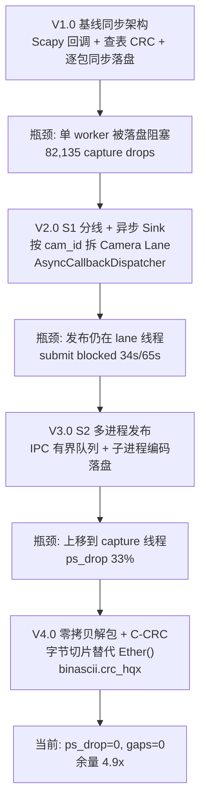
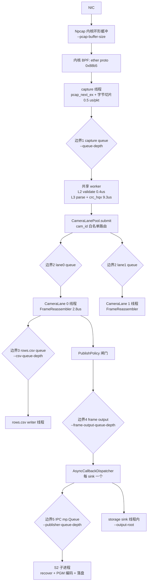
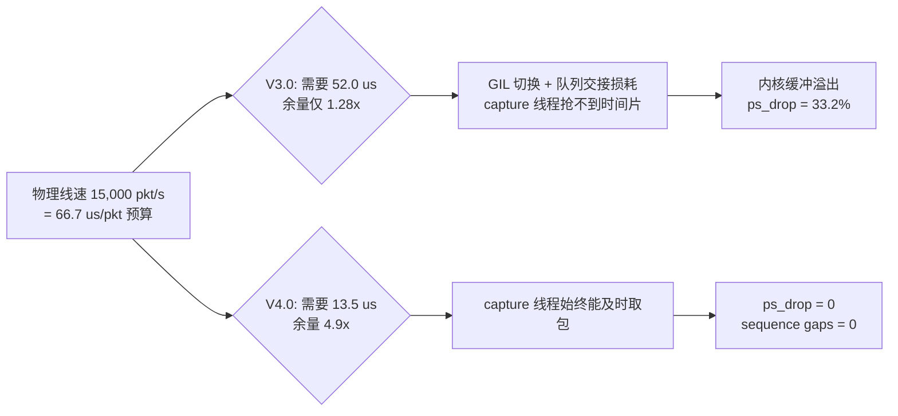
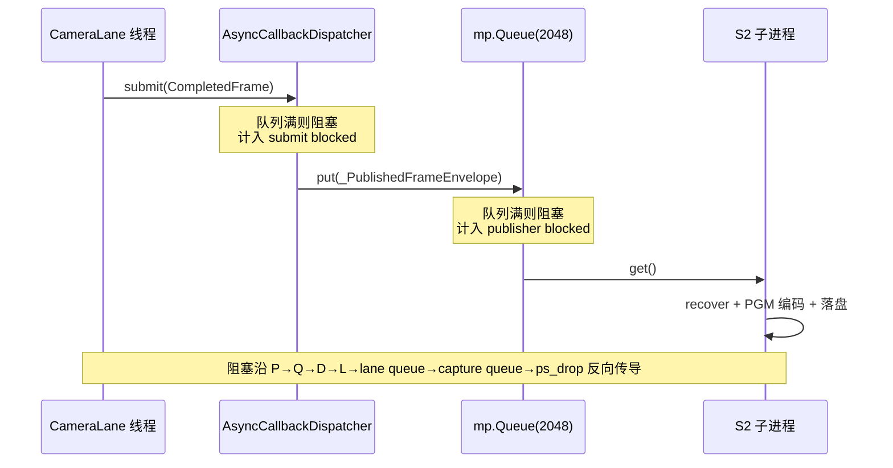
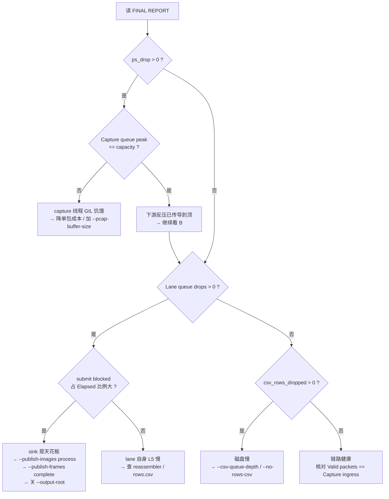

PRG_CAM · PROJECT REVIEW & TRAINING SERIES

07

更新后的 Python 接收机架构演进与机制

— 从 6 层同步链路到零拷贝解包 + S1 分线 + S2 多进程发布的四代演进

| 元数据 | 内容 |
|---|---|
| 适用对象 | 具备基础 Python/Verilog，需要理解高吞吐抓包链路与 GIL 预算的工程人员 |
| 范围 | Layer1–5、GIL 时间预算、S1 Camera Lane、S2 多进程发布、四个丢包位置、失败模式 |
| 当前状态 | 自动测试 PASS（154）；离线 A/B PASS（逐字节）；live 线速 PASS（ps_drop=0）；S2 收尾统计 PARTIAL |
| 事实基线 | 当前源码 > 当前运行报告/PCAP/CSV > Git > 其他文档 > 历史推测 |
| 来源重组 | 依据当前 Python 源码、Git diff、run001/attempt13 实测报告与本机基准测量重建 |

阅读约束：本文把 PASS、PARTIAL、PENDING 分开。PASS 指本机或板级已实测复现；PARTIAL 指
机制已定位但修复未落地；PENDING 指尚未测量。所有 μs/包 数字来自本机 40,000 包样本基准，
换机器会变，但各阶段之间的比例关系是结论的依据。

版本：Phase 2 training set · 2026-08-05

目录

在 Word 中打开后更新目录。

提示：目录为 Word 字段。若页码未自动刷新，右键目录选择"更新域" → "更新整个目录"。

---

## 1. 事实边界与总体结论

本章目标｜先划清哪些结论已经被实测钉死，哪些还是待办，避免后面的优化叙事盖过未解决项。

表 1-1  当前 Python 接收机状态

| 项目 | 状态 | 证据/边界 |
|---|---|---|
| 全量 pytest | PASS | 154 passed |
| 离线 replay A/B（S1 开/关） | PASS | 3,416 个 .raw/.pgm sha256 逐个一致 |
| 离线 replay A/B（S2 开/关） | PASS | 同上，且 lane 阻塞 105.26 s → 0.00 s |
| live 线速捕获 | PASS | ps_drop 3,047,448（33.2%）→ 0；sequence gaps → 0 |
| 单包 GIL 预算 | PASS | 52.0 μs → 13.5 μs，上限 19,231 → 74,074 pkt/s |
| archive 跨运行冲突 | PASS | 2,767 次 FileExistsError → 0 |
| S2 子进程收尾统计 | PARTIAL | Ctrl+C 杀死子进程，IMAGE PUBLICATION 读数全 0（图像本身完好） |
| 长时（>10 min）连续采集 | PENDING | 目前最长实测 611.951 s |

重要口径｜packet rate 与 image fps 是两个量纲，不能互相印证。`Consumer rate` 是完成 stage 链的
包/秒；`complete_fps` 是每秒发布的完整图像数。480 行组成一帧，两者相差约三个数量级。

重要口径｜`queue peak == capacity` 只能证明"这个队列满过一次"，**不能**证明它是瓶颈。
唯一能证明某一级是瓶颈的指标是 `submit blocked`（上游在该边界上被阻塞的累计秒数）。
本轮所有架构决策都是围绕这一个指标做的。

---

## 2. 演进时间线：四代架构与瓶颈突破

本章目标｜以"每一代解决了哪个具体瓶颈、又暴露了哪个新瓶颈"为线索串起全部改动。

图 2-1  四代架构的瓶颈迁移路径



表 2-1  各代的核心改动与量化结果

| 代 | 核心改动 | 解决的瓶颈 | 量化结果 |
|---|---|---|---|
| V1.0 | Scapy 回调、纯 Python 查表 CRC16、单 worker、逐帧同步 archive | — | 82,135 capture drops；usable 8.453 fps |
| V2.0 | `camera_lane.py` 按 cam_id 分线；每 sink 独立 `AsyncCallbackDispatcher` | 跨相机 head-of-line 阻塞；短时磁盘抖动 | 丢弃可按相机归账；吞吐 −5%（见 5.3） |
| V3.0 | `image_pipeline.py` `publish_async`；`mp.Queue` + 子进程 | 发布 CPU 占用 lane 线程 | lane `submit blocked` 105.26 s → 0.00 s；吞吐 +29% |
| V4.0 | `capture.py` 去 Scapy 实例化；`packet_format.py` 用 `binascii.crc_hqx` | capture 线程 GIL 饥饿 | 单包 52.0 → 13.5 μs；ps_drop 33.2% → 0 |

注意｜V2.0 的吞吐是**负收益**。把 S1 当性能手段是错的：GIL 下两条 lane 线程不并行执行 CPU 工作，
拆分只增加了一次队列跳转与线程交接。S1 的价值是隔离与可观测性 —— 拆分前两台相机
`sequence gaps` 相差仅 0.1%，那是"共享队列无差别丢弃"的指纹，拆分后才能分别定位。

---

## 3. 当前完整数据流

本章目标｜给出可对照源码逐段核实的当前真实数据通路与五个有界边界。

图 3-1  接收机端到端数据流（含五个有界队列边界）



表 3-1  五个有界边界与对应的观测指标

| 边界 | 位置 | 容量参数 | 满了会怎样 | 观测字段 |
|---|---|---|---|---|
| 0（内核） | NIC → 用户态 | `--pcap-buffer-size` | 内核直接丢 | `ps_drop` |
| 1 | capture → 共享 worker | `--queue-depth` | live 丢弃 / replay 阻塞 | `Capture queue drops` / `peak` |
| 2 | 共享 worker → lane | `--queue-depth / 2` | live 丢弃 / replay 阻塞 | `lane drops` / `lane peak` |
| 3 | lane → rows.csv | `--csv-queue-depth` | 按 `--csv-backpressure` | `csv_rows_dropped` |
| 4 | lane → sink dispatcher | `--frame-output-queue-depth` | **阻塞 lane 线程** | `submit blocked` |
| 5 | dispatcher → S2 进程 | `--publisher-queue-depth` | **阻塞 dispatcher 线程** | `publisher blocked` |

重要口径｜边界 4 与 5 是**阻塞**而非丢弃，这是刻意的：完成帧是稀缺产物，不应静默丢弃。
代价是阻塞会沿 5→4→2→1→0 反向传导，最终表现为 `ps_drop`。所以排查必须从上往下看：
`ps_drop` 大而 `Capture queue peak` 未满 = capture 线程自身慢；`ps_drop` 大且各级队列全满 = 下游反压。

---

## 4. V4.0：零拷贝解包与 C 库 CRC

本章目标｜说明为什么"去掉两个函数调用"能把物理线速下的丢包从 33% 打到 0。

代码对照｜capture 回调：ctypes 取包 + 纯字节切片，不再实例化 Scapy 对象

```
0176 |         def _run_capture() -> None:
0177 |             try:
0178 |                 while not self._stop_requested.is_set():
0179 |                     packet = self._next_packet(winpcapy, handle)
0180 |                     if packet is None:
0181 |                         continue
0182 |                     packet_bytes, timestamp = packet
0183 |                     if len(packet_bytes) < 14:
0184 |                         continue
0185 |                     src_mac = ":".join(f"{octet:02x}" for octet in packet_bytes[6:12])
0186 |                     dst_mac = ":".join(f"{octet:02x}" for octet in packet_bytes[0:6])
0187 |                     on_frame(RawEthernetFrame(
0188 |                         src_mac=src_mac,
0189 |                         dst_mac=dst_mac,
0190 |                         ethertype=int.from_bytes(packet_bytes[12:14], "big"),
0191 |                         camera_id=peek_camera_id(packet_bytes),
0192 |                         payload=packet_bytes[14:],
0193 |                         raw_bytes=packet_bytes if self.include_raw else b"",
0194 |                         timestamp=timestamp,
0195 |                     ))
0196 |             except Exception:
0197 |                 self._stop_requested.set()
```

证据：D:\prg\prg_cam\prg_cam.srcs\sources_1\tx\taxi_receiver_advanced\taxi_receiver\taxi_receiver\capture.py:176

关键点：pcap 句柄本来就是 ctypes/winpcapy（`pcap_create` / `pcap_activate` / `pcap_setfilter`），
Scapy 此前只被用来从同一段字节里取 `src`/`dst`/`type` 三个字段。而 `ethertype` 已由内核
BPF `ether proto 0x88b5` 保证，时间戳可直接取自 `pcap_next_ex` 的 pcap header。
换言之这 28.8 μs 是**纯粹的重复劳动**。

代码对照｜CRC16 改用 CPython 内置 C 实现

```
0150 | def crc16_ccitt_false(data: bytes, initial: int = 0xFFFF) -> int:
0151 |     """CRC-16-CCITT (False): poly=0x1021, init=0xFFFF, refin=false,
0152 |     refout=false, xorout=0x0000 -- matches the FPGA crc16_byte core."""
0153 |     return binascii.crc_hqx(data, initial & 0xFFFF)
```

证据：D:\prg\prg_cam\prg_cam.srcs\sources_1\tx\taxi_receiver_advanced\taxi_receiver\taxi_receiver\packet_format.py:150

重要口径｜`binascii.crc_hqx(data, 0xFFFF)` 与 CRC-16/CCITT-FALSE 逐位等价，已用
0/1/2/126/200 字节各 200 组随机数据验证全部相符，并与 FPGA `Byte_Replacer.v` 的
`crc16_byte` 函数（poly 0x1021、init 0xFFFF、MSB first、无反转、无末异或）语义一致。
这不是"近似替换"，是同一个算法的 C 实现。

表 4-1  单包 GIL 时间预算（本机 40,000 包样本）

| 阶段 | V3.0 μs/包 | V4.0 μs/包 | 占 V3.0 比例 | 手段 |
|---|---:|---:|---:|---|
| capture 回调（Scapy `Ether()`） | 28.8 | 0.5 | 55.4% | 字节切片，52.6× |
| L3 parse + CRC16 | 19.5 | 9.3 | 37.5% | `crc_hqx`，CRC 部分 39× |
| L5 `reassembler.on_row` | 2.8 | 2.8 | 5.4% | 未改 |
| L4 `monitor.record_camera_result` | 0.5 | 0.5 | 1.0% | 未改 |
| L2 validate | 0.4 | 0.4 | 0.8% | 未改 |
| 合计 | 52.0 | 13.5 | 100% | 3.85× |
| 单核吞吐上限 | 19,231 pkt/s | 74,074 pkt/s | — | — |

图 4-1  为什么单核能撑住 15,000 pkt/s 物理线速



注意｜四条线程共用一个 GIL，因此表 4-1 的各行是**串行相加**，不是并行摊薄。
V3.0 的 52.0 μs 对 66.7 μs 预算只剩 1.28× 余量，这个余量不足以吸收 GIL 默认 5 ms
切换间隔造成的抖动 —— 这就是"理论上够、实际上丢 33%"的原因。

---

## 5. S1：按相机分线

本章目标｜说明 S1 解决的是什么（隔离），不解决什么（吞吐），以及路由为什么必须带白名单。

代码对照｜路由使用 offset 18 的廉价 peek，但该字节不可信

```
0136 | def peek_camera_id(raw_ethernet_frame: bytes) -> Optional[int]:
0137 |     """Return the on-wire cam_id byte if the Ethernet frame is long enough.
0138 |
0139 |     The current protocol places cam_id at Ethernet payload offset 4, which is
0140 |     absolute frame offset 18 once the 14-byte Ethernet header is included.
0141 |     This helper intentionally does not validate the full camera header; it is
0142 |     just the cheap routing hint needed by the capture thread.
0143 |     """
0144 |     if len(raw_ethernet_frame) <= 18:
0145 |         return None
0146 |     return raw_ethernet_frame[18]
```

证据：D:\prg\prg_cam\prg_cam.srcs\sources_1\tx\taxi_receiver_advanced\taxi_receiver\taxi_receiver\packet_format.py:136

注意｜这个字节直接来自线上，未经 sync/CRC 校验。若不加白名单，一次 stuck-bit 或 bad-sync
风暴会为每个出现过的字节值创建一条 lane —— 每条 lane 含一个工作线程、一个
`CameraImagePipeline`（内含 CSV writer 线程与 S2 子进程）和一个 camN 目录。
实测：投入 40 个伪造 cam_id 会创建 40 条 lane、41 个线程。因此 `CameraLanePool` 强制
`--camera-ids` 白名单，白名单外的包计入 `unroutable_camera_packets` 而不建 lane。

表 5-1  S1 前后对比（923,514 帧双相机离线 replay）

| 指标 | 单共享 worker | S1 双 lane |
|---|---:|---:|
| 图像输出 | 3,416 文件 | 3,416 文件，sha256 逐个一致 |
| Consumer rate | 11,388 pkt/s | 10,998 pkt/s（−3.4%） |
| 丢弃归账 | 只有全局一个计数 | 每相机独立 `lane drops` / `lane peak` |

重要口径｜S1 的吞吐是负收益且这是预期内的。判断 S1 是否值得，看的是隔离价值：
V1/V2 时代两台相机 `sequence gaps` 分别为 810,743 与 811,598（相差 0.1%），
这种一致性说明丢弃与相机无关，是共享队列被顶满后的无差别丢弃 —— 没有 S1 就无法把
"哪一路出了问题"和"公共通路顶不住"区分开。

---

## 6. S2：多进程图像发布

本章目标｜说明跨进程载荷为什么不能只传一块 blob，以及背压是如何传导的。

代码对照｜子进程主循环与统计回传

```
0263 |     published = 0
0264 |     failures = 0
0265 |     while True:
0266 |         item = work_queue.get()
0267 |         if isinstance(item, _PublisherStop):
0268 |             pipeline.close()
0269 |             result_queue.put((pipeline.stats, published, failures))
0270 |             return
0271 |         try:
0272 |             pipeline.archive_frame(_envelope_to_frame(item))
0273 |             published += 1
0274 |         except Exception as exc:  # noqa: BLE001 - keep the child alive
0275 |             failures += 1
```

证据：D:\prg\prg_cam\prg_cam.srcs\sources_1\tx\taxi_receiver_advanced\taxi_receiver\taxi_receiver\image_pipeline.py:263

重要口径｜停止哨兵必须是可 pickle 的类型（`_PublisherStop` 数据类），不能是模块级
`object()`。`spawn` 启动方式下子进程有自己的模块实例，裸 `object()` 反序列化后与子进程
自己的哨兵不是同一对象，`is` 比较永远为假，worker 不会退出，收尾退化成两次超时等待。

表 6-1  `_PublishedFrameEnvelope` 字段与存在理由

| 字段 | 类型 | 为什么必须带 |
|---|---|---|
| `rows_blob` | `bytes` | 一块连续 `expected_rows × 80` 缓冲，一次大 pickle 取代 480 次小对象 pickle |
| `present_rows` | `bytes` 位图 | `to_bytes()` 会把缺失行补零，光有 blob 无法区分"没收到"与"像素全 0" |
| `missing_rows` | `tuple[int,...]` | 子进程的 recovery 闸门据此判定资格 |
| `status` / `close_reason` | `str` | `FrameStatus` 枚举跨进程还原 |

注意｜若丢掉 `present_rows` 与 `missing_rows`，子进程会把每一帧都判为完整帧，
把补零行当作真实像素发布 —— 这是静默产出假数据，比崩溃更危险。已有回归测试
`test_publication_envelope_round_trip_preserves_missing_rows` 钉住该行为。

图 6-1  S2 背压传导链



表 6-2  S2 开/关实测（923,514 帧，recover-zero-fill + publish eligible）

| 指标 | `--publish-images thread` | `--publish-images process` |
|---|---:|---:|
| Elapsed | 83.7 s | 65.0 s |
| Consumer rate | 11,033 pkt/s | 14,214 pkt/s（+29%） |
| lane `submit blocked` | 17.8 s + 57.2 s | 0.000 s + 0.000 s |
| `publisher blocked` | — | 0.034 s + 0.044 s |
| images complete | 854 + 854 | 854 + 854 |
| 3,416 个 .raw/.pgm | 基准 | sha256 逐个一致 |

---

## 7. 四个丢包位置与排查模型

本章目标｜给出一套可机械执行的定位流程，避免在错误的层级上调参。

图 7-1  基于 FINAL REPORT 的排查决策树



表 7-1  四个丢包位置的物理意义与修复策略

| 字段 | 物理位置 | 丢弃者 | 典型成因 | 修复策略 |
|---|---|---|---|---|
| `ps_drop` | Npcap 内核缓冲 | 内核 | capture 线程取包不及时 | 降低单包 GIL 成本（第 4 章）；`--pcap-buffer-size` 仅缓解 |
| `Capture queue drops` | 边界 1 | `_on_frame` `put_nowait` | 共享 worker L2/L3 慢 | 降低 L3 成本 |
| `Lane queue drops` | 边界 2 | `CameraLane.submit` | lane 线程被下游 sink 阻塞 | 看 `submit blocked` 定位是哪个 sink |
| `csv_rows_dropped` | 边界 3 | `record_packet` | 磁盘 flush 慢 | `--csv-queue-depth` / `--no-rows-csv` |

代码对照｜`submit blocked` 的采集点：只统计真正阻塞的那次 put

```
0082 |         try:
0083 |             self._queue.put_nowait(item)
0084 |         except queue.Full:
0085 |             started = time.monotonic()
0086 |             self._queue.put(item)
0087 |             self.stats.submit_blocked_seconds += time.monotonic() - started
0088 |             self.stats.submit_blocked_count += 1
```

证据：D:\prg\prg_cam\prg_cam.srcs\sources_1\tx\taxi_receiver_advanced\taxi_receiver\taxi_receiver\async_sink.py:82

重要口径｜先 `put_nowait`，只有抛 `Full` 时才计时。这样不阻塞的常态路径没有额外
`time.monotonic()` 开销，而一旦阻塞，累计秒数就是该 sink 造成的真实成本。
run001 报告正是靠这两行把"解析慢"的误判纠正为"发布慢"：
lane0 34.249 s / lane1 34.022 s，占 65.08 s 总时长的 53%。

---

## 8. 已知缺陷：Ctrl+C 与 S2 子进程收尾（PARTIAL）

本章目标｜准确界定这个缺陷的影响范围，避免把"读数错误"误判为"数据丢失"。

现象（attempt13，611.951 s live 运行）：

```
publisher submitted : 1458
publisher published : 0
publisher stats ok  : 0
images complete     : 0
RAW attempts/success/fail: 0/0/0
```

但磁盘实际产出：`attempt13/cam0` 1,456 个 `.pgm`，`attempt13/cam1` 1,456 个 `.pgm`。

表 8-1  机制与影响范围

| 环节 | 实际情况 | 影响 |
|---|---|---|
| 图像落盘 | 已完成并完好 | 无损失（已实测清点） |
| 子进程退出 | Windows 把 CTRL_C_EVENT 投递给整个控制台进程组；worker 只捕获 `Exception`，而 `KeyboardInterrupt` 是 `BaseException` | 子进程在 `work_queue.get()` 处直接退出 |
| 统计回传 | 子进程已死，`result_queue.get(timeout=120)` 空等 | `IMAGE PUBLICATION` 整段为假读数（全 0） |
| 关闭耗时 | 每条 lane 等满 120 s | 2 路约 240 s 挂起 |
| IPC 队列残留 | 未消费的 envelope 丢失 | 上限 `--publisher-queue-depth` 帧 |

复现（本机实测）：杀死子进程后 `close()` 在 6 s 时仍阻塞，`stats ok = 0`、`published = 0`、
`images_complete = 0`，而盘上 5 张图像齐全 —— 与 attempt13 症状逐条吻合。

注意｜Gemini 的判断"子进程存在静默崩溃或未消费数据"方向正确但结论偏严：数据已消费并落盘，
崩溃发生在**收尾阶段**而非运行期。因此这不是"暂缓即可"的隐患，而是一个**必须在下次测量前修掉的
读数缺陷** —— 只要还用 Ctrl+C 结束 live 运行，`IMAGE PUBLICATION` 段就永远是 0，
`verify_s2.ps1` 的 Gate 2（publisher 必须发布过帧）也会误判为 FAIL。

表 8-2  修复方向（尚未落地，PENDING）

| 项 | 做法 | 解决什么 |
|---|---|---|
| 子进程忽略 SIGINT | 子进程入口 `signal.signal(signal.SIGINT, signal.SIG_IGN)`，只认父进程的哨兵 | 子进程不再被 Ctrl+C 杀死，能正常回传统计 |
| 父进程探活等待 | `result_queue.get` 改为轮询 + `child.is_alive()` 检查 | 子进程已死时立即退出，不再空等 120 s |
| 读数诚实化 | 子进程失联时显式打印"counters unavailable"，不打印 0 | 避免假读数被当成真结果 |

规避手段（当前可用）：需要读 `IMAGE PUBLICATION` 的测量一律用离线 `--replay-pcap`
（自然结束，不经过 Ctrl+C），或直接清点盘上的 `.pgm` 文件数。

---

## 9. 本章之外：仍未验证的部分

表 9-1  PENDING 清单

| 项 | 现状 | 需要什么证据 |
|---|---|---|
| 长时连续采集 | 最长 611.951 s | ≥30 min 运行，观察内存与 `lane peak` 是否单调增长 |
| 15,000 pkt/s 以上线速 | 实测最高 wire 15,000 pkt/s | 提高 FPGA 帧率，验证 74k 上限的实际可达点 |
| S2 子进程收尾 | 见第 8 章 | 修复后重跑 live 并核对 `stats ok = 1` |
| RAMDisk 对 storage 的效果 | 未测 | `-OutputRoot R:\archive` 对照 `submit blocked` |
