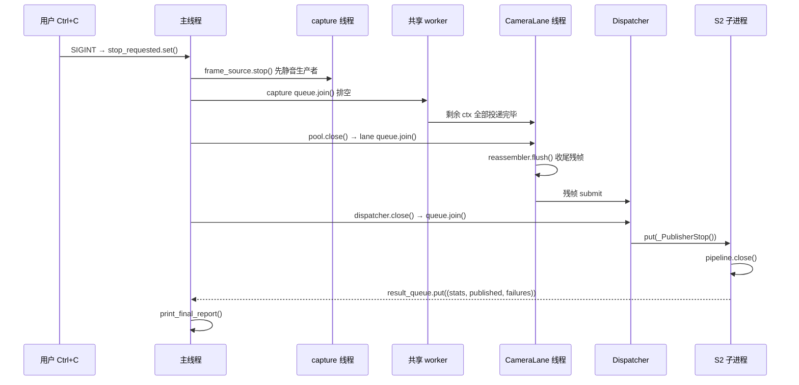
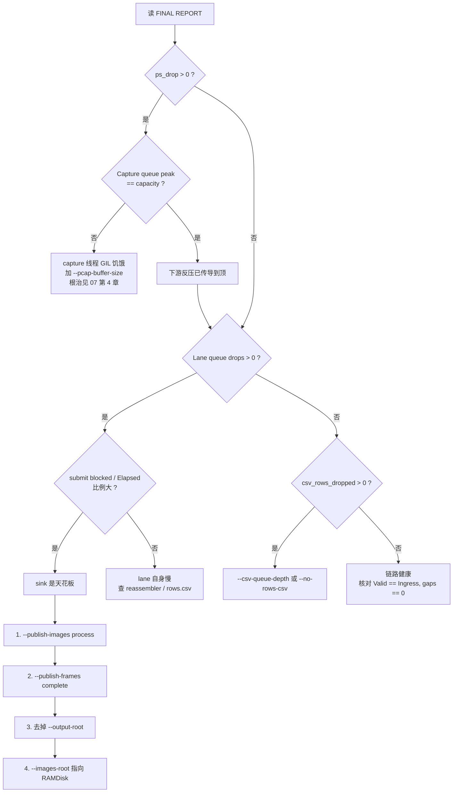

PRG_CAM · PROJECT REVIEW & TRAINING SERIES

08

更新后的 Python 接收机复刻与压测指南

— Windows 管理员 PowerShell 环境下的实验 0–12、四道闸门与故障决策树

| 元数据 | 内容 |
|---|---|
| 适用对象 | 需要在本机从零复刻、验证并压测当前接收机的工程人员 |
| 范围 | 环境准备、RAMDisk、离线无损校验、线速压测、优雅退出、故障定位 |
| 当前状态 | 实验 0–9 PASS（本机实测）；实验 10 PARTIAL（S2 收尾读数）；实验 11–12 PENDING |
| 事实基线 | 当前源码 > 当前运行报告 > Git > 其他文档 > 历史推测 |
| 来源重组 | 依据 `run_receiver.ps1` / `verify_s2.ps1` 现行参数、CLI `--help` 与本机实测重建 |

阅读约束：本文把 PASS、PARTIAL、PENDING 分开。实验卡片里标 PASS 的判据均已在本机跑通；
标 PARTIAL 的会写明已知偏差；标 PENDING 的只给方法不给结论。所有命令按原样可粘贴执行，
路径变量集中在实验 0 定义。

版本：Phase 2 training set · 2026-08-05

目录

在 Word 中打开后更新目录。

提示：目录为 Word 字段。若页码未自动刷新，右键目录选择"更新域" → "更新整个目录"。

---

## 1. 实验地图与目录约定

本章目标｜先把变量名和产物落点固定下来，后面所有实验直接引用，不再重复写绝对路径。

表 1-1  标准变量

| 变量 | 值 | 说明 |
|---|---|---|
| `$ReceiverRoot` | `D:\prg\prg_cam\prg_cam.srcs\sources_1\tx\taxi_receiver_advanced\taxi_receiver` | 所有命令的工作目录 |
| `$Py` | `C:\Users\Z\AppData\Local\Python\bin\python.exe` | 解释器绝对路径 |
| `$Iface` | `\Device\NPF_{...}` | 实验 1 获取 |
| `R:` | RAMDisk 盘符 | 实验 2 挂载，用于剥离文件系统影响 |
| `-ImagesRoot` | 图像通路输出根 | **不给它 S2 就不存在** |
| `-OutputRoot` | frame archive 输出根 | 最贵的 sink，按需开 |

```powershell
$ReceiverRoot = 'D:\prg\prg_cam\prg_cam.srcs\sources_1\tx\taxi_receiver_advanced\taxi_receiver'
$Py           = 'C:\Users\Z\AppData\Local\Python\bin\python.exe'
Set-Location $ReceiverRoot
```

表 1-2  产物落点

| 产物 | 路径 | 由谁写 |
|---|---|---|
| 图像 | `<ImagesRoot>\cam0\<frame_id>.pgm/.raw/.json` | S2 子进程 |
| 每包遥测 | `<ImagesRoot>\cam0\rows.csv` | rows.csv writer 线程 |
| 帧证据库 | `<OutputRoot>\run_<时间戳>\cam_0\frame_<id>\` | storage sink 线程 |
| 汇总 | `<OutputRoot>\run_<时间戳>\summary.csv` | storage sink 线程 |

---

## 2. 实验 0：环境准备（PASS）

本章目标｜确认解释器、依赖与执行策略，避免后面把环境问题误判成接收机问题。

```powershell
# 必须以管理员身份打开 PowerShell，否则实时抓包会返回退出码 3
Set-ExecutionPolicy -Scope Process -ExecutionPolicy Bypass -Force
Set-Location $ReceiverRoot
& $Py -c "import scapy, sys; print(sys.version)"
& $Py -m pytest tests -q --basetemp=D:\prg\prg_cam\build\pytest_tmp
```

判据｜pytest 输出 `154 passed`。

注意｜若 pytest 报 `PermissionError: ... Temp\pytest-of-Z`，必须显式给 `--basetemp`
指向一个可写目录，这是本机环境限制而非代码问题。

---

## 3. 实验 1：获取接口 GUID（PASS）

```powershell
& $Py -m taxi_receiver.cli --list
$Iface = '\Device\NPF_{6BDDE37E-7DCA-4078-98B0-E374EFE04E7C}'   # 换成你的
```

判据｜列表中能看到对应网卡；`$Iface` 形如 `\Device\NPF_{GUID}`。

---

## 4. 实验 2：RAMDisk 挂载（PASS）

本章目标｜把文件系统这个变量从压测里彻底拿掉。

```powershell
imdisk -a -s 2048M -m R: -p "/fs:ntfs /q /y"
New-Item -ItemType Directory -Force R:\images | Out-Null
```

工程原因｜一次运行会创建上万个小文件（5,754 帧 × 4 文件 = 23,016 个）。NTFS 目录索引锁
与 Windows Defender 实时扫描会让 `os.replace` 撞上 WinError 5/32，触发
`_replace_directory_with_retry` 的退避重试（最长 0.5 s/次）。同样帧率下离线 replay 阻塞 0 s、
live 阻塞 220 s，差别只在文件系统。

量化收益｜压测阶段把 `-ImagesRoot` 指向 `R:`，可消除 220 s 级别的外部文件系统等待。

替代方案｜不装 ImDisk 时，把 archive/images 根目录加入 Defender 排除列表，或放到另一块物理盘。

---

## 5. 实验 3：连通性盲测（PASS）

本章目标｜在不落任何盘的前提下确认链路、CRC 与两台相机都在。

```powershell
& $Py -m taxi_receiver.cli --interface $Iface --mode camera
```

表 5-1  判据

| 字段 | 期望 | 不满足说明 |
|---|---|---|
| `Matching Ethernet` | > 0 | BPF 没匹配到 0x88B5，查 FPGA 是否在发 |
| `Valid packets` | ≈ `Matching Ethernet` | 差值大 → 看 `CRC errors` / `Bad Ethernet length` |
| `CRC errors` | 0 | 非 0 → 链路或 FPGA CRC 计算问题 |
| `CAMERA 0` / `CAMERA 1` 的 `packets` | 两者都 > 0 | 只有一路 → 见 07 文档第 5 章的 cam_id 路由 |

注意｜`--max-stage` 默认是 `monitor`（Layer1–4），此时不组帧、不落盘，是最纯的链路判据。

---

## 6. 实验 4：分层递进（PASS）

本章目标｜出问题时逐层加深，定位第一个出错的层。

```powershell
foreach ($stage in 'validate','parse','monitor','reassemble') {
    Write-Host "=== --max-stage $stage" -ForegroundColor Cyan
    & $Py -m taxi_receiver.cli --interface $Iface --mode camera --max-stage $stage
}
```

| 深度 | 覆盖 | 新增可见信息 |
|---|---|---|
| `validate` | Layer1–2 | Ethernet 长度/类型 |
| `parse` | Layer1–3 | sync、payload_len、CRC |
| `monitor` | Layer1–4 | gap / duplicate / out-of-order |
| `reassemble` | Layer1–5 | 会话、complete/partial/timeout |

---

## 7. 实验 5：离线录包（PASS）

```powershell
& $Py -m taxi_receiver.cli --interface $Iface --mode camera `
      --pcap D:\prg\prg_cam\build\wire.pcapng
```

工程原因｜live 抓包每次流量都不同，无法做逐字节比对。录一份 pcap 之后，
离线 replay 走的是**无损**路径（队列改为阻塞背压而非丢弃），才能把
"两种配置产出是否一致"变成一个可判定的问题。

---

## 8. 实验 6：四道闸门自动校验（PASS）

本章目标｜用一条命令同时验证 S2 的正确性与收益。

```powershell
.\verify_s2.ps1 -ReplayPcap D:\prg\prg_cam\build\wire.pcapng `
                -OutRoot   D:\prg\prg_cam\build\s2_verify
```

表 8-1  四道闸门

| 闸门 | 检查内容 | 通过判据 | 不通过含义 |
|---|---|---|---|
| Gate 1 | 每个 `.raw`/`.pgm` 的 SHA-256 | thread 与 process 两模式逐字节一致 | S2 改变了输出，不再是纯粹的执行位置迁移 |
| Gate 2 | publisher 进程存活与产出 | `published > 0` 且 `failures == 0` | 子进程未消费或异常 |
| Gate 3 | lane `submit blocked` | process 模式至少降到 thread 的一半 | 发布仍在阻塞 lane 线程 |
| Gate 4 | live 专用：consumer ≥ producer 且 `lane drops == 0` | 无丢弃 | 按提示依次收紧 sink |

本机实测结果（923,514 帧双相机）：

```
Mode     Elapsed_s  Consumer_pps  LaneBlocked_s  ImagesComplete
thread       78.04         11834         105.26            1708
process      71.66         12887           0.00            1708

Gate 1 (byte equality): thread=3416 files, process=3416 files
  PASS: every published image is byte-identical
Gate 3 (lane blocking): 105.26 s -> 0.00 s
  PASS: publication no longer blocks the lane threads
RESULT: PASS
```

注意｜负载太轻时 Gate 3 会如实报 `INCONCLUSIVE: 基线本来就没阻塞`，而不是伪造 PASS。
小包（60,000 帧）实测即为此结果，需换用全量包。

注意｜Gate 1 在 live 模式自动跳过并说明原因 —— 两次 live 运行不可能观测到相同流量。

---

## 9. 实验 7：纯 S2 线速压测（PASS）

本章目标｜剥离一切可选 sink，测接收机本身能吃多快。

```powershell
& $Py -m taxi_receiver.cli `
  --interface $Iface `
  --mode camera `
  --images-root R:\images `
  --publish-images process `
  --publisher-queue-depth 2048 `
  --frame-output-queue-depth 2048 `
  --pcap-buffer-size 67108864 `
  --no-rows-csv `
  --publish-frames complete
```

表 9-1  每个参数剥离掉的变量

| 参数 | 剥离了什么 | 工程原因 |
|---|---|---|
| `--images-root R:\images` | 磁盘 | RAMDisk，无 NTFS 目录锁与 Defender |
| 不给 `--output-root` | frame archive + session_audit | 最贵的 sink，且自动关掉同步 CSV |
| `--no-rows-csv` | 每包遥测 | 每包一次 `put` + 独立线程落盘 |
| `--publish-frames complete` | 非完整帧的序列化与 recovery 评估 | 它们最终会被拒绝，纯浪费 |
| `--publish-images process` | 发布 CPU 占用主线程 | S2 |
| `--pcap-buffer-size 67108864` | 内核缓冲不足 | 吸收突发 |

表 9-2  判据

| 字段 | 期望 | 本机实测（8,484 pkt/s 线速） |
|---|---|---|
| `ps_drop` | 0 | 0 |
| `Capture queue drops` | 0 | 0 |
| `Lane queue drops` | 0 | 0 |
| `sequence gaps` | 0 | 0 + 0 |
| `submit blocked` | ≈ 0 | 0.000 s |
| `Valid packets` | == `Capture ingress` | 1,399,209 == 1,399,209 |

---

## 10. 实验 8：容错救帧采集（PASS）

本章目标｜生产采集，允许补零救回轻微缺行的帧。

```powershell
.\run_receiver.ps1 `
  -Interface   $Iface `
  -ImagesRoot  D:\prg\prg_cam\build\runN\images `
  -ImagePolicy recover-zero-fill `
  -PublishFrames eligible
```

重要口径｜`-ImagePolicy recover-zero-fill` 必须与 `-PublishFrames eligible` **同时**给。
只改前者是无效的：默认的 `complete` 闸门在 recovery 之前就把非完整帧滤掉了，
recovery 根本拿不到它们。这是最常见的配置错误。

约束｜`recover-zero-fill` 强制要求 `-ImagesRoot` 且 `-ExpectedRows 480`，否则 CLI 退出 2。

---

## 11. 实验 9：取证采集与 archive 策略（PASS）

```powershell
.\run_receiver.ps1 `
  -Interface  $Iface `
  -ImagesRoot D:\prg\prg_cam\build\runN\images `
  -OutputRoot D:\prg\prg_cam\build\runN\archive `
  -ArchiveRootPolicy run-subdir
```

表 11-1  archive root 策略

| 策略 | 行为 | 何时用 |
|---|---|---|
| `run-subdir`（默认） | 落到 `<root>\run_<时间戳>\` | 常规，永不与历史运行冲突 |
| `require-empty` | root 下已有帧数据就退出 6 | CI/自动化，要求显式清理 |
| `reuse` | 沿用旧行为 | 仅在明确知道后果时 |

工程原因｜`frame_id` 每次板子上电都从 ~20 重新开始。复用同一个 root 会让每一帧都撞上
前一次运行的目录，且旧实现会在 sink 线程抛 `FileExistsError` —— 曾导致 2,767 提交 / 0 成功
的整场发布中断，而当时退出码还是 0。

判据｜`FRAME ARCHIVE` 段的 `renamed on collision` 应为 0。非 0 说明同一 root 内出现了
同 `frame_id` 但内容不同的帧（正常 live 采集不该发生）。

---

## 12. 实验 10：优雅退出机制（PARTIAL）

本章目标｜说明 Ctrl+C 之后各级队列的排空顺序，以及当前的已知偏差。

图 12-1  Ctrl+C 触发后的优雅退出时序



重要口径｜排空顺序是"先静音生产者，再排空，最后才置停止位"。反过来会死锁：
worker 可能在"停止位已置且队列瞬时为空"时退出，而生产者还在投递，
`queue.join()` 于是永远不返回。`TaxiReceiverPipeline.stop()` 与 `CameraLane.stop()`
都遵循这个顺序。

表 12-1  当前偏差（PARTIAL）

| 现象 | 实测值 | 说明 |
|---|---|---|
| 图像落盘 | 1,456 + 1,456 张 PGM 齐全 | 无损失 |
| `publisher published` | 0 | 假读数 |
| `publisher stats ok` | 0 | 统计握手失败 |
| `images complete` | 0 | 假读数 |
| 关闭耗时 | 每 lane 等满 120 s | 2 路约 240 s |

机制｜Windows 把 CTRL_C_EVENT 投递给整个控制台进程组，S2 子进程的 worker 只捕获
`Exception`，而 `KeyboardInterrupt` 属于 `BaseException`，子进程在 `work_queue.get()`
处直接退出，不回应统计握手；父进程随后在 `result_queue.get(timeout=120)` 上空等。

规避（当前可用）｜需要读 `IMAGE PUBLICATION` 的测量一律走实验 6 的离线 replay
（自然结束，不经过 Ctrl+C）；live 采集直接清点盘上 `.pgm` 数量：

```powershell
Get-ChildItem -Recurse -Filter *.pgm D:\prg\prg_cam\build\runN\images |
    Group-Object { $_.Directory.Name } | Select-Object Name, Count
```

---

## 13. 实验 11：故障决策树（PENDING 判据，方法 PASS）

本章目标｜给出一条从 FINAL REPORT 出发的机械定位路径。

图 13-1  丢包定位决策树



表 13-1  指标对照速查

| 字段 | 位置 | 唯一能证明它是瓶颈的旁证 |
|---|---|---|
| `ps_drop` | 内核缓冲 | `Capture queue peak` 未满而 ps_drop 大 |
| `Capture queue drops` | 边界 1 | `Capture queue peak == capacity` |
| `Lane queue drops` | 边界 2 | `lane peak == capacity` 且 `submit blocked` 大 |
| `csv_rows_dropped` | 边界 3 | `csv_queue_peak` 接近容量 |
| `submit blocked` | 边界 4 | 除以 `Elapsed` 即该 sink 拖住 lane 的比例 |
| `publisher blocked` | 边界 5 | S2 子进程本身成为上限 |

---

## 14. 实验 12：退出码与自动化（PASS）

表 14-1  退出码

| 码 | 含义 | 自动化处理建议 |
|---|---|---|
| 0 | 正常 | — |
| 2 | 参数错 | 修命令行，不要重试 |
| 3 | 抓包权限不足 | 以管理员身份重开终端 |
| 4 | 抓包 OSError | 检查接口名与 Npcap 安装 |
| 5 | 未安装 scapy | live 需要；离线 replay 不需要 |
| 6 | archive root 已有旧帧数据 | 换目录或改 `-ArchiveRootPolicy` |
| 7 | 某 sink 一帧未成功或被熔断 | stderr 已点名；不要当成功处理 |

```powershell
& $Py -m taxi_receiver.cli @args
switch ($LASTEXITCODE) {
    0 { 'OK' }
    7 { Write-Warning '输出 sink 失败，产物不完整'; }
    default { Write-Error "接收机退出码 $LASTEXITCODE" }
}
```

重要口径｜退出码 7 是本轮新增。此前即使 sink 全部失败，进程仍返回 0，
一次完全没有产出的运行在外观上与成功运行无法区分。

---

## 15. 一页纸速查

```powershell
# 通不通
& $Py -m taxi_receiver.cli --interface $Iface --mode camera

# 线速压测（剥离文件系统）
& $Py -m taxi_receiver.cli --interface $Iface --mode camera `
  --images-root R:\images --publish-images process --publisher-queue-depth 2048 `
  --frame-output-queue-depth 2048 --pcap-buffer-size 67108864 `
  --no-rows-csv --publish-frames complete

# 生产采集（容错救帧）
.\run_receiver.ps1 -Interface $Iface -ImagesRoot D:\prg\prg_cam\build\runN\images `
  -ImagePolicy recover-zero-fill -PublishFrames eligible

# 离线四闸门
.\verify_s2.ps1 -ReplayPcap D:\prg\prg_cam\build\wire.pcapng -OutRoot D:\prg\prg_cam\build\s2_verify
```

表 15-1  三条铁律

| 铁律 | 原因 |
|---|---|
| 不给 `--images-root` 就没有 S2 | `image_pipeline is None`，`--publish-images` 变成死参数 |
| `recover-zero-fill` 必须配 `eligible` | `complete` 闸门在 recovery 之前就滤掉了非完整帧 |
| 排查从 `ps_drop` 往下看 | 上游没解决，下游数字没有意义 |
