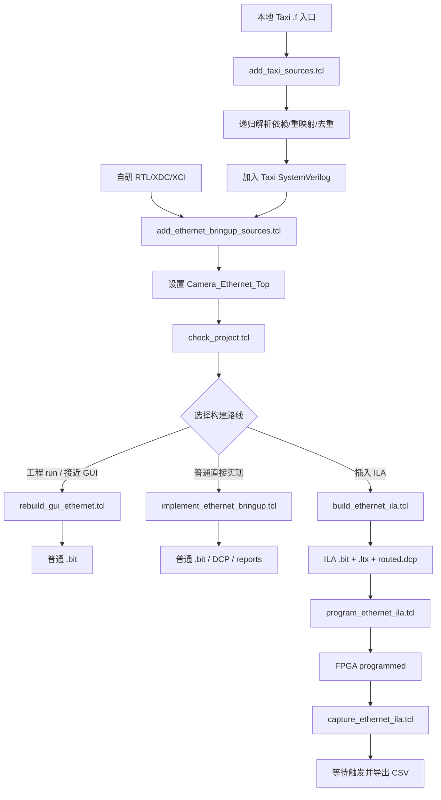
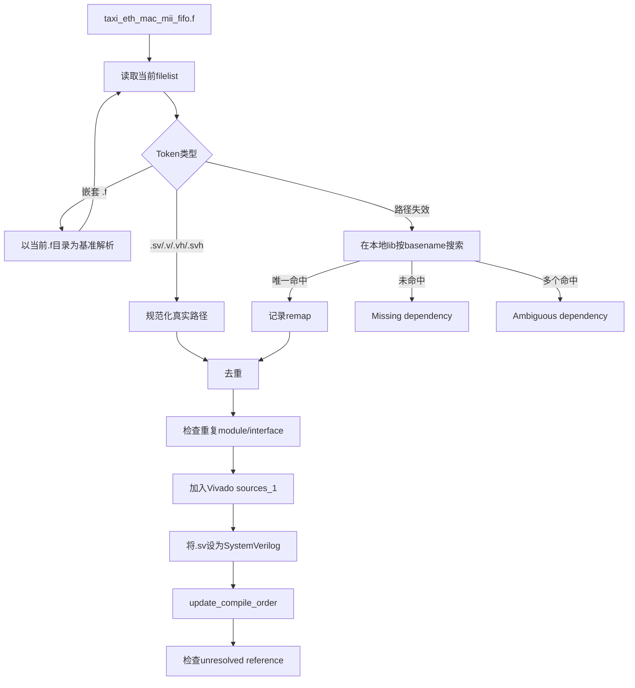
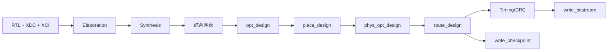
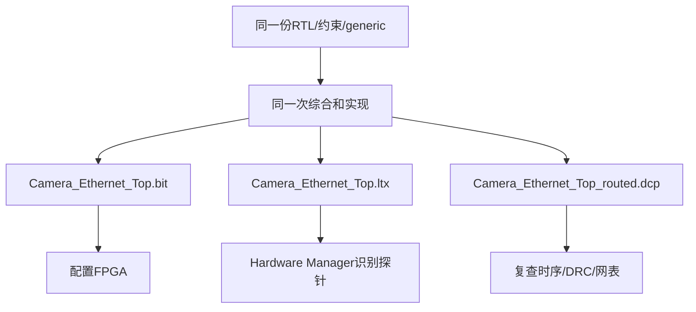
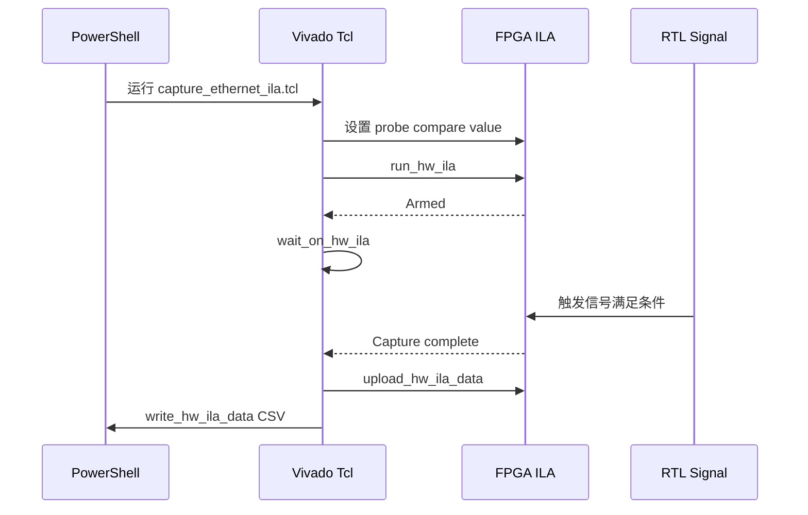
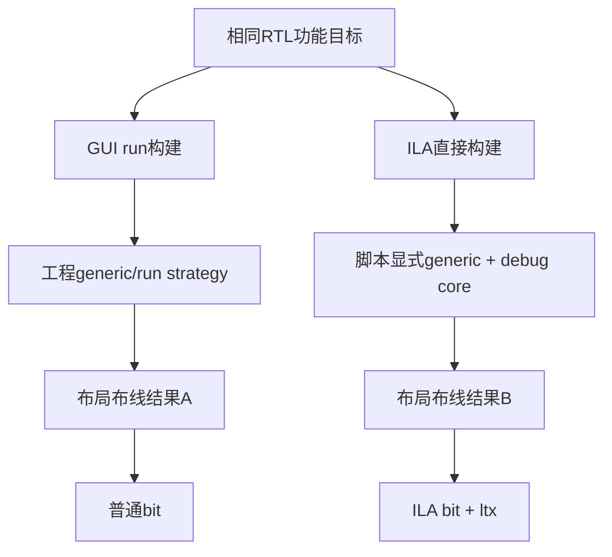

# P12 Vivado Tcl、Bitstream 与 ILA 构建解析

> 适用工程：`D:\prg\prg_cam`  
> 目标器件：`xc7a50ticsg324-1L`  
> 当前顶层：`Camera_Ethernet_Top`  
> 用途：理解并复刻当前工程的“源文件装载 → 综合 → 实现 → `.bit/.ltx` → 烧录 → ILA触发采集”流程。  
> 本文保存 Mermaid 源码和 Tcl 实例，便于后续转换为 Word、PDF 或培训材料。

---

## 1. 先建立正确认识

Tcl 不是 RTL，也不直接处理 Camera 或 Ethernet 数据。它是 Vivado 的自动化控制语言，用于：

- 打开和配置 Vivado 工程；
- 添加 RTL、XDC 和 XCI；
- 设置器件、顶层和 generics；
- 调用综合、优化、布局、布线和 bitstream 生成；
- 插入 ILA 并连接探针；
- 生成 `.bit`、`.ltx`、`.dcp` 和报告；
- 连接 FPGA、烧录 bitstream；
- 设置 ILA 触发条件并导出波形。

可以用一句话区分 Tcl 和 RTL：

```text
Tcl 决定“Vivado 如何构建电路”；
RTL 决定“构建出来的电路执行什么功能”。
```

ILA也不是Ethernet功能依赖。ILA只增加内部可观察性，但它会占用资源并改变布局布线，因此ILA版和普通版可能得到不同的物理实现结果。

---

## 2. 当前工程中的三条 Tcl 路线

### 2.1 总流程图



### 2.2 路线A：准备工程

```text
add_taxi_sources.tcl
    ↓
add_ethernet_bringup_sources.tcl
    ↓
check_project.tcl
```

这条路线负责确认：

- Taxi依赖闭包完整；
- 自研源文件已经加入；
- `.sv` 被识别为 SystemVerilog；
- XDC和Clock Wizard XCI已加入；
- 顶层为 `Camera_Ethernet_Top`；
- Camera模式generic已启用；
- 编译顺序不存在 unresolved reference。

### 2.3 路线B：普通构建

```text
rebuild_gui_ethernet.tcl
    ↓
synth_1
    ↓
impl_1
    ↓
write_bitstream
```

该路线调用工程中保存的 `synth_1` 和 `impl_1`，最接近GUI中的：

```text
Generate Bitstream
```

它会继承 `.xpr` 中保存的：

- source set；
- constraint set；
- top；
- generic；
- synthesis strategy；
- implementation strategy；
- run options。

### 2.4 路线C：ILA构建与采集

```text
build_ethernet_ila.tcl
    ↓
ILA版 .bit + .ltx + routed.dcp
    ↓
program_ethernet_ila.tcl
    ↓
capture_ethernet_ila.tcl
```

这条路线在综合后网表中插入ILA，然后重新优化、布局和布线。

---

## 3. 当前关键 Tcl 文件及职责

| 文件 | 主要职责 |
|---|---|
| `scripts/add_taxi_sources.tcl` | 从本地 `.f` 递归解析Taxi依赖、重映射路径、去重和加载SV |
| `scripts/add_ethernet_bringup_sources.tcl` | 加载自研Camera/Ethernet RTL、XDC、Clock Wizard XCI |
| `scripts/check_project.tcl` | 检查top、generic和关键源文件 |
| `scripts/rebuild_gui_ethernet.tcl` | 重置并运行工程的 `synth_1/impl_1` |
| `scripts/implement_ethernet_bringup.tcl` | 直接综合、实现并生成时序/CDC/DRC/资源报告 |
| `scripts/build_ethernet_ila.tcl` | 综合、插入ILA、实现并生成匹配的 `.bit/.ltx` |
| `scripts/program_ethernet_ila.tcl` | 连接FPGA并下载匹配的 `.bit/.ltx` |
| `scripts/capture_ethernet_ila.tcl` | 设置ILA触发、等待触发并导出采样CSV |
| `scripts/report_timing_only.tcl` | 打开ILA routed DCP并重新输出时序报告 |

---

## 4. Tcl最常用的基础语法

### 4.1 变量

```tcl
set project_root "D:/prg/prg_cam"
set top_name Camera_Ethernet_Top

puts "PROJECT_ROOT=$project_root"
puts "TOP=$top_name"
```

- `set name value`：定义变量；
- `$name`：读取变量；
- `puts`：打印信息。

### 4.2 命令替换

```tcl
set script_dir [file dirname [file normalize [info script]]]
```

Tcl先执行最内层命令：

```text
info script
    ↓
file normalize
    ↓
file dirname
    ↓
保存到 script_dir
```

方括号 `[...]` 表示执行命令，不是Verilog位索引。

### 4.3 引号和花括号

```tcl
puts "Current top is $top_name"
set filter {NAME =~ */u_camera_pipeline/*}
```

- `"..."`：允许变量和命令展开；
- `{...}`：通常保持内容原样，适合表达式、过滤器和总线名称模板。

### 4.4 列表

```tcl
set rtl_files [list \
    Camera_Capture.v \
    Line_Buffer.v \
    Byte_FIFO.v \
    Camera_Ethernet_Top.sv \
]

foreach rtl_file $rtl_files {
    puts "RTL=$rtl_file"
}
```

常用列表命令：

```tcl
llength $rtl_files
lindex $rtl_files 0
lappend rtl_files Ethernet_Frame_Adapter.sv
lsort -unique $rtl_files
```

### 4.5 条件与主动失败

```tcl
if {![file exists $xpr_file]} {
    error "Project file not found: $xpr_file"
}
```

构建脚本应当在以下情况主动 `error`：

- 工程不存在；
- 源文件缺失；
- Taxi依赖缺失；
- 顶层错误；
- generic错误；
- ILA网络没有精确命中；
- FPGA器件没有找到；
- timing或严重DRC未通过。

### 4.6 Windows路径

推荐：

```tcl
set project_root [file normalize [file join $script_dir ".."]]
set xpr_file [file join $project_root "prg_cam.xpr"]
```

不推荐在大量代码中直接写：

```tcl
set xpr_file "D:\prg\prg_cam\prg_cam.xpr"
```

反斜杠可能被解释为转义符。优先使用：

- `file normalize`
- `file join`
- 正斜杠路径

### 4.7 总线名称

下面的写法有风险：

```tcl
get_nets data[0]
```

Tcl可能把 `[0]` 当作待执行命令。安全写法：

```tcl
set bit_name [format {%s[%d]} data 0]
set bit_net [get_nets -hier $bit_name]
```

---

## 5. Vivado Tcl对象模型

Vivado Tcl不是简单地操作字符串，而是在查询和修改工程对象。

| 对象 | 获取命令 |
|---|---|
| 工程 | `get_projects`、`current_project` |
| 文件集 | `get_filesets` |
| 文件 | `get_files` |
| IP | `get_ips` |
| 构建run | `get_runs` |
| 网表单元 | `get_cells` |
| 综合后网络 | `get_nets` |
| 单元引脚 | `get_pins` |
| 顶层端口 | `get_ports` |
| Debug core | `get_debug_cores` |
| 硬件目标 | `get_hw_targets` |
| FPGA器件 | `get_hw_devices` |
| 板上ILA | `get_hw_ilas` |
| ILA探针 | `get_hw_probes` |

读取和设置属性：

```tcl
set_property top Camera_Ethernet_Top [get_filesets sources_1]
set current_top [get_property top [get_filesets sources_1]]
puts "CURRENT_TOP=$current_top"
```

### 5.1 常用查询选项

```tcl
get_nets -quiet -hier -filter {NAME =~ */frame_valid*}
```

- `-quiet`：没有匹配时不立即输出大量警告；
- `-hier`：递归搜索层次；
- `-filter`：按对象属性过滤；
- `-of_objects`：获取某对象关联的其他对象。

用了 `-quiet` 后，必须检查数量：

```tcl
set matches [get_nets -quiet -hier -filter {NAME =~ */frame_valid*}]

if {[llength $matches] != 1} {
    error "Expected one frame_valid net, got [llength $matches]: $matches"
}
```

---

## 6. Taxi `.f` 依赖装载机制

当前首选入口：

```text
prg_cam.srcs/sources_1/lib/taxi-master/eth/rtl/
taxi_eth_mac_mii_fifo.f
```

`add_taxi_sources.tcl` 的处理流程：



原则：

- 相对路径以当前 `.f` 所在目录为基准；
- 只加载入口闭包，不递归加载整个Taxi目录；
- 只在本地 `lib` 中搜索；
- 缺失依赖时，在修改工程前停止；
- 不为了适配当前目录批量修改Taxi上游 `.f`。

---

## 7. 当前工程必须明确定义的项目配置

### 7.1 器件

```tcl
set part_name xc7a50ticsg324-1L
```

查询当前工程器件：

```tcl
get_property PART [current_project]
```

### 7.2 顶层

```tcl
set_property top Camera_Ethernet_Top [get_filesets sources_1]
```

查询：

```tcl
get_property top [get_filesets sources_1]
```

### 7.3 顶层generics

ILA构建明确使用：

```tcl
set generics [list \
    USE_CAMERA_PIPELINE=1 \
    USE_BYTE_FIFO_PATH=1 \
    CAMERA_LINES_PER_FRAME=480 \
]
```

含义：

| Generic | 意义 |
|---|---|
| `USE_CAMERA_PIPELINE=1` | 使用真实Camera Pipeline路径 |
| `USE_BYTE_FIFO_PATH=1` | 使用Byte FIFO作为Ethernet包输入 |
| `CAMERA_LINES_PER_FRAME=480` | 每张图像期望480行 |

查询工程文件集中的值：

```tcl
get_property generic [get_filesets sources_1]
```

注意：ILA构建脚本显式向 `synth_design` 传递这些generics；部分普通构建流程依赖 `.xpr` 中保存的generic属性。调查GUI bit与ILA bit差异时，应首先比较这里。

### 7.4 源文件集

```tcl
get_files -compile_order sources -used_in synthesis
```

需要确认：

- 当前顶层；
- Camera Pipeline源；
- Ethernet Frame Adapter；
- Taxi flat wrapper；
- Taxi递归依赖；
- MII/RMII bridge；
- `rmii_phy_if.v`；
- Clock Wizard XCI。

### 7.5 SystemVerilog类型

```tcl
set_property file_type SystemVerilog [get_files $sv_file]
```

Taxi使用SystemVerilog `interface`。如果 `.sv` 被错误识别为普通Verilog，可能出现interface或语法错误。

### 7.6 Clock Wizard

当前IP：

```text
prg_cam.srcs/sources_1/ip/ethernet_clk_wiz/ethernet_clk_wiz.xci
```

生成IP输出：

```tcl
generate_target all [get_ips ethernet_clk_wiz]
```

### 7.7 XDC

XDC至少定义：

- 100 MHz板载输入时钟；
- Camera GPIO、PCLK、HREF；
- Ethernet RMII端口；
- `ETH_REFCLK`；
- `ETH_RSTN`；
- SW15；
- `PACKAGE_PIN`；
- `IOSTANDARD`；
- 时钟关系和必要的CDC例外；
- 外部输入/输出时序约束。

XDC使用Tcl语法，但只应放约束命令，例如：

```tcl
set_property PACKAGE_PIN D5 [get_ports ETH_REFCLK]
set_property IOSTANDARD LVCMOS33 [get_ports ETH_REFCLK]
```

不要在XDC中放：

```tcl
open_project
synth_design
place_design
program_hw_devices
```

---

## 8. 综合、实现和bitstream分别做什么



| 阶段 | 主要作用 |
|---|---|
| Elaboration | 展开模块层次、参数、generate和接口连接 |
| Synthesis | 把RTL转换成LUT、FF、BRAM、MMCM等逻辑网表 |
| `opt_design` | 优化综合网表 |
| `place_design` | 把逻辑单元放到FPGA具体位置 |
| `phys_opt_design` | 基于物理位置进一步优化 |
| `route_design` | 连接器件内部布线 |
| Timing/DRC | 检查时序和设计规则 |
| `write_bitstream` | 生成FPGA配置数据 |

普通bit与ILA bit可使用同一RTL，但ILA会增加逻辑和布线，因此两次实现不是同一物理设计。

---

## 9. `.bit`、`.ltx`、`.dcp`、`.xpr`、`.xci`、`.xdc`

| 文件 | 作用 |
|---|---|
| `.xpr` | Vivado工程配置和run定义 |
| `.xci` | Xilinx IP配置，例如Clock Wizard |
| `.xdc` | 引脚、时钟、I/O和时序约束 |
| `.dcp` | 某一阶段的设计检查点，可重新打开并生成报告 |
| `.bit` | 下载到FPGA的配置数据 |
| `.ltx` | ILA探针名称、位宽及其与bitstream内部debug网络的映射 |

匹配原则：



禁止混用不同实现的 `.bit` 和 `.ltx`。

---

## 10. ILA创建和探针连接

### 10.1 安全查找一根网络

当前ILA脚本采用“必须精确命中一根网络”的方法：

```tcl
proc exact_net {name} {
    set matches [get_nets -quiet -hier $name]

    if {[llength $matches] != 1} {
        error "Expected exactly one net for '$name', got [llength $matches]: $matches"
    }

    return [lindex $matches 0]
}
```

这可以防止：

- 信号被优化后，探针静默连接失败；
- 模块复制后，名称命中多根网络；
- 层次变更后，连接到错误实例。

### 10.2 创建ILA

```tcl
create_debug_core u_ila_ethernet ila
set_property C_DATA_DEPTH 4096 [get_debug_cores u_ila_ethernet]
set_property C_NUM_OF_PROBES 3 [get_debug_cores u_ila_ethernet]

connect_debug_port \
    u_ila_ethernet/clk \
    [exact_net logic_clk]
```

### 10.3 连接探针

```tcl
create_debug_port u_ila_ethernet probe
set_property port_width 1 [get_debug_ports u_ila_ethernet/probe0]
set_property PROBE_TYPE DATA_AND_TRIGGER [get_debug_ports u_ila_ethernet/probe0]

connect_debug_port \
    u_ila_ethernet/probe0 \
    [exact_net frame_valid]
```

一个简化的三探针例子：

```tcl
connect_debug_port u_ila_ethernet/probe0 [exact_net frame_valid]
connect_debug_port u_ila_ethernet/probe1 [exact_net frame_ready]
connect_debug_port u_ila_ethernet/probe2 [exact_net frame_last]
```

### 10.4 添加新探针

假设要增加8-bit的 `cam1_byte_count_dbg`：

1. 综合后查询真实名称：

```tcl
set candidates [get_nets -quiet -hier \
    -filter {NAME =~ */cam1_byte_count*}]

puts "COUNT=[llength $candidates]"
puts "MATCHES=$candidates"
```

2. 如果不是唯一命中，继续收窄层次名。

3. 将ILA探针数量加一：

```tcl
set_property C_NUM_OF_PROBES 61 [get_debug_cores u_ila_ethernet]
```

4. 设置位宽并连接8个bit。

5. 重新执行完整ILA构建。

6. 重新烧录同一构建产生的 `.bit/.ltx`。

仅修改 `.ltx` 或只重新打开Hardware Manager不会让新探针进入FPGA。

---

## 11. ILA采样时钟和跨时钟域

一个ILA只有一个采样时钟。当前主ILA使用：

```text
logic_clk = 100 MHz
```

因此：

- `packet_*`、`frame_*` 和 Camera Pipeline 的100 MHz状态适合由此ILA观察；
- RMII 50 MHz信号可作为数据被100 MHz ILA过采样观察；
- MII 25 MHz信号也可以过采样观察；
- 但跨域信号的精确单拍关系仍应在各自时钟域中判断。

如果需要严格观察25 MHz MII状态机或50 MHz RMII状态机，推荐分别创建使用对应时钟的ILA，而不是把所有跨域信号都解释成100 MHz同步逻辑。

---

## 12. ILA触发机制

### 12.1 触发流程



### 12.2 为什么停在 `wait_on_hw_ila`

如果看到：

```text
The ILA core ... trigger was armed
wait_on_hw_ila $ila
```

含义是：

```text
FPGA已配置
→ ILA已启动
→ 当前正在等触发条件
→ 触发事件尚未发生
```

这通常不是：

- 烧录失败；
- Vivado崩溃；
- Ethernet停止；
- PowerShell命令无效。

如果触发条件是 `camera_length_error_pulse_dbg == 1`，而当前没有发生长度错误，脚本就会一直等待。

### 12.3 通过环境变量选择触发

```powershell
$env:ILA_TRIGGER_NAME = 'frame_handshake'
$env:ILA_TRIGGER_POSITION = '512'
```

Tcl读取：

```tcl
if {[info exists ::env(ILA_TRIGGER_NAME)]} {
    set trigger_name $::env(ILA_TRIGGER_NAME)
} else {
    set trigger_name camera_length_error_pulse_dbg
}
```

建议触发：

| 目的 | 触发信号 |
|---|---|
| 证明Frame Adapter到Taxi有活动 | `frame_handshake` |
| 观察Camera字节进入Pipeline | `camera_capture_byte_valid_dbg` |
| 抓取长度错误判定瞬间 | `camera_length_error_pulse_dbg` |
| 观察RMII开始发送 | `rmii_tx_en_dbg` |

---

## 13. 当前项目的推荐构建命令

先进入工程根目录：

```powershell
cd D:\prg\prg_cam
$vivado = 'D:\Xilinx_Vivado\2025.2.1\Vivado\bin\vivado.bat'
```

### 13.1 加载Taxi依赖

```powershell
& $vivado -mode batch `
  -source .\scripts\add_taxi_sources.tcl `
  -log .\build\add_taxi_sources.log `
  -journal .\build\add_taxi_sources.jou
```

### 13.2 加载自研Ethernet源

```powershell
& $vivado -mode batch `
  -source .\scripts\add_ethernet_bringup_sources.tcl `
  -log .\build\add_ethernet_sources.log `
  -journal .\build\add_ethernet_sources.jou
```

### 13.3 检查工程

```powershell
& $vivado -mode batch `
  -source .\scripts\check_project.tcl `
  -log .\build\check_project.log `
  -journal .\build\check_project.jou
```

### 13.4 构建ILA版本

```powershell
& $vivado -mode batch `
  -source .\scripts\build_ethernet_ila.tcl `
  -log .\build\build_ethernet_ila.log `
  -journal .\build\build_ethernet_ila.jou
```

### 13.5 重新输出ILA版本时序报告

```powershell
& $vivado -mode batch `
  -source .\scripts\report_timing_only.tcl `
  -log .\build\report_timing_only.log `
  -journal .\build\report_timing_only.jou
```

### 13.6 烧录ILA版本

```powershell
& $vivado -mode batch `
  -source .\scripts\program_ethernet_ila.tcl `
  -log .\build\program_ethernet_ila.log `
  -journal .\build\program_ethernet_ila.jou
```

### 13.7 触发并导出波形

```powershell
$env:ILA_TRIGGER_NAME = 'frame_handshake'
$env:ILA_TRIGGER_POSITION = '512'

& $vivado -mode batch `
  -source .\scripts\capture_ethernet_ila.tcl `
  -log .\build\capture_frame_handshake.log `
  -journal .\build\capture_frame_handshake.jou
```

---

## 14. GUI构建与ILA构建的差异

### 14.1 GUI/run模式

```tcl
reset_run synth_1
launch_runs synth_1
wait_on_run synth_1

reset_run impl_1
launch_runs impl_1 -to_step write_bitstream
wait_on_run impl_1
```

使用工程中保存的：

- source set；
- constraint set；
- generic；
- run strategy；
- synthesis和implementation options。

### 14.2 ILA直接构建

```tcl
synth_design \
    -top Camera_Ethernet_Top \
    -part xc7a50ticsg324-1L \
    -generic {
        USE_CAMERA_PIPELINE=1
        USE_BYTE_FIFO_PATH=1
        CAMERA_LINES_PER_FRAME=480
    }

opt_design
place_design
phys_opt_design
route_design
```

中间还会插入ILA。

### 14.3 为什么逻辑相同但结果可能不同



可能差异：

- generic来源不同；
- source/constraint快照不同；
- ILA增加逻辑和扇出；
- run strategy不同；
- placement和routing不同；
- 时序裕量不同；
- 生成时间和输出位置不同。

ILA不是Ethernet发送的必要条件。如果只有ILA版工作，优先检查：

1. top；
2. generic；
3. source set；
4. constraint set；
5. Clock Wizard输出；
6. reset释放；
7. RMII外部时序；
8. 普通bit和ILA bit是否由同一源码快照生成。

---

## 15. 快速定位Tcl定义

### 15.1 找器件、顶层和generic

```powershell
rg -n "synth_design|set_property top|-generic|-part" scripts -g '*.tcl'
```

### 15.2 找bit、ltx和DCP输出

```powershell
rg -n "write_bitstream|write_debug_probes|write_checkpoint" scripts -g '*.tcl'
```

### 15.3 找ILA创建和探针

```powershell
rg -n "create_debug_core|connect_debug_port|connect_probe|C_DATA_DEPTH" scripts -g '*.tcl'
```

### 15.4 找ILA等待位置

```powershell
rg -n "run_hw_ila|wait_on_hw_ila|upload_hw_ila_data" scripts -g '*.tcl'
```

### 15.5 找烧录过程

```powershell
rg -n "open_hw|connect_hw_server|PROGRAM.FILE|PROBES.FILE|program_hw_devices" scripts -g '*.tcl'
```

### 15.6 找源文件装载过程

```powershell
rg -n "add_files|read_verilog|read_xdc|generate_target|update_compile_order" scripts -g '*.tcl'
```

---

## 16. Vivado Tcl Console速查

打开工程后，可以在GUI下方Tcl Console执行：

### 工程身份

```tcl
current_project
get_property PART [current_project]
get_property top [get_filesets sources_1]
get_property generic [get_filesets sources_1]
```

### 当前源文件

```tcl
get_files -compile_order sources -used_in synthesis
get_files -of_objects [get_filesets constrs_1]
get_ips
```

### 构建run

```tcl
get_runs
get_property STATUS [get_runs synth_1]
get_property STATUS [get_runs impl_1]
get_property PROGRESS [get_runs impl_1]
```

### 顶层端口

```tcl
get_ports
get_ports ETH_*
get_ports CAM*
get_ports SW15
```

### 综合后网络

综合或打开DCP后：

```tcl
get_nets -hier -filter {NAME =~ */frame_valid*}
get_nets -hier -filter {NAME =~ */camera*byte_count*}
get_pins -hier -filter {NAME =~ */sync_reg_reg*/PRE}
```

### ILA

```tcl
get_debug_cores
get_debug_ports
get_hw_ilas
get_hw_probes
```

---

## 17. 按现象快速选择脚本

| 现象 | 优先检查 |
|---|---|
| Taxi缺模块或unresolved reference | `add_taxi_sources.tcl` |
| 自研模块没有进入工程 | `add_ethernet_bringup_sources.tcl` |
| 构建的不是Camera模式 | `check_project.tcl` 和 `generic` |
| GUI bit与ILA bit不同 | `rebuild_gui_ethernet.tcl` 对比 `build_ethernet_ila.tcl` |
| 新ILA探针找不到 | `exact_net`、`exact_bus`、综合后 `get_nets` |
| 烧录时找不到FPGA | `get_hw_targets`、`get_hw_devices` |
| 停在 `wait_on_hw_ila` | 触发条件尚未出现 |
| bit能烧但Hardware Manager无探针 | `.bit/.ltx`不匹配或烧录了普通bit |
| 修改probe后仍看到旧探针 | 未重新构建或未重新烧录匹配bit/ltx |
| Timing失败 | `implement_ethernet_bringup.tcl`、`report_timing_only.tcl` |
| `get_nets`匹配多项 | 网络名称或层次过滤条件过宽 |

---

## 18. 可复用的普通构建Tcl模板

> 下面是培训和新构建脚本的基础模板。正式使用前必须核对当前工程实际路径、generic和输出文件名。

```tcl
# ============================================================
# 1. 定位工程
# ============================================================
set script_dir [file dirname [file normalize [info script]]]
set project_root [file normalize [file join $script_dir ".."]]
set xpr_file [file join $project_root "prg_cam.xpr"]
set output_dir [file join $project_root "build" "manual_build"]

# ============================================================
# 2. 唯一配置
# ============================================================
set part_name "xc7a50ticsg324-1L"
set top_name "Camera_Ethernet_Top"
set generics [list \
    USE_CAMERA_PIPELINE=1 \
    USE_BYTE_FIFO_PATH=1 \
    CAMERA_LINES_PER_FRAME=480 \
]

# ============================================================
# 3. 输入检查
# ============================================================
if {![file exists $xpr_file]} {
    error "Missing Vivado project: $xpr_file"
}

file mkdir $output_dir

# ============================================================
# 4. 打开工程并设置顶层
# ============================================================
open_project $xpr_file
set_property top $top_name [get_filesets sources_1]
update_compile_order -fileset sources_1

puts "PROJECT=[current_project]"
puts "PART=[get_property PART [current_project]]"
puts "TOP=[get_property top [get_filesets sources_1]]"
puts "PROJECT_GENERIC=[get_property generic [get_filesets sources_1]]"
puts "BUILD_GENERIC=$generics"

# ============================================================
# 5. 生成IP
# ============================================================
set clk_ip [get_ips -quiet ethernet_clk_wiz]
if {[llength $clk_ip] != 1} {
    error "Expected one ethernet_clk_wiz IP, got [llength $clk_ip]"
}
generate_target all $clk_ip

# ============================================================
# 6. 综合
# ============================================================
synth_design \
    -top $top_name \
    -part $part_name \
    -generic $generics

# ============================================================
# 7. 实现
# ============================================================
opt_design
place_design
phys_opt_design
route_design

# ============================================================
# 8. 报告
# ============================================================
report_timing_summary \
    -delay_type min_max \
    -report_unconstrained \
    -check_timing_verbose \
    -file [file join $output_dir "timing_summary.rpt"]

report_drc \
    -file [file join $output_dir "drc.rpt"]

report_utilization \
    -file [file join $output_dir "utilization.rpt"]

# ============================================================
# 9. 产物
# ============================================================
write_checkpoint -force \
    [file join $output_dir "Camera_Ethernet_Top_routed.dcp"]

write_bitstream -force \
    [file join $output_dir "Camera_Ethernet_Top.bit"]

puts "BUILD PASS: $output_dir"
close_project
```

原则：

1. 配置项集中在顶部；
2. 显式定义part、top和generic；
3. 使用绝对规范化路径；
4. 所有关键对象检查数量；
5. 失败时使用 `error`；
6. 报告、DCP和bit放在同一构建目录；
7. 不在一个脚本里混合 `launch_runs` 和直接 `synth_design`。

---

## 19. 可复用的ILA插入模板

```tcl
proc require_one {description objects} {
    if {[llength $objects] != 1} {
        error "Expected one $description, got [llength $objects]: $objects"
    }
    return [lindex $objects 0]
}

set ila_name u_ila_training
set ila_clock [require_one \
    "ILA sample clock" \
    [get_nets -quiet -hier logic_clk]]

set frame_valid_net [require_one \
    "frame_valid net" \
    [get_nets -quiet -hier -filter {NAME =~ */frame_valid*}]]

set frame_ready_net [require_one \
    "frame_ready net" \
    [get_nets -quiet -hier -filter {NAME =~ */frame_ready*}]]

set frame_last_net [require_one \
    "frame_last net" \
    [get_nets -quiet -hier -filter {NAME =~ */frame_last*}]]

create_debug_core $ila_name ila
set_property C_DATA_DEPTH 4096 [get_debug_cores $ila_name]
set_property C_NUM_OF_PROBES 3 [get_debug_cores $ila_name]

connect_debug_port ${ila_name}/clk $ila_clock

connect_debug_port ${ila_name}/probe0 $frame_valid_net
connect_debug_port ${ila_name}/probe1 $frame_ready_net
connect_debug_port ${ila_name}/probe2 $frame_last_net

set_property PROBE_TYPE DATA_AND_TRIGGER \
    [get_debug_ports ${ila_name}/probe0]
```

插入ILA后仍需继续：

```tcl
implement_debug_core
opt_design
place_design
phys_opt_design
route_design
write_bitstream
write_debug_probes
```

---

## 20. 可复用的烧录模板

```tcl
set bit_file "D:/prg/prg_cam/build/ethernet_ila/Camera_Ethernet_Top_ila.bit"
set ltx_file "D:/prg/prg_cam/build/ethernet_ila/Camera_Ethernet_Top_ila.ltx"

foreach artifact [list $bit_file $ltx_file] {
    if {![file exists $artifact]} {
        error "Missing programming artifact: $artifact"
    }
}

open_hw_manager
connect_hw_server
open_hw_target

set devices [get_hw_devices -quiet xc7a50t_0]
if {[llength $devices] != 1} {
    error "Expected xc7a50t_0, got [llength $devices]: $devices"
}

set device [lindex $devices 0]

set_property PROGRAM.FILE $bit_file $device
set_property PROBES.FILE $ltx_file $device
set_property FULL_PROBES.FILE $ltx_file $device

program_hw_devices $device
refresh_hw_device $device

puts "PROGRAM PASS"
puts "ILAS=[get_hw_ilas -of_objects $device]"
```

---

## 21. 可复用的ILA触发模板

```tcl
set ila_list [get_hw_ilas -quiet]
if {[llength $ila_list] != 1} {
    error "Expected one hardware ILA, got [llength $ila_list]: $ila_list"
}

set ila [lindex $ila_list 0]

set trigger_probes [get_hw_probes -quiet \
    -of_objects $ila \
    -filter {NAME =~ *frame_handshake*}]

if {[llength $trigger_probes] != 1} {
    error "Expected one frame_handshake probe, got [llength $trigger_probes]"
}

set trigger_probe [lindex $trigger_probes 0]

set_property CONTROL.DATA_DEPTH 4096 $ila
set_property CONTROL.TRIGGER_POSITION 512 $ila
set_property COMPARE_VALUE {eq1'b1} $trigger_probe

run_hw_ila $ila
puts "ILA ARMED"

wait_on_hw_ila $ila
upload_hw_ila_data $ila

set ila_data [current_hw_ila_data]
write_hw_ila_data -csv_file -force \
    "D:/prg/prg_cam/build/ila/frame_handshake.csv" \
    $ila_data

puts "CAPTURE PASS"
```

---

## 22. Tcl脚本调试方法

### 22.1 打印关键状态

```tcl
puts "SCRIPT=[info script]"
puts "PWD=[pwd]"
puts "PROJECT=[current_project]"
puts "TOP=[get_property top [get_filesets sources_1]]"
puts "GENERIC=[get_property generic [get_filesets sources_1]]"
```

### 22.2 打印对象数量

```tcl
set nets [get_nets -quiet -hier -filter {NAME =~ */frame_valid*}]
puts "FRAME_VALID_MATCH_COUNT=[llength $nets]"
puts "FRAME_VALID_MATCHES=$nets"
```

### 22.3 捕获错误并补充上下文

```tcl
if {[catch {
    synth_design -top $top_name -part $part_name
} err]} {
    puts "SYNTHESIS FAILED"
    puts "ERROR=$err"
    error $err
}
```

### 22.4 不要吞掉失败

不推荐：

```tcl
catch {route_design}
puts "BUILD PASS"
```

如果 `route_design` 失败，这种写法仍可能打印PASS。

推荐：

```tcl
if {[catch {route_design} err]} {
    error "route_design failed: $err"
}
```

---

## 23. 通过报告建立PASS/FAIL

数字实现PASS不等于硬件Ethernet PASS。

### 23.1 数字实现

至少检查：

- synthesis无error；
- implementation无error；
- WNS ≥ 0；
- WHS ≥ 0；
- DRC无Critical/Error；
- CDC危险项有解释或修复；
- Ethernet顶层端口全部约束。

### 23.2 ILA

至少检查：

- `.bit/.ltx`来自同一次实现；
- Hardware Manager识别到预期ILA数量；
- probe数量和名称正确；
- 触发时钟持续工作；
- 触发条件确实可能出现。

### 23.3 硬件Ethernet

还需要独立确认：

- PHY reset正常释放；
- 50 MHz `ETH_REFCLK`存在；
- LINK和100M状态正常；
- `ETH_TXEN/TXD`有活动；
- Wireshark能看到 `0x88B5`；
- payload格式、序号和Camera字段正确；
- `tx_error_underflow=0`；
- `tx_fifo_overflow=0`。

不能把以下结论混写：

```text
route PASS ≠ Wireshark PASS
tx_fifo_good_frame ≠ 已经成功发送到网线
LAST_ROW出现 ≠ 已经收齐480行
ILA存在 ≠ Ethernet功能依赖ILA
```

---

## 24. 当前项目的构建一致性检查表

每次正式构建前记录：

| 项目 | 应记录内容 |
|---|---|
| Vivado版本 | 2025.2.1 |
| Project | `D:\prg\prg_cam\prg_cam.xpr` |
| Part | `xc7a50ticsg324-1L` |
| Top | `Camera_Ethernet_Top` |
| Generic | Camera/Byte FIFO/480行配置 |
| Source set | `sources_1`的compile order |
| Constraint set | 实际生效XDC列表 |
| Clock IP | `ethernet_clk_wiz.xci`及生成状态 |
| Taxi manifest | `.f`闭包、remap和missing=0 |
| 构建模式 | GUI run / direct Tcl / ILA |
| Bit路径 | 绝对路径 |
| LTX路径 | 若有，绝对路径 |
| DCP路径 | routed DCP |
| 源码hash | Git commit或SHA-256 manifest |
| WNS/WHS | 实际报告数值 |
| DRC | Error/Critical/Warning数量 |
| 生成时间 | bit、ltx、dcp时间戳 |

---

## 25. 为Cam1扩展时Tcl需要同步检查的地方

Cam1接入本身应在RTL和XDC中实现，但Tcl构建侧至少检查：

1. Cam1端口对应XDC已经加入当前constraint set；
2. Cam1 RTL信号进入 `Camera_Ethernet_Top`；
3. `Camera_Pipeline` 或顶层generic没有仍然关闭Cam1；
4. 编译顺序包含修改后的Camera模块；
5. ILA脚本中的Cam1网络名称仍唯一；
6. ILA探针数量和位宽正确；
7. `.bit/.ltx`重新成对生成；
8. 普通构建和ILA构建使用同一Camera generic；
9. 两路Camera同时打开后重新检查WNS、WHS、CDC和资源；
10. 不把新增Cam1探针误认为Cam1功能已经打通。

---

## 26. 推荐学习顺序

### 第一步：只在Vivado Tcl Console中查询

```tcl
current_project
get_property PART [current_project]
get_property top [get_filesets sources_1]
get_property generic [get_filesets sources_1]
get_files -compile_order sources -used_in synthesis
```

先学习查询，不修改工程。

### 第二步：阅读工程检查脚本

顺序：

```text
check_project.tcl
→ add_ethernet_bringup_sources.tcl
→ add_taxi_sources.tcl
```

### 第三步：理解普通构建

```text
rebuild_gui_ethernet.tcl
→ implement_ethernet_bringup.tcl
```

重点理解：

- project run模式；
- direct `synth_design`模式；
- 报告生成；
- PASS/FAIL gate。

### 第四步：理解ILA

```text
build_ethernet_ila.tcl
→ program_ethernet_ila.tcl
→ capture_ethernet_ila.tcl
```

重点理解：

- 网表网络名称；
- 采样时钟；
- probe位宽；
- `.bit/.ltx`绑定；
- arm、wait、upload和CSV导出。

### 第五步：做一次可控的小修改

推荐仅增加一个ILA探针：

1. 查询综合网表名称；
2. 修改 `C_NUM_OF_PROBES`；
3. 连接probe；
4. 构建；
5. 检查bit/ltx时间戳；
6. 烧录；
7. Hardware Manager确认新probe；
8. 触发并导出CSV。

这是一条风险低、能覆盖主要Tcl概念的训练路径。

---

## 27. 最终速查

```text
缺模块
→ add_taxi_sources / add_ethernet_bringup_sources

构建模式错误
→ top / generic / sources_1 / constrs_1

GUI bit和ILA bit行为不同
→ 对比构建参数、源码快照、XDC、run策略和时序

找不到ILA probe
→ 综合后get_nets，检查层次名和MARK_DEBUG

没有ILA
→ 检查烧录的bit是否为ILA版、ltx是否匹配

停在wait_on_hw_ila
→ ILA已armed，但触发条件尚未发生

ILA内部正确但PC无帧
→ 检查MII/RMII、REFCLK、TXEN/TXD、PHY和外部时序

普通bit不工作
→ 不要把ILA当功能依赖；核对generic和构建一致性
```

---

## 28. 状态边界

本文可以确认的是当前Tcl脚本的职责、调用顺序和构建机制。

以下事项仍需通过实际构建或上板证据确认：

- 下一次普通GUI bit与ILA bit是否使用完全相同的源码和XDC快照；
- 普通构建文件集中的generic是否始终与ILA脚本显式generic一致；
- RMII外部输入/输出时序是否已经完成最终sign-off；
- 新Cam1端口加入后，综合层次和ILA网络名称是否保持稳定；
- 当前板上运行的 `.bit/.ltx` 是否确实来自最新一次实现；
- Camera到PC完整图像链是否达到最终硬件验收标准。

