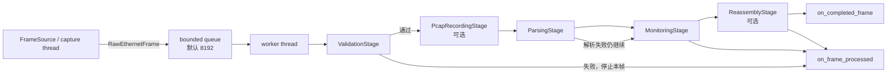

# TAXI Receiver 架构说明

## 1. 文档范围与结论

本仓库中的 `taxi_receiver` 是运行在主机上的 Python Ethernet 接收原型。它把接收过程划分为 5 个逻辑层（Stage 1～5），但代码中的 `stages` 列表只包含 Stage 2～5；Stage 1 是数据源，不是逐帧处理节点。

当前已经实现的主路径是：

```text
Ethernet PHY/NIC
  -> 操作系统 NIC 驱动
  -> Npcap/libpcap + Scapy
  -> RawEthernetFrame
  -> 有界队列
  -> Ethernet 校验
  -> TAXI 包解析
  -> 流监控
  -> 可选的行/帧重组
```

仓库中**没有** RMII/SMII 接收 RTL、Ethernet MAC、DMA 或相应设备驱动。因此，“直接采样 RMII/SMII 引脚并还原 Ethernet 帧”不是当前 Python 模块的一部分。正式系统应由 PHY、MAC 和驱动先完成物理接口采样、字节拼装及 Ethernet 成帧，Python 从完整的二层帧开始工作。

## 2. 模块职责

| 逻辑层 | 实现模块 | 输入 | 输出/副作用 |
| --- | --- | --- | --- |
| Stage 1：Capture | `capture.py` | NIC、PCAP 或测试帧 | `RawEthernetFrame` |
| Stage 2：Validation | `eth_validate.py`、`ValidationStage` | `RawEthernetFrame` | `ValidationResult`，可终止本帧 |
| Stage 3：Parsing | `packet_format.py`、`camera_parser.py`、`ParsingStage` | Ethernet payload | `FixedModeResult` 或 `CameraModeResult` |
| Stage 4：Monitoring | `stream_monitor.py`、`MonitoringStage` | Stage 2/3 的结果 | 全局及逐相机统计、周期报告 |
| Stage 5：Reassembly | `reassembler.py`、`ReassemblyStage` | CRC 正确的 camera row | `CompletedFrame` 或 `None` |
| 调度器 | `pipeline.py` | `FrameSource` + `list[Stage]` | 队列、worker、回调及关闭流程 |
| 可选记录 | `recorder.py`、`PcapRecordingStage` | 原始帧或错误 payload | PCAP、`.bin` 文件 |

这里需要区分三个容易混淆的概念：

- `stages.py` 是**适配与编排定义**：它定义统一的 `Stage.process(ctx) -> bool` 约定，并把各 submodule 的函数/对象包装成 Stage。
- `self.stages` 是 `TaxiReceiverPipeline` 持有的**有序对象列表**，不是一个名为 stages 的并行处理器，也不会自动扫描或加载所有 Python submodule。
- `pipeline.py` 是**运行时调度器**：它负责 capture/queue/worker/lifecycle，但不重新实现校验、解析、统计或重组算法。所谓“合并 5 个 stages”，实际是把 Stage 2～5 的对象组合到同一个顺序调用链；Stage 1 仍由 `FrameSource` 在链外提供输入。

## 3. Pipeline 总体架构



### 3.1 两个执行上下文

Pipeline 用一个生产者/消费者结构隔离抓包与解析：

1. `TaxiReceiverPipeline.start()` 先启动后台 `taxi-worker`，再调用 `frame_source.start(self._on_frame)`。
2. Capture 回调所在的线程只执行 `_on_frame()`：增加 Ethernet 帧计数，然后用 `put_nowait()` 把帧放入有界队列。
3. 队列已满时不阻塞抓包线程，而是丢弃该帧并增加 `dropped_capture_queue`。这是一种“保持捕获线程活性，允许可观测丢帧”的背压策略。
4. Worker 从队列取帧，构造一个 `FrameContext`，按顺序执行 `self.stages`。
5. 某个 stage 返回 `False` 时，只终止当前帧的 stage chain；worker 本身继续处理后续帧。
6. 未捕获的 stage 异常由 worker 统一计为 `parser_errors`，打印错误后继续运行。

`FrameContext` 是各 stage 之间唯一的逐帧共享对象。它开始时只含 `frame` 和 `mode`，随后由各 stage 依次填入：

```text
validation -> fixed_result/camera_result -> completed_frame
```

如果提前停止，还会设置 `stopped_at` 和 `stop_reason`。在 stage 正常返回（包括返回 `False` 提前截断）的路径上，`on_frame_processed(ctx)` 会在 stage loop 结束后调用，适合链路 bring-up 时观察中间结果；未捕获异常路径是例外，详见 3.4。

### 3.2 Stage chain 的构建与调用

默认由 `build_stage_chain()` 根据 `max_stage` 生成：

| `max_stage` | 实际逐帧 stage list | 逻辑范围 |
| --- | --- | --- |
| `validate` | `validate` | Stage 1～2 |
| `parse` | `validate -> parse` | Stage 1～3 |
| `monitor`（默认） | `validate -> parse -> monitor` | Stage 1～4 |
| `reassemble` | `validate -> parse -> monitor -> reassemble` | Stage 1～5 |

如果配置了 PCAP，`record_pcap` 会插在 `validate` 之后、`parse` 之前。因此只记录通过 Stage 2 的匹配帧。

调用核心没有按层数写分支，实际只有：

```python
ctx = FrameContext(frame=frame, mode=self.mode)
for stage in self.stages:
    if not stage.process(ctx):
        break
```

调用者也可以直接传入 `stages=[...]`。此时 `max_stage` 被绕过，列表对象及顺序完全由调用者负责。需要注意：手工创建的 `ValidationStage`/`MonitoringStage` 必须共享同一个 `StreamMonitor`；它们不会自动改用 `TaxiReceiverPipeline.monitor`。

### 3.3 启停语义

`stop()` 的顺序是：设置 stop event、停止 frame source、最多等待 worker 3 秒、对所有 `ReassemblyStage` 调用 `flush()`、关闭 PCAP writer。Worker 的循环条件是“尚未停止，或队列仍非空”，正常情况下会把队列排空。

需要注意，`join(timeout=3.0)` 超时后代码仍会继续 flush；如果 backlog 在 3 秒内没有排空，worker 与 flush 可能同时访问重组器。正式高负载版本应在此处增加明确的 worker 终止确认，或把 flush 放到 worker 线程尾部。

### 3.4 class/def 的实际调用链

默认 camera/reassemble 配置下，构造阶段的调用关系为：

```text
cli.main()
  -> ScapyLiveCapture(...)
  -> FrameReassembler(...)
  -> TaxiReceiverPipeline.__init__(...)
       -> StreamMonitor(...)
       -> build_stage_chain(...)
            -> ValidationStage(...)
            -> [PcapRecordingStage(...)]        # 仅配置 PCAP 时
            -> ParsingStage(...)
            -> MonitoringStage(...)
            -> ReassemblyStage(...)
```

运行阶段的调用关系为：

```text
TaxiReceiverPipeline.start()
  -> Thread.start()                             # taxi-worker
  -> FrameSource.start(TaxiReceiverPipeline._on_frame)

ScapyLiveCapture callback
  -> RawEthernetFrame(...)
  -> TaxiReceiverPipeline._on_frame(frame)
       -> StreamMonitor.record_ethernet_frame()
       -> queue.put_nowait(frame)

TaxiReceiverPipeline._run_worker()
  -> TaxiReceiverPipeline._process_frame(frame)
       -> FrameContext(frame, mode)
       -> stage.process(ctx)                    # 按 self.stages 顺序循环
  -> StreamMonitor.maybe_report()
```

逐 Stage 的精确委托关系如下。表中的“写入 ctx”表示结果不会作为 `process()` 返回值传给下一层，而是保存在同一个 `FrameContext` 中：

| Stage class / 方法 | 读取 | 调用的 submodule class/def | 写入 ctx / 副作用 | `process()` |
| --- | --- | --- | --- | --- |
| `ValidationStage.process()` | `ctx.frame` | `eth_validate.validate_ethernet_frame()`；`StreamMonitor.record_validation_failure()` / `record_matching_frame()` | `ctx.validation`；失败时填 `stopped_at/stop_reason` | 成功 `True`；失败 `False` |
| `PcapRecordingStage.process()` | `ctx.frame.raw_bytes` | `PcapRecorder.write_raw()` | 写 PCAP | `True` |
| `ParsingStage.process()` | `ctx.frame.payload`、stage 自身的 `mode` | fixed：`camera_parser.parse_fixed_mode()`；camera：`camera_parser.parse_camera_mode()`，后者再调用 `packet_format.parse_camera_row()` 和 `crc16_ccitt_false()`；可选 `ErrorFrameRecorder.save()` | `ctx.fixed_result` 或 `ctx.camera_result`；可选写 `.bin` | 始终 `True` |
| `MonitoringStage.process()` | `ctx.fixed_result/camera_result` | `StreamMonitor.record_fixed_result()` 或 `record_camera_result()`；camera 成功时内部调用 `_update_sequence()` | 更新 `GlobalStatistics/CameraStatistics` | `True` |
| `ReassemblyStage.process()` | `ctx.camera_result` | `RowReassembler.on_row()`，当前真实实现为 `FrameReassembler.on_row()`；完成时调用 `on_completed_frame()` | `ctx.completed_frame` | `True` |

`packet_format.py` 是协议二进制布局的底座，不是独立运行的 Stage：`struct.Struct`、`RowHeader`、`RowTrailer`、`CameraRowPacket`、CRC 和构包函数都由 Stage 3 间接调用。类似地，`reassembler.py` 中的 `RowReassembler` 是 `Protocol`，运行时实际对象可以是 `NullReassembler`、`FrameReassembler` 或用户自定义实现。

还有两个实现细节值得明确：

1. `ParsingStage.process()` 使用的是构造该 Stage 时保存的 `self.mode`，而不是读取 `ctx.mode`。默认 builder 会给二者传入同一个值；手工 stage list 若传入不一致的 mode，`ctx.mode` 只具有描述作用，真正解析路径由 `ParsingStage.mode` 决定。
2. 当 stage 抛出未捕获异常时，异常会越过剩余 stage，由 `_run_worker()` 计入 `parser_errors`；该帧的 `on_frame_processed()` 也不会执行，因为回调位于 `_process_frame()` 的正常路径末尾。

### 3.5 stages 对 submodules 的组合规则

`build_stage_chain()` 只根据 `STAGE_ORDER = ("validate", "parse", "monitor", "reassemble")` 计算深度，然后显式实例化对象。它没有插件发现、依赖注入容器或并行 fan-out；因此顺序本身就是数据依赖：

```text
ValidationStage
  必须先产生 ctx.validation 并过滤非目标帧
ParsingStage
  必须先产生 ctx.fixed_result / ctx.camera_result
MonitoringStage
  消费解析结果，但不修改 packet
ReassemblyStage
  只消费 CRC 正确的 ctx.camera_result.packet
```

手工传入 `stages=[...]` 时，Pipeline 不检查缺失依赖或顺序。例如把 `MonitoringStage` 放在 `ParsingStage` 前面不会报错，但它会因为结果字段均为 `None` 而静默 no-op；缺少 `ValidationStage` 则会绕过 EtherType/MAC/长度粗校验。自定义链应自行保证：

- 所有依赖统计的 stage 共享同一个 `StreamMonitor`。
- `ParsingStage.mode` 与 Pipeline 的业务 mode 一致。
- 会消费 `camera_result` 的 stage 位于 Parsing 之后。
- 会阻塞或执行重计算的业务逻辑不直接占用唯一 worker。

## 4. 每个 Stage 的详细实现

### 4.1 Stage 1：Capture

Stage 1 的统一接口是 `FrameSource`：

```python
start(on_frame: Callable[[RawEthernetFrame], None]) -> None
stop() -> None
```

它向后级交付纯数据对象 `RawEthernetFrame`：源/目的 MAC、EtherType、payload、完整 L2 抓包字节和时间戳。Scapy 对象不会进入 Stage 2，因此 Stage 2～5 不依赖 Scapy、Npcap 或真实网卡。

当前有三种数据源：

- `ScapyLiveCapture`：用 `AsyncSniffer` 对指定网卡实时抓包；BPF 过滤器为 `ether proto 0x88b5`。回调提取 Ethernet 字段并立即转换为 `RawEthernetFrame`。
- `SyntheticFrameSource`：同步投递预构造帧，供单元测试和无硬件验证使用。
- `PcapReplayFrameSource`：读取已有 PCAP，并可按 EtherType 再过滤，供台架抓包回归。

在标准主机网卡路径中，`raw_bytes` 通常从目的 MAC 开始，不包含前导码、SFD 和 IFG；FCS 往往也已被 NIC 校验并剥离。当前代码不应依赖这些字段存在。

### 4.2 Stage 2：Ethernet Validation

`ValidationStage` 调用 `validate_ethernet_frame()`，按以下顺序检查：

1. EtherType 必须为配置值，默认 `0x88B5`。
2. 若配置 `allowed_src_macs`，源 MAC 的小写形式必须在集合中。
3. Ethernet payload 长度必须位于 46～1500 byte。

失败时写入 `ctx.validation`、`ctx.stopped_at="validate"` 和具体原因，并返回 `False`。`not_taxi_ethertype` 不计为 validation failure，其余失败会更新监控统计。通过时增加 `matching_frames` 和 `total_payload_bytes`，然后返回 `True`。

这是唯一会主动截断正常 stage chain 的编号 stage。需要区分两级过滤：实时 Scapy 数据源已经用 BPF 初筛 `0x88B5`；Stage 2 仍保留 EtherType 检查，以支持合成帧、PCAP、自定义数据源及防御性校验。

当前未解析 802.1Q/802.1ad VLAN。带 VLAN tag 的帧在 Scapy 中外层 EtherType 通常不是 `0x88B5`，需要在正式部署前决定禁止 VLAN，或扩展 Capture/Validation 来提取内层 EtherType。

### 4.3 Stage 3：TAXI Payload Parsing

`ParsingStage` 只解析 `RawEthernetFrame.payload`，由 `mode` 选择两条路径。

#### fixed 模式

payload 必须恰好为 128 byte，并逐字节等于 `00 01 ... 7F`。失败结果是 `bad_length` 或 `bad_data`，后者包含第一个不匹配 offset。

#### camera 模式

payload 必须恰好为 128 byte。随后按 little-endian C struct 布局解包，并对 byte 0～125 计算 CRC-16-CCITT-FALSE（poly `0x1021`、init `0xFFFF`），与 byte 126～127 的小端 CRC 比较。

| offset | 长度 | 字段 |
| ---: | ---: | --- |
| 0 | 2 | `sync0` |
| 2 | 2 | `sync1` |
| 4 | 1 | `cam_id` |
| 5 | 2 | `frame_id` |
| 7 | 2 | `row_idx` |
| 9 | 1 | `row_flags`：first/last/overflow/length-error |
| 10 | 1 | `payload_len` |
| 11 | 2 | `row_seq` |
| 13 | 11 | reserved |
| 24 | 80 | row payload |
| 104 | 10 | trailer pad |
| 114 | 4 | `m00` |
| 118 | 2 | `xc_q4` |
| 120 | 2 | `yc_q4` |
| 122 | 2 | `vx_q8`（有符号） |
| 124 | 2 | `vy_q8`（有符号） |
| 126 | 2 | `crc16` |

解析失败不会返回 `False`。错误结果仍然流入 Stage 4，以便统计 bad length、bad payload 或 CRC error；若配置 `ErrorFrameRecorder`，同时把错误 payload 保存为独立 `.bin` 文件。

当前 camera parser 只验证总长和 CRC，**没有验证** `sync0/sync1`、`payload_len == 80`、reserved/pad、flag 合法组合或字段取值范围。这些若属于协议约束，应在正式协议冻结后补充。

### 4.4 Stage 4：Stream Monitoring

`MonitoringStage` 消费 Stage 3 生成的结果，不重新解析字节：

- 全局统计：匹配帧、有效包、长度错误、fixed 数据错误、CRC 错误、parser 异常、capture queue 丢弃和 payload 吞吐。
- 逐相机统计：包数、CRC/length/overflow、first/last row 数量、sequence gap、重复和乱序。
- 每隔 `report_interval` 输出本周期 FPS 和 payload Mb/s；`final_report()` 输出全程平均值。

序列号为 16 bit 并支持回绕。判断规则是：等于上一个序号为 duplicate；等于期望值为正常；相对期望值向前且距离小于 `0x8000` 为 gap；否则为 out-of-order。CRC 错误包会计入相机包数和错误/flag 统计，但不会推进 `last_sequence`。

### 4.5 Stage 5：Frame Reassembly

`ReassemblyStage` 只接收 `camera_result.ok == True` 的包；fixed 模式、长度错误和 CRC 错误都会成为 no-op。

默认 `NullReassembler` 什么也不做。显式使用 `FrameReassembler` 后，它以 `(cam_id, frame_id)` 为 key 保存 `row_idx -> 80-byte payload`：

- 即使丢失 first-row，也会在首次看到未知 key 时隐式创建 frame。
- 相同 `row_idx` 再次到达时覆盖旧内容。
- 任一 row 带 overflow flag，则最终 `CompletedFrame.had_overflow=True`。
- 收到 last-row 时关闭该 frame；`missing_rows` 按 `0..max(row_idx)` 计算。
- `CompletedFrame.to_bytes(expected_rows)` 按 row index 拼接，并用零填充缺失行。
- 停机时 `flush()` 强制关闭所有尚未完成的 frame。

若产生 `CompletedFrame`，stage 会写入 `ctx.completed_frame` 并调用 `on_completed_frame`。当前模块只完成内存重组，不做图像解码、落盘、显示或下游算法处理。

`max_open_frames_per_camera` 默认限制为 4，但当前 `_evict_if_needed()` 会直接删除最老的未完成 frame，并不会产生 `CompletedFrame` 或通知回调；这一点与模块注释中“evicted and reported”的描述不一致。正式版本应增加 eviction/drop 指标或回调，避免静默丢帧。

## 5. 正式接入 Ethernet 后的数据路径

### 5.1 推荐路径：外部 PHY + 标准 MAC/NIC

如果设备通过普通 Ethernet 线连接接收主机，推荐保持当前 Python 边界：

```text
发送端 TAXI 数据
 -> Ethernet MAC 封装 dst/src MAC + EtherType 0x88B5 + 128-byte payload
 -> RMII/SMII
 -> PHY
 -> 网线
 -> 主机 PHY + NIC MAC
 -> OS 驱动/Npcap
 -> ScapyLiveCapture
 -> 当前 Stage 2～5
```

此拓扑中 Python 不读取 RMII/SMII 引脚。RMII/SMII 只存在于 PHY 和 MAC 之间，主机 NIC 已经完成：时钟域接收、2-bit/1-bit 数据恢复、前导码/SFD 识别、帧边界识别、FCS 检查、错误帧处理和 DMA。软件选择正确的 NIC，并让 Npcap/libpcap 以完整 L2 frame 形式交付数据即可。

部署步骤建议为：

1. 发送端 MAC 把每个 128-byte TAXI row 放入一个 EtherType `0x88B5` 的 Ethernet payload；若启用 padding/VLAN/jumbo，双方必须先固定规则。
2. 接收主机安装并确认 Npcap/libpcap，使用 `--list` 找到接口，以管理员/root 权限抓包。
3. 先用 `--max-stage validate` 验证链路、EtherType、MAC 和长度；通过 `on_frame_processed` 或 PCAP 检查字段。
4. 再切换到 `--max-stage parse`，用真实台架数据确认 128-byte 长度、端序、CRC 参数和 sync 常量。
5. 使用默认 `monitor` 检查吞吐、queue drop、sequence gap/dup/ooo。
6. 最后启用 `--max-stage reassemble` 和真实 `FrameReassembler`，在 `on_completed_frame` 中调用图像存储、显示或算法任务。

### 5.2 FPGA/MCU 直接连接 RMII 时

若本系统自身必须从 PHY 的 RMII 接口收数据，则需要在 Python 之前增加 Ethernet MAC RX：

```text
RMII REF_CLK(50 MHz), RXD[1:0], CRS_DV, RX_ER
 -> RMII 采样/时钟域处理
 -> dibit-to-byte（每 4 个 2-bit 拼成 1 byte）
 -> preamble/SFD 检测
 -> Ethernet frame collector
 -> FCS/CRC-32 校验、错误帧丢弃
 -> 解析 dst/src/EtherType，可选 VLAN
 -> FIFO/DMA/PCIe/USB/共享内存/Socket
 -> Python FrameSource adapter
 -> RawEthernetFrame
 -> 当前 Pipeline
```

这些工作应由 FPGA RTL、MCU MAC 外设或专用 MAC IP 完成，不应放在普通 Python 回调中。MAC 还需正确处理 CRS_DV 的边界行为、RX_ER、10/100 Mb/s 模式、字节序、IFG、跨时钟域 FIFO 和过载丢弃计数。最终适配层只需实现 `FrameSource.start(on_frame)`/`stop()`，把每个已经分帧的结果转换为 `RawEthernetFrame`，Stage 2～5 无需修改。

### 5.3 SMII 接入时

SMII 不是“1-bit RMII”。典型 SMII 使用 125 MHz 串行数据和周期同步，每个端口在固定时隙中传输状态位及数据位，并通过重复 segment 适配 10/100 Mb/s。具体 SYNC、RX、TX、状态位、采样沿和多端口时序必须以所选 PHY 数据手册及 MAC IP 约束为准。

因此 SMII 路径需要专用 SMII PCS/适配逻辑，先恢复状态和每端口 octet，再交给 Ethernet MAC RX：

```text
SMII pins -> SMII deserializer/rate adaptation -> MAC RX -> frame FIFO/DMA
          -> FrameSource adapter -> RawEthernetFrame -> Stage 2～5
```

不能把 `ByteStreamFramer` 接到 SMII pin stream 上代替该逻辑。

### 5.4 `ByteStreamFramer` 的正确用途

`packet_format.ByteStreamFramer` 面向的是“已经是 byte、但没有 128-byte TAXI 包边界”的 UART、USB debug 或 FPGA DMA 连续流。它搜索 little-endian `sync0/sync1`，找到后每 128 byte 产生一个 TAXI packet。

它不处理 Ethernet 前导码、SFD、MAC 地址、EtherType、VLAN 或 FCS，也不会生成 `RawEthernetFrame`。若使用此旁路，应新增一个 byte-stream `FrameSource`，并明确是：

- 绕开 Ethernet Stage 2，直接从 TAXI packet 进入 Parsing；或
- 在适配层补齐可靠的元数据后构造 `RawEthernetFrame`。

当前 `SYNC0_DEFAULT=0xA5A5`、`SYNC1_DEFAULT=0x5A5A` 仍被标注为 placeholder，必须用正式协议或台架抓包确认后才能作为可靠重同步依据。

## 6. 从 80-byte packed row 恢复为 640-byte 阈值行

### 6.1 数据含义与尺寸关系

当前 camera packet 总长为 128 byte，其中 header 24 byte、trailer 24 byte，真正写入 `CameraRowPacket.payload` 的 row 数据只有 80 byte。若这 80 byte 是 1-bit 阈值图的紧凑表示，则：

```text
80 packed bytes × 8 bits/byte = 640 binary pixels
640 binary pixels × 1 output byte/pixel = 640 threshold bytes
```

恢复操作不是插值、缩放或解压通用图片格式，而是 **bit unpack + 数值映射**：

```text
bit 0 -> 0x00
bit 1 -> 0xFF
```

必须先与 FPGA/发送端确认“每个 byte 内的像素位序”。常见协议有两种：

- MSB-first：源 byte 的 bit7 是左侧/第一个像素，依次到 bit0。
- LSB-first：源 byte 的 bit0 是左侧/第一个像素，依次到 bit7。

当前 Python 协议代码只规定了多字节字段为 little-endian；这**不能推导**单个 payload byte 内的像素位序。`struct` 的 little-endian 与 bit packing 顺序是两个不同问题，必须由发送端 RTL/C 定义或用已知测试图确认。

以 MSB-first 为例，单行恢复的等价逻辑为：

```python
def expand_threshold_row(packed: bytes) -> bytes:
    if len(packed) != 80:
        raise ValueError(f"expected 80 packed bytes, got {len(packed)}")
    return bytes(
        0xFF if value & (1 << bit) else 0x00
        for value in packed
        for bit in range(7, -1, -1)
    )
```

如果发送端是 LSB-first，只需把 bit 循环改为 `range(8)`。建议不要用字符串形式的二进制转换；位运算或 NumPy `unpackbits` 更直接，也更容易明确 `bitorder="big"`/`"little"`。

### 6.2 推荐插入位置

首选方案是**先保持 packed 形式完成 CRC 和 frame reassembly，再在 `on_completed_frame` 业务边界展开**：

```text
CameraRowPacket.payload              80 byte/row packed
  -> FrameReassembler                按 cam_id/frame_id/row_idx 重组
  -> CompletedFrame
  -> 检查 missing_rows/had_overflow
  -> CompletedFrame.to_bytes(expected_rows)
                                     expected_rows × 80 packed bytes
  -> expand_threshold_frame()
                                     expected_rows × 640 bytes
  -> reshape(expected_rows, 640)     # 每像素 uint8，值仅 0 或 255
```

推荐该位置的原因：

- 网络队列和未完成帧只保存 1/8 大小的数据，降低内存与复制成本。
- 不改变 `CameraRowPacket`、`FrameReassembler` 和 `CompletedFrame.to_bytes()` 的现有 80-byte row 契约。
- 只有完整帧进入图像业务，容易在展开前统一处理缺行、overflow 和不完整 flush。
- 展开后的数据可直接交给灰度图保存、显示或只接受 `uint8` mask 的算法。

不要直接把 `ROW_BYTES` 从 80 改成 640；该常量描述的是 wire-format 中的 packed payload，修改它会破坏 128-byte packet 的 struct 布局、CRC 覆盖范围、合成构包器和现有测试。

当前项目通过独立模块 `threshold_recover.py` 实现这一边界，主要提供：

```text
ThresholdRowDecoder.expand_row(packed_row) -> 640 bytes
recover_completed_frame(completed, expected_rows, bit_order,
                        missing_policy) -> RecoveredThresholdFrame
ThresholdFrameRecoverer(...) -> 可直接传给 on_completed_frame 的 callable
```

其中 frame 级函数先校验 row index/长度，再调用 `CompletedFrame.to_bytes(expected_rows)` 得到按 row index 排列的 packed buffer并展开；返回对象保留 `camera_id`、`frame_id`、`missing_rows`、`had_overflow` 和实际 bit order，避免图像生成后丢失质量元数据。实现使用标准库 LUT，不要求接收机核心安装 NumPy。

### 6.3 缺行、重复行与异常帧策略

当前 `CompletedFrame.to_bytes(expected_rows)` 对缺行填充 80 个 `0x00`；展开后自然成为 640 个 `0x00`。这只是一种默认表现，不代表缺失像素真的为黑。正式使用时建议显式选择：

- `reject`：存在 `missing_rows` 或 `had_overflow` 就丢弃整帧，适合测量/推理对完整性敏感的场景。
- `zero_fill`：沿用当前零填充，并把有效性 mask 一并交给下游。
- `previous_row` / `previous_frame`：用邻行或上一帧补偿，仅适合允许视觉容错的展示场景。

相同 `row_idx` 当前采用“后到覆盖先到”；若重复包内容不同，现有实现不会报警。进入图像生产前建议为重复且内容冲突增加统计或直接判坏，避免悄悄产生混合帧。

另外，`missing_rows` 当前只按 `0..max(received row_idx)` 计算。如果 last-row 本身丢失并在 `flush()` 时结束，尾部缺失行不会出现在列表里。因此 frame 展开必须由外部提供可靠的 `expected_rows`（传感器高度），并基于 `0..expected_rows-1` 重新判定完整性，不能把 `row_count` 或当前 `missing_rows` 当作完整尺寸。

### 6.4 建议测试向量与性能路径

先用单 byte/单 row 的确定性向量冻结位序：

| packed byte | MSB-first 前 8 个输出 | LSB-first 前 8 个输出 |
| --- | --- | --- |
| `0x00` | 全部 `00` | 全部 `00` |
| `0xFF` | 全部 `FF` | 全部 `FF` |
| `0x80` | `FF 00 00 00 00 00 00 00` | `00 00 00 00 00 00 00 FF` |
| `0x01` | `00 00 00 00 00 00 00 FF` | `FF 00 00 00 00 00 00 00` |
| `0x96` | `FF 00 00 FF 00 FF FF 00` | `00 FF FF 00 FF 00 00 FF` |

测试还应覆盖：80→640 精确长度、跨多个 row 的顺序、缺行填充/拒绝、CRC 错误 row 不进入输出、last-row 完成、shutdown flush，以及 `expected_rows × 640` 的最终尺寸。

纯 Python 位循环适合作为清晰的参考实现。高帧率时建议在 `on_completed_frame` 后使用独立有界业务队列，并用以下任一批量实现：

- NumPy：`np.unpackbits(..., bitorder=...)` 后乘以 `np.uint8(255)`。
- 预计算查找表：建立 `256 × 8` 的 `uint8` LUT，每个输入 byte 一次索引得到 8 个输出像素。
- 若业务算法支持 1-bit packed mask，尽量保持 packed 形式计算，只在显示/编码边界展开，避免 8 倍内存带宽。

## 7. 正式任务执行与扩展点

完整 camera 工作流应为：

```text
有效 Ethernet frame
 -> 128-byte camera row 解包与 CRC
 -> 统计 sequence/flags/吞吐
 -> 按 camera_id + frame_id 重组 rows
 -> CompletedFrame
 -> 业务回调：缺行策略 / 图像格式转换 / 存储 / 推理 / 转发
```

建议业务逻辑只挂在 `on_completed_frame`，不要放入 Scapy capture callback。若图像处理耗时明显，还应在该回调之后再增加独立的有界任务队列/线程池，以免阻塞唯一的 parser worker。队列满时应定义清晰策略（丢最新、丢最旧或降采样）并计数。

## 8. 接入前必须确认的协议与工程项

1. 选定的 PHY 型号、RMII 或 SMII 模式、参考时钟方向、采样沿和 reset/MDIO 初始化流程。
2. 谁实现 Ethernet MAC，以及它是否向上保留/剥离 FCS、padding 和 VLAN tag。
3. 正式源/目的 MAC、EtherType、MTU，以及是否允许 VLAN/jumbo frame。
4. TAXI packet 的真实 `sync0/sync1`、端序、CRC 参数、`payload_len` 语义和 flag 合法性。
5. 每个 Ethernet frame 是否始终只装一个 128-byte row；如果允许聚合或分片，Stage 3 前必须新增 depacketizer。
6. 相机每帧预期行数、行宽/像素格式、80-byte payload 内的 bit packing 顺序、frame-id/row-seq 回绕及缺行处理策略。
7. 最大输入速率与 Python 实测处理能力；根据 queue drop 和系统 socket buffer 调整队列、OS 抓包 buffer，必要时迁移到原生代码或内核旁路。
8. 修正重组器静默 eviction 和 stop/flush 并发风险，并为 PHY/MAC、驱动、capture queue、解析和业务队列分别建立丢包计数。
9. 用固定测试帧、camera 合成帧、真实 PCAP 和长时间满速流量依次验证；PCAP 应作为后续回归测试资产。

## 9. 当前实现状态摘要

- 已实现：标准 NIC/Scapy 抓包接口、合成/PCAP 数据源、Ethernet 粗校验、fixed/camera 解析、CRC-16、流统计、基础 row 重组、扩展回调，以及 `threshold_recover.py` 在完成帧边界执行的 80-byte packed row 到 640-byte 阈值行展开。
- 尚未实现：RMII/SMII PCS/MAC、MDIO/PHY 初始化、DMA/设备驱动、自定义硬件 `FrameSource`、VLAN、严格 TAXI 协议字段校验、图像存储/推理、完整过载与丢帧闭环。
- 推荐集成边界：让硬件/OS 提供完整 Ethernet frame，在 `RawEthernetFrame` 处接入当前 Python pipeline；只有非 Ethernet 的连续 byte-stream 旁路才使用 `ByteStreamFramer`。
